| Inledning  5                         |    |
|--------------------------------------|----|
| Kompatibla tillbehör  5              |    |
| Motorlås  5                          |    |
| Läsare  5                            |    |
| DAC, DBL, PCR  5                     |    |
| Aperio hub AH13 samt AH30 5          |    |
| LCU9101  6                           |    |
| LCU9101 med reläkort 400RC64  7      |    |
| Beskrivning av LCU9101 kortet  8     |    |
| Indikeringar  9                      |    |
| LCU9101 Inställningar DIP-omkopplare | 10 |
| DIP1 Telnet                          | 10 |
| DIP2 Initiera motorlås               | 10 |
| DIP3 Balanserad dörrbladslägesgivare | 10 |
| DIP4 Fast IP 192.168.1.250           | 10 |
| DIP6 Master reset samt testläge      | 10 |
| Strömförbrukning                     | 11 |
| DAC                                  | 12 |
| Läsare                               | 14 |
| Kablage, dimensionera kablarna       | 16 |

# **2** LCU9101

| Installation                                                             | 17 |
|--------------------------------------------------------------------------|----|
| Installation ADD-ON kort                                                 | 17 |
| Reläkort 400RC64                                                         | 17 |
| Bygelfält                                                                | 18 |
| Kopplingsplintar                                                         | 19 |
| Initiering motorlås                                                      | 21 |
| Tilläggskort för anslutning av Aperio dörrar                             | 22 |
| 9101D3 för anslutning av flera dörrar via DAC                            | 22 |
| 9101D3A för anslutning av Aperio-dörrar                                  | 22 |
| 9101R4850 för anslutning av Aperio-dörrar                                | 22 |
| DAC Adressering & Hi-O Initiering                                        | 23 |
| Initiering och adressering av DAC430, PCR, DBL                           | 23 |
| Initiering och adressering av DAC530  25                                 |    |
| Initieringsmatris DAC530, DAC564                                         | 28 |
| Adressering Hi-O enheter                                                 | 28 |
| Installation Hi-O Komponenter                                            | 29 |
| Adressering CL läsare                                                    | 30 |
| LCU9101 Installation hårdvara                                            | 31 |
| Anslutningar av läsare till LCU9101  31                                  |    |
| El bleck med dörrbladsavkänning samt öppnarknapp.                        | 33 |
| LCU9101 med ADD-ON kort 9101D3 och DAC                                   | 34 |
| Direktkopplad DBL342, DBL350/352 till LCU9101                            | 35 |
| Aperio hub eller läsare via ADD-ON kort                                  | 37 |
| Voxio (9101R4850) eller (9101D3 med 9101D3A)                             | 37 |
| Aperio hub AH13 eller AH30 via (9101R4850) eller (9101D3 med 9101D3A) | 37 |
| Aperio hub AH13 1-1 (9101D3 med 9101D3A)                                 | 38 |

| Anslutning Aperio AH30 1-8 hub                                  | 39 |
|--------------------------------------------------------------------|----|
| Terminering av Aperio HUB RS485 buss                               | 40 |
| Aperio AH30 samt AH13 hub adressering.                             | 41 |
| Plintbeskrivning 9101D3 kortets anslutningar                       | 42 |
| Felsökningsguide och indikationer för Aperio                       | 43 |
|                                                                    | 43 |
| DAC Installation hårdvara                                          | 44 |
| Anslutning av elslutbleck, dörrkontakt och öppnarknapp till DAC | 44 |
| Anslutning av öppnarknapp och läsare till DAC                      | 45 |
| Anslutning av inre och yttre läsare på samma dörr                  | 46 |
| DAC med reläkort 400RC64                                        | 47 |
| DAC530 Enkel installation via Hi-O                                 | 48 |
| Adressering DAC samt läsare                                        | 49 |
| Anslutning av direktinkopplat motorlås                             | 51 |
| Balanserad Dörrövervakningskontakt                                 | 51 |
| Dag/Natt funktion                                                  | 52 |
| Blockeringsingång                                                  | 52 |
| Dörrlägesgivare (magnet) seriell /parallell                        | 52 |
| PoE (Power over Ethernet)                                          | 53 |
| Konfigurering                                                      | 54 |
| Inledning                                                          | 54 |
| Automatisk konfigurering                                        | 54 |
| Förutsättningar                                                    | 54 |
| Checklista                                                         | 55 |
| Manuell konfigurering                                              | 56 |
| Installation av drivrutiner för USB-konfiguration                  | 56 |

| Terminalprogram                      | 57 |
|--------------------------------------|----|
| Konfiguration via terminalprogrammet | 57 |
| Terminalkommandon                    | 60 |
| Nyckelhantering                      | 63 |
| Tekniska data                        | 64 |
| LCU9101 Centralenhet                 | 64 |
| Streckschema LCU9101                 | 65 |
|                                      |    |

# **Inledning**

LCU9101 är en IP-baserad central för en dörr med full funktion för att direkt hantera läsare, ellås och motorlås. LCU9101 är en Hi-O förberedd central i ARX familjen som kommunicerar med SLL-kryptering samt certifikatshantering, för största möjliga säkerhet.

LCU9101 innehåller allt som krävs för dörren. Här görs alla kopplingar för till exempel motorlås, läsare, elslutbleck, öppnarknapp, dörrövervakningskontakt, larm, dörrautomatik etc.

# **Kompatibla tillbehör**

# **Motorlås**

Med motorlås avses direktstyrt motorlås enligt nedan:

Assa Classic 8000S, 8001S Abloy 8164-II, 8165-II, EL650-II

Assa Evolution 810S, 811S

# **Läsare**

LCU9101 hanterar magnetläsare, EM proxläsare Mifareläsare och Wiegandläsare via interface 6390IF eller via ADD ON-kort 400RW22.

# **DAC, DBL, PCR**

LCU9101 hanterar även anslutning av upptill tre stycken DAC via ADD-On kort 9101D3. Kompatibla DAC versioner är DAC420, DAC430, DAC500, DAC500R64, DAC530, DAC564 även DBL340, DBL342, DBL350, DBL352 samt PCR40 och PCR45 kan anslutas.

# **Aperio hub AH13 samt AH30**

Hub ansluts via ADD-ON kort 9101R4850 eller 9101D3 med 9101D3A monterat.

Upptill 15 Aperio låsenheter kan anslutas, dock max 16 dörrmiljöer totalt tillsammans med anslutna DAC dörrar.

# **6** LCU9101

# **LCU9101**

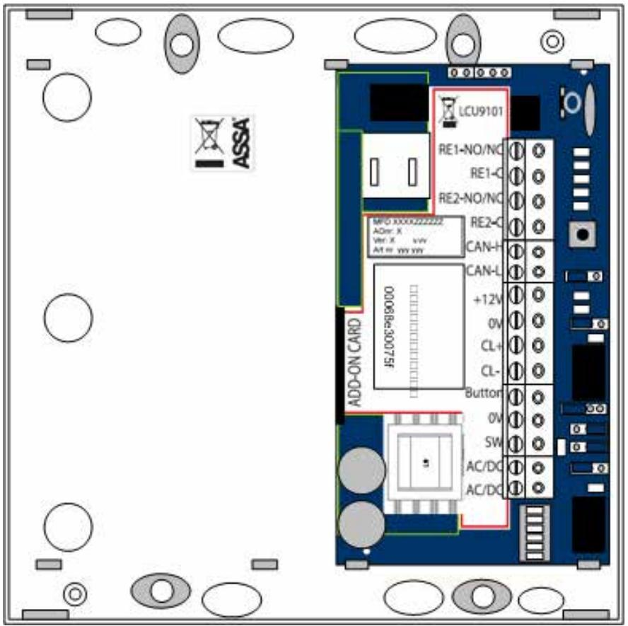

# **LCU9101 med reläkort 400RC64**

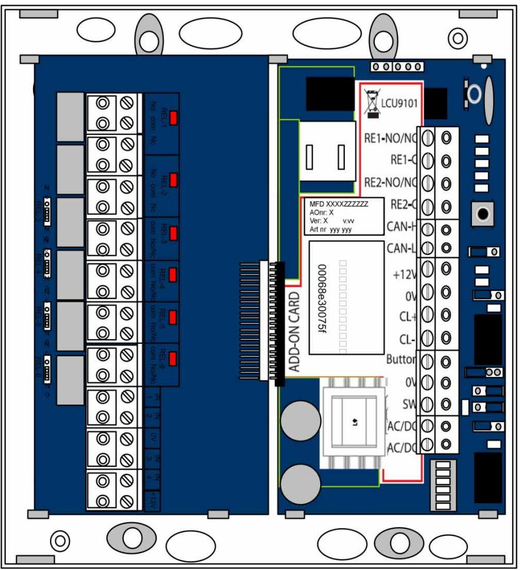

# **Beskrivning av LCU9101 kortet**  00068e30075f

# **Indikeringar**

På kretskortet finns det lysdioder som ger följande indikeringar:

| Power (OK)     | Grön indikering, visar att det finns spänning.                                                                                                              |  |  |  |
|-------------------|-------------------------------------------------------------------------------------------------------------------------------------------------------------|--|--|--|
| WDG (OK)       | Blå indikering, normal blink ca 2 Hz (2 blink/sek.). Släckt – LCU9101 på väg att starta. Fast sken – Fel.                                       |  |  |  |
| A (Gul)        | Blinkar långsamt när undercentralen försöker skapa kontakt med ARX-servern. Lyser med fast sken när undercentralen har kontakt med ARX servern. |  |  |  |
| B (Röd)        | Lyser när undercentralen har meddelanden att sända till ARX-servern.                                                                                     |  |  |  |
| C (Grön)       | Tar emot data.                                                                                                                                              |  |  |  |
| D (Grön)       | Initierat CL motorlås funnet.                                                                                                                               |  |  |  |
| OL (Overload)  | Lyser när överströmsskyddet till 12V ut klämma +12V/0V (matning läsare mm.) är utlöst.                                                                   |  |  |  |
| CL (Röd)          | Lyser när läsare är anslutna till CL+/CL- porten.                                                                                                        |  |  |  |
| 12v Over (Röd) | Lyser när överströmsskyddet till 12V ut, via RE1 NO/C, är överbelastat.                                                                            |  |  |  |
|                   | LED RE1/RE2 lyser när reläet är draget.                                                                                                                     |  |  |  |
| Link              | Lyser vid länk.                                                                                                                                             |  |  |  |
|                   | Släckt då ingen länk finns.                                                                                                                                 |  |  |  |
| 100M              | Lyser vid 100Mbit kommunikation.                                                                                                                            |  |  |  |
|                   | Släckt då ingen 100Mbit kommunikation finns.                                                                                                                |  |  |  |
| ACT               | Blinkar vid aktivitet på Ethernet-porten.                                                                                                                   |  |  |  |
|                   | Släckt då ingen aktivitet finns på Ethernet-porten.                                                                                                         |  |  |  |

PW R

# **LCU9101 Inställningar DIP-omkopplare**

## **DIP1 Telnet**

Om DIP1 står i läge ON när LCU9101 startas är det möjligt att kommunicera via Telnet med centralen. Används när centralen ska konfigureras via Ethernet-kontakten.

## **DIP2 Initiera motorlås**

DIP2 i läge ON initierar "Current Loop" motorlås att arbeta tillsammans med central LCU9101. När motorlåset är installerat ställs DIP2 i läge ON och centralen startas om. När centralen åter har startat tänder LED "D" grönt när motorlåset är funnet och initierat. Ställ tillbaka DIP2 till OFF samt sätt tillbaka eventuell "Learn" bygel på motorlåset.

#### **DIP3 Balanserad dörrbladslägesgivare**

DIP3 i läge ON och två motstånd på 2,2KΩ monterade på dörrkontakten, centralen ska därefter startas om.

## **DIP4 Fast IP 192.168.1.250**

Kan användas när man önskar sätta upp centralen med hjälp av en TP-kabel, används tillsammans med DIP1.

#### **DIP6 Master reset samt testläge**

När DIP6 ställs i läge ON gör centralen en *master reset* på samtliga parametrar vid uppstart och återställer LCU9101 till fabriksinställningar, samt ställer LCU9101 i testläge.

OBS! När detta görs kommer LCU9101 förlora alla inställningar och ny information måste laddas ut till LCU9101. I testläget kan man prova installerade läsare och lås, däremot inte motorlåset. Normalläget för DIP6 är OFF.

# **Strömförbrukning**

#### **Egenförbrukning Se Tabell 1**

Tabellen nedan visar strömförbrukningen i centralenheten vid kommunikation med DAC, PCR eller DBL (inte drift av DAC, PCR, DBL).

|  |  | D1 – D4 = DAC-dörrar, A5 – A16 = Aperio ComHub dörrar. |  |  |  |  |  |
|--|--|--------------------------------------------------------|--|--|--|--|--|
|--|--|--------------------------------------------------------|--|--|--|--|--|

| DAC, PCR, DBL   | D1  | D2      | D3      | D4      | A5      | A6      | A7      | A8      |
|-----------------|-----|---------|---------|---------|---------|---------|---------|---------|
| 24V till RX9101 | 70  | 100     | 120     | 140     | 167     | 184     | 201     | 218     |
|                 | mA  | mA      | mA      | mA      | mA      | mA      | mA      | mA      |
|                 | A9  | A1 0 | A1 1 | A1 2 | A1 3 | A1 4 | A1 5 | A1 6 |
|                 | 235 | 252     | 269     | 286     | 303     | 320     | 337     | 354     |
|                 | mA  | mA      | mA      | mA      | mA      | mA      | mA      | mA      |

#### **Tabell 1**

Beräkningsexempel på strömförbrukning för ett system.

Från Tabell 1, tar vi LCU9101 egenförbrukning vid kommunikation med DAC och Aperio hub.

En hub drar ca 15 – 20mA och för kommunikationen till en DAC, se D2 – D4 Tabell 1.

I vårat exempel har vi två trådbundna dörrar samt fyra stycken Aperio hub. Beräkningen för att få fram viloströmmen blir då:

| LCU9101 inklusive DAC    | 100mA |
|--------------------------|-------|
| 4 Aperio ComHub (4x20mA) | 80mA  |
| Egenförbrukning DAC ca   | 70mA  |
| Läsare från Tabell 4     | 200mA |
| Ca Summa                 | 450mA |

 * Vid användning av 24V ellås, ska DAC och LCU matas med 24V.

# **DAC**

| 24V matning KP-1:1&2                                          | 17 – 24V AC/DC *            |  |
|---------------------------------------------------------------|--------------------------------|--|
| Temperaturområde                                              | +5°C – +40°C                |  |
| Egenförbrukning DAC, PCR, DBL                                 | 24V DC Max 50 – 100mA |  |
| Strömförbrukning reläkort                                     | Ca 20mA/relä                   |  |
| Relä maximal last                                             | 1A                             |  |
| Sammanlagd 12V belastning i DAC,                              |                                |  |
| det vill säga elslutbleck, läsare och 12V re glerad utgång | Max 0,7A (700mA)               |  |

**Tabell 2** 

Tabellen nedan visar strömförbrukningen för DAC matad med 24V

och med 1 respektive 2 läsare inkopplade.

|                   | Låst läge | Olåst läge | Därav belys ning i läsare |
|-------------------|-----------|------------|------------------------------|
| DAC matad med 24V | 70mA      | 100mA      |                              |
| 1 Läsare          | 155mA     | 210mA      | 15 – 20mA                 |
| 2 Läsare          | 240mA     | 290mA      | 30 – 40mA                 |

**Tabell 3** 

**Tabellen nedan visar DAC matad med 24V och med inkopplat motorlås.** 

|                                                   | Vid gång                    |                   | Bromsad                                                                                         | Normalläge/ Vänteläge                                           |  |
|---------------------------------------------------|-----------------------------|-------------------|-------------------------------------------------------------------------------------------------|--------------------------------------------------------------------|--|
| DAC, PCR, DBL 24V-matad och motor lås | Starts pik i 0,1 sek. | Övrig drifttid | Kör i 3 sek., uppe håll 4 sek. i 5 för sök. Därefter, kör i 1 sek., uppehåll 1 min. | Plus Tabell 5 multipli cerat med antalet lä sare |  |
| EL650                                             | 550mA                       | 280m A         | 700mA                                                                                           | 190mA                                                              |  |
| 8164                                              | 700mA                       | 330m A         | 750mA                                                                                           | 190mA                                                              |  |
| 8000S                                             | 450mA                       | 180m A         | 500mA                                                                                           | 140mA                                                              |  |
| 810/811S                                          | 400mA                       | 150m A         | 400mA                                                                                           | 140mA                                                              |  |

#### **Tabell 4**

#### **Läsare**

| Spänning in      | 12V (från DAC)    |
|------------------|-------------------|
| Temperaturområde | -40°C till +85° C |

Tabellerna nedan visar strömförbrukningen för läsare ansluten till

|                                                  | Normal | Max   |
|--------------------------------------------------|--------|-------|
| 6485EM/6585MF ansluten till DAC matad med 24V | 100mA  | 190mA |

**Tabell 5** 

# **1 dörr**

- 1 LCU9101,
- 1-2 6485EM eller 6585MF läsare
	- 1 TKN1, TKN2 eller TKN40 Öppnarknappar
	- 1 Elslutbleck
	- 1 2450PS eller nätverksswitch med stöd för PoE

# **4 dörrar**

- 1 LCU9101, inklusive ett 9101D3 kort
- 3 DAC, PCR eller 1-4 DBL
- 4-8 6485EM eller motsvarande (När DAC används)
	- 4 TKN1, TKN2, TKN40 eller TKN50 Öppnarknappar
	- 4 Elslutbleck
	- 3 Hi-O Motorlås via DAC530/DAC564
	- 1 2450PS eller fler om anläggningen så kräver

# **4 dörrar samt 12 Aperio dörrar**

- 1 LCU9101, inklusive ett 9101D3 kort med 9101D3A kort på.
- 3 DAC, PCR eller 1-4 DBL
- 4-8 6485EM eller motsvarande (När DAC används)
	- 4 TKN1, TKN2, TKN40 eller TKN50 Öppnarknappar
	- 4 Elslutbleck
- 3 Hi-O Motorlås via DAC530/DAC564
- 1-12 Aperio ComHub med tillhörande låsenhet E100/C100
	- 1 2450PS eller fler om anläggningen så kräver

#### **Kablage, dimensionera kablarna**

Vid kabeldragning är det viktigt att använda rätt typ av kabel.

| ENHET                       | AVSTÅND    |
|-----------------------------|------------|
| DAC, PCR, DBL – LCU9101* | 500 METER  |
| DAC/LCU9101 – LÄSARE# | 500 METER  |
| Aperio hub – LCU9101  | 1000 METER |

* DAC, PCR, DBL – lokalt vid dörr.

# Avståndet kan vara upp till 500 meter (totalt), men normalt är en DAC/LCU9101 lokalt placerad vid respektive dörr.

Det är mycket viktigt att dimensionera kablarna rätt för att undvika spänningsfall. Centralenhet, läsare, elslutbleck fungerar alla med en tolerans på ±10 %. Den aktuella strömförbrukningen i respektive enhet och längden på kabeln avgör arean på ledaren.

Formeln för spänningsfallsberäkning är som följer:

Då spänningen är känd: **U** = **S**x2**L** X **I**

**a**

**U = Spänningsfall i Volt.** 

**S = Resistivitet – motstånd per meter och vid 1 mm2 area (för koppar 0,0175).** 

**L = Ledningslängd (enkel längd) i meter mellan strömkälla och last.** 

**a = area i mm2 .** 

**I** = Strömstyrka i Ampere

**U** = 0,0175x200 X 0,2 **U** = 3,5V 0,2

Spänningsfallet på 100 meter, med en kabelarea på 0,2 mm2 och en strömstyrka på 200mA ger 3,5V i förlust. Det vill säga 20,5V vid lasten.

För spänningsmatning av centralenheten är en tvåledare lämplig.

Telekablar (lågspänning 12/24V DC). partvinnad EKKX är en lämplig standardkabel. Vid risk för störningar bör partvinnad telekabel användas och som ett minimum ha en heltäckande skärm, till exempel ELAKY. Avskärmningen är till för att skydda kabeln från störningar som kan skada eller störa systemets funktion.

# **Installation**

Följande avsnitt beskriver den fysiska installationen av centralen och inkoppling av tillbehör

# **Installation ADD-ON kort**

# **Reläkort 400RC64**

För att få tillgång till samtliga ut- och ingångar måste reläkort DAC400RC64 anslutas.

Anslutning av reläkort sker på följande sätt:

- 1. Slå av strömmen till LCU9101
- 2. Snäpp loss LCU9101 från lådan
- 3. Rikta kontaktstyckena mot varandra
- 4. Se till att korten ligger i plan med varandra
- 5. Skjut ihop korten
- 6. Snäpp fast korten i lådan
- 7. Slå på strömmen

LCU9101 + RC64 är driftklara.

Samma förfarande som ovan gäller för ADD-ON kort 9101R4850 samt 9101D3 och 9101RC64

# **18** LCU9101

## **Bygelfält**

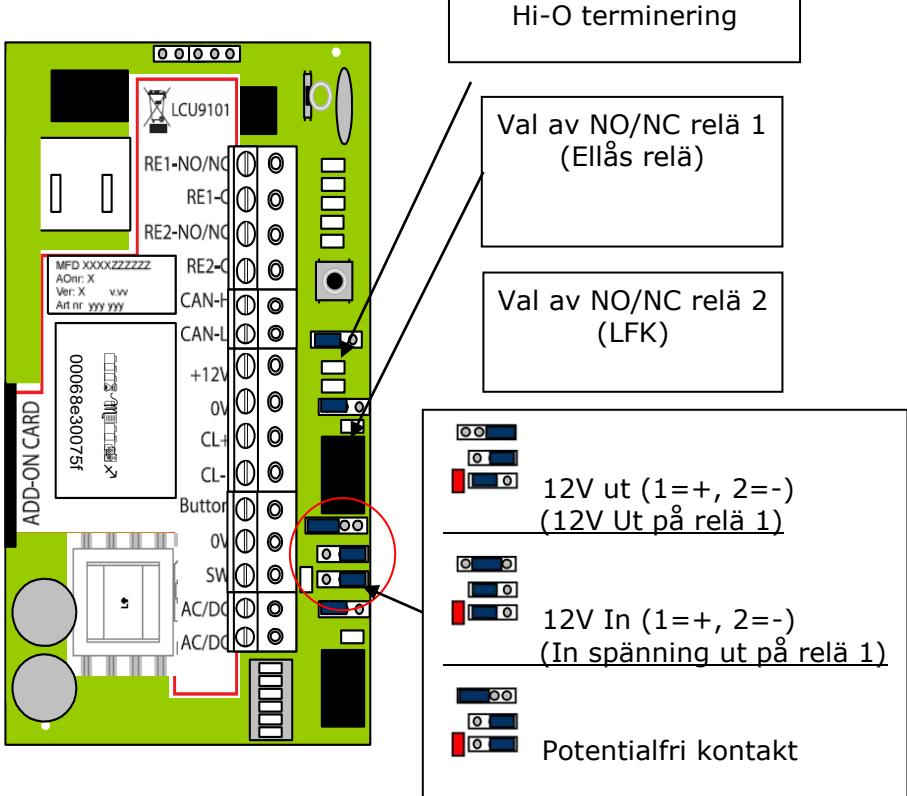

DIP-omkopplare

- DIP1 Telnet ON/OFF
- DIP2 I läge ON initiering motorlås
- DIP3 Balanserad dörrbladslägeskontakt
- DIP4 Fast IP 192.168.1.250
- DIP5 Används ej
- DIP6 Master reset samt testläge

## **Kopplingsplintar**

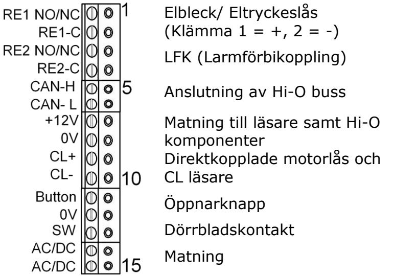

LCU9101 kan inte matas med 12V!

Fri/D-N (DAC400RC64 (IN1 (6&4)) Dag/Natt-funktion för motorlås.

Funktionen ställs via ARX enligt följande: olåst direkt eller olåst efter första passage.

Bygling till 0V=Dag.

Fungerar som fri ingång när motorlås inte används. I båda fallen genereras en händelse vid förändring.

Öppnarknapp Button: (11 & 12)

Olåst vid slutning till 0V. Dörren låser om ingången förblir sluten, "flanktriggad".

Dörrövervakningskontakt (Door monitor:12 & 13)

Dörren antas vara stängd när klämma 13 är kopplad till 0V (klämma 12) när DIP3 = OFF

DIP3 ON = Balanserad ingång på Door monitor se sidan 10.

OK=2,2 k

När direktinkopplat motorlås är anslutet arbetar ingången parallellt med magneten i låset.

LCU9101 måste startas om efter att DIP3 =ON Balanserat läge är valt.

Elslutbleck (1 & 2) Spole.

För funktion och spänning se bygelfält på sidan 18

LFK (3 & 4) LarmFörbiKoppling

NO = Normalläge

Blockeringsingång (DAC-RC64 (IN3 (3 & 4))

Syftet med ingången är att förhindra tillträde till en larmad sektion. När denna ingång är bruten blir LCU9101 blockerad. LCU9101 kommer inte att acceptera öppnarknapp eller giltiga kort.

## **Initiering motorlås**

ASSA Classic (8000S, 8001S tom maj -04)

 Abloy (8164-II, 8165-II, EL650-II)

- 1. Med strömmen avslagen, ta bort "Learn" kontakten (på motorlåset), den med en bygel på.
- 2. Ställ DIP2 i läge ON.
- 3. Slå på strömmen, då LCU9101 har startat upp och LED "D" grön lyser fast är motorlåset initierat.
- 4. Slå av strömmen och ställ DIP2 i OFF läge.
- 5. Placera åter "Learn" bygeln på sin plats.
- 6. Slå på strömmen,
- 7. Provkör låset.

ASSA Evolution (810S, 811S) ASSA Classic (8000S, 8001S från maj -04)

Med strömmen avslagen och regel inne:

- 8. Ställ alla DIP2-omkopplare i läge ON.
- 9. Slå på strömmen, då LCU9101 har startat upp och LED "D" grön lyser fast är motorlåset initierat.
- 10.Slå av strömmen och ställ DIP2 i OFF läge.
- 11.Slå på strömmen,
- 12. Provkör låset

Tänk på att vid byte av LCU9101 ska initiering av motorlås göras.

| 7 & 8 skall vara ->                                                                                | 12V (7 =plus) (8=minus)                                                                                                                                                                            |
|----------------------------------------------------------------------------------------------------|----------------------------------------------------------------------------------------------------------------------------------------------------------------------------------------------------|
| 9 & 10 skall vara ->                                                                               | Ca 2V x antalet enheter.                                                                                                                                                                           |
| (9 = plus och 10 = minus) Obs! De angivna volttalen till hö ger är ungefärliga värden. | Exempelvis ett motorlås och en läsare, 2 x 2V = 4V En polvänd enhet ger ca 0,7V Om detta skulle vara fallet ovan, skulle värdet varit 2,7V i stället för 4V. 12V = Bruten slinga |

# **Tilläggskort för anslutning av Aperio dörrar**

## **9101D3 för anslutning av flera dörrar via DAC**

Anslutningar för dörr 2 – 4 via DAC, PCR eller DBL för respektive dörr görs på 9101D3 kortet. Strömförsörjningen till dörrdetaljerna (DAC, PCR, DBL) ansluts till kortet. Om även Aperio dörrmiljöer ska anslutas kompletteras kortet med ett 9101D3A kommunikationskort.

## **9101D3A för anslutning av Aperio-dörrar**

9101D3 kortet kan kompletteras med ett kommunikationskort 9101D3A för kommunikation med Aperio-dörrar via ComHub och dörrenhet E100S eller C100S. 1 – 15 Aperio dörrmiljöer kan anslutas, dock max 16 dörrar totalt. 9101D3A-kortet placeras på 9101D3.

## **9101R4850 för anslutning av Aperio-dörrar**

9101R4850-kortet används då man enbart önskar att kommunicera med Aperio dörrmiljöer. 1 – 15 Aperio dörrmiljöer kan anslutas samt den trådbundna dörren till huvudkortet.

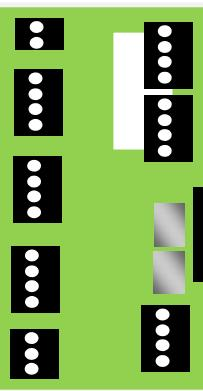

Aperio RS485 Port B

**9101D3 9101D3A 9101R4850** 

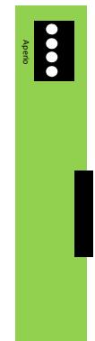

9101D3-kortet har två ingångar samt två programmerbara reläer. IN3 är blockeringsingången och den ska vara byglad för att dörrarna inte ska vara blockerade.

IN4 är *Larm till* eller *Larm till/från* beroende på vilket som väljs i ARX.

# **DAC Adressering & Hi-O Initiering**

## **Initiering och adressering av DAC430, PCR, DBL**

(Med motorlås; se vidare i DAC-manualen. Observera att en DAC530 kräver att annat tillvägagångssätt, vilket beskrivs på nästa sida.)

Gör enligt följande:

- 1. Med spänningen avslagen, ställ alla DIP-omkopplare i OFF.
- 2. Slå på spänningen (ca 10 sekunder). Då lysdioden WDG blinkar snabbt är enheten åter inställd till sina standardvärden.
- 3. Slå av spänningen och adressera DAC, PCR, DBL.
- 4. Slå på spänningen.

DIP-omkopplarna är numrerade 1 – 8 och 1 – 5 används för adressering.

Tabellen visar hur DIP-omkopplarna ska ställas vid adressering av DAC, PCR, DBL:

| Dörr/DIP | 1  | 2  | 3  | 4  | 5  |
|----------|----|----|----|----|----|
| 1        | ON |    |    |    |    |
| 2        |    | ON |    |    |    |
| 3        | ON | ON |    |    |    |
| 4        |    |    | ON |    |    |
| 5        | ON |    | ON |    |    |
| 6        |    | ON | ON |    |    |
| 7        | ON | ON | ON |    |    |
| 8        |    |    |    | ON |    |
| 9        | ON |    |    | ON |    |
| 10       |    | ON |    | ON |    |
| 11       | ON | ON |    | ON |    |
| 12       |    |    | ON | ON |    |
| 13       | ON |    | ON | ON |    |
| 14       |    | ON | ON | ON |    |
| 15       | ON | ON | ON | ON |    |
| 16       |    |    |    |    | ON |

#### **Tabell 6**

**OBS!** Adress 0 används **endast** vid initiering.

DIP-omkopplare 6 ON = Balanserad IN på SW, KP-2:13&14 kolvkontakt/dörrblad. Se vidare på sidan **Fel! Bokmärket är inte definierat.**.

DIP-omkopplare 7 OFF

DIP-omkopplare 8 OFF

# **Initiering och adressering av DAC530**

Innan du påbörjar driftsättningen, måste du bestämma hur motorlåset eller elslutblecket skall användas, dvs. skall intern eller extern dörrlägesgivare användas i motorlåset och/eller skall elslutblecket arbeta i rättvänd eller omvänt läge. Notera att DIPomkopplarnas funktion skiljer sig åt i initieringsläge och driftläge.

#### **A Installera och lås en nyinstallerad Hi-O dörrmiljö**

#### **A1 Anslut Hi-O enheterna till DAC**

Var noga med att koppla in kablarna mellan Hi-O enheten och DAC530/DAC564 rätt, CAN H till CAN H och CAN L till CAN L.

#### **A2 Anslut kablar till spänning**

Anslut spänningsmatning till Hi-O enheten från DAC. Vänta med att slå på spänningen.

#### **A3 Välj grupp för Hi-O enheten**

Välj rätt grupp på Hi-O enheten, 1 eller 2 beroende på vilken enhet som är installerad.

Grupp 1 = utsida (yttre läsare, motorlås, elbleck eller öppnarknapp RTE).

Grupp 2 = insida (inre läsare eller yttre öppnarknapp för dörrautomatik).

#### **A4 Säkerställ att DAC530/DAC564 är terminerad**

Detta görs genom att sätta termineringsbygeln i läge ON i DAC.

#### **A5 Initiera och lås Hi-O enheterna till DAC.**

- a) Med spänningen avslagen ställ DIP-omkopplare 7 och "Door monitor" ingången i önskat läge för att initiera rätt funktion i enheten (se initieringsmatris på sidan 28)
- b) Slå på spänningen.
- c) Vänta tills WDG dioden (blå) blinkar snabbt och PWR dioden (gul) lyser fast (kan ta upp till 3 minuter, normalt ca 45 sekunder).
- d) Stäng av spänningen.

#### **A6 Adressera DAC till önska adress.**

Notera att "Door monitor" ingången skall vara bygglad i driftläge om den inte används.

#### **A7 Dörrmiljön är nu konfigurerad och låst till berörd DAC.**

#### **B Lägg till ytterligare Hi-O enhet till en låst Hi-O dörrmiljö.**

#### **B1 Med spänningen avslagen, anslut nya olåsta Hi-O enheter**

#### **enligt A1 – A3.**

#### **B2 Initiera och lås Hi-O enheterna (och därmed dörrmiljön)**

- a) Med spänningen avslagen ställ DIP-omkopplare 7 och "Door monitor" ingången i önskat läge för att initiera rätt funktion i enheten (se initieringsmatris sidan 28)
- b) Slå på spänningen.
- c) Vänta tills WDG dioden (blå) blinkar snabbt och PWR dioden (gul) lyser fast (kan ta upp till 3 minuter, normalt ca 45 sekunder).
- d) Stäng av spänningen.

#### **B3 Adressera DAC till önskad adress.**

Notera att "Door monitor" ingången skall vara bygglad i driftläge om den inte används.

#### **B4 Dörrmiljön är nu konfigurerad och låst till DAC**

Kommunikationen i Hi-O dörrmiljön är nu krypterad, låst till berörd DAC och säker. Det innebär att nya enheter inte kan anslutas. Enheterna i dörrmiljön kan heller inte flyttas, utan att först låsas upp.

Om ytterligare enheter i efterhand läggs till måste initieringen utföras igen. För att bibehålla tidigare funktion, se DAC initieringsmatris på sidan 28.

#### **C Flytta eller ta bort låst Hi-O enhet**

#### **Viktigt att notera**

*Se alltid till att låsa upp Hi-O enheter när du tar bort dem från en dörrmiljö, om du inte gör det kan de inte användas i annan dörrmiljö.* 

#### **C1 Lås upp dörrmiljön och Hi-O konfigurationen i vilken berörd Hi-O enhet finns.**

a) Med spänningen avslagen, ställ samtliga DIP-omkopplare i OFF.

- b) Håll sabotagekontakten intryckt och slå på spänningen
c) Håll kvar sabotagekontakten tilldess WDG dioden (blå) blinkar långsamt.

d) Vänta till WDG dioden (blå) blinkar fort och PWR dioden (gul) tänds.

- e) Slå av spänningen
- f) Du kan nu ta bort Hi-O enheten

#### **C2 Initiera och lås Hi-O enheterna (därmed dörrmiljön)**

- a) Med spänningen avslagen ställ DIP-omkopplare 7 och "Door monitor" ingången i önskat läge för att initiera rätt funktion i enheten (se initieringsmatris på sidan 28)
- b) Slå på spänningen.
- c) Vänta tills WDG dioden (blå) blinkar snabbt och PWR dioden (gul) lyser fast (kan ta upp till 3 minuter, normalt ca 45 sekunder).
- d) Stäng av spänningen.

#### **C3 Adressera DAC530/DAC564 till önskad adress.**

Notera att "Door monitor" ingången skall vara bygglad i driftläge om den inte används.

Kommunikationen i Hi-O dörrmiljön är nu krypterad, låst och säker. Det innebär att "Plug-and-play" läget är avstängt och att nya enheter inte kan anslutas. Enheterna i dörrmiljön kan heller inte flyttas, utan att först låsas upp.

Om ytterligare enheter i efterhand läggs till måste initieringen utföras igen för att bibehålla tidigare funktion. Se DAC initieringsmatris.

# **Initieringsmatris DAC530, DAC564**

(Notera att detta gäller vid initiering och inte i driftläge)

| Door monitor in | DIP 7 – El |                                                                      |
|-----------------|---------------|----------------------------------------------------------------------|
| gång            | bleck         | Förklaring                                                           |
| Sluten          | OFF           | Givare i motorlås aktiv. Rättvänd funktion på elbleck       |
|                 | ON            | Givare i motorlås aktiv. Omvänd funktion på elbleck         |
| Öppen           | ON            | Givare i motorlås inak tiv. Omvänd funktion på elbleck      |
|                 | OFF           | Givare i motorlås inak tiv. Rättvänd funktion på elbleck |

Notera! Om elblecket används i omvänd funktion, måste det även mekaniskt ändras till detta läge.

#### **Adressering Hi-O enheter**

Grupp 1 = yttre läsare, motorlås, elbleck eller öppnarknapp RTE. Grupp 2 = inre läsare eller yttre öppnarknapp för dörrautomatik.

# **Installation Hi-O Komponenter**

Anslutningsskisser, Hi-O komponenter.

Hi-O enheterna kan anslutas som en buss eller som en stjärnkoppling.

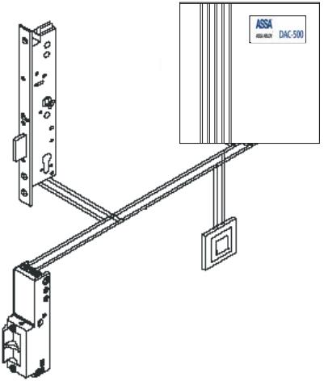

Terminering görs normalt endast i DAC och då genom att sätta termineringsbygeln i läge ON.

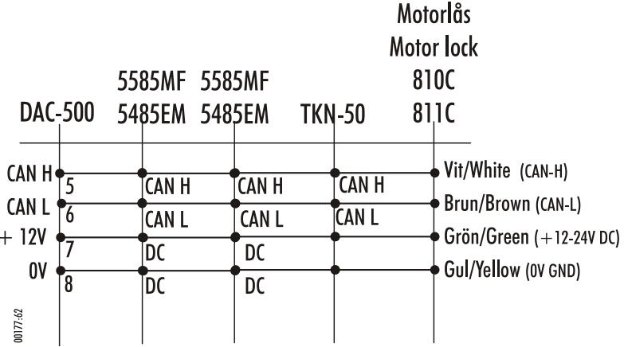

# **Adressering CL läsare**

CL Läsare

(Adresseringen gäller inte Hi-O läsare)

Vid anslutning av en läsare till DAC skall adressen vara 0 (noll).

Vid anslutning av både yttre och inre läsare skall den yttre ha adress 0 (noll) och den inre läsaren adress 4 (fyra).

Yttre läsare = Alla DIP-omkopplare i läge OFF (adress 0)

Inre läsare = DIP-omkopplare 3 i läge ON (adress 4)

| Läsare/DIP | 1   | 2   | 3   | 4   |
|------------|-----|-----|-----|-----|
| Yttre (0)  | OFF | OFF | OFF | OFF |
| Inre (4)   | OFF | OFF | ON  | OFF |

**OBS!** Används andra läsartyper tillsammans med Interface

6390IF ska interfacet adresseras på samma sätt som ovan.

# **LCU9101 Installation hårdvara**

**Anslutningar av läsare till LCU9101** 

#### **En läsare**

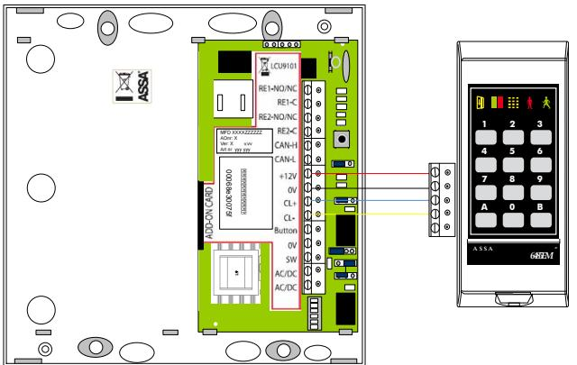

Yttre läsare DIP1-3 i

läge OFF

# **32** LCU9101

#### **Två läsare**

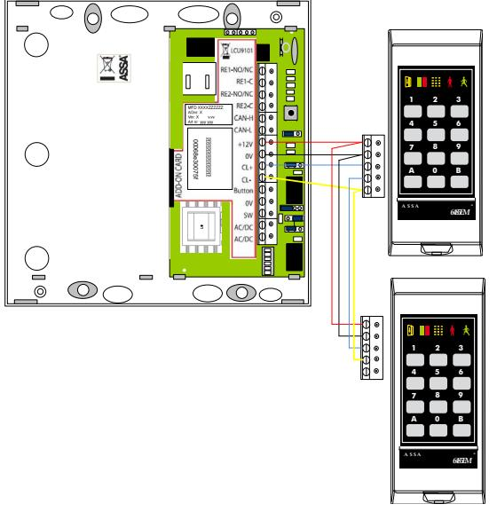

Inre läsare DIP3 I

läge ON

### **El bleck med dörrbladsavkänning samt öppnarknapp.**

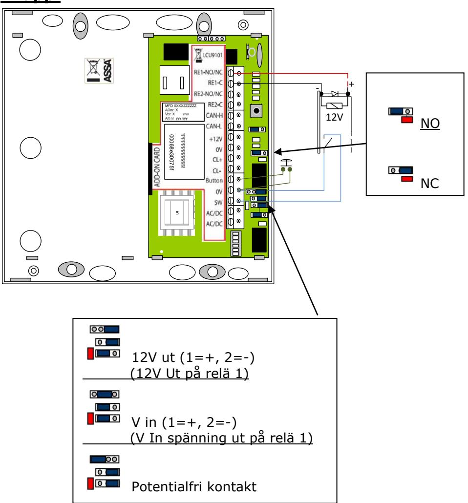

# **34** LCU9101

#### **LCU9101 med ADD-ON kort 9101D3 och DAC**

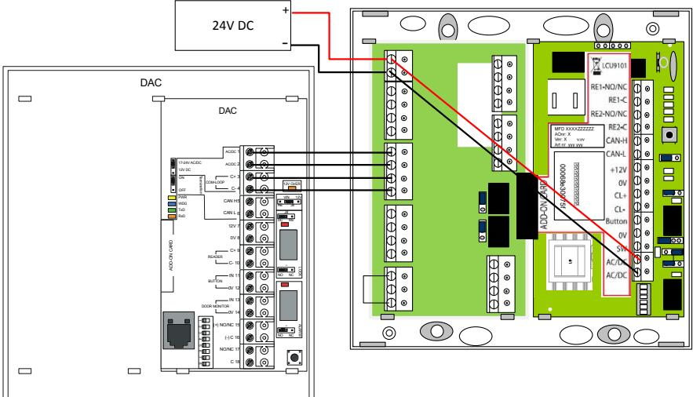

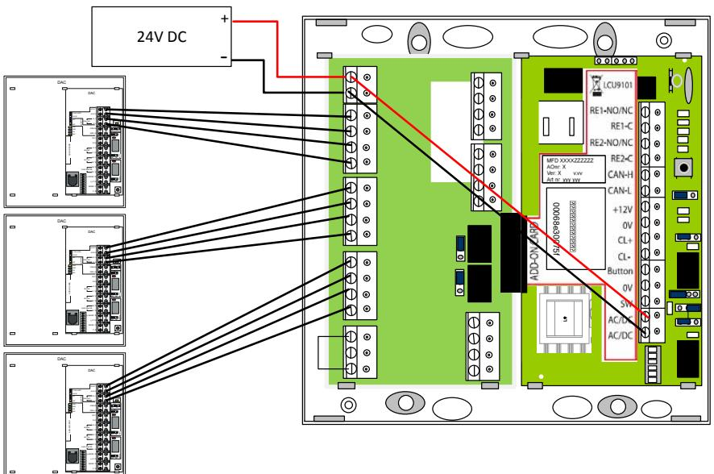

Adressera DAC till rätt adress så att det motsvara inställningarna i programmet!

#### **Direktkopplad DBL342, DBL350/352 till LCU9101**

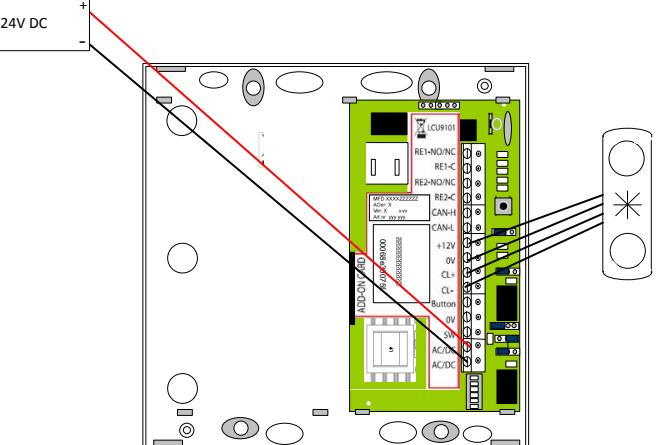

LCU9101 kan även hantera DBL kopplade direkt till centralen, den direktkopplade DBL adresseras till 1 (DIP1 = ON). Anslutningen görs till 12V, 0V, CL+, CL- på huvudkortet. **OBS!** PCR eller DAC ska inte anslutas direkt till huvudkortet.

Man kan även ansluta upp till ytterligare tre DBL enheter till centralen när man har 9101D3 kortet installerat, eller en mix med DAC. Adresseringen gör på samma sätt som adresseringen av DAC se sidan 49

# **36** LCU9101

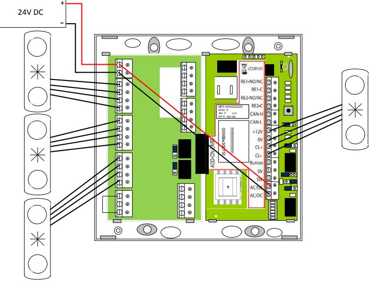

# **Aperio hub eller läsare via ADD-ON kort**

**Voxio (9101R4850) eller (9101D3 med 9101D3A)**

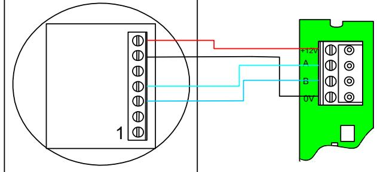

#### **Aperio hub AH13 eller AH30 via (9101R4850) eller (9101D3 med 9101D3A)**

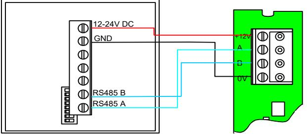

För adressering av RS485 läsare samt ComHub, se tabel på sidan 49 - 50.

Maxlängd på kabel till ComHub är 1000 meter. Vid kabellängder över 500 meter rekommenderas att 24V DC används som matning till ComHub-slingan. Se även ComHub-manualen för hur termineringen ska vara utförd.

Använd spänningsfallsberäkningen på sidan 11.

**Aperio hub AH13 1-1 (9101D3 med 9101D3A)** 

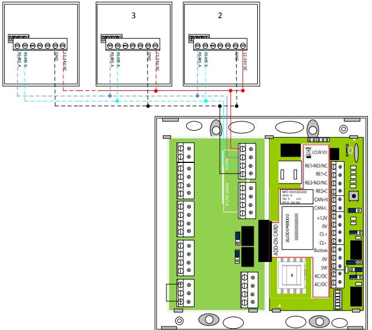

Maxlängd på kabel till ComHUB AH13 1-1 samt AH30 1-8 är 1000 meter. Vid kabellängder över 500 meter rekommenderas att 24V DC används som matning till ComHub-slingan. Se även ComHubmanualen för hur termineringen ska vara utförd. Använd spänningsfallsberäkningen på sidan 11.

Aperio ComHUB AH13 1-1 adresseras från 2-15 för dörrposition 2-15 och dörrposition 16 adresseras som 1. I programmet installeras

#### **Anslutning Aperio AH30 1-8 hub**

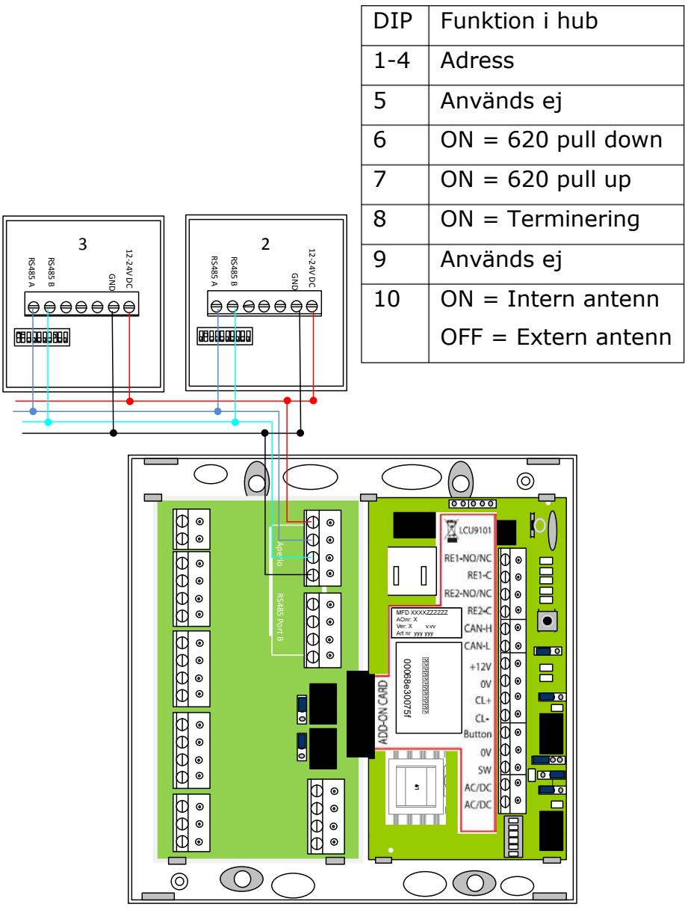

#### **Terminering av Aperio HUB RS485 buss**

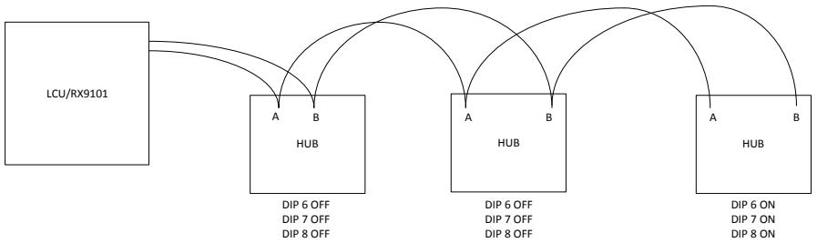

Den sista Aperio hub ska ha termineringen aktiverad.

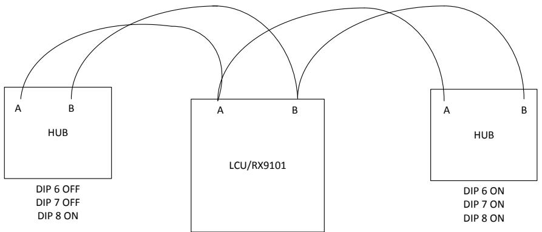

Om installationen är dragen i ett stjärnnät aktivera termineringen enligt bilden ovan.

#### **Aperio AH30 samt AH13 hub adressering.**

- A) Adresserad hub, exempelvis till adress 2.
- B) Anslut hub till LCU9101 centralen
- C) Para samman låsen med aktuell hub, med hjälp av PAP programmet.
- D) I ARX programmet scanna, för att koppla samman Aperio låsenheterna med aktuell dörr, se ARX manual för mer information.

| Värde på DIP ->  | 1  | 2  | 4  | 8  |
|------------------|----|----|----|----|
| Adress / HUB DIP | 1  | 2  | 3  | 4  |
| Adress 1         | ON |    |    |    |
| Adress 2         |    | ON |    |    |
| Adress 3         | ON | ON |    |    |
| Adress 4         |    |    | ON |    |
| Adress 5         | ON |    | ON |    |
| Adress 6         |    | ON | ON |    |
| Adress 7         | ON | ON | ON |    |
| Adress 8         |    |    |    | ON |
| Adress 9         | ON |    |    | ON |
| Adress 10        |    | ON |    | ON |
| Adress 11        | ON | ON |    | ON |
| Adress 12        |    |    | ON | ON |
| Adress 13        | ON |    | ON | ON |
| Adress 14        |    | ON | ON | ON |
| Adress 15        | ON | ON | ON | ON |

#### **Plintbeskrivning 9101D3 kortets anslutningar**

Aperio kommunikationsport samt matning för hub. Matning ut 12V Max last 250mA

# **Felsökningsguide och indikationer för Aperio**

| Efter presentation av kort/tagg |                                           |
|---------------------------------|-------------------------------------------|
| Gul blink                       | Dörrenheten har avläst kort/tagg          |
| Grön LED                        | Tillträde beviljat                        |
| Röd LED                         | Tillträde nekat                           |
| Tre långsamma röda blinkningar  | Ingen kommunikation till LCU eller hub |

Hub

| LED Lyser fast grönt Hub kommunicerar med LCU9101 centralen LED Lyser grönt blinkar till rött Kommunikations fel mellan HUB och lås en gång. LED Lyser grönt blinkar till rött Kommunikations fel hub - LCU9101 centralen två gånger. LED Lyser grönt blinkar till rött Kommunikations fel mellan hub och lås, samt tre gånger. kommunikations fel mellan hub och LCU9101 cen- tralen | LED på hub                   | Beskrivning                    |
|---------------------------------------------------------------------------------------------------------------------------------------------------------------------------------------------------------------------------------------------------------------------------------------------------------------------------------------------------------------------------------------------------------------------------|------------------------------|--------------------------------|
|                                                                                                                                                                                                                                                                                                                                                                                                                           |                              |                                |
|                                                                                                                                                                                                                                                                                                                                                                                                                           |                              |                                |
|                                                                                                                                                                                                                                                                                                                                                                                                                           |                              |                                |
|                                                                                                                                                                                                                                                                                                                                                                                                                           |                              |                                |
|                                                                                                                                                                                                                                                                                                                                                                                                                           | LED lyser gult/ blinkar gult | Hub uppkopplad mot PAP program |

| LED på låsenhet C100/E100                               | Beskrivning                                                         |
|---------------------------------------------------------|---------------------------------------------------------------------|
| Blinkat med tre röda blink, när man visar ett kort.  | Kommunikationsproblem med lås och hub eller med hub och LCU9101. |
| Blinkar tio röda blink                                  | Låsenheten kan inte låsa.                                           |
| Blinker gult var 5 sekund                               | Batteriet ska bytas.                                                |
| LED blinkar en röd samt en grön, efter batteri byte. | Enhet Ok.                                                           |

**44** LCU9101

# **DAC Installation hårdvara**

#### **Anslutning av elslutbleck, dörrkontakt och öppnarknapp till DAC**

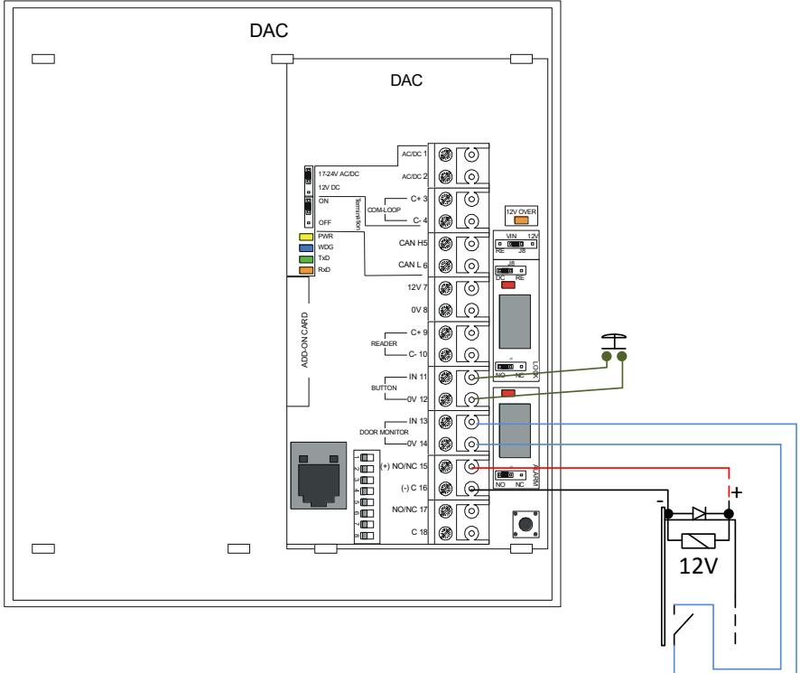

#### **Anslutning av öppnarknapp och läsare till DAC**

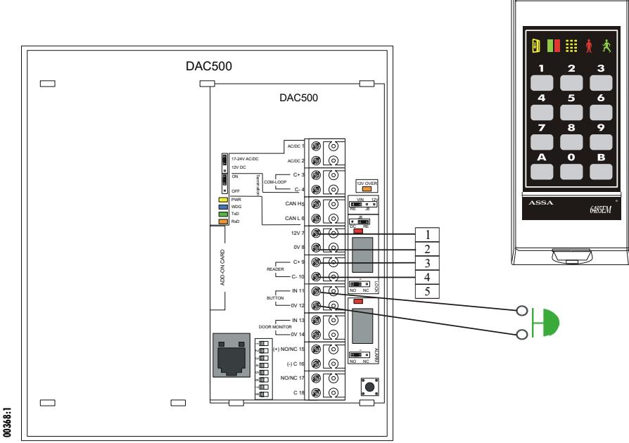

Läsarens adress = 0 (DIP 1 – 3 = OFF)

#### **Anslutning av inre och yttre läsare på samma dörr**

#### Inside reader Outside reader

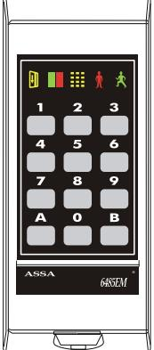

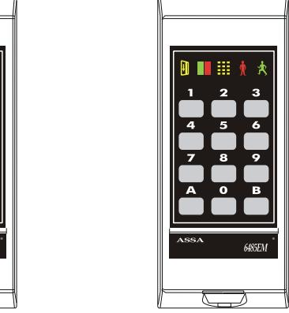

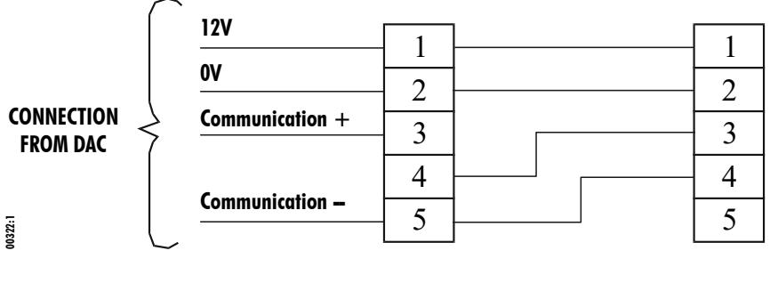

DIP 3 = ON DIP1 – 3 = OFF

## **DAC med reläkort 400RC64**

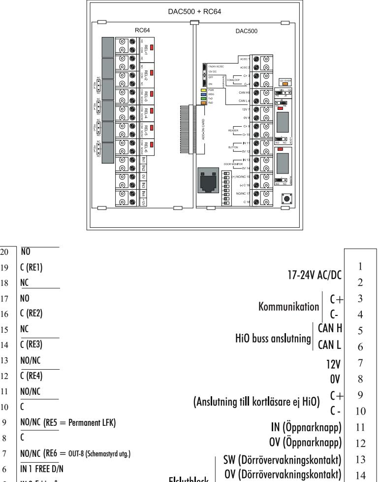

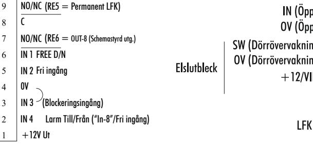

00177:64

# **48** LCU9101

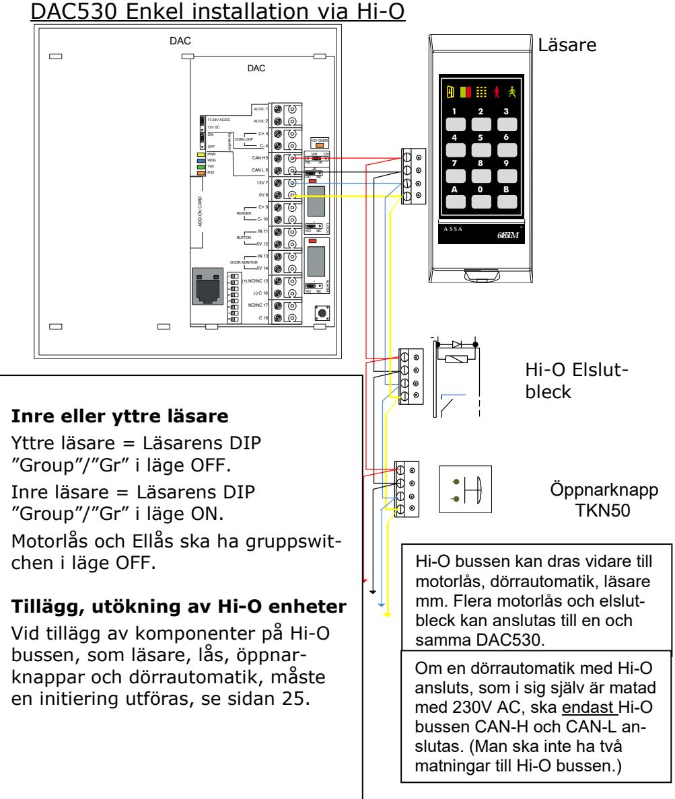

#### **Adressering DAC samt läsare**

| Max 16 dörrar kan anslutas var av 3 DAC anslutna dörras samt 15 Aperio låsenheter 2 – 16 |                                           |    |    |    |    |
|---------------------------------------------------------------------------------------------------|-------------------------------------------|----|----|----|----|
| Adress                                                                                            | DIP 1 DIP 2 DIP 3 DIP 4 DIP 5 |    |    |    |    |
|                                                                                                   | 1                                         | 2  | 4  | 8  | 16 |
| Bas dörr 01                                                                                       | Huvudkort adresseras inte                 |    |    |    |    |
| Dörr 02                                                                                           |                                           | ON |    |    |    |
| Dörr 03                                                                                           | ON                                        | ON |    |    |    |
| Dörr 04                                                                                           |                                           |    | ON |    |    |
| Dörr 05                                                                                           | ON                                        |    | ON |    |    |
| Dörr 06                                                                                           |                                           | ON | ON |    |    |
| Dörr 07                                                                                           | ON                                        | ON | ON |    |    |
| Dörr 08                                                                                           |                                           |    |    | ON |    |
| Dörr 09                                                                                           | ON                                        |    |    | ON |    |
| Dörr 10                                                                                           |                                           | ON |    | ON |    |
| Dörr 11                                                                                           | ON                                        | ON |    | ON |    |
| Dörr 12                                                                                           |                                           |    | ON | ON |    |
| Dörr 13                                                                                           | ON                                        |    | ON | ON |    |
| Dörr 14                                                                                           |                                           | ON | ON | ON |    |
| Dörr 15                                                                                           | ON                                        | ON | ON | ON |    |
| DAC-dörr på dörr pos. 16                                                                    |                                           |    |    |    | ON |

# **Adressering VOXIO RS485 läsare**

|        | DIP 1                                        | DIP 2 | DIP 3 | DIP 4 | DIP 5 |
|--------|----------------------------------------------|-------|-------|-------|-------|
|        | 1                                            | 2     | 4     | 8     | 16    |
| DAC    | Adressering VOXIO RS485 läsare på DAC585  |       |       |       |       |
| Reader |                                              |       |       |       |       |
| (In)   | ON                                           |       |       |       |       |
| (Out)  |                                              |       | ON    |       |       |
| LCU    | Adressering VOXIO RS485 läsare på LCU9101 |       |       |       |       |
| (In)   | ON                                           |       |       |       | ON    |
| (Out)  |                                              |       | ON    |       | ON    |

## **Adressering läsare 6485EM, 6480EM, 7585MF**

(Adresseringen gäller inte Hi-O läsare)

Vid anslutning av en läsare till DAC skall adressen vara 0 (noll).

Vid anslutning av både yttre och inre läsare skall den yttre ha adress 0 (noll) och den inre läsaren adress 4 (fyra).

Yttre läsare = Alla DIP-omkopplare i läge OFF (adress 0)

Inre läsare = DIP-omkopplare 3 i läge ON (adress 4)

| Läsare/DIP | 1   | 2   | 3   | 4   |
|------------|-----|-----|-----|-----|
| Yttre (0)  | OFF | OFF | OFF | OFF |
| Inre (4)   | OFF | OFF | ON  | OFF |

**OBS!** Används andra läsartyper tillsammans med Interface

6390IF ska interfacet adresseras på samma sätt som ovan.

# **Adressering av Hi-O enheter**

Grupp 1 = yttre läsare, motorlås, elbleck eller öppnarknapp RTE. Grupp 2 = inre läsare eller yttre öppnarknapp för dörrautomatik.

#### **Anslutning av direktinkopplat motorlås**

| KP1:7  | Röd  | (+12V) |
|--------|------|--------|
| KP1:8  | Vit  | (0V)   |
| KP1:9  | Gul  | (C+)   |
| KP1:10 | Grön | (C-)   |

#### **Balanserad Dörrövervakningskontakt**

DIP3 ON = Balanserad IN på SW. Motstånd på 2,2k levereras med LCU9101. Dessa värden gäller för ingången på LCU9101 (12&13)

| SAB  | Rin 1,8k         |
|------|---------------------|
| OK   | 1,8k Rin 3,3k |
| LARM | 3,3k Rin 15k  |
| SAB  | Rin 15k          |

Denna funktion innebär att man får hela kedjan (från larmcentral via LCU9101 till dörr) dubbelbalanserad och LCU9101 fungerar som en "detektor". Se bilden nedan.

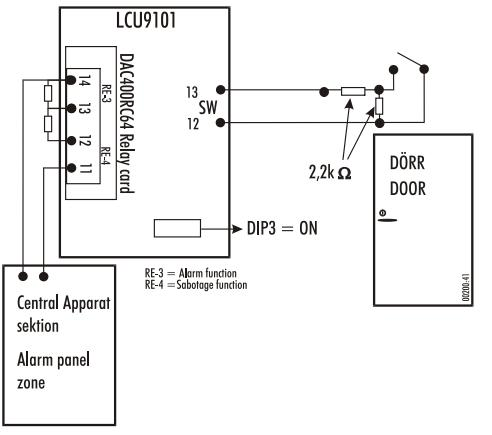

LCU9101 måste startas om efter att DIP3 = ON Balanserat läge är valt.

## **Dag/Natt funktion**

Funktionsval av Dag/Natt ingången ställs in i ARX (IN1 4 & 6) på reläkort DAC400RC64. Låset övergår till DAG läge enligt följande val:

Vid första giltiga passage Omedelbart

#### **Blockeringsingång**

Blockeringsingången på DAC400RC64 (IN3 3 & 4) har prioritet över Dag/Nattingången. Detta innebär att låset kommer att låsa när ingången bryts, oavsett om Dag/Nattingången eller SWingången är sluten.

#### **Dörrlägesgivare (magnet) seriell /parallell**

Ingång (12 & 13) Om standardslutbleck med inbyggd magnet inte kan användas finns här möjlighet att ansluta en extern dörrlägesgivare. När ingången sluts får motorlåset en signal för att låsa.

Denna ingång arbetar normalt parallellt med den i motorlåset inbyggda givaren på låshusets stolpe.

Ingången kan också ställas in att arbeta seriellt med en inbyggd magnet.

#### **PoE (Power over Ethernet)**

LCU9101 Kan matas via PoE om anläggningen har PoE-switchar eller PoE-injectors.

Fördelen med PoE är att ingen separat matning behöver dras fram till dörren, utan endast Ethernet-anslutningen. Vid PoE används 12V-lås

Se skiss nedan.

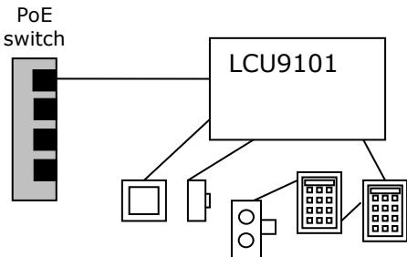

#### **Lås som kan användas vid PoE**

Abloy 8164-II, 8165-II, EL650-II Assa Evolution 810S, 811S Assa Classic 8000S, 8001S ASSA Solid 575 (12 2007 och senare) ASSA Solid 571 12V DC ASSA Solid 514 12VDC ABLOY 580

# **Konfigurering**

#### **Inledning**

Konfigureringen av undercentralen görs för att enheten ska kunna få kontakt och kommunicera med systemets ARX server. Denna kommunikation sker via Ethernet-kabel genom ett datornätverk.

I detta avsnitt beskrivs steg för steg hur du ska gå till väga för att konfigurera en undercentral.

Konfigureringen av undercentralen kan gå till på olika sätt. Det som styr är vilken typ av installation man bygger upp och hur det aktuella datornätverket ser ut. Man delar upp metoderna för konfigurering i två huvudgrupper:

Automatisk konfigurering Manuell konfigurering

# **Automatisk konfigurering**

Den enklaste metoden för konfigurering, som i första hand rekommenderas, är automatisk konfigurering. I detta avsnitt går vi igenom steg för steg hur den automatiska konfigureringen går till.

En automatisk konfigurering innebär att nätverksinställningarna görs med DHCP, det vill säga att tilldelningen av IP-nummer, nätmask, DNS-server och router sker med hjälp av automatik från en DHCP-server i nätverket.

#### **Förutsättningar**

En automatisk konfigurering förutsätter att det i nätverket finns både en DNS-server och en DHCP-server. Servernamnet "arx" måste också finnas upplagt i DNS-serverns register. Detta sker dock oftast automatiskt med hjälp av Windows om serverdatorn är döpt till "arx".

(För att kontrollera eller ändra datorns namn i Windows: Start > Kontrollpanelen > System > Datornamn.)

Om du inte är säker på om servernamnet "arx" är upplagt i DNSserverns register eller inte, kan du kontakta nätverksadministratören och be om hjälp.

Alternativt kan du själv undersöka om namnet är upplagt genom att "pinga" datornamnet "arx". Detta gör du i ett kommandofönster genom att skriva in: ping arx. (För att öppna ett kommandofönster i Windows: Start > *Program* > *Tillbehör* > *Kommando-*

*tolken*.)

Exempel "ping arx"

# **Checklista**

För att göra en automatisk konfiguration, följ dessa steg:

Starta serverapplikationen ARX ACCESS Server, om den inte redan är igång.

Koppla undercentralen till nätverket genom att ansluta en nätverkskabel till Ethernet-kontakten på CPU-kortet.

Anslut en korrekt avpassad spänningskälla till "*AC/DC"* ingångarna

*WDOG*-lysdioden blinkar först långsamt när undercentralen håller på att starta och övergår till att blinka fortare när undercentralen är igång.

Den gula lysdioden (märkt *A*) intill *WDOG*-dioden blinkar när undercentralen försöker få kontakt med servern. Detta kan ta några sekunder. När undercentralen sedan upprättat kontakt med servern lyser den gula *A*-dioden med fast sken.

Den automatiska konfigureringen av undercentralen är nu klar.

Du kan nu exempelvis gå in i klientprogrammet ARX Klient och lägga till den konfigurerade undercentralen i din installation. Har konfigurationen gått bra kommer symbolen för undercentralen (LCU:n) slå om till grönt i installationsträdet.

(För ytterligare information om hur klientprogrammet fungerar hänvisar vi till "*ARX ACCESS Användarguide*".)

Om något i konfigurationen inte gått som i den ovan beskrivna listan, se ytterligare information i avsnittet *Felsökning*.

# **Manuell konfigurering**

Det är inte möjligt att i alla installationer använda sig av den automatiska konfigurationen som beskrivits tidigare. Till exempel då man inte har någon DNS- eller DHCP-server i sitt nätverk eller om delar av installationen ligger utanför en brandvägg.

Vid en manuell konfigurering gör man själv alla inställningar och delar ut adresserna i sitt system. De manuella inställningarna som gäller undercentralen görs från ett terminalprogram på en dator som är ansluten med en USB kabel till LCU9101.

Drivrutiner för USB kommunikation med LCU9101.

USB kabel: Typ A till Mini typ B.

För att kunna ansluta centralen till datorn måste drivrutiner laddas i datorn, se nedan.

#### **Installation av drivrutiner för USB-konfiguration**

LCU9101 startar automatiskt en seriekonsoll på USB-porten när den ansluts till en dator med rätt drivrutin installerad.

USB fungerar med "plug and play" teknik. Koppla inte i och ur den flera gånger. När du kopplar ur kabeln ska du starta om ditt terminalprogram.

Packa upp zipfilen "drivrutiner LCU9101 USB" som finns på supportwebben till en mapp i datorn"

Installation i Windows XP:

Anslut enheten till USB-porten och välj "Installera från en lista eller angiven plats (avancerat)". På nästa sida markerar du "Inkludera den här platsen i sökningen" och bläddrar till mappen med drivrutinerna. När Windows klagar på att drivrutinen inte är certifierad, välj "Fortsätt ändå" och avsluta installationen.

Windows Vista:

När du ansluter enheten startar guiden för ny hårdvara.

Välj det rekommenderade alternativet. När Vista visar en säkerhetsvarning välj "fortsätt", sannolikt misslyckas installationen i detta steg. Öppna enhetshanteraren I kontrollpanelen. Välj att

visa övriga enheter. Högerklicka på "Gadget Serial" och välj "Uppdatera drivrutin".

Bläddra till mappen med drivrutinerna och välj nästa. Windows kommer klaga på att drivrutinen inte är certifierad, välj "fortsätt ändå"

Om du vill avinstallera drivrutinen i XP eller Vista, gå till enhetshanteraren och ta bort enheten "Gadget Serial"

#### **Terminalprogram**

Det finns ett flertal olika terminalprogram som går att använda. Nedan listas två som är vanliga och lättanvända:

HyperTerminal (följer med Windows)

Teraterm (fri programvara)

Oavsett vilket terminalprogram man väljer ska kommunikationen vara inställd på 9600 bps, 8 bitar, ingen paritet, en stoppbit och ingen flödesreglering.

(För detaljerad information om hur de olika terminalprogrammen fungerar, se respektive programs användarmanual.)

## **Konfiguration via terminalprogrammet**

Konfigureringsguide ("Setup Wizard")

För att underlätta inställningen finns en inbyggd guide "Setup Wizard". Denna guide hjälper dig att ställa in de olika alternativen för undercentralen på ett korrekt sätt.

Konfigureringsguiden startas genom att man skriver in setup och trycker [Enter] i terminalprogrammets kommandofönster.

Det som därefter visas är ett stycke som kallas "Configuration and status", som visar information om den anslutna undercentralen och dess status.

Nästa stycke, "Setup menu", är en meny över de alternativ som konfigureringsguiden innehåller.

Du väljer något av menyalternativen genom att skriva in den siffra som motsvarar ditt val och trycka [Enter].

De olika alternativen i konfigurationsguiden är:

#### **Menyalternativ**

1. Show current configuration and status – Visar den aktuella konfigureringen samt status.

2. Run the setup wizard – Med detta alternativ gör du den egentliga konfigureringen av undercentralen. Efter att ha valt detta alternativ ges du möjlighet att välja typ av konfiguration, antingen "Automatisk med DHCP" eller "Manuell".

Tips! Vid en manuell konfiguration, ha dessa uppgifter till hands:

- undercentralens IP-adress
- undercentralens nätmask
- IP-adressen till standard gateway ("Default Gateway")
- DNS-serverns IP-adress
- ARX-serverns namn, eller IP-adress

3. Test the communications with the ARX server – Testar kommunikationen mellan undercentralen och ARX-servern.

4. Trace the network route to the ARX server – Med detta alternativ kan du spåra den väg som informationen från undercentralen tar genom nätverket, till ARX-servern.

5. Reboot – Startar om undercentralen.

6. Master reset – OBS! Detta alternativ är ej i bruk.

- 0. Quit Detta alternativ avslutar konfigureringsguiden.
Exempel "setup"

Efter att ha skrivit in setup kan exempelvis följande information visas:

# setup

Configuration and status

| LCU Serial Number: | 00:06:8e:30:00:02  |
|--------------------|--------------------|
| IP Address:        | automatic via DHCP |
| Netmask:           | automatic via DHCP |
| Gateway:           | automatic via DHCP |
| DNS Server:        | automatic via DHCP |
|                    |                    |

ARX Server: arx

Setup Menu.

- 1. Show current configuration and status
- 2. Run the setup wizard
- 3. Test the communications with the ARX server
- 4. Trace the network route to the ARX server
- 5. Reboot
- 6. Master reset
- 0. Quit

What do you want to do?

#_

## **Terminalkommandon**

Utöver konfigureringsguiden som beskrivits ovan finns ett antal kommandon som kan användas vid konfigurering och felsökning. En komplett lista över terminalkommandon som kan användas i ARX ACCESS finns på sidan 20.

Följande kommandon kan användas i terminalprogrammet för att konfigurera sitt ARX ACCESS-system:

| Kommando                                           | Beskrivning                                                                 |
|----------------------------------------------------|-----------------------------------------------------------------------------|
| setup                                              | Startar upp konfigureringsgui den "LCU Wizard"                           |
| nv set arx <ip-adress></ip-adress>                 | Anger IP-adressen till ARX servern                                    |
| nv set arx <servernamn></servernamn>               | Anger ett annat namn (DNS-) på ARX-servern (standardnam net är "arx") |
| nv set dns <ip-adress></ip-adress>                 | Anger IP-adressen till eventuell DNS-server                              |
| nv set domain <domän></domän>                      | Anger vilken domän som under centralen tillhör (ex: foreta get.se)    |
| nv set ip <ip-adress></ip-adress>                  | Anger en IP-adress för under centralen                                   |
| nv set gateway <gateway adress&gt;</gateway  | Anger standard-gateway eller "default gateway"                           |
| nv set hostname <ucnamn></ucnamn>                  | Anger ett namn på under centralen.                                       |
| nv set netmask <nätmask></nätmask>                 | Anger undercentralens nätmask                                               |
| nv show                                            | Visa alla variabler                                                         |

| nv del ip                                                        | Kommando för att radera IP adressen för undercentralen (exempelvis en felaktig adress)                                                                                                    |
|------------------------------------------------------------------|-------------------------------------------------------------------------------------------------------------------------------------------------------------------------------------------------|
| nv del netmask                                                   | Kommando för att radera un dercentralens nätmask (exem pelvis en felaktigt satt nätmask)                                                                                                  |
| nv init                                                          | Initierar de ursprungliga variab lerna i undercentralen (ungefär "återställ fabriksinställningar")                                                                                        |
| ping <datornamn ip-adress></datornamn ip-adress>                 | Genom att "pinga" datornamnet eller IP-adressen kontrollerar man om man kan nå en viss dator. (Tangentkombinationen Ctrl+C avbryter ping kontrollen.)                         |
| reboot                                                           | Startar om undercentralen                                                                                                                                                                       |
| ifconfig                                                         | Visar nuvarande nätverksin ställningar                                                                                                                                                       |
| logread                                                          | Visa loggar                                                                                                                                                                                     |
| route [-n]                                                       | Visar gatewayinställningar. -n medför IP-vy.                                                                                                                                                 |
| traceroute <datornamn ip adress&gt;</datornamn ip          | Visar vilken väg datorpaketen går.                                                                                                                                                           |
| tcptraceroute <datornamn ip adress&gt; 5002</datornamn ip  | Visar vilken väg datorpaketen går till rätt port på servern (endast ny firmware).                                                                                                         |
| cat/etc/resolv.conf                                              | Visar DNS-inställningar                                                                                                                                                                         |
| telnet <servernamn> 5002</servernamn>                            | Skapar en telnetuppkoppling mot port 5002. Om man inte får "connection refused" innebär det att servern svarat. Skriv några valfria bokstäver för att få servern att koppla ner. |

| ps                                                            | Visar startade pro gram/processer                                                                                                                                                                                  |
|---------------------------------------------------------------|-----------------------------------------------------------------------------------------------------------------------------------------------------------------------------------------------------------------------|
| killall mux_client mux_client –d <servernamn></servernamn> | Tar ner mux-kommunikationen och kopplar sedan upp igen med debugutskrifter aktiverade                                                                                                                           |
| netstat -t [-n]                                               | Visar vilka uppkopplingar som existerar. -n medför IP-vy .                                                                                                                                                      |
| killall acp acp                                            | Avslutar all ACP-kommunikation och startar upp ACP igen. Tips: När man skrivit in "acp" och textraden "Command>" vi sas, skriv in "help" för att få se en lista över alla tillgängliga al ternativ. |
| acp [-clean]                                                  | -clean raderar databasen och gjorda inställningar.                                                                                                                                                                 |
| killall udhcpc udhcpc                                      | Startar om DHCP                                                                                                                                                                                                       |
| cat BUILD                                                     | Skriver ut vilken firmware version som är installerad på undercentralen                                                                                                                                         |
| Fwupdate -dfr arx://firmware/ <fw zip="">run</fw>          | Uppdaterar firmware via befint lig uppkoppling. OBS! ARX ACCESS 1.7 och ny are. Namn på firmware-zip-filen kan utläsas i katalogen: C:\program\solid\arx sa\firmware                                |

Exempel: "nv show"

Efter att ha skrivit in nv show (för att visa undercentralens variabler) och tryckt [Enter] kan exempelvis följande information visas:

# nv show

factory.keys <2401 bytes>

ethaddr=00:06:8e:3f:01:0a

client.keys <2795 bytes>

#_

Förklaring:

factory.keys <2401 bytes> – fabriksnycklar (för undercentral)

ethaddr=00:06:8e:3f:01:0a – undercentralens serienummer (eller ethernetadress)

client.keys <2797 bytes> – klientnycklar

#### **Nyckelhantering**

För att garantera en hög säkerhet i kommunikationen mellan undercentral (LCU) och ARX Server används två olika typer av nycklar: fabriksnycklar och klientnycklar.

Fabriksnycklarna finns lagrade i undercentralen redan vid leverans. De är unika för varje undercentral.

När en undercentral fått kontakt med ARX Server och godkänts läggs undercentralen till i ARX-installationen och får nya nycklar – klientnycklar.

I och med att undercentralen fått dessa klientnycklar är den låst till en specifik ARX-server, den som utfärdade nycklarna.

# **Tekniska data**

| Matningsspänning på KP1:14 & 15                                                                              | Strömförsörjning, extern: 17 – 35V AC eller 24 – 50V DC |
|--------------------------------------------------------------------------------------------------------------|------------------------------------------------------------------|
| Strömförsörjning, intern                                                                                     | 3.3V DC och 13.8V DC                                             |
| Arbetstemperatur för att undvika kondensbildning                                                          | +5°- +40° C                                                   |
| Egenförbrukning LCU9101                                                                                      | 24V DC Max 100mA                                                 |
| Flash-minne:                                                                                                 | 32 Mbyte                                                         |
| RAM-minne                                                                                                    | 32 Mbyte SDRAM                                                   |
| Operativsystem:                                                                                              | Linux                                                            |
| Ethernet:                                                                                                    | 10BASE-T, 100BASE-TX                                             |
| Konfigurations port:                                                                                         | USB B-mini                                                       |
| Kort                                                                                                         | 100 000                                                       |
| Relä max last                                                                                                | 1A (24V)                                                         |
| Sammanlagd 12V belastning i LCU9101, det vill säga 12V elslutbleck, lä sare och 12V reglerad utgång | Max 0,7A (700mA)                                                 |

#### **LCU9101 Centralenhet**

I grundutförandet kan systemet hantera en dörr (med inre och yttre läsare).

# **Streckschema LCU9101**

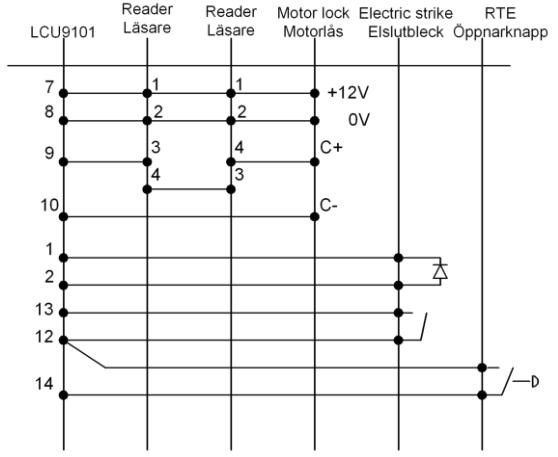

