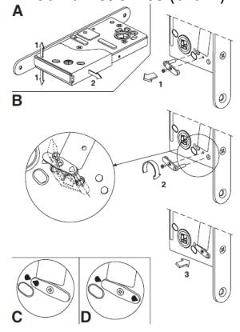
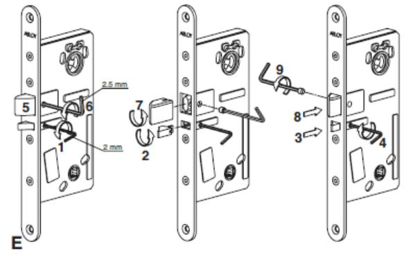
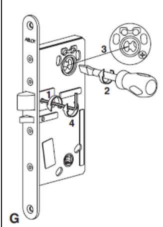
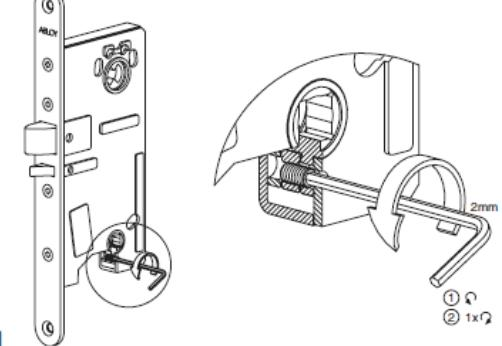
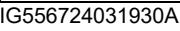

# DBL360/DBL362 **ASSA ABLOY**

### Om DBL360/DBL362 MF

DBL36x är kompakta dörrbladsläsare med inbyggd DAC som kan läsa DESFire, Mifare Classic, Mifera Plus, Mifare. Ultre Light. DBL36x har krypterad kommunikation mellan in och utsida. DBL36x finns i två varianter. DBL360 består av en läsenhet och ett ABLOY ellås E980. DBL362 består av en läsenhet och ett ABLOY ellås E981. DBL362 har tryckesavkänning som i passersystemet tolkas som en inbyggd öppnaknapp och dörrlägesindikering via förreglingsfallen. DBL362 har en ingång för extern öppnaknapp.

DBL362 kan även förses med extern magnat och får då avkänning av själva dörrbladet. Montera en infälldmagnetkontakt med kontakt delen i dörrbladet och magneten i karmen, anslut till 6 & 7 i plint.

## **Installation**

**A. Driftsättnign av låshus (se baksida på detta blad)**

**B. Installation och driftsättning av DBL360/362**

DBL360/ DBL362 ska paras med sin utsida då kommunikationen är krypterad.

**B1:** Anslut utsidan till insidan, med bifogad kabel

- **B2**: Ställ samtliga DIP på OFF
***B3**: Anslut strömmen

**B4**. Blå LED på insidan börjar att blinka, och Grön LED på utsidan blinkar.

**B5**: Efter ca 30 sekunder lyser röd LED på utsidan fast och efter ytteligare ca 15 sekunder, tänder röd LED Tx på insidan och blå LED blinkar fort.

NU är enheterna parade med varandra

**B6**: Adressera enhetet till rätt adress

*(Om Om röd LED Tx på insidan inte tänder när Blå LED blinkar snabbt, har parningen misslyckats. Yttre enheten kan vara lås med annan enhet)*, låsupp ytter sidan, se nedan**

#### För att avpara enheter från varandra, två metoder*.*

Gör punktena ovan men innan punkt *B3, tryck in sabotage switchen och håll den intryckt tilldess blå LED börjar blinka nu kan switchen släppas. När Punkt B5 släcker röd LED på utsidan och blå LED på insidan blinkar fort samt röd LED lyser på insidan är den yttre enheterna avparade.

**Utsidan kan även låsas upp via switch

Switchen sitter bredvid ansluningskabeln på utsideenheten. DBL måste ha en adress satt mellan 1-15. Anslut strömmen till DBL36x, tryck på knappen inom 20 secunder, sex gånger med ensekunders intervall.

När de röda LED'arna slocknar, är utsidesenehten upplåst. OBS! Utsidan kan nu inte kommunicera med den inre enheten, förrän den åter är parad.

#### Adressering mm för respektive DBL

**C1**. Adressera DBL med hjälp av DIP 1-5 (Se tabell exempel) **C2**. Välj rättvänd/omvänd funktion med hjälp av DIP 6 **C3**. Välj låshus med hjälp av DIP 7 (DBL362/E981 DIP7 = ON) **C4**. Anslut eventuell extern dörrlägesgivare (Gäller DBL362) **C4a**. Aktivera extern dörrlägesgivare med hjälp av DIP 8 **C5**. Anslut eventuell extern öppnaknapp (Gäller DBL362) **C6**. Anslut låshuskabel

**C7**. Anslut antenn (DBL360 OSP) **OBS! In och Utsida måste paras C8**. Anslut kommunikationskabel och spänningsmatning

| Adressering | DIP1 (1) | DIP2 (2) | DIP3 (4) | DIP4 (8) | DIP5 (16) |
|-------------|----------|----------|----------|----------|-----------|
| Adress 1    | ON       |          |          |          |           |
| Adress 2    |          | ON       |          |          |           |
| Adress 3    | ON       | ON       |          |          |           |
| Adress 4    |          |          | ON       |          |           |
| Adress 5    | ON       |          | ON       |          |           |
| Adress 6    |          | ON       | ON       |          |           |
| Adress 7    | ON       | ON       | ON       |          |           |
| Adress 8    |          |          |          | ON       |           |
| Adress 9    | ON       |          |          | ON       |           |
| Adress 15   | ON       | ON       | ON       | ON       |           |
| Adress 16   |          |          |          |          | ON        |

### **Funktions DIP, omkopplare 6–8**

| DIP                                     |        | Funktion                         |                                           | Beskrivning                                                          |                                                                                                       |  |
|-----------------------------------------|--------|----------------------------------|-------------------------------------------|----------------------------------------------------------------------|-------------------------------------------------------------------------------------------------------|--|
| Val av rättvänd/ 6 omvändfunktion |        |                                  | Rättvändfunktion - DIP 6 är i läge OFF |                                                                      |                                                                                                       |  |
|                                         |        |                                  | Omvändfunktion - DIP 6 är i läge ON    |                                                                      |                                                                                                       |  |
| 7                                       |        |                                  |                                           | DBL360- DIP 7 i läge OFF                                          |                                                                                                       |  |
|                                         |        | Val av låshus                    |                                           | DBL362- DIP 7 i läge ON                                           |                                                                                                       |  |
| 8                                       | extern | Aktivering av dörrlägesgivare |                                           | Externdörrlägesgivare – inbyggda dörrlägesgivare) krävs DBL362 | DIP 8 i läge ON (Ingången arbetar då i serie med låsets För att aktivera extern dörrlägesgivare |  |
| Grön                                    |        | Röd                              |                                           | Förklaring                                                           |                                                                                                       |  |
| Blinkar till                            |        |                                  | I Drift: Lyser 0,5 sek släkt 3 sek.       |                                                                      |                                                                                                       |  |
|                                         |        |                                  | Utsidan är inte parad med insidan         |                                                                      |                                                                                                       |  |
| Blink 1Hz                               |        |                                  | Vid uppstart:                             |                                                                      |                                                                                                       |  |
|                                         |        |                                  |                                           | Enheten är möjlig att konfigurera med                                |                                                                                                       |  |
|                                         |        |                                  |                                           | setup kort. Blinkar i 90 sekunder                                    |                                                                                                       |  |
| Blink 1Hz Lyser efter                |        |                                  | Vid uppstart                              |                                                                      |                                                                                                       |  |
| ca 30 sekunder                          |        |                                  | Enheten är precis parad med insidan       |                                                                      |                                                                                                       |  |
| Blink 1Hz Lyser fast                 |        |                                  | Vid uppstart med adresserad enhet      |                                                                      |                                                                                                       |  |
|                                         |        |                                  | Utsidan är låst och krypterad             |                                                                      |                                                                                                       |  |
| Blink 1Hz                               |        |                                  | I Drift eller direkt efter uppstart    |                                                                      |                                                                                                       |  |
|                                         |        |                                  | Enheten kommunicerar inte med LCU      |                                                                      |                                                                                                       |  |
| Insidan                                 |        |                                  |                                           |                                                                      |                                                                                                       |  |
| Blå LED                                 |        |                                  | Grön LED RxD                              | Röd TxD                                                              |                                                                                                       |  |
| WDG 2Hz = OK                            |        |                                  | Tar emot data                             | Sänder data                                                          |                                                                                                       |  |
|                                         |        |                                  |                                           |                                                                      |                                                                                                       |  |

| Plint         |      |                                                    |  |
|---------------|------|----------------------------------------------------|--|
| DC +12-24V | (01) | Matning 12-28 V DC                                 |  |
| DC 0V         | (02) | (Ansluts till ett SELV klassat aggregat)           |  |
| Cl+           | (03) | Kommunikation C+                                   |  |
| Cl –          | (04) | Kommunikation C                                    |  |
| RTE           | (05) | Öppnarknapp (Request to exit) kopplas mellan 5 & 6 |  |
| COM           | (06) | Gemensam                                           |  |
| SW            | (07) | Extern dörrmagnet kopplas mellan 7 & 8             |  |
| COM           | (08) | Gemensam                                           |  |
| Can H         | (09) | Anslutning Pando BLE kommunikation                 |  |
| Can L         | (10) |                                                    |  |

### **Låset måste anslutas innan spänningstillslag**.

### Konfigurering sektor/applikationsläsning

DBL360/DBL362 läser DESFire, Mifare Classic sektorläsning, vilket innebär att läsarna måste konfigureras med systemets setup-kort och referensnummer.

- 1) Bryt och slå till spänningen till läsaren.
- 2) Grön indikering blinkar under 90 sekunder.
- 3) Visa Setup-kortet för läsaren, innan den slutar blinka.
- 4) Läsaren indikerar med ett "kvitter" att programmeringen är klar.
- 5) Läsaren är nu programmerad med anläggningens krypteringsnycklar.

Om felaktigt Setup-kort används kan byte inte ske genom att använda ett annat Setup-kort. För byte av kryptonyckel, kontakta ARX:s tekniska support. Om ett kort som presenteras för en DBL läsare inte har krypteringsnycklar som överensstämmer med läsaren kommer läsaren inte att indikera att något är fel och läsaren kommer heller inte att skicka någon data.

#### Teknisk specifikation

| Matningsspänning                | 12-28 V DC (Ansluts till ett SELV klassat aggregat) |  |  |
|---------------------------------|--------------------------------------------------------|--|--|
| Strömförbrukning vid 24 V | Vid låst 35mA, olåst 150 mA                            |  |  |
| IP                              | IP44                                                   |  |  |

#### QR denna manual

# DBL360/DBL362 **ASSA ABLOY**

# Mekanisk installation – Val av ställbara funktioner i El980 och El981

- **A1**. Välj rättvänd eller omvändfunktion för låset.
- **A2**. Välj förreglingsfall (Höger/Vänster)
- **A3**. Välj fallkolv (Höger/Vänstar)
- **A4.** Välj fallkolvsutsprång
- **A5**. Välj mekanisk/elektrisk styrd sida
- **A6.** Montera låshus i dörren.

En 2 mm och en 2,5 mm insexnyckel krävs för att kunna ändra de ställbara funktionerna nedan.

# Rättvänd/Omvänd funktion

Rättvänd funktion är normalläge och innebär att låset låser upp när det får ström via DBL360/DBL362 elektroniken (bild C). Omvänd funktion innebär att låset låser upp när ström försvinner via DBL360/DBL362 elektroniken eller om hela DBL360/DBL362 blir strömlös (bild D).

Bild A 1. Drag skyddskåpan nedåt-bakåt och ta bort den.

Bild B Ändring av rättvänd/omvänd funktion

- 1. Lossa fixeringsskruven och drag ut växlaren. 2. Vrid växlaren ½ varv enligt bild.
- 3. Sätt tillbaka växlaren i önskat läge
- (se bild C och D).
- Bild C Rättvänd funktion
- Bild D Omvändfunktion

Notera DIP6: Omvändfunktion – DIP 6 ska vara satt till ON

## Val av föreglingsfall och fallkolv (höger -> vänster)

DBL360/DBL362 levereras som höger ut enhet. Nedan beskrivs hur du ändrar förreglingen från höger till vänster ut.

- 1. Lossa fixeringsskruvarna.
- 2. Drag ut förreglingsfallen och vänd den.
- 3. Skjut in förreglingsfallen igen.
- 4. Drag åt fixeringsskruven.
- 5. Kontrollera att fallkolven inte är förreglad.
- 6. Lossa fixeringsskruven.
- 7. Drag ut fallkolven och vänd den.
- 8. Skjut in fallkolven igen.
- 9. Drag åt f fixeringsskruven.

# Val av fallkolvsutsprång (från 20 mm till 14 mm)

EL980/EL981 levereras default med 20 mm fallkolvsutsprång, nedan beskrivs hur du ändrar det till 14 mm.

- 1. Kontrollera att fallkolven inte är förreglad
- 2. Lossa fixeringsskruvarna
- 3. Tryck in fallkolv och förreglingsfall samtidigt, släpp sedan fallkolven
- 4. Kontrollera att roddarskivan är i förreglat läge
- 5. Drag åt fixeringsskruven.
- 6. Kontrollera att fallkolven

# Ändring av fallkolvsutsprång (från 14 mm till 20 mm)

Nedan beskrivs hur du ändrar fallkolvsutsprånget från 14 mm till 20 mm. En 2,5 mm insexnyckel krävs för att kunna ändra fallkolvsutsprånget.

- 1. Lossa fixeringsskruvarna
- 2. Vrid cylinderroddaren så att låset inte är förreglat (tryck inte in förreglingsfallen) Drag åt fixeringsskruven.
- 3. Kontrollera att roddarskivan är i normalläge (ej förreglad) enligt bild.
- 4. Drag åt fixeringsskruven igen
- 5. Kontrollera fallkolvens funktion

# **Val av mekanisk/elektrisk styrd sida**

Nedan beskrivs hur du ändrar mekanisk/ elektrisk styrd sida.

- 1. Lokalisera insexskruven under tryckesroddaren på låshusets lock-sida. Skruva ut skruven (moturs) tills det tar stopp, skruva sedan tillbaka 1 varv (medurs).
- Låset är nu mekaniskt styr från låshusets lock-sida. 2. För att återgå till mekanisk styrning från låshusets kistsida,
- skruva in skruven (medurs) till det tar stopp, skruva sedan tillbaka ca 1 varv(moturs)
- 3. Funktionsprova.

