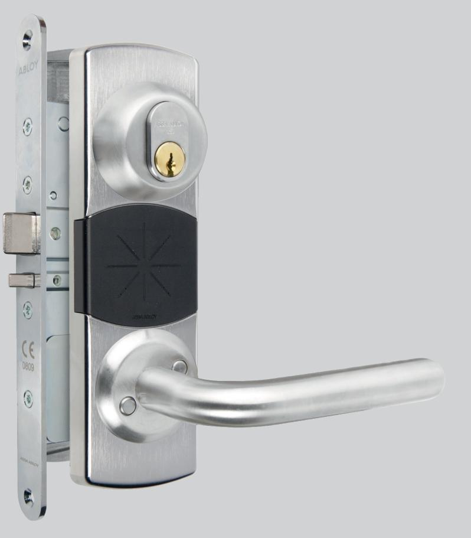
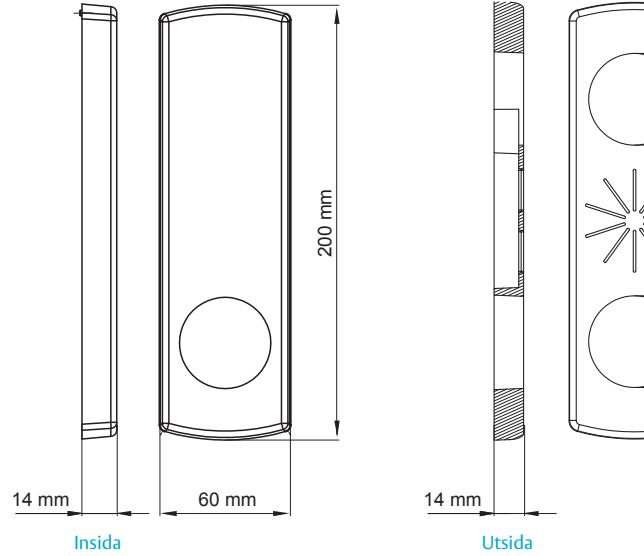
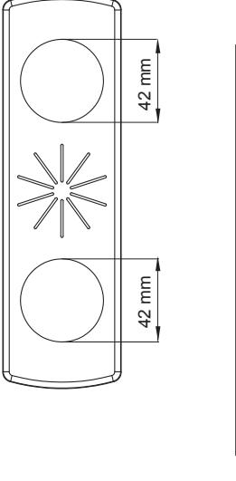
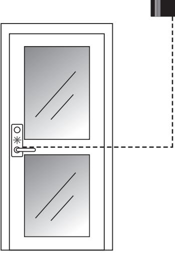

## ASSA ABLOY DBL360

### Generisk dörrbladsläsare

DBL360 är en framtidssäker kompakt dörrbladsläsare som hanterar 13,56 MHz teknologier: MIFARE Classic, MIFARE Plus (nivå 1 och 3), MIFARE DESFire EV1+2, iCLASS, samt SEOS. Läsaren har även stöd för att i framtiden kunna uppgraderas till kommande 13,56 MHz teknologier. Läsaren är manipuleringsskyddad då den har all intelligens

säkert på insidan och endast antenndelen på utsidan.

DBL360 läsaren består av läsarenhet samt ett ABLOY ellås EL980 med split spindelfunktion. I de fall man önskar tryckesavkänning och dörrlägesindikering finns modellen DBL362 med ABLOY ellås EL981.

Inga extra hål behöver borras i dörren för montering av låshus eller läsarenhet då kabeln förläggs inne i eller utanpå dörren.

Enheten kompletteras med trycke och låscylinder efter önskemål.

DBL360 används främst på innerdörrar. Exempel på sådana lokaler är omklädningsrum, interna förråd, innerdörrar, källardörrar och kontor.

All programmering av systemet sker via ARX eller RX WEB programvara och all konfigurationsdata sparas i en central databas. Fördelarna med centralanslutna dörrblads-läsare är många. Administrationen av behörigheter är enkel då individuella kort omgående kan spärras i systemet. De senaste händelserna sparas i en loggfil i systemet.

DBL360 har inbyggd dörrkontrollenhet (DAC), vilket möjliggör en enkel installation då den kopplas direkt till centralenheten i passersystemet.

# ASSA ABLOY DBL360

## Generisk dörrbladsläsare

#### **Indikeringar**

- Dörr olåst/ Giltig passage blå
- Dörr spärrad/Ogiltigt kort röd

#### **Ingångar/Utgångar**

- Tryckesavkänning
- Dörrlägesindikering via förreglingsfall
- Ingång för extern öppnaknapp
- Ingång för extern dörrlägesgivare (till exempel en magnetkontakt)

#### **Data**

- Matningsspänning: 17,1 V AC/17-28V DC
- Strömförbrukning: vid 24V 30 mA
- Förbrukning vid olåst: vid 24V 150 mA
- Vikt: 1,5 kg inkl. låshus
- Temperaturområde: -25ºC till +65ºC
- Relativ fuktighet: 20-70%
- Lästeknologi: Generisk 13,56MHz (MIFARE Classic, MIFARE Plus (nivå 1 och 3), MIFARE DESFire EV1+2, iCLASS och SEOS)
- Uppfyller kraven för IP54

ASSA ABLOY Opening Solutions Sweden AB P.O. Box 371 SE-631 05 Eskilstuna Sweden

Phone +46 (0)16 17 70 00 Fax +46 (0)16 17 70 49

Customer support: Phone intl. +46 (0)16 17 71 00 Phone nat. 0771-640 640 Fax +46 (0)16 17 73 72 e-mail: helpdesk.se.openingsolutions@assaabloy.com www.assaabloyopeningsolutions.se

#### **Kan anslutas till**

- Direktansluts till ARX, RX WEB
#### **Övrigt**

- Valbar rättvänd/omvänd funktion
- Vändbar höger/vänster
- Har inbyggd sabotagekontakt
- Gjutna kåpor
- Kompletteras med trycke, cylinder och cylinderbehör

#### **Material**

- Mattborstad krom
#### **Artikelnummer**

- DBL360 med låshus (vändbart höger/vänster) S556 724 000
- DBL362 med låshus (vändbart höger/vänster) S556 724 001

