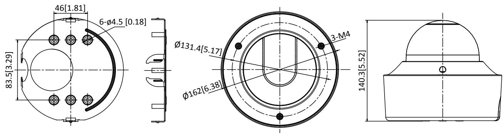
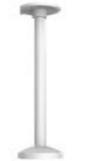
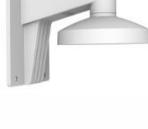
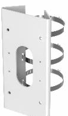
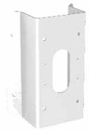
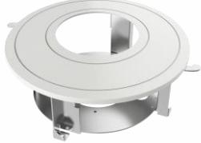

**DS-2CD5546G0-IZ(H)S 4 MP Varifocal Dome Network Camera**

- 1/1.8" Progressive Scan CMOS
- 2560 × 1440 @ 30fps
- MJPEG up to 1920 × 1080 @ 30fps
- 2.8 to 12 mm, 8 to 32 mm motorized lens
- Color: 0.002 Lux @ (F1.2, AGC ON), 0.005 Lux @ (F1.8, AGC ON), 0 Lux with IR
- H.265, H.265+, H.264, H.264+
- 140dB WDR
- IR range up to 30 m
- 5 streams and up to 5 custom streams
- 6 behavior analyses, 3 exception detection, and face detection
- Built-in microSD/SDHC/SDXC card slot, up to 256 GB
- Alarm 1 input/1 output
- Audio 1 input/1 output
- IP67, IK10
- Anti-IR reflection

- Metadata of intrusion detection, line crossing detection, region entrance detection, region exiting detection, unattended baggage detection, and object removal are supported.

# **Function**

### **Smooth Streaming**

Smooth streaming offers solutions to improve the video quality in different network conditions. For example, in poor network conditions, adapting to the detected real-time network condition, streaming bit rate and resolution are automatically adjusted to avoid mosaic and lower latency in live view; in multiplayer network conditions, the camera transmits the redundant data for the self-error correcting in back-end device, so that to solve the mosaic problem because of the packet loss and error rate.

#### **Metadata**

Metadata uses individual instances of application data or the data content. Metadata can be used for third-party application development.

#### **Power Protection**

The camera supports a wide voltage range of 10 VDC to 48 VDC. If the voltage instability occurs, the camera still works properly. The camera supports reverse polarity protection which can avoid the camera malfunction caused by false operation.

#### **Anti-Reflection Bubble**

This anti-reflection bubble design avoids the IR reflection of the raindrop and dust on the bubble and improves the image quality.

# **Specifications**

| Camera            |                                                                                                                                                                                                            |  |
|-------------------|------------------------------------------------------------------------------------------------------------------------------------------------------------------------------------------------------------|--|
| Image Sensor      | 1/1.8″ Progressive Scan CMOS                                                                                                                                                                               |  |
| Min. Illumination | Color: 0.002 Lux @ (F1.2, AGC ON), 0.005 Lux @ (F1.8, AGC ON), 0 Lux with IR                                                                                                                               |  |
| Shutter Speed     | 1 s to 1/100,000 s                                                                                                                                                                                         |  |
| Slow Shutter      | Yes                                                                                                                                                                                                        |  |
| Day & Night       | IR Cut Filter                                                                                                                                                                                              |  |
| WDR               | 140 dB                                                                                                                                                                                                     |  |
| Angle Adjustment  | Pan: 0°to 355°, tilt: 0°to 75°, rotate: 0°to 355°                                                                                                                                                          |  |
| Lens              |                                                                                                                                                                                                            |  |
| Lens Type         | Motorized lens 2.8 to 12 mm/8 to 32 mm                                                                                                                                                                     |  |
| Aperture          | 2.8 to 12 mm @ F1.2 to F2.5 8 to 32 mm @ F1.8, Constant F1.6 throughout the zoom range                                                                                                                  |  |
| Focus             | Auto, semi-auto, manual                                                                                                                                                                                    |  |
| FOV               | 2.8 to 12 mm, horizontal FOV 109.2° to 38.9°, vertical FOV 56.2° to 21.9°, diagonal FOV 134.5° to 45° 8 to 32 mm, horizontal FOV 37.7° to 15.2°, vertical FOV 21° to 8.6°, diagonal FOV 43.4° to 17.24° |  |
| Lens Mount        | Integrated                                                                                                                                                                                                 |  |
| Illuminator       |                                                                                                                                                                                                            |  |
| IR Range          | 2.8 to 12 mm lens: up to 30 m 8 to 32 mm lens: up to 50 m                                                                                                                                               |  |
| Wavelength        | 850 nm                                                                                                                                                                                                     |  |
| Video             |                                                                                                                                                                                                            |  |
| Max. Resolution   | 2560 × 1440                                                                                                                                                                                                |  |
| Video Stream      | 5 defined streams and up to 5 custom stream                                                                                                                                                                |  |
| Main Stream       | 50Hz: 25fps (2560 × 1440, 1920 × 1080, 1280 × 720) 60Hz: 30fps (2560 × 1440, 1920 × 1080, 1280 × 720)                                                                                                   |  |
| Sub Stream        | 50Hz: 25fps (704 × 576, 640 × 480) 60Hz: 30fps (704 × 480, 640 × 480)                                                                                                                                   |  |
| Third Stream      | 50Hz: 25fps (1920 × 1080, 1280 × 720, 704 × 576, 640 × 480) 60Hz: 30fps (1920 × 1080, 1280 × 720, 704 × 480, 640 × 480)                                                                                 |  |
| Fourth Stream     | 50Hz: 25fps (1920 × 1080, 1280 × 720, 704 × 576, 640 × 480) 60Hz: 30fps (1920 × 1080, 1280 × 720, 704 × 480, 640 × 480)                                                                                 |  |
| Fifth Stream      | 50Hz: 25fps (704 × 576, 640 × 480) 60Hz: 30fps (704 × 480, 640 × 480)                                                                                                                                   |  |
| Custom Stream     | 50Hz: 25fps (1920 × 1080, 1280 × 720, 704 × 576, 640 × 480) 60Hz: 30fps (1920 × 1080, 1280 × 720, 704 × 480, 640 × 480)                                                                                 |  |
| Video Compression | Main stream: H.265/H.264/H.265+/H.264+ Sub stream/third stream/fourth stream/fifth stream/custom stream: H.265/H.264/MJPEG                                                                              |  |
| H.264 Type        | Baseline Profile/Main Profile/High Profile                                                                                                                                                                 |  |
| H.264+            | Main stream support                                                                                                                                                                                        |  |
| H.265 Type        | Main Profile                                                                                                                                                                                               |  |
| H.265+            | Main stream support                                                                                                                                                                                        |  |
| Video Bit Rate    | 256 Kbps to 16 Mbps                                                                                                                                                                                        |  |
| SVC               | H.264 and H.265 encoding                                                                                                                                                                                   |  |
| Audio             |                                                                                                                                                                                                            |  |

| Audio Compression Audio Bit Rate | G.711/G.722.1/G.726/MP2L2/PCM 64Kbps(G.711)/16Kbps(G.722.1)/16Kbps(G.726)/32-192Kbps(MP2L2)/128-768Kbps(PCM)                                                                                                                                                                                                                                                                                                                                                                  |
|-------------------------------------|----------------------------------------------------------------------------------------------------------------------------------------------------------------------------------------------------------------------------------------------------------------------------------------------------------------------------------------------------------------------------------------------------------------------------------------------------------------------------------|
| Environment Noise Filtering   | Yes                                                                                                                                                                                                                                                                                                                                                                                                                                                                              |
| Audio Sampling Rate                 | 8 kHz/16 kHz/32 kHz/44.1 kHz/48 kHz                                                                                                                                                                                                                                                                                                                                                                                                                                              |
| Smart Feature-set                   |                                                                                                                                                                                                                                                                                                                                                                                                                                                                                  |
| Smart Event                         | Line crossing detection, up to 4 lines configurable Intrusion detection, up to 4 regions configurable Region entrance detection, up to 4 regions configurable Region exiting detection, up to 4 regions configurable Unattended baggage detection, up to 4 regions configurable Object removal detection, up to 4 regions configurable Face detection: detects faces and upload images Scene change detection, audio exception detection, defocus detection |
| Basic Event                         | Motion detection, video tampering alarm, network disconnected, IP address conflict, illegal login, HDD full, HDD error                                                                                                                                                                                                                                                                                                                                                        |
| Statistics                          | Counting                                                                                                                                                                                                                                                                                                                                                                                                                                                                         |
| Linkage Method                      | Upload to FTP/NAS/memory card, notify surveillance center, send email, trigger alarm output, trigger recording, trigger capture                                                                                                                                                                                                                                                                                                                                               |
| Region of Interest                  | Main stream/sub stream/third stream/fourth stream/fifth stream: 4 fixed regions for each stream, and dynamic face tracking                                                                                                                                                                                                                                                                                                                                                    |
| Image                               |                                                                                                                                                                                                                                                                                                                                                                                                                                                                                  |
| Image Enhancement                   | BLC, HLC, 3D DNR, Defog, EIS, Distortion Correction                                                                                                                                                                                                                                                                                                                                                                                                                              |
| Image Setting                       | Rotate mode, saturation, brightness, contrast, sharpness, AGC, and white balance are adjustable by client software or web browser                                                                                                                                                                                                                                                                                                                                             |
| Target Cropping                     | Yes                                                                                                                                                                                                                                                                                                                                                                                                                                                                              |
| Day/Night Switch                    | Auto/Schedule/Day/Night/Triggered by Alarm In                                                                                                                                                                                                                                                                                                                                                                                                                                    |
| Picture Overlay                     | LOGO picture can be overlaid on video with 128 × 128 24bit bmp format                                                                                                                                                                                                                                                                                                                                                                                                            |
| Network                             |                                                                                                                                                                                                                                                                                                                                                                                                                                                                                  |
| Network Storage                     | microSD/SDHC/SDXC card (up to 256 GB), local storage and NAS (NFS,SMB/CIFS), ANR Together with high-end Hikvision memory card, memory card encryption and health detection are supported.                                                                                                                                                                                                                                                                                  |
| Protocols                           | TCP/IP, ICMP, HTTP, HTTPS, FTP, DHCP, DNS, DDNS, RTP, RTSP, RTCP, PPPoE, NTP, UPnP, SMTP, SNMP, IGMP, 802.1X, QoS, IPv6, UDP, Bonjour, SSL/TLS                                                                                                                                                                                                                                                                                                                                |
| API                                 | ONVIF (PROFILE S, PROFILE G), ISAPI, SDK                                                                                                                                                                                                                                                                                                                                                                                                                                         |
| Smooth Streaming                    | Yes                                                                                                                                                                                                                                                                                                                                                                                                                                                                              |
| Security                            | Password protection, complicated password, HTTPS encryption, 802.1X authentication (EAP-TLS, EAP-LEAP, EAP-MD5), watermark, IP address filter, basic and digest authentication for HTTP/HTTPS, WSSE and digest authentication for ONVIF, RTP/RTSP over HTTPS, control timeout settings, security audit log, TLS 1.2                                                                                                                                                     |
| Simultaneous Live View              | Up to 20 channels                                                                                                                                                                                                                                                                                                                                                                                                                                                                |
| User/Host                           | Up to 32 users, 3 levels: Administrator, Operator and User                                                                                                                                                                                                                                                                                                                                                                                                                       |
| Client                              | iVMS-4200, Hik-Connect, Hik-Central                                                                                                                                                                                                                                                                                                                                                                                                                                              |
| Web Browser                         | Plug-in required live view: IE8+, Chrome 41.0-44, Mozilla Firefox30.0-51, Safari8.0-11 Plug-in free live view: Chrome 45+, Mozilla Firefox52+                                                                                                                                                                                                                                                                                                                                 |
| Interface                           |                                                                                                                                                                                                                                                                                                                                                                                                                                                                                  |
| Communication Interface             | 1 RJ45 10M/100M/1000M Ethernet port                                                                                                                                                                                                                                                                                                                                                                                                                                              |
| Audio                               | 1 input (line in, 3.5 mm), 1 output (line out, 3.5 mm), mono sound                                                                                                                                                                                                                                                                                                                                                                                                               |
| Alarm                               | 1-ch input, 1-ch output (24 VAC/VDC, 1 A max)                                                                                                                                                                                                                                                                                                                                                                                                                                    |
| Video Output                        | 1Vp-p composite output (75 Ω/CVBS), only for adjustment                                                                                                                                                                                                                                                                                                                                                                                                                          |

| Power Output                              | 12 VDC, max. 200mA                                                                                                                                                                                                                                                                                                                                                                                                                                                                                                                                                                                                               |  |
|-------------------------------------------|----------------------------------------------------------------------------------------------------------------------------------------------------------------------------------------------------------------------------------------------------------------------------------------------------------------------------------------------------------------------------------------------------------------------------------------------------------------------------------------------------------------------------------------------------------------------------------------------------------------------------------|--|
| Interface Style                           | Socket style interface                                                                                                                                                                                                                                                                                                                                                                                                                                                                                                                                                                                                           |  |
| On-board storage                          | Built-in micro SD/SDHC/SDXC slot, up to 256 GB                                                                                                                                                                                                                                                                                                                                                                                                                                                                                                                                                                                   |  |
| General                                   |                                                                                                                                                                                                                                                                                                                                                                                                                                                                                                                                                                                                                                  |  |
| Firmware Version                          | 5.5.90                                                                                                                                                                                                                                                                                                                                                                                                                                                                                                                                                                                                                           |  |
| Web Client Language                       | 32 languages English, Russian, Estonian, Bulgarian, Hungarian, Greek, German, Italian, Czech, Slovak, French, Polish, Dutch, Portuguese, Spanish, Romanian, Danish, Swedish, Norwegian, Finnish, Croatian, Slovenian, Serbian, Turkish, Korean, Traditional Chinese, Thai, Vietnamese, Japanese, Latvian, Lithuanian, Portuguese (Brazil)                                                                                                                                                                                                                                                                            |  |
| General Function                          | Anti-flicker, 5 streams and up to 5 custom streams, heartbeat, mirror, password protection, privacy mask, flash log, password reset via e-mail, pixel counter                                                                                                                                                                                                                                                                                                                                                                                                                                                                 |  |
| Reset                                     | Reset via reset button on camera body, web browser and client software                                                                                                                                                                                                                                                                                                                                                                                                                                                                                                                                                           |  |
| Startup and Operating Conditions | -IZS: -30 °C to 65 °C (-22 °F to 149 °F), humidity 95% or less (non-condensing) -IZHS: -40 °C to 65 °C (-40 °F to 149 °F), humidity 95% or less (non-condensing)                                                                                                                                                                                                                                                                                                                                                                                                                                                              |  |
| Storage Conditions                        | -IZS: -30 °C to 65 °C (-22 °F to 149 °F), humidity 95% or less (non-condensing)                                                                                                                                                                                                                                                                                                                                                                                                                                                                                                                                                  |  |
| Power Supply                              | 12 VDC is recommended, 10 to 48 VDC, two-core terminal block PoE (802.3at, class 4) Reverse polarity protection                                                                                                                                                                                                                                                                                                                                                                                                                                                                                                            |  |
| Power Consumption and Current          | -IZHS: With extra load: 12 VDC, 1.4 A, max. 17 W; PoE (802.3at, 42.5 V to 57 V), 0.4 A to 0.3 A, class 4 Without extra load: 12 VDC, 1.2 A, max. 15 W; PoE (802.3at, 42.5 V to 57 V), 0.4 A to 0.3 A, class 4 "with extra load" means that an extra device is connected to and powered by the camera. -IZS: With extra load: 12 VDC, 1.1 A, max. 12 W; PoE (802.3at, 42.5 V to 57 V), 0.3 A to 0.2 A, class 4 Without extra load: 12 VDC, 0.95 A, max. 10 W; PoE (802.3at, 42.5 V to 57 V), 0.3 A to 0.2 A, class 4 "with extra load" means that an extra device is connected to and powered by the camera. |  |
| Material                                  | Metal                                                                                                                                                                                                                                                                                                                                                                                                                                                                                                                                                                                                                            |  |
| Dimensions                                | Camera: Φ162 × 140 mm (Φ6.4″ × 5.5″) With package: 251 × 215 × 189 mm (9.9″ × 8.5″ × 7.4″)                                                                                                                                                                                                                                                                                                                                                                                                                                                                                                                                    |  |
| Weight                                    | Camera: 1450 g (3.20 lb.) With package: 1950 g (4.30 lb.)                                                                                                                                                                                                                                                                                                                                                                                                                                                                                                                                                                     |  |
| Approval                                  |                                                                                                                                                                                                                                                                                                                                                                                                                                                                                                                                                                                                                                  |  |
| EMC                                       | 47 CFR Part 15, Subpart B; EN 55032: 2015, EN 61000-3-2: 2014, EN 61000-3-3: 2013, EN 50130-4: 2011 +A1: 2014; AS/NZS CISPR 32: 2015; ICES-003: Issue 6, 2016; KN 32: 2015, KN 35: 2015                                                                                                                                                                                                                                                                                                                                                                                                                                       |  |
| Safety                                    | UL 60950-1, IEC 60950-1:2005 + Am 1:2009 + Am 2:2013, EN 60950-1:2005 + Am 1:2009 + Am 2:2013, IS 13252(Part 1):2010+A1:2013+A2:2015                                                                                                                                                                                                                                                                                                                                                                                                                                                                                          |  |
| Chemistry                                 | 2011/65/EU, 2012/19/EU, Regulation (EC) No 1907/2006                                                                                                                                                                                                                                                                                                                                                                                                                                                                                                                                                                             |  |
| Protection                                | Ingress protection: IK10 (IEC 62262:2002), IP67 (IEC 60529-2013)                                                                                                                                                                                                                                                                                                                                                                                                                                                                                                                                                                 |  |

*Note: Listed resolutions are only selectable options. It does not mean that all streams can work at their maximum resolution at the same time.*

# **Available Model**

DS-2CD5546G0-IZS (2.8 mm to 12 mm), DS-2CD5546G0-IZHS (2.8 mm to 12 mm)

DS-2CD5546G0-IZS (8 mm to 32 mm), DS-2CD5546G0-IZHS (8 mm to 32 mm)

*-H: heater supported

**Dimension**

Unit: mm[inch]

# **Accessories**

DS-1471ZJ-155 Pendant Mount

DS-1473ZJ-155 Wall Mount

DS-1475ZJ-SUS Vertical pole mount

DS-1476ZJ-SUS Corner mount

DS-DS-1227ZJ-DM42

In-Ceiling Mount

