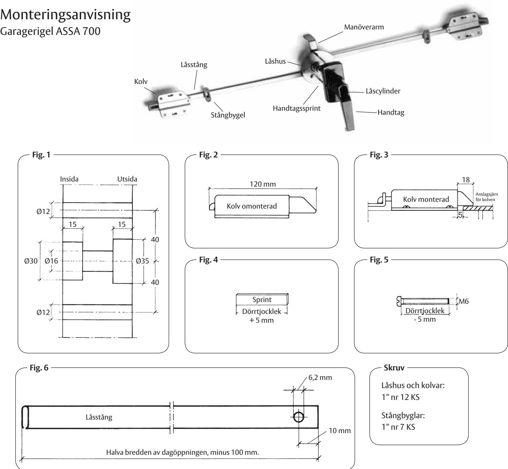

## **Förarbeten**

Dörren skall ha genomgående hål som fig. 1 visar. Placering mitt på dörrens bredd och cirka 500 mm från underkanten.

Vardera låsstångens längd skall vara lika med halva bredden av portens dagöppning, minus 100 mm (*fig. 6*).

Handtagssprintens längd skall vara dörrtjockleken plus 5 mm (*fig. 4*).

De två maskingängade skruvarna för ytterhandtaget skall ha längd lika med dörrtjockleken minus 5 mm (*fig. 5*).

Kontrollera att kolvmåttet är 120 mm. Eventuell justering görs genom vridning på kolvens dragstång (*fig. 2*).

Fäst cylindern (oval cylinder med kort medbringare av valfritt fabrikat) i handtaget med skruv M5 x 45.

## **Montering**

Skruva fast innerlåshuset med manöverarmen riktad uppåt.

Anslut låsstängerna till kolvarna och skruva fast kolvarna med spelrum om 5 mm till anslaget mot karm (*enl. fig. 3*).

Sätt en stångbygel på varje låsstång. Lossa kåpan på innerlåshuset och anslut vänster låsstång till den övre tappen och höger låsstång till den undre tappen. Skruva fast kåpan. Skruva fast stångbyglarna. Beakta att stången för sig något i vertikalled.

Fäst handtagssprinten horisontellt i ytterhandtaget.

Fäst ytterhandtaget med de maskingängade skruvarna.

Vid behov efterjustera kolvlängden med hänsyn till dörrens läge i sidled.

K

**ASSA OEM AB** Box 121 99 402 42 Göteborg Tel. 031-704 40 00 info.gbg@assaoem.se

www.assaoem.se