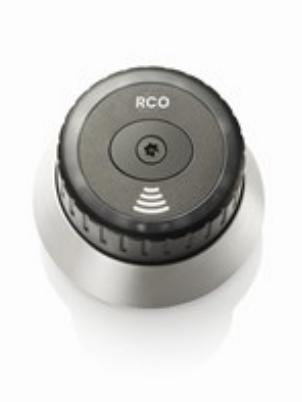

## LOCKR-CYL MIF85A

Artikelnummer: 20181010, E-nummer: 5871306

LockR Cylinder

LockR MIF85A Ofþine rundcylinder med cylinderring av härdat kromat stål (SSF Låsklass 5). MIF85A passar på dörrar med rundcylinder och modullåshus. MIF85A är testad enligt SFF 1091/SSF 3522 låsklass 5 med cylinderring av härdat kromat stål samt användning av Desýre EV2.

## **Tekniskbeskrivning:**

Cylindern fungerar som en NoKey ofþine i M5 vilket innebär att LockR-Cyl har samma system-begränsning M5 kan maximalt hantera 2047 ofþine enheter (Cylindrar + NoKey) per domän. Kravet för att cylinder skall fungera är M5 version M5 5.47 samt att objektet har relevant antal online läsare med stöd för initiering av taggar. Cylindern levereras med stöd för Desýre EV2 och Mifare Classic. Vid batteribyte håller cylindern konýgurationen i 3 timmar om längre tid passerar måste cylindern omprogrammeras via ODM. Cylindern har inbyggd klocka och kalender som sätts vid driftsättning av ODM programvaran. Klockan i enheten kan driva +- 30 sekunder per år i rumstemperatur. Klockan justeras automatiskt varje gång ODM programvaran kommunicerar med enheten. ODM programmet används alltid vid driftsättning, programmering, uppdatering av þash samt vid behov av detaljerad händelselog. 

| Utförande:            | Rundcylinderring med härdat kromat stål      |
|-----------------------|----------------------------------------------|
| SBSC Certiýerad:      | Testad RISE Låsklass 5 väntar på SBSC intyg  |
| Matningsspänning:     | 6V 2xCR2 Batterier skall uppfylla IEC60086-4 |
| Livslängd batterier:  | 3 år med 8 användningar per dag              |
| Systemkrav R-CARD M5: | 5.47 eller högre                             |
| Vikt:                 | 450g +(shims 32,5g)                          |
| Läsavstånd:           | 2-4 cm beroende på transponder               |
| Temperaturområde:     | -25 - +65 °C                                 |
| Sändarfrekvens:       | 13,56 Mhz                                    |
| Lästekniker:          | Desýre EV2/ Mifare (Låsklass5 endast Desýre) |
| Kapslingsklassning:   | IP67                                         |
| IK-klassning:         | IK8                                          |
| SBSC Certiýerad:      | SSF 3522,2 LK3 Nr:19-332                     |

## ELEKTRONISKA LÅS FÖR HEM OCH FÖRETAG