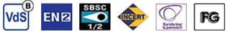
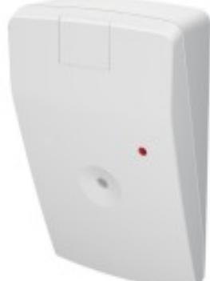

# AD 800

## Akustisk glaskrossdetektor

### **Produktdetajler:**

| Räckvidd max              | 9 m radie/ 165°                                                                                  |
|---------------------------|--------------------------------------------------------------------------------------------------|
| Godkännanden              | EN 50131-2-7-1:2013 Grade 2, VdS G117503, class B , SBSC 16-675 Klass 1/2, INCERT, F&P, FG |
| Recommended glass surface | Planglas 4 mm, laminerat P2,P4 (4 mm + 4mm)                                                   |
| Max glasyta               | 6 x 6 mm                                                                                         |
| Matningsspänning          | 7 - 30 VDC                                                                                       |
| Strömförbrukning          | 12 mA @ 12 V, 7.3 mA @ 24 V                                                                      |
| Larmutgång                | Relä,, NC 50 mA, 50 V DC/peak AC, Rs ≤30 Ω                                                    |
| Kontaktdata               | 50 mA, 50 V DC/peak AC, Rs ≤30 Ω                                                                 |
| Larmindikering            | LED                                                                                              |
| Sabotageskydd / data      | Ja / 48 VDC / 50 mA                                                                              |
| Anslutning                | Skruvplint                                                                                       |
| Arbetstemperatur          | +5 - +40°C                                                                                       |
| Kapsling, Färg            | ABS plast, Vit                                                                                   |
| Kapslingsklass            | IP 31                                                                                            |
| Mått (L x B x H) mm       | 68 x 39 x 110                                                                                    |

AD 800 är en ny generation av akustisk glaskrossdetektor som uppfyller kraven för **grad 2** av den nya standarden **EN 50131-2-7-1:2012.** 

Detektorn är utvecklad för att akustiskt detektera försök att ta sig in i ett skyddat område genom att krossa ett fönster eller glasparti. Detektorn är baserad på den senaste mikroprocessortekniken och har ett antal avancerade algoritmer kopplade till akustiken i rummet (Digital Room Compensation).Tack vare dessa algoritmer kan den särskilja signalen från krossat glas från andra störande signaler. Bevakningsområdet är 165°, vilket gör att en detektor kan bevaka ett flertal fönster i ett rum. Detektorn klarar av att detektera, standardglas, härdat glas och laminerat glas.

#### **Anmärkning: Undvik att montera detektorn i hörn samt nära luftintag och ventilation.**

| BESTÄLLINGSINFORMATION |         |                            |  |
|------------------------|---------|----------------------------|--|
| Typ                    | E-nr    | Beskrivning                |  |
| AD 800                 | 6309847 | Akustisk glaskrossdetektor |  |

### **Relaterade produkter och tillbehör:**

| ADT 700                                            |
|----------------------------------------------------|
| Akustisk testare för AD-serien (700/700-AM/800-AM) |
|                                                    |
|                                                    |
|                                                    |
|                                                    |

Powered by TCPDF (www.tcpdf.org)