# **DS-2DE4225IW-DE (E) 2MP 25× Network IR Speed Dome**

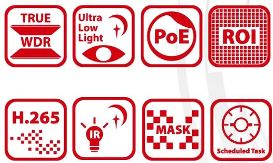

Hikvision DS-2DE4225IW-DE (E) 2MP 25× Network IR Speed Dome adopts 1/2.8" progressive scan CMOS chip. With the 25× optical zoom lens, the camera offers more details over expansive areas.

This series of cameras can be widely used for wide ranges of high-definition, such as the rivers, roads, railways, airports, squares, parks, scenic spots, and venues, etc.

#### **Key Features**

- 1/2.8" progressive scan CMOS
- Up to 1920 × 1080@30fps resolution
- Min. illumination: Color: 0.005 Lux @(F1.6, AGC ON) B/W: 0.001 Lux @(F1.6, AGC ON) 0 Lux with IR
- 25× optical zoom, 16× digital zoom
- WDR, HLC, BLC, 3D DNR, Defog, EIS, Regional Exposure, Regional Focus
- Up to 100 m IR distance
- 12 VDC & PoE (802.3 at, class4)
- Support H.265+/H.265 video compression

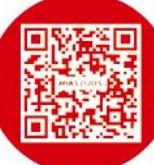

|  | Specification |
|--|---------------|
|  |               |

| Camera Module         |                                                                                                                                                            |  |  |  |  |
|-----------------------|------------------------------------------------------------------------------------------------------------------------------------------------------------|--|--|--|--|
| Image Sensor          | 1/2.8" progressive scan CMOS                                                                                                                               |  |  |  |  |
| Min. Illumination     | Color: 0.005 Lux @(F1.6, AGC ON) B/W: 0.001Lux @(F1.6, AGC ON) 0 Lux with IR                                                                         |  |  |  |  |
| White Balance         | Auto/Manual/ATW (Auto-tracking White Balance)/Indoor/Outdoor/Fluorescent Lamp/Sodium Lamp                                                               |  |  |  |  |
| Gain                  | Auto/Manual                                                                                                                                                |  |  |  |  |
| Shutter Time          | 50Hz: 1/1 s to 1/30,000 s 60Hz: 1/1 s to 1/30,000 s                                                                                                     |  |  |  |  |
| Day & Night           | IR Cut Filter                                                                                                                                              |  |  |  |  |
| Digital Zoom          | 16×                                                                                                                                                        |  |  |  |  |
| Privacy Mask          | 24 programmable privacy masks                                                                                                                              |  |  |  |  |
| Focus Mode            | Auto/Semi-automatic/Manual                                                                                                                                 |  |  |  |  |
| WDR                   | 120 dB WDR                                                                                                                                                 |  |  |  |  |
| Lens                  |                                                                                                                                                            |  |  |  |  |
| Focal Length          | 4.8 mm to 120 mm, 25× optical zoom                                                                                                                         |  |  |  |  |
| Zoom Speed            | Approx. 3.6 s (optical lens, wide-tele)                                                                                                                    |  |  |  |  |
| Field of View         | Horizontal field of view: 57.6° to 2.5°(Wide-Tele) Vertical field of view: 34.4° to 1.4°(Wide-Tele) Diagonal field of view: 64.5° to 2.9°(Wide-Tele) |  |  |  |  |
| Working Distance      | 10 mm to 1500 mm (wide-tele)                                                                                                                               |  |  |  |  |
| Aperture Range IR  | F1.6 to F3.5                                                                                                                                               |  |  |  |  |
| IR Distance           | 100 m                                                                                                                                                      |  |  |  |  |
| Smart IR              | Yes                                                                                                                                                        |  |  |  |  |
| PTZ                   |                                                                                                                                                            |  |  |  |  |
| Movement Range (Pan)  | 360° endless                                                                                                                                               |  |  |  |  |
| Pan Speed             | Configurable, from 0.1°/s to 80°/s, Preset speed: 80°/s                                                                                                 |  |  |  |  |
| Movement Range (Tilt) | From -15° to 90°(auto-flip)                                                                                                                                |  |  |  |  |
| Tilt Speed            | Configurable, from 0.1°/s to 80°/s Preset Speed: 80°/s                                                                                                  |  |  |  |  |
| Proportional Zoom     | Yes                                                                                                                                                        |  |  |  |  |
| Presets               | 300                                                                                                                                                        |  |  |  |  |
| Patrol Scan           | 8 patrols, up to 32 presets for each patrol                                                                                                                |  |  |  |  |
| Pattern Scan          | 4 pattern scans, record time over 10 minutes for each scan                                                                                                 |  |  |  |  |
| Power-off Memory      | Yes                                                                                                                                                        |  |  |  |  |
| Park Action           | Preset/Pattern Scan/Patrol Scan/Auto Scan/Tilt Scan/Random Scan/Frame Scan/Panorama Scan                                                                |  |  |  |  |
| 3D Positioning        | Yes                                                                                                                                                        |  |  |  |  |
| PTZ Position Display  | Yes                                                                                                                                                        |  |  |  |  |
| Preset Freezing       | Yes                                                                                                                                                        |  |  |  |  |
| Scheduled Task        | Preset/Pattern Scan/Patrol Scan/Auto Scan/Tilt Scan/Random Scan/Frame Scan/Panorama Scan/Dome Reboot/Dome Adjust/Aux Output                             |  |  |  |  |
| Compression Standard  |                                                                                                                                                            |  |  |  |  |
| Video Compression     | Main Stream: H.265+/H.265/H.264+/H.264 Sub-stream: H.265/H.264/MJPEG Third Stream: H.265/H.264/MJPEG                                                 |  |  |  |  |
| H.264 Type            | Baseline Profile/Main Profile/High Profile                                                                                                                 |  |  |  |  |

| H.264+                            | Yes                                                                                                                                                                                                                                                                                                                                                    |  |  |
|-----------------------------------|--------------------------------------------------------------------------------------------------------------------------------------------------------------------------------------------------------------------------------------------------------------------------------------------------------------------------------------------------------|--|--|
| H.265 Type                        | Baseline Profile/Main Profile/High Profile                                                                                                                                                                                                                                                                                                             |  |  |
| H.265+                            | Yes                                                                                                                                                                                                                                                                                                                                                    |  |  |
| Video Bitrate                     | 32 Kbps to 16384 Kbps                                                                                                                                                                                                                                                                                                                                  |  |  |
| Audio Compression                 | G.711alaw/G.711ulaw/G.722.1/G.726/MP2L2/PCM                                                                                                                                                                                                                                                                                                            |  |  |
| Audio Bitrate                     | G.711alaw/G.711ulaw: 64 Kbps G.722.1/G.726: 16 Kbps MP212/PCM: 32 Kbps/64 Kbps/128 Kbps                                                                                                                                                                                                                                                          |  |  |
| SVC                               | Yes                                                                                                                                                                                                                                                                                                                                                    |  |  |
| Smart Features                    |                                                                                                                                                                                                                                                                                                                                                        |  |  |
| Basic Event                       | Motion Detection, Video Tampering Detection, Exception                                                                                                                                                                                                                                                                                                 |  |  |
| Smart Event                       | Intrusion Detection, Line Crossing Detection, Region Entrance Detection, Region Exiting Detection, Object Removal Detection, Unattended Baggage Detection                                                                                                                                                                                           |  |  |
| Smart Record                      | ANR (Automatic Network Replenishment), Dual-VCA                                                                                                                                                                                                                                                                                                        |  |  |
| ROI                               | Main stream, sub-stream, and third stream respectively support four fixed areas.                                                                                                                                                                                                                                                                       |  |  |
| Image                             |                                                                                                                                                                                                                                                                                                                                                        |  |  |
| Max. Resolution                   | 1920 × 1080                                                                                                                                                                                                                                                                                                                                            |  |  |
| Main Stream                       | 50Hz: 25fps (1920 × 1080, 1280 × 960, 1280 × 720) 50fps (1280 × 960, 1280 × 720) 60Hz: 30fps (1920 × 1080, 1280 × 960, 1280 × 720) 60fps (1280 × 960, 1280 × 720)                                                                                                                                                                             |  |  |
| Sub-Stream                        | 50Hz: 25fps (704 × 576, 640 × 480, 352 × 288) 60Hz: 30fps (704 × 480, 640 × 480, 352 × 240)                                                                                                                                                                                                                                                         |  |  |
| Third Stream                      | 50Hz: 25fps (1920 × 1080, 1280 × 960, 1280 × 720, 704 × 576, 640 × 480, 352 × 288) 60Hz: 30fps (1920 × 1080, 1280 × 960, 1280 × 720, 704 × 480, 640 × 480, 352 × 240)                                                                                                                                                                               |  |  |
| Image Enhancement                 | HLC/BLC/3D DNR/Defog/EIS/Regional Exposure/Regional Focus                                                                                                                                                                                                                                                                                              |  |  |
| Network                           |                                                                                                                                                                                                                                                                                                                                                        |  |  |
|                                   |                                                                                                                                                                                                                                                                                                                                                        |  |  |
| Network Storage                   | Built-in memory card slot, support Micro SD/SDHC/SDXC, up to 256 GB; NAS (NFS, SMB/ CIFS), ANR                                                                                                                                                                                                                                                      |  |  |
| Protocols                         | IPv4/IPv6, HTTP, HTTPS, 802.1x, Qos, FTP, SMTP, UPnP, SNMP, DNS, DDNS, NTP, RTSP, RTCP, RTP, TCP/IP, UDP, IGMP, ICMP, DHCP, PPPoE, Bonjour                                                                                                                                                                                                          |  |  |
| API                               | ONVIF (Profile S, Profile G, Profile T), ISAPI, SDK                                                                                                                                                                                                                                                                                                    |  |  |
| Simultaneous Live View            | Up to 20 channels                                                                                                                                                                                                                                                                                                                                      |  |  |
| User/Host                         | Up to 32 users 3 levels: Administrator, Operator and User                                                                                                                                                                                                                                                                                           |  |  |
| Security Measures                 | User authentication (ID and PW), Host authentication (MAC address); HTTPS encryption; IEEE 802.1x port-based network access control; IP address filtering                                                                                                                                                                                           |  |  |
| Client                            | iVMS-4200, iVMS-4500, iVMS-5200, Hik-Connect                                                                                                                                                                                                                                                                                                           |  |  |
| Web Browser                       | IE 8 to 11, Chrome 31.0+, Firefox 30.0+, Edge 16.16299+                                                                                                                                                                                                                                                                                                |  |  |
| Interface                         |                                                                                                                                                                                                                                                                                                                                                        |  |  |
| Audio Interface                   | 1-ch audio input and 1-ch audio output                                                                                                                                                                                                                                                                                                                 |  |  |
| Network Interface                 | 1 RJ45 10 M/100 M Ethernet, PoE (802.3 at, class4)                                                                                                                                                                                                                                                                                                     |  |  |
| General                           |                                                                                                                                                                                                                                                                                                                                                        |  |  |
| Language (Web Browser Access ) | 32 languages. English, Russian, Estonian, Bulgarian, Hungarian, Greek, German, Italian, Czech, Slovak, French, Polish, Dutch, Portuguese, Spanish, Romanian, Danish, Swedish, Norwegian, Finnish, Croatian, Slovenian, Serbian, Turkish, Korean, Traditional Chinese, Thai, Vietnamese, Japanese, Latvian, Lithuanian, Portuguese (Brazil) |  |  |
| Power                             | 12 VDC, 2.0 A and PoE (802.3at), 42.5 to 57 VDC, 0.6A, Class4 Max.18 W, including max.7W for IR                                                                                                                                                                                                                                                     |  |  |
| Working Temperature               | -30°C to 65°C (-22°F to 149°F)                                                                                                                                                                                                                                                                                                                         |  |  |

| Protection Level | IP66 Standard, 4000V Lightning Protection, Surge Protection and Voltage Transient Protection |
|------------------|-------------------------------------------------------------------------------------------------|
| Material         | ADC 12, PC, PC+10% GF                                                                           |
| Dimensions       | Φ 164.5 mm × 290 mm (Φ 6.48" × 11.42")                                                          |
| Weight           | Approx. 2 kg (4.41 lb)                                                                          |

### **DORI**

The DORI (detect, observe, recognize, identify) distance gives the general idea of the camera ability to distinguish persons or objects within its field of view.

It is calculated based on the camera sensor specification and the criteria given by EN 62676-4: 2015.

| DORI            | Detect               | Observe             | Recognize           | Identify           |
|-----------------|----------------------|---------------------|---------------------|--------------------|
| Definition      | 25 px/m              | 63 px/m             | 125 px/m            | 250 px/m           |
| Distance (Tele) | 1600.0 m (5249.3 ft) | 634.9 m (2083.1 ft) | 320.0 m (1049.9 ft) | 160.0 m (524.9 ft) |

## **Available Model**

DS-2DE4225IW-DE (E), 12 VDC & PoE (802.3 at, class4)

### **Dimensions**

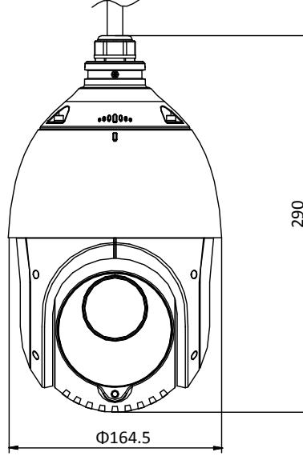

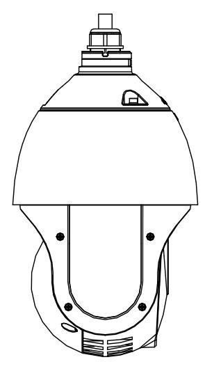

Unit: mm

#### **Accessory Included:**

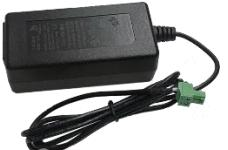

ASW0081-1220002W Power adapter **Optional:**

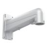

DS-1602ZJ Wall Mount

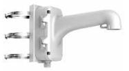

DS-1604ZJ-pole Vertical Pole Mount

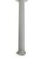

DS-1662ZJ Pendant Mount

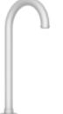

DS-1619ZJ Gooseneck Mount

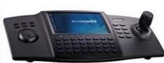

DS-1100KI Network Keyboard

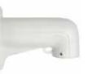

DS-1618ZJ Wall Mount

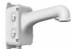

DS-1604ZJ-box Wall mount with junction box

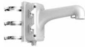

DS-1604ZJ-BOX-POLE Vertical Pole Mount with junction box

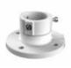

DS-1663ZJ Ceiling Mount

DS-1660ZJ Parapet wall mount

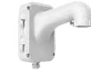

DS-1604ZJ Wall mount with junction box

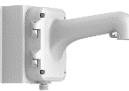

DS-1604ZJ-corner Corner Mount

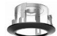

DS-1671ZJ-SDM9 In-ceiling mount

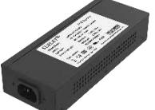

LAS60-57CN-RJ45 Hi-PoE midspan

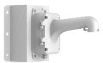

DS-1604ZJ-BOX-CORNER Wall Mount with junction box

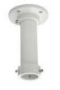

DS-1661ZJ Pendant Mount

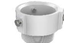

DS-1681ZJ Installation Adapter

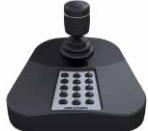

DS-1005KI USB Joy-stick

Distributed by

-

HIKVISION®

#### Headquarters

No.555 Qianmo Road, Binjiang District, Hangzhou 310051, China T +86-571-8807-5998 overseasbusiness@hikvision.com

HIkvision USA T +1-909-895-0400 sales.usa@hikvision.com

Hikvision Australia
T +61-2-8599-4233 salesau@hikvision.com

Hikvision India T +91-22-28469900 sales@pramahikvision.com

Hikvision Canada T+1-866-200-6690 sales.canada@hikvision.com

Hikvision Thailand T +662-275-9949 sales.thailand@hikvision.com Hikvision Europe T +31-23-5542770 sales.eu@hikvision.com

Hikvision Italy

T +39-0438-6902 info.it@hikvision.com Hikvision Brazil 1 +55 11 3318-0050

Latam.support(@hikvision.com Hikvision Turkey T +90 (216)521 7070- 7074

Hikvision Malaysia T +601-7652-2413 sales.my@hikvision.com

sales.tr@hikvision.com

HIkvision UK & Ireland T +01628-902140 sales.uk@hikvision.com

Hikvision South Africa Tel: +27 (10) 0351172 sale.africa@hikvision.com

Hikvision France 1 +33(0)1-85-330-450 info.fr@hikvision.com

Hikvision Kazakhstan 1 +1-121-9150661 nikia.panfilov@hikvision.ru

Hikvision Vietnam T +84-974270888 sales.vt@hikvision.com

Hikvision UAE T +971-4-4432090 salesme@hikvision.com

Hikvision Singapore
T +65-6684-4718 sg@hikvision.com

Hikvision Spain T +34-91-737-16-55 info.es@hikvision.com

Hikvision Tashkent T +99-87-1238-9438 uzb@hikvision.ru

Hikvision Hong Kong T +852-2151-1761 info.hk@hikvision.com

#### 05060020190904

Hikvision Russla T +7-495-669-67-99 saleru@hikvision.com

Hikvision Korea T +82-(0)31-731-8817 sales.korea@hikvision.com

Hikvision Poland 1 +48-22-460-01-50 info.pl@hikvision.com

Hikvision Indonesia T +62-21-2933759 Sales.Indonesia@hikvision.com

Hikvision Colombia sales.colombia@hikvision.com

© Hikvision Digital Technology Co., Ltd. 2019 | Data subject to change without notice |