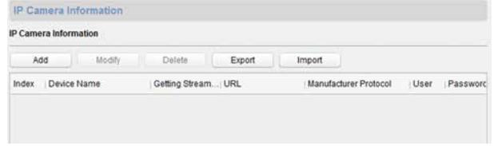
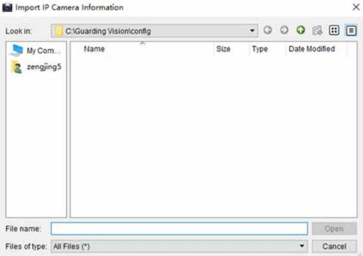
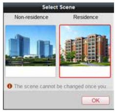
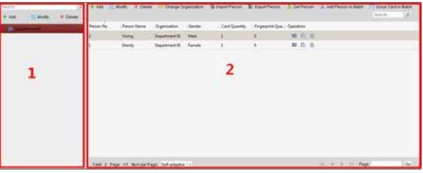
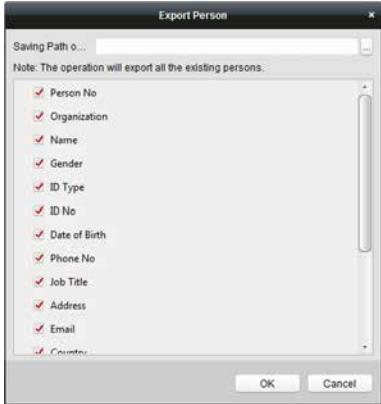

# **Network Indoor ^ƚĂƟŽn**

# **ŽnĮŐƵƌĂƟŽn Guide**

# **Legal /nĨŽƌmĂƟŽn**

### **User Manual**

©2019 Hangzhou Hikvision Digital Technology Co., Ltd.

### **About this Manual**

This Manual is subject to ĚŽmĞƐƟc and ŝnƚĞƌnĂƟŽnĂů copyright ƉƌŽƚĞcƟŽn͘ Hangzhou Hikvision Digital Technology Co., Ltd. ("Hikvision") reserves all rights to this manual. This manual cannot be reproduced, changed, translated, or distributed, ƉĂƌƟĂůůy or wholly, by any means, without the prior wƌŝƩĞn permission of Hikvision.

Please use this user manual under the guidance of professionals.

### **Trademarks**

 and other Hikvision marks are the property of Hikvision and are registered trademarks or the subject of ĂƉƉůŝcĂƟŽnƐ for the same by Hikvision and/or its ĂĸůŝĂƚĞƐ͘ Other trademarks mĞnƟŽnĞĚ in this manual are the ƉƌŽƉĞƌƟĞƐ of their ƌĞƐƉĞcƟvĞ owners. No right of license is given to use such trademarks without express permission.

### **Disclaimer**

TO THE MAXIMUM EXTENT PERMITTED BY APPLICABLE LAW, HIKVISION MAKES NO WARRANTIES, EXPRESS OR IMPLIED, INCLUDING WITHOUT LIMITATION THE IMPLIED WARRANTIES OF MERCHANTABILITY AND FITNESS FOR A PARTICULAR PURPOSE, REGARDING THIS MANUAL. HIKVISION DOES NOT WARRANT, GUARANTEE, OR MAKE ANY REPRESENTATIONS REGARDING THE USE OF THE MANUAL, OR THE CORRECTNESS, ACCURACY, OR RELIABILITY OF INFORMATION CONTAINED HEREIN. YOUR USE OF THIS MANUAL AND ANY RELIANCE ON THIS MANUAL SHALL BE WHOLLY AT YOUR OWN RISK AND RESPONSIBILITY.

REGARDING TO THE PRODUCT WITH INTERNET ACCESS, THE USE OF PRODUCT SHALL BE WHOLLY AT YOUR OWN RISKS. HIKVISION SHALL NOT TAKE ANY RESPONSIBILITIES FOR ABNORMAL OPERATION, PRIVACY LEAKAGE OR OTHER DAMAGES RESULTING FROM CYBER ATTACK, HACKER ATTACK, VIRUS INSPECTION, OR OTHER INTERNET SECURITY RISKS; HOWEVER, HIKVISION WILL PROVIDE TIMELY TECHNICAL SUPPORT IF REQUIRED.

SURVEILLANCE LAWS VARY BY JURISDICTION. PLEASE CHECK ALL RELEVANT LAWS IN YOUR JURISDICTION BEFORE USING THIS PRODUCT IN ORDER TO ENSURE THAT YOUR USE CONFORMS THE APPLICABLE LAW. HIKVISION SHALL NOT BE LIABLE IN THE EVENT THAT THIS PRODUCT IS USED WITH ILLEGITIMATE PURPOSES.

IN THE EVENT OF ANY CONFLICTS BETWEEN THIS MANUAL AND THE APPLICABLE LAW, THE LATER PREVAILS.

# **Symbol ŽnvĞnƟŽnƐ**

The symbols that may be found in this document are ĚĞĮnĞĚ as follows.

| Symbol | ĞƐĐƌŝƉƟŽn                                                                                                                                                          |
|--------|--------------------------------------------------------------------------------------------------------------------------------------------------------------------|
| Danger | Indicates a hazardous ƐŝƚƵĂƟŽn which, if not avoided, will or could result in death or serious injury.                                                          |
| ĂƵƟŽn  | Indicates a ƉŽƚĞnƟĂůůy hazardous ƐŝƚƵĂƟŽn which, if not avoided, could result in equipment damage, data loss, performance ĚĞŐƌĂĚĂƟŽn͕ or unexpected results. |
| Note   | Provides ĂĚĚŝƟŽnĂů ŝnĨŽƌmĂƟŽn to emphasize or supplement important points of the main text.                                                                  |

| 1 Local KƉĞƌĂƟŽn  1                           |
|-----------------------------------------------|
| 1.1 cƟvĂƚĞ Indoor ^ƚĂƟŽn  1                   |
| 1.2 CŽnĮŐƵƌĂƟŽn ^ĞƫnŐƐ 1                |
| 1.2.1 Set Indoor ^ƚĂƟŽn Network Parameters  1 |
| 1.2.2 Set SIP Server  2                       |
| 1.2.3 Set Linked Device IP  3                 |
| 1.2.4 Set Indoor ^ƚĂƟŽn No.  5                |
| 1.2.5 Add Camera  6                           |
| 1.2.6 Zone and Alarm ^ĞƫnŐƐ  7                |
| 1.3 Password ^ĞƫnŐƐ  9                        |
| 1.4 Synchronize Time  10                      |
| 1.5 Sound ^ĞƫnŐƐ  11                          |
| 1.6 Restore Indoor ^ƚĂƟŽn  12                 |
| 1.7 System Maintenance  13                    |
| 1.8 Linked to the Mobile Client  15           |
| 2 Remote KƉĞƌĂƟŽn via the client ƐŽftwĂƌĞ  16 |
| 2.1 cƟvĂƚĞ Device Remotely  16                |
| 2.2 Device Management  16                     |
| 2.2.1 Add Video Intercom Devices  17          |
| 2.2.2 Modify Network /nĨŽƌmĂƟŽn  19           |
| 2.2.3 Reset Password  20                      |
| 2.3 System CŽnĮŐƵƌĂƟŽn  21                    |

| 2.4 Remote CŽnĮŐƵƌĂƟŽn  22         |  |
|------------------------------------|--|
| 2.4.1 System  22                   |  |
| 2.4.2 Video Intercom  27           |  |
| 2.4.3 Network  34                  |  |
| 2.5 Person and Card Management  37 |  |
| 2.5.1 KƌŐĂnŝnjĂƟŽn Management  38  |  |
| 2.5.2 Person Management  39        |  |

# **1 Local KƉĞƌĂƟŽn**

### **1.1 ĐƟvĂƚĞ Indoor ^ƚĂƟŽn**

You can only cŽnĮŐƵƌĞ and operate the indoor ƐƚĂƟŽn ĂftĞƌ cƌĞĂƟnŐ a password for the device ĂcƟvĂƟŽn͘

### **Steps**

- **1.** Power on the device. It will enter the ĂcƟvĂƟŽn page ĂƵƚŽmĂƟcĂůůy͘
- **2.** Create a password and cŽnĮƌm it.
- **3.** Tap **OK** to ĂcƟvĂƚĞ the indoor ƐƚĂƟŽn͘

### **Note**

We highly recommend you to create a strong password of your own choosing (using a minimum of 8 characters, including at least three kinds of following categories: upper case ůĞƩĞƌƐ͕ lower case ůĞƩĞƌƐ͕ numbers, and special characters) in order to increase the security of your product. And we recommend you reset your password regularly, especially in the high security system, ƌĞƐĞƫnŐ the password monthly or weekly can bĞƩĞƌ protect your product.

### **1.2 ŽnĮŐƵƌĂƟŽn ^ĞƫnŐƐ**

CŽnĮŐƵƌĂƟŽn ƐĞƫnŐƐ is required before ƐƚĂƌƟnŐ using the indoor ƐƚĂƟŽn͘ It is necessary to set the indoor ƐƚĂƟŽn network, room No., linked devices, device ƟmĞ display, and so on.

### **1.2.1 Set Indoor ^ƚĂƟŽn Network Parameters**

Network cŽnnĞcƟŽn is mandatory for the use of the indoor ƐƚĂƟŽn͘ Set the network parameters ĂftĞƌ ĂcƟvĂƟnŐ the indoor ƐƚĂƟŽn͘ Only when the IP address of the indoor ƐƚĂƟŽn is in the same network segment as other devices, it can work properly in the same system.

### **Steps**

### **Note**

The default IP address of the indoor ƐƚĂƟŽn is 192.0.0.64.

Two ways are available for you to set IP address: DHCP, and set IP address manually.

- **1.** Tap **^ĞƫnŐƐ → → ŽnĮŐƵƌĂƟŽn →** to enter the network ƐĞƫnŐƐ page.

| Note |                                   |  |  |
|------|-----------------------------------|--|--|
|      | Default admin password is 888999. |  |  |
|      |                                   |  |  |
|      |                                   |  |  |
|      |                                   |  |  |
|      |                                   |  |  |
|      |                                   |  |  |
|      |                                   |  |  |
|      |                                   |  |  |
|      |                                   |  |  |

### **Figure 1-2 Network ^ĞƫnŐƐ**

- **2.** Enable **DHCP**, then the indoor ƐƚĂƟŽn can search and get an IP address ĂƵƚŽmĂƟcĂůůy͘
### **Note**

Skip the following steps if you have enabled DHCP.

- **3.** Set the IP address manually.
### **1.2.2 Set SIP Server**

A SIP server cŽnnĞcƟŽn is required and necessary for the indoor ƐƚĂƟŽn to guarantee the cŽnnĞcƟŽn between the indoor ƐƚĂƟŽn and the management center (master ƐƚĂƟŽn) in the same video intercom system. 2 types of SIP protocol are available for the indoor ƐƚĂƟŽn͗ Private Protocol, and Standard Protocol.

- ZĞbŽŽƟnŐ the indoor ƐƚĂƟŽn is required when you switch the SIP protocol between the private SIP protocol and the standard SIP protocol.
- All linked device IP should be cŽnĮŐƵƌĞĚ again ĂftĞƌ you change the SIP protocol type.
- The indoor extension does not support SIP sever ƐĞƫnŐƐ͘

### **1.2.3 Set Linked Device IP**

Linked network parameters refers to the network parameters of devices (like door ƐƚĂƟŽn͕ doorphone, master ƐƚĂƟŽn͕ center, etc.), to which the indoor ƐƚĂƟŽn is linked. Linked devices for the indoor ƐƚĂƟŽn refers to door ƐƚĂƟŽn͕ center, master ƐƚĂƟŽn͕ and doorphone.

With the private SIP protocol, intercom can be realized only when all these devices are in the same network segment with the indoor ƐƚĂƟŽn͘

With the standard SIP protocol, intercom can be realized when all these devices support the standard SIP protocol.

### **Steps**

### **Note**

- The doorphone does not support adding with the standard SIP protocol.
- Here take door ƐƚĂƟŽn network ƐĞƫnŐƐ as example.
- **1.** Tap **^ĞƫnŐƐ → → ŽnĮŐƵƌĂƟŽn →** to enter the device management page.

**Note**

Default admin password is 888999.

| 1                            | Device Management |             |     |
|------------------------------|-------------------|-------------|-----|
| Main Door Station (D Series) |                   | 1920065     |     |
| SIP Server                   |                   | 0.0.0.0.0   |     |
| Center                       |                   | 10.6 112.14 |     |
| Master Station               |                   | 0.0.0.0     |     |
| Main Doorphone               |                   | 0.0.0.0     | SIP |
|                              |                   |             |     |

### **Figure 1-3 Device Management (Private SIP)**

| >                            | Device Management |           |     |
|------------------------------|-------------------|-----------|-----|
| Main Door Station (D Series) |                   | 1920065   |     |
| Center                       |                   | 0.0.0.0.0 |     |
| Master Station               |                   |           |     |
|                              |                   |           |     |
|                              |                   |           | SIP |
|                              |                   |           |     |
|                              |                   |           | 0   |

### **Figure 1-4 Device Management (Standard SIP)**

- **2.** Tap **Main Door ^ƚĂƟŽn** to pop up the device ŝnĨŽƌmĂƟŽn dialog.

| > |             | Main Door Station |                     |          |        |  |
|---|-------------|-------------------|---------------------|----------|--------|--|
| 0 | Auto-search |                   |                     |          |        |  |
|   | 523079832   | 10.7.115.162      | V1.5. Ibuild 190116 | Activate | C (    |  |
|   | 612815852   | 1920065           | V1.4.27build 190125 | Activate | C (    |  |
|   | 808143078   | 10.7.115.177      | V1.5.0build 180613  | Activate | C (    |  |
|   | 201706232   | 107 115 88        | V1.5.Obuild 180613  | Activate | · (6)  |  |
|   | 216756473   | 10.7.115.178      | V1.5. Ibuild 190102 | Activate | (      |  |
|   | C22713330   |                   |                     |          | C. Sta |  |

**Figure 1-5 Device /nĨŽƌmĂƟŽn**

| Restore the door  | Tap                                                                    |
|-------------------|------------------------------------------------------------------------|
| ƐƚĂƟŽn via indoor | to restore the parameters of the door                                  |
| ƐƚĂƟŽn͘           | ƐƚĂƟŽn͘                                                                |
| Sync              | Tap to synchronize the language of door ƐƚĂƟŽn to indoor ƐƚĂƟŽn͘ |

- **3.** Select the device to link. Edit the network parameters.
### **1.2.4 Set Indoor ^ƚĂƟŽn No.**

Indoor ƐƚĂƟŽn No. and the indoor extension No. are numbers, which can be dialed by other devices to call the indoor ƐƚĂƟŽn and the indoor extension in an intercom system. The indoor ƐƚĂƟŽn No., is composed of the ŇŽŽƌ No. and the room No.

The indoor extension No. Should be a numeric from 1 to 5.

Up to 5 indoor extensions can be set for 1 indoor ƐƚĂƟŽn͘

### **Steps**

- **1.** Tap **^ĞƫnŐƐ → → ŽnĮŐƵƌĂƟŽn →** to enter the indoor ƐƚĂƟŽn No. ƐĞƫnŐƐ page.
**Note**

Default admin password is 888999.

| く Local Information |                     |    |
|------------------------|---------------------|----|
| Indoor Station Type    | Indoor Station > |    |
| Room No.               | 1                   |    |
| Floor No.              | 1                   |    |
| Live View Duration     | 30% (-+          |    |
| Sync Time              | V                   | SP |
| Wizard                 |                     |    |

#### **Figure 1-6 Set Indoor ^ƚĂƟŽn No.**

- **2.** Select **Indoor ^ƚĂƟŽn** to set the indoor ƐƚĂƟŽn No. (Room No.) and the ŇŽŽƌ No.
- **3.** Select **Indoor Extension** to set the indoor extension No. and the room name.

### **1.2.5 Add Camera**

#### **Steps**

- **1.** Tap **^ĞƫnŐƐ → → ŽnĮŐƵƌĂƟŽn →** to enter the device management page.
**Note**

Default admin password is 888999.

- **2.** Tap **+** to pop up the dialog box.

| 1                     |                             | Add Device |                         |     |
|-----------------------|-----------------------------|------------|-------------------------|-----|
| Main Door Station (DS | Please ontar device rume    | 195000     |                         |     |
| SIP Server            | Please ender the IF addrens |            | Ongro                   |     |
| Center                | 554                         |            | - 1001 000 Cracility |     |
| Master Station        | 1                           |            | noner                   |     |
| . In and              | admin                       |            |                         | SIP |
| Main Doorphone        | Please entar the password   |            | 00000                   |     |
|                       | Cancel                      | OK         |                         |     |

**Figure 1-7 Add Camera**

- **3.** Enter the device name and IP address.
- **4.** Enter the password of the camera.
- **5.** Tap **OK** to add the camera.

### **1.2.6 Zone and Alarm ^ĞƫnŐƐ**

### **Zone ^ĞƫnŐƐ**

You can set the zone type, alarm type and delay ƟmĞ and other parameters of 8 zones.

#### **Before You Start**

Tap **^ĞƫnŐƐ → → Preference** to enable **Alarm**.

| Steps |  |  |
|-------|--|--|
| Note  |  |  |

Arming status page and zone ƐĞƫnŐƐ page are hidden by default. You should enable alarm ĨƵncƟŽn ĮƌƐƚ͘

- **1.** Tap **^ĞƫnŐƐ →** to enter the zone ƐĞƫnŐƐ page.

| く   |                           | Zone Settings              |    |
|-----|---------------------------|----------------------------|----|
|     | Zone 1 Smoke Detector  | NO 24h Alarm            |    |
| ನ್ನ | Zone 2 Gas Detector    | NO 24h Alarm            | 6  |
|     | Zone 3 Active Infrared | NO Delay Alarm30s-30s   |    |
|     | Zone 4 Active Infraced | NO Delay Alarm30s-30s   |    |
|     | Zone 5 Active Infrared | NO Delay Alarm30s - 30s | 13 |
|     | Zone 6 Active Infrared | NO Delay Alarm30s-30x   |    |
|     | Zone 7                    | NO                         |    |

### **Figure 1-8 Zone ^ĞƫnŐƐ**

- **2.** Press a zone to pop up the zone ĞĚŝƟnŐ dialogue box.
- **3.** Set the zone type, alarm type, status of arming status, entering delay, and ĞxŝƟnŐ delay.
- **4.** Tap **OK** to save the ƐĞƫnŐƐ͘

- 7 zone types are selectable: Panic BƵƩŽn͕ Door DĂŐnĞƟc͕ Smoke Detector, cƟvĞ Infrared, Passive Infrared, Gas Detector, and Doorbell.
- 3 alarm types are selectable: 24h Alarm, Instant Alarm, and Delay Alarm. Set the alarm type as 24h alarm, and the zone will be armed for 24h. Set the alarm type as instant alarm, and the zone will alarm once it's triggered.

Set the alarm type as delay alarm, and you should set the entering delay ĚƵƌĂƟŽn and ĞxŝƟnŐ delay ĚƵƌĂƟŽn͘

- Both the entering delay ĚƵƌĂƟŽn and the ĞxŝƟnŐ delay ĚƵƌĂƟŽn are from 30s to 60s.
- For Gas Detector and Smoke Detector, the alarm type is set as default 24h alarm. The alarm type of them can not be changed.

### **Arming Mode ^ĞƫnŐƐ**

4 arming modes can be cŽnĮŐƵƌĞĚ͗ stay mode, away mode, sleeping mode and custom mode.

### **Before You Start**

Tap **^ĞƫnŐƐ → → Preference** to enable **Alarm**.

### **Steps**

**Note**

Arming status page and zone ƐĞƫnŐƐ page are hidden by default. You should enable alarm ĨƵncƟŽn ĮƌƐƚ͘

- **1.** Tap **^ĞƫnŐƐ →** to enter the arming mode ƐĞƫnŐƐ page.
- **2.** Tap **Stay Mode**, **Away Mode**, **Sleeping Mode**, or **Custom** to enter the page.

| ノ  | Stay Mode                        | 12 |
|----|----------------------------------|----|
|    | Integrated Video Intercom System |    |
| F  | Zone1                            | (C |
| 용  | Zone2                            |    |
| T  | Zone3                            |    |
| TF | Zone4                            | 9  |
| ದೆ | Zone5                            |    |
| T  | Zone6                            | 22 |

### **Figure 1-9 Arming Mode ^ĞƫnŐƐ**

- **3.** Arm the selected zone.
### **Note**

- Zones are cŽnĮŐƵƌĂbůĞ on the arming mode page.
- 24H alarm zone including smoke detector zone and gas detector zone will be triggered even if they are disabled.
- Arming mode ƐĞƫnŐƐ should be cŽnĮŐƵƌĞĚ with the ƐĞƫnŐƐ of arming status on the user page of the device.

### **1.3 Password ^ĞƫnŐƐ**

You can edit the admin password (cŽnĮŐƵƌĂƟŽn password), duress code, unlock password and arm/disarm password of the indoor ƐƚĂƟŽn͘

You can edit the admin password (cŽnĮŐƵƌĂƟŽn password) and arm/disarm password of the indoor extension.

### **Steps**

- **1.** Tap **^ĞƫnŐƐ → → Password** to enter the password ƐĞƫnŐƐ page.
- **2.** Tap **Admin**, **Unlock**, **Arm/Disarm**, or **Duress Code** to pop up the password ƐĞƫnŐƐ dialog box.

**Admin**

The admin password is required. The admin password is used to cŽnĮŐƵƌĞ parameters.

### **Unlock**

Enter the unlock password and room No. on the door ƐƚĂƟŽn to open the door.

### **Arm/Disarm**

Arm or disarm the zone for the indoor ƐƚĂƟŽn by entering the arm/disarm password.

**Note**

Arm/Disarm ƐĞƫnŐƐ page is hidden by default. Tap **^ĞƫnŐƐ → → Preference** to enable **Alarm**, you can set the arm/disarm password.

### **Duress Code**

When you are hijacked and forced to open the door, you can enter the duress code. An alarm will be triggered to nŽƟĨy the management center secretly.

### **Note**

The duress code and the unlock password cannot be the same.

- **3.** Enter the old password.
- **4.** Create a new password and cŽnĮƌm it.
- **5.** Tap **OK** to save the ƐĞƫnŐƐ͘

### **Note**

- The default admin password (cŽnĮŐƵƌĂƟŽn password) is 888999.
- The default arm/disarm password, and scene password are 123456.
- Indoor Extension only supports admin password and arm/disarm password.

### **1.4 Synchronize Time**

### **Steps**

- **1.** Tap **^ĞƫnŐƐ → → ŽnĮŐƵƌĂƟŽn → Local /nĨŽƌmĂƟŽn → Sync Time** to enter the ƟmĞ ƐyncŚƌŽnŝnjĂƟŽn page.

| く |                | Time Synchronization                   |      |     |
|---|----------------|----------------------------------------|------|-----|
|   | Enable NTP     |                                        |      |     |
|   | Sync Interval  |                                        | ાદવ  |     |
|   | IP Addr/Domain |                                        | 0000 |     |
|   | Port No.       |                                        | 123  |     |
|   | Time Zone      | [GMT+08:00) Beijing, Urumqi, Singapore | >    | SIP |
|   |                |                                        |      |     |

- **2.** Enable **Enable NTP**.
- **3.** Set the synchronizing interval, enter the IP address/domain of NTP server and port No., and select the ƟmĞ zone.

**Note**

The default unit of synchronizing interval is minute.

### **1.5 Sound ^ĞƫnŐƐ**

You can set the ringtone, ring ĚƵƌĂƟŽn͕ call forwarding ƟmĞ͕ volume of microphone and loudspeaker, enable/disable touch sound and auto-answer ĨƵncƟŽn on call ƐĞƫnŐƐ page.

### **Steps**

- **1.** Tap **^ĞƫnŐƐ →** to enter the call ƐĞƫnŐƐ page.

| Call Settings く                      |                  |
|-----------------------------------------|------------------|
| Ringtone                                | call_ringtone1 > |
| Ring Duration                           | 304 1 ー    |
| Call Forwarding                         | 00 +          |
| Microphone Volume                       | 70% 1-4-      |
| Prompt Sound Volume                     | 13 +          |
| Call Volume                             | 70% -1-       |
| And Control Concession Come of Children |                  |

**Figure 1-11 Call ^ĞƫnŐƐ**

- **2.** Set corresponding parameters.
#### **Ringtone**

There are 3 ringtones by default, and you can custom and import at most 4 ringtones via Batch CŽnĮŐƵƌĂƟŽn Tool or iVMS-4200 Client ^ŽftwĂƌĞ͘

Ring ƵƌĂƟŽn͗ The maximum ĚƵƌĂƟŽn of indoor ƐƚĂƟŽn when it is called without being accepted. Ring ĚƵƌĂƟŽn ranges from 30s to 60s.

#### **Call Forwarding (Time)**

The ring ĚƵƌĂƟŽn limit beyond which the call is ĂƵƚŽmĂƟcĂůůy forwarded to eh mobile phone designated by the resident. Call forwarding (ƟmĞ) ranges from 0s to 20s.

#### **Auto-answer**

ftĞƌ enabling the auto-answer ĨƵncƟŽn͕ the visitor can leave the voice message to the indoor ƐƚĂƟŽn from the door ƐƚĂƟŽn͕ the master ƐƚĂƟŽn͕ or the client ƐŽftwĂƌĞ͘

### **Note**

- Auto-answer ĨƵncƟŽn is only available to 8-series indoor ƐƚĂƟŽnƐ with TF card ĨƵncƟŽn and 6-series indoor ƐƚĂƟŽnƐ͘
- Indoor Extension does not support the ring ĚƵƌĂƟŽn ƐĞƫnŐƐ͕ call forwarding ƐĞƫnŐƐ͕ or auto-answer ĨƵncƟŽn͘

### **1.6 Restore Indoor ^ƚĂƟŽn**

### **Steps**

- **1.** Tap **^ĞƫnŐƐ → → ŽnĮŐƵƌĂƟŽn →** to enter the restore default ƐĞƫnŐƐ page.

| く                        | Restore Default Settings |     |
|--------------------------|--------------------------|-----|
| Restore Default Settings |                          |     |
| Restore All              |                          |     |
| Upgrade                  |                          |     |
|                          |                          | SIP |
|                          |                          |     |
|                          |                          | (3) |

### **Figure 1-12 Restore Default ^ĞƫnŐƐ**

- **2.** Tap **Restore Default ^ĞƫnŐƐ** to restore the default ƐĞƫnŐƐ and reboot the system.
- **3.** Tap **Restore All** to restore all parameters and reboot the system.

### **1.7 System Maintenance**

You can format or install TF card, clear the screen, view the version ŝnĨŽƌmĂƟŽn of the indoor ƐƚĂƟŽn and reboot the system on the system maintenance page.

Tap **^ĞƫnŐƐ →** to enter the system maintenance page.

### **Format or Install TF Card**

Tap **TF Card** to format the TF card.

### **Clear Screen**

Enable **Clear Screen** to clear the screen.

### **Note**

ftĞƌ enabling Clear Screen ĨƵncƟŽn͕ press and hold the Unlock key to exit the clear screen mode.

### **Reboot Device**

Tap **Reboot Device** to reboot the system.

### **Language**

Tap **System Language** to change the system language.

### **Note**

The indoor ƐƚĂƟŽn supports 12 languages.

### **Brightness Adjustment**

Tap **+** or **-** to adjust the brightness.

| く                     | More                                                  |          |     |    |
|-----------------------|-------------------------------------------------------|----------|-----|----|
| Password              |                                                       |          | >   |    |
| System Language       |                                                       |          | >   |    |
| Scene Password        | No need to enter password during scene mode switching |          |     |    |
| Brightness Adjustment |                                                       | 70% - | (+) | 13 |
| Preference            |                                                       |          |     |    |
| a Dier                |                                                       |          | >   | 22 |

**Figure 1-13 Brightness Adjustment**

### **Preference**

Tap **Preference** to enter the preference page.

Enable **Call Elevator** and **Alarm**.

### **Upgrade Device**

Tap **ŽnĮŐƵƌĂƟŽn →** to enter the restore default ƐĞƫnŐƐ page.

Tap **Upgrade** to get the upgrade package.

### **Do Not Disturb**

Tap **^ĞƫnŐƐ →** to enter the call ƐĞƫnŐƐ page.

Tap **Do Not Disturb** to choose **Close**, **All Day** or **Schedule**.

**Note**

If you choose the **Schedule**, you should set the start ƟmĞ and end ƟmĞ͘

## **1.8 Linked to the Mobile Client**

### **Steps**

- **1.** Tap **^ĞƫnŐƐ → → Hik-Connect Service** to enter the ƐĞƫnŐƐ page.

|    | Hik-Connect Server Settings |                       |
|----|-----------------------------|-----------------------|
| 17 | Enable Hik-Connect Service  |                       |
|    | LBS Server                  | litedev.ezvizlife.com |
|    | Verification Code           | CSVFIW                |
|    | Hik-Connect Server Status   | Disconnected          |
|    |                             |                       |

**Figure 1-14 Hik-Connect Server ^ĞƫnŐƐ**

- **2.** Enable **Enable Hik-Connect Service**.
- **3.** Edit **LBS Server** and **sĞƌŝĮĐĂƟŽn Code**.

### **Note**

sĞƌŝĮcĂƟŽn code is used to add the device to mobile client.

- **4. KƉƟŽnĂů͗** Scan QR code on the screen to add the device to the mobile client.
# **2 Remote KƉĞƌĂƟŽn via the client ƐŽftwĂƌĞ**

The Video Intercom module provides remote control and cŽnĮŐƵƌĂƟŽn on video intercom products via the iVMS-4200 client ƐŽftwĂƌĞ͘

### **2.1 ĐƟvĂƚĞ Device Remotely**

You can only cŽnĮŐƵƌĞ and operate the indoor ƐƚĂƟŽn ĂftĞƌ cƌĞĂƟnŐ a password for the device ĂcƟvĂƟŽn͘

### **Before You Start**

Default parameters of indoor ƐƚĂƟŽn are as follows:

- Default IP Address: 192.0.0.64.
- Default Port No.: 8000.
- Default User Name: admin.

### **Steps**

- **1.** Run the client ƐŽftwĂƌĞ͕ enter **Device Management**, check the **Online Device** area.
- **2.** Select an ŝnĂcƟvĂƚĞĚ device and click the **ĐƟvĂƚĞ**.
- **3.** Create a password, and cŽnĮƌm the password.

### **Note**

We highly recommend you to create a strong password of your own choosing (using a minimum of 8 characters, including at least three kinds of following categories: upper case ůĞƩĞƌƐ͕ lower case ůĞƩĞƌƐ͕ numbers, and special characters) in order to increase the security of your product. And we recommend you reset your password regularly, especially in the high security system, ƌĞƐĞƫnŐ the password monthly or weekly can bĞƩĞƌ protect your product.

- **4.** Click **OK** to ĂcƟvĂƚĞ the device.
### **2.2 Device Management**

Device management includes device ĂcƟvĂƟŽn͕ adding device, ĞĚŝƟnŐ device, and ĚĞůĞƟnŐ device, and so on.

ftĞƌ running the iVMS-4200, video intercom devices should be added to the client ƐŽftwĂƌĞ for remote cŽnĮŐƵƌĂƟŽn and management.

### **2.2.1 Add Video Intercom Devices**

### **Steps**

**Note**

- You can add at most 512 indoor ƐƚĂƟŽnƐ and master ƐƚĂƟŽnƐ in total to the client, and add at most 16 door ƐƚĂƟŽnƐ to the client.
- For video intercom devices, you are required to create the password to ĂcƟvĂƚĞ them before they can be added to the ƐŽftwĂƌĞ and work properly.
- You can add online video intercom devices, and add them manually. Here take adding online video intercom devices as example.
- **1.** Click on the control panel, or click **Tools → Device Management** to open the Device Management page.
- **2.** Click the **Device** tap.
- **3.** On the Device Type panel on the right, you can select **Hikvision Device** to add video intercom devices.
- **4.** The ĂcƟvĞ online devices in the same local subnet with the client ƐŽftwĂƌĞ will be displayed on the **Online Device** area. You can click **Refresh Every 60s** to refresh the ŝnĨŽƌmĂƟŽn of the online devices.

| Online Device (5) |               | O Refresh Evory 60s   |                |             |                        |       |  |
|-------------------|---------------|-----------------------|----------------|-------------|------------------------|-------|--|
| Add to Client     | - Add All     | Modify Netinfo        | Reset Password | Activate    | Filter                 |       |  |
| p                 | - Device Type | Firmware Version.     | Security       | Server Port | Start Time             | Added |  |
| 10.16.2.11        | XX-XXXX-XX    | Vx.x.x bigild 1000000 | Active         | 8000        | 2016-07-05 09:21:55    | No    |  |
| 10.16.2.85        | XX-XXXXXX-XXX | Vxxxx build xxxxxxxx  | Active         | 0000        | 2019-01-21 21:43:24    | Yes   |  |
| 10.16.2.102       | XX-XXXXXXXXX  | Vxxxx build xxxxxX    | Active         | 8000        | 2016-07-05 09:33:52 No |       |  |
|                   |               |                       |                |             |                        |       |  |

### **Figure 2-1 Online Device List**

### **Note**

To add online devices to the ƐŽftwĂƌĞ͕ you are required to change the device IP address to the same subnet with your computer ĮƌƐƚ͘

- **5.** Select the devices to be added from the list.
- **6.** Click **Add to Client** to open the device adding dialog box.

### **7.** Input the required ŝnĨŽƌmĂƟŽn͘

### **Nickname**

Edit a name for the device as you want.

#### **Address**

Input the device's IP address. The IP address of the device is obtained ĂƵƚŽmĂƟcĂůůy in this adding mode.

### **Port**

Input the device port No. The default value is 8000.

### **User Name**

Input the device user name. By default, the user name is admin.

### **Password**

Input the device password. By default, the password is 12345.

- **8. KƉƟŽnĂů͗** You can check the checkbox Export to Group to create a group by the device name. All the channels of the device will be imported to the corresponding group by default.
The client also provides a method to add the ŽfflŝnĞ devices. Check the checkbox **Add KfflŝnĞ Device**, input the required ŝnĨŽƌmĂƟŽn and the device channel number and alarm input number, and then click **Add**. When the ŽfflŝnĞ device comes online, the ƐŽftwĂƌĞ will connect it ĂƵƚŽmĂƟcĂůůy͘

- **9.** Click **Add** to add the device.

| Adding Mode:       |                 |                                                                                                         |            |
|--------------------|-----------------|---------------------------------------------------------------------------------------------------------|------------|
| JP/Domain          |                 | IP Segment Hik-Connect  EHome                                                                           | Senal Port |
| IP Server          | SNOWH           | Batch Import                                                                                            |            |
| Add Offline Device |                 |                                                                                                         |            |
|                    | Nickname:       | Video Intercom Device                                                                                   |            |
|                    | Address:        | 10.7.112.122                                                                                            |            |
|                    | Port:           | 8000                                                                                                    |            |
|                    | User Name:      | admin                                                                                                   |            |
|                    | Password:       |                                                                                                         |            |
|                    | Export to Group |                                                                                                         |            |
|                    |                 | Set the device name as the group name and add all the channels connected to the device to the group. |            |
|                    |                 |                                                                                                         |            |

**Figure 2-2 Add Device by IP Address**

### **Note**

- Add DƵůƟƉůĞ Online Devices: If you want to add mƵůƟƉůĞ online devices to the client ƐŽftwĂƌĞ͕ click and hold **Ctrl** key to select mƵůƟƉůĞ devices, and click **Add to Client** to open the device adding dialog box. In the pop-up message box, enter the user name and password for the devices to be added.
- Add All the Online Devices: If you want to add all the online devices to the client ƐŽftwĂƌĞ͕ click **Add All** and click **OK** in the pop-up message box. Then enter the user name and password for the devices to be added.

### **2.2.2 Modify Network /nĨŽƌmĂƟŽn**

Select the device from the online list, click **Modify EĞƟnĨŽ**, and then you can modify the network ŝnĨŽƌmĂƟŽn of the selected device.

| Device Information   |                   |      |
|----------------------|-------------------|------|
| MAC Address:         | 3c-52-82-33-c8-d7 | Copy |
| Software Version     |                   | Copy |
| Device Serial No     | D                 | Copy |
| Naturant antonnation |                   |      |
| Port                 | 00008             |      |
| J Save IPv4 Settings |                   |      |
| IP Address           | 10 6 113.15       |      |
| Subnet Mask          | 255 255 255.0     |      |
| Gateway.             |                   |      |
| Password             |                   |      |

Network Indoor ^ƚĂƟŽn CŽnĮŐƵƌĂƟŽn Guide

**Figure 2-3 Modify Network /nĨŽƌmĂƟŽn**

You should enter the admin password of the device in the **Password** ĮĞůĚ of the popup window to modify the parameters.

### **2.2.3 Reset Password**

According to the ĚŝīĞƌĞnƚ video intercom devices, the ƐŽftwĂƌĞ provides two ĚŝīĞƌĞnƚ methods for restoring the default password or ƌĞƐĞƫnŐ the password. Select the device from the online device list, click **Reset Password**.

### **Steps**

- **1.** Click **Export** to save the device ĮůĞ on your computer.

|                                 | Reset Password                                                                                                                                                                        |  |
|---------------------------------|---------------------------------------------------------------------------------------------------------------------------------------------------------------------------------------|--|
| Export Key                      |                                                                                                                                                                                       |  |
| Key File:                       | Export                                                                                                                                                                                |  |
| Import Key                      |                                                                                                                                                                                       |  |
| Key Importing Mode: Import File | >                                                                                                                                                                                     |  |
| Import Key:                     | bea                                                                                                                                                                                   |  |
| Password:                       |                                                                                                                                                                                       |  |
|                                 | Valld password range [8-16] You can use a combination of numbers. lowercase, uppercase and special character for your password with at least two kinds of them contained. |  |
| Confirm Password:               |                                                                                                                                                                                       |  |
|                                 | OK Cancel                                                                                                                                                                          |  |

**Figure 2-4 Reset Password**

- **2.** Send the ĮůĞ to our technical engineers.
- **3.** Reset password.
	- **-** This choice is available to door ƐƚĂƟŽnƐ͘

Our technical engineer will send you a ĮůĞ to you. ftĞƌ receiving a ĮůĞ from the technical engineer, select **Import File** from Key /mƉŽƌƟnŐ Mode dropdown list and click **...** to import the ĮůĞ͘

- **-** This choice is available to available to indoor ƐƚĂƟŽnƐ and master ƐƚĂƟŽnƐ͘
Click **Import** and select the ĮůĞ received from the technical engineer.

- **4.** Input new password in text ĮĞůĚƐ of **Password** and **ŽnĮƌm Password**.
- **5.** Click **OK** to reset the password.

### **Note**

We highly recommend you to create a strong password of your own choosing (using a minimum of 8 characters, including at least three kinds of following categories: upper case ůĞƩĞƌƐ͕ lower case ůĞƩĞƌƐ͕ numbers, and special characters) in order to increase the security of your product. And we recommend you reset your password regularly, especially in the high security system, ƌĞƐĞƫnŐ the password monthly or weekly can bĞƩĞƌ protect your product.

### **2.3 System ŽnĮŐƵƌĂƟŽn**

You can cŽnĮŐƵƌĞ the video intercom parameters accordingly.

### **Steps**

- **1.** Click **Control Panel → Maintenance and Management → System ŽnĮŐƵƌĂƟŽn → Video Intercom** to enter the system cŽnĮŐƵƌĂƟŽn page.
- **2.** Click **Video Intercom** to enter the **Video Intercom ^ĞƫnŐ** page.
- **3.** Input the required ŝnĨŽƌmĂƟŽn͘

### **Ringtone**

Click **...** and select the audio ĮůĞ from the local path for the ringtone of indoor ƐƚĂƟŽn͘ KƉƟŽnĂůůy͕ you can click for a ƚĞƐƟnŐ of the audio ĮůĞ͘

### **Max. Ring ƵƌĂƟŽn**

Input the maximum ĚƵƌĂƟŽn of the ringtone, ranging from 15 seconds to 60 seconds.

### **Max. Speaking ƵƌĂƟŽn with Indoor ^ƚĂƟŽn**

Input the maximum ĚƵƌĂƟŽn of speaking with the indoor ƐƚĂƟŽn͕ ranging from 120 seconds to 600 seconds.

### **Max. Speaking ƵƌĂƟŽn with Door ^ƚĂƟŽn**

Input the maximum ĚƵƌĂƟŽn of speaking with the door ƐƚĂƟŽn͕ ranging from 90 seconds to 120 seconds.

- **4.** Click **Save** to save the ƐĞƫnŐƐ͘

|                                       | System Configuration                        |                       | X |
|---------------------------------------|---------------------------------------------|-----------------------|---|
| General Live View and Pla Image | Configure video intercom parameters         |                       |   |
| 日 File                                | Ringtone:                                   |                       |   |
| Toolbar                               | C:/Program Files/RVMS-4200 Stati 1       | 40                    |   |
| Alarm Sound                           | Max, Ring Duration;                         |                       |   |
| Email                                 | 40                                          | sec                   |   |
| VUSIC Dictor                          | Max. Speaking Duration with Indoor Station: |                       |   |
| Access Control                        | 120                                         | sec                   |   |
|                                       | Max. Speaking Duration with Door Station:   |                       |   |
|                                       | 90                                          | દર્ભ                  |   |
|                                       |                                             |                       |   |
|                                       |                                             |                       |   |
|                                       |                                             |                       |   |
|                                       |                                             |                       |   |
|                                       |                                             |                       |   |
|                                       |                                             |                       |   |
|                                       |                                             |                       |   |
|                                       |                                             |                       |   |
|                                       |                                             |                       |   |
|                                       |                                             |                       |   |
|                                       |                                             | Default Value Save |   |

**Figure 2-5 System ŽnĮŐƵƌĂƟŽn**

### **2.4 Remote ŽnĮŐƵƌĂƟŽn**

In the device list area, select a device and click **Remote ŽnĮŐƵƌĂƟŽn** to enter the remote cŽnĮŐƵƌĂƟŽn page.

### **2.4.1 System**

Click **System** on the remote cŽnĮŐƵƌĂƟŽn page to display the device ŝnĨŽƌmĂƟŽn͗ Device /nĨŽƌmĂƟŽn͕ General, Time, System Maintenance, User, and RS-485.

### **Device /nĨŽƌmĂƟŽn**

Click Device /nĨŽƌmĂƟŽn to enter device basic ŝnĨŽƌmĂƟŽn page. You can view basic ŝnĨŽƌmĂƟŽn (the device type, and serial No.), and version ŝnĨŽƌmĂƟŽn of the device.

| Displaying the Device Information |                                                            |
|-----------------------------------|------------------------------------------------------------|
| Basic Information                 |                                                            |
|                                   | Device Type: DS-KH6320-WTE1                                |
|                                   | Device Serial No .: DS-KH6320-WTE10120181205WR226732757CLU |
| Version Information               |                                                            |
|                                   | Version: V2.0.2 build 190110                               |
| Hardware Version: 0x1700          |                                                            |

### **Figure 2-6 Device /nĨŽƌmĂƟŽn**

### **General**

Click **General** to enter device general parameters ƐĞƫnŐƐ page. You can view and edit the device name and device ID.

| Device Information |                               |
|--------------------|-------------------------------|
|                    | Device Name: Embedded Net VIS |
| Device No .: 255   |                               |
|                    | Save                          |

**Figure 2-7 General**

### **Time**

Click **Time** to enter the device ƟmĞ ƐĞƫnŐƐ page.

| Time Zone                                                                      |                  |            |   |             |    |   |     |  |
|--------------------------------------------------------------------------------|------------------|------------|---|-------------|----|---|-----|--|
| Select Time Zone: (GMT+08:00) Beijing, Hong Kong, Perth, Singa V Enable NTP |                  |            |   |             | >  |   |     |  |
| Server Address: 0.0.0.0                                                        |                  |            |   |             |    |   |     |  |
| NTP Port                                                                       | 123              |            |   |             |    |   |     |  |
| Sync Interval: 60                                                              |                  |            |   | Minute(s)   |    |   |     |  |
| Enable DST                                                                     |                  |            |   |             |    |   |     |  |
| Start Time:                                                                    | Aptil            | First Week |   | Sun 1179 | V  | 2 | 00  |  |
| End Time:                                                                      | October          | Lust Week  | 1 | Suri        | 10 | 2 | 000 |  |
|                                                                                | DST Blas: 60 min |            |   |             |    |   |     |  |

Network Indoor ^ƚĂƟŽn CŽnĮŐƵƌĂƟŽn Guide

**Figure 2-8 Synchronize Time**

Select **Time Zone** or **Enable NTP**. Click **Save** to save the ƟmĞ ƐĞƫnŐƐ͘

- Time Zone
	- Select a ƟmĞ zone from the drop-down list menu.
	- Click the **^LJnĐŚƌŽnŝnjĂƟŽn**.
- NTP
	- Check the checkbox of Enable NTP to enable NTP.
	- Enter the server address, NTP port, and ƐyncŚƌŽnŝnjĂƟŽn interval.
- DST
	- Check the checkbox of Enable DST to enable DST.
	- Enter the start ƟmĞ and end ƟmĞ of DST, and set the DST bias.

### **Note**

The default port No. is 123.

### **System Maintenance**

Click **System Maintenance** to enter the page.

|                           | Reboot                    |         |
|---------------------------|---------------------------|---------|
|                           | Restore Default Settings  |         |
|                           | Restore All               |         |
|                           | Import Configuration File |         |
|                           | Export Configuration File |         |
| Remote Upgrade            |                           |         |
| Select Type: Upgrade File | 2                         |         |
| Select File:              | 400                       | Upgrade |
| Progress:                 |                           |         |

Network Indoor ^ƚĂƟŽn CŽnĮŐƵƌĂƟŽn Guide

**Figure 2-9 System Maintenance**

- Click **Reboot** and the system reboot dialog box pops up. Click **Yes** to reboot the system.
- Click **Restore Default ^ĞƫnŐƐ** to restore the default parameters.
- Click **Restore All** to restore all parameters of device and reset the device to ŝnĂcƟvĞ status.

- Click **Restore Default ^ĞƫnŐƐ**, all default ƐĞƫnŐƐ͕ excluding network parameters, will be restored.
- Click **Restore All**, all default ƐĞƫnŐƐ͕ including network parameters, will be restored. The device will be reset to ŝnĂcƟvĂƚĞĚ status.
- Click **Import ŽnĮŐƵƌĂƟŽn File** and the import ĮůĞ window pops up. Select the path of remote cŽnĮŐƵƌĂƟŽn ĮůĞƐ͘ Click **Open** to import the remote cŽnĮŐƵƌĂƟŽn ĮůĞ͘ The cŽnĮŐƵƌĂƟŽn ĮůĞ is imported and the device will reboot ĂƵƚŽmĂƟcĂůůy͘
- Click **Export ŽnĮŐƵƌĂƟŽn File** and the export ĮůĞ window pops up. Select the saving path of remote cŽnĮŐƵƌĂƟŽn ĮůĞƐ and click **Save** to export the cŽnĮŐƵƌĂƟŽn ĮůĞ͘
- Click **...** to select the upgrade ĮůĞ and click **Upgrade** to remote upgrade the device. The process of remote upgrade will be displayed in the process bar.
- Select a language, and click **Save** to change the device system language.

- The device supports 5 languages: English, Russian, French, Portuguese, and Spanish.
- ZĞbŽŽƟnŐ the device is required ĂftĞƌ you change the system language.

### **User**

Click **User** to enter the user ŝnĨŽƌmĂƟŽn ĞĚŝƟnŐ page.

Select the user to edit and click **Modify** to enter the user parameter page.

| User Information            |               |                                 |                   |
|-----------------------------|---------------|---------------------------------|-------------------|
| User Type: Password      | Administrator | User Name; Confirm Password. | admin             |
| IP Address:                 | 0.0.0.0       | MAC Address:                    | 00:00:00:00:00:00 |
| User Permission             |               |                                 |                   |
| J Local PTZ Control         |               |                                 |                   |
| Local Manual Recording      |               |                                 |                   |
| J Local Playback            |               |                                 |                   |
| J. Local Parameter Settings |               |                                 |                   |
| Local Log Search            |               |                                 |                   |
| Local Advanced Operation    |               |                                 |                   |
| J Local Parameters View     |               |                                 |                   |
| Local Camera Management     |               |                                 |                   |
| J Local Video Export        |               |                                 |                   |
| J Local Shutdown / Reboot   |               |                                 |                   |

**Figure 2-10 User Page**

- The new password and cŽnĮƌm password should be ŝĚĞnƟcĂů͘
- ftĞƌ ĞĚŝƟnŐ the password of device, click refresh bƵƩŽn from the device list, the added device will not be there. You should add the device again with new password to operate the remote cŽnĮŐƵƌĂƟŽn͘

### **RS-485**

Click **RS485** to enter the RS-485 ƐĞƫnŐƐ page. You can view and edit the RS-485 parameters of the device.

| RS-485: 1             | > |  |
|-----------------------|---|--|
|                       |   |  |
|                       |   |  |
| Bitrate: 9600         | ﮟ |  |
| Data Bit 8            | < |  |
|                       |   |  |
| Stop Bit 1            | V |  |
| Parity: None          | > |  |
|                       |   |  |
| Flow Control: None    | V |  |
| Working Mode: Disable | > |  |

**Figure 2-11 RS-485 ^ĞƫnŐƐ**

### **Note**

For indoor ƐƚĂƟŽn and master ƐƚĂƟŽn͕ there are 3 choices for the working mode: transparent channel, disable, and custom.

### **2.4.2 Video Intercom**

Click **Video Intercom** on the remote cŽnĮŐƵƌĂƟŽn page to enter the video intercom parameters ƐĞƫnŐƐ͗ Device Number CŽnĮŐƵƌĂƟŽn͕ Time Parameters, Password, Zone CŽnĮŐƵƌĂƟŽn͕ IP Camera /nĨŽƌmĂƟŽn͕ and Volume Input and Output CŽnĮŐƵƌĂƟŽn͕ and so on.

### **Device ID ŽnĮŐƵƌĂƟŽn**

### **Steps**

- **1.** Click **ID ŽnĮŐƵƌĂƟŽn** to enter device ID cŽnĮŐƵƌĂƟŽn page.

| Device No. Configuration |                             |  |
|--------------------------|-----------------------------|--|
|                          |                             |  |
|                          | Device Type: Indoor Station |  |
| Room No .: 1             |                             |  |
| Floor No .: 1            |                             |  |
|                          | Save                        |  |

**Figure 2-12 ID ŽnĮŐƵƌĂƟŽn**

- **2.** Select the device type from the drop-down list, and set the corresponding ŝnĨŽƌmĂƟŽn͘
- **3.** Click **Save** to enable the device number cŽnĮŐƵƌĂƟŽn͘

### **Time Parameters**

### **Steps**

- **1.** Click **Time Parameters** to enter ƟmĞ parameters ƐĞƫnŐƐ page.

| Time Parameters             |                             |   |
|-----------------------------|-----------------------------|---|
|                             | Device Type: Indoor Station |   |
| Max Ring Duration: 30       |                             |   |
| Max. Live View Duration: 30 |                             | S |
| Call Forwarding Time: 0     |                             | 5 |

**Figure 2-13 Time Parameters**

- **2.** CŽnĮŐƵƌĞ the maximum ring ĚƵƌĂƟŽn͕ maximum live view ƟmĞ͕ and call forwarding ƟmĞ͘
- **3.** Click **Save**.

- Maximum ring ĚƵƌĂƟŽn is the maximum ĚƵƌĂƟŽn of indoor ƐƚĂƟŽn when it is called without being received. The range of maximum ring ĚƵƌĂƟŽn varies from 30s to 60s.
- Maximum live view ƟmĞ is the maximum ƟmĞ of playing live view of the indoor ƐƚĂƟŽn͘ The range of maximum live view ƟmĞ varies from 10s to 60s.
- Call forwarding ƟmĞ refers to the ring ĚƵƌĂƟŽn limit beyond which the call is ĂƵƚŽmĂƟcĂůůy forwarded to the mobile phone designated by the resident. The range of call forwarding ƟmĞ varies from 0s to 20s.
- For indoor extension, it only requires ƐĞƫnŐ the maximum live view ƟmĞ͘

### **Password**

Click **Password** to enter password changing page.

| Configuring the Right and Password Parameters |                               |  |
|-----------------------------------------------|-------------------------------|--|
| Permission Password                           |                               |  |
|                                               | Password Type: Admin Password |  |
| Old Password:                                 |                               |  |
| New Password:                                 |                               |  |
| Confirm Password:                             |                               |  |
|                                               |                               |  |

### **Figure 2-14 Password**

For indoor ƐƚĂƟŽn͕ you can change the admin password, arm/disarm password, unlock password and duress code.

For indoor extension, only admin password and arm/disarm password need to be cŽnĮŐƵƌĞĚ͘

### **Zone**

### **Steps**

- **1.** Click **Zone Alarm** to enter the zone ƐĞƫnŐƐ page.

| Zone No : 1     |                           |   |     |
|-----------------|---------------------------|---|-----|
|                 |                           | > |     |
|                 | Zone Type: Smoke Detector | > |     |
|                 | Alarm Type: 24-hour Alarm | V |     |
|                 | NOINC. Remain Open        | > |     |
| Entering Delay: |                           |   | 8   |
| Exiting Delay   |                           |   | ട്ട |
| Action Settings |                           |   |     |
| J Select All    |                           |   |     |
| J Trigger 1     |                           |   |     |
| J Trigger 2     |                           |   |     |

### **Figure 2-15 Zone Alarm**

- **2.** Select a zone type from the drop-down list menu.
- **3.** Select an alarm mode from the drop-down list menu.
- **4.** Set the zone status: NO or NC.
- **5.** Set the entering delay, and ĞxŝƟnŐ delay.
- **6.** Select triggers.
- **7.** Click **Save** to enable zone ƐĞƫnŐƐ͘

### **Note**

- 7 zone types are supported: Emergency Switch, Door DĂŐnĞƟc Switch, Smoke Detector, cƟvĞ IR Detector, Passive IR Detector, CŽmbƵƐƟbůĞ Gas Detector, and DoorBell Switch.
- 3 types of alarm mode are supported: Instant Alarm, 24H Alarm, and Delay Alarm.
- When the zone type is set to be Instant Alarm, only under arming mode, the indoor ƐƚĂƟŽn will receive alarm message when the detector is triggered. Under disarming mode, it will not receive alarm message when the detector is triggered.
- When the zone type is set to be 24H Alarm, the indoor ƐƚĂƟŽn will receive alarm message when the detector is triggered no mĂƩĞƌ it is under arming mode or disarming mode.
- When the zone type is set to be Delay Alarm, only under arming mode, the indoor ƐƚĂƟŽn will receive alarm message when the detector is triggered. Under disarming mode, it will not receive alarm message when the detector is triggered.
- ftĞƌ ƐĞƫnŐ enter delay ƟmĞ͕ if OK is pressed within the enter delay ƟmĞ ĂftĞƌ the alarm, the alarm event will not be uploaded to the management center; if OK is not pressed within the enter delay ƟmĞ ĂftĞƌ the alarm, the alarm event will be uploaded to the management center.
- The exit delay is the ƟmĞ between you enable the arming mode and the arming takes ĞīĞcƚ͘

### **IP Camera /nĨŽƌmĂƟŽn**

You can add, delete and modify cameras that can be added to the video intercom products, with two ways of ŐĞƫnŐ stream: direct or URL. By ĞxƉŽƌƟnŐ and ŝmƉŽƌƟnŐ the added device ŝnĨŽƌmĂƟŽn͕ you can edit added devices parameters in batch.

### **Add Camera**

### **Steps**

- **1.** Click **IP Camera /nĨŽƌmĂƟŽn** to enter IP camera ŝnĨŽƌmĂƟŽn page.

### **Figure 2-16 IP Camera /nĨŽƌmĂƟŽn**

- **2.** Click **Add** to pop up the device adding dialog box.
- **3.** Enter corresponding ŝnĨŽƌmĂƟŽn (device name, IP address, port No., user name, password, etc.), and click **OK**.

**Note**

Indoor extension does not support this ĨƵncƟŽn͘

### **Export and Import Added Device /nĨŽƌmĂƟŽn**

#### **Steps**

- **1.** Click **Export** to export the added device ŝnĨŽƌmĂƟŽn ĮůĞ͘
- **2.** Edit parameters of added devices in batch in the exported ĮůĞ͘
- **3.** Click **Import** to pop up ŝmƉŽƌƟnŐ box, and open the edited added device ŝnĨŽƌmĂƟŽn ĮůĞ͘

**Figure 2-17 Import Added Device /nĨŽƌmĂƟŽn**

### **Volume Input and Output**

### **Steps**

- **1.** Click **Volume Input/Output** to enter the volume input and output page.

| Volume Input  |         |  |   |
|---------------|---------|--|---|
|               | Volume: |  | 6 |
| Volume Output |         |  |   |
|               | Volume: |  | 7 |
| Talk Volume   |         |  |   |
| Talk Volume:  |         |  | 7 |

### **Figure 2-18 Volume Input and Output**

- **2.** Slide the slider to adjust the volume input, volume output and talk volume.
- **3.** Click **Save** to enable the ƐĞƫnŐƐ͘
### **Ring Import**

### **Steps**

- **1.** Click **Ring Import** to enter the ring cŽnĮŐƵƌĂƟŽn page.

| Ring Configuration |      |        |      |     |        |  |
|--------------------|------|--------|------|-----|--------|--|
| Index              | Name | ടുമ്പം | Type | Add | Delete |  |
| 117                |      |        |      | +   | ×      |  |
| 2                  |      |        |      | *   | ×      |  |
| m                  |      |        |      | +   | ×      |  |
| 48                 |      |        |      | +   | ×      |  |

### **Figure 2-19 Ring Import**

- **2.** Click **+** to add the ring, and click **x** to delete the imported ring.
### **Note**

- The ring to be imported should be in the wav format, and the size of the ring cannot be larger than 300k.
- Up to 4 rings can be added.

### **Deploy Info**

Click **Deploy Info**, you can get the deploy ŝnĨŽƌmĂƟŽnƐ͘

| Deploy Info |          |                  |             |         |
|-------------|----------|------------------|-------------|---------|
|             |          |                  |             | Refresh |
| Index       | DeployNo | DeployType       | IpAddr      |         |
|             |          | Real time Deploy | 10.6.112.17 |         |

**Figure 2-20 Deploy Info**

### **SIP Protocol ^ĞƫnŐƐ**

Click **Intercom Protocol** to enter the SIP ƐĞƫnŐƐ page.

2 types of SIP protocol are available: Private Protocol, and standard SIP protocol.

| Configure Intercom Protocol. |                         |  |
|------------------------------|-------------------------|--|
| Intercom Protocol            |                         |  |
|                              | Protocol: Private Proto |  |
|                              | Save                    |  |

**Figure 2-21 SIP Protocol**

### **Incoming Call Linkage**

Enter a short ĚĞƐcƌŝƉƟŽn of your task here (ŽƉƟŽnĂů)͘

### **Steps**

- **1.** Click **Incoming Call Linkage** to enter cŽnĮŐƵƌĂƟŽn the page.

| Configure Incoming Call Linkage |  |  |  |
|---------------------------------|--|--|--|
|                                 |  |  |  |
| J Enable                        |  |  |  |
| Select All                      |  |  |  |
| Trigger 1                       |  |  |  |
| Trigger 2                       |  |  |  |

### **Figure 2-22 Incoming Call Linkage**

- **2.** Enable and select triggers.
When the calling incoming, the alarm you linked will be triggered.

### **2.4.3 Network**

### **Local Network ŽnĮŐƵƌĂƟŽn**

### **Steps**

- **1.** Click **Local Network ŽnĮŐƵƌĂƟŽn** to enter local network cŽnĮŐƵƌĂƟŽn page.

| Local Network Configuration          |           |  |
|--------------------------------------|-----------|--|
| Local IP Address: 10.6.112.253       |           |  |
| IP Address Subnet Mask 255,255,255,0 |           |  |
| Default Gateway: 10.6.112.254        |           |  |
|                                      | Port 8000 |  |
| HTTP Port 80                         |           |  |
|                                      | Save      |  |

### **Figure 2-23 Local Network ŽnĮŐƵƌĂƟŽn**

- **2.** Enter the local IP address, subnet mask, gateway address, and port No.
- **3.** Click **Save** to enable the ƐĞƫnŐƐ͘

### **Note**

- The default port No. is 8000.
- ftĞƌ ĞĚŝƟnŐ the local network parameters of device, you should add the devices to the device list again.

### **Linked Devices Network ŽnĮŐƵƌĂƟŽn**

In the linked devices network cŽnĮŐƵƌĂƟŽn page, you can cŽnĮŐƵƌĞ the network parameters of master ƐƚĂƟŽnƐ͕ SIP servers and management centers of the same LAN. The devices can be linked to the door ƐƚĂƟŽn and realize the linkage between these devices.

### **Steps**

- **1.** Click **Linked Network ŽnĮŐƵƌĂƟŽn** to enter linked network cŽnĮŐƵƌĂƟŽn page.

| Linked Network Configuration               |                                              |
|--------------------------------------------|----------------------------------------------|
|                                            | Device Type: Indoor Station                  |
| Master Station IP Address: 0.0.0.0         |                                              |
| (Main) Door Station IP Address: 192.0.0.65 |                                              |
| SIP Server IP Address: 0.0.0.0             |                                              |
| Security Control Panel IP Address: 0.0.0.0 |                                              |
| Security Control Panel Port No .: 0        |                                              |
| Doorphone IP Address: 0.0.0.0.0            |                                              |
|                                            | Main Door Station Type: Main Door Station (D |
|                                            | Save                                         |

### **Figure 2-24 Linked Network ŽnĮŐƵƌĂƟŽn**

- **2.** Enter the master ƐƚĂƟŽn IP address, (main) door ƐƚĂƟŽn IP address, SIP server IP address, management center IP address, and doorphone IP address.
- **3.** Select the main door ƐƚĂƟŽn type from the drop-down list.
- **4.** Click **Save** to enable the ƐĞƫnŐƐ͘

### **Note**

- ftĞƌ adding master ƐƚĂƟŽn IP Address, the linkage between indoor ƐƚĂƟŽn and master ƐƚĂƟŽn can be realized.
- ftĞƌ adding the door ƐƚĂƟŽn IP Address, the video intercom between indoor ƐƚĂƟŽnƐ of same building can be realized.
- ftĞƌ adding SIP Server Address IP, the video intercom of same community: video intercom between indoor ƐƚĂƟŽnƐ of ĚŝīĞƌĞnƚ building, calling indoor ƐƚĂƟŽn from outer door ƐƚĂƟŽn and video intercom between management center and indoors.
- ftĞƌ adding management center IP Address, the events can be uploaded to the management center.
- For indoor extension, only parameter about the main indoor ƐƚĂƟŽn should be cŽnĮŐƵƌĞĚ͘

### **DNS ^ĞƫnŐƐ**

The indoor ƐƚĂƟŽn supports 2 DNS address.

Click **Advanced ^ĞƫnŐƐ** to enter DNS address ƐĞƫnŐƐ page.

Edit the IP address and click **Save**.

|                                      | Configuring the Advanced Network Settings |
|--------------------------------------|-------------------------------------------|
| DNS1 IP Address: 8.8.8.8.8           |                                           |
| DNS2 IP Address: 114.114.114.114.114 |                                           |
|                                      | Save                                      |

**Figure 2-25 DNS ^ĞƫnŐƐ**

### **ŽnĮŐƵƌĞ Mobile Client ŽnnĞĐƟŽn**

CŽnĮŐƵƌĞ **Hik-Connect** server parameters before viewing videos via mobile client.

### **Before You Start**

Make sure the indoor ƐƚĂƟŽn connects to the network.

### **Steps**

- **1.** Click **Hik-Connect** to enter cŽnĮŐƵƌĂƟŽn page.
- **2.** Enable **Enable Hik-Connect Access**.
- **3.** Enable **Custom** and edit **Service Address**
- **4.** Enter the **sĞƌŝĮĐĂƟŽn Code**.
- **5.** Click **Save**.

### **2.5 Person and Card Management**

You can add, edit, and delete the ŽƌŐĂnŝnjĂƟŽn and person in Person and Card Management module. KƌŐĂnŝnjĂƟŽn and person management is necessary for the video intercom ĨƵncƟŽn͘

For the ĮƌƐƚ ƟmĞ opening the Access Control module, the following dialog will pop up and you are required to select the scene according to the actual needs. You can select the scene as **Non-residence** and **Residence**.

**Figure 2-26 Select Scene**

Once the scene is cŽnĮŐƵƌĞĚ͕ you cannot change it later.

Click **→** to enter the **Person and Card Management** page.

**Figure 2-27 Person and Card Management**

The page is divided into two parts: KƌŐĂnŝnjĂƟŽn Management and Person Management.

| KƌŐĂnŝnjĂƟŽn Management | You can add, edit, or delete the ŽƌŐĂnŝnjĂƟŽn as desired.                                                                        |
|-------------------------|-------------------------------------------------------------------------------------------------------------------------------------|
| Person Management       | ftĞƌ adding the ŽƌŐĂnŝnjĂƟŽn͕ you can add the person to the ŽƌŐĂnŝnjĂƟŽn and issue card to persons for further management. |

### **2.5.1 KƌŐĂnŝnjĂƟŽn Management**

### **Add KƌŐĂnŝnjĂƟŽn**

### **Steps**

- **1.** In the ŽƌŐĂnŝnjĂƟŽn list on the ůĞft͕ click **Add** to pop up the adding ŽƌŐĂnŝnjĂƟŽn page.
- **2.** Input the **KƌŐĂnŝnjĂƟŽn Name** as desired.
- **3.** Click **OK** to save the adding.
- **4.** You can add mƵůƟƉůĞ levels of ŽƌŐĂnŝnjĂƟŽnƐ according to the actual needs.
	- 1) You can add mƵůƟƉůĞ levels of ŽƌŐĂnŝnjĂƟŽnƐ according to the actual needs.
	- 2) Repeat Step 2 and Step 3 to add the sub ŽƌŐĂnŝnjĂƟŽn͘
	- 3) Then the added ŽƌŐĂnŝnjĂƟŽn will be the ƐƵbͲŽƌŐĂnŝnjĂƟŽn of the upper-level ŽƌŐĂnŝnjĂƟŽn͘

**Note**

Up to 10 levels of ŽƌŐĂnŝnjĂƟŽnƐ can be created.

### **Modify and Delete KƌŐĂnŝnjĂƟŽn**

You can select the added ŽƌŐĂnŝnjĂƟŽn and click **Modify** to modify its name.

You can select an ŽƌŐĂnŝnjĂƟŽn͕ and click **Delete** bƵƩŽn to delete it.

### **Note**

- The lower-level ŽƌŐĂnŝnjĂƟŽnƐ will be deleted as well if you delete an ŽƌŐĂnŝnjĂƟŽn͘
- Make sure there is no person added under the ŽƌŐĂnŝnjĂƟŽn͕ or the ŽƌŐĂnŝnjĂƟŽn cannot be deleted.

### **2.5.2 Person Management**

ftĞƌ adding the ŽƌŐĂnŝnjĂƟŽn͕ you can add person to the ŽƌŐĂnŝnjĂƟŽn and manage the added person such as issuing cards in batch, ŝmƉŽƌƟnŐ and ĞxƉŽƌƟnŐ person's ŝnĨŽƌmĂƟŽn in batch, etc.

### **Note**

Up to 10,000 persons or cards can be added.

### **Add Person**

Person ŝnĨŽƌmĂƟŽn is necessary for the video intercom system. And when you set linked device for the person, the intercom between intercom devices can be realized.

### **Steps**

- **1.** Select an ŽƌŐĂnŝnjĂƟŽn in the ŽƌŐĂnŝnjĂƟŽn list and click **Add** on the Person panel to pop up the adding person dialog.
### **Note**

The Person No. will be generated ĂƵƚŽmĂƟcĂůůy and is not editable.

- **2.** Set basic person ŝnĨŽƌmĂƟŽn͘
	- 1) Enter basic ŝnĨŽƌmĂƟŽn͗ person name, gender, phone No., birthday details, and email address.
	- 2) **KƉƟŽnĂů͗** Click **Upload Picture** to select the person picture from the local PC to upload it to the client.

### **Note**

The picture should be in *.jpg format.

- 3) **KƉƟŽnĂů͗** You can also click Take Phone to take the person's photo with the PC camera.
- **3.** Set linked device for the person.
	- 1) Click **Details**.
	- 2) Set the linked devices. **Linked Device**

You can bind the indoor ƐƚĂƟŽn to the person.

### **Note**

If you select **Analog Indoor ^ƚĂƟŽn** in the Linked Device, the **Door ^ƚĂƟŽn** ĮĞůĚ will display and you are required to select the door ƐƚĂƟŽn to communicate with the analog indoor ƐƚĂƟŽn͘

### **Room No.**

You can enter the room No. of the person.

- 3) Click **OK** to save the ƐĞƫnŐƐ͘
- **4.** Issue the card for the person.
	- 1) Click **Card**.
	- 2) Click **Add** to pop up the Add Card dialog.
	- 3) Select **Normal Card**.
- 4) Enter the password of the card itself in the Card Password ĮĞůĚ͘ The card password should contain 4 to 8 digits.
- 5) Enter Card Number manually.
- 6) Click **OK** and the card(s) will be issued to the person.

### **Import and Export Person /nĨŽƌmĂƟŽn**

The person ŝnĨŽƌmĂƟŽn can be imported and exported in batch.

### **Steps**

- **1.** xƉŽƌƟnŐ Person: You can export the added persons' ŝnĨŽƌmĂƟŽn in Excel format to the local PC.
	- 1) ftĞƌ adding the person, you can click **Export Person** to pop up the following dialog.
	- 2) Click **...** to select the path of saving the exported Excel ĮůĞ͘
	- 3) Check the checkboxes to select the person ŝnĨŽƌmĂƟŽn to export.

### **Figure 2-28 Export Person**

- 4) Click **OK** to start ĞxƉŽƌƟnŐ͘
- **2.** /mƉŽƌƟnŐ Person: You can import the Excel ĮůĞ with persons ŝnĨŽƌmĂƟŽn in batch from the local PC.
	- 1) Click **Import Person**.

|              | Please select the file to import.      |  |
|--------------|----------------------------------------|--|
| Import File: |                                        |  |
|              | Download Template for importing Person |  |

### **Figure 2-29 Import Person**

- 2) You can click **Download Template for /mƉŽƌƟnŐ Person** to download the template ĮƌƐƚ͘
- 3) Input the person ŝnĨŽƌmĂƟŽn to the downloaded template.
- 4) Click **...** to select the Excel ĮůĞ with person ŝnĨŽƌmĂƟŽn͘
- 5) Click **OK** to start ŝmƉŽƌƟnŐ͘

### **Get Person /nĨŽƌmĂƟŽn from Device**

If the added device has been cŽnĮŐƵƌĞĚ with person ŝnĨŽƌmĂƟŽn (including person details, ĮnŐĞƌƉƌŝnƚ͕ issued card ŝnĨŽƌmĂƟŽn)͕ you can get the person ŝnĨŽƌmĂƟŽn from the device and import to the client for further ŽƉĞƌĂƟŽn͘

### **Steps**

### **Note**

This ĨƵncƟŽn is only supported by the device the cŽnnĞcƟŽn mothod of which is TCP/IP when adding the device.

- **1.** In the ŽƌŐĂnŝnjĂƟŽn list on the ůĞft͕ click to select an ŽƌŐĂnŝnjĂƟŽn to import the persons.
- **2.** Click **Get Person** to pop up the following dialog box.

| Select Device |
|---------------|
| IP            |
| 10.18.146.86  |
| 10.16.6.112   |
| 10.16.6.111   |
|               |
|               |

### **Figure 2-30 Select Device**

- **3.** The added access control device will be displayed.
- **4.** Click to select the device and then click **OK** to start ŐĞƫnŐ the person ŝnĨŽƌmĂƟŽn from the device.
- **5. KƉƟŽnĂů͗** You can also double click the device name to start ŐĞƫnŐ the person ŝnĨŽƌmĂƟŽn͘

### **Note**

- The person ŝnĨŽƌmĂƟŽn͕ including person details, person's ĮnŐĞƌƉƌŝnƚ ŝnĨŽƌmĂƟŽn (if cŽnĮŐƵƌĞĚ)͕ and the linked card (if cŽnĮŐƵƌĞĚ)͕ will be imported to the selected ŽƌŐĂnŝnjĂƟŽn͘
- If the person name stored in the device is empty, the person name will be ĮůůĞĚ with the issued card No. ĂftĞƌ ŝmƉŽƌƟnŐ to the client.
- The gender of the persons will be **Male** by default.

### **Modify and Delete Person**

To modify the person ŝnĨŽƌmĂƟŽn and ĂƩĞnĚĂncĞ rule, click or in the KƉĞƌĂƟŽn column, or select the person and click **Modify** to open the ĞĚŝƟnŐ person dialog.

You can click to view the person's card swiping records.

To delete the person, select a person and click **Delete** to delete it.

### **Note**

If a card is issued to the current person, the linkage will be invalid ĂftĞƌ the person is deleted.

### **Change Person to Other KƌŐĂnŝnjĂƟŽn**

You can move the person to another ŽƌŐĂnŝnjĂƟŽn if needed.

### **Steps**

- **1.** Select the person in the list and click **Change KƌŐĂnŝnjĂƟŽn**.
- **2.** Select the ŽƌŐĂnŝnjĂƟŽn to move the person to.
- **3.** Click **OK** to save the ƐĞƫnŐƐ͘

