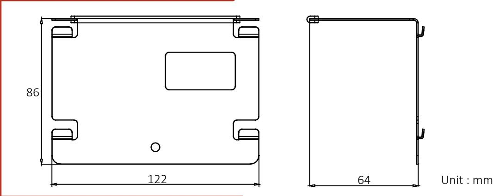
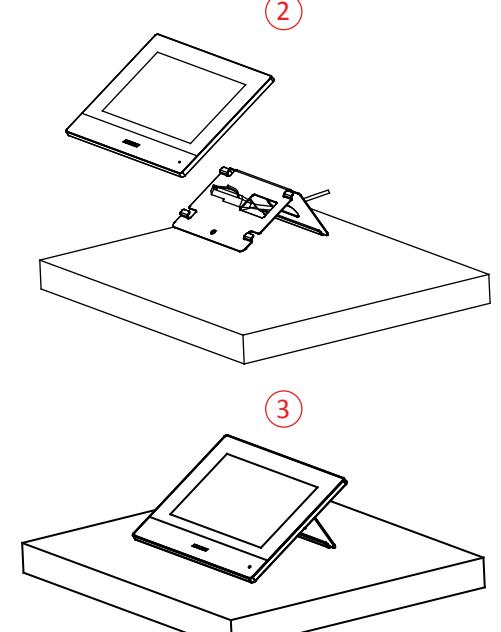
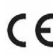
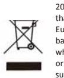

# **1 Appearance and Dimension**

# Video Intercom Table Bracket

Installation Guide

### Specifications

| Product               | Table Bracket                           |
|-----------------------|-----------------------------------------|
| Material              | SUS430, silica gel                      |
| Working temperature   | -10 °C to +55 °C (14 °F to 131 °F)      |
| Working humidity   | 10% to 90%                              |
| Dimension (W × H × D) | 122 × 86 × 64 mm(4.80" × 3.39" × 2.52") |

# **2 Installation**

## *Before You Start*

a. Make sure the device in the package is in good condition and all the assembly parts are included.

b. Check the product specification for the installation environment.

### *Installation*

1. Put the table bracket on the desk.

2. Route the cable through the cable hole to connect the indoor station.

3. Hook the indoor station to the table bracket tightly by inserting the table bracket hooks into the slot on the rear panel of the indoor station, during which the lock catch will be locked automatically.

#### Product Information

COPYRIGHT ©2019 Hangzhou Hikvision Digital Technology Co., Ltd. ALL RIGHTS RESERVED.

Any and all information, including, among others, wordings, pictures, graphs are the properties of Hangzhou Hikvision Digital Technology Co., Ltd. or its subsidiaries (hereinafter referred to be "Hikvision"). This user manual (hereinafter referred to be "the Manual") cannot be reproduced, changed, translated, or distributed, partially or wholly, by any means, without the prior written permission of Hikvision. Unless otherwise stipulated, Hikvision does not make any warranties, guarantees or representations, express or implied, regarding to the Manual.

#### About this Manual

This Manual is applicable to Wireless Card Reader. The Manual includes instructions for using and managing the product. Pictures, charts, images and all other information hereinafter are for description and explanation only. The information contained in the Manual is subject to change, without notice, due to firmware updates or other reasons. Please find the latest version in the company website (http://overseas.hikvision.com/en/).

Please use this user manual under the guidance of professionals.

 Trademarks Acknowledgement and other Hikvision's trademarks and logos are the properties of Hikvision in various jurisdictions. Other trademarks and logos mentioned below are the properties of their respective owners.

Legal Disclaimer

TO THE MAXIMUM EXTENT PERMITTED BY APPLICABLE LAW, THE PRODUCT DESCRIBED, WITH ITS HARDWARE, SOFTWARE AND FIRMWARE, IS PROVIDED "AS IS", WITH ALL FAULTS AND ERRORS, AND HIKVISION MAKES NO WARRANTIES, EXPRESS OR IMPLIED, INCLUDING WITHOUT LIMITATION, MERCHANTABILITY, SATISFACTORY QUALITY, FITNESS FOR A PARTICULAR PURPOSE, AND NON-INFRINGEMENT OF THIRD PARTY. IN NO EVENT WILL HIKVISION, ITS DIRECTORS, OFFICERS, EMPLOYEES, OR AGENTS BE LIABLE TO YOU FOR ANY SPECIAL, CONSEQUENTIAL, INCIDENTAL, OR INDIRECT DAMAGES, INCLUDING, AMONG OTHERS, DAMAGES FOR LOSS OF BUSINESS PROFITS, BUSINESS INTERRUPTION, OR LOSS OF DATA OR

DOCUMENTATION, IN CONNECTION WITH THE USE OF THIS PRODUCT, EVEN IF HIKVISION HAS BEEN ADVISED OF THE POSSIBILITY OF SUCH DAMAGES.

REGARDING TO THE PRODUCT WITH INTERNET ACCESS, THE USE OF PRODUCT SHALL BE WHOLLY AT YOUR OWN RISKS. HIKVISION SHALL NOT TAKE ANY RESPONSIBILITES FOR ABNORMAL OPERATION, PRIVACY LEAKAGE OR OTHER DAMAGES RESULTING FROM CYBER ATTACK, HACKER ATTACK, VIRUS INSPECTION, OR OTHER INTERNET SECURITY RISKS; HOWEVER, HIKVISION WILL PROVIDE TIMELY TECHNICAL SUPPORT IF REQUIRED.

SURVEILLANCE LAWS VARY BY JURISDICTION. PLEASE CHECK ALL RELEVANT LAWS IN YOUR JURISDICTION BEFORE USING THIS PRODUCT IN ORDER TO ENSURE THAT YOUR USE CONFORMS THE APPLICABLE LAW. HIKVISION SHALL NOT BE LIABLE IN THE EVENT THAT THIS PRODUCT IS USED WITH ILLEGITIMATE PURPOSES.

IN THE EVENT OF ANY CONFLICTS BETWEEN THIS MANUAL AND THE APPLICABLE LAW, THE LATER PREVAILS.

This product and - if applicable - the supplied accessories too are marked with "CE" and comply therefore with the applicable harmonized European standards listed under the RE Directive 2014/53/EU, the EMC Directive 2014/30/EU, the LVD Directive 2014/35/EU, the RoHS Directive 2011/65/EU.

2012/19/EU (WEEE directive): Products marked with this symbol cannot be disposed of as unsorted municipal waste in the European Union. For proper recycling, return this product to your local supplier upon the purchase of equivalent new equipment, or dispose of it at designated collection points. For more information see: www.recyclethis.info

2006/66/EC (battery directive): This product contains a battery that cannot be disposed of as unsorted municipal waste in the European Union. See the product documentation for specific battery information. The battery is marked with this symbol, which may include lettering to indicate cadmium (Cd), lead (Pb), or mercury (Hg). For proper recycling, return the battery to your supplier or to a designated collection point. For more information see:www.recyclethis.info

