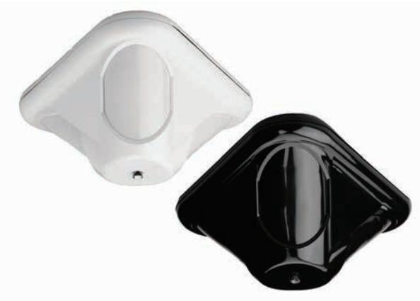
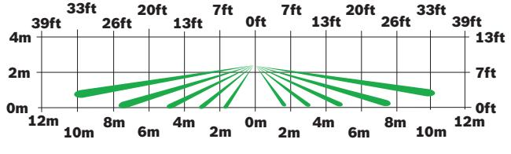

# DS9370/DS9371 Takmonterad detektor med TriTech-funktioner

www.boschsecurity.com

Alla modeller av TriTech PIR-/

mikrovågsrörelsedetektorer i DS9370-serien är takmonterade och består av flera patenterade signalbehandlingstekniker för bästa detekteringsförmåga utan att riskera falsklarm. Alla modeller kan monteras i tak med en takhöjd upp till 7,6 m. Med tre separata individuellt justerbara PIRsektioner ger DS9370 en fullständig täckning i alla monteringshöjder samt möjligheten att skräddarsy övervakningen för särskilda områden.

# **Funktioner**

# **Signalbehandling**

Passiv IR- och mikrovågsbaserad teknik används för att ge larm då båda bevakningsfälten aktiveras samtidigt. Larmsignalerna måste uppfylla kraven för båda teknikerna för att larm ska aktiveras.

# **FSP-signalbehandling**

FSP-signalbehandlingen reagerar omedelbart på människor utan att funktionerna för att undvika falsklarm från andra källor försvinner. Genom att justera känsligheten baserat på signalens amplitud, polaritet, lutning och timing behöver installatören inte

- u Justerbar optik för objektsanpassning av täckningsområde
- u Ledad bottenplatta ger enkel installation
- u Högeffektiv lysdiod och ljusledarsystem ger enkelt gångtest
- u FSP-signalbehandling (First Step Processing)

välja känslighetsnivå. Varje sensor bearbetas individuellt och båda sensorerna måste upptäcka en larmsituation innan larmreläet aktiveras.

# **Mikrovågsbaserad signalbehandling**

Justerbar bearbetning anpassas till bakgrundsaktiviteter. Det minskar antalet falsklarm samtidigt som förmågan att upptäcka människor bibehålls.

# **Mikrovågsavkänning**

Patenterad fullständigt övervakad mikrovågskrets gör att detektorn går över på enbart PIR-detektering om mikrovågssystemet skulle gå sönder.

# **Testfunktioner**

- Högeffektiv lysdiod och ljusledarsystem ger gångtestindikering synlig från vilken vinkel och monteringshöjd som helst.
- Med hjälp av larmminnesfunktionen kan larmindikering kvarhållas för enkel lokalisering av utlöst detektor.
- Genom fjärrstyrning av gåtestlysdioden aktiveras eller avaktiveras lysdioden med hjälp av en styrsignal utan att detektorn behöver öppnas.

#### **Certifikat och godkännanden**

| Australien | DS9370: AUS C-tick |
|------------|--------------------|
|            |                    |

Kina CCC 2004031901000038

| Region     |        | Överensstämmelse med regelverk/ kvalitetsmärkning               |
|------------|--------|--------------------------------------------------------------------|
| Australien | RCM    | [DS9370]                                                           |
| Ryssland   | GOST   | ТС N RU Д-NL.МН09.В.00334 EAC                                      |
| USA        | UL     | 20190115; UL639 – Standard for Intru sion-Detection Units       |
|            | UL     | Intrusion Detection Units Certified for Canada (cULus) [DS9370] |
|            | FCC    | ESV9370                                                            |
| Kanada     | IC     | 1249A-12073                                                        |
| Kina       | CCC    | 2015031901000325 [DS9370-CHI]                                      |
| Brasilien  | ANATEL | Certificado Anatel 0871-03-1855 [DS9370 & DS9371]               |
| Singapore  | iDA    | LPREQ-S0154-2004 [DS9370]                                          |

#### **Installations- och konfigurationskommentarer**

Uppifrån

Från sidan

#### **Montering**

Monteringshöjden ligger på mellan 2,4 och 7,6 m. Den rekommenderade monteringshöjden är mellan 3,7 och 7,6 m. Täckningsområdet kan ställas in på mellan 9,1 och 21,3 m. Om monterad på 2,4 m, kan

täckningsområdet ställas in på mellan 6,1 och 12,2 m. Om monterad på 3 m, kan täckningsområdet ställas in på mellan 6,1 och 15,2 m.

Detektorerna kan monteras direkt i taket eller på en fyrkantig eldosa med standardstorleken 9 cm. Den maximala räckvidden beror på monteringshöjden och vertikal justering av PIR-täckningsområdet. De optiska modulerna kan justeras för korrekt täckningen i områden där en del av området måste en riktad täckning.

En maskeringssats som innehåller två masker på 120° och två på 90° medföljer för maskering av områden. Placera maskeringarna utanpå detektorn. Med de medföljande maskeringarna kan du maskera 90°, 120°, 180°, 210°, 240° eller 330°.

#### **Täckningsinformation**

Täckningen är 360° × 21 m i diameter när detektorn är monterad på mellan 3,7 och 7,6 m.

Täckningen är 360° × 15 m i diameter när detektorn är monterad på 3 m. 12 m vid montering på 2,4 m. Täckningsområdet består av 69 zoner indelade i 21 barriärer. Varje barriär är 11 m lång och 1,5 m bred vid 11 m. Barriärerna är indelade i tre grupper med sju i varje. Varje grupp har vertikal justering för anpassad täckning.

#### **Copyright**

Det här dokumentet tillhör Bosch Security Systems och är skyddat av upphovsrättslagar. Med ensamrätt.

#### **Tekniska specifikationer**

#### **Kapsling**

| Design   | Modulfästet och ledad bottenplatta gör det enkelt att komma åt inställningskontakter och kablage. |
|----------|---------------------------------------------------------------------------------------------------------|
| Mått     | 8,9 × 17,8 cm                                                                                           |
| Material | Stötsäker kapsling i ABS-plast                                                                          |

#### **Miljöspecifikationer**

| Drifttemperatur                             | -40 °C till +49 °C För UL-certifierade installationer, 0 °C till +49 °C            |
|---------------------------------------------|------------------------------------------------------------------------------------------|
| Skydd mot radiofrekvensstörning (RFI) | Inget larm eller fel på kritiska frekvenser i intervallet 26 till 950 MHz vid 50 v/m. |

### **Montering**

| Höjd     | 3 till 7,6 m rekommenderas                                                          |  |
|----------|-------------------------------------------------------------------------------------|--|
| Plats    | Monteras direkt i taket eller på en åttkantig eldosa med standardmåttet 10,2 cm. |  |
| Utgångar |                                                                                     |  |
| Larm     | Form C halvledarrelä för 3,0 W, 125 mA vid 28 V DC för                              |  |

|                   | resistiva belastningar.                                                                                                     |
|-------------------|-----------------------------------------------------------------------------------------------------------------------------|
| Sabotag eskydd | Sabotageskydd för hölje och tak. Normalt sluten (med locket på) sabotagekontakt. Kontakter för max 125 mA vid 28 VDC. |

### **Elspecifikationer**

| Ström | 19 mA i viloläge, 39 mA i larm. |
|-------|---------------------------------|
| Ström | 9 till 15 V DC                  |

#### **Beställningsinformation**

### **DS9370 Takmonterad detektor med TriTech-funktioner**

PIR och mikrovågor, täckning på 360° × 21 m i diameter, monteringshöjd på 2,4 till 7,6 m. 10,52 till 10,55 GHz < 20mW. Vit. Ordernummer **DS9370**

#### **DS9370E rörelsedetektor 360° tak 21 m**

PIR och mikrovågor, täckning på 360° × 21 m i diameter, monteringshöjd på 2,4 till 7,6 m. 10,52 till 10,55 GHz. < 20mW. Vit. Ordernummer **DS9370E**

# **DS9370-C Takmonterad detektor med TriTech-funktioner**

PIR och mikrovågor, täckning på 360° × 21 m i diameter, monteringshöjd på 2,4 till 7,6 m. 10,57 till 10,60 GHz. < 20mW vit. Endast för Frankrike och Storbritannien.

Ordernummer **DS9370-C**

#### **DS9370-CE rörelsedetektor 360° tak 21 m, FR**

PIR och mikrovågor, täckning på 360° × 21 m i diameter, monteringshöjd på 2,4 till 7,6 m. 10,57 – 10,60 GHz. < 20mW. Vit. Endast för Frankrike och Storbritannien. Ordernummer **DS9370-CE**

**DS9370-BEL DS9370 – BELGIEN** PIR och mikrovågor, täckning på 360° x 21 m i diameter, monteringshöjd på 2,4 till 7,6 m. För Belgien. 10,525 GHz. Vit. Ordernummer **DS9370-BEL**

# **DS9370-CHI rörelsedetektor 360° tak 21 m**

För Kina. FSP-signalbehandling, täckning på 360° × 21 m och monteringshöjd på upp till 7,6 m. 10,525 GHz. Vit. Ordernummer **DS9370-CHI**

#### **DS9371 detektor 360° tak 21 m svart**

PIR och mikrovågor, täckning på 360° × 21 m i diameter, monteringshöjd på 2,4 till 7,6 m. 10,52 till 10,55 GHz < 20mW. Svart kapsling och svarta linser. Ordernummer **DS9371**

**DS9371E rörelsedetektor 360° tak 21 m svart** PIR och mikrovågor, täckning på 360° × 21 m i diameter, monteringshöjd på 2,4 till 7,6 m. 10,52 till 10,55 GHz. < 20mW. Svart kapsling och svarta linser. Ordernummer **DS9371E**

**Representerad av:**

**Europe, Middle East, Africa: Germany:** Bosch Security Systems B.V. P.O. Box 80002 5600 JB Eindhoven, The Netherlands Phone: + 31 40 2577 284 emea.securitysystems@bosch.com emea.boschsecurity.com

Bosch Sicherheitssysteme GmbH Robert-Bosch-Ring 5 85630 Grasbrunn Germany www.boschsecurity.com

© Bosch Security Systems 2019 | Data kan komma att ändras utan föregående meddelande 2630216459 | sv, V41, 12. Nov 2019