© 2019 Bosch Security Systems, B.V. F01U071773-11

Page 1 of 10

| OD850 Outdoor Passive Infrared Detector/Microwave Intrusion Detector Installation Instructions Page 3 OD850 Gebruiksaanwijzing voor de installatie van de passieve infrarooddetector voor buitengebruik/microgolf                                                                                                                                     |  |
|----------------------------------------------------------------------------------------------------------------------------------------------------------------------------------------------------------------------------------------------------------------------------------------------------------------------------------------------------------|--|
| inbraakdetector Pagina 4                                                                                                                                                                                                                                                                                                                                 |  |
| Notice d'installation du détecteur à infrarouge passif/détecteur d'intrusion à hyperfréquence OD850 Extérieur Page 5 OD850 AUSSENMELDER Passiver Infrarotmelder/Mikrowelleneinbruchsmelder Installationsanleitungen Seite 6 Istruzioni di installazione del rilevatore a infrarossi passivi e del rilevatore a microonde antintrusione per esterni |  |
| OD850 Pagina 7                                                                                                                                                                                                                                                                                                                                           |  |
| Instruções de instalação do detector contra intrusos por Microondas/Infravermelhos passivos OD850 Exterior Página 8                                                                                                                                                                                                                                   |  |
| Instrucciones de instalación del detector de intrusión por infrarrojos pasivos/microondas para                                                                                                                                                                                                                                                           |  |
| exterior OD850  Página 9 OD850 户外被动红外线探测器/微 波入侵探测器安装说明 第10页                                                                                                                                                                                                                                                                                           |  |

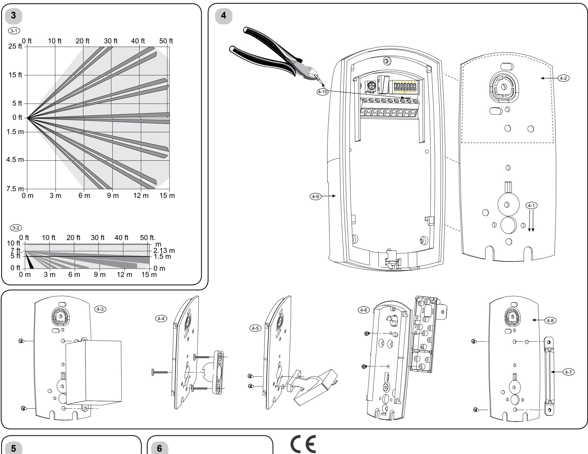

# **OD850/OD850-F1/OD850-F1E Outdoor**

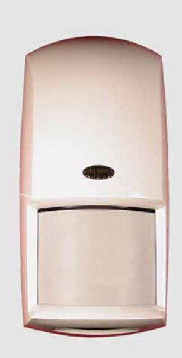

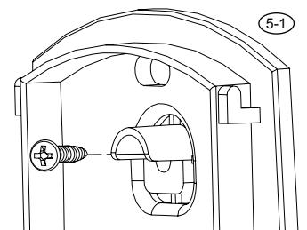

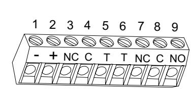

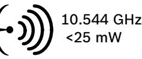

| AT | DK | HU | LV | RU |
|----|----|----|----|----|
| BE | EE | IE | MT | SE |
| BG | EL | IS | NL | SI |
| CH | ES | IT | NO | SK |
| CY | FI | LI | PL | TR |
| CZ | FR | LT | PT | UA |
| DE | HR | LU | RO | UK |

#### **Bosch Security Systems, B.V.**

Torenallee 49 5617 BA Eindhoven Netherlands **www.boschsecurity.com**

© 2019 Bosch Security Systems, B.V. F01U071773-11

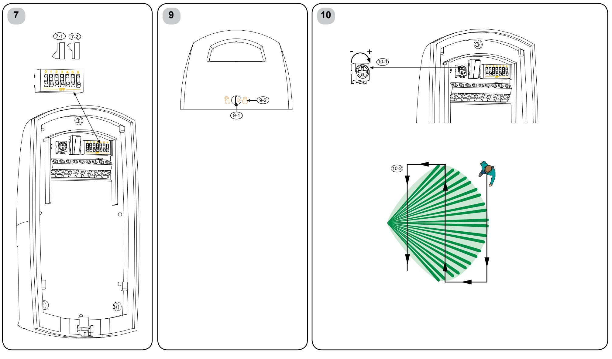

**Bosch Security Systems, B.V.**

Torenallee 49 5617 BA Eindhoven Netherlands

**www.boschsecurity.com**

TriTech® is a registered trademark of Bosch Security Systems, Inc. in the United States.

© 2019 Bosch Security Systems, B.V. F01U071773-11

#### Page 3 of 10

**1**

# **4**

**5**

# **7**

**8 9**

# **10**

**OD850 Outdoor TriTech® Detector**

# **Specifications**

| Dimensions:             | 6.5 in. x 3.25 in. x 2.25 in. (16.5 cm x 8.25 cm x 5.7 cm)                                                                                                                                                                                                                                                                                                                                                        |
|-------------------------|----------------------------------------------------------------------------------------------------------------------------------------------------------------------------------------------------------------------------------------------------------------------------------------------------------------------------------------------------------------------------------------------------------------------|
| Input Power:            | 10 VDC to 15 VDC @ 22 mA standby. Maximum current 42 mA. Use only a Listed limited-power source.                                                                                                                                                                                                                                                                                                            |
| Standby Power:       | No internal standby battery. Standby power must be provided by a Listed limited-power source. For UL Certificated installations, 4 h (88 mAh) standby power must be provided by the control panel or                                                                                                                                                                                                  |
| Alarm Relays:        | by a Listed burglary power source. Form "A" normally closed (NC), supervised alarm contact opens on alarm. Form "C" unsupervised, timed relay contact transfers on alarm and follows an installer programmable timer.                                                                                                                                                                              |
| Contact Ratings:     | 3 W, 100 mA maximum, 25 VDC maximum for DC resistive loads; and protected by a 4.7 W, 1/2 W resistor in the common "C" leg of the relay.                                                                                                                                                                                                                                                                 |
|                         | Note: Do not use with capacitive or inductive loads.                                                                                                                                                                                                                                                                                                                                                              |
| Temperature Range:   | The temperature range is -31°F to +140°F (-35°C to +60°C).                                                                                                                                                                                                                                                                                                                                                        |
| Microwave Frequency: | OD850-F1: 10.525 GHz (UL Listed) OD850-F1E: 10.544 GHz (Not UL, FCC, ISED Listed)                                                                                                                                                                                                                                                                                                                           |
| Coverage:               | 50 ft by 50 ft (15 m by 15 m)                                                                                                                                                                                                                                                                                                                                                                                        |
| Tamper:                 | NC (with cover on). Contacts rated 100 mA maximum, 25 VDC maximum. Connect tamper circuit to a 24-hour protection circuit.                                                                                                                                                                                                                                                                                  |
| IP Rating: Options:  | 54 B335 Low Profile Swivel Mount Bracket (supplied), B328 Swivel Mount Bracket, B338 Ceiling Mount Bracket, Pole Mount Bracket (supplied). Note: Misaligning the detector in these brackets can reduce the detector's range and increase the                                                                                                                                                 |
| Compliance:             | dead zone area. OD850-F1 complies with Part 15 of the FCC Rules and with RSS-210 of Industry and Science Canada. Operation is subject to two conditions: 1. This device cannot cause harmful interference. 2. This device must accept any interference, including interference that might cause undesired operation. Changes or modifications not expressly approved by Bosch |
|                         | Security Systems, Inc. can void                                                                                                                                                                                                                                                                                                                                                                                      |

# **2 Installation Considerations**

# **3 Coverage Patterns**

the user's authority to operate the

equipment.

Never install the detector where the PIR or microwave is in constant alarm (LED on). The LED is off when properly installed.

Point away from traffic.

Avoid installing where hanging signs, trees or other objects that the wind can move are within the coverage pattern or where wildlife might move within the coverage pattern.

The mounting surface must be solid and vibration-free.

### **UL Listing Requirements**

The unit shall only be installed outdoors for primary protection in high security installations where unwanted alarms would be tolerated. Otherwise, the outdoor device should be used for supplementary protection only, and be connected to a trouble zone or to a zone that is not programmed for off-premises transmission.

### **Warning!**

- Apply power only after all connections are made and inspected. Do not coil excess wiring inside detector.
- Do not connect any terminal to any power supply providing more than 25 VDC.

### Microwave coverage

PIR coverage

| 6 Wiring |       |                                                                        |  |
|-------------|-------|------------------------------------------------------------------------|--|
| Terminal    | Label | Function                                                               |  |
| 1           | (-)   | Input power: Use at least a                                            |  |
| 2           | (+)   | 22 AWG (0.8 mm) wire pair between the unit and the power source. |  |
| 3           | NC    | Alarm relay                                                            |  |
| 4           | C     |                                                                        |  |
| 5           | T     | Tamper                                                                 |  |
| 6           | T     |                                                                        |  |
| 7           | NC    | Timed alarm relay contacts                                             |  |
| 8           | C     |                                                                        |  |
| 9           | NO    |                                                                        |  |

 Look-down zone **Note:** When choosing the appropriate mounting height for your application (particularly, when the terrain is not

level) the upper finger is the strongest and responds more quickly to an intruder's presence. Every finger shown in the top view (3-1) has the same side view (3-2) configuration.

## **Mounting**

- 1. Select a mounting location. Mount the sensor where an intruder is most likely to cross the coverage pattern.
2. Mount the detector 7 ft to 9 ft (2.1 m to 2.7 m) above the ground. Recommended: 7 ft (2.1 m) **Note:** Mounting height recommendations are based on level surfaces. If the terrain is not level, adjust the mounting height and detector angle to provide the best coverage.

- 3. Slide the mounting plate down (4-1) until you hear a click, and remove it from the cover.
- 4. Mount the mounting plate using one of these options:

**Note:** Do not remove the waterproof label from the mounting plate (4-2). Push the mounting screws or wiring knockouts through the label as needed.

- Surface mount using a single-gang electrical box.
	- 1. Install a single-gang electrical box at the detector location.
	- 2. Attach the mounting plate (4-3) to the single-gang box with the appropriate screws.
- Surface mount without an electrical box.
	- 1. Select an appropriate location.
	- 2. Using the mounting plate (4-1) as a template, mark the location of the mounting screws and the wire run. 3. Attach the mounting plate (4-1) to the wall with the appropriate screws.
- Surface Mount using the supplied B335 Bracket or an optional bracket. Use the bracket's instructions to attach the bracket to the appropriate mounting surface.
	- Attach the B335 Bracket to the mounting plate. (4-4).
	- Attach the B328 Bracket to the mounting plate. (4-5).
	- Attach the B338 Bracket to the mounting plate. (4-6).
	- Pole Mount using the supplied bracket.

**Note:** Do not mount to fence posts that might sway in the wind.

- Attach the bracket (4-7) to the mounting plate (4-8) using the appropriate screws and mounting holes.
- Two hose clamps (not supplied) large enough to fit around the pole are recommended for fastening the detector mounting plate to the pole.

# **Tamper Options**

The unit has a built-in cover tamper that signals when the detector unit (4-9) separates from the mounting plate (4-1). The unit can also be installed so the tamper signals if the entire unit is pulled away from the surface on which it is mounted.

**Note:** The wall and cover tamper option are only available when the unit is surface mounted. The cover tamper is available with all mounting options.

Determine whether the tamper switch is to be used as a cover tamper or a wall and cover tamper:

- Wall and cover tamper: Use the appropriate screw to fasten the mounting plate tamper section (5-1) to the wall.
- Cover tamper: Do not attach the mounting plate tamper section (5-1) to the wall.

## **DIP Switch Configuration**

(7-1) On (7-2) Off

| Switch  | Feature                              | Description                                                                                                                                                                                                                                                                                                                                                                                                                                                                                                            |                        | Switch Position                                                                     |                                   |  |
|---------|--------------------------------------|------------------------------------------------------------------------------------------------------------------------------------------------------------------------------------------------------------------------------------------------------------------------------------------------------------------------------------------------------------------------------------------------------------------------------------------------------------------------------------------------------------------------|------------------------|-------------------------------------------------------------------------------------|-----------------------------------|--|
| 0 1  | LED Disable PIR Sensitivity | Determines if the LED lights during alarm situations. Default factory setting: ON Standard: Minimizes false alarms. Tolerates environmental extremes Intermediate: Use where an intruder might cover only a small portion of the protected area. Tolerates normal environments. Note: The detector is shipped in Standard Mode. Form "C," unsupervised, timed relay contact that transfers 1 sec after an                                                                          |                        | ON: LED enabled OFF: LED disabled ON: Standard OFF: Intermediate           |                                   |  |
| 2 and 3 | Timed Relay                       |                                                                                                                                                                                                                                                                                                                                                                                                                                                                                                                        |                        | SW2 SW3 Relay Activation Time                                                 |                                   |  |
|         | Outputs                              | alarm. It follows a user-selectable timer. The time expires at the time set after the last alarm. It resets on each new alarm.                                                                                                                                                                                                                                                                                                                                                                                | OFF ON OFF ON | OFF OFF ON ON                                                              | 2 sec 1 min 5 min 10 min |  |
| 4       | AND/OR Mode                       | Determines if the detector alarms in the AND mode (when both technologies simultaneously sense an alarm condition) or in the OR mode (when either the PIR or Microwave technology senses an alarm state). Note: The OR mode is not recommended for most installations. The OR mode provides faster detection in some conditions. It can also increase the likelihood of nuisance alarms because the detector activates the alarm relay based on input from a single technology. |                        | ON: AND Mode (recommended) OFF: OR Mode, you must also cut the jumper (4-10). |                                   |  |
| 5       | Not used                             |                                                                                                                                                                                                                                                                                                                                                                                                                                                                                                                        |                        |                                                                                     |                                   |  |
| 6       | Not used                             |                                                                                                                                                                                                                                                                                                                                                                                                                                                                                                                        |                        |                                                                                     |                                   |  |

# **LED Display**

| LED Indicator |          | Condition                      |  |  |
|---------------|----------|--------------------------------|--|--|
| Green         | Steady   | PIR alarm                      |  |  |
|               | Flashing | Microwave alarm                |  |  |
| Red           | Steady   | Dual alarm (both technologies) |  |  |
|               | Flashing | Power-up                       |  |  |

## **Attaching Detector to Mounting Plate**

- 1. When all wiring is connected to the detector but not to the power supply and all the settings are made, slide the detector unit (4-9) onto the mounting plate (4-1) and down until it is firmly seated. Avoid pinching the wires.
- 2. With a small flat head screwdriver, turn the locking cam (9-1) 180o to lock (9-2) the detector unit to the mounting plate. Avoid excessive force.

# **Walk Test**

**Note:** Ensure the detector is fastened to the mounting plate and all wiring is connected and powered before beginning the Walk Test.

**Note:** Ensure the LED Disable (SW0) is on (refer to *Section 7 DIP Switch Configuration*).

**Note:** To avoid false alarms, set the microwave range (10-1) to its minimum setting before starting the Walk Test.

Microwave coverage

#### PIR coverage

- 1. Wait at least 2 minutes after power up to start the Walk Test.
The LED flashes red until the detector stabilizes and no movement is detected for 2 seconds.

- 2. Watch the LED as you walk towards the edge of the pattern (10-2). The LED lights at the outside edge of the coverage range.
- 3. Repeat Step 3 from different directions until you adequately verify the coverage pattern. The green LED lights, identifying the PIR pattern edge.

The green LED flashes, identifying the microwave pattern edge.

- 4. Repeat Step 3 from the opposite side.
- 5. If the required range is not achieved, increase the microwave adjustment (10-1) by turning it clockwise slightly.
- 6. Repeat the walk test and adjustments until you reach the farthest edge of coverage needed.

#### **Opmerking:** Zorg ervoor dat de detector op de bevestigingsplaat wordt vastgezet en dat alle bedrading is aangesloten en voorzien van stroom alvorens met de looptest te beginnen.

**Opmerking:** Zorg ervoor dat de LED-deactivatie (SW0) aan staat (raadpleeg hoofdstuk 7: DIP-schakelwerking).

**Opmerking:** Zet, voordat u de looptest start, het microgolfbereik (10-1) in op de minimuminstelling om vals alarm te voorkomen.

Microgolfbereik

#### PIR-bereik

- 1. Wacht na inschakeling tenminste 2 minuten voordat u met de looptest begint. De rode LED knippert totdat de detector gestabiliseerd is en wanneer gedurende 2 seconden geen beweging waargenomen is.
- 2. Kijk naar de LED wanneer u naar de rand van het gezichtsveld loopt (10-2). De LED aan de buitenkant van het gezichtsveld licht op.
- 3. Herhaal stap 3 vanuit diverse richtingen totdat u het gezichtsveld voldoende getest heeft. De groene LED, die de rand van het PIRgezichtsveld identificeert, licht op. Het groene LED knippert, waarmee het microgolf grensbereik is bepaald.
- 4. Herhaal stap 3 vanaf de andere kant.
- 5. Als het benodigde bereik niet wordt gehaald, vergroot dan de microgolfinstelling (10-1) door het enigszins met de klok mee te draaien.
- 6. Herhaal de looptest en aanpassingen totdat u de verste grens van de vereiste instelling bereikt hebt.

Bosch Security Systems, B.V. 130 Perinton Parkway Fairport, NY 14450-9199 www.boschsecuritysystems.com

#### **Bosch Security Systems, B.V.** Torenallee 49

5617 BA Eindhoven Netherlands **www.boschsecurity.com**

© 2019 Bosch Security Systems, B.V. F01U071773-11

Pagina 4 von 10

### **OD850 Gebruiksaanwijzing voor de installatie van de passieve infrarooddetector voor buitengebruik/microgolf inbraakdetector**

### **1 Technische beschrijving Afmetingen:** 16,5 cm x 8,25 cm x 5,7 cm **Ingangsvermogen:** 10 VDC t/m 15 VDC op 22mA stand-by. Maximale stroom 42 mA. Maak alleen gebruik van een Listed limited vermogensbron. **Stand-by vermogen:** Geen interne stand-by batterij. **Alarm relais:** Form "A" Normaal gesloten (NG), gecontroleerd alarmcontact opent tijdens alarm. Form "C" ongecontroleerd, getimed relaiscontact gaat over bij alarm en houdt een programmeerbare timer aan. **Contact classificaties:** 3 W, 100 mA maximaal, 25VDC maximaal voor DC resistente ladingen; en beschermd door een 4,7 Ω, ½ W weerstand in de normale "C" poot van het relais. **Opmerking:** Niet gebruiken met capacitieve of inductieve ladingen. **Temperatuursgebied:** Het temperatuursgebied voor alle installaties is -35°C to +60°C. **Microgolf-frequentie:** OD850-F1: 10.525 GHz OD850-F1E: 10.544 GHz **Bereik:** 15 m x 15 m

**Knoei-optie:** NG (met geplaatste kap). Contacten berekend op 100 mA maximaal, 25 VDC maximaal. Verbindt knoeischakelaarcircuit met een 24-uurs beschermingscircuit. **IP-classificatie:** 54

#### **2 Aandachtspunten voor installatie**

### **3 Gezichtsvelden**

**Opties:** B335 discrete draaibare bevestigingsarm (meegeleverd), B328 draaibare bevestigingsarm, B338 plafondarm, staafarm (meegeleverd). Opmerking: Wanneer de detector op deze armen niet goed wordt uitgelijnd, dan kan het bereik van de detector verkleind en de grootte van het onwaarneembare gebied vergroot worden.

Installeer de detector niet waar de PIR of microgolf in constant alarm verkeert (LED aan). De LED staat uit bij correcte installatie.

Niet richten op verkeer.

Niet installeren waar hangende informatieborden, bomen of andere objecten door de wind binnen het gezichtsveld bewogen kunnen worden, of waar dieren in het wild binnen het gezichtsveld kunnen betreden.

Bevestig de detector op een stevige en trilvrije ondergrond.

- **Waarschuwing!** - Sluit elektriciteit alleen aan wanneer alle
- aansluitingen zijn gemaakt en geïnspecteerd. Overvloedige bedrading niet in de detector oprollen.
- Sluit geen enkele terminal aan op een vermogensbron die meer dan 25 VDC levert.

Microgolfbereik

PIR-bereik

Benedenzichtgebied

#### **4 Bevestiging**

**Opmerking:** Bij het bepalen van de geschikte bevestigingshoogte voor uw systeem (vooral wanneer het terrein niet effen is) is het bovenste onderdeel het sterkst en reageert het sneller op de aanwezigheid van een indringer. Ieder onderdeel dat in het bovenaanzicht (3-1) is afgebeeld heeft dezelfde zijaanzicht (3-2) configuratie.

- 1. Selecteer een bevestigingsplek. Bevestig de sensor waar een indringer het meest waarschijnlijk het gezichtsveld zou kunnen doorkruisen.
- 2. Bevestig de detector 2,10 tot 2,70 meter boven de vloer. Aanbevolen: 2,1 m

#### **5 Knoei-opties**

**Opmerking:** Aanbevolen bevestigingshoogten zijn gebaseerd op effen oppervlakten. Stel de bevestigingshoogte en detectorhoek af om het beste bereik te verkrijgen wanneer het terrein niet vlak is.

#### **6 Bedrading**

- 3. Schuif de bevestigingsplaat naar beneden (4-1) totdat u een klik hoort en verwijder het van de kap.
- 4. Bevestig de bevestigingsplaat volgens één van de volgende opties:

**Opmerking:** Het waterprooflabel niet van de bevestigingsplaat verwijderen (4-2). Duw de bevestigingsschroeven door het label heen indien nodig.

#### **7 DIP-schakelconfiguratie**

- Bevestiging met een enkele elektrische doos.
	- 1. Installeer een enkele elektrische doos op de plaats van de detector.
	- 2. Bevestig de bevestigingsplaat (4-3) met de geschikte schroeven op de enkele elektrische doos.
- Bevestiging zonder een elektrische doos.
- 1. Selecteer een geschikte bevestigingsplaats.
- 2. Gebruik de bevestigingsplaat (4-1) als mal om de plaats van de bevestigingsschroeven en de bedradingen te markeren.
- 3. Bevestig de bevestigingsplaat (4-1) aan de muur met de geschikte schroeven.
- Bevestigen met behulp van de meegeleverde B335-arm of een optionele arm. Gebruik de instructies van de arm om de bevestigingsarm op het juiste bevestigingsoppervlak te bevestigen.
	- Bevestig de B335-arm op de bevestigingsplaat. (4-4).
	- Bevestig de B328-arm op de bevestigingsplaat. (4-5).
	- Bevestig de B338-arm op de bevestigingsplaat. (4-6).
	- Bevestig op de staaf met behulp van de meegeleverde arm.

#### **8 9 LED-display**

#### **10 Looptest**

**Opmerking:** Niet op hekpalen plaatsen die in de wind kunnen bewegen.

- Bevestig de arm (4-7) op de bevestigingsplaat (4-8) met behulp van de daarvoor bestemde schroeven en bevestigingsgaten.
- Twee slangklemmen (niet meegeleverd) die groot genoeg zijn en rond de staaf passen worden aanbevolen om de bevestigingsplaat van de detector op de staaf te bevestigen.

De unit heeft een ingebouwde knoeidekking die een signaal afgeeft wanneer de detector unit (4-9) van de bevestigingsplaat (4-1) wordt gescheiden. De unit kan ook zo geïnstalleerd worden dat de knoei-optie een signaal afgeeft wanneer de gehele unit van het oppervlak waarop deze is bevestigd wordt getrokken.

**Opmerking:** De knoei-opties die van toepassing zijn op de muur en de kap zijn alleen beschikbaar wanneer de unit op een oppervlak is bevestigd. De knoei-optie die van toepassing is op de kap is beschikbaar met alle bevestigingsmogelijkheden.

Bepaal of de knoeischakelaar ingeschakeld moet worden voor de knoei-optie voor de kap, of voor de muur en de kap.

- Knoei-opties voor de muur en de kap: Gebruik de daarvoor bestemde schroef om de bevestigingsplaat van de knoei-sectie (5-1) tegen de muur te bevestigen.
- Knoei-optie voor de kap: Bevestig de bevestigingsplaat van de knoei-sectie (5-1) niet tegen de muur.

| Terminal | Label | Functie                                                                        |
|----------|-------|--------------------------------------------------------------------------------|
| 1        | (-)   | Ingangsvermogen: Gebruik                                                       |
| 2        | (+)   | tenminste een 22 AWG (0,8 mm) aderpaar tussen de unit en de energiebron. |
| 3        | NG    | Alarmrelais                                                                    |
| 4        | G     |                                                                                |
| 5        | T     | Knoei-optie                                                                    |
| 6        | T     |                                                                                |
| 7        | NG    | Getimede                                                                       |
| 8        | G     | alarmrelaiscontacten                                                           |
| 9        | NO    |                                                                                |
|          |       |                                                                                |

| (7-1) Aan |  |
|-----------|--|
| (7-2) Uit |  |

| Schakelaar | Functie                    | Omschrijving                                                                                                                                                                                                                                                                                                                                                                                                                                                                                                                                         |                                                                                                     | Schakelaarpositie |                         |
|------------|----------------------------|------------------------------------------------------------------------------------------------------------------------------------------------------------------------------------------------------------------------------------------------------------------------------------------------------------------------------------------------------------------------------------------------------------------------------------------------------------------------------------------------------------------------------------------------------|-----------------------------------------------------------------------------------------------------|-------------------|-------------------------|
| 0          | LED gedeactiveerd       | Bepaalt of de LED oplicht tijdens AAN: LED geactiveerd alarmsituaties. UIT: LED gedeactiveerd Standaard fabrieksinstelling AAN                                                                                                                                                                                                                                                                                                                                                                                                           |                                                                                                     |                   |                         |
| 1          | PIR gevoeligheid        | Standaard: Minimaliseert valse AAN: Standaard alarmen. Tolereert omgevingsextremen. UIT: Medium Medium: Te gebruiken waar een indringer zich over slechts een klein deel van het bewaakte gebied zou kunnen verplaatsten. Tolereert normale omstandigheden. Opmerking: De detector wordt in de standaardmodus aangeleverd.                                                                                                                                                                                             |                                                                                                     |                   |                         |
| 2 en 3     | Getimede relais-outputs | Form "C" ongecontroleerd, getimed relais contact dat 1 seconde na het alarm overgaat. Het maakt gebruik                                                                                                                                                                                                                                                                                                                                                                                                                                        | SW2                                                                                                 | SW3               | Relais activatietijd |
|            |                            | van een timer die door de gebruiker                                                                                                                                                                                                                                                                                                                                                                                                                                                                                                                  | UIT                                                                                                 | UIT               | 2 sec                   |
|            |                            | geselecteerd kan worden. De tijd loopt                                                                                                                                                                                                                                                                                                                                                                                                                                                                                                               | AAN                                                                                                 | UIT               | 1 min                   |
|            |                            | af op de tijd die na het laatste alarm is                                                                                                                                                                                                                                                                                                                                                                                                                                                                                                            | UIT                                                                                                 | AAN               | 5 min                   |
|            |                            | ingesteld. Na ieder nieuw alarm vervalt de ingestelde tijd.                                                                                                                                                                                                                                                                                                                                                                                                                                                                                       | AAN                                                                                                 | AAN               | 10 min                  |
| 4          | EN/OF modus             | Bepaalt of de detector alarm geeft in de EN-modus (wanneer beide technologieën tegelijk een alarmsituatie waarnemen) of in de OF-modus (wanneer de PIR of de microgolftechnologie een alarmsituatie waarneemt). Opmerking: De OF-modus wordt voor het merendeel van de installaties niet aanbevolen. De OF-modus verschaft in sommige omstandigheden een snellere detectie. Het kan de kans op loos alarm vergroten omdat de detector het alarmrelais activeert op basis van de input van één technologie. | AAN: EN-modus (aanbevolen) UIT: OF-modus, u moet ook de geleidingsbrug (4-10) scheiden. |                   |                         |
| 5          | Niet gebruikt              |                                                                                                                                                                                                                                                                                                                                                                                                                                                                                                                                                      |                                                                                                     |                   |                         |
| 6          | Niet gebruikt              |                                                                                                                                                                                                                                                                                                                                                                                                                                                                                                                                                      |                                                                                                     |                   |                         |

| LED-indicator | Conditie              |
|---------------|-----------------------|
| Constant      | PIR-alarm             |
| Knipperend    | Microgolf-alarm       |
|               | Tweevoudig alarm      |
|               | (beide technologieën) |
| Knipperend    | Opstarten             |
|               | Constant              |

- 1. Wanneer alle bedrading op de detector is aangesloten, maar niet op de voedingsbron, en alle instellingen zijn voltooid, schuif dan de detectorunit (4-9) op de bevestigingsplaat (4-1) en naar beneden totdat hij stevig op zijn plaats zit. Zorg dat de bedrading niet beklemd zit.
- 2. Draai het sluitmechanisme (9-1) met een platkopschroevendraaier 180o om de detector op de bevestigingsplaat vast te zetten (9-2). Gebruik geen overdadige kracht.

**Het bevestigen van de detector aan de bevestigingsplaat**

#### **Bosch Security Systems, B.V.**

Torenallee 49 5617 BA Eindhoven Netherlands **www.boschsecurity.com**

© 2019 Bosch Security Systems, B.V. F01U071773-11

**5**

## **1 Caractéristiques techniques**

| Dimensions :                 | 16,5 cm x 8,25 cm x 5,7 cm (6,5 po. x 3,25 po. x 2,25 po.)                                                                                                                                                                                                                                                                             |
|------------------------------|-------------------------------------------------------------------------------------------------------------------------------------------------------------------------------------------------------------------------------------------------------------------------------------------------------------------------------------------|
| Alimentation :               | De 10 Vcc à 15 Vcc à 22mA en veille. Consommation maximum de 42 mA.                                                                                                                                                                                                                                                                 |
| Alimentation de secours : | Pas de batterie de secours interne.                                                                                                                                                                                                                                                                                                    |
| Relais d'alarme :            | Form « A » Contact d'alarme contrôlé normalement fermé (NF) s'ouvre en cas d'alarme. Form « C » non contrôlée, contact de relais temporisé est transféré en cas d'alarme et suit une minuterie programmable à l'installation.                                                                                        |
| Capacité des contacts :   | 3 W, 100 mA maximum, 25 Vcc maximum pour charges résistives en courant continu et protégées par une résistance de 4,7 Ω et ½ W sur le commun « C » du relais. Remarque : Ne pas utiliser avec des charges capacitives ou inductives.                                                                              |
| Température :                | Les températures admises vont de -35°C à +60°C (-31°F à +140°F) pour toutes les installations.                                                                                                                                                                                                                                   |
|                              | OD850-F1: 10.525 GHz (UL                                                                                                                                                                                                                                                                                                                  |
| Hyperfréquence :             | Listé) OD850-F1E: 10.544 GHz (Pas listé UL, FCC, ISED)                                                                                                                                                                                                                                                                              |
| Portée :                     | 15 m par 15 m (50 pi par 50 pi)                                                                                                                                                                                                                                                                                                        |
| Autoprotection :             | Normalement fermé (avec capot en place). Contacts calibrés à 100 mA maximum, 25 Vcc maximum. Connecter le circuit d'autoprotection à un circuit de protection fonctionnant 24h/24.                                                                                                                                      |
| IP Rating :                  | 54                                                                                                                                                                                                                                                                                                                                        |
| Options :                    | Support sur pivot plat B335 (fourni), support sur pivot B328, support sur rotule pour installation au plafond B338, support pour installation sur poteau (fourni). Remarque : Un défaut d'alignement du détecteur sur ces supports peut réduire le champ de détection et augmenter la zone d'angle mort. |

#### **2 Conseils relatifs à l'installation**

FCC et aux directives de RSS-210 de « Industry and Science

#### **3 Diagrammes illustrant le champ de détection**

- Canada ». Le fonctionnement est soumis à deux conditions : 1. Ce dispositif n'entraîne pas d'interférence préjudiciable.
- 2. Ce dispositif accepte tout type d'interférence, y compris les interférences susceptibles d'entraîner un dysfonctionnement. Toute modification que Bosch Security Systems, Inc. n'aurait pas expressément approuvée peut annuler la capacité de l'utilisateur à utiliser le dispositif.
Ne jamais installer le détecteur à un endroit où l'IRP ou hyperfréquence est constamment activé (voyant LED allumé). Si le détecteur est correctement installé, le voyant LED est éteint.

Ne pas diriger vers des zones de mouvement.

Eviter d'installer à un endroit où des panneaux suspendus, des arbres ou d'autres objets sont susceptibles d'être agités par le vent dans le champ de détection et où des animaux peuvent se déplacer dans le champ de détection.

La surface de montage doit être solide et exempte de vibrations.

### **Attention !**

- Ne mettre l'appareil sous tension qu'une fois tous les branchements effectués et vérifiés. Ne pas accumuler l'excès de fil à l'intérieur du détecteur.
- Ne brancher aucune borne à une source d'alimentation fournissant plus de 25 Vcc.

#### **4 Installation**

Portée hyperfréquence

Portée IRP

Zone de détection vers le bas

**Remarque :** Lorsque vous choisissez la hauteur de montage appropriée pour votre utilisation (en particulier lorsque le terrain n'est pas plat), le doigt supérieur est le plus fort et réagit plus rapidement à une intrusion. Chaque doigt illustré sur la vue de dessus (3-1) a la même configuration sur la vue de côté (3-2).

| 6 Câblage |            |                                                                                                                                  |  |  |
|--------------|------------|----------------------------------------------------------------------------------------------------------------------------------|--|--|
| Borne        | Indication | Fonction                                                                                                                         |  |  |
| 1 2       | (-) (+) | IAlimentation : Utilisez au moins une paire de fils de 22 AWG (0,8 mm) entre l'appareil et la source d'alimentation. |  |  |
| 3            | NF         | Relais d'alarme                                                                                                                  |  |  |
| 4            | C          |                                                                                                                                  |  |  |
| 5            | T          | Autoprotection                                                                                                                   |  |  |
| 6            | T          |                                                                                                                                  |  |  |
| 7            | NF         | Contacts de relais d'alarme                                                                                                      |  |  |
| 8            | C          | temporisés                                                                                                                       |  |  |
| 9            | NO         |                                                                                                                                  |  |  |

#### **7 Configuration des commutateurs DIP**

- 1. Choisissez l'emplacement où vous installerez le détecteur. Installez-le à un endroit où le champ de détection sera presque inévitablement traversé en cas d'intrusion.
2. Installez le détecteur à au moins 2,1 m du sol (maximum 2,7 m). Hauteur recommandée : 2,1 m (7 pi) **Remarque :** Les recommandations de hauteur se basent sur des surfaces planes. Si le terrain n'est pas plat,

ajustez la hauteur de montage et l'angle du détecteur pour assurer la meilleure couverture.

- 3. Faites glisser la plaque de montage vers le bas (4-1) jusqu'à ce que vous entendiez un clic et retirez-la du capot.
- 4. Fixez la plaque de montage en procédant de l'une des manières suivantes :

**Remarque :** Ne retirez pas l'étiquette indiquant l'étanchéité à l'eau de la plaque de montage (4-2). Faites passer les vis de montage ou les orifices pré-découpés à travers l'étiquette si besoin est.

# **8 Ecran LED**

- Montage sur surface plane à l'aide d'un coffret électrique à un seul interrupteur.
	- 1. Installez un coffret électrique à un seul interrupteur à l'emplacement du détecteur.
	- 2. Fixez la plaque de montage (4-3) au coffret à un seul interrupteur à l'aide des vis adéquates.
- Montage sur surface plane sans coffret électrique.
	- 1. Choisissez un emplacement de montage.
	- 2. En vous guidant avec la plaque de montage (4-1), marquez l'emplacement des vis de montage et du passage des fils.
- 3. Fixez la plaque de montage (4-1) au mur à l'aide des vis adéquates.

#### **9 Fixation du détecteur sur la plaque de montage**

- Montage sur surface plane à l'aide du support B335 fourni ou d'un support en option. Utilisez les instructions fournies avec le support pour fixer ce dernier à la surface de montage adéquate.

#### **10 Test de marche**

- Fixez le support B335 à la plaque de montage. (4-4).
- Fixez le support B328 à la plaque de montage. (4-5).
- Fixez le support B338 à la plaque de montage. (4-6).

- Fixez au poteau en utilisant le support fourni.

- **Remarque :** Ne montez pas l'appareil sur un piquet de clôture qui risque de se balancer avec le vent.
	- Fixez le support (4-7) à la plaque de montage (4-8) à l'aide des vis et des trous de montage appropriés.
	- Il est recommandé d'utiliser deux colliers de serrage pour tuyaux (non fournis) assez grands pour être placés sur le poteau pour y fixer fermement la plaque de montage du détecteur.

# **Options d'autoprotection**

L'appareil comporte un capot autoprotection intégré qui donne une alerte si le détecteur (4-9) est séparé de la plaque de montage (4-1). L'appareil peut aussi être installé de sorte que l'autoprotection signale le retrait de toute l'unité de la surface sur laquelle elle est installée.

**Remarque :** L'option d'autoprotection mur et capot n'est disponible que si l'unité est installée sur une surface plane. L'autoprotection capot est disponible dans toutes les options de montage.

Déterminez si l'interrupteur de sécurité doit être utilisé pour une autoprotection capot ou une autoprotection mur et capot :

- Autoprotection mur et capot : Utilisez la vis adéquate pour fixer la partie autoprotection de la plaque de montage (5-1) au mur.
- Autoprotection capot : Ne fixez pas la partie autoprotection de la plaque de montage (5-1) au mur.

#### (7-1) On (7-2) Off

| Commutateur | Fonction                            | Description                                                                                                                                                                                                                                                                                                                                                                                                                                                                                                                                                                           |     |                                      | Position de l'interrupteur                                   |
|-------------|-------------------------------------|---------------------------------------------------------------------------------------------------------------------------------------------------------------------------------------------------------------------------------------------------------------------------------------------------------------------------------------------------------------------------------------------------------------------------------------------------------------------------------------------------------------------------------------------------------------------------------------|-----|--------------------------------------|--------------------------------------------------------------|
| 0           | Désactivation des voyants LED | Détermine si les voyants LED s'allument en cas d'alarme.Paramètre d'usine par défaut : ON                                                                                                                                                                                                                                                                                                                                                                                                                                                                                       |     | ON : Voyant LED activé               | OFF : Voyant LED désactivé                                   |
| 1           | Sensibilité IRP                  | Standard : Minimise les fausses alarmes et tolère les environnements extrêmes Intermédiaire : Utilisé lorsque l'intrusion ne couvre qu'une petite partie de la zone protégée. Tolère les environnements normaux. Remarque : Le détecteur est livré en mode standard.                                                                                                                                                                                                                                                                                          |     | ON : Standard OFF : Intermédiaire |                                                              |
| 2 et 3      | Sorties du relais temporisé   | Form « C », contact de relais temporisé non contrôlé qui est transféré 1 sec après une alarme. Suit une minuterie                                                                                                                                                                                                                                                                                                                                                                                                                                                               | SW2 | SW3                                  | Durée d'activation du relais                           |
|             |                                     | sélectionnée par l'utilisateur. La durée                                                                                                                                                                                                                                                                                                                                                                                                                                                                                                                                              | OFF | OFF                                  | 2 sec                                                        |
|             |                                     | expire au moment défini après la                                                                                                                                                                                                                                                                                                                                                                                                                                                                                                                                                      | ON  | OFF                                  | 1 min                                                        |
|             |                                     | dernière alarme. Réinitialisation après                                                                                                                                                                                                                                                                                                                                                                                                                                                                                                                                               | OFF | ON                                   | 5 min                                                        |
|             |                                     | chaque nouvelle alarme.                                                                                                                                                                                                                                                                                                                                                                                                                                                                                                                                                               | ON  | ON                                   | 10 min                                                       |
| 4           | Mode AND/OR                      | Détermine si le détecteur signale une alarme en mode AND (lorsque les deux technologies détectent simultanément une perturbation) ou en mode OR (lorsqu'une des deux technologies, IRP ou hyperfréquence, détecte une perturbation). Remarque : Le mode OR n'est pas recommandé pour la plupart des installations. Le mode OR offre une détection plus rapide dans certaines conditions. Il peut aussi accroître les occurrences d'alarmes de nuisance car le détecteur active le relais d'alarme sur la base d'une seule des technologies. |     | ON : Mode AND (recommandé)        | OFF : Mode OR, vous devez aussi fermer le cavalier (4-10) |
| 5           | Non utilisé                         |                                                                                                                                                                                                                                                                                                                                                                                                                                                                                                                                                                                       |     |                                      |                                                              |
| 6           | Non utilisé                         |                                                                                                                                                                                                                                                                                                                                                                                                                                                                                                                                                                                       |     |                                      |                                                              |

# **Indicateur LED Etat**

|                  | Continu      | Alarme IRP                               |  |  |
|------------------|--------------|------------------------------------------|--|--|
| Vert             | Clignotement | Alarme hyperfréquence                    |  |  |
| Continu Rouge |              | Alarme double (les deux technologies) |  |  |
|                  | Clignotement | Alimentation initiale                    |  |  |

- 1. Lorsque tous les fils sont branchés au détecteur (mais pas au bloc d'alimentation) et que tous les réglages sont effectués, faites glisser le détecteur (4-9) dans la plaque de montage (4-1) jusqu'à ce qu'elle y soit bien placée. Evitez de coincer les fils.
- 2. A l'aide d'un tournevis à tête plate, tournez la came de verrouillage (9-1) de 180o pour verrouiller (9-2) le détecteur sur la plaque de montage. Ne forcez pas trop.

**Remarque :** Assurez-vous que le détecteur est fixé à la plaque de montage et que tous les fils sont branchés et alimentés avant de commencer le test de marche.

**Remarque :** Vérifiez que le commutateur de désactivation des voyants LED (SW0) est ouvert (consultez la Section 7, Configuration des commutateurs DIP).

**Remarque :** Afin d'éviter les fausses alarmes, réglez la portée hyperfréquence (10-1) au minimum avant d'effectuer le test de marche.

Portée hyperfréquence

### Portée IRP

- 1. Pour commencer le test de marche, patientez au moins deux minutes après la mise sous tension. Le voyant LED clignote en rouge, puis le détecteur se stabilise quand aucun mouvement n'est détecté durant 2 secondes.
- 2. Approchez-vous de la limite du champ de détection tout en observant le voyant LED (10-2). Le voyant LED s'allume sur le bord extérieur du champ de détection.
- 3. Recommencez l'étape 3 en procédant dans différentes directions jusqu'à ce que vous ayez bien vérifié le champ de détection. Le voyant LED vert s'allume, identifiant le bord du champ IRP.

Le voyant LED vert clignote, identifiant le bord du champ d'hyperfréquence.

- 4. Répétez l'étape 3 en commençant de l'autre côté.
- 5. Si la portée requise n'est pas obtenue, augmentez le réglage de l'hyperfréquence (10-1) en tournant légèrement dans le sens des aiguilles d'une montre.
- 6. Recommencez le test de marche et ajustez les réglages jusqu'à ce que vous obteniez la portée maximale nécessaire.

**Notice d'installation du détecteur à infrarouge passif/détecteur d'intrusion à hyperfréquence OD850 Extérieur**

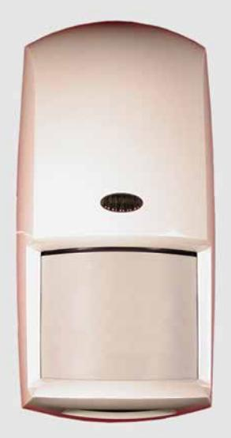

### **Bosch Security Systems, B.V.**

Torenallee 49 5617 BA Eindhoven Netherlands

**www.boschsecurity.com**

© 2019 Bosch Security Systems, B.V. F01U071773-11

**OD850 AUSSENMELDER Passiver Infrarotmelder/ Mikrowelleneinbruchsmelder Installationsanleitungen**

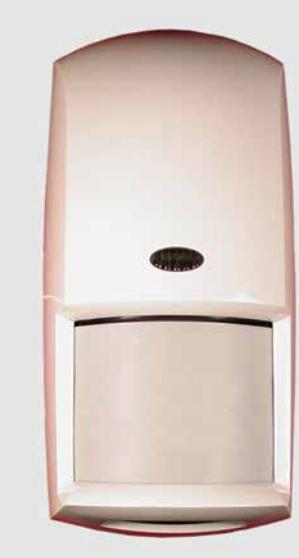

**1 Technische Daten Abmessungen:** 16,5 cm x 8,25 cm x 5,7 cm **Eingangsleistung:** V DC bis 15 V DC bei max. 22 mA (Ruhestrom). Höchststrom 42 mA. Es darf nur eine zugelassene begrenzte Stromquelle verwendet werden. **Notstrom:** Keine interne Notstrombatterie. **Alarmrelais:** Form A-Öffner, überwachter Alarmkontakt öffnet bei Alarm. Unüberwachter Form C-Zeitrelaiskontakt überträgt bei Alarm und ist von einem vom Installateur programmierbaren Zeitschalter abhängig. **Kontakt-Nennleistungen:** 3 W, 100 mA, 25 V DC (max.) für ohmsche Belastungen, Schutz mittels 4,7 Ω, 1/2 W-Widerstand an gemeinsamer "C"- Leitung des Relais. **Hinweis:** Nicht mit kapazitiven oder induktiven Lasten verwenden. **Temperaturbereich:** Der Temperaturbereich für alle zugelassenen Installationen beträgt -35°C bis +60°C. **Mikrowellenfrequenz:** OD850-F1: 10.525 GHz OD850-F1E: 10.544 GHz **Überwachungsbereich:** 15 m x 15 m **Sabotageschutz:** Öffner (bei geschlossener Abdeckung). Kontakt-Nennleistung bei max. 100 mA, 25 V DC. Schließen Sie den Sabotageschutz-Stromkreis an eine ständig aktive Schutzschaltung an. **Gehäuse-schutz (IP-Code):** 54 **Optionen:** Schwenkbare B335-Halterung in Flachbauweise

#### **2 Hinweise für die Installation**

(im Lieferumfang

#### **3 Überwachungsbereiche**

enthalten), schwenkbare B328- Halterung, B338- Deckenhalterung, Masthalterung (im Lieferumfang enthalten).Hinweis: Eine falsche Ausrichtung des Melders in diesen Halterungen kann zur Reduzierung der Reichweite des Melders und zur Vergrößerung des unbewachten Bereichs führen.

Der Melder darf unter keinen Umständen installiert werden, wenn sich das PIR- oder Mikrowellensystem ständig im Alarmzustand befindet (LED eingeschaltet). Bei ordnungsgemäßer Installation ist die LED ausgeschaltet.

Nicht auf Verkehrsbereiche richten.

Nicht an Stellen installieren, an denen sich Hängeschilder, Bäume oder andere Objekte, die sich im Wind bewegen können, im Überwachungsbereich befinden oder an denen Wildtiere den Überwachungsbereich durchqueren können.

Die Montageoberfläche muss fest und vibrationsfrei sein. **Achtung!**

- Strom erst anlegen, wenn alle Anschlüsse vorgenommen und überprüft wurden. Drähte nicht im Melder aufwickeln.
- Keine Klemme darf an eine Stromquelle mit über 25 V DC angeschlossen werden.

Mikrowellenüberwachung

PIR-Überwachung

#### **4 Montage**

 Unterkriechschutzzone **Hinweis:** Bei der Auswahl der richtigen Montagehöhe für Ihre Anwendung (insbesondere auf unebenem Gelände) ist der obere Zeiger am stärksten und reagiert schneller auf einen Eindringling. Jeder Zeiger in der Draufsicht

(3-1) hat die gleiche Seitenansicht-Konfiguration (3-2).

- 1. Wählen Sie einen Montageort. Installieren Sie den Sensor an einer Stelle, an der eine eindringende Person höchstwahrscheinlich den Überwachungsbereich durchqueren würde.
- 2. Montieren Sie den Melder 2,1 m bis 2,7 m über dem Boden. Empfohlene Montagehöhe: 2,1 m

#### **5 Sabotageschutzoptionen**

| 6      | Verdrahtung |                                                                                     |
|--------|-------------|-------------------------------------------------------------------------------------|
| Klemme | Etikett     | Funktion                                                                            |
| 1      | (-)         | Eingangsleistung: Wenigstens                                                        |
| 2      | (+)         | ein 0,8 mm dickes Drahtpaar zwischen dem Gerät und der Stromquelle verwenden. |
| 3      | NC          | Alarmrelais                                                                         |
| 4      | C           |                                                                                     |
| 5      | T           | Sabotageschutz                                                                      |
| 6      | T           |                                                                                     |
| 7      | NC          | Alramrelaiskontakte mit                                                             |
| 8      | C           | Zeitschalter                                                                        |
| 9      | NO          |                                                                                     |
|        |             |                                                                                     |

**Hinweis:** Empfehlungen für die Montagehöhe gelten für ebene Grundflächen. Bei unebenem Gelände müssen

- Montagehöhe und Melderwinkel so verstellt werden, dass ein optimaler Überwachungsbereich gewährleistet ist. 3. Verschieben Sie die Montageplatte (4-1) nach unten, bis es klickt und nehmen Sie sie von der Abdeckung ab.
- 4. Die folgenden Montageoptionen stehen für den Montageplatte zur Verfügung:

**Hinweis:** Nehmen Sie nicht das Schild mit dem Hinaus auf die Wasserundurchlässigkeit von der Montageplatte (4-2) ab. Schieben Sie bei Bedarf die Montageschrauben oder vorbereiteten Drahtöffnungen durch das Schild.

- Oberflächenmontage mit einer elektrischen Einfachdose.
	- 1. Installieren Sie eine elektrische Einfachdose am Melderstandort.
	- 2. Bringen Sie die Montageplatte (4-3) mit den entsprechenden Schrauben an die Einfachdose an.
- Oberflächenmontage ohne Elektrodose.
	- 1. Wählen Sie eine geeignet Stelle.
	- 2. Benutzen Sie die Montageplatte (4-1) als Schablone und markieren Sie die Lage der Montageschrauben und den Drahtverlauf.
	- 3. Bringen Sie die Montageplatte (4-1) mit den entsprechenden Schrauben an der Wand an.

- Oberflächenmontage mit der mitgelieferten B335-Halterung oder einer optionalen Halterung. Bringen Sie die Halterung gemäß den Anleitungen für die Halterung an einer entsprechenden Montageoberfläche an.

- Montieren Sie die B335-Halterung an die Montageplatte. (4-4).
- Montieren Sie die B328-Halterung an die Montageplatte. (4-5).
- Montieren Sie die B338-Halterung an die Montageplatte. (4-6).

- Mastbefestigung mit mitgelieferter Halterung.

**Hinweis:** Nicht an Zaunpfähle montieren, die im Wind schwanken können.

- Befestigen Sie die Halterung (4-7) mit den entsprechenden Schrauben und Montagelöchern an der Montageplatte (4-8).
- Verwenden Sie zwei Schlauchklemmen (nicht im Lieferumfang enthalten), die um den Mast passen, um die Meldermontageplatte am Mast zu befestigen.

Das Gerät hat einen eingebauten Deckelsabotageschutz, der signalisiert, wenn die Meldereinheit (4-9) von der Montageplatte (4-1) abgenommen wird. Das Gerät kann auch so installiert werden, dass der Sabotageschutz ein Signal gibt, wenn das gesamte Gerät von der Montageoberfläche gezogen wird.

**Hinweis:** Die Optionen Wand- und Deckelmontageschutz stehen nur zur Verfügung, wenn das Gerät auf einer Oberfläche montiert ist. Der Deckelmontageschutz steht für alle Montageoptionen zur Verfügung.

Stellen Sie fest, ob der Sabotageschutzschalter als Deckelsabotageschutz bzw. als Wand- und Deckelsabotageschutz zu verwenden ist:

- Wand- und Deckelsabotageschutz: Befestigen Sie den Sabotageschutzabschnitt (5-1) der Montageplatte mit der entsprechenden Schraube an der Wand.
- Deckelsabotageschutz: Befestigen Sie den Sabotageschutzabschnitt (5-1) der Montageplatte nicht an der Wand.

#### (7-1) On (7-2) Off

#### **Schalter Funktion Beschreibung Schalterposition** 0 LED aus Legt fest, ob die LED-Leuchten unter Alarmbedingungen aufleuchten. Vorgabeeinstellung ab Werk: ON (EIN) **ON (EIN):** LED ein **OFF (AUS):** LED aus 1 PIR-Empfindlichkeit **Standard:** Möglichst wenige Fehlalarme. Umgebungsextreme werden toleriert. **Mittlere Einstellung:** Verwenden, wenn ein Eindringling unter Umständen nur einen kleinen Teil des Überwachungsbereichs abdeckt. Normale Umgebungen werden toleriert. **Hinweis:** Der Melder wird im Standardmodus versandt. **ON (EIN):** Standard **OFF (AUS):** Mittlere Einstellung 2 und 3 Relaisausgang mit Zeitschalter Form "C," unsupervised, timed relay contact that transfers 1 sec after an alarm. It follows a user-selectable timer. The time expires at the time set after the last alarm. It resets on each new alarm. **SW2 SW3 Relaisaktivirungszeit** AUS (OFF) AUS (OFF) 2 Sek EIN (ON) AUS (OFF) 1 Min AUS (OFF) EIN (ON) 5 Min EIN (ON) EIN (ON) 10 Min 4 AND/OR-Modus (UND/ODER) Legt fest, ob der Melder Alarme im AND-Modus (beide Überwachungsuntersysteme erfassen gleichzeitig einen Alarmzustand) oder im OR-Modus (entweder das PIR- oder das Mikrowellenuntersystem erfassen einen Alarmzustand) meldet. **Hinweis:** Der OR-Modus wird für die meisten Installationen **nicht** empfohlen. Unter einigen Umständen bietet der OR-Modus eine schnellere Erkennung. Außerdem erhöht sich die Wahrscheinlichkeit für Fehlalarme, weil die Aktivierung des Alarmrelais auf der Eingabe eines Untersystems beruht. **ON (EIN):** AND-Modus (empfohlen) **OFF (AUS):** OR-Modus, Sie müssen auch die Drahtbrücke (4- 10) durchtrennen. 5 Nicht verwendet 6 Nicht verwendet

#### **7 DIP-Schalter-Konfiguration**

# **8 LED-Anzeige**

| LED-Indikator |                      | Bedingung          |
|---------------|----------------------|--------------------|
| Grün          | Ständig PIR-Alarm |                    |
|               | Blinken              | Mikrowellenalarm   |
| Rot           |                      | Doppelalarm (beide |
|               | Ständig              | Methoden)          |
|               | Blinken              | Starten            |

- 1. Wenn alle Drähte am Melder angeschlossen und nicht am Netzteil angeschlossen sind und alle Einstellungen vorgenommen wurden, schieben Sie die Meldereinheit (4-9) auf die Montageplatte (4-1) nach unten, bis sie fest sitzt. Die Drähte dürfen dabei nicht eingeklemmt werden.
- 2. Mit einem kleinen Senkkopf-Schraubendreher wird die Sperrnocke (9-1) um 180° gedreht, um die

#### **9 Montage des Melders an Montageplatte**

Meldereinheit mit der Montageplatte zu verriegeln (9-2). Wenden Sie dabei keine übermäßige Kraft an.

**Hinweis:** Stellen Sie sicher, dass der Melder an der Montageplatte befestigt ist, alle Drähte angeschlossen sind, und das Gerät eingeschaltet ist, bevor Sie mit dem Gehtest beginnen.

**Hinweis:** Stellen Sie sicher, dass LED Aus (SW0) auf ein steht (siehe Abschnitt 7 DIP-Schalter-Konfiguration).

**Hinweis:** Setzen Sie vor Beginn des Gehtests den Mikrowellenbereich (10-1) auf seine niedrigste Einstellung, um Fehlalarme zu vermeiden.

#### **10 Gehtest**

Mikrowellenüberwachung

- PIR-Überwachung
- 1. Warten Sie mindestens 2 Minuten nach dem Einschalten, bevor Sie mit dem Gehtest beginnen. Die LED blinkt rot, bis sich der Melder stabilisiert hat und zwei Sekunden keine Bewegung erfasst hat.
- 2. Beobachten Sie die LED, während Sie an die äußerste Grenze des Überwachungsbereichs gehen (10-2). Die LED leuchtet an der Außengrenze des Überwachungsbereichs auf.
- 3. Wiederholen Sie Schritt 3 aus verschiedenen Richtungen, bis Sie den Überwachungsbereich ausreichend überprüft haben. Die grüne LED leuchtet auf und zeigt die Grenze des PIR-Überwachungsbereichs an. Die grüne LED blinkt und zeigt die Grenze des Mikrowellen-Überwachungsbereichs an.
- 4. Wiederholen Sie Schritt 3 von der gegenüberliegenden Seite aus.
- 5. Falls der erforderliche Bereich nicht erreicht wird, erhöhen Sie die Mikrowelleneinstellung (10-1) durch leichtes Drehen nach links.
- 6. Wiederholen Sie den Gehtest und die Einstellungen, bis Sie die äußerste Grenze des erforderlichen Überwachungsbereichs erreicht haben.

#### **Bosch Security Systems, B.V.**

Torenallee 49 5617 BA Eindhoven Netherlands **www.boschsecurity.com**

© 2019 Bosch Security Systems, B.V. F01U071773-11

**Istruzioni di installazione del rilevatore a infrarossi passivi e del rilevatore a microonde antintrusione per esterni OD850**

#### **1 Specifiche tecniche**

| Dimensioni:                         | 16,5 cm x 8,25 cm x 5,7 cm                                                                                                                                                                                                                                                                                                   |
|-------------------------------------|------------------------------------------------------------------------------------------------------------------------------------------------------------------------------------------------------------------------------------------------------------------------------------------------------------------------------|
| Alimentazione:                      | Da 10 Vcc a 15 Vcc @ 22 mA a riposo.                                                                                                                                                                                                                                                                                      |
| Alimentazione di riserva:        | Nessuna batteria di riserva interna.                                                                                                                                                                                                                                                                                      |
| Relè di allarme:                    | Contatto di allarme Form "A" normalmente chiuso (NC) supervisionato che si apre in condizione di allarme. Contatto a relè temporizzato Form "C" non supervisionato che passa alla condizione di allarme e segue un timer programmabile dall'installatore.                                            |
| Valore nominale dei contatti: | 3 W, 100 mA massimo, 25 Vcc massimo per carichi resistivi cc; protetto da una resistenza da 4,7 Ω, ½ W sul comune del relè. Nota: non utilizzare con carichi capacitivi o induttivi.                                                                                                                          |
| Range di temperatura:            | Il range della temperatura è compreso tra -35°C e +60°C per tutte le installazioni.                                                                                                                                                                                                                                    |
| Frequenza microonde:             | OD850-F1: 10.525 GHz OD850-F1E: 10.544 GHz                                                                                                                                                                                                                                                                                |
| Copertura:                          | 15 m x 15 m                                                                                                                                                                                                                                                                                                                  |
| Tamper:                             | NC (con coperchio nella sua sede). Contatti da 100 mA massimo, 25 Vcc massimo. Collegare il circuito di tamper a una zona 24 ore in centrale.                                                                                                                                                                    |
| IP Rating:                          | 54                                                                                                                                                                                                                                                                                                                           |
| Opzioni:                            | Staffa per snodo a basso profilo B335 (in dotazione), staffa per snodo B328, staffa per montaggio a soffitto B338, staffa per montaggio a palo (in dotazione). Nota: l'allineamento non corretto del rilevatore in queste staffe può ridurre il range del rilevatore e aumentare la "zona morta". |

Non installare il rilevatore dove il sensore PIR o a microonde è in costante allarme (LED ON). Quando l'installazione è corretta, il LED è spento (OFF).

Tenere lontano dal traffico.

Non installare in luoghi in cui insegne pensili, alberi o altri oggetti che il vento può spostare si trovano all'interno dell'area di copertura oppure dove elementi dell'ambiente circostante possono introdursi nell'area di copertura.

#### **2 Informazioni sull'installazione**

La superficie di montaggio deve essere solida e antivibrazioni.

**Avvertenza!**

- Attivare l'alimentazione solo dopo aver effettuato e controllato tutti i collegamenti. Non avvolgere cavi di lunghezza eccessiva nel rilevatore.
- Non collegare i morsetti ad alimentatori che forniscono più di 25 Vcc.

Copertura del sensore a microonde

Copertura del sensore PIR

Area antistrisciamento

#### **3 Area di copertura**

**Nota:** nella scelta dell'altezza di montaggio appropriata per l'applicazione (soprattutto quando il terreno non è piano), l'indicatore superiore è il più potente e risponde più rapidamente alla presenza di un intruso. Tutti gli indicatori mostrati nella vista dall'alto (3-1) hanno la stessa configurazione nella vista laterale (3-2).

- 1. Scegliere un'ubicazione per il montaggio. Installare il rilevatore in un luogo in cui sia probabile che l'intruso ne attraversi l'area di copertura.
2. Posizionare il rilevatore a un'altezza compresa tra 2,1 m e 2,7 m dal suolo. Altezza consigliata: 2,1 m

- **Nota:** l'altezza di montaggio consigliata si basa su superfici piane. Se il terreno non è piano, regolare l'altezza di montaggio e l'angolo del rilevatore in modo da ottenere la copertura migliore.
- 3. Far scorrere la piastra di montaggio fino a sentire un clic, quindi rimuoverla dal coperchio.
- 4. Montare la piastra di montaggio utilizzando una delle opzioni seguito riportate:

**Nota:** non rimuovere l'etichetta impermeabile dalla piastra di montaggio (4-2). Spingere le viti di montaggio o i fori pretranciati del cablaggio attraverso l'etichetta, come necessario.

#### **4 Montaggio**

- montaggio su superficie utilizzando un'unica scatola di connessione elettrica.
	- 1. Installare la scatola di connessione elettrica in corrispondenza dell'ubicazione del rilevatore.
	- 2. Collegare la piastra di montaggio (4-3) alla scatola di connessione con le viti appropriate.
- montaggio su superficie senza la scatola elettrica.
	- 1. Scegliere l'ubicazione appropriata.
	- 2. Utilizzando la piastra di montaggio (4-1) come schema, segnare la posizione delle viti di montaggio e del percorso dei cavi.
	- 3. Collegare la piastra di montaggio (4-1) alla parete con le viti appropriate.

- montaggio su superficie utilizzando la staffa B335 in dotazione oppure una staffa opzionale. Per collegare la staffa alla superficie di montaggio appropriata, fare riferimento alle istruzioni relative alla staffa.

- collegare la staffa B335 alla piastra di montaggio. (4-4).
- collegare la staffa B328 alla piastra di montaggio. (4-5).
- collegare la staffa B338 alla piastra di montaggio. (4-6).
- montaggio su palo utilizzando la staffa in dotazione.

**Nota:** non montare su travi che possono oscillare al vento.

- collegare la staffa (4-7) alla piastra di montaggio (4-8) utilizzando le viti appropriate e i fori di montaggio.
- si consiglia di utilizzare due fascette stringitubo (non in dotazione) abbastanza larghe da avvolgere il palo per fissare saldamente la piastra di montaggio del rilevatore al palo.

L'unità dispone di un tamper a coperchio incorporato che emette un segnale quando l'unità del rilevatore (4-9) si stacca dalla piastra di montaggio (4-1). L'unità può anche essere installata in modo che il tamper emetta un segnale quando l'intera unità si stacca dalla superficie sulla quale è stata montata.

**Nota:** l'opzione del tamper a parete e a coperchio è disponibile solo quando l'unità è montata sulla superficie. Il tamper a coperchio è disponibile con tutte le opzioni di montaggio.

#### **5 Opzioni del tamper**

Stabilire se l'interruttore tamper deve essere utilizzato come tamper a coperchio o come tamper a parete e a coperchio:

- tamper a parete e a coperchio: utilizzare la vite appropriata per fissare saldamente la sezione del tamper della piastra di montaggio (5-1) alla parete.

- tamper a coperchio: non collegare la sezione del tamper della piastra di montaggio (5-1) alla parete.
#### (7-1) ON (7-2) OFF

#### **7 Configurazione dei DIP switch**

| Morsetto | Etichetta | Funzione                      |
|----------|-----------|-------------------------------|
| 1        | (-)       | Alimentazione: utilizzare     |
| 2        | (+)       | una coppia di cavi di         |
|          |           | almeno 22 AWG (0,8 mm)        |
|          |           | tra l'unità e l'alimentatore. |
| 3        | NC        | Relè di allarme               |
| 4        | C         |                               |
| 5        | T         | Tamper                        |
| 6        | T         |                               |
| 7        | NC        | Contatti di relè di allarme   |
| 8        | C         | temporizzati                  |
| 9        | NO        |                               |

| Switch 0 | Funzione Disabilitazione | Descrizione                                                                                                                                                                                                                                                                                                                                                                                                                                                                                                                                                                                                                          | Posizione dello switch                                                                                          |     |                              |
|-------------|-----------------------------|--------------------------------------------------------------------------------------------------------------------------------------------------------------------------------------------------------------------------------------------------------------------------------------------------------------------------------------------------------------------------------------------------------------------------------------------------------------------------------------------------------------------------------------------------------------------------------------------------------------------------------------|-----------------------------------------------------------------------------------------------------------------|-----|------------------------------|
|             | LED                         | Determina se il LED si illumina durante le situazioni di allarme. Impostazione predefinita: ON                                                                                                                                                                                                                                                                                                                                                                                                                                                                                                                                 | ON: LED abilitato OFF: LED disabilitato                                                                      |     |                              |
| 1           | Sensibilità PIR          | Standard: riduce i falsi allarmi. Tollera condizioni ambientali estreme. Intermedia: da utilizzare quando un intruso potrebbe coprire solo una piccola parte dell'area protetta. Tollera condizioni ambientali normali. Nota: il rilevatore viene fornito in modalità Standard.                                                                                                                                                                                                                                                                                                                                       | ON: Standard OFF: Intermedia                                                                                 |     |                              |
| 2 e 3       | Uscite relè temporizzato | Contatto a relè temporizzato Form "C" non supervisionato che passa a una diversa condizione 1 secondo dopo l'allarme. Segue un timer selezionabile dall'utente. Il tempo scade alla data e ora impostate dopo l'ultimo allarme. Si ripristina a ogni nuovo allarme.                                                                                                                                                                                                                                                                                                                                                      | SW2                                                                                                             | SW3 | Tempo attivazione relè |
|             |                             |                                                                                                                                                                                                                                                                                                                                                                                                                                                                                                                                                                                                                                      | OFF                                                                                                             | OFF | 2 sec                        |
|             |                             |                                                                                                                                                                                                                                                                                                                                                                                                                                                                                                                                                                                                                                      | ON                                                                                                              | OFF | 1 min                        |
|             |                             |                                                                                                                                                                                                                                                                                                                                                                                                                                                                                                                                                                                                                                      | OFF                                                                                                             | ON  | 5 min                        |
|             |                             |                                                                                                                                                                                                                                                                                                                                                                                                                                                                                                                                                                                                                                      | ON                                                                                                              | ON  | 10 min                       |
| 4           | Modalità AND/OR          | Determina se il rilevatore riporta situazioni di allarme nella modalità AND (quando entrambe le tecnologie rilevano contemporaneamente una condizione di allarme) o nella modalità OR (quando solo una delle due tecnologie, PIR o a microonde, rileva uno stato di allarme). Nota: la modalità OR non è consigliata per gran parte delle installazioni. In alcune condizioni, tale modalità garantisce un più rapido rilevamento. Può, tuttavia, aumentare le probabilità di allarmi inutili in quanto il rilevatore attiva il relè di allarme in base a input provenienti da una sola tecnologia. | ON: modalità AND (consigliata) OFF: modalità OR, è necessario eliminare anche il ponticello (4-10). |     |                              |
| 5           | Non utilizzato              |                                                                                                                                                                                                                                                                                                                                                                                                                                                                                                                                                                                                                                      |                                                                                                                 |     |                              |
| 6           | Non utilizzato              |                                                                                                                                                                                                                                                                                                                                                                                                                                                                                                                                                                                                                                      |                                                                                                                 |     |                              |

# **8 Visualizzazione dei LED**

| Indicatore LED |              | Condizione               |  |  |
|----------------|--------------|--------------------------|--|--|
|                | Fisso        | Allarme PIR              |  |  |
| Verde          | Lampeggiante | Allarme microonde        |  |  |
|                |              | Allarme doppio           |  |  |
| Rosso          | Fisso        | (entrambe le tecnologie) |  |  |
|                | Lampeggiante | Alimentazione attiva     |  |  |

- 1. Quando tutti i cavi sono collegati al rilevatore ma l'alimentazione non è stata ancora attivata e dopo aver eseguito tutte le impostazioni, far scorrere l'unità del rilevatore (4-9) lungo la piastra di montaggio fino a fissarla saldamente nella sua posizione. Fare attenzione a non schiacciare i cavi.
#### **9 Collegamento del rilevatore alla piastra di montaggio 10**

2. Con un piccolo cacciavite a testa piatta, girare la

| camma di bloccaggio (9-1) di 180o per bloccare       |  |
|---------------------------------------------------------|--|
| (9-2) l'unità del rilevatore alla piastra di montaggio. |  |
| Non forzare eccessivamente.                             |  |

**Nota:** prima di iniziare il Walk Test, assicurarsi che il rilevatore sia saldamente fissato alla piastra di montaggio, che tutti i cavi siano collegati e che l'alimentazione sia attiva.

**Nota:** assicurarsi che lo switch per la disabilitazione dei LED (SW0) sia impostato su ON (fare riferimento alla sezione 7 Configurazione dei DIP switch).

**Nota:** per evitare falsi allarmi, prima di cominciare il Walk Test impostare il range delle microonde (10-1) sul minimo.

Copertura del sensore a microonde

#### Copertura del sensore PIR

- 1. Dopo l'accensione, attendere almeno 2 minuti prima di cominciare il Walk Test. Il LED rosso lampeggia fino a quando il rilevatore non si stabilizza e non vengono rilevati movimenti per 2 secondi.
- 2. Osservare il LED mentre ci si dirige verso l'estremità dell'area di copertura (10-2). Il LED si illumina una volta giunti all'estremità esterna dell'area di copertura.
- 3. Ripetere il passo 3 partendo da direzioni diverse fino a controllare adeguatamente tutta l'area di copertura.
	- Il LED verde si illumina indicando il limite dell'area di copertura del sensore PIR. Il LED verde lampeggia indicando il limite dell'area di copertura del sensore a microonde.
- 4. Ripetere il passo 3 dal lato opposto.
- 5. Se non si raggiunge il range desiderato, aumentare la regolazione delle microonde (10-1) girando leggermente l'apposita manopola in senso orario.
- 6. Ripetere il Walk Test e le regolazioni fino al raggiungimento dell'area di copertura desiderata.

# **Walk Test**

**Nota:** certifique-se de que o detector está apertado à placa de montagem e que toda a cablagem está ligada e sob tensão antes de iniciar o Teste de passagem.

**Nota:** certifique-se de que a Desactivação do LED (SW0) está ligada (consulte a secção 7 da Configuração dos interruptores DIP).

**Nota:** para evitar falsos alarmes, regule o alcance do dispositivo de microondas (10-1) para o mínimo antes de iniciar o teste de passagem.

Cobertura por microondas

Cobertura por PIR

- 1. Aguarde pelo menos 2 minutos após ligar para iniciar o teste de passagem. O LED pisca a vermelho até que o detector estabilize e não seja detectado movimento durante 2 segundos.
- 2. Observe o LED à medida que caminha para a extremidade mais afastada da zona (10-2). O LED acende-se na extremidade exterior da zona de cobertura.
- 3. Repita o Passo 3 a partir de diferentes direcções até que verifique de forma adequada a zona de cobertura.

Acende-se o LED verde, identificando a extremidade da zona do PIR. O LED verde pisca, identificando a extremidade da zona de detecção de microondas.

- 4. Repita o Passo 3 a partir do lado oposto.
- 5. Se o alcance necessário não for obtido, aumente a regulação do dispositivo de microondas (10-1) rodando-o ligeiramente no sentido dos ponteiros do relógio.
- 6. Repita o teste de passagem e as regulações até que alcance a zona mais afastada da cobertura pretendida.

Bosch Security Systems, B.V. 130 Perinton Parkway Fairport, NY 14450-9199 www.boschsecuritysystems.com

**Bosch Security Systems, B.V.** Torenallee 49 5617 BA Eindhoven Netherlands **www.boschsecurity.com**

© 2019 Bosch Security Systems, B.V. F01U071773-11

**Instruções de instalação do detector contra intrusos por Microondas/Infravermelhos passivos OD850 Exterior**

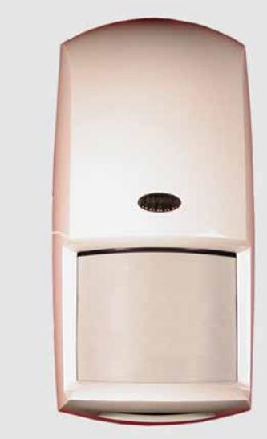

Nunca instale o detector onde o dispositivo PIR ou de microondas esteja em alarme constante (LED aceso). O LED está apagado quando o sistema estiver correctamente instalado.

Não aponte para o trânsito.

Evite instalar onde existem sinais pendurados, árvores ou outros objectos que possam ser movidos pelo vento e que estão dentro da zona de cobertura ou onde se possam movimentar animais selvagens dentro da zona de cobertura.

#### **2 Notas de instalação**

A superfície de montagem deve ser sólida e sem vibrações.

- **Aviso!**
- Ligar a tensão apenas após terem sido efectuadas e inspeccionadas todas as ligações. Não empurrar fio excessivo para dentro do detector.
- Não ligar qualquer terminal a fontes de alimentação que proporcionem mais de 25 VCC.

- Cobertura por microondas
Cobertura por PIR

#### Zona vista de cima

#### **3 Zonas de cobertura**

**Nota:** quando escolher a altura de montagem adequada para sua aplicação (especialmente quando o terreno não é plano) o dedo superior é o mais forte e responde mais rapidamente à presença de um intruso. Cada dedo indicado na vista superior (3-1) possui a mesma configuração de vista lateral (3-2).

- 1. Seleccione um local de montagem. Monte o sensor onde é mais provável que um intruso passe na zona de cobertura.
2. Monte o detector a uma altura entre 2,1 m e 2,7 m.(7 pés a 9 pés). Recomendado: 2,1 m (7 pés)

- **Nota:** as recomendações de altura de montagem são baseadas em superfícies niveladas. Se o terreno não for nivelado, ajuste a altura de montagem e o ângulo do detector para proporcionar a melhor cobertura.
- 3. Faça deslizar a placa de montagem para baixo (4-1) até que ouça um clique e remova-a da tampa.
- 4. Monte a placa de montagem de acordo com uma destas opções:

**Nota:** não retire a etiqueta à prova de água da placa de montagem (4-2). Empurre os parafusos de montagem ou orifícios de recorte através da etiqueta, conforme o necessário.

- Montagem numa superfície utilizando uma caixa eléctrica de elemento único.
	- 1. Instale uma caixa eléctrica de elemento único na localização do detector.
	- 2. Fixe a placa de montagem (4-3) a uma caixa de elemento único com os parafusos adequados.
- Montagem numa superfície sem uma caixa eléctrica.
	- 1. Seleccione um local adequado.
	- 2. Utilizando a placa de montagem (4-1) como um modelo, marque a localização dos parafusos de montagem e o percurso do fio.
	- 3. Fixe a placa de montagem (4-1) à parede com os parafusos adequados.
- Montagem numa superfície utilizando o Suporte B335 fornecido ou um suporte opcional. Utilize as instruções do suporte para fixar o suporte à superfície de montagem adequada.
	- Fixe o suporte B335 à placa de montagem. (4-4).
	- Fixe o suporte B328 à placa de montagem. (4-5).
	- Fixe o suporte B338 à placa de montagem. (4-6).
	- Montagem em poste utilizando o suporte fornecido.

**Nota:** Não monte em postes de vedações que possam oscilar com o vento.

- Fixe o suporte (4-7) à placa de montagem (4-8) utilizando os parafusos e orifícios de montagem adequados.
- Duas braçadeiras de mangueira (não fornecidas), suficientemente grandes para contornar o poste, são recomendadas para apertar a placa de montagem do detector ao poste.

# **4 Montagem**

A unidade possui um tamper de tampa integrado que indica quando a unidade do detector (4-9) é separada da placa de montagem (4-1). A unidade pode igualmente ser instalada de forma a que o tamper indique se toda a unidade for retirada da superfície em que está montada.

**Nota:** o tamper de parede e de tampa apenas estão disponíveis quando é efectuada uma montagem numa superfície. O tamper de tampa está disponível com todas as opções de montagem.

#### **5 Opções do Tamper**

Determine se o interruptor do tamper deve ser utilizado como um tamper de tampa ou um tamper de tampa e de parede:

- Tamper de parede e de tampa: utilize o parafuso adequado para apertar a secção do tamper da placa de montagem (5-1) à parede.
- Tamper de tampa: não aperte a secção do tamper da placa de montagem (5-1) à parede.

| Terminal | Símbolo | Função                                                                                  |
|----------|---------|-----------------------------------------------------------------------------------------|
| 1        | (-)     | Alimentação: Utilize pelo                                                               |
| 2        | (+)     | menos um par de fios 22 AWG (0,8 mm) entre a unidade e a fonte de alimentação. |
| 3        | NF      | Relé do alarme                                                                          |
| 4        | C       |                                                                                         |
| 5        | T       | Tamper                                                                                  |
| 6        | T       |                                                                                         |
| 7        | NF      | Contactos de relé do                                                                    |
| 8        | C       | alarme temporizados                                                                     |
| 9        | NO      |                                                                                         |

#### (7-1) On (Ligado) (7-2) Off (Desligado)

#### **7 Configuração dos interruptores DIP**

| Interruptor | Função                           | Descrição                                                                                                                                                                                                                                                                                                                                                                                                                                                                                                                                                        | Posição do interruptor                                                                       |     |                                    |
|-------------|----------------------------------|------------------------------------------------------------------------------------------------------------------------------------------------------------------------------------------------------------------------------------------------------------------------------------------------------------------------------------------------------------------------------------------------------------------------------------------------------------------------------------------------------------------------------------------------------------------|----------------------------------------------------------------------------------------------|-----|------------------------------------|
| 0           | Desactivação do LED           | Determina se o LED se acende durante as situações de alarme.Predefinição de fábrica: ON                                                                                                                                                                                                                                                                                                                                                                                                                                                                       | ON: LED activado OFF: LED desactivado                                                     |     |                                    |
| 1           | Sensibilidade PIR             | Normal: minimiza os falsos alarmes. Tolera as condições ambientais extremas Intermédia: utilizar onde um intruso poderia cobrir apenas uma pequena porção da área protegida. Tolera ambientes normais. Nota: o detector é fornecido em modo normal.                                                                                                                                                                                                                                                                                               | ON: normal OFF: intermédia                                                                |     |                                    |
| 2 e 3       | Saídas do relé temporizado | Form "C" não supervisionado, o contacto de relé temporizado muda de estado 1 seg. após a activação do alarme. Age de acordo com um                                                                                                                                                                                                                                                                                                                                                                                                                         | SW2                                                                                          | SW3 | Período de activação do relé |
|             |                                  | temporizador seleccionável pelo utilizador. O                                                                                                                                                                                                                                                                                                                                                                                                                                                                                                                    | OFF                                                                                          | OFF | 2 seg                              |
|             |                                  | tempo expira após o período definido após o último alarme. Reinicia-se após cada novo alarme.                                                                                                                                                                                                                                                                                                                                                                                                                                                                 | ON                                                                                           | OFF | 1 min                              |
|             |                                  |                                                                                                                                                                                                                                                                                                                                                                                                                                                                                                                                                                  | OFF                                                                                          | ON  | 5 min                              |
|             |                                  |                                                                                                                                                                                                                                                                                                                                                                                                                                                                                                                                                                  | ON                                                                                           | ON  | 10 min                             |
| 4           | Modo AND/OR                   | Determina se um detector indica situações de alarme no modo AND (quando ambas as tecnologias detectam simultaneamente uma condição de alarme) ou no modo OR (quando as tecnologias PIR ou de microondas detectam um estado de alarme). Nota: o modo OR não é recomendado para a maior parte das instalações. O modo OR proporciona uma detecção mais rápida em algumas condições. Pode igualmente aumentar a probabilidade de alarmes falsos, uma vez que o detector activa o relé do alarme com base numa única tecnologia. | ON: modo AND (recomendado) OFF: modo OR, deve igualmente cortar o comutador (4-10). |     |                                    |
| 5           | Não utilizado                    |                                                                                                                                                                                                                                                                                                                                                                                                                                                                                                                                                                  |                                                                                              |     |                                    |
| 6           | Não utilizado                    |                                                                                                                                                                                                                                                                                                                                                                                                                                                                                                                                                                  |                                                                                              |     |                                    |

- 1. Quando toda a cablagem estiver ligada ao detector mas não à fonte de alimentação e todas as definições tiverem sido efectuadas, faça deslizar a unidade do detector (4-9) para a placa de montagem (4-1) e para baixo até que fique bem
assente. Evite trilhar os fios.

- 2. Com uma pequena chave de parafusos de cabeça chata, rode a haste de fixação (9-1) 180o para bloquear (9-2) a unidade do detector na placa de montagem. Evite utilizar força excessiva.
### **9 Fixar o detector à placa de montagem 10 Teste de passagem**

# **1 Especificações**

| Dimensões:                       | 16,5 cm x 8,25 cm x 5,7 cm (6,5" x 3,25" x 2,25")                                                                                                                                                                                                                                                        |
|----------------------------------|-------------------------------------------------------------------------------------------------------------------------------------------------------------------------------------------------------------------------------------------------------------------------------------------------------------|
| Alimentação:                     | 10 VCC a 15 VCC @ 22mA em espera. Corrente máxima 42 mA.                                                                                                                                                                                                                                                 |
| Alimentação de reserva:       | Sem bateria interna de reserva.                                                                                                                                                                                                                                                                             |
| Relés do alarme:              | Form "A", normalmente fechado (NF), o contacto de alarme supervisionado abre-se com a activação do alarme. Form "C" não supervisionado, o contacto de relé temporizado muda de estado com a activação do alarme e age de acordo com um temporizador programável pelo instalador. |
| Classificações dos contactos: | 3W, 100 mA no máximo, 25 VCC no máximo para cargas CC resistivas; e protegidos por uma resistência de 4,7 Ω, 1/2 W no perno "C" comum do relé. Nota: não utilizar com cargas capacitivas ou indutivas.                                                                                    |
| Intervalo de temperatura:     | O intervalo de temperatura é de -35°C a +60°C para todas as instalações.                                                                                                                                                                                                                              |
| Frequência de microondas:     | OD850-F1: 10.525 GHz OD850-F1E: 10.544 GHz                                                                                                                                                                                                                                                               |
| Cobertura:                       | 15 m por 15 m (50 pés por 50 pés)                                                                                                                                                                                                                                                                        |
| Tamper:                          | NF (com tampa). Contactos com capacidade nominal de 100 mA, 25 VCC no máximo. Ligue o circuito tamper a um circuito de protecção de 24 horas.                                                                                                                                                   |
| IP Rating:                       | 54                                                                                                                                                                                                                                                                                                          |
| Opções:                          | Suporte de montagem com perno de baixo perfil B335 (fornecido), Suporte de montagem de perno B328, Suporte de montagem no tecto B338, Suporte de montagem em poste (fornecido). Nota: o desalinhamento do                                                                                 |

detector nestes suportes pode

reduzir o alcance do detector e aumentar a zona de ângulo morto.

| 8 Visualização dos LEDs |                      |                        |  |  |
|----------------------------|----------------------|------------------------|--|--|
| Indicador do LED           |                      | Condição               |  |  |
|                            | Fixo                 | Alarme PIR             |  |  |
| Verde                      | A piscar             | Alarme de microondas   |  |  |
| Vermelho                   | Alarme duplo Fixo | (ambas as tecnologias) |  |  |
|                            | A piscar             | A iniciar              |  |  |
|                            |                      |                        |  |  |
|                            |                      |                        |  |  |

Este equipamento opera em caráter secundário, isto é, não tem direito a proteção contra interferência prejudicial, mesmo de estações do mesmo tipo, e não pode causar interferência a sistemas operando em caráter primário

#### **Bosch Security Systems, B.V.**

Torenallee 49 5617 BA Eindhoven Netherlands **www.boschsecurity.com**

© 2019 Bosch Security Systems, B.V. F01U071773-11

## **Instrucciones de instalación del detector de intrusión por infrarrojos pasivos/microondas para exterior OD850**

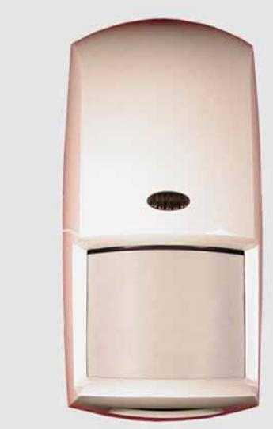

| 1 Especificaciones              |                                                                                                                                                                                                                                                                                                                                               |  |
|------------------------------------|-----------------------------------------------------------------------------------------------------------------------------------------------------------------------------------------------------------------------------------------------------------------------------------------------------------------------------------------------|--|
| Dimensiones:                       | 16,51 cm x 8,25 cm x 5,7 cm (6,5 pulg. x 3,25 pulg. x 2,25 pulg.)                                                                                                                                                                                                                                                                       |  |
| Alimentación:                      | 10 Vcc a 15 Vcc @ 22mA en reposo. Corriente máxima 42 mA.                                                                                                                                                                                                                                                                               |  |
| Alimentación en reposo:         | No incorpora batería interna en reposo.                                                                                                                                                                                                                                                                                                    |  |
| Relés de alarma:                   | Form "A": flotante normalmente cerrado (NC), el contacto de alarma supervisado se abre ante una alarma. Contacto de relé con temporizador form "C" que transfiere la alarma y se rige por un temporizador programable por el instalador.                                                                              |  |
| Clasificación de los contactos: | 3 W, 100 mA de máximo, 25 Vcc de máximo para cargas resistivas de CC; y protegidos por una resistencia de 4,7 Ù, 1/2 W en el terminal común "C" del relé. Nota: No utilizar con cargas capacitivas o inductivas.                                                                                                         |  |
| Rango de temperatura:           | El rango de temperatura es de -35ºC a +60ºC (-31ºF a +140ºF) para todas las instalaciones.                                                                                                                                                                                                                                           |  |
| Frecuencia microondas:          | OD850-F1: 10.525 GHz OD850-F1E: 10.544 GHz                                                                                                                                                                                                                                                                                                 |  |
| Cobertura:                         | 15 m por 15 m (50 pies por 50 pies)                                                                                                                                                                                                                                                                                                        |  |
| Bucle de antisabotaje:          | NC (cubierto). Contactos especificados a 100 mA de máximo, 25 Vcc de máximo. Conecte el circuito de bucle de antisabotaje a un circuito de protección 24 horas.                                                                                                                                                                |  |
| IP Rating:                         | 54                                                                                                                                                                                                                                                                                                                                            |  |
| Opciones:                          | Soporte de bajo perfil de montaje en pared B335 (provisto), soporte de montaje en pared B328, soporte de montaje de techo B338, soporte de montaje sobre postes (provisto). Nota: Si se desalinea el detector en estos soportes, se puede reducir el rango del detector y aumentar la zona de ángulo muerto. |  |

Nunca instale el detector en lugares en los que los infrarrojos pasivos o las microondas estén en alarma constante (LED encendido). El LED se apaga cuando el detector está correctamente instalado.

No oriente el dispositivo hacia el tráfico.

Evite su instalación en lugares en los que las señales colgantes, los árboles y demás objetos que pueda mover el viento estén dentro del patrón de cobertura o en los que la fauna pueda cruzar el patrón de cobertura.

#### **2 Consejos de instalación**

La superficie de montaje debe ser sólida y no tener vibraciones.

**¡Advertencia!**

- No conecte la alimentación hasta que se hayan realizado e inspeccionado todas las conexiones. No enrosque el cable sobrante dentro del detector.
- No conecte los terminales a fuentes de alimentación de más de 25 Vcc.

Cobertura de microondas

Cobertura de infrarrojos pasivos

Zona inferior

#### **3 Patrones de cobertura**

**Nota:** Al elegir la altura de montaje apropiada para su aplicación (especialmente si el terreno no está nivelado) debe tener en cuenta que el haz superior es el más fuerte y responde más rápidamente ante la presencia de un intruso. Cada uno de los haces que se muestran en la vista superior (3-1) tiene la misma configuración en la vista lateral (3-2).

- 1. Seleccione una ubicación para el montaje. Coloque el sensor donde sea más probable que un intruso cruce el patrón de cobertura.
- 2. Sitúe el detector de 2,1 m a 2,7 m (7 pies a 9 pies) del suelo. Recomendado: 2,1 m (7 pies)

**Nota:** Las recomendaciones de altura de montaje están basadas en superficies niveladas. Si el terreno no está nivelado, ajuste la altura de montaje y el ángulo del detector para ofrecer la mejor cobertura.

3. Deslice la placa de montaje hacia abajo (4-1) hasta que oiga un clic y retírela de la tapa.

- 4. Monte la placa de montaje siguiendo una de estas opciones:
**Nota:** No retire la etiqueta resistente al agua de la placa de montaje (4-2). Rompa las aberturas ciegas para los tornillos de montaje o para cable a través de la etiqueta.

- Montaje en superficie utilizando una caja eléctrica única.
	- 1. Instale una caja eléctrica única en la ubicación del detector.
	- 2. Acople la placa de montaje (4-3) a la caja eléctrica única con los tornillos adecuados.
- Montaje en superficie sin caja eléctrica.
	- 1. Seleccione la ubicación adecuada.
	- 2. Utilizando la placa de montaje (4-1) como plantilla, marque la ubicación de los tornillos de montaje y del tendido de cables.
- 3. Acople la placa de montaje (4-1) a la pared con los tornillos adecuados.

#### **4 Montaje**

#### **8 Visualización de los LED**

- Montaje en superficie utilizando el soporte B335 provisto o un soporte opcional. Siga las instrucciones del soporte para acoplarlo a la superficie de montaje adecuada.

- Acople el soporte B335 a la placa de montaje. (4-4).
- Acople el soporte B328 a la placa de montaje. (4-5).
- Acople el soporte B338 a la placa de montaje. (4-6).

- Montaje en poste utilizando el soporte provisto.

**Nota:** No realice el montaje sobre postes de vallas que puedan balancearse con el viento.

- Acople el soporte (4-7) a la placa de montaje (4-8) utilizando los tornillos y los orificios de montaje adecuados.
- Para sujetar la placa de montaje del detector al poste, se recomienda el uso de dos abrazaderas de manguera (no provistas) suficientemente grandes como para rodear el poste.

La unidad incorpora un bucle de antisabotaje de tapa que emite una señal cuando la unidad del detector (4-9) se separa de la placa de montaje (4-1). La unidad también puede instalarse de modo que el bucle de antisabotaje emita una señal si se retira toda la unidad de la superficie sobre la que está montada.

**Nota:** Las opciones de bucle de antisabotaje de pared y de tapa están disponibles únicamente si la unidad está montada sobre una superficie. El bucle de antisabotaje de tapa está disponible en todas las opciones de montaje.

#### **5 Opciones de bucle de antisabotaje**

Decida si el interruptor de bucle de antisabotaje va a utilizarse como bucle de antisabotaje de tapa o como bucle de antisabotaje de pared y de tapa.

- Bucle de antisabotaje de pared y de tapa: Utilice el tornillo adecuado para sujetar la sección de bucle de antisabotaje de la placa de montaje (5-1) a la pared.
- Bucle de antisabotaje de tapa: No fije la sección de bucle de antisabotaje de la placa de montaje (5-1) a la pared.

# **6 Conexión Terminal Etiqueta Función**

| 1 | (-) | Alimentación: Utilice un                                                        |
|---|-----|---------------------------------------------------------------------------------|
| 2 | (+) | par de cables de por lo menos 22 AWG (0,8 mm) entre la unidad y la fuente |
|   |     | de alimentación.                                                                |
| 3 | NC  | Relé de alarma                                                                  |
| 4 | C   |                                                                                 |
| 5 | T   | Bucle de antisabotaje                                                           |
| 6 | T   |                                                                                 |
| 7 | NC  | Contactos de relé de                                                            |
| 8 | C   | alarma con temporizador                                                         |
| 9 | NO  |                                                                                 |

#### (7-1) Ecendido (7-2) Apagado

#### **Interruptor Característica Descripción Posición del interruptor** 0 LED desactivado Determina si el LED se ilumina durante las situaciones de alarma. Ajuste predeterminado de fábrica: ENCENDIDO **Encendido:** LED activado **Apagado:** LED desactivado 1 Sensibilidad de infrarrojos pasivos **Estándar:** Reduce la posibilidad de falsas alarmas. Tolera condiciones ambientales extremas **Intermedio:** Utilícelo en lugares en los que un intruso cubra solamente una pequeña parte del área protegida. Tolera condiciones ambientales normales. **Nota:** El detector se sirve en modo estándar. **Encendido:** Estándar **Apagado:** Intermedio 2 y 3 Relés de salida con temporizador Contacto de relé con temporizador form "C", no supervisado, que se activa un segundo después de una alarma. Se rige por un temporizador seleccionado por el usuario. El tiempo se agota según el ajuste efectuado tras la última alarma. El tiempo se restablece en cada nueva alarma. **SW2 SW3 Tiempo de activación del relé** Apagado Apagado 2 seg Encendido Apagado 1 min Apagado Encendido 5 min Encendido Encendido 10 min 4 Modo AND/OR (Y/O) Determina si el detector informa de situaciones de alarma en el modo AND (cuando ambas tecnologías detectan una condición de alarma al mismo tiempo) o en el modo OR (cuando el estado de alarma es detectado por los infrarrojos pasivos o por la tecnología de microondas). **Nota:** El modo OR **no** se recomienda en la mayoría de las instalaciones. El modo OR proporciona una detección más rápida en algunas condiciones. No obstante, también puede incrementar la posibilidad de alarmas molestas debido a que el detector activa el relé de alarma basándose en la información recibida de una sola tecnología. **Encendido:** Modo AND (recomendado) **Apagado:** Modo OR; también debe cortarse el interruptor (4-10). 5 Sin utilizar 6 Sin utilizar

#### **7 Configuración del interruptor DIP**

| Indicador LED |             | Condición                          |
|---------------|-------------|------------------------------------|
| Verde         | Fijo        | Alarma de infrarrojos pasivos   |
|               | Parpadeante | Alarma de microondas               |
| Rojo          | Fijo        | Alarma dual (ambas tecnologías) |
|               | Parpadeante | Encendido                          |

- 1. Cuando todos los cables estén conectados al detector pero no a la fuente de alimentación y se hayan realizado todos lo ajustes, deslice la unidad del detector (4-9) dentro de la placa de montaje (4-1) y hacia abajo hasta que encaje perfectamente. Evite pillar los cables.
- 2. Utilice un destornillador pequeño de cabeza plana para girar la leva de bloqueo (9-1) 180º para bloquear (9-2) la unidad del detector en la placa de montaje. No aplique demasiada fuerza.

#### **9 Cómo acoplar el detector a la placa de montaje**

**Nota:** Asegúrese de que el detector está fuertemente sujeto a la placa de montaje y que todos los cables están conectados y enchufados antes de comenzar la prueba de paseo.

**Nota:** Asegúrese de que el desactivador de LEDs (SW0) está en la posición de encendido (consulte la Sección 7 Configuración del interruptor DIP).

**Nota:** Para evitar alarmas falsas, ajuste el rango de microondas (10-1) al mínimo antes de comenzar la prueba de paseo.

Cobertura de microondas

#### **10 Prueba de paseo**

- Cobertura de infrarrojos pasivos
- 1. Espere al menos 2 minutos después del encendido para comenzar la prueba de paseo. El LED parpadea en rojo hasta que el detector se estabiliza y no se detecta movimiento durante 2 segundos.
- 2. Observe el LED mientras camina hacia el extremo del patrón (10-2). El LED se enciende en el extremo exterior del rango de cobertura.
- 3. Repita el paso 3 desde distintas direcciones hasta verificar el patrón de cobertura. El LED verde se ilumina identificando el extremo del patrón de infrarrojos pasivos. El LED verde parpadea identificando el extremo del patrón de microondas.
- 4. Repita el paso 3 desde el lado opuesto.
- 5. Si no consigue el rango necesario, aumente el ajuste de microondas (10-1) girándolo ligeramente en el sentido de las agujas del reloj.
- 6. Repita la prueba de paseo y los ajustes hasta alcanzar el extremo más lejano de la cobertura necesaria.

OD850 户外被动红外线探测器/微 波入侵探测器安装说明

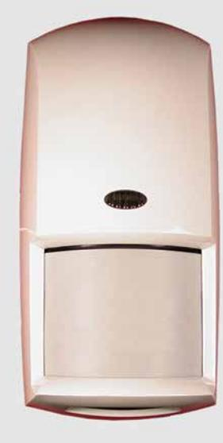

| 1      |                                                                                                        |
|--------|--------------------------------------------------------------------------------------------------------|
| 规格     |                                                                                                        |
| 尺寸:    | 6.5 in. x 3.25 in. x 2.25 in. (16.5 cm x 8.25 cm x 5.7 cm)                                          |
| 输入功率:  | 10 VDC至15 VDC、22 mA备用电 源。最大电流42 mA。                                                                 |
| 备用电源:  | 无内装备用电池。                                                                                               |
| 警报继电器: | Form"A"通常关闭(NC)、 受监测警报接点在发出警报时打 开。Form"C"不受监测定时继电 器接点在发出警报时转换,并随安 装者可编程定时器变化。              |
| 接点额定值: | 3 W、100 mA最大电流、25 VDC 最大电压(直流电阻负荷);受 继电器共用"C"引线中的4.7 Ω、1/2 W电阻器保护。 备注:请勿在电容性或电感性负 荷上使用。 |
| 温度范围:  | 所有安装(包括UL认证的安装) 的温度范围为-31°F 至 +140°F (-35°C 至 +60°C)。                                            |
| 微波频率:  | OD850-F1: 10.525 GHz OD850-F1E: 10.544 GHz                                                          |
| 覆盖范围:  | 50 ft. x 50 ft.(15 m x 15 m)                                                                           |
| 动态传感:  | NC(盖板盖上)。接点最高额定 值为100 mA、25 VDC。将动态 传感电路与二十四小时保护电路 连接。                                        |
| IP额定值: | 54                                                                                                     |
| 选购部件:  | B335隐蔽式旋转支架(随附) 、B328旋转支架、B338顶式支 架、柱式支架(随附)。 备注:未在此类支架中将探测器 正确定位可能缩小探测器的探测范 围,扩大盲点面积。  |

# **2**

# 安装注意事项

切勿在PIR或微波经常处于警报状态(LED打开)的位置 安装探测器。适当安装后,LED关闭。 请勿朝向有车辆经过的方向。

避免在能够被风吹动的悬挂标志、树木或其他物体位于覆 盖区域内的位置或野生动物可能进入的覆盖区域内安装。 核实安装表面稳固且不会振动。

警告!

- 仅限在所有连接均完成并检查后再接通电源。请勿将 多余的电线卷起放置在探测器中。
- 请勿将任何终端与任何超过25 VDC的电源连接。

# **3**

# 覆盖区域

微波覆盖范围

## PIR覆盖范围 俯视探测区

备注:选择适当的安装高度时(特别是在地势不平坦 时),应当了解上方指针最有效,可对入侵者的出现作出 更快的反应。顶视图中显示的每个指针(3-1)均有相同 的侧视图(3-2)配置。

# **4** 安装

- 1. 选择一个安装位置。在入侵者最可能穿过覆盖区域的位置安装传感器。
- 2. 将探测器安装在高出地面7-9英尺(2.1米至2.7米)的位置。建议安装高度:7英尺(2.1米)

备注:安装高度建议系基于平坦的表面。如果地势不平,调整安装高度和探测器角度,以便提供最佳覆盖范围。

3. 将安装盘向下滑动(4-1),直至听到喀嚓一声,将安装盘从盖板上取下。

- 4. 使用下列一种方法装上安装盘:
- 备注:请勿揭下安装盘上的防水标签(4-2)。必要时可在安装螺钉或预制穿孔位置穿透标签。
- 使用单套接线盒作平面安装。
	- 1. 在探测器位置安装单套接线盒。
	- 2. 用适当的螺钉将安装盘(4-3)装在单套接线盒上。
- 无接线盒平面安装。
	- 1. 选择一个适当的位置。
	- 2. 将安装盘用作模板(4-1),标出安装螺钉和线路的位置。
	- 3. 用适当的螺钉将安装盘(4-1)装在墙上。

- 使用随附的B335支架或供选用支架进行平面安装。遵循支架安装说明将支架装在适当的安装平面上。

- 将B335支架装在安装盘上。 (4-4).
- 将B328支架装在安装盘上。 (4-5).
- 将B338支架装在安装盘上。 (4-6).
- 使用随附的支架进行柱式安装。

| 3. 从不同的方向重复步骤3,直至适当核实覆盖区域。 绿色的LED会亮起,识别PIR覆盖区域边缘。 Bosch Security Systems, B.V. 绿色的LED会闪烁,识别微波覆盖区域边缘。 130 Perinton Parkway             |  |
|---------------------------------------------------------------------------------------------------------------------------------------------------|--|
| 4. 从相反的一侧重复步骤3。 Fairport, NY 14450-9199                                                                                                        |  |
| www.boschsecuritysystems.com 5. 如果未达到要求的范围,将微波调节器按顺时针方向 略微转动,提高微波调节器的数值(10-1)。                                                              |  |
| 6. 重复走动测试并作出调整,直至达到所需的最远覆盖 区域边缘。 Bosch Security Systems, B.V. Torenallee 49 5617 BA Eindhoven Netherlands www.boschsecurity.com |  |
| © 2019 Bosch Security Systems, B.V. F01U071773-11                                                                                              |  |
| 第 10 页/共 10 页                                                                                                                                     |  |

备注:请勿装在可能随风晃动的栅栏柱上。

- 用适当的螺钉和安装孔将支架(4-7)装在安装盘(4-8)上。
- 建议使用两个尺寸足以套在立柱上的软管夹(未随附)将探测器安装盘固定在立柱上。

**5**

# 动态传感安装选项

该装置有一个内装盖板动态传感开关,当探测器装置 (4-9)与安装盘(4-1)分开时,该动态传感开关会发出 信号。在安装该装置时还可以将装置设为在整个装置被人 从安装平面上拉下时动态传感开关会发出信号。

备注:只有在装置安装在平面时,才能使用壁式和盖板 动态传感选用开关。盖板动态传感开关可提供各种安装 选项。

确定是将动态传感开关用作盖板动态传感开关还是用作壁 式和盖板动态传感开关:

- 壁式和盖板动态传感开关:用适当的螺钉将安装盘 动态传感开关部位(5-1)固定在墙上。 - 盖板动态传感开关:请勿将安装盘动态传感开关部
- 位(5-1)固定在墙上。

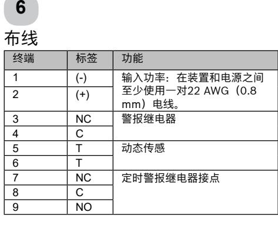

# **7** DIP开关配置 (7-1)打开

| (7-2)关闭 |                         |                                                                                                                                                                                       |                                                                   |     |                 |  |  |
|---------|-------------------------|---------------------------------------------------------------------------------------------------------------------------------------------------------------------------------------|-------------------------------------------------------------------|-----|-----------------|--|--|
| 开关      | 功能                      | 说明                                                                                                                                                                                    | 开关位置                                                              |     |                 |  |  |
| 0       | LED禁用                   | 确定在发出警报的过程中LED是否亮起。 工厂默认设定值:打开                                                                                                                                                     | 打开:LED启用 关闭:LED禁用                                              |     |                 |  |  |
| 1       | PIR敏感度                  | 标准:最大限度减少错误警报。耐受极端环境状况。 中级:在入侵者可能仅进入很小一部分受保护区域的位置使用。 耐受正常环境状况。 备注:提供的探测器设定为标准模式。                                                                                             | 打开:标准 关闭:中级                                                    |     |                 |  |  |
| 2和3     | 定时继电器 输出             | Form"C"不受监测定时继电器接点,该接点在发出警报后一秒 钟传输信号。依照用户选择定时器操作。在最后一次警报后设定 的时间超时。每次发出新警报时重设。                                                                                                   | SW2                                                               | SW3 | 继电器 激活时 间 |  |  |
|         |                         |                                                                                                                                                                                       | 关闭                                                                | 关闭  | 2秒              |  |  |
|         |                         |                                                                                                                                                                                       | 打开                                                                | 关闭  | 1分钟             |  |  |
|         |                         |                                                                                                                                                                                       | 关闭                                                                | 打开  | 5分钟             |  |  |
|         |                         |                                                                                                                                                                                       | 打开                                                                | 打开  | 10分钟            |  |  |
| 4       | "和/或" (AND/OR) 模式 | 确定探测器警报是用"和"(AND)模式 (两项技术同时感测到警报状态)还是用"或" (OR)模式 (PIR或微波技术单独感测到警报状态)。 备注:建议在大部分安装中不要使用"或" (OR)模式。在某些情况下,"或"(OR)模式的探测速度较 快。该模式亦可能会增加错误警报的可能性,因为探测器根据单 项技术的输入激活警报。 | 打开:"和"(AND)模 式(建议使用) 关闭:"或"(OR)模 式,您必须同时切断跨接线 (4-10)。 |     |                 |  |  |
| 5       | 未使用                     |                                                                                                                                                                                       |                                                                   |     |                 |  |  |
| 6       | 未使用                     |                                                                                                                                                                                       |                                                                   |     |                 |  |  |
|         |                         |                                                                                                                                                                                       |                                                                   |     |                 |  |  |

**8** LED显示

| LED指示器 |    | 状况        |  |  |  |  |
|--------|----|-----------|--|--|--|--|
|        | 持续 | PIR警报     |  |  |  |  |
| 绿色     | 闪烁 | 微波警报      |  |  |  |  |
| 红色     | 持续 | 双警报(两项技术) |  |  |  |  |
|        | 闪烁 | 电源启动      |  |  |  |  |

**9**

将探测器装在安装盘上

1. 当所有的线路均与探测器连接但未与 电源接通并且所有的设定值均妥当设 定后,将探测器装置(4-9)滑至安 装盘(4-1)上,使之下降就位,直

至放稳。避免夹伤电线。 2. 用一把小平头螺丝刀将锁定凸轮 (9-1)旋转180o,将探测器装置锁 定在(9-2)安装盘上。避免过度用

力。

# **10**

# 走动测试

备注:开始走动测试之前,核实探测器已固定在安装盘 上,所有的线路均已连接并接通电源。

备注:核实LED禁用(SW0)开启(请参阅第七节:DIP 开关配置)。

备注:为了避免错误警报,在开始走动测试之前将微波拨 盘(10-1)设定在最小值。

# 微波覆盖范围

- PIR覆盖范围
- 1. 电源开启后,至少等候2分钟,再开始走动测试。LED 灯会闪烁红色,直至探测器状况稳定,且在2秒钟内未 探测到任何活动。
- 2. 当您步行至覆盖区域边缘时,观察LED的状况