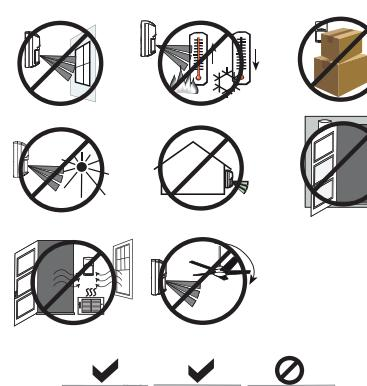

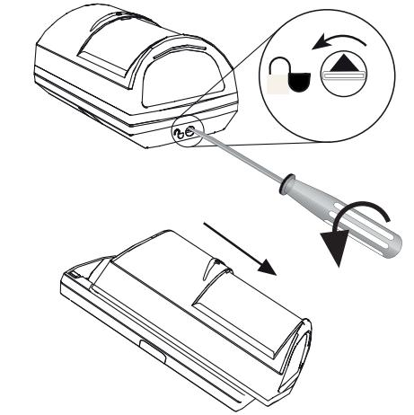

**1 | 2 | 3 | 4 |**

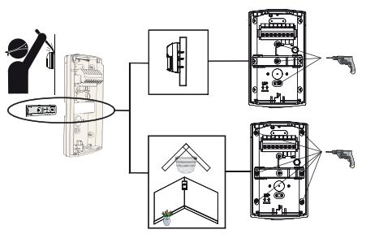

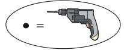

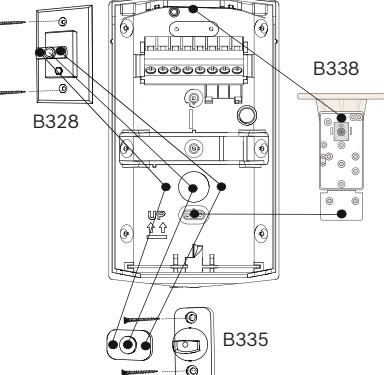

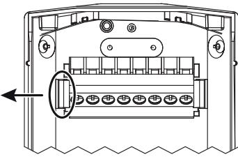

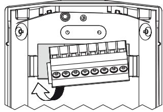

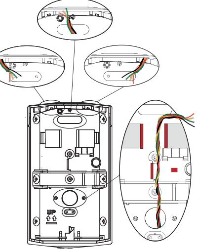

**5 | 6 | 7 | 8 |**

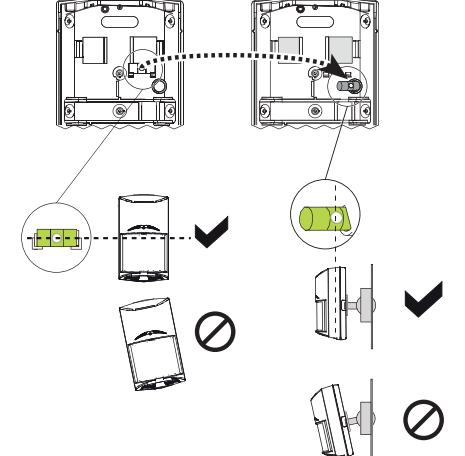

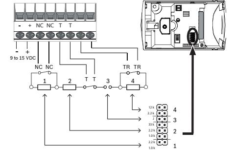

**12 | 13 | 14 |**

## **Commercial Series TriTech AM Motion Detectors with Anti‑mask**

ISC‑CDL1‑WA15G ISC‑CDL1‑WA12G ISC‑CDL1‑WA15GE ISC‑CDL1‑WA15HE ISC‑CDL1‑WA15G‑CHI

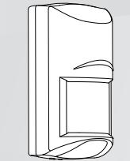

**en** Quick Installation Guide

9 to 15 VDC NC NC T T 2 NC NC T T

> 2 3 4

1.0 k 1

12 k

2.2 k 1.0 k 2.2 k 33 k J 2.2 k

1.0 k

2 3 4

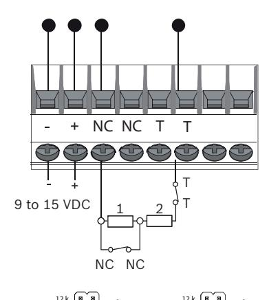

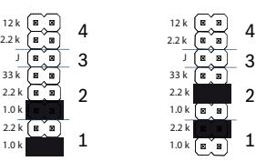

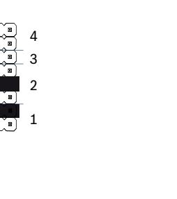

NC NC TT

- 9 to 15 VDC
1.0 k 1

12 k

2.2 k 1.0 k 2.2 k 33 k J 2.2 k

12 k

2.2 k 1.0 k 2.2 k 33 k J 2.2 k

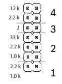

**1** LED ON

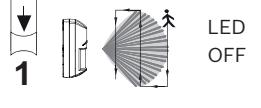

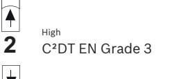

**2** C2DT EN Grade 2 Low

C2DT EN Grade 2 and C2DT EN Grade 3 were not investigated by UL

3

4

< 30 cm (1 ft)

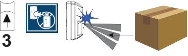

NC NC TT

9 to 15 VDC

1 2

12 k

NC NC TR TR

2.2 k 1.0 k 2.2 k 33 k J 2.2 k

1.0 k

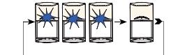

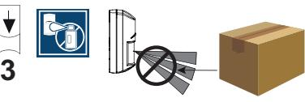

Switch 3 was not investigated by UL

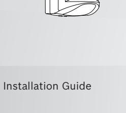

**Bosch Security Systems B.V.** Torenallee 49 5617 BA Eindhoven The Netherlands

**www.boschsecurity.com**  © Bosch Security Systems B.V., 2019

# **Part II of II**

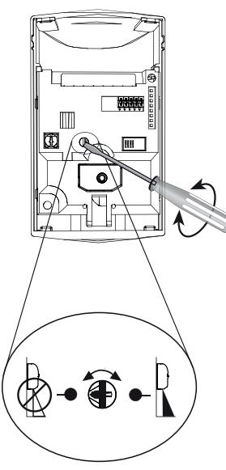

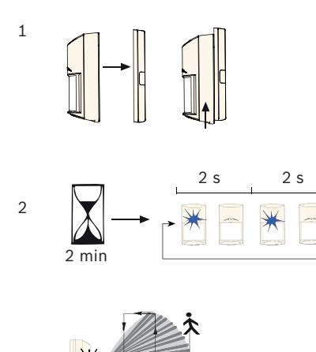

**1 | 2 | 3 | 4 |**

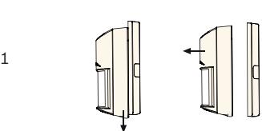

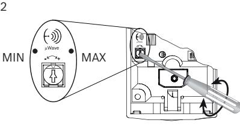

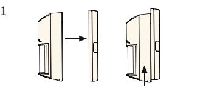

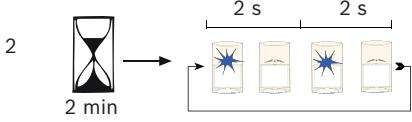

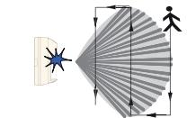

Changes or modifications not expressly approved by Bosch Security Systems, Inc. can void the user's authority to operate the equipment.

cU-Lus Use only a Listed Class 2 Power Limited power source.

Standby power: The Listed control unit or a listed burglary power supply must provide 4 hours of standby power. Install the unit in accordance with National Electrical Code NFPA 70 and Part 1 of the Canadian Electrical code CSA C22.1.

### **5 | 6 | 7 | 8 |**

3

IC

- FCC/ This device complies with part 15 of the FCC Rules and Industry Canada license-exempt RSS standard(s). Operation is subject to the following two conditions: (1) this device may not cause interference, and (2) this device must accept any interference, including interference that may cause undesired operation of the device
Le présent appareil est conforme aux CNR d'Industrie Canada applicables aux appareils radio exempts de licence. L'exploitation est autorisée aux deux conditions suivantes : 1) l'appareil ne doit pas produire de brouillage, et (2) l'utilisateur de l'appareil doit accepter tout brouillage radioélectrique subi, même si le brouillage est susceptible d'en compromettre le fonctionnement.

Under Industry Canada regulations, this radio transmitter may only operate using an antenna of a type and maximum (or lesser) gain approved for the transmitter by Industry Canada.

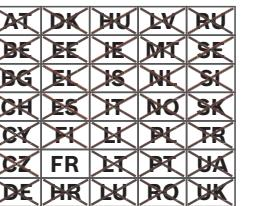

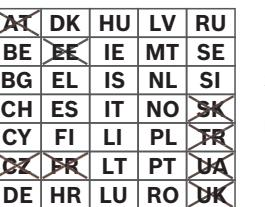

10.510 to 10.580 GHz 25 mW ISC-CDL1-WA15GE

10.570 to 10.610 GHz 20 mW ISC-CDL1-WA15HE

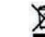

**Manufacturing dates** For product manufacturing dates, go to http://www.boschsecurity.com/datecodes/ and refer to the serial number located on the product label.

3

| Voltage (operating)     | 9 to 15 VDC, 9-15 Vcc de 16 mA @ 12 Vcc en veille/en alarme, source limitée en puissance, ondulation résiduelle 1 V. |
|----------------------------|-------------------------------------------------------------------------------------------------------------------------------|
| Current (max)           | 16 mA                                                                                                                         |
| Alarm re lay/ Tamper | ≤100 mA, 25 V                                                                                                                 |
| Wiring loops            | Ø 1.29 mm to 0.40 mm (16 AWG to 26 AWG) (UL: 22 AWG to 16 AWG)                                                          |
|                            | GE = -20 °C to +55 °C HE = +5 °C to +40 °C UL: 0 °C to +49 °C (+32 °F to +120 °F) AFNOR/CNPP: -10 °C to +55 °C       |
|                            | 95% non-condensing UL: 93%                                                                                                 |

WA ARTBOARD

| Region        | Agency | Certification                                                                                             | CN | CCC | 2015031901000145 (ISC-CDL1-                          |
|---------------|--------|-----------------------------------------------------------------------------------------------------------|----|-----|------------------------------------------------------|
| USA and CA | UL     | UL639, S306-03 cULus LISTING Intrusion Detection Unit, Type: S (ISC-CDL1-WA15G, ISC-CDL1- WA12G) |    |     | WA12G-CHI, ISC-CDL1-W15G-CHI, ISC-CDL1-WA15G-CHI) |
|               | FCC    | Part 15 Class B (ISC-CDL1- WA15G, ISC-CDL1-WA12G)                                                      |    |     |                                                      |
|               | IC     | RSS210 1249A-CDL1 (ISC-CDL1- WA15G, ISC-CDL1-WA12G)                                                    |    |     |                                                      |
| EU            | CE     | CE - 2014/53/EU (RED), 2011/65/ EU and 2015/863 (RoHS) (ISC CDL1-WA15GE, ISC-CDL1- WA15HE)       |    |     |                                                      |
| AU            | ACMA   | RCM (ISC-CDL1-WA15G, ISC CDL1-WA12G)                                                                   |    |     |                                                      |
| BR            | ANATEL | Resolution No. 242 (ISC-CDL1- WA15G, ISC-CDL1-WA12G)                                                   |    |     |                                                      |

**9 | 10 | 11 |**

**12 | 13 | 14 |**

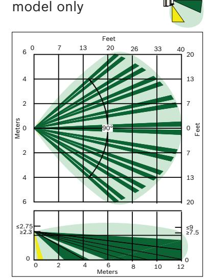

For ISC-CDL1-WA12G

## **Commercial Series TriTech AM Motion Detectors with Anti‑mask**

ISC‑CDL1‑WA15G ISC‑CDL1‑WA12G ISC‑CDL1‑WA15GE ISC‑CDL1‑WA15HE ISC‑CDL1‑WA15G‑CHI

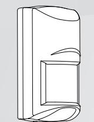

**en** Quick Installation Guide

**Bosch Security Systems B.V.** Torenallee 49 5617 BA Eindhoven The Netherlands

**www.boschsecurity.com**  © Bosch Security Systems B.V., 2019

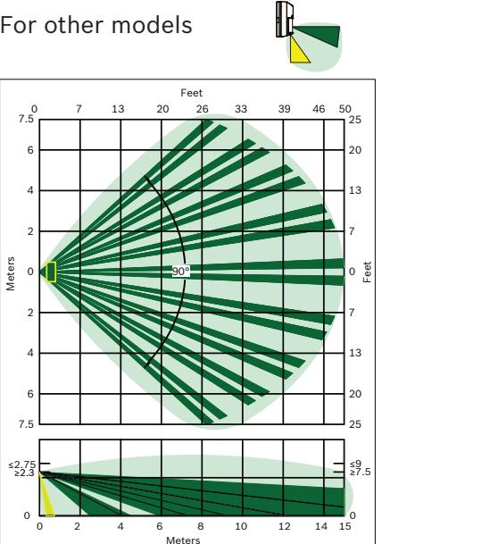

0

Meters