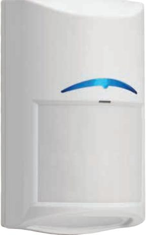
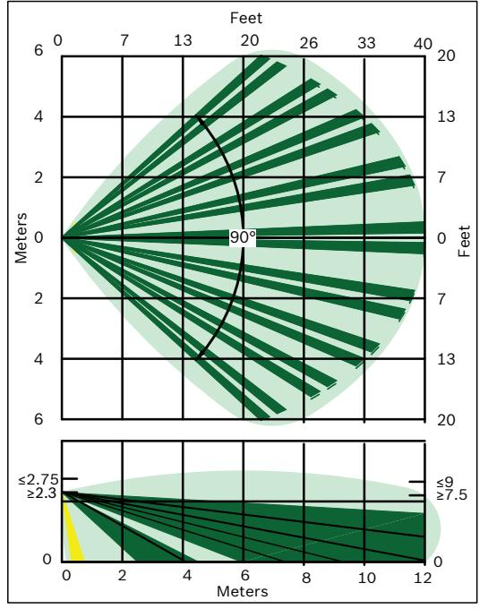
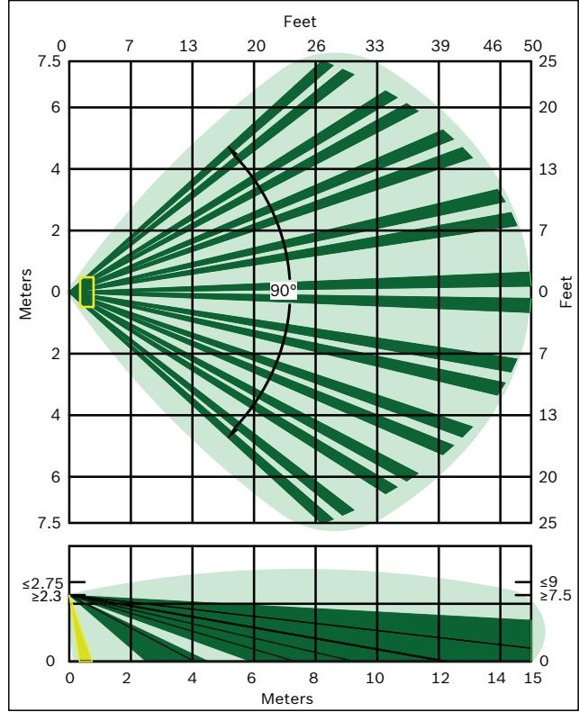

# Commercial Series TriTech AMrörelsedetektorer med maskeringsskydd

www.boschsecurity.com

Commercial Series TriTech AM-rörelsedetektorer med maskeringsskydd och TriTech-rörelsedetektorer är designade för tillförlitlig detektering och falsklarmsimmunitet i företagsapplikationer. Commercial Series-rörelsedetektorer använder en kombination av PIR (passiv IR) och mikrovågsdetekteringstekniker (Dopplerradar) med avancerad signalbehandling. Installationen av Commercial Series-detektorerna sker enklare och mer tillförlitligt med funktioner som inbyggda och valbara ändmotstånd, självlåsande kapsling med inbyggt vattenpass och en borttagbar kopplingsplint av hisstyp.

## **Funktioner**

## **FSP-signalbehandling**

FSP (First Step Processing) reagerar nästan omedelbart på inkräktare utan att skapa falsklarm från andra källor. FSP används för att automatiskt justera detektorns känslighet baserat på signalens amplitud, polaritet, stigning och tid. Installatören kan välja känslighetsnivån, och på så vis förbättra tillförlitligheten. Känslighetsnivån för Commercial

- u TriTech. Detektering med passiv IR och mikrovågor (Dopplerradar) med FSP-signalbehandling.
- u TriTech AM-modellerna omfattar aktiv infraröd antimaskering.
- u Flexibel monteringshöjd och integrerade EOLmotstånd.
- u Maskerings- och kamouflagedetekteringsteknik (C2DT).
- u Adaptiv mikrovågsbrusbehandling.

Series-rörelsedetektorer med maskeringsskydd är ungefär 20 % högre än för modeller utan maskeringsskydd, vilket gör dem mer lämpliga om säkerhetskraven är mycket höga, t.ex. på banken, hos guldsmeden, på apotek och på andra platser.

## **Aktiv infraröd antimaskeringsteknik**

Detektorn använder två olika tekniker för att upptäcka försök att skärma av detektorns siktfält: genom linsen och reflektion.

## **Adaptiv mikrovågsbrusbehandling**

Adaptiv mikrovågsbrusbehandling anpassas till bakgrundsstörningar och reducerar falsklarm från upprepande källor utan att göra avkall på förmågan att detektera inkräktare.

#### **Inbyggda ändmotstånd valbara med byglingar**

De inbyggda ändmotstånden förenklar kabeldragningen och kortar installationstiden.

#### **Flexibla monteringshöjder**

Inga justeringar krävs om apparaturen monteras på 2,3 till 2,75 m höjd. Detta kortar installationstiden och minskar antalet falsklarm – och förbättrar dessutom identifieringen.

## **Självlåsande kapsling med borttagbar kopplingsplint**

Den skjutbara, självlåsande kapslingen har ett inbyggt dubbelaxligt vattenpass och en anpassad glappfri kopplingsplint av hisstyp som gör installationen enklare och mer tillförlitlig.

## **Dynamisk temperaturkompensation**

Detektorn justerar känsligheten för att kunna identifiera inkräktare vid vilken temperatur som helst.

## **Smådjursimmunitet**

Smådjursimmuniteten minskar antalet falsklarm på grund av smådjur (med en vikt upp till 4,5 kg) som kan röra sig på marken inom detektorns avsökningsyta.

## **Skyddad, förseglad optik och elektronik**

Optiken och elektroniken är monterad i den främre kapslingen och innesluten i ett skyddshölje som förhindrar skador under installationen. Med den slutna optiska kammaren förhindras också att drag och insekter påverkar detektorn.

## **Maskerings- och kamouflagedetekteringsteknik**

Maskerings- och kamouflagedetekteringsteknik (C2DT) maximerar identifieringsförmågan mot inkräktare som försöker dölja sin IR-signal.

## **Testfunktioner**

Lysdiod för gångtest som kan stängas av efter installation.

## **Kontaktens konfiguration**

Följande funktioner går att välja med omkopplare:

- Larmlampa på och av
- C2DT HÖG och LÅG

Täckning från vägg till vägg

En inbyggd och av användaren valbar krypzon och ett täckningsområde om 15 × 15 m ger täckning från vägg till vägg.

## **Skydd mot radiofrekvensstörning och stötar**

E-modellerna har förbättrat skydd mot falsklarm från externa källor inklusive radiofrekvensstörningar ("popcornbrus") samt fysiska stötar. Med hjälp av en högpresterande pyrosensor (infraröd) med integrerad signalfiltrering, elektriska komponenter och design av högsta kvalitet som ger förstklassigt signal/ brusförhållande och avancerad signalbehandling, är dessa detektorer mer tåliga än någonsin mot falsklarm.

## **Förbättrat motstånd mot sabotage**

E-modelldetektorerna testas och godkänns nu enligt EN50131-5-3-kraven för skydd mot störningar från externa radiofrekvenskällor. Detekteringsprestanda och falsklarmsskydd säkerställs vid förekomst av sådana källor som kan försämra prestanda för detektorer som inte är godkända enligt denna standard.

## **Certifikat och godkännanden**

| Region     | Överensstämmelse med regelverk/ kvalitetsmärkning |                                                                                                                                                      |
|------------|------------------------------------------------------|------------------------------------------------------------------------------------------------------------------------------------------------------|
| Australien | RCM                                                  | [ISC-CDL1-W15G, ISC-CDL1-WA15G, ISC-CDL1-WA12G]                                                                                                   |
| Europa     | CE                                                   | 2014/53/EU (RED) 2011/65/EU (RoHS) (EU 2015/863 amending Annex II to Directive 2011/65/EU [Notified body 0700]                              |
|            | EN5013 1                                          | EN50131-2-4 Grade 3 Environmental Class II (G models) I (H models)                                                                                |
| USA        | UL                                                   | [ISC-CDL1-WA12G, ISC-CDL1-WA15G, ISC-CDL1-W15G]                                                                                                   |
|            | UL                                                   | UL 639 - Standard for Intrusion Detec tion Units                                                                                                  |
|            | FCC                                                  | Part 15 Class B                                                                                                                                      |
| Kanada     | ULC                                                  | [ISC-CDL1-WA12G, ISC-CDL1-WA15G, ISC-CDL1-W15G]                                                                                                   |
|            | ULC                                                  | CAN/ULC S306-03 - Canadian Standard for Intrusion Detection Units                                                                                 |
|            | IC                                                   | Industry Canada                                                                                                                                      |
| Frankrike  | AFNOR                                                | EN50131-2-4 Grade 3, NF324-H58 + RTC 50131-2-4 ISC-CDL1-WA15GE - Certificate # 2800200014A1 ISC CDL1-WA15HE - Certificate # 2830200012A1 |
| Kina       | CCC                                                  | 2015031901000145 [ISC-CDL1- WA12G-CHI, ISC-CDL1-W15G-CHI, ISC CDL1-WA15G-CHI]                                                                  |
| Brasilien  | ANATEL                                               | [ISC-CDL1-W15G, ISC-CDL1-WA15G]                                                                                                                      |

#### **Installations- och konfigurationskommentarer**

## **Montering**

Rekommenderad monteringshöjd är 2,3 till 2,75 m utan att justering behövs.

Montera rörelsedetektorn rakt, både horisontellt och vertikalt.

Detektorn kan monteras:

- I ett hörn genom att detektorsockelns fasade kanter utnyttjas.
- På en plan vägg genom att detektorsockeln fästs direkt mot väggen.
- På en plan vägg med kardanupphängningsfästet B328 (tillval) eller med kulledsfästet B335.
- I taket med tillbehöret B338 Takfäste.

#### **Täckningsmönster**

*Endast för ISC-CDL1-WA12G-modellen*

## **Tekniska specifikationer**

## **Egenskaper**

| Mått                      | 120 × 70 × 55 mm                                                           |
|---------------------------|----------------------------------------------------------------------------|
| Material                  | Stötsäker ABS-plast                                                        |
| Färg                      | Vit                                                                        |
| Trådtjocklek för terminal | Ø 0,40 mm till 1,29 mm (26 AWG till 16 AWG) (UL: 22 AWG till 16 AWG) |

#### **Miljöspecifikationer**

| Miljö                  | Uppfyller EN50130-5 miljöklass II    |
|------------------------|--------------------------------------|
| Relativ luftfuktighet  | 93 %, icke-kondenserande             |
| Temperatur (vid drift) | –30 till +55 °C UL: 0 till +49 °C |

#### **Elektriska specifikationer**

| Ström                                    | Viloläge =15 mA (UL: Maximal ström = 35 mA)                                                                                       |  |
|------------------------------------------|--------------------------------------------------------------------------------------------------------------------------------------|--|
| Spänning (vid drift)                     | 9 till 15 V DC                                                                                                                       |  |
| Skydd mot radiofrekvensstörning (RFI) | Inget larm och ingen installation på viktiga frekvenser i intervallet 150 kHz till 2,7 GHz vid fältstyrka mindre än 10 V/m. |  |
| Utgångar                                 |                                                                                                                                      |  |
| Larmrelä, felrelä                        | Övervakade normalt slutna (NC) halvledarkontakter för max 100 mA, 25 V, 2,5 W                                                  |  |
| Sabotageskydd                            | Övervakade normalt slutna (NC) kontakter för max 100 mA, 25 V, 2,5 W                                                           |  |
| Ändmotstånd                              | Larm: 1,0 k, 2,2 k Sabotageskydd: 1,0 k, 2,2 k, 33 k Fel: 2,2 k, 12 k                                                       |  |

*För andra modeller*

#### **Beställningsinformation**

#### **ISC-CDL1-WA15G Rörelsedetektor, maskeringsskydd, 15 m**

Detektering med PIR och mikrovågor (Dopplerradar), 15 × 15 m täckning med maskeringsskydd. Frekvens: 10,525 GHz

Ordernummer **ISC-CDL1-WA15G**

#### **ISC-CDL1-WA15G-CHI Rörelsedetektor, maskeringsskydd, 15 m**

Detektering med PIR och mikrovågor (Dopplerradar), 15 × 15 m täckning med maskeringsskydd. Frekvens: 10,525 GHz. För Kina.

Ordernummer **ISC-CDL1-WA15G-CHI**

#### **ISC-CDL1-WA12G Rörelsedetektor med maskeringsskydd, 12 m**

Detektering med PIR och mikrovågor (Dopplerradar), 12 × 12 m täckning med maskeringsskydd. Frekvens: 10,525 GHz

Ordernummer **ISC-CDL1-WA12G**

#### **ISC-CDL1-WA12G-CHI Rörelsedetektor med maskeringsskydd, 12 m**

Detektering med PIR och mikrovågor (Dopplerradar), 12 × 12 m täckning med maskeringsskydd. Frekvens: 10,525 GHz. För Kina.

Ordernummer **ISC-CDL1-WA12G-CHI**

#### **ISC-CDL1-WA15GE Rörelsedetektor, maskeringsskydd, 15 m**

Detektering med PIR och mikrovågor (Dopplerradar), 15 × 15 m täckning med maskeringsskydd. Frekvens: 10,52 till 10,55 GHz. Vissa begränsningar gäller för användning i Europa.

Ordernummer **ISC-CDL1-WA15GE**

#### **ISC-CDL1-WA15HE Rörelsedetektor, maskeringsskydd, 15 m, FR**

Detektering med PIR och mikrovågor (Dopplerradar), 15 × 15 m täckning med maskeringsskydd. Frekvens: 10,57 till 10,60 GHz. För Frankrike. Ordernummer **ISC-CDL1-WA15HE**

#### **Tillbehör**

#### **B328 Monteringsfäste, kardanmontering**

Monteras på dosa med ett uttag och klarar detektorrotation. Trådarna döljs på insidan. Ordernummer **B328**

#### **B335-3 fäste, vridbart, låg profil**

Universalväggfäste med kulled och låg profil. Det vertikala vridningsomfånget är +10° till -20°, och det horisontella vridningsomfånget är ±25°. Ordernummer **B335-3**

#### **B338 Universellt takfäste**

Universalväggfäste med kulled. Det vertikala vridningsomfånget är +7° till -16°, och det horisontella vridningsomfånget är ±45°. Ordernummer **B338**

**Representerad av:**

**Europe, Middle East, Africa: Germany:** Bosch Security Systems B.V. P.O. Box 80002 5600 JB Eindhoven, The Netherlands Phone: + 31 40 2577 284 emea.securitysystems@bosch.com emea.boschsecurity.com

Bosch Sicherheitssysteme GmbH Robert-Bosch-Ring 5 85630 Grasbrunn Germany www.boschsecurity.com

© Bosch Security Systems 2019 | Data kan komma att ändras utan föregående meddelande 18059146251 | sv, V35, 19. Dec 2019