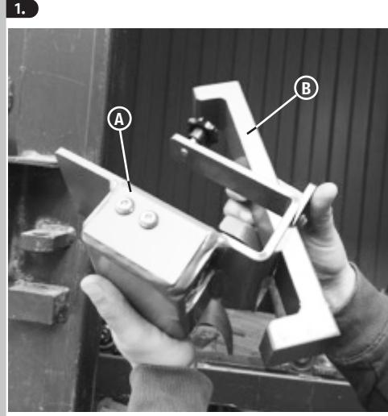
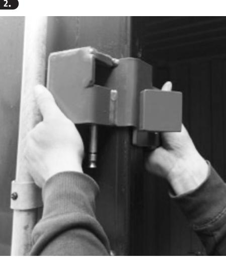
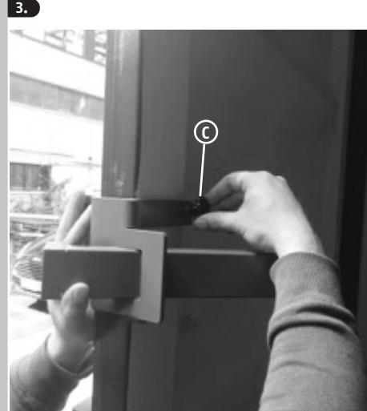
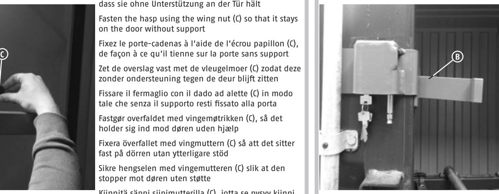
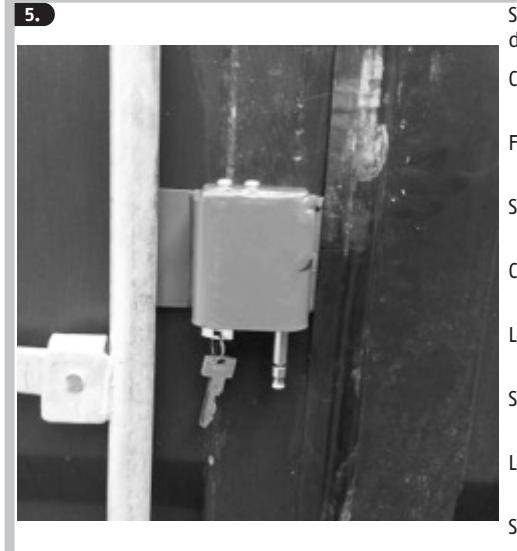
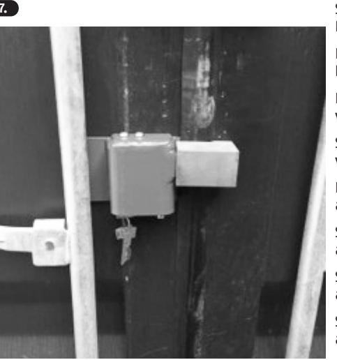
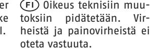

## **ConHasp 230**

Montage | Installation instructions | Instructions de montage | Montageaanwijzing | Istruzioni di montaggio | Montering | Montering | Installasjonsanvisninger | Asennus

Schieben Sie die Stange (B) durch die Öffnung auf der rechten Seite der Überfalle (A)

Slide the rod (B) through the opening on the right side of the hasp (A)

Faites glisser la barre (B) à travers l'ouverture située sur le côté droit du porte-cadenas (A)

Schuif de stang (B) door de opening aan de rechterzijde van de overslag (A)

Inserire la barra (B) all'interno dell'apertura sul lato destro del fermaglio (A)

Skyd stangen (B) gennem åbningen på højre side af overfaldet (A)

Skjut stången (B) genom öppningen på överfallets (A) högra sida

Skyv slåen (B) gjennom åpningen på høyre side av hengselen (A)

Työnnä tanko (B) säpin (A) oikealla puolella olevan aukon läpi

Schieben Sie die Überfalle über die linke Containertür. Der Schlosskasten muss nach außen zeigen

Slide the hasp over the left container door. The lock case must face outwards

Placez le porte-cadenas sur la porte gauche du conteneur. Le boîtier de serrure doit être tourné vers l'extérieur

Schuif de overslag over de linker containerdeur. De slotkast moet naar buiten wijzen

Inserire il fermaglio tramite la porta del container sinistro. La scatola della serratura deve rivolta verso l'esterno

Skyd overfaldet over venstre containerdør. Låsekassen skal pege udad

Skjut överfallet över vänster containerdörr. Låshuset måste peka utåt

Skyv hengselen over den venstre containerdøren. Låskassen skal peke utover

Työnnä säppi kontin vasemman oven yli. Lukon kuoren on osoitettava ulospäin

**3.** Fixieren Sie die Überfalle mit der Flügelmutter (C), so dass sie ohne Unterstützung an der Tür hält

> Fasten the hasp using the wing nut (C) so that it stays on the door without support

> Fixez le porte-cadenas à l'aide de l'écrou papillon (C), de façon à ce qu'il tienne sur la porte sans support

Zet de overslag vast met de vleugelmoer (C) zodat deze zonder ondersteuning tegen de deur blijft zitten

Fissare il fermaglio con il dado ad alette (C) in modo tale che senza il supporto resti fissato alla porta

Fastgør overfaldet med vingemøtrikken (C), så det holder sig ind mod døren uden hjælp

Fixera överfallet med vingmuttern (C) så att det sitter fast på dörren utan ytterligare stöd

Sikre hengselen med vingemutteren (C) slik at den stopper mot døren uten støtte

Kiinnitä säppi siipimutterilla (C), jotta se pysyy kiinni ovessa ilman tukea

**4.** Drücken Sie gegen die Stange und ziehen sie nach rechts, bis der Winkel an den Innenfalz der linken Tür anschlägt

> Press against the rod and pull it to the right until the bracket hits the inner fold of the left door

Appuyez sur la barre et tirez-la vers la droite jusqu'à ce que l'angle bute sur la feuillure intérieure de la porte gauche

Druk tegen de stang en trek deze naar rechts totdat de hoek tegen de sponning aan de binnenkant van de linker deur staat

Premere sulla barra e tirare verso destra finché l'angolo tocchi la scanalatura interna della porta di sinistra

Tryk ind mod stangen, og træk den mod højre, til vinklen støder mod den indvendige kant på venstre dør

Tryck på stången och dra åt höger tills vinkeln slår an mot vänsterdörrens innerfals

Trykk mot slåen og trekk den til høyre til vinkelen treffer den innvendige falsen i venstre dør

Paina tankoa ja vedä oikealle, kunnes kulma osuu vasemman oven sisätaitteeseen

**5.** Schließen Sie die Tür des Containers und verriegeln Sie diesen Close the door of the container and lock it

Fermez la porte du conteneur et verrouillez-la

Sluit de deur van de container en vergrendel deze

Chiudere la porta del container e bloccarlo

Luk containerens dør, og lås den

Stäng containerdörren och lås den

Lukk døren til containeren og lås den

Sulje kontin ovi ja lukitse se

**7.** Schieben Sie den Bügel zurück in den Schlosskörper. Der Bügel verriegelt automatisch. Ziehen Sie den Schlüssel ab

> Push the shackle back into the lock body. The shackle locks automatically. Remove the key

Replacez l'anse dans le corps de cadenas. L'anse se verrouille automatiquement. Retirez la clé

Schuif de beugel terug in het slotlichaam. De beugel vergrendelt automatisch. Trek de sleutel eruit

Inserire nuovamente l'arco nel corpo. L'arco di blocca automaticamente. Rimuovere la chiave

Skyd bøjlen tilbage ind i selve låsen. Bøjlen låser automatisk. Tag nøglen ud

Skjut tillbaka bygeln i låskroppen. Bygeln låser automatiskt. Dra ut nyckeln

Skyv bøylen tilbake i låskassen. Bøylen låses automatisk. Trekk ut nøkkelen

andre former for fejl.

Työnnä sanka takaisin lukon runkoon. Sanka lukittuu automaattisesti. Vedä avain pois lukosta

 Technische Änderungen vorbehalten. Für Druckfehler und Irrtümer keine Haftung.

 Subject to technical alterations. No liability for mistakes and printing errors.

 Technische wijzigingen voorbehouden. Geen aansprakelijkheid voor vergissingen en drukfouten. Ci si riservano modifiche tecniche. Per errori e refusi di stampa non ci si assume alcuna responsabilità.

 Nous nous réservons le droit de toutes modifications techniques. Nous n'assumons aucune responsabilité pour des erreurs ou défauts d'impression éventuels.

 Ret til tekniske ændringer forbeholdes. Der hæftes ikke for trykfejl eller

 Tekniska ändringar är förbehållna. För tryckfel och misstag tas inget ansvar. Tekniske endringer forbeholdes. Vi tar ikke ansvar for feil og trykkfeil.

**6.** Führen Sie den Verschlussbolzen (D) ein Insert the locking bolt (D) Insérez le boulon d'obturation (D) Plaats de sluitpen (D) Inserire i bulloni di chiusura (D) Før låsestiften (D) ind För in låsbulten (D) Sett inn låsebolten (D) Vie lukituspultti (D) sisään **D**

## Bedienung | Operation | Utilisation | Bediening | Uso | Håndtering | Hantering | Bruk | Käyttö

Zum Öffnen des Containerschlosses führen Sie den Schlüssel auf der Unterseite ein und drehen ihn bis der Bügel herausspringt. Nun können Sie den Verschlussbolzen entnehmen und die Containertür öffnen

To open the container lock, insert the key on the underside and turn it until the shackle pops out. You can now remove the locking bolt and open the container door

Pour ouvrir le cadenas du conteneur, insérez la clé sur la face inférieure et tournez-la jusqu'à ce que l'anse se déverrouille. Vous pouvez maintenant retirer le boulon d'obturation et ouvrir la porte du conteneur

Om het containers slot te openen, plaatst u de sleutel aan de onderzijde en draait deze totdat de beugel eruit springt. Nu kunt u de sluitpen verwijderen en de containerdeur open

Per aprire la serratura per container, inserire la chiave sul lato inferiore e ruotarla finché l'arco salta fuori. È ora possibile rimuovere i bulloni di chiusura e aprire il container

For at åbne containerlåsen skal du føre nøglen ind på undersiden og dreje den, til bøjlen springer ud. Nu kan du tage låsestiften ud og åbne containerdøren

För att öppna containerlåset för du in nyckeln på undersidan och vrider tills bygeln kommer ut. Nu kan du ta bort låsbulten och öppna containerdörren

For å åpne containerlåsen setter du inn nøkkelen på undersiden og vrir den til bøylen hopper ut. Nå kan du ta ut låsebolten og åpne containerdøren

Avaa kontin lukko viemällä avain alapuolelta sisään ja kääntämällä, kunnes sanka pomppaa ulos. Nyt voit poistaa lukituspultin ja avata kontin oven

© ABUS 2019 | ABUS August Bremicker Söhne KG | D 58292 Wetter | Germany | Tel.: +49 (0) 23 35 63 40 | |

T390616 | V1 | E19