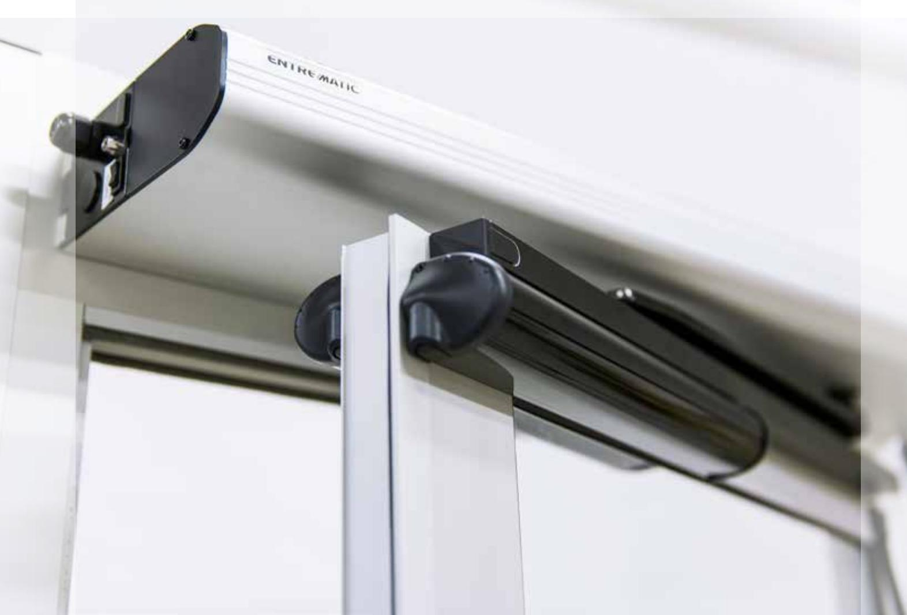
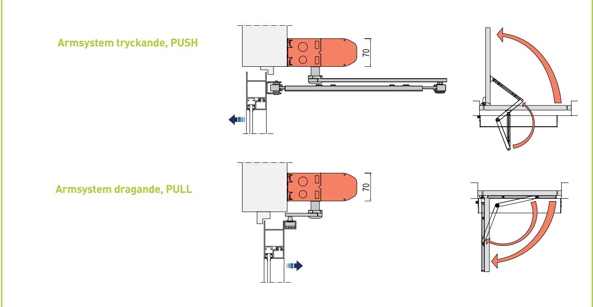
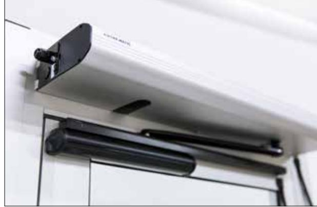
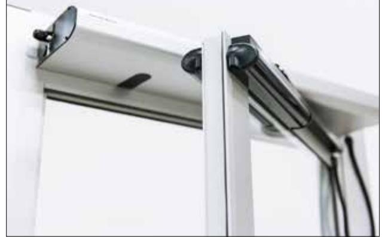

### EM PSW250 Slagdörrsöppnare

www.ementrematic.com

# Tyst, kompakt och kraftfull – EM PSW250

**EM PSW250 är en av de mest kraftfulla, säkra och flexibla dörröppnarna på marknaden. Slimmad design, låg ljudnivå, hög prestanda och ett brett sortiment av tillbehör som ger bekvämlighet, trygghet och säkerhet gör EM PSW250 till det idealiska valet för de flesta tillämpningar, t.ex. inom sjukvård, handel och i offentliga byggnader.**

#### Tilltalande design och hög prestanda

EM PSW250:s kompakta design med 70 mm höjd möjliggör en tilltalande lösning när monteringsutrymmet är begränsat, eller när det finns estetiska krav på dörrsystemet. Trots dörröppnarens smidiga dimensioner har den kompromisslös prestanda. EM PSW250 kan driva tunga dörrar på upp till 250 kg och säkerställer korrekt funktionalitet oavsett lufttryckskillnader eller tuffa väderförhållanden t.ex. hårda vindtryck.

#### Bekvämlighet för alla typer av användare och tillämpningar

EM PSW250 har konstruerats för att möta de högsta krav på tillförlitlighet och tyst drift och garanterar effektiv och bekväm användning av automatiska entréer under lång tid. I händelse av strömavbrott kan EM PSW250 aktiveras via en batteribackup så att den fortsätter att fungera oberoende av ordinarie strömförsörjning. Smarta standardfunktioner som "Push and Go" och "Power Assist" gör att EM PSW250 enkelt kan öppnas även manuellt. Ett brett utbud av säkerhetssensorer, radar och andra impulsgivare möjliggör optimerade lösningar för dörrautomatiken oavsett tillämpning eller typ av användare.

#### Säkerhet och trygghet i världsklass

EM PSW250 uppfyller europeiska standarder, inklusive EN16005 och erbjuder ett brett utbud av intelligenta standardfunktioner som säkerställer en säker drift. Den valfria Low Energyinställningen begränsar hastigheten och kraften vid öppning och stängning. När ett hinder upptäcks under användning stoppar dörröppnaren och vänder åt andra hållet. EM PSW250 kan utrustas med övervakade säkerhetssensorer så att trygg passage garanteras även i Full Energy-läge. När säkerhetssensorerna känner av ett hinder under öppningsfasen, stoppas dörren. När ett hinder upptäcks under stängningsfasen, stoppas dörren och byter riktning. Om en övervakad sensor upptäcker ett fel, stoppas dörren automatiskt och går över till manuellt driftläge.

EM PSW250 är godkänd för branddörrar, både för enkeldörrar och med sin unika mekaniska samordningsenhet även för dubbeldörrar.

För att säkerställa en trygg och säker automatisk inpassering, levereras EM PSW250 med intelligenta funktioner för elektroniska lås. I Fail-Safe-läget låses dörren elektriskt. I händelse av strömavbrott, förblir dörren olåst och möjliggör säker manuell utpassering genom dörren. I Fail-Secure-läget låses dörren utan elektricitet. I händelse av strömavbrott, är dörren fortfarande låst och garanterar entréns säkerhet. Om något hindrar dörren från att låsas, återupprepar Lock-Retry-funktionen låsningscykeln tills dörren stängs och låses. För dubbeldörrar, förhindrar synkroniseringsfunktionen att dörrarna kommer i kläm och säkerställer korrekt stängning och låsning.

## Kostnadseffektivitet

#### Livslång kostnadseffektivitet

EM PSW250 är utformad med kostnadseffektivitet i åtanke. Den levereras i kompletta paket med alla nödvändiga komponenter i en låda och förenklar därigenom logistiken och sparar tid hela vägen från inköp till den slutliga installationen. Innovativa och installationsvänliga funktioner, som att sensorerna är försedda med kablar som enkelt ansluts med snabbkopplingar, är något som inte bara sparar tid utan också eliminerar risken för felmontering. Den intelligenta självlärande öppnings/stängningscykeln garanterar snabb och korrekt driftsättning av dörröppnaren. Efter monteringen är EM PSW250 lätt åtkomlig för service och underhåll.

#### Tillbehör

- Armsystem, PULL/PUSH
- Sensorer och impulsgivare
- Samordningsenhet för dubbeldörrar
- Batteribackup
- Programväljare

#### Myndighetsgodkännanden

EM PSW250 uppfyller följande krav: Användarsäkerhet (EN 16005) Brandmotstånd (EN 1634-1, DIN 18263-4)

#### **Tekniska specifikationer**

| Strömförsörjning:                          | 100–240 V AC +10/–15%, 50/60 Hz, huvudsäkring max. 10 A (bygginstallation)    |
|--------------------------------------------|-------------------------------------------------------------------------------|
| Strömförbrukning:                          | Max. 300 W                                                                    |
| Hjälpspänning:                             | 24 V DC max. 700 mA                                                           |
| Omgivningstemperatur:                      | –20 °C till 45 °C                                                             |
| Rekommenderad max. dörrvikt och dörrbredd: | Tröghet J = dörrvikt × (dörrbredd)2 /3 PUSH= 140 kgm2 PULL = 80 kgm2 |
| Öppnarens vikt inkl. kåpa                  | Ca 9 kg                                                                       |

### **Entrematic**

Box 669, SE 261 25 Landskrona Phone: +46 10 47 48 300 Fax: +46 418 201 15 info.em @entrematic.com www.ementrematic.com www.entrematic.com

