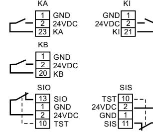
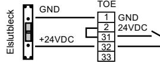
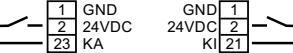
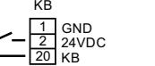
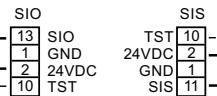
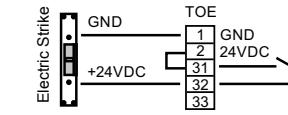
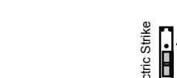
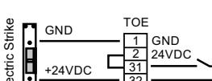

# **SVENSK**

| KA Aktivering utsida                                                          | TOE Se nästa sida för typ                                              |
|-------------------------------------------------------------------------------|------------------------------------------------------------------------|
| KI Aktivering insida                                                          | av lås                                                                 |
| KB Nyckelbrytar impuls                                                        | 1 = GND ut                                                             |
| SIS Säkerhet stängning KA- Utv. impuls (anslagssida) KI- Inv. impuls | 2 = +24VDC ut TOE- Lås. Se neste Max. 1.0A side for type lås. |
|                                                                               |                                                                        |

- KI- Inv. impuls KB- Nøkkelbryter SIS- Sikk. sensor (karmside) impuls SIO Säkerhet öppning (gångjärnssida)
SIO- Sikk. sensor stopp (hengselside)

1= GND ut. 2= +24VDC ut. Maks. belastn. 1.0A.

# **SVENSK**

| EMD-F - Programversion 4.1 |                                             |  |  |  |  |  |
|----------------------------|---------------------------------------------|--|--|--|--|--|
| Menu 1                     |                                             |  |  |  |  |  |
| uO + Bo                    | Öppningsfart + Acceleration                 |  |  |  |  |  |
| uC + BC                    | Stängningsfart + Acceleration               |  |  |  |  |  |
| S6                         | Stängningsfart manuell                      |  |  |  |  |  |
| SC                         | Elektriskt tillslag (AV=00)                 |  |  |  |  |  |
| oH                         | KI + KA öppethållandetid Pardörr (0…60 sek) |  |  |  |  |  |

- Or KI + KA öppethållandetid 1 dörrblad (0…60 sek)
- oS KB öppethållandetid Nyckelbrytare (0…60 sek)
- HO Öppethållandetid manuell passage
- CF Tillhållakraft stängt läge Rek. Min värde 02 tS Dörrstängningsläge använd 02 om dörr skall vara uppstäld med magnet/mekaniskt
- **Menu 2**
- S1 **SIS 00- ej använd** / 02 aktiv
- S3 **SIO 00- ej använd** / 02 aktiv
- tE **Test 00- ej använd /** 02 aktiv Test GND

#### **Menu 3**

CP+LE Fabriksrecett + Ny inlärning HE Bromskraft vid aktiverad sensor SIO

#### **Menu 4**

- dr **01-ny drivenhet (from 2013)** 00- gammal drivenhet (fram till 2013)
#### EF **00-1 dörrblad**

01-pardörr aktivt dörr (GF) 02-pardörr passiv dörr (SF) 03-pardörr aktiv örr med IS (SF+IS)

- HT **01-Glidskena gångjärnssida** 03- Glidskena anslagssida 04-Standard arm anslagssida
- to **01-Elslutbleck Rättvänt** 02-Elslutbleck omvänt 04- Samma som 01 + tilltryck innan öppning 05-Samma som 02 + tilltryck innan öppning
- SE Startläge servo Värde 03-09
- DF Stängningskraft efter manuell passage Rekomenderat min värde 25

# **ENGLISH** KA Activation outside

| KI Activation inside KA- Utv. impuls KB Activation Key switch KI- Inv. impuls KB- Nøkkelbryter impuls SIS Safetys closing SIS- Sikk. sensor SIO Safety opening (karmside) SIO- Sikk. sensor stopp | for type of lock. TOE- Lås. Se neste 1 = GND out side for type lås. 2 = +24VDC out Max. 1.0A 1= GND ut. 2= +24VDC ut. Maks. belastn. 1.0A. |  |
|---------------------------------------------------------------------------------------------------------------------------------------------------------------------------------------------------------------------------------|--------------------------------------------------------------------------------------------------------------------------------------------------------------------|--|
| (hengselside) KA                                                                                                                                                                                                             | KI                                                                                                                                                                 |  |

TOE Lock. See next page

# **EMD-F - Software ver. 4.1**

#### **Menu 1**

- uO + Bo Opening speed + Acceleration
- uC + BC Closing speed + Acceleration
- S6 Closing speed manuel
- SC Elektric latch function (OFF=00)
- oH KI + KA holdopen time 2-leaf door (0…60 sec.)
- Or KI + KA Holdopen time 1-leaf door (0…60 sec.)
- oS KB Holdopen time Keyswitch (0…60 sec.)
- HO Holdopen time manuel use (0…60 sec.)
- CF Pressure in closed possition
- tS Dorrclosing mode

### **Menu 2**

- S1 **SIS 00- not in use/** 02 in use
- S3 **SIO 00- not in use/** 02- in use
- tE **Test 00- Test not in use/** 02- Test GND

#### **Menu 3**

CP+LE Reset to Factory settings + New Learning HE Braking force at activated sensor SIO

#### **Menu 4**

dr **01- new drive unit (from 2013)** 00- old drive unit (until 2013)

- EF **00- 1 leaf door** 01- 2-leaf, active leaf (GF) 02- 2-leaf, passive/ fixed leaf (SF) 03- 2-leaf, active leaf w/ IS (SF+IS)
- HT **01- Guiderail hingeside** 03- Guiderail opposite hingeside 04- Link arm opposite hingeside
- to **01- Electric strike working current** 02- Electric strike closed current 04- Same as 01 + with close pressure 05- Same as 02 + with close pressure
- SE Start range for servo support. Value 03-09.
- DF Closing force after manual passage. Recommended min. value 25

# **ENGLISH VIKTIGT: Avseende Brandlarm**

- GND måste anslutas 61 och +24 v DC måste anslutas till 63, om det inte finns någon Brandlarm måste det vara en slinga från 61 till 1 och 63 till 2
# **VIKTIGT: När du kör in med DPS**

**1:** Anslutningarna 61 och 63 och SIO och SIS måste anslutas enligt ovanstående

- **2:** Dörren måste vara stängd och anslut 230 v
- **3:** Vänta tills det finns `LE` på DPS och tryck sedan på" drive-in "och dörren börjar öppna långsamt
- **4:** Om det inte finns något dörrstopp (vilket det bör vara) stoppas dörren vid önskad öppningsvinkel
- **5:** DPS visar L1 till L4 under inlärning, och dörröppnaren har lärt in när det står `Au`
- **6:** Automatiken är nu klar för användning med alla standardvärden, du kan nu ändra de aktuella parametrarna (se avsnittet för programmering)

# **IMPORTANT: Regarding fire alarm**

GND must be connected to 61 and +24 v DC must be connected to 63, if there is no fire alarm there must be a loop from 61 to 1 and 63 to 2.

## **IMPORTANT: When entering DPS**

**1:** Connections 61 and 63 and SIO and SIS must be connected as described above

- **2:** The door must be closed and connect to 230 v
**3:** Wait until the DPS shows `LE`, then press" drive-in "and the door will open slowly

**4:** If there is no door stop (which is recommended), the door will stop at the desired opening angle

**5:** DPS shows L1 to L4 during comisioning and the door opener is ready when it says `Au`

**6:** The drive is now ready for use with all default values, you can now change the current parameters (see section for programming)

10 TST

20

**English version**

www.geze.se

**GEZE Sverige** Mallslingan 10 **|** 18766 Täby, Sverige **TEL.** +46 (0) 8 732 34 00 **EMAIL** sverige.se@geze.com

# **QUICK GUIDE**

Slimdrive EMD-F

**Svensk version** Slimdrive EMD-F

