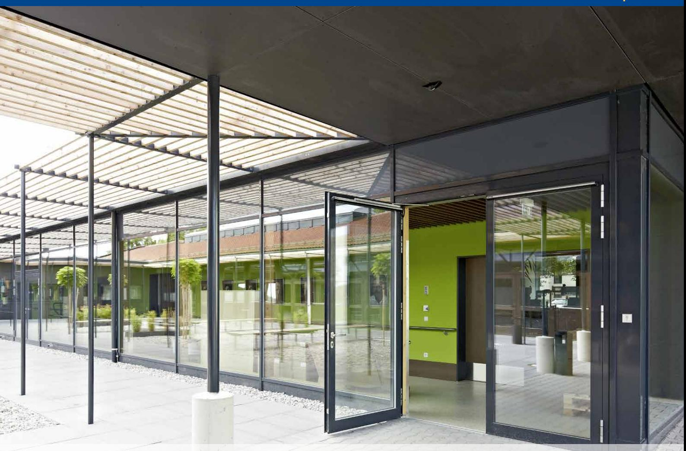

# GEZE Slimdrive EMD- F Slagdörrsa u t o m a t i k

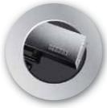

**DØRTEKNIK AUTOMATISKE** 

**Dörrteknik Automatiska**

Dørteknik

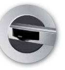

**DØRSYSTEMER**

**dörrsystem**

Dørsystemer

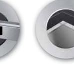

logoer 1 09/03/10 14.29

**Glassystemer**

> Røgventilation

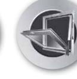

Sikkerhedsteknik

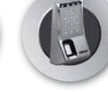

Glassystemer

**VENTILATION OG RØGVENTILATION Komfort- och rökventilation**

**GLASSYSTEMER SIKKERHEDSTEKNIK Glassystem Säkerhetsteknik**

Bewegu ng mit System

Automatiska

dörrsystem

| GEZE Slimdrive EMD-F       | Slimdrive EMD på 7cm. EMD‑ marknaden ställer på en dörrautomatik.                                                                                                                                                                                                                                                                                                                                                                                                                                                                                        | -F, GEZE's slagdörrsautomatik, ingår i produktlinjen där all automatik har en inbyggnadshöjd All funktionalitet som en modern dörrautomatik kräver, koncentreras på 7cm inbyggnadshöjd. Detta möjliggör att automatiken praktiskt taget osynligt kan integreras i alla fasad- och ramkonstruktion. Slimdrive F erbjuder egenskaper som kompromisslös säkerhet och komfort, omfattande inställningsmöjligheter och en funktion som präglas av stor tillförlitlighet. Slimdrive EMD -F uppfyller alla normer och krav som |  |
|----------------------------|-------------------------------------------------------------------------------------------------------------------------------------------------------------------------------------------------------------------------------------------------------------------------------------------------------------------------------------------------------------------------------------------------------------------------------------------------------------------------------------------------------------------------------------------------------------------|----------------------------------------------------------------------------------------------------------------------------------------------------------------------------------------------------------------------------------------------------------------------------------------------------------------------------------------------------------------------------------------------------------------------------------------------------------------------------------------------------------------------------------------|--|
| Användningsområde:         | som passar just din dörrmiljö. j För invändiga och utvändiga slagdörrar j För både höger- och vänsterhängd dörr                                                                                                                                                                                                                                                                                                                                                                                                                                             | Innovation, design och funktion är krav vi ställer på alla våra automatiker. Det finns alltid en GEZE produkt j För montage på gångjärn- eller anslagssida j För montage på dörrblad eller karm                                                                                                                                                                                                                                                                                                                                  |  |
| Produktege nskape r: | j Stilren design j Extremt tyst vid aktivering j Justerbar stängningskraft, storlek 3-6 j Justerbar stängningshastighet via elektronik j Justerbar öppningsbroms via elektronik j Justerbar tillslagskraft via elektronik j Justerbar tillslagskraft på slutbleck vid aktivering via elektronik j Justerbar aktiveringsfördröjning via elektronik, 0-20 sekunder j Justerbar öppethållandetid via elektronik, 0-60 sekunder j Justerbar öppningsvinkel upp till 110° j Självlärande mikroprocessor j Push & go funktion | j Kan monteras på dörr eller karm på upp till 1400 mm dörrbladsbredd j Dörrbladsvikt max 230 kg j Dörrstängarfunktion i strömlöst läge j Inbyggnadsmått 70 x 120 mm j Driftspänning 230 V AC j Strömförsörjning för extern utrustning 24 V DC, 1 000 mA j Förberedd för alla typer av förekommande motorlås, elslutbleck m. fl j Tryckande och dragande utförande j Standardkulör är silver, brun och vitlackerad RAL 9016 j Specialkulör enligt RAL eller NCS skala                            |  |

| Beteckning                                              | Utförande |
|---------------------------------------------------------|-----------|
| EMD -F automatik                                     |           |
| EMD -F kåpa                                          | Silver    |
| EMD -F montageplatta                                 | Silver    |
| EMD -F glidskena 710 mm f/ karmmontage               | Silver    |
| EMD -F glidskena 760 mm f/dörrbladsmontage - vänster | Silver    |
| EMD -F glidskena 760 mm f/dörrbladsmontage - höger   | Silver    |
| EMD -F arm (tryckande) 0-100 mm                   | Silver    |
| EMD -F arm (tryckande) 100-200 mm                    | Silver    |
| EMD -F arm (tryckande) 200-300 mm                    | Silver    |
| EMD -F arm (tryckande) 300-400 mm                    | Silver    |

### **Måttangivelser EMD-F**

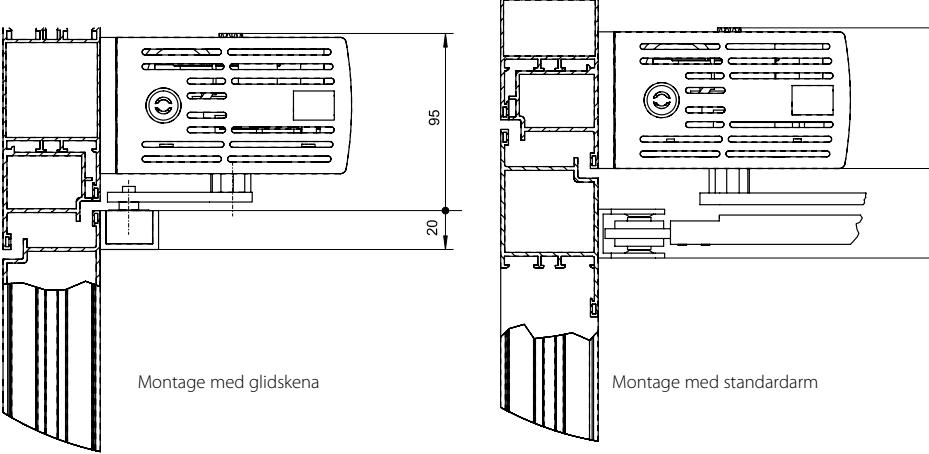

### **Montagemöjligheter med EMD-F**

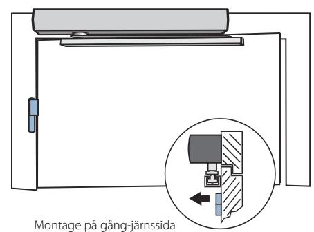

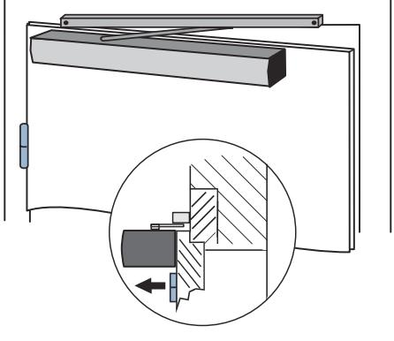

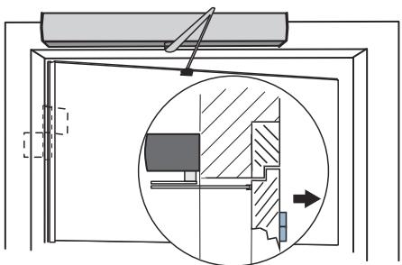

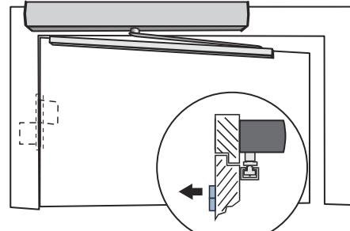

Montage på anslagssida

### **Tillbehör:**

- j Montageplatta till hus och arm
- j Radar
- j Dragsnöre
- j Låsbar manöverpanel
- j Mekanisk positionsomkopplare
- j Nyckelbrytare
- j Säkerhetsfotocell
- j Fjärrstyrning
- j Rökdetektor

Februari 2011 - rätt till ändringar förbehålles

### **Slimdrive EMD varianter:**

- j Slimdrive EMD-F IS elektromekanisk slagdörrsautomatik med integrerad koordination
- j Slimdrive EMD Invers elektromekanisk slagdörrsautomatik, med möjlighet till mekanisk öppning i samband med larmimpuls

## **OM GEZE**

GEZE Scandinavia AB är ett helägt dotterbolag till GEZE GmbH. GEZE är en världsledande tillverkare av manuella och automatiska dörr- och fönsterteknologisystem med dotterbolag och produktion runt om i världen. Sedan starten 1863 har design, funktion och innovation varit det centrala i GEZE´s filosofi. För marknaden betyder det den senaste tekniken, kvalitet, funktionalitet och formskön design.

Vi arbetar i nära samarbete med marknadens aktörer, tillsammans utvecklar vi lösningar som förvandlar ambitiösa visioner till verklighet.

#### **GEZE Scandinavia**

**GEZE Sverige**

Mallslingan 10 Box 7060 S-187 11 Täby Tel. +46 (0) 8-732 34 00 Fax +46 (0) 8-732 34 99 E-mail: sverige.se@geze.com www.geze.se

### **GEZE Danmark**

Mårkærvej 13 J-K DK-2630 Taastrup Tel. +45 46 32 33 24 Fax +45 46 32 33 26 E-mail: danmark.se@geze.com www.geze.dk

### **GEZE Norge**

Industrivegen 34B NO-2072 Dal Tel. +47 63 95 72 00 Fax +47 63 95 71 73 E-mail: norge.se@geze.com www.geze.no

### Bewegu ng mit System