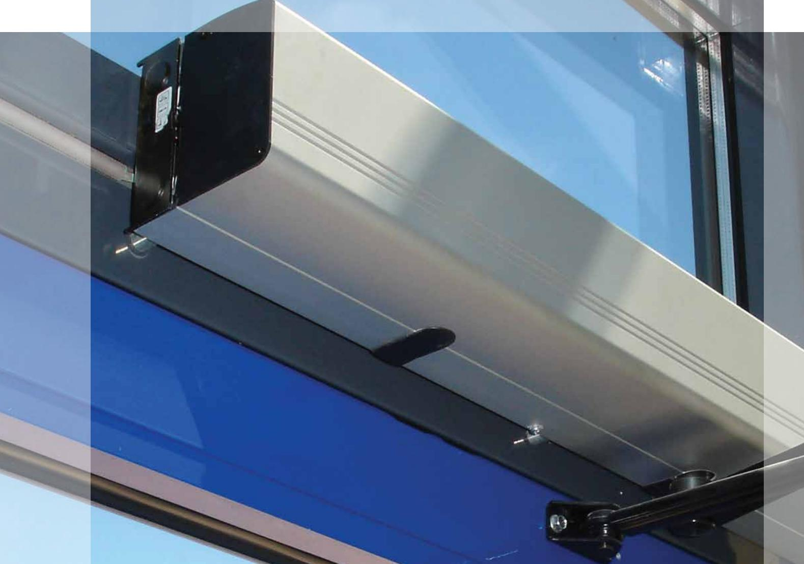
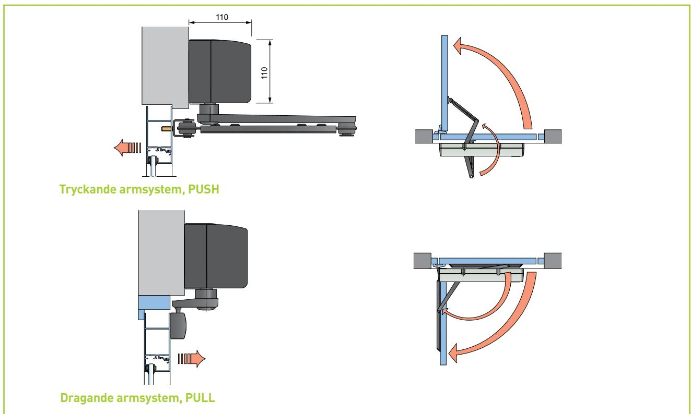
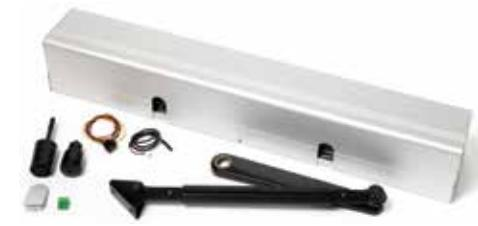
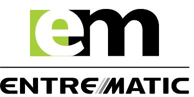

### EM EMSW Slagdörrsöppnare

www.ementrematic.com

# Den mångsidigaste och mest pålitliga slagdörröppnaren

**EM Entrematic EMSW är en elektrohydraulisk dörröppnare utformad att vara mångsidig och passar till nästan alla typer av slagdörrar, både inom- och utomhus. Öppnaren kan monteras på var sida av dörren för drag- eller tryckfunktion och finns för enkel- respektive dubbeldörrar med kantgångjärn eller svängtappar.**

**Vid utbyte kan EMSW tas direkt från kartongen och vara i drift på ett par minuter. Med lite träning kan serviceteknikerna ombesörja det och er valda dörrleverantör installera den. Det som kännetecknar EMSW är pålitlighet och den tekniska kunskap som finns bakom dörröppnaren gör att den kan monteras nästan var som helst och fungerar under en lång rad förhållanden.** 

**EMSW passar lika bra för handikappentréer, vårdhem och sjukhuskorridorer – där man ställer höga krav på flexibel och pålitlig funktion – som på varuhus, banker, hotell etc. med tät trafik och svåra driftsförhållanden.**

#### Säkerhet i världsklass, godkänd för branddörrar

EMSW erbjuder hög säkerhet. Dörröppnaren kan kombineras med ett stort utbud av EM Entrematic säkerhetsgivare, som förebygger att någon kläms i dörren när den öppnas eller stängs eller att den slår i andra hinder. Den är certifierad och godkänd som dörröppnare till branddörrar av både svenska och tyska myndigheter. Vid strömavbrott fungerar EMSW som dörrstängare.

#### Enkel installation i krävande miljöer

Det är enkelt att installera enheten och EM Entrematic erbjuder återförsäljarna regelbunden utbildning för att säkerställa installationskvaliteten. Hög belastning och krävande miljöer, som t.ex. skolor eller akutmottagningar har glädje av EMSW. Den tåliga designen klarar hård behandling.

#### Styrka

EMSW är en av de starkaste slagdörrsöppnarna på marknaden och klarar dörrar upp till 250 kg med en bredd på 1 600 mm.

#### Branddörrar

EMSW är brandklassad och godkänd för branddörrsinstallation av svenska och tyska myndigheter.

## Modeller

- EMSW för enkeldörrar en drivenhet och en styrenhet monterad under en standardkåpa.
- EMSW-Special för enkeldörrar en drivenhet och en styrenhet monterad under en extra lång kåpa.
- EMSW-2 för dubbeldörrar två drivenheter med styrenhet och slavstyrenhet monterad under en extra lång kåpa för parallell drift av två dörrar.

#### Armsystem

- PUSH Tryckande armsystem avsett för brandklassade dörrar där öppnaren sitter monterad på väggen mittemot dörrens svängning. Dörrens öppningsvinkel justerbar upp till 120°.
- DRAG Dragarmsystem när öppnaren har installerats på väggen på samma sida som dörrens svängning. Dörrens öppningsvinkel justerbar upp till 120°.
- Axelförlängaren Gör att öppnaren kan monteras högre upp på väggen eller armen längre ned på dörrbladet.

#### Konstruktion

Den kompakta EM Entrematic EMSW levereras för olika dörrar och kundbehov. Öppnaren är elektrohydraulisk. Den öppnar med motorn och stänger med fjäder. Öppnings- och stängningshastigheten kan varieras individuellt. Motor, oljepump och hydraulenhet har samlats i en kompakt modul som sitter monterad bredvid kontrollenheten i kåpan.

Öppnaren är kopplad till dörrbladet via ett tryck- eller dragarmsystem.

#### Standardutrustning

- Kåpa av natureloxerad aluminium.
- Styrenhet med möjlighet att ansluta manuella och automatiska impulsgivare, programväljare och elektriska låsbleck.
- Teleskopisk armförlängare
- Axelförlängare
- Svart SAS-F PUSH/PULL armsystem

#### Tillbehör

- Koordinatorenheten COOA ser till att falsade dörrar stänger i rätt ordning.
- EM Entrematics sortiment av manuella och automatiska impulsgivare.
- Impuls- och närvarodetektorer.
- Armstopp.

#### Godkännanden

EMSW uppfyller följande bestämmelser: DIBT Z-6.5-1706 GOST R POCC SE ME 01.B 06026 SITAC 0135/05 SITAC 0136/05 TÜV B 07 07 58029 004

#### **Tekniska specifikationer**

| Strömförsörjning:           | 230 V AC, 50 Hz                    |
|-----------------------------|------------------------------------|
|                             |                                    |
| Effektförbrukning:          | max 230 W                          |
|                             |                                    |
| Manöverspänning:            | 24 V DC                            |
|                             |                                    |
| Öppnarens vikt:             | 11,5 kg                            |
|                             |                                    |
| Rekommenderad max dörrvikt: | 250 kg för 1 600 mm dörrbladsbredd |
|                             |                                    |
| Temperaturområde:           | -15 °C till +30 °C                 |
|                             |                                    |

**Entrematic** Box 669, SE 261 25 Landskrona

Phone: +46 10 47 48 300 Fax: +46 418 201 15 info.em @entrematic.com www.ementrematic.com www.entrematic.com

