# PUCK-1

### **ANTENNAS |** PUCK-1

## SISO LTE TRANSPORTATION & IOT/M2M ANTENNA SISO LTE

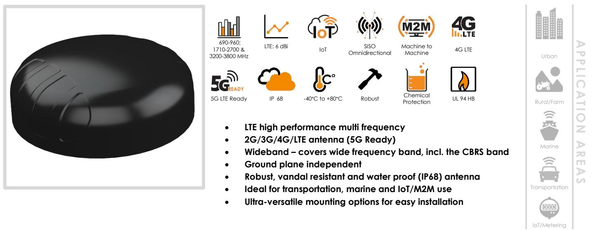

### **Product Overview**

Poynting's new PUCK range offers a small profile antenna for use in the IoT/M2M, Smart Meter, Smart Utilities, Transportation, Marine and the Agricultural/Farming markets. The PUCK (for 2G/3G/4G) covers the 690MHz to 3800MHz band, this includes the most popular international LTE bands. The PUCK exceeds the performance of many competitors due to the attention to design of this high-performance antenna. The radiation patterns of all radiating elements provide an excellent balance between omnidirectionality, pattern diversity and good radiation abilities at the desired elevation, which is often overlooked in such a small size antenna. Despite its small size, this antenna provides excellent performance especially at the higher frequency bands, where performance is critical for LTE throughput and connection stability.

### **Features**

- Small & Low-Profile (100mm x h 36mm)
- Careful mechanical design provides ruggedness, corrosion, water, dust resistance (IP68)
- Fire Resistant (complies with ECE-R 118.02)
- UV Stable Enclosure
- Ground plane independent performs consistently with and without a ground plane
- 5G Ready; includes 3.2GHz to 3.8GHz CBRS Band
- Easy installation; multi implementation options (as standard)
	- Spigot Mount
	- Magnetic Mount
	- Adhesive Tape Mount
	- Bracket Mount

### **Application Areas**

- Smart Utilities: Smart Power, Gas & Water Metering
- Smart Buildings: Climate control, access control, security, irrigation
- Digital Signage
- Warehouses & Logistic systems
- Industrial factory automation, robotic machinery and other M2M systems
- Transport (Busses, Utility & Public Safety)
- Mining Vehicles & Machinery communications, telemetry and automation (M2M & IoT)
- Agricultural machinery
- Marine: small boats, yachts near to coastlines or inner waters.

### **Frequency Bands – Cellular & Wi-Fi**

The PUCK-1 is suitable for the following Cellular frequency bands| 690-960 MHz | 1710-2170 MHz|2300-2500 MHz|2500-2700 MHz|3200-3800 MHz| and the following Wi-Fi frequency bands |2400-2500 MHz|

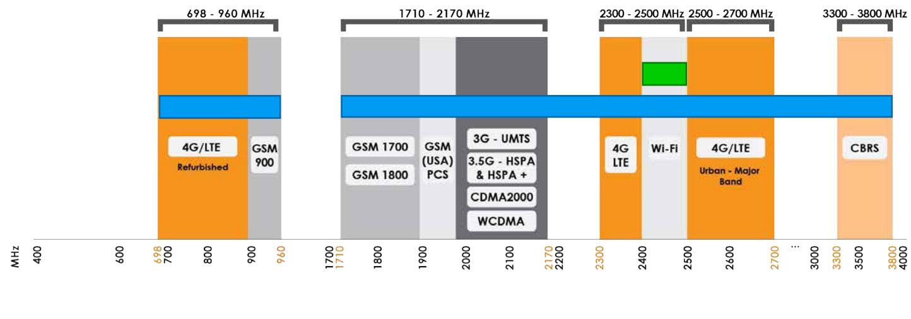

### LTE (4G, 3G, 2G) Band Wi-Fi

### **Antenna Overview**

| Ports             | 1                  |
|-------------------|--------------------|
| MIMO              | SISO               |
| Frequency Bands   | 690 MHz - 3800 MHz |
| Peak Gain         | 6 dBi              |
| Coax Cable Type   | RTK-031            |
| Coax Cable Length | 2m                 |
| Connector Type    | SMA Male           |

### **Electrical Specifications - Cellular**

|                                                                  | Ø20 Threaded Spigots (Up to 60mm                                                           |  |
|------------------------------------------------------------------|--------------------------------------------------------------------------------------------|--|
| Product Box Contents Antenna:                                 | A-PUCK-0001-V1-01                                                                          |  |
| *The coax cables & connectors are factory mounted to the antenna |                                                                                            |  |
| Connector type:                                                  | SMA (Male)                                                                                 |  |
| Coax cable type:                                                 | RTK-031                                                                                    |  |
| Cable length:                                                    | 2m ±5%                                                                                     |  |
| Coax Cable & Connector Type -Cellular                            |                                                                                            |  |
| DC Short:                                                        | Yes                                                                                        |  |
| Coax cable loss:                                                 | 0.45 dB/m @ 900 MHz 0.71 dB/m @ 2000 MHz 0.79 dB/m @ 2500 MHz 0.9 dB/m @ 3000 MHz |  |
| Polarisation:                                                    | Linear Vertical                                                                            |  |
| Input impedance:                                                 | 50 Ohm (nominal)                                                                           |  |
| Feed power handling:                                             | 10 W                                                                                       |  |
| VSWR:                                                            | ≤2.5:1 over 85% of the band                                                                |  |
| Gain (max):                                                      | 6 dBi                                                                                      |  |
| Frequency bands:                                                 | 690-960 MHz 1710-2700 MHz 3200-3800 MHz                                              |  |

### **Ordering Information**

**Mounting bracket:**

| Commercial name:    | PUCK-1            |
|---------------------|-------------------|
| Order product code: | A-PUCK-0001-V1-01 |
| EAN number:         | 6009880915262     |

clamping thickness), Adhesive Surface

Mounting & Magnetic Mount

### **Mechanical Specifications**

| Product dimensions   | Ø99.3 mm x 36 mm                                               |
|----------------------|----------------------------------------------------------------|
| Packaged dimensions: | 150 mm x 150mm x 120mm                                         |
| Weight:              | 0.312kg                                                        |
| Packaged weight:     | 0.443kg                                                        |
| Radome material:     | PC+ABS (Halogen free)                                          |
| Radome colour:       | Pantone Black                                                  |
| Mounting Type:       | Ø20 Threaded Spigot, Pole, Wall, Surface and Magnetic mount |

### **Environmental Specifications, Certification & Approvals**

| Wind Survival:                              | <220 km/h                                                              |
|---------------------------------------------|------------------------------------------------------------------------|
| Temperature Range (Operating):           | -40°C to +80°C                                                         |
| Environmental Conditions:                   | Outdoor/Indoor                                                         |
| Water ingress protection ratio/standard: | IP 68                                                                  |
| Salt Spray:                                 | MIL-STD 810F/ASTM B117                                                 |
| Operating Relative Humidity:                | Up to 98%                                                              |
| Storage Humidity:                           | 5% to 95% - non-condensing                                             |
| Storage Temperature:                        | -40°C to +80°C                                                         |
| Flammability Rating:                        | UL 94-HB, ECE-R118.02 Certified cables                                 |
| Impact resistance:                          | IK 10                                                                  |
| Product Safety & Environmental:          | Complies with CE, EN, CSA, RoHS and IEC standards, E-mark certified |
|                                             |                                                                        |

### **Technical Drawings**

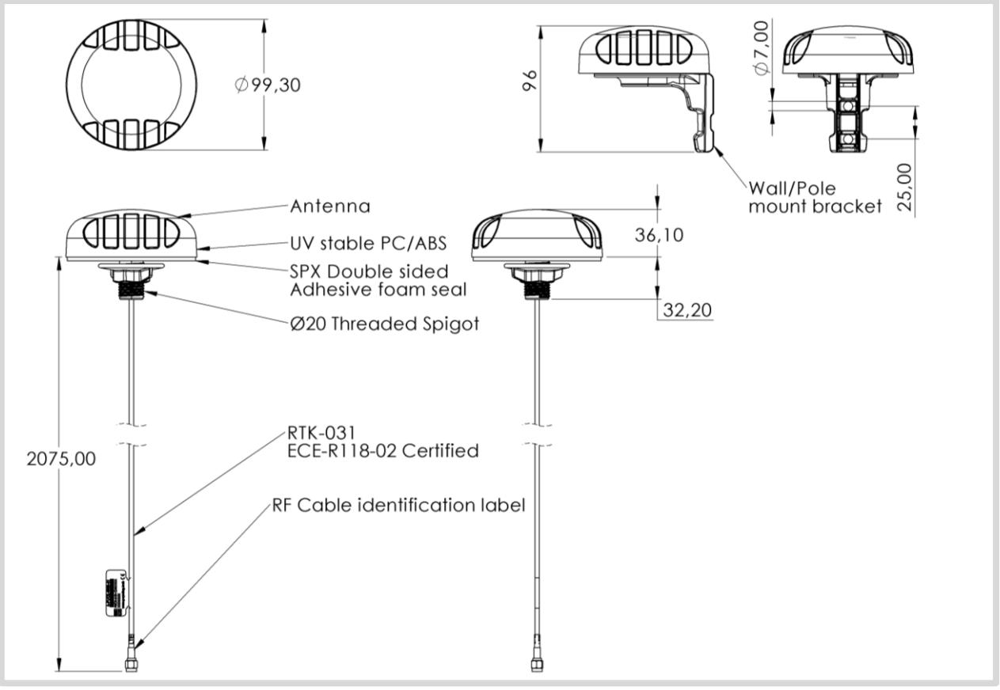

### **Antenna Performance Plots**

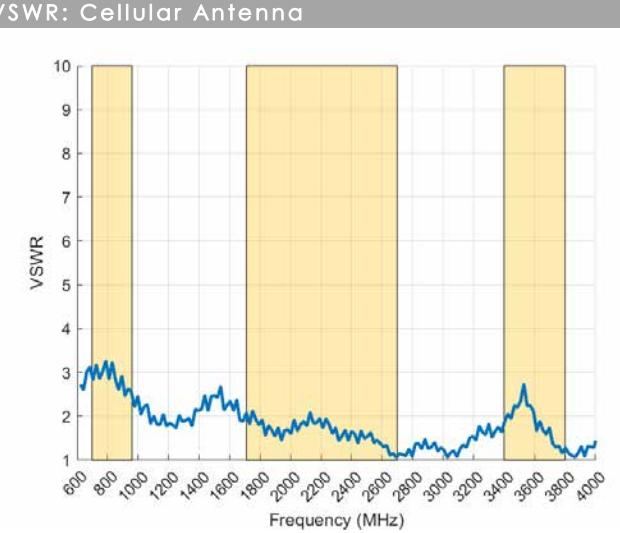

### **Voltage Standing Wave Ratio (VSWR)***

VSWR is a measure of how efficiently radio-frequency power is transmitted from a power source, through a transmission line, into a load. In an ideal system, 100% of the energy is transmitted which corresponds to a VSWR of 1:1.

The PUCK-1 delivers superior performance across all bands with a VSWR of ≤2.5:1 over 85% of the band

*Measured with 2m low loss cable

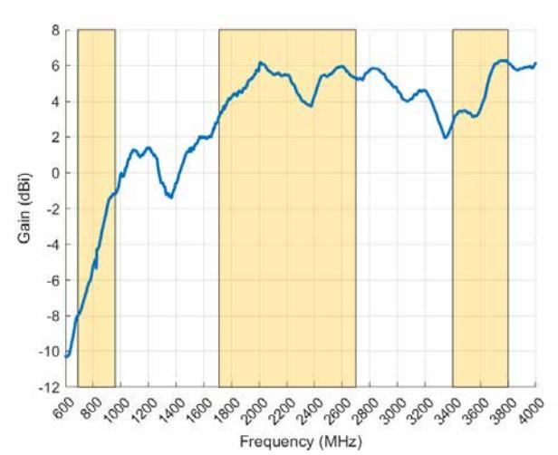

### **Gain in dBi**

6 dBi is the peak gain across all bands from 690-960, 1710-2700 & 3400-3800 MHz

Peak Gain @ different bands: -1 dBi @690-960MHz Peak Gain @ different bands: 6.0 dBi @ 1710-2700MHz Peak Gain @ different bands: 6.0 dBi @3400-3800MHz

### **Radiation Patterns – Cellular**

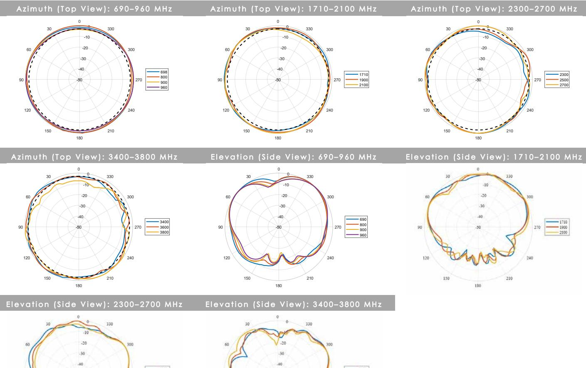

**PUCK-1 ©2019 Poynting Antennas (Pty) Ltd**. All rights reserved Product Specifications may change without prior notice2 **Revised:** January 2019

### **Mounting Options**

### **Many Mounting Possibilities – included as standard**

Poynting's new PUCK antenna range provides easy installation with the multiple mounting options. This includes as standard:

- Spigot Mount two different lengths included (40mm & 80mm)
- Vertical Pole mount (inner & outer mounting for smaller and larger poles)
- Horizontal Pole Mount (e.g. marine rails)
- Magnetic Mount
- Surface Mount (Double Sided Tape)
- Wall Mount

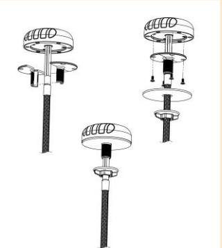

**Spigot Mount**

Removable 40mm & 80mm threaded spigot (included)

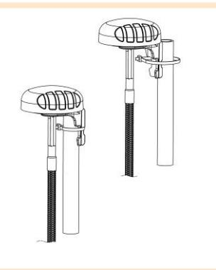

### **Vertical Pole Mount**

Pole/Wall Mounting bracket (included)

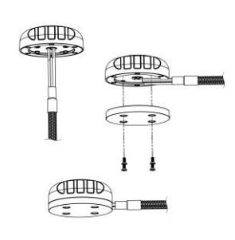

### **Magnetic Mount**

Magnetic Base (included)

For temporary and low mobility installations.

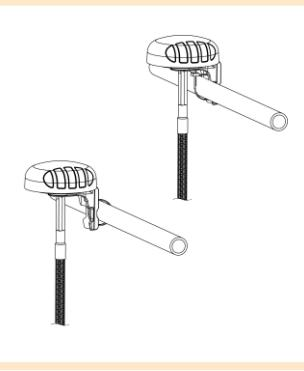

### **Horizontal Pole Mount**

Pole/Wall Mounting bracket (included)

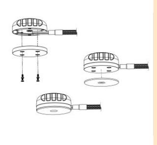

### **Surface Mount**

Adhesive Surface Mounting (included) or can also be directly secured with longer M4 bolts (not included) to the female threaded inserts located in the antenna base

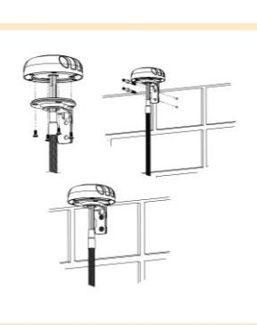

### **Wall Mount**

Pole/Wall Mounting bracket (included)

### **Additional Accessories**

See accessories technical specifications on www.poynting.tech

### **Contact Poynting**

### **Poynting Antennas (Pty) Ltd - Head Office**

Unit 4, N1 Industrial Park Landmarks Avenue, Samrand, 0157 South Africa **Phone:** +27 (0) 12 657 0050 **E-mail:** sales@poynting.co.za

### **Poynting Europe**

Regus Business Center Neue Messe Riem Kronstadter Straße 4 81677 München Germany **Phone:** +49 89 208026538 **E-mail:** sales-europe@poynting.tech