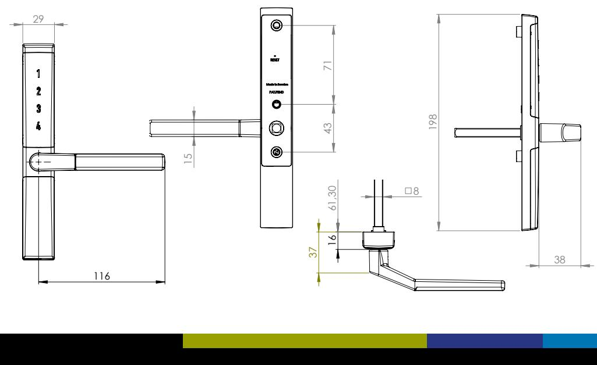

## **FALLKOLV VÄNSTERSVÄNGT DIGITALT HANDTAG Fallkolv vänstersvängt handtag för altandörr och fönster**

- Elektromekaniskt handtag för montering invändigt på altandörr/fönster.
- Dolt skruvmontage.
- Standardmått skruvmontage.
- Bakgrundsbelyst touch-knappsats, väcks upp när ett finger dras från 1-4.
- Visuell feedback vid kodinmatning.
- Låses upp via en sexsiffrig användarkod.
- Låses när ett finger dras från 1-4.
- Användarkoden finns kvar vid batteribyte/ spänningsbortfall.
- Användarkoden kan enkelt ändras.
- Drivs av två st 1,5V AAA alkaliska batterier vilka räcker ca två år vid normal användning (ingår ej).
- Varning vid låg batterispänning.
- Passar dörrar i de flesta karmar. Passar även dörrar med låga dorn och snäva öppningsradier. 29 Revision Note Appr. Date Appr. By

61,30

16

http://www.industrilas.com Project article No.

**+46 (0)10-130 75 00**

Date Scale Weight Material (se) Surface treatment HANDTAG E

Dok.nr.4.5-A4

37

- Fyrkantssprint 8×8 mm som standard – 7×7 mm sprint kan fås på beställning.
- Standardlängd på fyrkantssprinten är 60 mm – kan beställas i 43 mm och 110 mm.
- Blockeringsfunktion vid upprepad felslagen kod (fem gånger).
- Skydd mot kända manipulationsmetoder som t.ex. dyrkning, slag, vibration, tryckluft och magnetism.
- Tillverkat i mattkromaterad zink, rostfritt stål och nylon. 29
- Temperaturområde: 0-70 C.
- Uppfyller kraven på inbrottsskydd enligt SS3620:2017 klass B.
- Svensktillverkad produkt som är patentsökt.

71 43

198

15

38

71 43

15

71 43

Revision Note Appr. Date Appr. By

Revision Note Appr. Date Appr. By

http://www.industrilas.com Project article No.

**+46 (0)10-130 75 00**

Handle EMH, complete

Design

SS-ISO 2768-m

Article No. Revision Approved by Approved date Tolerances unless otherwise specified View orientation

2019-09-26 13:46:29

7404-04400-08060

Handtag EMH, komplett

AL 2019-05-24 0.0 g

1:2

Date Scale Weight Material (se) Surface treatment HANDTAG E

Concept Development

Design

Material (intl.)

Handle EMH, complete

Handtag EMH, komplett

AL 2019-05-24 0.0 g

Article No. Revision Approved by Approved date Tolerances unless otherwise specified View orientation

**+46 (0)10-130 75 00**

2019-09-26 13:46:29

http://www.industrilas.com Project article No.

Design

Date Scale Weight Material (se) Surface treatment HANDTAG E

Concept Development

Handle EMH, complete

Handtag EMH, komplett

AL 2019-05-24 0.0 g

1:2

Material (intl.)

Article No. Revision Approved by Approved date Tolerances unless otherwise specified View orientation

2019-09-26 13:46:29

Concept Development

Material (intl.)

Article No. Revision Approved by Approved date Tolerances unless otherwise specified View orientation

2019-09-26 13:46:29

7404-04400-08060

SS-ISO 2768-m

7404-04400-08060

SS-ISO 2768-m

http://www.industrilas.com Project article No.

**+46 (0)10-130 75 00**

Date Scale Weight Material (se) Surface treatment HANDTAG E

7404-04400-08060

SS-ISO 2768-m

1:2

## Revision Note Appr. Date Appr. By

**Bekvämt och enkelt. Skandinavisk design. Det är Vision Home.**

198

29

61,30

16

37

Dok.nr.4.5-A4

CAD-model: 00109095, applies unless otherwise stated.

116

8

**www.vision-home.se**

Dok.nr.4.5-A4

CAD-model: 00109095, applies unless otherwise stated.

61,30

16

8

Design

Dok.nr.4.5-A4

Handle EMH, complete

Handtag EMH, komplett

AL 2019-05-24 0.0 g

1:2

CAD-model: 00109095, applies unless otherwise stated.

37

8

Concept Development

Material (intl.)