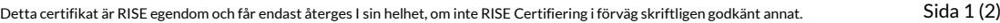

# Intyg om kontinuitet av byggproduktens prestanda 0402-CPR-C500043

**I enlighet med** *Europaparlamentets och rådets förordning (EU) Nr 305/2011 av den 9 mars 2011* **(Byggproduktförordningen eller CPR), omfattar detta intyg byggprodukten**

# **Elektromekaniskt manövrerade lås och slutbleck**

för användning i brand- och rökavskiljande dörrar tillsammans med dörrstängare för säkerställande av att dörren stänger i händelse av brand. För användning i låsta branddörrar med bibehållen täthets avseende brand för dörren, med specifikation och prestanda som anges på sida 2 i detta certifikat.

### **Produktnamn: STEP 110**

placerat på marknaden under namnet eller varumärket

**Stendals El AB** Signalistgatan 17 721 31 Västerås, Sverige

och producerat vid tillverkningsstället

**Stendals El AB,** Signalistgatan 17, 721 31 Västerås, Sverige

Detta intyg bekräftar att alla villkor angående bedömning och utvärdering av kontinuitet av prestanda, beskriven i bilaga ZA till standarden

#### **EN 14846:2008**

enligt system 1 för de prestanda som anges i detta intyg tillämpas, och att tillverkningskontrollen i fabrik utförd av tillverkaren är bedömd för att säkerställa

#### **kontinuitet av byggproduktens prestanda.**

Detta intyg utfärdades första gången 2020-05-26 och förblir giltigt så länge som varken den harmoniserade standarden, byggprodukten, AVCP-metoderna för bedömning eller tillverkningsförhållandena i fabriken inte modifieras väsentligt, såvida inte intyget tillfälligt eller slutgiltigt återkallats av det anmälda produktcertifieringsorganet.

Utfärdat av anmält organ 0402 Giltighet på detta intyg kan verifieras på vår hemsida.

Martin Tillander Chef Produktcertifiering

#### Intyg 0402-CPR-C500043 | utgåva 1 | 2020-05-26

**RISE Research Institutes of Sweden AB | Certifiering** Box 857, 50115 Borås

+46 10 516 50 00 | certifiering@ri.se | www.ri.se

2P03718

2019-02-22

# Intyg om kontinuitet av byggproduktens prestanda

## **Specifikation**

Elektromekaniskt lås avsett för montage i dörrar med vikt upp till och över 200 kg.

### **Prestanda**

| Egenskap                                                                                        | Prestanda                            |
|-------------------------------------------------------------------------------------------------|--------------------------------------|
| Självstängningsegenskaper - 5.4 och bilaga A* - Stängningskraft - Fallkolvens fjäderkraft | ≤ 25 N ≥ 2,5 N                    |
| Slitage av självstängning - 5.3.2* - Slitage av fallkolv                                     | 200 000 cykler (belastning 120 N) |
| Brandmotstånd E (integritet) I (isolering) (för branddörrar) – 5.5*                          | Klass F                              |

*) referens till EN 14846:2008

Intyg [0402-CPR-C500043](#page--1-0) | utgåva 1 | 2020-05-26

#### **RISE Research Institutes of Sweden AB | Certifiering**