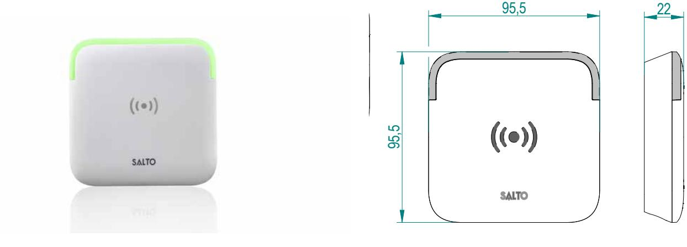
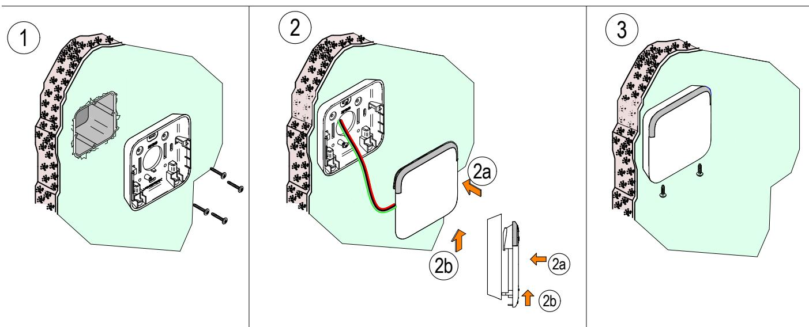
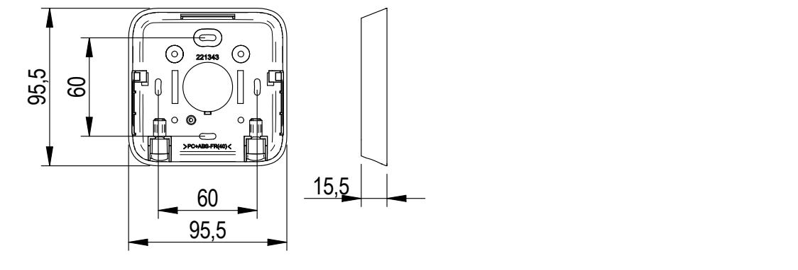
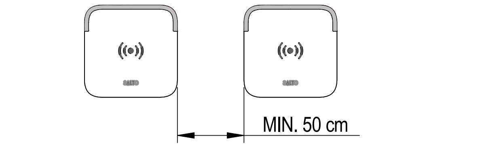
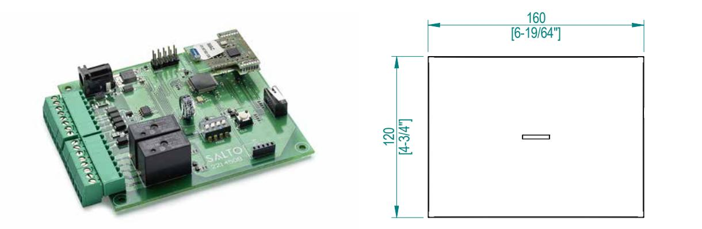
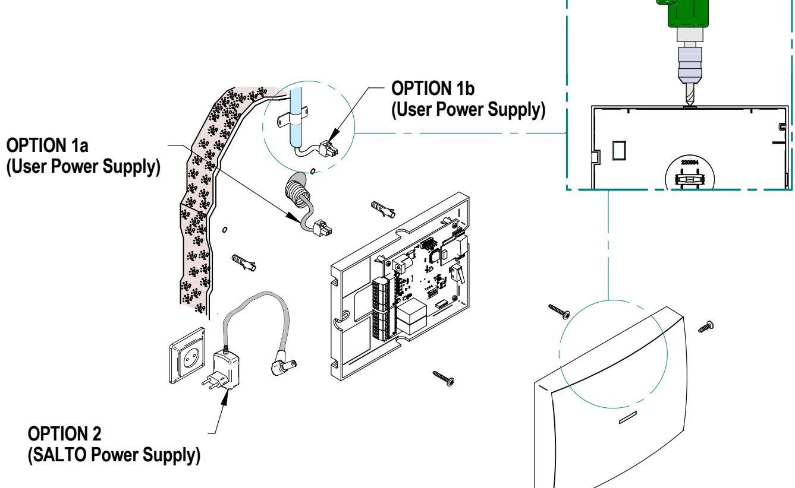
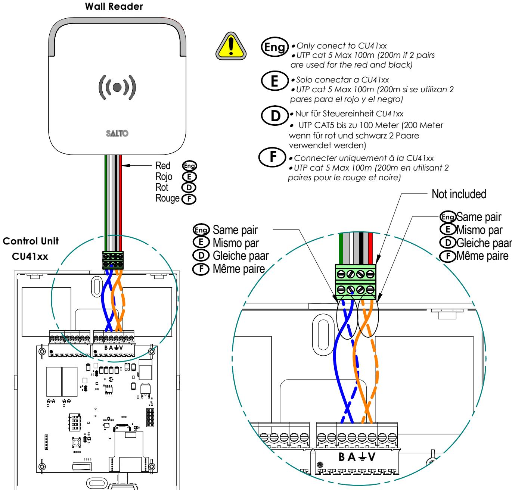

### //DATASHEET

### SALTO KS |

The easy wireless cloud-based locking solution

SALTO KS is the new access control platform from SALTO enabling users to control and manage greater range of applications than ever before. Manage locks, people, messages and access rights with no hassle. Immediate access control. From everywhere. Truly wireless.

# Wall Reader & Control Unit SALTO KS

### SALTO KS WALL READER -

The revolutionary design of the SALTO KS Wall Reader in combination with the SALTO KS Control Unit, allows to optimize access control to all those doors where an electronic lock cannot be fitted. For example, fences, lifts, mechanic doors, barriers and so on.

*Wall Reader Installation Guide*

### SALTO KS: WALL READER

#### Model WRD90E4xY

1 2

### MAIN FEATURES:

- Contactless reading of the SALTO KS Tag.
- Optical signalling through innovative LED design. Dual colour green/red to indicate access authorisation.
- Available in 2 different colors: Black and White.
- Connection to the SALTO KS Control Unit using UTP CAT 5 cable Max 100m (200m if 2 pairs are used for the red and the black cables)
- Concealed fixing screws for greater security and improved aesthetics.
- Gang electrical standard box measures.
- Dimensions: 96mm x 96mm x 15.5mm (W x H x D).
- IP66 protection rating.

All contents current at time of publication.

**European view**

SALTO Systems S.L. reserves the right to change availability of any item in this catalog, its design, construction, and/or materials.

60

52

R 6

 **WRDx0E4xY**

3

 **WRDx0E4xS Series**

**4X 4X 2X**

**221547 -ED0 -13/05/2015**

60

52

© **2015 SALTO Syst ems S.L.** 1/2

60

2a

2b 2a

2b

60

 **WRDx0E4xY**

Same pair

Mismo par

Gleiche paar

 **WRDx0E4xY**

*TEMPLATE* PLANTILLA SCHABLONE *GABARIT DE PERCAGE*

*TEMPLATE* PLANTILLA SCHABLONE *GABARIT DE PERCAGE*

R 6

R 6

52

60

60

52

60

60

© **2015 SALTO Syst ems S.L.**

52

52

 **WRDx0E4xS Series**

 **WRDx0E4xS Series**

**4X 4X 2X**

**4X 4X 2X**

22

**Eng E D**

Red Rojo Rot Rouge

22

**Eng E**

**D**

SALTO KS WALL READER INSTALLATION PROCESS 95,5 95,5

*Wall Reader Installation Guide*

*Wall Reader Installation Guide*

# SALTO KS WALL READER

**Control Unit**

**CU41xx**

*GANG ELECTRICAL STANDARD BOX*

*GANG ELECTRICAL STANDARD BOX* MODULO CAJA ELECTRICA ESTANDARD FACH STANDARD SCHALTERDOSE  *PLOTS D'ENCASTREMENT STANDARD*

FACH STANDARD SCHALTERDOSE  *PLOTS D'ENCASTREMENT STANDARD*

60

60

95,5

**Wall Reader**

*Wall Reader Installation Guide*

95,5

Technical specifications - SALTO KS Wall Reader & Control Unit

**European view**

**European view**

**European view**

All contents current at time of publication.

SALTO Systems S.L. reserves the right to change availability of any item in this catalog, its design, construction, and/or materials.

*ATTENTION- Information pour un bon fonctionnement.*

**B A V**

 *Solo conectar a CU41xx*

verwendet werden)

 *Only conect to CU41xx*

**E**

**D**

**Eng**

*pares para el rojo y el negro)*

Nur für Steuereinheit *CU41xx*

wenn für rot und schwarz 2 Paare

**F** *Connecter uniquement â la CU41xx*

*paires pour le rouge et noire)*

**F** Not included

*are used for the red and black)*

 *UTP cat 5 Max 100m (200m si se utilizan 2*

UTP CAT5 bis zu 100 Meter (200 Meter

 *UTP cat 5 Max 100m (200m en utilisant 2*

Same pair

**Eng E**

**D**

**F**

Mismo par

Gleiche paar

Même paire

 *UTP cat 5 Max 100m (200m if 2 pairs*

**221547 -ED0 -13/05/2015**

2/2

-

## SALTO KS CONTROL UNIT 4000 SERIES

The SALTO KS Control Unit allows to increase and improve the benefits, thanks to the wall reader, to all those accesses where a lock can't be installed. It talks wirelessly with the IQ, and reporting all events that take place on the Wall Reader SALTO KS.

### SALTO KS: CONTROL UNIT

#### Model CU41xYx

**Eng Electrical Characteristics E Características Eléctricas D Elektrische Eigenshaften Specificationss Électriques F**

*Control Unit Installation Guide*

### MAIN FEATURES:

- SALTO KS wireless version for wireless real-time control.
- All communications between the SALTO KS IQ/ Repeater and the SALTO KS locking device. **V** 12v +‐10% **Imax** 375mA (including WR)

**Power Supply** 

- Wall Reader are encrypted and secure.
- Wireless radio frequency based on IEEE 802.15.4 at 2,4Ghz **Output relays**
- Cover box available in 2 different colors: Black and White.
- Concealed fixing screws for greater security and improved aesthetics.
- Dimensions: 160mm x 120mm x 34mm (W x H x D). **Rated load (resistive)** 2A‐30VDC
- LED Signalization. Green: Connected to IQ; Red: Not connected to IQ.
- SALTO Power Supply included. Optional: User Power Supply input available. **Mechanical Installation Instalación Mecánica Mechanische Montage Installation Mécanique Eng E D F**

All contents current at time of publication.

**European view**

SALTO Systems S.L. reserves the right to change availability of any item in this catalog, its design, construction, and/or materials.

**(SALTO Power Supply)**

| FINISHES: |                                           | OPTION 1b (User Power Supply) |  |
|-----------|-------------------------------------------|----------------------------------|--|
| Black     | OPTION 1a (User Power Supply) White |                                  |  |
|           | OPTION 2                                  |                                  |  |

**221550 -ED0 -21/11/2014**

34 [1-11/32"]

© **2014 SALTO Syst ems S.L.** 1/3

**Operation conditions**

**2.4Ghz RF Characteristics**

**Min Max Unit**

**Temperature** 0 40 ºC

**Frequency Range** 2405‐2480 Mhz (ISM band) **RF Standard** IEEE 802.15.4 **Indoor Radio Range** 10/15m

**Power Supply** 

**Power Supply** 

All contents current at time of publication.

All contents current at time of publication.

**European view**

**European view**

SALTO Systems S.L. reserves the right to change availability of any item in this catalog, its design, construction, and/or materials.

SALTO Systems S.L. reserves the right to change availability of any item in this catalog, its design, construction, and/or materials.

Technical specifications - SALTO KS Wall Reader & Control Unit

**Min Max Unit**

**Min Max Unit**

**Temperature** 0 40 ºC

**Temperature** 0 40 ºC

**Frequency Range** 2405‐2480 Mhz (ISM band)

**Frequency Range** 2405‐2480 Mhz (ISM band)

**RF Standard** IEEE 802.15.4 **Indoor Radio Range** 10/15m

**RF Standard** IEEE 802.15.4 **Indoor Radio Range** 10/15m

160 [6-19/64"]

160 [6-19/64"]

**Operation conditions**

**Operation conditions**

SALTO KS CONTROL UNIT INSTALLATION PROCESS **Output relays Output relays**

**Eng Electrical Characteristics E Características Eléctricas D Elektrische Eigenshaften Specificationss Électriques F**

**Eng Electrical Characteristics E Características Eléctricas D Elektrische Eigenshaften Specificationss Électriques F**

120

120

[4-3/4"]

[4-3/4"]

*Control Unit Installation Guide*

*Control Unit Installation Guide*

 **CU41xY Series**

 **CU41xY Series**

#### SALTO KS CONTROL UNIT **Rated load (resistive)** 2A‐30VDC **Rated load (resistive)** 2A‐30VDC

**V** 12v +‐10%

**V** 12v +‐10%

© **2014 SALTO Syst ems S.L.** 1/3

© **2014 SALTO Syst ems S.L.** 1/3

**221550 -ED0 -21/11/2014**

**221550 -ED0 -21/11/2014**

34 [1-11/32"]

34 [1-11/32"]

*Wall Reader Installation Guide*

All contents current at time of publication.

**European view**

SALTO Systems S.L. reserves the right to change availability of any item in this catalog, its design, construction, and/or materials.

*ATTENTION- Information for a good functioning.* ACHTUNG- Wichtig für eine ordnungsgemäBe Funktion *ATTENTION- Information pour un bon fonctionnement.*

ATENCION- Información para un correcto funcionamiento.

MIN. 50 cm

### SALTO KS WALL READER AND CONTROL UNIT CONNECTION

**221547 -ED0 -13/05/2015**

2/2

© **2015 SALTO Syst ems S.L.**

### ELECTRICAL FEATURES:

#### Wall Reader Electrical Features:

#### OPERATION CONDITIONS: - Temperature: -35-66º.

#### Control Unit Electrical Features:

#### OPERATION CONDITIONS:

- Temperature: 0-40º.

#### 2,4Ghz RF CHARACTERISTICS:

- Frequency Range: 2405-2480Mhz (ISM band).
- RF Standard: IEEE 802.15.4.
- Indoor Radio Range: 10/15m.

#### POWER SUPPLY CHARACTERISTICS (Only for use with SALTO KS´s power supply)

- Output Voltage: 12v

- Max. current: 800mA
### TECHNICAL DATA:

#### WR CERTIFICATIONS:

- Declaration of Conformity CE
- Use of radio frequency spectrum
- ETSI EN 302 291-1 v1.1.1 (2005-07)
- ETSI EN 302 291-2 v1.1.1 (2005-07)
- Electromagnetic Compatibility
- ETSI EN 301 489-1 v1.9.2 (2011-09) - ETSI EN 301 489-3 v1.4.1 (2003-08)
- Security requirements

Technical specifications - SALTO KS Wall Reader & Control Unit

- EN 60950-1(2006)/A11(2009)/A1(2010)/A12(2011)
- Following the provisions of the directive the directive 1999/5/EC (R&TTE) and the directive 2011/65/EU of the European Parliament and of the Council of 8 June 2011 on the restriction of the use of certain hazardous substances in electrical and electronic equipment.

#### CU CERTIFICATIONS:

- Declaration of Conformity CE
- Use of radio frequency spectrum
- ETSI EN 300 328 v1.7.1 (2006-10)
- Electromagnetic Compatibility
- ETSI EN 301 489-1 (2011-09)
- ETSI EN 301 489-3 (2002-08)
- Security requirements
- EN 60950-1(2006)/A11(2009)/A1(2010)/A12(2011)

- Following the provisions of the directive the directive 1999/5/EC (R&TTE) and the Directive 2011/65/EU of the European Parliament and of the Council of 8 June 2011 on the restriction of the use of certain hazardous substances in electrical and electronic equipment.

### SALTOKS.COM & SALTO KS APP: FEATURES

No software installation, scaling on any device, secured login, intuitive design, anything you may expect from today's cloud solution is in saltoks.com. Manage locks, people, messages and access rights with no hassle.

The Dashboard: saltoks.com always gives you up-to-date information and remote management of all SALTO KS components through the dashboard (door status, last entries, events and so on).

- Access rights: saltoks.com gives you the opportunity to individually determine who enters when and where. And if you want to change that just log-in, make your changes and it's done. No updating of SALTO KS Tag or SALTO KS Doorlock required.
- Messaging: saltoks.com always gives you up-to-date information and remote management of all SALTO KS components through the dashboard.
- Security: SALTO KS understands the importance of security. That's why we have incorporated state-of-the-art security measures in all our components and more important, we will keep updating that permanently. Not always visible but always there.
- Remote opening: One of the cool but really functional features of SALTO KS is the remote opening of doors with secure OneTimePassword technology. You may not use it every day but when you need it, you will be happy it's there.
- Any device, any platform: saltoks.com has been developed supporting all the latest browsers, devices and operating systems. From iOS to Windows and from laptop to Ipad.
- SALTO KS App: Available for IOS and Android Phones the SALTO KS App enables you to manage your SALTO KS system when you are on the go.

SALTO Systems S.L. reserves the right to modify technical specifications, designs and performance without notice. © SALTO Systems 2016

