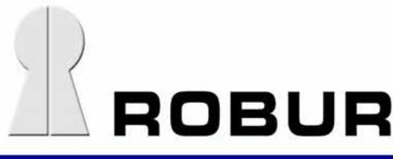
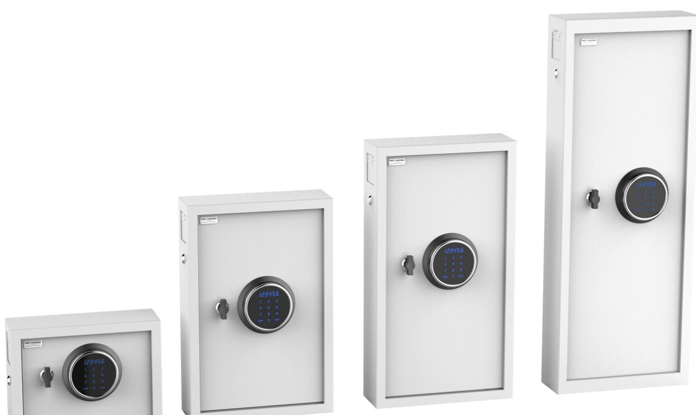
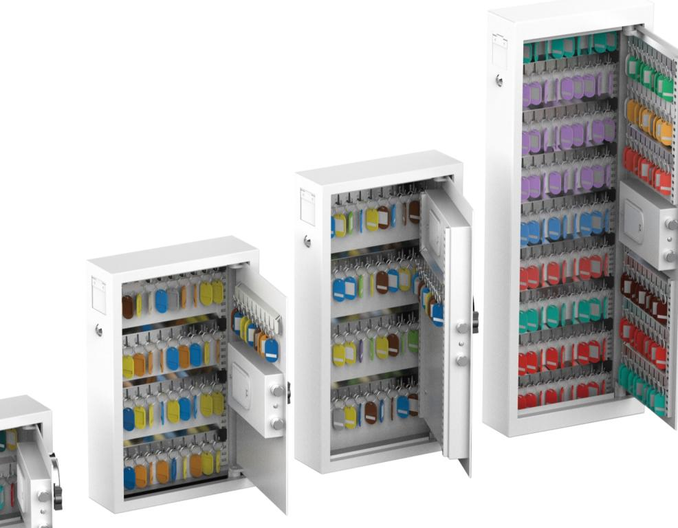
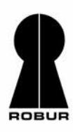

# **NYCKELSKÅP MED ELEKTRONISKT KODLÅS OCH NYCKELINKAST**

**Roburs nyckelskåp** är tillverkat i 3 mm stålplåt i dörren samt 1.8 mm stålplåt i väggarna.

**Nyckelskåpen** är utrustade med ett omprogrammerbart elektroniskt kodlås med Touch skärm.

**Nyckelskåpen** är utrustade med en deponeringsöppning höjd 45 mm, bredd 50 mm, för eventuell återlämning av nycklar utan att behöva öppna skåpet.

Det medföljer bultar för att förankra skåpet.

För mått och vikt, se omstående sida.

## **Mått- och viktuppgifter**

| MBG 22            | MBG 48 | MBG 100 | MBG 150 |
|-------------------|--------|---------|---------|
| Utvändiga mått mm |        |         |         |
| 220               | 450    | 550     | 800     |
| 300               | 300    | 350     | 300     |
| 100 *             | 100 *  | 100 *   | 100 *   |
| 5                 | 10     | 12      | 15      |
| 22                | 48     | 100     | 150     |
|                   |        |         |         |
|                   |        |         |         |

Ändring i konstruktion och utrustning förbehålles

Lundbyvägen 8 Arenavägen 55 plan 7 Postboks 30 Tel: 0346 – 260 260 Tel: 08 – 745 72 11 Tel: 0047 67 16 66 00 Fax: 0346 – 260 222 Fax: 08 – 776 36 66 Fax: 0047 67 16 66 01 info@robursafe.com www.robursafe.com info.no@robursafe.com

### **Huvudkontor Försäljningskontor Försäljningskontor Robur Safe AB Robur Safe A/S**

311 68 SLÖINGE 121 77 JOHANNESHOV 1332 ÖSTERÅS, NORGE