# **Nyckelskåp MBG 22, MBG 48, MBG 100 & MBG 150 Användarguide**

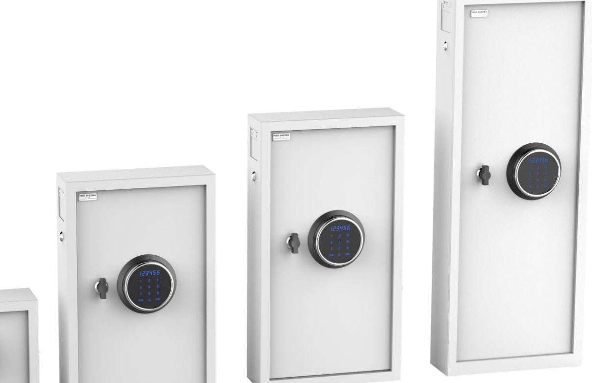

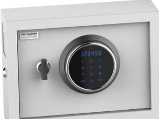

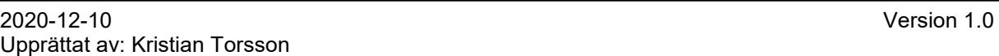

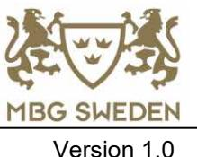

| 1. Öppning av nyckelskåpet för första gången  3 |  |
|-------------------------------------------------|--|
| 2. Användartyper och dess behörigheter  3       |  |
| 3. Öppna och låsa låset  4                      |  |
| 4. Ändra masterkoden  5                         |  |
| 5. Ändra användarkod  5                         |  |
| 6. Öppning av nyckelskåp med nödnyckel  6       |  |
| 7. Bytte av batterier  6                        |  |
| 8. Se batteri status  7                         |  |
| 9. Strömsparläge  7                             |  |
|                                                 |  |

Snabbanvändarguide

## *1. Öppning av nyckelskåpet för första gången*

Skåpet levereras låst och det medlevereras med två olika uppsättningar av nyckelpar. Identifiera de två nyckelparen (fig. 1). Ett par går till deponeringsluckan (fig. 2) längst upp på vänster sida. Det andra paret är för nödöppning av nyckelskåpet. Förvara nycklarna på en säker plats, inte inne i själva nyckelskåpet.

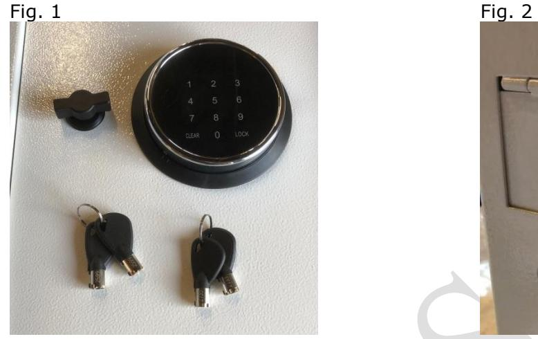

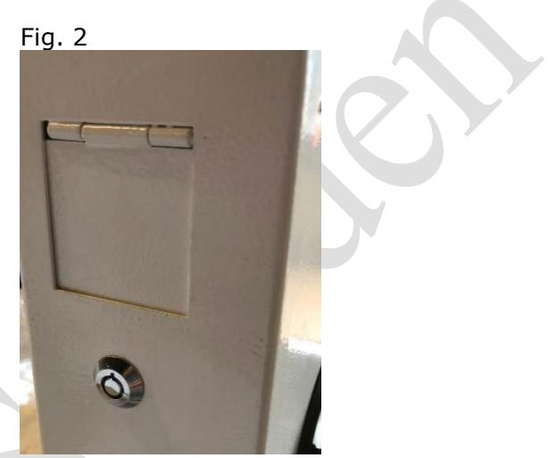

För öppning med nödöppningsnycklarna se kaptitel 6 Öppning av nyckelskåp med nödnyckel.

## *2. Användartyper och dess behörigheter*

Det finns två olika användartyper i låset. Skillnaden mellan användartyperna är att de har olika behörigheter att hantera låset. Följande användare finns:

**Masterkod** (Leveranskod: 040620)

*Masterkoden* behövs för att ta bort och lägga till användaren i låset. *Masterkoden* kan aldrig tas bort från låset.

Observera om koden glöms bort, använd nödnyckeln för att öppna nyckelskåpet.

Kontakta MBG Sweden för att få hjälp att återställa *Masterkoden*.

Var vänlig kontakta **MBG Sweden** på **0346-260260** eller på **info@mbgsweden.com**.

**Användare** (Leveranskod: 1234) En *användare* har behörighet att öppna låset samt att ändra sin egen kod.

Snabbanvändarguide

# *3. Öppna och låsa låset*

- **1.** Tryck in din 4 6 siffriga kod och tryck sen på "**LOCK**". Vid rätt inmatning bekräftas detta med att displayen visar "**OPEN**".
- **2.** Efter att koden slagits måste låset öppnas inom 5 sekunder genom att vrida vredet 90º medurs, annars låser låset sig automatiskt.

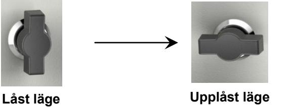

- **3.** Nu kan dörren öppnas.
- Displayen visar "**ERROR**" när fel kod matas in. Efter tre felaktiga kodinmatningar kommer nyckelskåpet att sättas i blockeringsläge. Displayen visar "**HOLD15**" i 15 minuter och knappsatsen är inaktiverad under den tiden.

#### **Vid låsning av skåpet.**

För att låsa, stäng dörren ordentlig och vrid tillbaka vredet 90º moturs till låst läge.

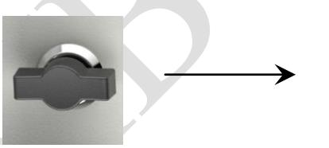

**Upplåst läge Låst läge**

Snabbanvändarguide

#### *4. Ändra masterkoden*

Leveranskod: 040620

#### *Viktigt!*

Skåpet måste vara öppet vid kodändringar.

Tryck "**0**", "**0**" sen på "**LOCK**", displayen visar "**OLD**", mata in den gammal masterkod och tryck sedan på "**LOCK**" då visas "**NEW**". Mata in den nya 6-siffriga masterkoden (Efter att "NEW" slocknat och inom 10 sekunder). Tryck sen på "**LOCK**", då visar displayen "**AGAIN**". Mata in den nya masterkoden en gång till och sen på "**LOCK**". Displayen ska då vid lyckad kodändring visa "**DONE**".

123456 används som exempel för den nya masterkoden.

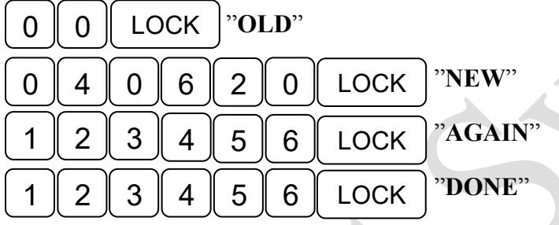

## *5. Ändra användarkod*

Leveranskod: 1234

#### *Viktigt!*

Skåpet måste vara öppet vid kodändringar.

Tryck den nya användarekoden 4 - 6 siffror och sen på "**LOCK**", displayen visar "**AGAIN**". Ange den nya koden igen och tryck sen på "**LOCK**", displayen visar då "**DONE**" som indikerar att den nya användarekoden har ändrats framgångsrikt.

1234 och 4321 används som exempel för att ändra användarkoden.

| 1 | 2 | 3 | 4 | LOCK | "AGAIN" |
|---|---|---|---|------|---------|
| 4 | 3 | 2 | 1 | LOCK | "DONE"  |

Snabbanvändarguide

# *6. Öppning av nyckelskåp med nödnyckel*

Nödnyckeln är till för att kunna öppna nyckelskåpet om batterierna har tagit slut eller koden har glömts bort. Det rekommenderas inte att nödnyckeln används för dagligt bruk.

För att öppna med nödnyckeln ta bort skruven på sidan av panelen och ta sedan av panelen. Skruvens position visas i figur 1.

Sätt i nödnyckeln och vrid medurs för att öppna dörren. Nyckelhålspositionen visas i figur 2.

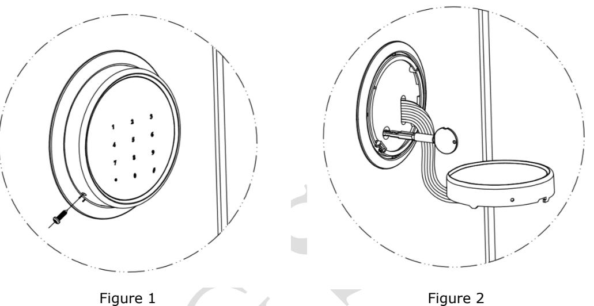

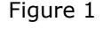

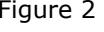

#### *7. Bytte av batterier*

Öppna dörren och ta bort locket över batterihållaren på dörrens insida och sätt in 4 st A A/1,5 V batterier (Alkaline).

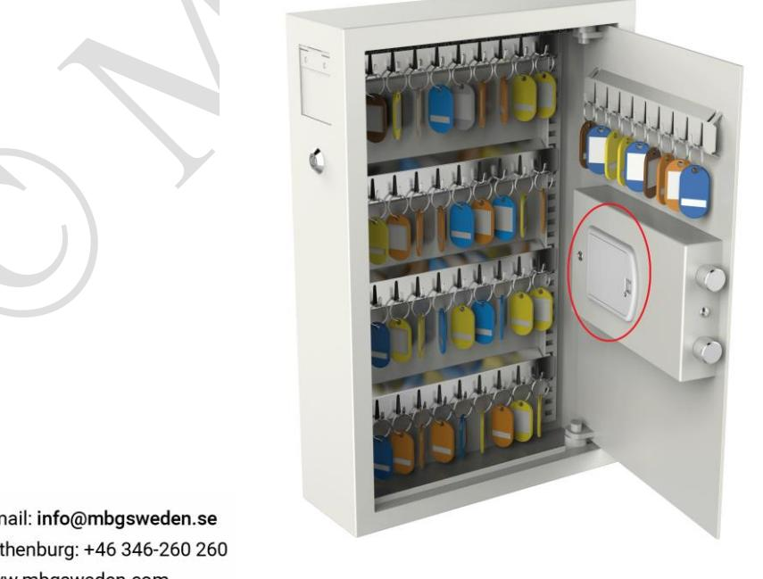

Snabbanvändarguide

#### *8. Se batteri status*

Tryck på "**LOCK**" för att se i displayen vilken status batterierna har.

- "**BA-HI**" betyder att batterierna har god status och fungerar bra
- "**BA-LO**" betyder att batterierna har dålig status och bör bytas ut omgående.

#### *9. Strömsparläge*

Låssystemet har ett strömsparläge för att förlänga batteriets livslängd. Den elektriska strömmen för statiskt tillstånd är cirka 10uA under lågeffektläget.

#### *10. Dölj kod vid inmatning*

Tryck på "**CLEAR**" före inmatning av koden för att dölja koden vid inmatning av koden. Under denna funktion visar displayen bara "--" istället för siffror när du anger koder. Om du vill inaktivera kod döljningsfunktionen trycker du på "**CLEAR**" före inmatningen av koden. Displayen visar nu siffrorna som du matar in istället för " --".

Snabbanvändarguide

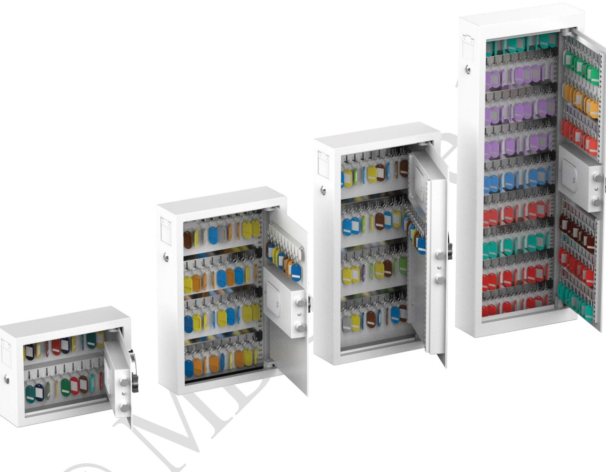

