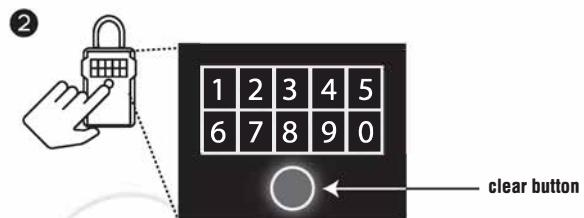
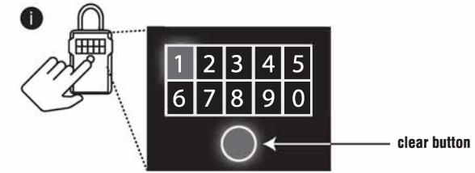
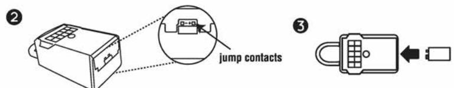
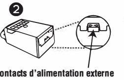
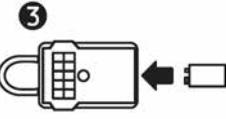
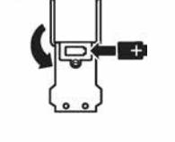
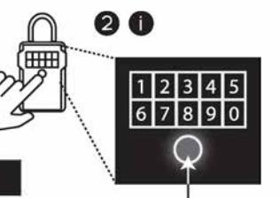

# QUICK START - UNLOCK WITH MOBILE OEVICE

1. Remove lock box and instructions from package.

- 2.On your Android or iOS mobile device, visit the app store to download the FREE Master Lock Vault eLocks app. To check your device compatibility, visit:
http://Www.masterlock.com/masterlockvaultelocks/app-download-device-compalibility. (Note: There are two Master Lock Vault apps. Download the Master Lock Vault eLocks version.)

3.Launch the app and create an account, or sign into your existing Master Lock Vault account. 4. In the Master Lock Vault eLocks app, touch Add a Lock(+)

- 5. Enter the Activation Code, from the blue box above, on your mobile device to register the lock box. Once your lock box is registered, it will display in the Lock List inside the app. Touch the name of the lock box to access the lock details and manage additional settings, view the access history, or share access with g uests.
- 6. By default, your lock is in Touch Unlock mode. Touch any button on the lock box keypad to wake and unlock it. When the light tums green, open within 5 seconds or it will relock. The green light means the door can now be opened by pulling on it. (Note: You can change the phone-to-lock box communication range in the app settings, by using the Device Calibration feature.)

# QUICK START - UNLOCK WITH LOCK BOX KEYPAO

1. Remove lock box and instructions from the package.

- 2. Enter the Primary Gode, located in the black box above, into the lock box keypad. (Note: Do not pull on the door when entering the code and do not press the clear button. (see illustration 2). Entering the Primary Gode will erase the Try Me code.)
- 3. When lock box light tums green, open within 5 seconds or it will relock.

(Note: Pressing the clear button erases all input and restarts the process.)

- QUICK START REMOVE SHACKLE
	- 1. Once you have downloaded the Master Lock Vault eLocks app and registered your lock box, press any button on the lock box key pad to wake your lock box. Touch the Remove Shackle button on the Lock Details page, which is found under Manage Lock. Your lock box will again light green, and you can then remove the shackle within 5 seconds.
	- 2. To remove the shackle using the lock box keypad:
	- i. Press the clear button and first dig it of your primary code, from the black box above, simultaneously (See illustration i).
	- ii. Release the clear button and first digit, then enter the rest of the primary code. iii. When the light tums green, remove the shackle within 5 seconds or it will relock. (Note: Pressing the clear button erases all input and restarts the process.)

# BATTERY INSTRUCTIONS - HOW TO REPLACE BATTERY

- 1. Low battery will be indicated through an email notification, the app, or by a yellow light on the lock box.
- 2.Unlock and open the lock box door.
- 3.Using a Flat Head screw driver, open the battery compartment door and remove the battery.
- 4.lnstall a new CR123A battery, making sure to position the battery with positive and negative sides facing the proper direction as indicated on the door and battery compartment (See illustration 4).
- 5. Close the battery door and tighten the screw.

(Note: Pressing the clear button erases all input and restarts the process.)

# BATTERY INSTRUCTIONS - HOW TO UNLOCK WHEN THE BATTERY IS COMPLETELY DRAINED

- 1. lf the battery drains while the lock box door is closed, you can jump it using an externa! 9-volt battery.
- 2. Locate the battery jump contacts on the bottom of the lock box (see illustration 2).
- 3. Hold a new 9-volt battery underneath the lock box with the positive ( +) and negative (-) terminals pressed against the jump contacts (see illustration 3), in the orientation indicated on the bottom of the lock box (see illustration 2).
- 4. While holding the battery in place, and with an authorized mobile device within range of the lock box and in Touch Unlock mode, press any keypad button on the lock box. lf the lock box does not unlock, or an authorized mobile device is not available, enter the Primary Gode on the lock box keypad; while holding the 9-volt battery in place.
- 5.When lock box is opened, install a new CR123A battery.

*Please note that after installing a new battery, the low battery icon will no /anger display in the app after the lock box and app communicate with each other. However, it wi/1 take between 2 and 72 hours for the yellow LED to stop displaying on the lock itself.* 

**Notice: Thls lock boxaod its operating soflwara aresubjectto U.S. E:q)ortAdmlnlstratloo Rel;Julatlon rontrols. The lock box Is sub]ect to ECCN 5A992and the downloaclable app Is sub]ect to ECCN 5D992 as mass martet sottware. Exportlng thls lock boxaod/or Ils software contraryto U.S. law is prohlllted. Notice: Thls devte comolles wtth lodustrv Canada llceosHXempt RSS starmrd(s). Operation is sub_lEåto thefollowlog two con<ftloos: (1) thls devlce may notcause llterterence, and (2) thls dEM:e must accept� interterence lncluclng lntertereru that rnaY cause uodesired operation al lhe d!MC8. Ths clevice cofroies wilh Part 15 of the FCC Rules. Operation is subjecttothefolkmiog two conditioos: (1) this deilice f!l3.Y notcause hairriful interference, and (2) thisde\oice must acceptany interference received, mcludllg interferencelflat maycause undesired operatiofl. Ths cle\oice compl"es with FCC Part 15.21: Changes or mocifications made to this equipment not expressly approved by the party responsible for complianr.e could vöid the user's authorily to operate the equipmenL** 

***Notice: In the European Urion (EU), this�bol meMS thatelecbical and electrooic equipmentshould not be disp)secl of with general household wa&e. Please contactyour dealer, sup� or local rec,ycling authorilyforfurther detai1s l'8IJM(ling appropriate disp)sal ofthis product and your nearest designated collection fllity.** 

### **DEMARRAGE RAPIDE - DEVERRDUILLAGE PAR LE CLAVIER DU BDTTIER DE VERRDUILLAGE**

- 1. Retirez le bo1tier de verrouillage el les instructions de !'emballage.
- 2. Sur l'appareil mobile Android ou iOS, visitez la boutique d'applications pour telecharger l'application Master Lock Vault eLocks GRATUITE. Pour verifier la compatibilite de votre appareil, visitez : hllp://WWW.masterlock.com/masterlockwulteloclcs/app-ilownload-ilevice-aJmpatibilily Remarque : Il existe deux applications Master Lock Vault Telechargez Master Lock Vault version eLocks.)
- 3. Lancez l'application, puis creez un eompte ou ouvrez une session å votre compte Master Lock Vault existant.
- 4. Dans l'application Master Lock Vault eLocks, appuyez sur Add a Lock(+) (Ajouter un cadenas).
- 5. Sur votre appareil mobile, entrez le eode d'activation du carre bleu ci1lessus pour enregistrer le bo1tier de verrouillage. Une fois le boitier de verrouillage enregistre, il sera affiche dans la !iste des cadenas, dans l'application. Appuyez sur le nom du boitier de verrouillage afin d'aoceder aux details du cadenas el gerer les reglages additionnels, voir l'historique d'acces, ou parlager l'acces avec des invites.
- 6. Par defaut, votre cadenas est en mode de deverrouillage par mode tactile. Touchez n'importe quel bouton sur le clavier du boitier de verrouillage pour l'eveiller el le deverrouiller. Lorsque le voyant s'allume en vert, ouvrez-le dans les 5 secondes, sinon il se reverrouillera. Le voyant vert signme que la porte peut maintenant lltre ouverte en la tirant. (Remarque : Vous pouvez modttier la portee de eommunication entre le telephone el le boitier de verrouillage å partir de la caracteristique de calibrage de l'application.)

# **DEMARRAGE RAPIDE-DEVERROUILLAGE PAR LE CLAVIER DU BOTTIER DE VERROUILLAGE**

- 1. Retirez le bo1tier de verrouillage el les instructions de !'emballage.
- 2. Entrez le code primaire situe dans le carre noir ci1lessus, sur le clavier du boitier de verrouillage. (Remarque: Ne tirez pas sur la porte lors de la saisie du code el n'appuyez pas sur le bouton « clear » (effacer) (voir !'illustration 2). La saisie du code primaire effacera le eode « Try Me » (code d'essa1).
- 3. Lorsque le voyant du bo1tier de verrouillage s'allume en vert, ouvrez-le dans les 5 secondes, sinon il se reverrouillera.
- **DEMARRAGE RAPIDE-OUVRIR L'ARCEAU**
- 1. Une fois que vous avez telecharge l'application Master Lock Vault eLocks el que vous avez enregistre votre bo1tier de verrouillage, appuyez sur n'importe quel bouton du clavier du bo1tier de verrouillage pour l'eveiller. Appuyez sur le bouton d'ouverture de l'arceau åla page des details du cadenas, lequel se trouve sous la gestion du cadenas. Votre boitier de verrouillage s'allumera å nouveau en vert el vous pourrez ouvrir l'arceau dans les 5 secondes.
- 2. Pour ouvrir l'arceau par le clavier du boitier de verrouillage :
- i. Appuyez sur le bouton « clear » (effacer) el entrez le premier caractere de votre code prirnaire, du carre noir ci1lessus, simultanement (Voir !'illustration i).
- ii. Relächez le bouton « clear » (effacer) el le premier caractere, puis entrez le reste du code primaire.
- iii. Lorsque le voyant s'allume en vert, ouvrez l'arceau dans les 5 secondes, sinon il se reverrouillera. (Remarque : Appuyer sur le bouton « clear » (effacer) efface toutes les entrees et recommence le processus.)

### **INSTRUCTIONS PORTANT SUR LA PILE -COMMENT REMPLACER LA PILE**

- 1. Une pile faible sera indiquee par un eourriel, par l'application ou par un voyant jaune sur le boitier de verrouillage.
- 2. Deverrouillez el ouvrez la porte du bo1tier de verrouillage.
- 3. En utilisant un toumevis plat, ouvrez le eompartiment de la pile el retirez la pile. 4. lnstallez une nouvelle pile CR123A en vous assurant que la position des pöles negatif et pos� soit dans la banne direction, oomme il est indique sur la porte du
- eompartiment de la pile (voir !'illustration 4). 5. Ferrnez le couvercle de la pile el resserrez la vis.

#### **INSTRUCTIONS PORTANT SUR.LA PILE-.COMMENT OEVERROUILLER LORSQUE LA PILE EST COMPLETEMENT A PLAT**

- 1. Si la pile s'epuise alars que le boitier de verrouillage est terrne, vous pouvez y suppleer en utilisant une pile 9 volts exteme.
- 2. Localisez les eontacts d'alimentation exteme au bas du bo1tier de verrouillage (voir !'illustration 2).
- 3. Maintenez une nouvelle pile 9 volts sous le boitier de verrouillage en appuyant les bomes positive(+) el negative(·) contre les eontacts (voir !'illustration 3), dans le sens indique au bas du boitier de verrouillage (voir !'illustration 2).
- **4.** En maintenant la pile en place, el avec un appareil mobile autorise å portee du boitier de verrouillage, se trouvant en mode deverrouillage par mode tactile, appuyez sur un bouton du clavier du bo1tier de verrouillage. Si le bo1tier de verrouillage ne deverrouille pas, ou si un appareil mobile autorise n'est pas disponible, saisissez le code primaire sur le clavier du boitier de verrouillage; tout en maintenant la pile 9 volts en place.
- 5. Une fois le bo1tier de verrouillage ouvert, installez une nouvelle pile CR123A *Veui/lez noter qu'apres /'installation d'une nouve/le pile, /'icone de pi/e taible ne sera plus affichee dans l'application, une tois que l'application et le boitier de verrouillage auront communique entre eux. Cependant, il taudra compter entre 2 a 72 heures pour que la DEL jaune cesse de s'afficher sur le cadenas.*

MBG Marieholmsgatan 54 (Pir 52) 415 02 Göteborg T EL +46(0)346-260 260 FAX +46(0)31-250 428 info@mbgsweden.com www.mbgsweden.com

# **INICID RÅPIDD • DESBLDQUEAR CDN UN DISPDSITIVD MÖVIL**

- 1. Saque la caja para !laves y las instrucciones del paquete.
- 2. En su dispositiva m6vil Android o iOS visite la tienda de aplicaciones (app store) para descargar la aplicaci6n m6vil Master Lock Vault eLocks GRATIS. Para ver�icar la oompatibilidad de su dispositiva,
- visite: http://WWW.masterlock.comtmasterlockvauHeloclcs/app-ilownload-ilevice-compatibility. (Nota: Hay dos aplicaciones m6viles Master Lock Vault Descargue la versi6n Master Lock Vault eLocks).
	- 3. lnicie la aplicaci6n y cree una cuenta, o inicie sesi6n en su cuenta existente de Master Lock Vault
	- 4. En la aplicaci6n m6vil Master Lock Vault eLocks, toque Add a Lock(+) (Aftadir un candado).
	- 5. Capture el c6digo de activaci6n que aparece en el recuadro azul que estå arriba en su dispositiva m6vil para registrar la caja. Una vez que su caja este registrada, aparecerä en la lista de candados dentro de la aplicaci6n. Toque el nombre de la caja para obtener acceso a sus detalles y administrar la eonfiguraci6n, ver la historia de accesos, o dar acceso a invitados.
	- 6. Por defecto, su candado esta en modo de 'tocar para desbloquear'. Toque cualquier bot6n en el teclado de la caja para activar1a y desbloquearta. Cuando la luz se ponga verde, åbralo en menas de 5 segundos o volverä a bloquearse. La luz verde indica que puede abrir la puerta jalåndola. (Nota: Puede cambiar el rango de eomunicaci6n caja-telefono en la oonfiguraci6n de la aplicaci6n, utihzando la funci6n Device Calibration (Calibraci6n del dispositiva).

## **INICIO RÅPIDO -ABRIR LA CAJA CDN EL TECLADO**

- 1. Saque la caja para !laves y las instrucciones del paquele.
- 2. Capture el c6digo principal, que aparece en el recuadro negro que estå arriba, en el teclado de la caja. (Nota: No jale la puerta mientras captura el c6digo y no oprima el bot6n transparente (ver la ilustracion 2). Al capturar el c6digo principal borrarä el c6digo de demostraci6n).
- 3. Cuando la luz de la caja se ponga verde, åbrala en menas de 5 segundos o volverä a bloquearse.

- 1. Una vez que descargue la aplicaci6n m6vil Master Lock Vault eLocks y registre su caja, oprima cualquier bot6n en el teclado de la caja para activarla. Toque el bot6n Remove Shackle (Quitar gancho) en la pågina Lock Details (Detalles del candado ), que se encuentra en Manage Lock (Administrar candado). La luz de su caja volverä a ponerse verde y podrä quitar el gancho en los siguientes 5 segundos.
- 2. Para quitar el gancho utilizando el teclado de la caja:
	- i. Presione simultåneamente el bot6n transparente y el primer digito de su c6digo principal, que aparece en el recuadro negra que esta arriba (ver la ilustraci6n i).
	- ii. Suelte el bot6n transparente y el primer dfgito, y luego capture el resta del c6digo principal. iii. Cuando la luz se ponga verde, quite el gancho en menas de 5 segundos o volverä a bloquearse. (Nota: Oprimir el bot6n transparente borra todo lo capturado y reinicia el proceso).

# **INSTRUCCIONES DE LA BATERiA- CÖMO CAMBIAR LA BATERiA**

- 1. Recibirä un aviso de que la baterfa esta baja por eorreo electr6nico, en la aplicaci6n m6vil o eon una luz arnarilla en la caja.
- 2. Desbloquee y abra la puerta de la caja.
- 3. Con un destomillador de cabeza plana abra la puerta del eompartimento de la baterfa y saque la baterfa.
- 4. lnstale una nueva bateria CR123A, asegurändose de colocarla eon los ladas positiva y negativa en la posici6n eorrecta, segun las indicaciones de la puerta y el compartimiento de la bateria. (Ver la ilustraci6n 4)
- 5. Cierre la puerta de la bateria y apriele el tomillo.

#### **INSTRUCl;IONES.DE LA BATERIA-CÖMO DESBLOQUEAR CUANDO LA BATERIA ESTA AGOTADA**

- 1. Si la baterfa se agota mientras la puerta de la caja esta cerrada, puede abrirla eon una baterfa externa de 9 volts.
- 2. Localice los contactos de la baterfa en la parte inferior de la caja (ver la ilustraci6n 2).
- 3. Coloque una baterfa nueva de 9 volts debaio de la caja eon las terrninales positiva ( +) y negativa (·l tocando los eontactos (ver la ifustraci6n 3), en la orientaci6n indicada en la parte inferior de a caja (ver la ilustraci6n 2).
- 4. Mientras sostiene la bateria en su lugar, y eon un dispositiva m6vil autorizado dentro del rango de la caja y en modo de 'tocar para desbloquea�•. presione cualquier bot6n del teclado de la caja. Si la caja no se desbloquea, o si no tiene disponible un dispositiva m6vil autorizado, capture el c6digo principal en el teclado de la caja mientras sujeta la baterfa de 9 volts en su lugar.
- 5. Cuando la caja este abierta, instale una nueva bateria CR123A.
- *Recuerde gue despues de instalar una bateria nueva, el fcono de bateria baja ya no aparecera en la ap/icacion, despues de que la ap/icaci6n yla caja se comuniquen entre si. Sin embargo, la luz amarilla de la caja seguira encendida durante un perfodo de 2 a 72 horas.*

contacts d'alimentation externe contactos para la baterfa

- bouton « clear » (ellacer) (Remarque : Appuyer sur le bouton
« clear » (ellacer) efface toutes les entrees et recommence le processus.)

- bot6n transparente (Nota: Oprimir el bot6n transparente borra todo lo capturado y reinicia el proceso).
**e** 

- **INICIO RÅPIDO -QUITAR EL GANCHO**