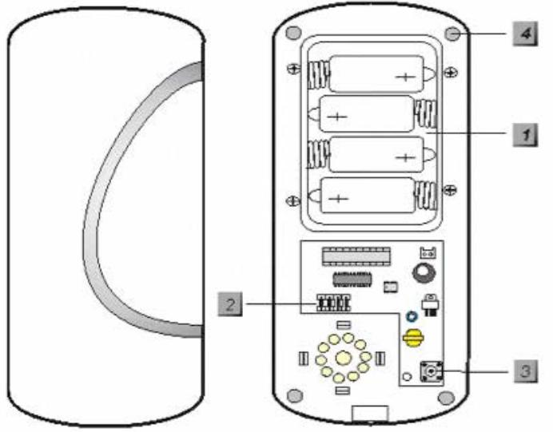

# Installation Guide

NookBox Installation Guide Siren Indoor 1

NookBox Siren Indoor (P119017 /E6309666)

# NookBox Siren Indoor (P119017 / E6309666)

The Indoor Siren is used to attract attention by sounding an alarm when alarm signal is received from Control Panel. The Siren can also alert you to tamper violation, signal communication problems and low battery status.

### Parts Identification

#### 1. Battery Compartment

(With a lid secured with 4 screws)

#### 2. Function Switch Block

Contains 7 DIP Switches to enable the learning mode and to set the alarm period of siren and strobe light.

#### 3. Tamper Switch

The tamper switch protects the device from cover opening.

### 4. Mounting Holes X 4

#### Accessories included:

In addition to the Siren itself, the following accessories are also included in the package:

- a. 4 x large wall plugs.
- b. 4 x 4 mm x 30 mm cross head fixing screws.
- c. 4 x 1.5V D alkaline cells.

# DIP Switch Position Table

Remove the cover by unscrewing the single screw located at the bottom. In the middle of the L-shaped PCB board, you can see a Jumper Switch Block which consists of 7 DIP Switches. The function of each DIP Switch is listed as table right. The DIP Switch is either ON or OFF. Top position indicates ON and bottom position indicates OFF.

| SW1 |     | Siren Learning               |
|-----|-----|------------------------------|
| OFF |     | Normal operation             |
| ON  |     | Learn-in mode                |
| SW2 |     | Reserved                     |
| SW3 | SW4 | Siren Duration               |
| OFF | OFF | 3 min.                       |
| ON  | OFF | 5 min.                       |
| OFF | ON  | 10 min.                      |
| ON  | ON  | 1 second (test)              |
| SW5 |     | Reserved                     |
| SW6 |     | Memory Reset                 |
| OFF |     | Normal                       |
| ON  |     | Clear Memory                 |
| SW7 |     | Supervision                  |
| OFF |     | Supervision function disable |
| ON  |     | Supervision function enable  |
|     |     |                              |

* For further detail please see section Function Overview.

## Power Supply

The Siren is powered by 4 D-cell alkaline batteries. It also features low battery voltage detection. When low battery is detected, a low battery signal will be sent to the Control Panel along with regular signal transmissions for the Control Panel to display the status accordingly. The Siren will also emit 5 beeps when armed/disarmed to notify the user of low battery condition.

# Supervision Function

When the Dip Switch #7 is slid to ON position, the Siren will conduct a Self-test Periodically by transmitting a supervisory signal once every 30-50 mins in normal operation mode.

If this signal is not received, the Control Panel will determine the particular Siren is out-of-order and report the event accordingly.

## Function Overview

### Siren Audible Performance

The siren produces a minimum of 104 dBA sound pressure at 1 meter on axis. It is programmable via two DIP switches (SW3 and SW4) for four different siren durations:

- 1) 3 min.
- 2) 5 min.
- 3) 10 min.
- 4) 1 second (for testing)
- The fourth position (1 second) is used for testing during installation.
- For Burglar / Panic Alarm, the Siren emits continuous alarm sound.
- For Fire / Water alarm, the Siren emits an intermittent alarm sound of 2-sec siren followed by a 1 sec interval,
- cyclically during the programmed alarm duration.
- The siren is silenced when either the programmed siren duration expires or the Control panel turns off the siren.

#### Previous Alarm Warning

If there has been an alarm while you were away, the Siren sounds alarm while the system is disarmed. WARNING: If the siren is activated for 3 seconds when you disarm your system, it is reminder you that there could be an intruder still in your premises.

### Tamper Protection

The Siren has tamper switches that protects the Siren from unauthorized cover opening. When the tamper switch is activated, the Siren will activate alarm immediately and transmit tamper open signal to the Control Panel. If the user want to change Siren batteries or mounting location, please make sure to disable the Siren tamper switch temporarily first before proceeding.

### Audio Status Indication

While arming / disarming the system, the Siren uses different methods to distinguish various 1statuses for the user, as listed in following table:

<NOTE>

For those marked with asterisk (*), it means the Siren Audio indication will be effected by the Confirmation ON / OFF. When setting Confirmation to OFF, the confirmation sound will not be available.

|                        | Siren Audio      |
|------------------------|------------------|
| Arm/Home               | 1 beep*          |
| Disarm                 | 2 beeps*         |
| Arm (Low Battery)      | 5 beeps          |
| Disarm (Low Battery)   | 5 beeps          |
| Arm (Tamper)           | 5 beeps          |
| Disarm (Tamper)        | 2 beeps*         |
| Previous alarm warning | 3 secs beep      |
| Tamper Alarm           | Continuous beeps |
| Entry/Exit Sound       | Count-down beeps |
|                        |                  |

#### Factory reset

The siren can be reset and memory contents cleared by following steps:

Step 1: Remove the learnt-in Siren from Control Panel, refer to the operation manual of your Control Panel for details.

Step 2: Open the top case of the Siren and the battery lid.

Step 3: Remove the batteries, and then press the tamper switch a couple times to discharge.

Step 4: Slide DIP SW 6 to ON position and restore the battery. The siren will produce a short confirmation tone.

Step 5: Slide the DIP SW 6 back to OFF position. The Siren returns to normal mode and the programming memory is clear.

# Getting Started

### Learning the Siren

- Step 1 Release the screws at the bottom of the Siren and remove the front cover.
- Step 2 Open the battery compartment cover and insert batteries.
- Step 3 Locate the Function Switch Block; use a sharp object to slide Dip SW3 & SW4 on the Siren function switch block for your desired alarm period.
- Step 4 Put the Control Panel into the learning mode; refer to Control Panel manual for detail.
- Step 5 Slide Dip SW1 on the Siren function switch block to ON position. The Siren will emit a short beep to indicate it is now in learning mode. After 3 seconds, the Siren will send out a learning code and emit another beep .
- Step 6 If the Control Panel fails to receive a learning code, slide Dip SW1 back to OFF and then ON position to enable Siren to enter the learning mode again. Repeat the rest of the learning process.
- Step 7 If the Control Panel receives the learning code, it will display Siren information accordingly. Refer to Control Panel manual to complete learning process.
- Step 8 After learning is completed, an acknowledgement signal will be sent to the Siren. When the acknowledgment is received, the Siren will emit sound a short beep to indicate that learning process is successful.

<NOTE>

If the learning process fails, please remove the Siren from the control panel and repeat the step 3-7 again.

- Step 9 Slide Dip SW1 on the Siren to OFF position. The Siren leaves learning mode. If Dip SW1 is not slid back to OFF position, the Siren will automatically leave the learning mode one hour after it enters the learning mode.
#### Edit Siren Operation Area

Follow instruction below to change Siren Operation Area in the Control Panel

- Step 1 Use the panel Edit Device function to change Siren area setting.
- Step 2 Slide Dip SW1 on the Siren to ON, the Siren will emit a beep and flash LED 1 & 3 once.
- Step 3 The Siren will send signal to panel after a couple second, to update setting info, it will emit a beep.
- Step 4 When the Siren receives acknowledgement signal from panel, it will emit a beep again to indicate the setting has been updated.
- Step 5 Slide Dip SW1 to OFF to return to normal operation. The Siren will emit a beep.

### Programming the Siren

- Step 1 Locate the Control Panel "Program Siren" menu, Refer to Control Panel manual for detail.
- Step 2 Make sure the Siren is in the normal operation mode.
- Step 3 Set the "Siren Tamper", "Confirm" and "Entry Sound" to ON or OFF at your discretion and click on those functions' corresponding buttons accordingly.

#### Siren Tamper

- If set to "ON", the Siren will ativate alarm when the tamper switch is triggered.
- If it is set to "OFF", the Siren will remain silent when the tamper switch is triggered.

#### <NOTE>

If the siren tamper is set as disabled (OFF), it will automatically revert to enable (ON) after about an hour if it is not switched back manually.

#### Confirm

- If set to "ON", the Siren will sound beeps when the system is armed or disarmed.
- If set to "OFF", the Siren will remain silent when the system is armed or disarmed.

#### Entry Sound

- If set to "ON", the Siren will sound beeps when the Entry timer is activated.
- If set to "OFF", the Siren will remain silent when the Entry timer is activated.

Step 4 Press Ok and then a short beep will be heard to indicate that the programming is successful.

#### Installing the Siren

- Step 1 Temporarily disable Siren Tamper function from your Control Panel to avoid accidental alarm trigger.
- Step 2 Find the location where the Siren is to be mounted.
- Step 3 Use the 4 mountings holes as template to mark mounting location, drill holes and insert wall plugs if required.
- Step 4 Screw the siren base onto the wall at mounting location.
- Step 5 Replace the siren cover and secure the bottom screw.
- Step 6 Enable Tamper Switch function again from the Control Panel.
- Step 7 Check if the installation is successful by arming and disarming the Control Panel. Successful arming/disarming is indicated by the table provided in Audio Status Indication.

#### <NOTE>

 If 5 short-beeps are noticed while arming, it means the tamper is not correctly depressed when cover is closed. Check to ensure that tamper is properly set and then test from Control Panel again.

- Step 8 The installation is now completed.
#### Change the battery

- Step 1 Disable the Siren Tamper function from the Control panel to avoid tamper alarm.
- Step 2 Release the screws at the bottom of the siren and remove the siren cover.
- Step 3 Open the battery compartment.
- Step 4 Remove the old batteries; and press the tamper switch a couple times to fully discharge.
- Step 5 Insert 4 new D cell alkaline batteries into the battery compartment and align the battery polarity correctly.
- Step 6 The Siren will give sound beep when the last battery is inserted.
- Step 7 Replace the battery compartment lid.
- Step 8 Enable the Siren Tamper function from the Control Panel. The Siren will sound a beep to indicate the tamper protection is now activated.

NookBox Installation Guide Siren Indoor 8

For more information visit: www.getnookbox.com