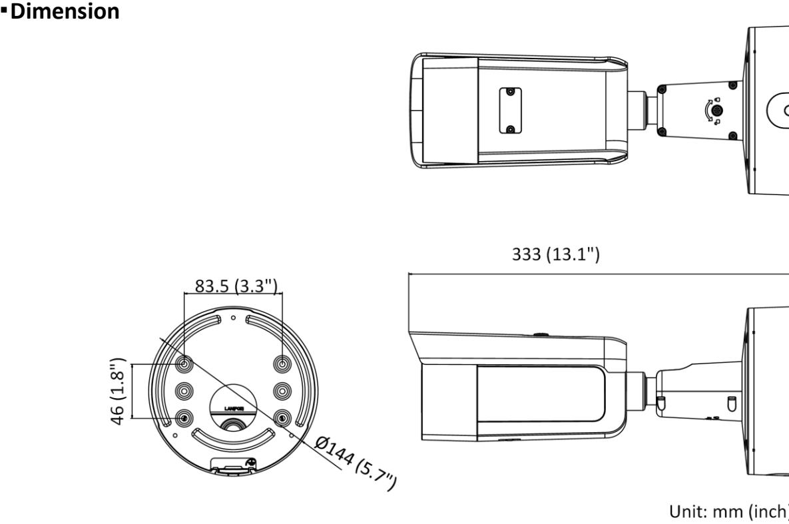
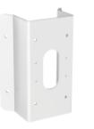
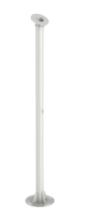
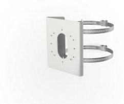

**DS-2CD2626G2-IZS AcuSense 2 MP IR Varifocal Bullet Network Camera**

- High quality imaging with 2 MP resolution
- Excellent low-light performance with powered-by-DarkFighter technology
- Clear imaging against strong back light due to 120 dB true WDR technology
- Efficient H.265+ compression technology
- False alarm reduction through human and vehicle target classification based on deep learning
- -S: audio and alarm interface available
- Water and dust resistant (IP66) and vandal-resistant (IK10)
- 3D DNR technology delivers clean and sharp images

## **AcuSense**

Empowered by deep learning algorithms, Hikvision AcuSense technology brings human or vehicle target classification alarms to front- and back-end devices. The system can greatly reduce false alarms generated by targets other than humans or vehicles, vastly improving alarm efficiency and effectiveness.

## **Specification**

| Camera                      |                                                                                                |  |
|-----------------------------|------------------------------------------------------------------------------------------------|--|
| Image Sensor                | 1/2.8" Progressive Scan CMOS                                                                   |  |
| Min. Illumination           | Color: 0.002 Lux @ (F1.4, AGC ON)                                                              |  |
| Wide Dynamic Range          | 120 dB                                                                                         |  |
| Day & Night                 | ICR Cut                                                                                        |  |
| Shutter Speed               | 1/3 s to 1/100,000 s                                                                           |  |
| Slow Shutter                | Yes                                                                                            |  |
| Angle Adjustment            | Pan: 0° to 355°, tilt: 0° to 90°, rotate: 0° to 360°                                           |  |
| P/N                         | P/N                                                                                            |  |
| Power-off Memory            | Yes                                                                                            |  |
| Lens                        |                                                                                                |  |
| Lens Type & FOV             | 2.8 to 12 mm, horizontal FOV 113° to 31°, vertical FOV 58° to 18°, diagonal FOV 138° to 36° |  |
| Aperture                    | F1.4                                                                                           |  |
| Lens Mount                  | Ø 14                                                                                           |  |
| Aperture Type               | Fixed                                                                                          |  |
| Focus                       | Auto                                                                                           |  |
| Illuminator                 |                                                                                                |  |
| IR Range                    | Up to 60 m                                                                                     |  |
| Wavelength                  | 850 nm                                                                                         |  |
| Smart Supplement Light      | Yes                                                                                            |  |
| Supplement Light            | IR                                                                                             |  |
| Video                       |                                                                                                |  |
| Max. Resolution             | 1920 × 1080                                                                                    |  |
|                             | 50Hz: 25fps (1920 × 1080, 1280 × 720)                                                          |  |
| Main Stream                 | 60Hz: 30fps (1920 × 1080, 1280 × 720)                                                          |  |
|                             | 50Hz: 25fps (640 × 480, 640 × 360, 320 × 240)                                                  |  |
| Sub Stream                  | 60Hz: 30fps (640 × 480, 640 × 360, 320 × 240)                                                  |  |
| Third Stream                | 50Hz: 25fps (1280 × 720, 640 × 480, 640 × 360, 360 × 240)                                      |  |
|                             | 60Hz: 30fps (1280 × 720, 640 × 480, 640 × 360, 360 × 240)                                      |  |
| Video Compression           | Main stream: H.265/H.264                                                                       |  |
|                             | Sub-stream: H.265/H.264/MJPEG                                                                  |  |
|                             | Third stream: H.265/H.264                                                                      |  |
| Video Bit Rate              | 32 Kbps to 8 Mbps                                                                              |  |
| H.264 Type                  | Baseline Profile/Main Profile/High Profile                                                     |  |
| H.265 Type                  | Main Profile                                                                                   |  |
| H.264+                      | Main Stream supports                                                                           |  |
| H.265+                      | Main Stream supports                                                                           |  |
| Bit Rate Control            | CBR/VBR                                                                                        |  |
| Scalable Video Coding (SVC) | Yes                                                                                            |  |
| Region of Interest (ROI)    | 1 fixed region for each stream                                                                 |  |
| Audio                       |                                                                                                |  |
| Environment Noise Filtering | Yes                                                                                            |  |

| Audio Sampling Rate                   | 8 kHz/16 kHz/32 kHz/44.1 kHz/48 kHz                                                                                                                                                                                                                                 |  |
|---------------------------------------|---------------------------------------------------------------------------------------------------------------------------------------------------------------------------------------------------------------------------------------------------------------------|--|
| Audio Compression                     | G.711ulaw/G.711alaw/G.722.1/G.726/MP2L2/PCM/MP3                                                                                                                                                                                                                     |  |
| Audio Bit Rate                        | 64Kbps(G.711ulaw/G.711alaw)/16Kbps(G.722.1)/16Kbps(G.726)/32-192Kbps(MP2L2)/ 8-320Kbps(MP3)                                                                                                                                                                      |  |
| Network                               |                                                                                                                                                                                                                                                                     |  |
| Simultaneous Live View                | Up to 6 channels                                                                                                                                                                                                                                                    |  |
| API                                   | ONVIF (PROFILE S, PROFILE G, PROFILE T), ISAPI, SDK                                                                                                                                                                                                                 |  |
| Protocols                             | TCP/IP, ICMP, HTTP, HTTPS, FTP, DHCP, DNS, DDNS, RTP, RTSP, NTP, UPnP, SMTP, IGMP, 802.1X, QoS, IPv6, UDP, Bonjour, SSL/TLS                                                                                                                                      |  |
| Smooth Streaming                      | Yes                                                                                                                                                                                                                                                                 |  |
| User/Host                             | Up to 32 users. 3 user levels: administrator, operator and user                                                                                                                                                                                                     |  |
| Security                              | Password protection, complicated password, HTTPS encryption, IP address filter, Security Audit Log, basic and digest authentication for HTTP/HTTPS, TLS 1.2, WSSE and digest authentication for ONVIF                                                         |  |
| Network Storage                       | MicroSD/SDHC/SDXC card (256 GB) local storage, and NAS (NFS, SMB/CIFS), auto network replenishment (ANR) Together with high-end Hikvision memory card, memory card encryption and health detection are supported                                           |  |
| Client                                | iVMS-4200, Hik-Connect, Hik-Central                                                                                                                                                                                                                                 |  |
| Web Browser                           | Plug-in required live view: IE8+, Chrome 41.0-44, Firefox 30.0-51, Safari 8.0-11 Plug-in free live view: Chrome 57.0+, Firefox 52.0+                                                                                                                             |  |
| Image                                 |                                                                                                                                                                                                                                                                     |  |
| Day/Night Switch                      | Day, Night, Auto, Schedule                                                                                                                                                                                                                                          |  |
| Image Enhancement                     | BLC, HLC, 3D DNR                                                                                                                                                                                                                                                    |  |
| Image Parameters Switch               | Yes                                                                                                                                                                                                                                                                 |  |
| Image Settings                        | Rotate mode, saturation, brightness, contrast, sharpness, gain, white balance adjustable by client software or web browser                                                                                                                                       |  |
| Interface                             |                                                                                                                                                                                                                                                                     |  |
| Alarm                                 | 1 input, 1 output (max. 24 VDC/24 VAC @500 mA)                                                                                                                                                                                                                      |  |
| Audio                                 | 1 input (line in), 3.5 mm connector, max. input amplitude: 3.3 Vpp, input impedance: 4.7 KΩ, interface type: non-equilibrium; 1 output (line out), 3.5 mm connector, max. output amplitude: 3.3 Vpp, output impedance: 100 Ω, interface type: non-equilibrium |  |
| On-board Storage                      | Built-in micro SD slot, up to 256 GB                                                                                                                                                                                                                                |  |
| Hardware Reset                        | Yes                                                                                                                                                                                                                                                                 |  |
| Communication Interface               | 1 RJ45 10M/100M self-adaptive Ethernet port                                                                                                                                                                                                                         |  |
| Intelligent (Traditional Algorithm)   |                                                                                                                                                                                                                                                                     |  |
| Basic Event                           | Motion detection, video tampering alarm, exception (network disconnected, IP address conflict, illegal login, HDD full, HDD error), scene change detection                                                                                                       |  |
| Intelligent (Deep Learning Algorithm) |                                                                                                                                                                                                                                                                     |  |
| Face Capture                          | Yes                                                                                                                                                                                                                                                                 |  |
| Premier Protection                    | Line crossing detection, intrusion detection, region entrance detection, region exiting detection                                                                                                                                                                |  |
| General                               |                                                                                                                                                                                                                                                                     |  |
| Storage Conditions                    | -30 °C to 60 °C (-22 °F to 140 °F). Humidity 95% or less (non-condensing)                                                                                                                                                                                           |  |
| Startup and Operating Conditions   | -30 °C to 60 °C (-22 °F to 140 °F). Humidity 95% or less (non-condensing)                                                                                                                                                                                           |  |

| Power Supply          | 12 VDC ± 25%, reverse polarity protection                                                   |
|-----------------------|---------------------------------------------------------------------------------------------|
|                       | PoE: 802.3at, class 4                                                                       |
| Power Consumption and | 12 VDC, 1.12 A, max. 13.5 W                                                                 |
| Current               | PoE: (802.3at, 42.5 V to 57 V), 0.5 A to 0.3A, max. 15 W                                    |
| Power Interface       | Two-core terminal block                                                                     |
| Material              | Metal                                                                                       |
| Camera Dimension      | Ø 144 × 333 mm (5.7" × 13.1")                                                               |
| Package Dimension     | 385 × 190 × 180 mm (15.2" × 7.5" × 7.1")                                                    |
| Camera Weight         | Approx. 1450 g (3.2 lb.)                                                                    |
| With Package Weight   | Approx. 2589 g (5.7 lb.)                                                                    |
| Linkage Method        | Upload to NAS/memory card, notify surveillance center, trigger record, trigger capture,     |
|                       | audible warning                                                                             |
| Web Client Language   | 33 languages                                                                                |
|                       | English, Russian, Estonian, Bulgarian, Hungarian, Greek, German, Italian, Czech, Slovak,    |
|                       | French, Polish, Dutch, Portuguese, Spanish, Romanian, Danish, Swedish, Norwegian,           |
|                       | Finnish, Croatian, Slovenian, Serbian, Turkish, Korean, Traditional Chinese, Thai,          |
|                       | Vietnamese, Japanese, Latvian, Lithuanian, Portuguese (Brazil), Ukrainian                   |
| General Function      | Anti-flicker, heartbeat, mirror, privacy masks, flash log, password reset via e-mail, pixel |
|                       | counter                                                                                     |
| Software Reset        | Yes                                                                                         |
| Approval              |                                                                                             |
| EMC                   | FCC (47 CFR Part 15, Subpart B); CE-EMC (EN 55032: 2015, EN 61000-3-2: 2014, EN             |
|                       | 61000-3-3: 2013, EN 50130-4: 2011 +A1: 2014); RCM (AS/NZS CISPR 32: 2015); IC               |
|                       | (ICES-003: Issue 6, 2016); KC (KN 32: 2015, KN 35: 2015)                                    |
| Safety                | UL (UL 60950-1); CB (IEC 60950-1:2005 + Am 1:2009 + Am 2:2013); CE-LVD (EN                  |
|                       | 60950-1:2005 + Am 1:2009 + Am 2:2013); BIS (IS 13252(Part                                   |
|                       | 1):2010+A1:2013+A2:2015); LOA (IEC/EN 60950-1)                                              |
| Environment           | CE-RoHS (2011/65/EU); WEEE (2012/19/EU); Reach (Regulation (EC) No 1907/2006)               |
| Protection            | Ingression protection: IP66 (IEC 60529-2013), IK10 (IEC 62262:2002)                         |

## **Available Model**

DS-2CD2626G2-IZS(2.8 to 12 mm)

**Accessory**

DS-1476ZJ-SUS DS-2251ZJ DS-1275ZJ-S-SUS Corner Mount Column Mount Vertical Pole Mount

Distributed by

L

## Headquarters

No.555 Qianmo Road, Binjiang District, Hangzhou 310051, China T +86-571-8807-5998 overseasbusiness@hikvision.com

 Hikvision USA T +1-909-895-0400 sales.usa@hikvision.com

Hikvision Australia T +61-2-8599-4233 salesau@hikvision.com

Hikvision India T +91-22-28469900 sales@pramahikvision.com

Hikvision Canada T +1-866-200-6690 sales.canada(@hikvision.com

Hikvision Thailand T +662-275-9949 sales.thailand@hikvision.com Hikvision Europe T +31-23-5542770 sales.eu@hikvision.com

Hikvision Italy

T +39-0438-6902 info.it@hikvision.com Hikvision Brazil T +55 11 3318-0050

Latam.support@hikvision.com Hikvision Turkey
T +90 (216)521 7070- 7074 sales.tr@hikvision.com

Hikvision Malaysia T +601-7652-2413 sales.my@hikvision.com Hikvision UK & Ireland T +01628-902140 sales.uk@hikvision.com

Hikvision South Africa Tel: +27 (10) 0351172 sale.africa@hikvision.com

Hikvision France
T +33(0)1-85-330-450 info.fr@hikvision.com

Hikvision Kazakhstan T +7-727-9730667 nikia.panfilov@hikvision.ru

Hikvision Vietnam T +84-974270888 sales.vt@hikvision.com Hikvision UAE
T +971-4-4432090 salesme@hikvision.com

Hikvision Singapore T +65-6684-4718 sg@hikvision.com

Hikvision Spain T +34-91-737-16-55 info.es@hikvision.com

Hikvision Tashkent T +99-87-1238-9438 uzb@hikvision.ru

Hikvision Hong Kong 1 +852-2151-1761 info.hk@hikvision.com Hikvision Russia
T +7-495-669-67-99 saleru@hikvision.com

Hikvision Korea T +82-(0)31-731-8817 sales.korea@hikvision.com

Hikvision Poland T +48-22-460-01-50 info.pl@hikvision.com

Hikvision Indonesia T +62-21-2933759 Sales.Indonesia@hikvision.com

Hikvision Colombia sales.colombia@hikvision.com

© Hikvision Digital Technology Co., Ltd. 2020 | Data subject to change without notice |

050513020200514