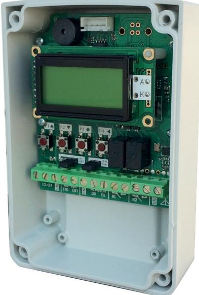
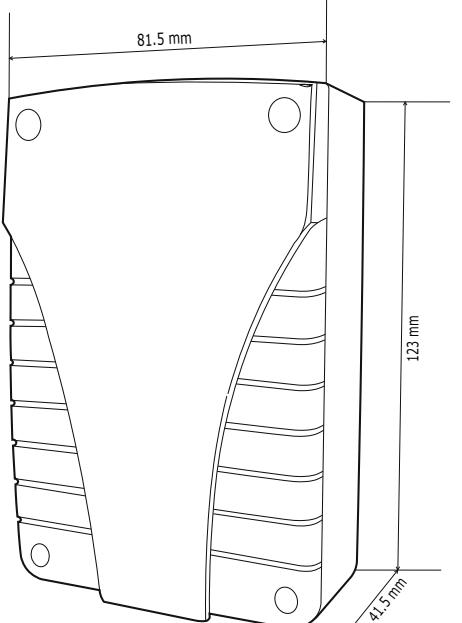
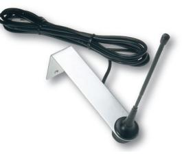
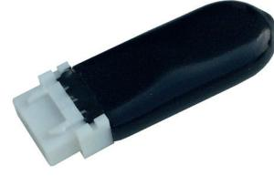

# **Produktblad**

## **Radiomottagare - SEL2641R433-WPL4K**

### **Produktbeskrivning**

Radiomottagare som kan användas både som stand-alone och kopplas mot passersystem.

Stand-alone: Radiomottagare med plats för 4000 sändare. Två reläutgångar programmerbara som puls, växlande eller tidsstyrda.

Passersystem: Radiomottagaren har utgångar både för wiegand-protokoll och RS485. Radiomottagaren kan kopplas mot ett passersystem för att ersätta en traditionell kortläsare, då används radiosändarna istället för kort, varje radiosändare tilldelas till en användare i systemet och precis som med en passerbricka kan man begränsa tillträdet för användarna till vissa tider på dygnet och alla passager registreras i händelseloggen för systemet.

#### **Funktioner**

- För standalone, wiegand eller RS485
- Kan monteras utomhus
- Kryptering: KeeLoq® Rolling Code
- Kan programmeras som puls, växlande och tid
- Lagrar upp till 4000 sändare

*IK10*

### **Teknisk information**

**Utgångar:** Två reläutgångar (2 NO) Wiegand - 26, 30 och 44 bitar RS485 - ASCII, Modbus-RTU och OSDP **Max belastning:** 24VA **Funktioner:** Puls, växlande eller tid (1s-24t:59m) **Antal sändare:** 4000 sändare **LCD-display för programmering:** Ja **Inbyggt EEPROM-minne:** Ja **Ingång för extern antenn:** Ja **Känslighet:** -112dBm **Ingångsimpedans:** 50 Ohm **Frekvens:** 433.92 MHz **Radiotyp:** Superheterodyn **Kryptering:** KeeLoq ® Rolling Code **Moduleringar:** AM/ASK **Kodkombinationer:**  264 **Dimensioner (L x B x H):** 123 x 81,5 x 41,5mm **Spänningsmatning:** 12 eller 24Vac/dc **Strömförbrukning:** 90mA **Kapslingsklass:** IP55 **Temperaturområde:** -10°C till +70°C

#### **Tillbehör**

**SEA433** Extern antenn **SEL2641-MXPL** Backupminne till radiomottagare

#### **Passar till följande passersystem**

CDVI Atrium Vanderbilt Omnis, Entro Bravida Integra

