Premium metal body. Excellent design and production quality for extreme durability.

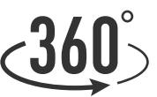

Quad Split-Screen

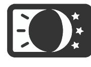

Supports MicroSD card up to 128GB.

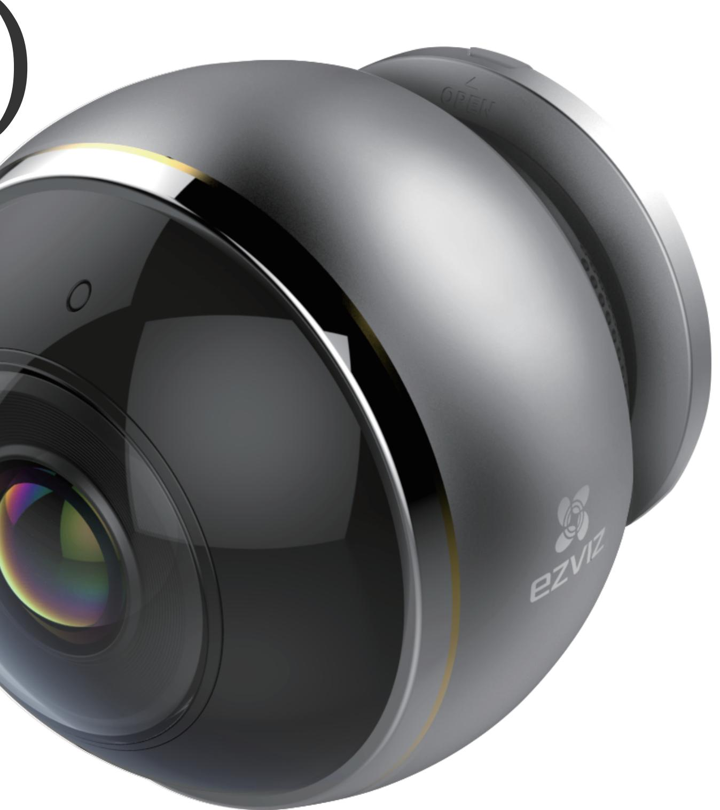

360° omnidirectional monitoring. One camera, complete coverage.

2.4GHz/5GHz dual band Wi-Fi. Smart configuration via QR code.

Triple HD resolution 3 megapixels and fisheye up to 1344*1344

True Day/Night camera with auto-switching. Infrared night vision up to 7.5 meters.

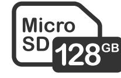

Two-way audio. Pickup distance up to 5 meters.

# C6P (ez360 Pano)

# 360° Fisheye Security. Zero Blind Spots.

A panoramic Wi-Fi camera offering complete coverage without any blind spots.

#### Key Features

#### Multiple viewing modes

Enjoy four different screen viewing modes to meet your specific needs.

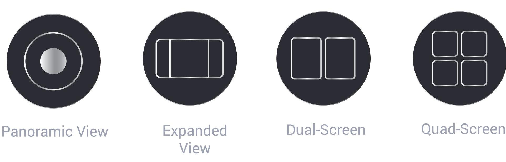

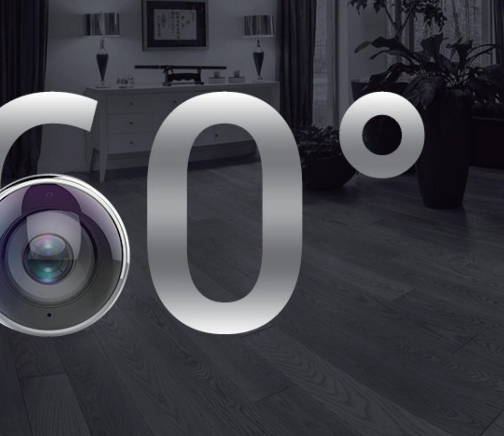

#### 360° panoramic view

With a 360° panoramic view, the C6P (ez360 Pano) provides complete perspective, leaving no corners unwatched.

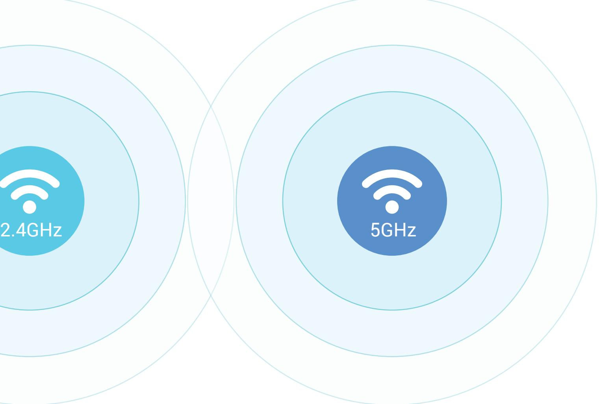

Supports 2.4 GHz and 5.0 GHz Wi-Fi connectivity, ensuring stable and smooth wireless transmission.

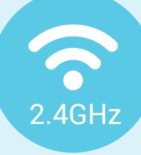

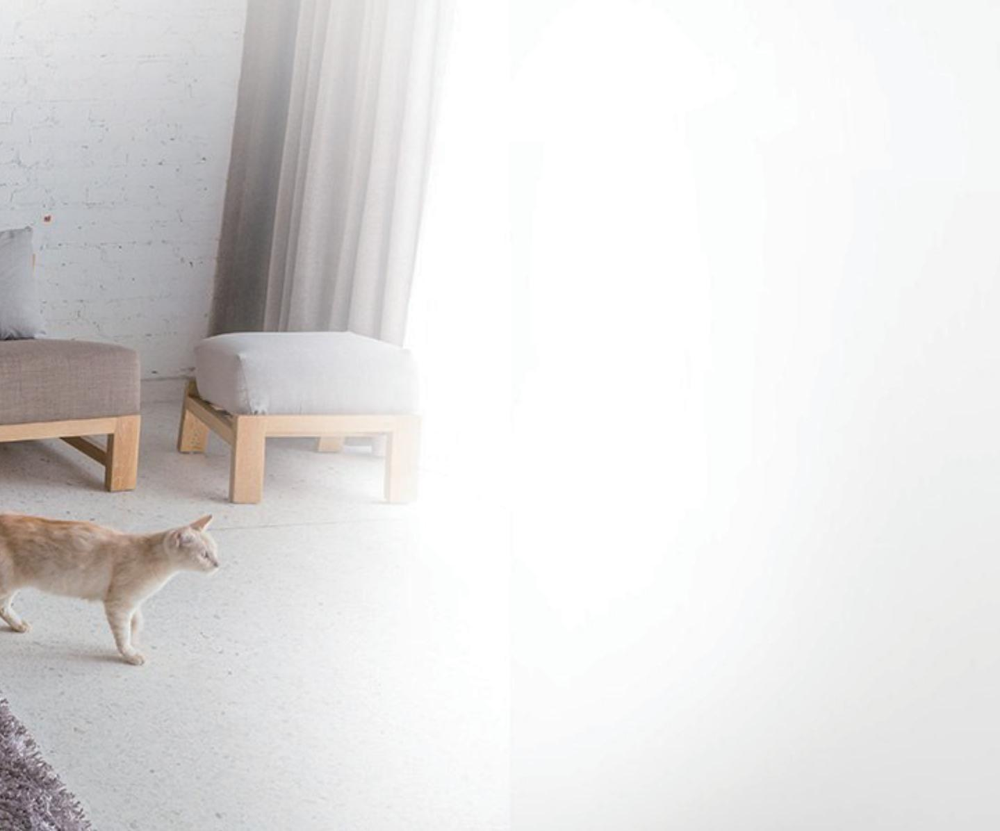

### Dual-band Wi-Fi

The 3MP sensor delivers crystal clear imagery.

#### Super HD camera

The built-in microphone and speaker deliver crystal-clear, smooth voice transmission in real time.

#### Two-way audio

The C6P (ez360 Pano) watches for movement. It will take a picture and send alerts to your smartphone when it detects motions.

# Instant alerts (manual activation required)

Built with high-strength and anti-corrosion aluminum.

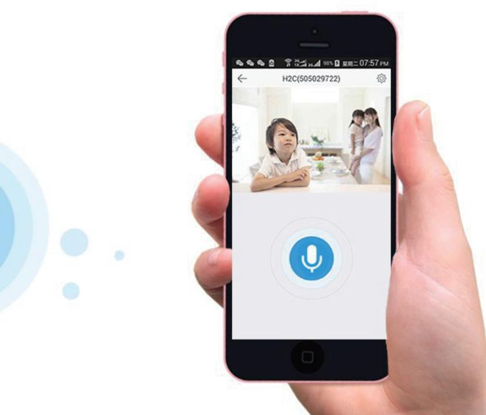

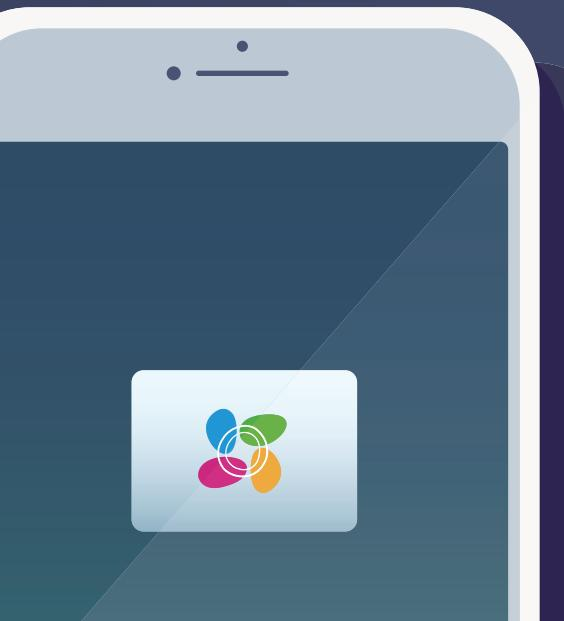

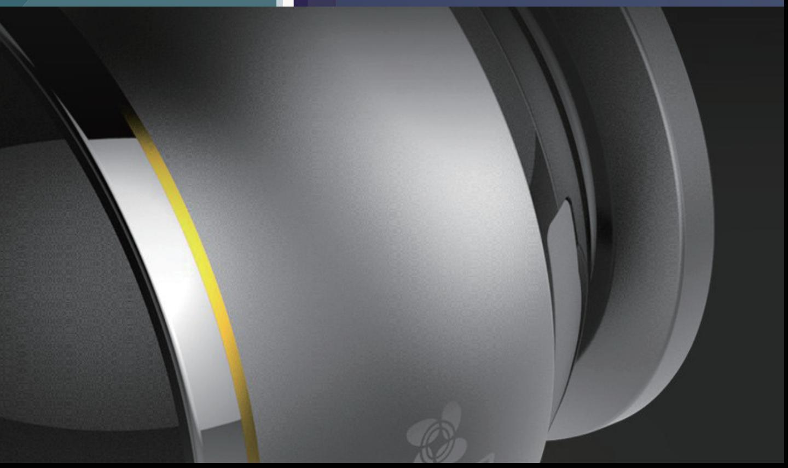

#### Durable metal body

| Storage            | Supports MicroSD card (max. 128GB)                                                             |
|--------------------|------------------------------------------------------------------------------------------------|
| Smart Alarm        | Motion detection                                                                               |
| Wi-Fi Pairing      | SmartConfig (Wi-Fi One-Key Configuration)                                                      |
| Protocol           | EZVIZ Cloud proprietary protocol                                                               |
| Interface Protocol | EZVIZ Cloud proprietary protocol                                                               |
| General Features   | Anti-Flicker, Dual-Stream, Heartbeat Messages, Mirror Image, Password Protection, Watermark |
| Minimum Network    | 2Mbps                                                                                          |

| Image Sensor         | 3 Megapixel 1/2.8" Progressive Scan CMOS                    | Storage                   |
|----------------------|-------------------------------------------------------------|---------------------------|
| Minimum illumination | 0.01 lux @(F2.2,AGC ON), 0 lux with IR                      | Smart Alarm               |
| Shutter Speed        | Self-adaptive shutter                                       | Wi-Fi Pairing Protocol |
| Lens                 | 1.2mm@ F2.2, Horizontal angle: 180° Diagonal angle: 180° | Interface Protocol        |
| Lens Mount           | M12                                                         |                           |
| Day & Night          | IR-cut filter                                               | Minimum Network           |
| DNR                  | 3D DNR                                                      | Requirements              |
| WDR                  | Progressive WDR                                             | Wi-Fi                     |
|                      |                                                             |                           |

Network

Camera

#### Compression

| Video Compression | H.264                                       |
|-------------------|---------------------------------------------|
| H.264 Type        | Main Profile                                |
| Video Bit Rate    | HD, Balanced and Smooth. Adaptive bit rate. |

#### Image

| Max. Resolution | 1344×1344                                                                 |
|-----------------|---------------------------------------------------------------------------|
| Image Settings  | Brightness, contrast, saturation, etc. (configurable via EZVIZ Studio) |
| BLC             | Support                                                                   |

| Wi-Fi             |                                                               |  |
|-------------------|---------------------------------------------------------------|--|
| Standard          | IEEE802.11a/b/g/n/ac                                          |  |
| Frequency Range   | 2.412GHz ~ 2.462GHz/5.15GHz ~ 5.35GHz/ 5.725GHz ~ 5.825GHz |  |
| Channel Bandwidth | Supports 20MHz                                                |  |
| Security          | WEP, WPA/WPA2, WPA-PSK/WPA2-PSK                               |  |
| Transmission Rate | 11b: 11Mbps, 11g: 54Mbps, 11n: 135Mbps                        |  |
| General           |                                                               |  |
|                   |                                                               |  |

#### Specifications Model CS-CV346-A0-7A3WFR

#### General

| Power Supply         | DC 5V±5%                                        |  |
|----------------------|-------------------------------------------------|--|
| Power Consumption    | Max. 8W                                         |  |
| IR Range             | MAX. 7.5meters                                  |  |
| Product Dimensions   | 70mm x 70mm x 70.6mm (0.23ft x 0.23ft x 0.23ft) |  |
| Packaging Dimensions | 109.5mm x 109.5mm x 123mm                       |  |
| Weight               | 0.489 lb. (222g)                                |  |
|                      |                                                 |  |

## Package Contents: Requirements

- C6P (ez360 Pano) X 1
- Base X 1
- 3 Meters Power Cable X 1
- Screw Kit X 1
- Power Adapter X 1
- Base Cover X 1
- Drill Template X 1
- Quick Start Guide X 1

- Operating Conditions: -10°C ~ 45°C, Humidity 95% or less (non-condensing)

### Certificates

FCC/UL/IC/NOM/CE/RoHS/WEEE/REACH

Specifications are subject to change without notice. EZVIZ is a registered trademark of Hangzhou EZVIZ Network Co., Ltd. Other brands and product names are trademarks or registered trademarks of their respective holders.

https://www.ezvizlife.com/