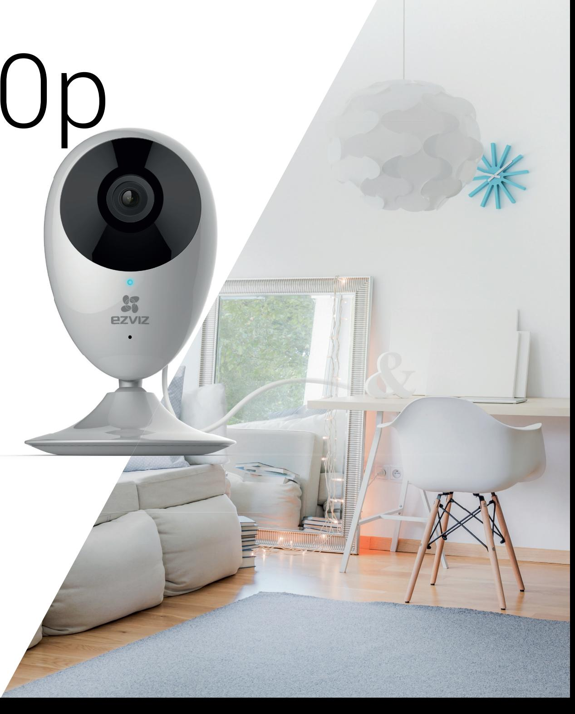
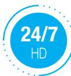
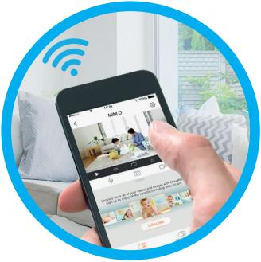
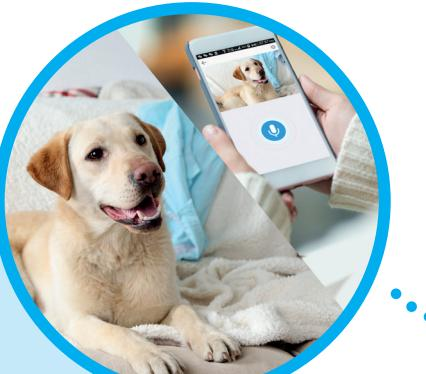
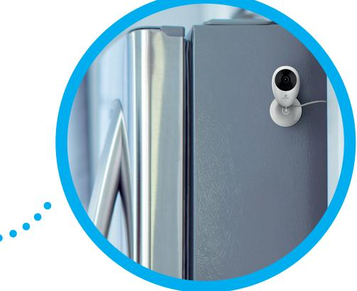
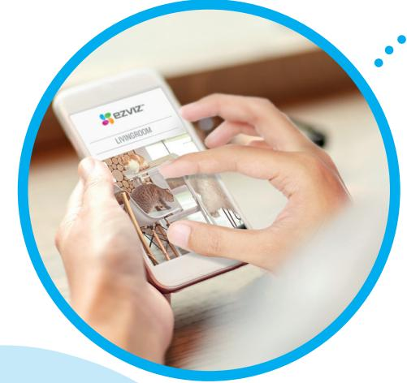
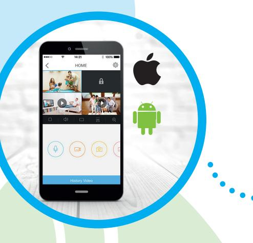
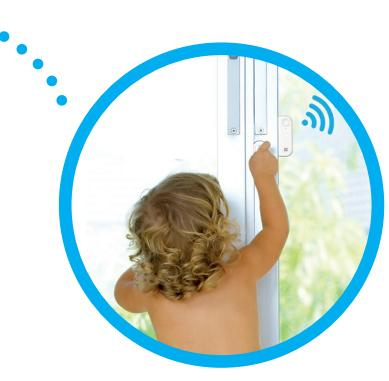

# C2C 1080p

**SEAMLESSLY CONNECT TO YOUR HOME, YOUR OFFICE, YOUR STORE. AND COMMUNICATE WITH YOUR FAMILY AND PETS.**

With the C2C 1080p you always enjoy peace of mind. The C2C 1080p is a Wi-Fi camera that lets you control your home, your store, or your offi ce when you're not there. Is the baby sound asleep? Is the dog doing okay? Is your store or offi ce secure? Just check the app on your smartphone, wherever you are, whenever you want.

### **ABOUT EZVIZ**

EZVIZ helps you app your life. Right from the palm your hand, you connect visually to your home or your work. Welcome to the smart home and business!

## **8x HIGHLIGHTS**

**8x**

**HD resolution** Crystal clear images and videos

**111° viewing angle** Capture the area from a wide angle

**Local storage** Store on an SD card or a recorder

**Built-in 2-way audio** Speak and listen in

**8x**

**Night vision up to 7,5 metres** See what's happening, even in the dark

**8x**

**25 kilo**

**>3˚**

**2 years 3 months**

**1m/ 2h**

**25 kilo**

**2 years 3 months**

**Magnetic base** Easy to install

**8x**

**>3˚**

**25 kilo**

**1m/ 2h**

**2 years 3 months**

**25 kilo**

**25 kilo**

**2 years 3 months**

**1m/ 2h**

**2 years 3 months**

**1m/ 2h**

**25 kilo**

**2 years 3 months**

**1m/ 2h**

**>3˚**

**Wi-Fi ready** No cables required. Plug and go

**>3˚**

**8x**

**25 kilo**

**25 kilo**

**>3˚**

**1m/ 2h**

**2 years 3 months**

**1m/ 2h**

**2 years 3 months**

**1m/ 2h**

**>3˚**

**8x digital zoom** Check the tiniest detail

**8x**

**>3˚**

**>3˚**

## **FEATURES**

#### **ALWAYS CONNECTED. ALWAYS SAFE.**

The C2C 1080p has 24/7 HD live streaming. Don't miss a moment of what's happening. Check the app whenever you want.

#### **SMALL LENS, BIG VISION**

The 111° viewing angle allows you to get a wide view. It feels as if you're physically there.

#### **LISTEN IN AND TALK**

The C2C 1080p comes with a built-in speaker and microphone. Just open the app and listen in or talk to the room using the speaker when there's an intruder or the dog's sleeping on the sofa.

#### **WHEREVER YOU NEED IT**

Install the camera where it suits you best. Thanks to the magnetic base and the placement kit, it literally goes anywhere, even on your fridge.

#### **SEE WHAT'S HAPPENING, EVEN IN THE DARK**

The camera automatically switches to night vision when it's dark. You can watch over your baby's sleep without making any noise or check your store or offi ce during the night.

# **FEATURES**

#### **DOWN TO THE LAST DETAIL**

Thanks to the 8x digital zoom, you can zoom in on every detail.

#### **ALWAYS UP-TO-DATE**

Whenever movement is detected, an instant alert is sent to your mobile phone via an app notifi cation. Know what's happening when it's happening.

#### **STORE AND SHARE IMPORTANT MOMENTS**

The camera has an integrated micro SD card slot that supports up to 128 GB of storage. Ideal to keep a funny video of your toddler. You can also store the pictures and videos on the EZVIZ wireless NVR X3 video recorder.

#### **INTEGRATED EZVIZ SOLUTION**

The C2C 1080p connects with all EZVIZ sensors (for pets, sirens, water leaks, doors and windows). All-round security at your fi ngertips.

#### **ONE APP DOES ALL THE WORK**

With the easy-to-use EZVIZ app, you can view up to four live video streams at the same time. You can connect all your EZVIZ security devices on one and the same app.

# **SPECIFICATIONS**

#### **CAMERA**

| Image sensor         | 1/4" 1MP HD progressive scan CMOS        |
|----------------------|------------------------------------------|
| Minimum Illumination | 0.02Lux @(f/2.2, AGC ON) , 0 Lux with IR |
| Shutter              | Self-adaptive shutter                    |
| Lens                 | 2.8mm 111°(Diagonal) 92°(Horizontal)     |
| Lens Mount           | M12                                      |
| Day & Night          | IR cut filter                            |
| DNR                  | 3D DNR                                   |
| IR Range             | Up to 7,5m                               |
| WDR                  | Digital WDR                              |
| Audio                | Built-in Microphone and Speaker          |

#### **COMPRESSION**

| Video Compression | H.264 Main Profile |
|-------------------|--------------------|
|                   |                    |
| Audio compression | AAC                |
| Audio Bit Rate    | Self-adaptive      |

**Video Bit Rate** HD, balance, and fluency. Adaptive bit rate.

#### **IMAGE**

**Max. Resolution** 1280x720

**Frame Rate** Self-adaptive Max: 25fps

#### **NETWORK**

| Storage                | Support micro SD card (≤ 128 GB)                                                       |
|------------------------|----------------------------------------------------------------------------------------|
| Smart Alarm            | Smart motion detection                                                                 |
| One-key confi guration | SmartConfig (Wi-Fi one-key configuration)                                              |
| Interface Protocol     | Ezviz cloud proprietary protocol                                                       |
| General Function       | Anti-Flicker, Dual-stream, Heart Beat, Mirror Image, Password Protection, Watermark |

#### **WIRELESS PARAMETERS**

| Standard          | IEEE802.11b, 802.11g, 802.11n              |
|-------------------|--------------------------------------------|
| Frequency Range   | 2.4GHz to 2.4835GHz                        |
| Channel Bandwidth | Support 20MHz                              |
| Security          | 64/128-bit WEP, WPA/WPA2, WPA-PSK/WPA2-PSK |
| Transmission Rate | 11b: 11Mbps, 11g: 54Mbps, 11n: 150Mbps     |

#### **GENERAL**

## **Power Supply** DC 5V±10% **Power Consumption** 3.5W Maximum **Dimensions** 128mm*58mm*38mm **Weight** 120 g

**Operating Conditions** -10ºC to 50ºC, Humidity 95% or less (non-condensing)

#### **What's in the box?**

1 x EZVIZ C2C 1080p camera 1 x Power adapter 1 x Metal plate 1 x Foam sticker 1 x Screw Kit 1 x Quick Start Guide