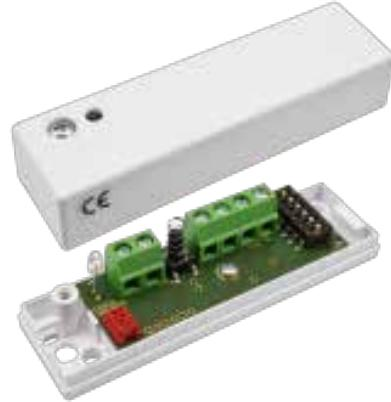
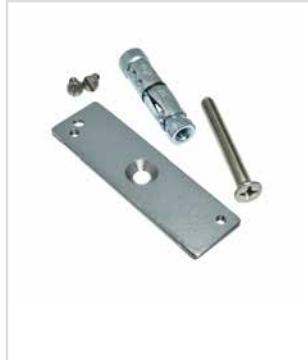

# CD 470

# Chockdetektor

### **Produktdetajler:**

| Godkännanden                               | EN 50131-2-8 Grad 2, SBSC Klass 2, VdS Klasse B |
|--------------------------------------------|----------------------------------------------------|
| Inspänning                                 | 8 – 15 VDC (DAG läge), 6 VDC (NATT läge)        |
| Larmutgång                                 | Relä (Max 50V / 120 mA), R upp till 30 Ω        |
| Larmindikering                             | LED, DAG/NATT kontrollerad                         |
| Hålltid larm                               | 4s (vid autoreset) alt. låser i larmläge        |
| Larmåterställning                          | Bryt spänningen på ingången (upp till 1 V)      |
| Arbetstemperatur                           | -40°C till +55°C                                   |
| Kapsling, Färg                             | ABS Plast i vit färg                               |
| Kapslingsklass                             | IP 42                                              |
| Mått (L x B x H) mm                        | 80 x 23 x 20 mm                                    |
| Sabotageutgång                             | Relä (Max 50V / 120 mA), R upp till 30 Ω        |
| Detektionsradie                            | Upp till 3m                                        |
| DAG- och NATT-kontroll                     | DAG 8V, NATT 6V matningsspänning                   |
| Lågspänningslarm eller fel i elektronik | upp till 5V indikeras med blinkande LED         |
| Strömförbrukning i vila / vid larm         | 8.0 mA (vid 12 V)/7.1 mA (vid 12 V)                |

CD 470 erbjuder pålitlig övervakning mot angrepp med mekaniska verktyg. CD 470 är en selektivt avkännande vibrationsdetektor med 3 separata detektionskanaler: en integrationskanal/sågkanal för svaga signaler med lång varaktighet, en räknekanal som känner av stark påverkan på den övervakade ytan och en explosionskanal som känner av mycket starka signaler från t.ex. en explosion.

CD 470 delar design med CD 475 men har inbyggda reläer för larm- och sabotageutgångarna. Detta medger att GD 470 kopplas direkt till larmets centralenhet, ingen analysatorenhet behövs. CD 470 polaritetsoberoende, precis som CD 475.

#### **EGENSKAPER**

- Reläutgångar för larm och sabotage
- Polaritetsoberoende
- 3 separata detektionskanaler
- Täckningsradie upp till 3m
- Motståndskraftig mot störningar
- Detaljerad känslighetsinställning
- Lämplig för 24 timmars övervakning
- DAG och NATT kontroll av LED

## **Relaterade produkter och tillbehör:**

Powered by TCPDF (www.tcpdf.org)

### **MP 550**

Monteringsplatta för CD 550