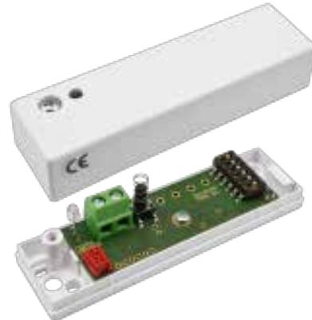

# CD 475

## Chockdetektor

### **Produktdetajler:**

| Godkännanden                               | EN 50131-2-8 Grad 3, SBSC Klass 3, VdS Klasse C |
|--------------------------------------------|----------------------------------------------------|
| Larmutgång                                 | Transistor                                         |
| Larmindikering                             | LED, DAG/NATT kontrollerad                         |
| Hålltid larm                               | Låser i larmläge                                   |
| Larmåterställning                          | Spänningen över detektorn under 1 V             |
| Arbetstemperatur                           | -40°C till +55°C                                   |
| Kapsling, Färg                             | ABS Plast i vit färg                               |
| Kapslingsklass                             | IP 42                                              |
| Mått (L x B x H) mm                        | 80 x 23 x 20 mm                                    |
| Detektionsradie                            | Upp till 3m                                        |
| DAG- och NATT-kontroll                     | DAG 8V, NATT 6V på slingan                         |
| Lågspänningslarm eller fel i elektronik | under 5V indikeras med blinkande LED            |
| Strömförbrukning i vila / vid larm         | 2.5 mA / 4.4 mA                                    |
| Spänningsområde över detektor i IU loop | 8V i DAG-läge, 6V i NATT-läge                      |
| Sabotageutgång                             | Transistor                                         |
|                                            |                                                    |

CD 475 erbjuder pålitlig övervakning mot angrepp med mekaniska verktyg. CD 475 är en selektivt avkännande vibrationsdetektor med 3 separata detektionskanaler: en integrationskanal/sågkanal för svaga signaler med lång varaktighet, en räknekanal som känner av stark påverkan på den övervakade ytan och en explosionskanal som känner av mycket starka signaler från t.ex. en explosion.

CD 475 delar design med CD 470 men måste kopplas till analysatorn IU 400 för larmindikering eftersom den saknar inbyggda reläutgångar. Vid larm ökar strömförbrukningen i detektorn vilket analysatorn IU400 känner av och ger larm. CD 475 polaritetsoberoende, precis som CD 470.

#### **EGENSKAPER**

- EN Grad 3, SBSC Klass 3
- Polaritetsoberoende
- 3 separata detektionskanaler
- Täckningsradie upp till 3m
- Motståndskraftig mot störningar
- Detaljerad känslighetsinställning
- Lämplig för 24 timmars övervakning
- Låg strömförbrukning
- DAG och NATT kontroll av LED

### **Relaterade produkter och tillbehör:**

| 3041 BYGLINGSPLINT 1 > 10 PAR                           |  |
|---------------------------------------------------------------|--|
| 4101 KOPPLINGSBOX I PLAST, IP55                         |  |
| IU 400 Analysatorenhet för glaskrossdet ektor GD 475 |  |
| MP 550 Monteringsplatta för CD 550                      |  |

Powered by TCPDF (www.tcpdf.org)