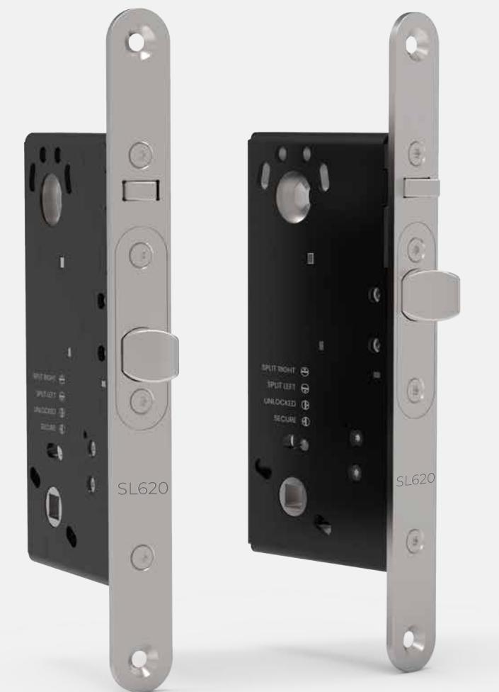
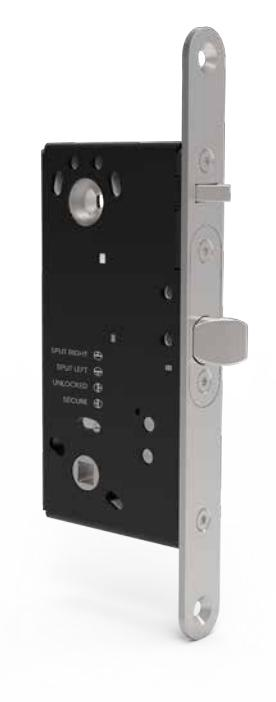
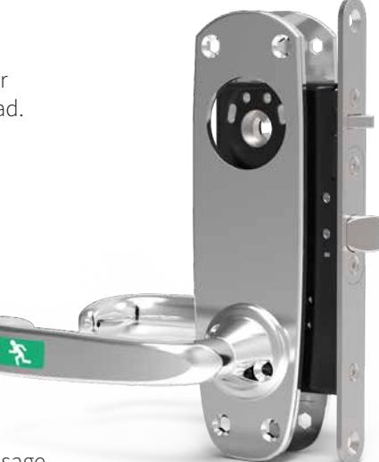
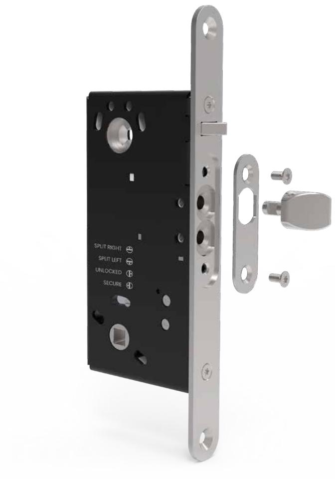
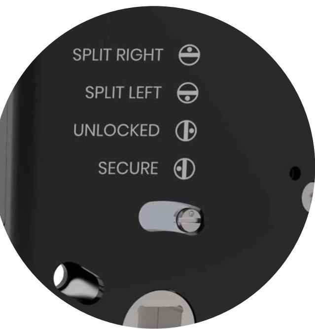

TRON

Ni hittar alltid det senaste på safetron.com

## E LT R Y C K E S L Å S SL620

# Eltryckeslås med hybridteknologi

SAFETRON SL620 är nästa generationens multifunktionella eltryckeslås med split funktion och patentsökt hybridteknologi.

Typiska användningsområden är intern låsning av högfrekventa dörrar i affärsbyggnader, sjukhus, skolor, industrier samt flerfamiljsbostäder där hög driftsäkerhet är nödvändigt.

Indikering ges för förregling, tryckesrörelse, dörrstatus genom magnetkontakt samt vredindikering. Vredindikeringen ger möjlighet att plocka ut larm vid obehörig cylinderpassage. SL620 finns i rättvänd alternativt omvänd funktion (SL621).

#### SAFETRON hybridteknologi

SAFETRON SL620 har en patentsökt hybridteknologi som möjliggör ändring av kolvplacering. Detta innebär att låset kan användas tillsammans med slutbleck och karmurtag anpassade för både ASSA connect samt ASSA classic modul serierna.

#### Split funktion

SAFETRON SL620 har split funktion vilket innebär att utsidans trycke är elektriskt styrt medan insidans trycke alltid är mekaniskt inkopplat och därigenom alltid medger en mekanisk utpassage. På detta sätt elimineras behovet av en öppnaknapp på insidan.

#### Marknadens lägsta strömförbrukning

SL620 har den lägsta strömförbrukning i segmentet med endast 25mA. Detta bidrar starkt till en mer kostnadseffektiv dörrmiljö, speciellt i större anläggningar där dimensionering av transformatorer och batteribackup annars kan innebära en stor kostnad.

#### Brandklassad

SAFETRON SL620 uppfyller kraven för användning i brandcellsgränser högst brandteknisk klass 120 min.

#### Nödutrymning

Tillsammans med SAFETRON nödutrymningsbehör 793 uppfyller SL620 kraven enligt SS-EN 179:2008. SAFETRON 793 är ett nödutrymningstrycke som möjliggör en normal passage genom trycke samtidigt som samma trycke utgör en godkänd nödutrymning. Indikering från trycket ges via inbyggd givare för att säkerställa att godkänd passage skett.

| BENÄMNING                         | ART NR    |
|-----------------------------------|-----------|
| SAFETRON Nödutrymningsbehör 793 H | 202144777 |
| SAFETRON Nödutrymningsbehör 793 V | 202144799 |

Besök safetron.com och se våra animeringar på kolv och funktionsändring

### Ändring av kolvplacering

Med SAFETRON hybridteknologi ändrar man enkelt kolvplaceringen. Detta sker lika enkelt som en traditionell vändning av kolv. Två skruvar i stolpen samt kolvens fästskruv lossas, skifta placering på kolven. Därefter roteras den inre stolpen 180° och detaljerna kan skruvas tillbaka.

### Anpassad för samtliga dörrar

SAFETRON SL620 är anpassad för att fungera tillsammans med dörrar från samtliga stora dörrproducenter i Skandinavien. Oavsett om dörrmiljön har ett fast eller löst slutbleck, oavsett om den är förberedd för slutbleck i serierna ASSA connect eller ASSA classic modul.

| TEKNISKA DATA    |                  |
|------------------|------------------|
| Spänning         | 10-30 VDC        |
| Strömförbrukning | 25mA, 0mA vila   |
| Arbetstemperatur | -20°C till +40°C |

#### Fyra funktionslägen

Vändning mellan split höger/vänster har aldrig varit enklare. SAFETRON SL620 har genom sin patentsökta funktionsväljare möjligheten att ändra läge mellan split höger/vänster, mellan olåst eller säkerhetsläge.

#### Byggläge

Olåst eller "byggläge" som vi kallar det är ett läge där båda tryckena är mekaniskt påkopplade. Detta läge används med fördel under byggtid när låsen inte är driftsatta. Man undviker således onödigt slitage som kan uppstå när låset istället öppnas med hjälp av verktyg.

#### Säkerhetsläge

'Secure' indikerar säkerhetsläget där båda tryckena är mekaniskt frånkopplade. Detta innebär att passagesystem måste användas från båda sidor. Detta är ett sätt att ytterligare förstärka säkerheten och övervakningen.

| BENÄMNING                      | FUNKTION          | ART NR    |
|--------------------------------|-------------------|-----------|
| SAFETRON SL620                 | Rättvänd funktion | 202144819 |
| SAFETRON SL621                 | Omvänd funktion   | 202144820 |
| SAFETRON SL620 satsförpackning | Rättvänd funktion | 202144821 |
| SAFETRON SL621 satsförpackning | Omvänd funktion   | 202144822 |
|                                |                   |           |

Satsförpackning innehåller:

- Låshus
- Anslutningskabel 10m
- Karmöverföring CT81 (545mm)

#### KVALITET OCH INNOVATION FRÅN SVERIGE

#### **SAFETRON AB**

Säterivägen 18 P.O. Box 2096 65002 Karlstad Sweden

Tel: +46 54 19 02 45 Email: info@safetron.com

www.safetron.com

Ni hittar alltid det senaste på safetron.com