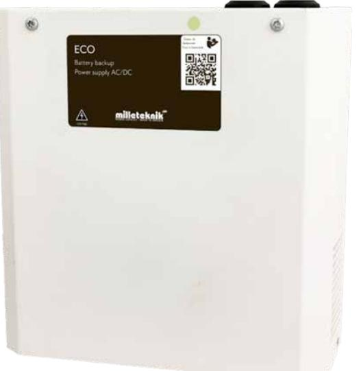
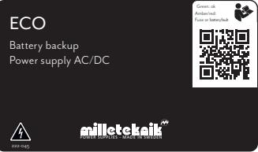
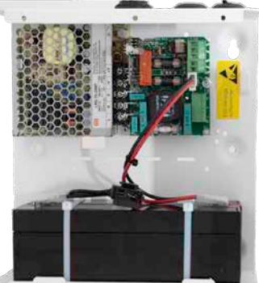

# **Batteribackup ECO S**

#### **Primärswitchad batteribackup 12V eller 24V, upp till 3A med plats för upp till 2x 4,5Ah batterier. Väggmonteras.**

**ECO Small** används huvudsakligen i mindre säkerhetssystem där en enkel och pålitlig strömförsörjning med batteribackupfunktion behövs. ECO Small erbjuder *"KONTROLLERAD LADDNING"*, vilket innebär att batterierna aldrig laddas med mer än 30% av den nominella batterikapaciteten. Detta förhindrar att batterierna överladdas och förlänger deras livslängd avsevärt. ECO-serien kan användas med både AGM-batterier och Litium LiFePO4-batterier.

**ECO-serien** (Small & Medium) erbjuder så kallad *"COLD START"*, vilket innebär att batteribackupen kan driftsättas med endast batterierna anslutna utan att enheten är ansluten till 230V. Detta kan vara viktigt om den person som utför installationen av till exempel passersystemet inte är kvalificerad elektriker men ändå vill kunna testa systemet innan en kvalificerad elektriker utför en permanent installation.

#### **Larmfunktioner (1 summa larmutgång):**

Fördröjt nätaavbrottslarm eller låg batterispänning, frånkopplade batterier vid start och säkringsfel.

#### **Typiska Användningsområden:**

- Mindre enklare passersystem
- Inbrottslarmsystem
- Rökluckor
- Låssystem

### Förväntad drifttid vid potentiellt strömavbrott (nya batterier): Vid nedan last:

| Systemspänning | Batterier |       | 0,1A | 0,3A | 0,6A | 1A | 1,5A  | 2A    |
|----------------|-----------|-------|------|------|------|----|-------|-------|
| 12V            | 1x        | 2,3Ah | 12h  | 4h   | 2h   | 1h | 40min | 20min |
| 12V            | 1x        | 7,2Ah | 42h  | 19h  | 10h  | 5h | 3h    | 2h    |
| 24V            | 2x        | 2,3Ah | 12h  | 4h   | 2h   | 1h | 40min | 20min |
| 24V            | 2x        | 4,5Ah | 24h  | 8h   | 4h   | 2h | 1,5h  | 40min |

**Milleteknik AB** Ögärdesvägen 8B 433 30 Partille Sweden

För order: order@milleteknik.se För sälj support: sales@milleteknik.se För teknisk support: support@milleteknik.se Telefonnummer: +46 31 34 00 230

## **Teknisk data**

|                                                | ECO 12V 3A S                                                                                                                                                                                                                                      | ECO 24V 1,5A S                                                                                                      | ECO 24V 3A S                         |  |  |  |
|------------------------------------------------|---------------------------------------------------------------------------------------------------------------------------------------------------------------------------------------------------------------------------------------------------|---------------------------------------------------------------------------------------------------------------------|--------------------------------------|--|--|--|
| Rekommenderad miljö och kapslingsinformation:  |                                                                                                                                                                                                                                                   |                                                                                                                     |                                      |  |  |  |
| Rekommenderad miljö:                           | Miljöklass 1, Inomhus, 20% ~ 90% relativ fuktighet                                                                                                                                                                                                |                                                                                                                     |                                      |  |  |  |
| Omgivningstemperatur:                          |                                                                                                                                                                                                                                                   | +5 °C - 40 °C (För optimal batterilivslängd +15 °C - +25 °C)                                                        |                                      |  |  |  |
| Skyddsklass:                                   |                                                                                                                                                                                                                                                   | IP20                                                                                                                |                                      |  |  |  |
| Rekommenderad montering:                       |                                                                                                                                                                                                                                                   | Vägg                                                                                                                |                                      |  |  |  |
| Dimension (HxBxD):                             |                                                                                                                                                                                                                                                   | 230x216x85mm                                                                                                        |                                      |  |  |  |
| Nettovikt:                                     | 3kg                                                                                                                                                                                                                                               | 3kg                                                                                                                 | 3kg                                  |  |  |  |
| Antal kabelgenomföringar:                      |                                                                                                                                                                                                                                                   | 3 st                                                                                                                |                                      |  |  |  |
| Kapslingens färg:                              |                                                                                                                                                                                                                                                   | Vit                                                                                                                 |                                      |  |  |  |
| Inbyggd fläkt för kylning:                     | Nej                                                                                                                                                                                                                                               | Nej                                                                                                                 | Nej                                  |  |  |  |
| Elektrisk information:                         |                                                                                                                                                                                                                                                   |                                                                                                                     |                                      |  |  |  |
| Inspänning:                                    |                                                                                                                                                                                                                                                   | 110V-264VAC/47-63Hz                                                                                                 |                                      |  |  |  |
| Utspänning:                                    | 13,6VDC                                                                                                                                                                                                                                           |                                                                                                                     | 27,3VDC                              |  |  |  |
| Max ström:                                     | 3A                                                                                                                                                                                                                                                | 1,5A                                                                                                                | 3A                                   |  |  |  |
| Ladd ström:                                    | 0,5A                                                                                                                                                                                                                                              | 0,5A                                                                                                                | 0,5A                                 |  |  |  |
| Nominell effekt:                               | 75W                                                                                                                                                                                                                                               | 40W                                                                                                                 | 75W                                  |  |  |  |
| Rippel i normalläge:                           | 150mVp-p                                                                                                                                                                                                                                          | 150mVp-p                                                                                                            | 150mVp-p                             |  |  |  |
| Effektivitet:                                  | 88,5%                                                                                                                                                                                                                                             | 88,5%                                                                                                               | 88,5%                                |  |  |  |
| Värmegenerering vid 50% / 80% av märkeffekten: | 3W / 4W                                                                                                                                                                                                                                           | 3W / 5W                                                                                                             | 5W / 9W                              |  |  |  |
| Ingångsström:                                  | 1,2A                                                                                                                                                                                                                                              | 1,2A                                                                                                                | 1,2A                                 |  |  |  |
| Antal avsäkrade utgångar:                      |                                                                                                                                                                                                                                                   | 1 st                                                                                                                |                                      |  |  |  |
| Typ av säkring på utgång:                      | 1xF3A (glas)                                                                                                                                                                                                                                      | 1xF1,5A (glas)                                                                                                      | 1xF3A (glas)                         |  |  |  |
| Djupurladdning av batterier sker vid:          | 10,5V                                                                                                                                                                                                                                             |                                                                                                                     | 21V                                  |  |  |  |
| Möjlig att parallellkoppla:                    |                                                                                                                                                                                                                                                   | Ja                                                                                                                  |                                      |  |  |  |
| Skydd mot:                                     | Överlast, Överspänning, Övertemperatur, Kortslutning & Djupurladdning av batterier                                                                                                                                                                |                                                                                                                     |                                      |  |  |  |
| Larmfunktioner (1 summalarmutgång):            |                                                                                                                                                                                                                                                   | Fördröjt nätavbrottslarm (26,5V) eller låg batterispänning (24V), frånkopplade batterier vid start och säkringsfel. |                                      |  |  |  |
| Larm via:                                      |                                                                                                                                                                                                                                                   | Växlande relä                                                                                                       |                                      |  |  |  |
| Artikel information:                           |                                                                                                                                                                                                                                                   |                                                                                                                     |                                      |  |  |  |
| Artikelnamn:                                   | ECO 12V 3A S                                                                                                                                                                                                                                      | ECO 24V 1,5A S                                                                                                      | ECO 24V 3A S                         |  |  |  |
| Artikelnummer:                                 | SM01C10112P030                                                                                                                                                                                                                                    | SM01C10124P015                                                                                                      | SM01C10124P030                       |  |  |  |
| E-nummer:                                      | 5213512                                                                                                                                                                                                                                           | 5213514                                                                                                             | 5213516                              |  |  |  |
| Produkten möter krav enligt:                   | EMC Direktivet 2014/30EU, Låg spänningsdirektivet: 2014/35/EU CE direktivet enligt 765/2008, Emission: EN61000-6-:2001, EN55022:1998:-A1:2000, A2:2003 Klass B, EN61000-3-2:2001. Immunity: EN61000-6-2:2005, EN61000-4-2, -3, 4, -5, -6, -11. |                                                                                                                     |                                      |  |  |  |
| Garantiperiod:                                 |                                                                                                                                                                                                                                                   | 2 år                                                                                                                |                                      |  |  |  |
| Designad och producerad av:                    | Milleteknik AB                                                                                                                                                                                                                                    |                                                                                                                     |                                      |  |  |  |
| Ursprungsland:                                 |                                                                                                                                                                                                                                                   | Sverige                                                                                                             |                                      |  |  |  |
| Information och val av batteri / batterier:    |                                                                                                                                                                                                                                                   |                                                                                                                     |                                      |  |  |  |
| Rekommenderad batterityp:                      |                                                                                                                                                                                                                                                   | 12V Underhållsfria batterier, typ AGM eller Lithium LiFePO4                                                         |                                      |  |  |  |
| Möjliga batterier för montering i kapsling:    | 1x 2,3Ah eller 1x 7Ah                                                                                                                                                                                                                             |                                                                                                                     | 2x 2,3Ah eller 2x 4,5Ah              |  |  |  |
| Rekommenderat batteri:                         | UPLUS 10+ Design Life 7,2Ah batteri                                                                                                                                                                                                               |                                                                                                                     | UPLUS 6+ Design Life 4,5Ah batterier |  |  |  |
| Artikelnummer rekommenderat batteri:           | MT113-12V07-01                                                                                                                                                                                                                                    |                                                                                                                     | MT113-12V04-01                       |  |  |  |

