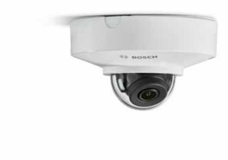
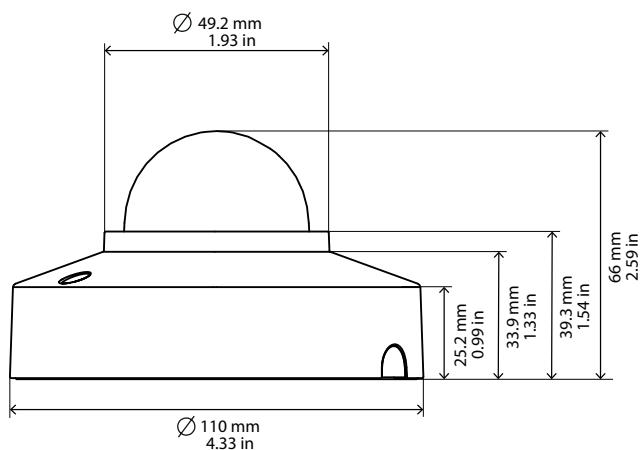

# FLEXIDOME IP micro 3000i

www.boschsecurity.com

The FLEXIDOME IP micro 3000i is built for highquality, 24/7 performance, with a range of reliable surveillance features, including

Essential Video Analytics, and is designed for easy installation.

The compact and minimalist design provides high installation flexibility and offers various mounting options.

### **Functions**

#### **Essential Video Analytics**

The built-in video analysis reinforces the Intelligenceat-the-Edge concept and now delivers even more powerful features. Essential Video Analytics is ideal for use in controlled environments with limited detection ranges.

The system reliably detects, tracks, and analyzes objects, and alerts you when predefined alarms are triggered. A smart set of alarm rules makes complex tasks easy and reduces false alarms to a minimum. Metadata is attached to your video to add sense and structure. This enables you to quickly retrieve the relevant images from hours of stored video. Metadata can also be used to deliver irrefutable forensic evidence or to optimize business processes based on people counting or crowd density information.

- u 1080p and 5MP resolutions
- u Built-in Essential Video Analytics to trigger relevant alerts and quickly retrieve data
- u Fully configurable H.265 multi-streaming
- u High Dynamic Range (120 dB) for challenging bright and dark scenes
- u Built-in microphone for audio recording

### **High Dynamic Range**

The high dynamic range mode is based on a multipleexposure process that captures more details in the highlights and in the shadows even in the same scene. The result is that you can easily distinguish objects and features, for example, faces with bright backlight. The actual dynamic range of the camera is measured using Opto-Electronic Conversion Function (OECF) analysis according to IEC 62676 Part 5.

#### **Intelligent streaming**

Smart encoding capabilities, together with Intelligent Dynamic Noise Reduction technology and analytics, reduce the bandwidth consumption to extremely low levels. Only relevant information in the scene, like motion, or objects found with the analytics, need to be encoded.

The camera is capable of triple streaming which allows the camera to deliver independent, configurable streams for live viewing, recording, or remote monitoring via constrained bandwidths. Each of these streams can be adapted independently to deliver high quality video, perfectly tailored to purpose, while reducing bit rate by up to 90% compared to a standard camera.

#### **H.265 high-efficiency video encoding**

The camera is designed on the most efficient and powerful H.264 and H.265/HEVC encoding platform. The camera is capable of delivering high-quality and high-resolution video with very low network load. With a doubling of encoding efficiency, H.265 is the new compression standard of choice for IP video surveillance systems.

#### **Tamper and motion detection**

A wide range of configuration options is available for alarms signaling camera tampering. A built-in algorithm for detecting movement in the video can also be used for alarm signaling.

### **Built-in microphone and audio alarm**

The camera has a built-in microphone to allow operators to listen in on the monitored area. Audio detection can be used to generate an alarm if needed.

#### **Recording and storage management**

Recording management can be controlled by the Bosch Video Recording Manager application, or the camera can use local storage and iSCSI targets directly without any recording software. Local storage can be used for recording "at the edge" or for Automatic Network Replenishment (ANR) technology to improve the overall recording reliability. Pre-alarm recording in RAM reduces bandwidth consumption on the network and extends the effective life of the memory card.

### **Edge recording**

Insert a memory card into the card slot to store up to 2 TB of local alarm recording. Pre-alarm recording in RAM reduces recording bandwidth on the network, and extends the effective life of the memory card. It has advanced edge recording providing a reliable storage solution possible due to the combination of these functions:

- Industrial SD card support allows for extreme lifetime
- Health monitoring of industrial SD cards provide early service indications.

#### **DORI coverage**

DORI (Detect, Observe, Recognize, Identify) is a standard system (EN-62676-4) for defining the ability of a camera to distinguish persons or objects within a covered area. The maximum distance at which a camera/lens combination can meet these criteria is shown below:

#### **1080p camera with 2.3 mm or 2.8 mm lens**

| DORI    | DORI definition | Distance 2.3 mm/ 2.8 mm | Horizontal width |
|---------|--------------------|-------------------------------|---------------------|
| Detect  | 25 px/m            | 17 m/28 m                     | 77 m                |
|         | (8 px/ft)          | (56 ft/93 ft)                 | (252 ft)            |
| Observe | 63 px/m            | 7 m/11 m                      | 30 m                |
|         | (19 px/ft)         | (22 ft/37 ft)                 | (100 ft)            |

| DORI      | DORI definition | Distance 2.3 mm/ 2.8 mm | Horizontal width |
|-----------|--------------------|-------------------------------|---------------------|
| Recognize | 125 px/m           | 3 m/6 m                       | 15 m                |
|           | (38 px/ft)         | (11 ft/19 ft)                 | (50 ft)             |
| Identify  | 250 px/m           | 2 m/3 m                       | 8 m                 |
|           | (76 px/ft)         | (6 ft/9 ft)                   | (25 ft)             |

#### **5.3MP camera with 2.3 mm or 2.8 mm lens**

| DORI      | DORI definition   | Distance 2.3 mm/ 2.8 mm    | Horizontal width |
|-----------|----------------------|----------------------------------|---------------------|
| Detect    | 25 px/m (8 px/ft) | 37 m/57 m (121 ft/ 188 ft) | 123 m (403 ft)   |
| Observe   | 63 px/m              | 15 m/23 m                        | 49 m                |
|           | (19 px/ft)           | (48 ft/75 ft)                    | (160 ft)            |
| Recognize | 125 px/m             | 7 m/11 m                         | 25 m                |
|           | (38 px/ft)           | (24 ft/38 ft)                    | (81 ft)             |
| Identify  | 250 px/m             | 4 m/6 m                          | 12 m                |
|           | (76 px/ft)           | (12 ft/19 ft)                    | (40 ft)             |

### **Easy installation**

Power for the camera can be supplied via a Powerover-Ethernet compliant network cable connection. With this configuration, only a single cable connection is required to view, power, and control the camera. Using PoE makes installation easier and more costeffective, as cameras do not require a local power source.

The camera can also be supplied with power from +12 VDC power supplies.

For trouble-free network cabling, the camera supports Auto-MDIX which allows the use of straight or crossover cables.

#### **Data security**

Special measures have been put in place to ensure the highest level of security for device access and data transport. The three-level password protection with security recommendations allows users to customize device access. Web browser access can be protected using HTTPS and firmware updates can also be protected with authenticated secure uploads. The on-board Trusted Platform Module (TPM) and Public Key Infrastructure (PKI) support, guarantee superior protection from malicious attacks. The 802.1x network authentication with EAP/TLS, supports TLS 1.2 with updated cipher suites including AES 256 encryption.

The advanced certificate handling offers:

- Self-signed unique certificates automatically created when required
- Client and server certificates for authentication
- Client certificates for proof of authenticity
- Certificates with encrypted private keys

#### **System integration and ONVIF conformance**

The camera conforms to the ONVIF Profile S, ONVIF Profile G and ONVIF Profile T specifications. For H.265 configuration, the camera supports Media Service 2, which is part of ONVIF Profile T. Compliance with these standards guarantees interoperability between network video products regardless of manufacturer. Third-party integrators can easily access the internal feature set of the camera for integration into large projects. Visit the Bosch Integration Partner Program (IPP) website (ipp.boschsecurity.com) for more information.

#### **Certifications and approvals**

| Standard             | Type                                                                                                                                                   |
|----------------------|--------------------------------------------------------------------------------------------------------------------------------------------------------|
| Emission             | EN 55032 CFR 47 FCC part 15, Class B AS/NZS CISPR 32                                                                                             |
| Immunity             | EN 50130-4 EN 50121-4                                                                                                                               |
| Environmental        | EN 50130-5 (Class II); EN 60068‑2‑1, EN 60068‑2‑2, EN 60068‑2‑6, EN 60068‑2‑18, EN 60068‑2‑27, EN 60068‑2‑30, EN 60068‑2‑75, EN 60068‑2‑78 |
| Safety               | EN 60950-1 UL 60950-1 CAN/CSA-C22.2 No. 60950-1                                                                                                  |
| Image performance    | IEC 62676-5                                                                                                                                            |
| HD                   | SMPTE 296M-2001 (Resolution: 1280x720) SMPTE 274M-2008 (Resolution: 1920x1080)                                                                   |
| Color representation | ITU-R BT.709-6                                                                                                                                         |
| ONVIF conformance    | EN 50132-5-2 EN 62676-2                                                                                                                             |
| Impact protection    | EN 62262 (IK08)                                                                                                                                        |
| Environmental        | EN 50581 (RoHS)                                                                                                                                        |
| Marks                | FCC, cULus, WEEE, RCM, VCCI, CMIM, EAC                                                                                                                 |
| Region               | Regulatory compliance/quality marks                                                                                                                    |
| Europe               | CE                                                                                                                                                     |

#### **Installation/configuration notes**

#### **Technical specifications**

#### **Power**

| Input voltage       | POE IEEE 802.3af / 802.3 at Type 1, Class 0 12 VDC ±30% |
|---------------------|------------------------------------------------------------|
| Power consumption   | PoE: 3.5 W / 10.5 W                                        |
| (typical / maximum) | 12 VDC: 3.1 W / 9.5 W                                      |

#### **Sensor**

| 2 MP             |                     |
|------------------|---------------------|
| Sensor type      | 1/2.8 inch CMOS     |
| Effective pixels | 1920 (H) x 1080 (V) |
| 5.3 MP           |                     |
| Sensor type      | 1/2.9 inch CMOS     |
| Effective pixels | 3072 (H) x 1728 (V) |

#### **Video performance - Sensitivity**

2MP

Measured according to IEC 62676 Part 5 (1/30, F1.6 or F2.2)

| • Color | 0.1 lx  |
|------------|---------|
| • Mono  | 0.05 lx |
| 5.3MP      |         |

Measured according to IEC 62676 Part 5 (1/30, F1.6 or F2.2)

| • Color                             | 2.3 mm: 0.57 lx 2.8 mm: 0.53 lx |  |
|----------------------------------------|------------------------------------|--|
| • Mono                              | 2.3 mm: 0.24 lx 2.8 mm: 0.19 lx |  |
| Video performance - Dynamic range      |                                    |  |
| High Dynamic Range                     | 120 dB WDR                         |  |
| Measured according to IEC 62676 Part 5 |                                    |  |

#### **4** | FLEXIDOME IP micro 3000i

| Video performance - Dynamic range |                                                                                                                                     |  |
|-----------------------------------|-------------------------------------------------------------------------------------------------------------------------------------|--|
| 2 MP                              | 103 dB                                                                                                                              |  |
| 5.3 MP                            | 101 dB                                                                                                                              |  |
| Optical                           |                                                                                                                                     |  |
| Lens type                         | 2.3 mm fixed, F2.2 2.8 mm fixed, F1.6                                                                                            |  |
| Field of view                     |                                                                                                                                     |  |
| 2MP                               | 2.3 mm: 132° x 77° (H x V) 2.8 mm: 107° x 57° (H x V)                                                                            |  |
| 5.3MP                             | 2.3 mm: 118° x 69° (H x V) 2.8 mm: 94° x 51° (H x V)                                                                             |  |
| Video streaming                   |                                                                                                                                     |  |
| Video compression                 | H.265; H.264; M- JPEG                                                                                                               |  |
| Sensor modes                      |                                                                                                                                     |  |
| 2 MP                              | 30 fps, HDR, 1920 x 1080 25 fps, HDR, 1920 x 1080                                                                                |  |
| 5.3 MP                            | 20 fps, HDR, 3072 x 1728 (5.3 MP) 25 fps, HDR, 2720 x 1530 (4.1 MP)                                                              |  |
| Streaming                         | Multiple configurable streams in H.264 or H. 265 and M-JPEG, configurable frame rate and bandwidth. Regions of Interest (ROI) |  |
| GOP structure                     | IP                                                                                                                                  |  |
| Encoding interval                 |                                                                                                                                     |  |
| 2 MP                              | 1 to 30 fps                                                                                                                         |  |
| 5.3 MP                            | 1 to 20 fps (5.3 MP) 1 to 25 fps (4.1 MP)                                                                                        |  |
| Signal-to-noise ratio (SNR)    | >55 dB                                                                                                                              |  |
| Video resolution                  |                                                                                                                                     |  |
| 2 MP                              |                                                                                                                                     |  |
| 1080p HD                          | 1920 x 1080                                                                                                                         |  |
| 720p HD                           | 1280 x 720                                                                                                                          |  |
| SD                                | 768 x 432                                                                                                                           |  |
| D1                                | 720 x 480                                                                                                                           |  |
| VGA                               | 640 x 480                                                                                                                           |  |
| 5.3 MP                            |                                                                                                                                     |  |
| 5.3 MP                            | 3072 x 1728                                                                                                                         |  |
| 4.1 MP                            | 2720 x 1530                                                                                                                         |  |
| 3 MP                              | 2304 x 1296                                                                                                                         |  |
| 1080p                             | 1920 x 1080                                                                                                                         |  |

| Video resolution               |                                                                                                                                                                                     |  |
|--------------------------------|-------------------------------------------------------------------------------------------------------------------------------------------------------------------------------------|--|
| 720p                           | 1280 x 720                                                                                                                                                                          |  |
| SD                             | 768 x 432                                                                                                                                                                           |  |
| D1                             | 720 x 480                                                                                                                                                                           |  |
| VGA                            | 640 x 480                                                                                                                                                                           |  |
| Camera installation            |                                                                                                                                                                                     |  |
| Mirror image                   | On / Off                                                                                                                                                                            |  |
| Rotation                       | 0° / 90° upright / 180° / 270° upright                                                                                                                                              |  |
| Camera LED                     | Enable / Disable                                                                                                                                                                    |  |
| Video functions - color        |                                                                                                                                                                                     |  |
| Adjustable picture settings | Contrast, Saturation, Brightness                                                                                                                                                    |  |
| White Balance                  | 2500 to 10000K, 4 automatic modes (Basic, Standard, Sodium lamp, Dominant color), Manual mode and Hold mode                                                                   |  |
| Video functions - ALC          |                                                                                                                                                                                     |  |
| Shutter                        | Automatic Electronic Shutter (AES); Fixed (1/25[30] to 1/15000) selectable; Default shutter                                                                                   |  |
| Day/Night                      | Auto (adjustable switch points), Color, Monochrome                                                                                                                               |  |
| Video functions - enhance      |                                                                                                                                                                                     |  |
| Sharpness                      | Sharpness enhancement level selectable                                                                                                                                              |  |
| Backlight compensation      | On/off                                                                                                                                                                              |  |
| Contrast enhancement        | On/off                                                                                                                                                                              |  |
| Noise reduction                | Intelligent Dynamic Noise Reduction with separate temporal and spatial adjustments                                                                                               |  |
| Intelligent defog              | Intelligent Defog automatically adjusts parameters for best picture in foggy or misty scenes (switchable)                                                                     |  |
| Video content analysis         |                                                                                                                                                                                     |  |
| Analysis type                  | Essential Video Analytics                                                                                                                                                           |  |
| Features                       | Rule based alarms and tracking, Line crossing, Enter / leave field, Follow route, Loitering, Idle / removed object, People counting, Crowd density estimation, 3D tracking |  |
|                                |                                                                                                                                                                                     |  |

| Additional functions  |                                                                                                                                                                                                                                                                                                                                                       |
|-----------------------|-------------------------------------------------------------------------------------------------------------------------------------------------------------------------------------------------------------------------------------------------------------------------------------------------------------------------------------------------------|
| Privacy Masking       | Eight independent areas, fully programmable                                                                                                                                                                                                                                                                                                           |
| Display stamping      | Name, Logo, Time; Alarm message                                                                                                                                                                                                                                                                                                                       |
| Pixel counter         | Selectable area                                                                                                                                                                                                                                                                                                                                       |
| Local storage         |                                                                                                                                                                                                                                                                                                                                                       |
| Internal RAM          | up to 5 s pre-alarm recording                                                                                                                                                                                                                                                                                                                         |
| Memory card slot      | microSDHC / microSDXC SD card slot                                                                                                                                                                                                                                                                                                                    |
| Industrial SD cards   | Extreme lifetime and health monitoring support that provides early service indication                                                                                                                                                                                                                                                              |
| Input/output          |                                                                                                                                                                                                                                                                                                                                                       |
| Audio input           | Built-in mic                                                                                                                                                                                                                                                                                                                                          |
| Audio line out        | 16 Ohm typical; output 0.875 Vrms                                                                                                                                                                                                                                                                                                                     |
| Alarm input           | Short or DC 5 V activation                                                                                                                                                                                                                                                                                                                            |
| Alarm output          | Maximum load: 12 VDC / 50 mA                                                                                                                                                                                                                                                                                                                          |
| Ethernet              | RJ45 connector                                                                                                                                                                                                                                                                                                                                        |
| Audio streaming       |                                                                                                                                                                                                                                                                                                                                                       |
| Standard              | G.711, 8 kHz sampling rate L16, 16 kHz sampling rate AAC-LC, 48 kbps at 16 kHz sampling rate AAC-LC, 80 kbps at 16 kHz sampling rate                                                                                                                                                                                                         |
| Signal-to-Noise Ratio | >50 dB                                                                                                                                                                                                                                                                                                                                                |
| Audio Streaming       | Full-duplex / half duplex                                                                                                                                                                                                                                                                                                                             |
| Network               |                                                                                                                                                                                                                                                                                                                                                       |
| Protocols             | IPv4, IPv6, UDP, TCP, HTTP, HTTPS, RTP/ RTCP, IGMP V2/V3, ICMP, ICMPv6, RTSP, FTP, ARP, DHCP, APIPA (Auto-IP, link local address), NTP (SNTP), SNMP (V1, V3, MIB-II), 802.1x, DNS, DNSv6, DDNS (DynDNS.org, selfHOST.de, no-ip.com), SMTP, iSCSI, UPnP (SSDP), DiffServ (QoS), LLDP, SOAP, Dropbox™, CHAP, digest authentication |
| Encryption            | TLS1.0/1.2, AES128, AES256                                                                                                                                                                                                                                                                                                                            |
| Ethernet              |                                                                                                                                                                                                                                                                                                                                                       |
|                       | 10/100 Base-T, auto-sensing, half/full duplex                                                                                                                                                                                                                                                                                                         |
| Connectivity          | Auto-MDIX                                                                                                                                                                                                                                                                                                                                             |
| Interoperability      | ONVIF Profile S; ONVIF Profile G; ONVIF Profile T: GB/T 28181                                                                                                                                                                                                                                                                                      |
| Mechanical            |                                                                                                                                                                                                                                                                                                                                                       |
| Dimensions (Ø x H)    | 110 x 66 mm (4.33 x 2.6 in)                                                                                                                                                                                                                                                                                                                           |
| Weight (approx.)      | 290 g (0.64 lbs)                                                                                                                                                                                                                                                                                                                                      |
| Mounting              | Surface mount                                                                                                                                                                                                                                                                                                                                         |

| Mechanical                               |                                                                                           |  |
|------------------------------------------|-------------------------------------------------------------------------------------------|--|
| 3-axis adjustment (pan/tilt/rotation) | Pan: 0° to 355° Tilt: 0° to 75° Roll: 0° to 360°                                    |  |
| Dome bubble                              | Polycarbonate, clear with anti-scratch coating                                            |  |
| Environmental                            |                                                                                           |  |
| Operating                                | -20 °C to +50 °C (-4 °F to +122 °F)                                                       |  |
| temperature (continuous)              |                                                                                           |  |
| Storage temperature                      | -30 °C to +70 °C (-22 °F to +158 °F)                                                      |  |
| Humidity                                 | 5% to 100% relative humidity (condensing) 5% to 93% relative humidity (non condensing) |  |
| Storage humidity                         | Up to 98% relative humidity                                                               |  |
| Impact resistance                        | IK08                                                                                      |  |
|                                          |                                                                                           |  |

### **Ordering information**

**NDV-3502-F02 Fixed micro dome 2MP HDR 130° IK08** IP fixed dome camera with tamper and motion detection; 2MP HD 1080p resolution; 130º lens; indoor; EVA. Order number **NDV-3502-F02**

## **NDV-3502-F03 Fixed micro dome 2MP HDR 100° IK08**

IP fixed dome camera with tamper and motion detection; 2MP HD 1080p resolution; 100º lens; indoor; EVA.

Order number **NDV-3502-F03**

**NDV-3503-F02 Fixed micro dome 5MP HDR 120° IK08** IP fixed dome camera with tamper and motion detection; 5MP resolution; 120° lens; indoor; EVA. Order number **NDV-3503-F02**

**NDV-3503-F03 Fixed micro dome 5MP HDR 100° IK08** IP fixed dome camera with tamper and motion detection; 5MP resolution; 100º lens; indoor; EVA. Order number **NDV-3503-F03**

#### **Accessories**

**NDA-3081-4S 4S adapter plate NDV-3000 indoor micro**

4S adapter plate for NDV-3000 micro dome Order number **NDA-3081-4S**

#### **NPD-5001-POE Power over ethernet , 15.4W, 1-port**

Power-over-Ethernet midspan injector for use with PoE enabled cameras; 15.4 W, 1-port Weight: 200 g (0.44 lb) Order number **NPD-5001-POE**

#### **NPD-5004-POE Power over ethernet, 15.4W, 4-port** Power-over-Ethernet midspan injector for use with PoE

enabled cameras; 15.4 W, 4-ports Weight: 620 g (1.4 lb) Order number **NPD-5004-POE**

#### **UPA-1220-50 Power supply, 220VAC 50Hz, 12VDC 1A out**

Power supply for camera. 110-240 VAC, 50/60 Hz In; 12 VDC, 1 A Out; regulated. Input connector: 2-prong, European Europlug standard (4 mm / 19 mm). Order number **UPA-1220-50**

#### **UPA-1220-60 Power supply, 120VAC 60Hz,12VDC 1A out**

Power supply for camera. 100-240 VAC, 50/60 Hz In; 12 VDC, 1 A Out; regulated. Input connector: 2-prong, North American standard (non-polarized). Order number **UPA-1220-60**

**Represented by:**

**Europe, Middle East, Africa: Germany: North America: Asia-Pacific:** Bosch Security Systems B.V. P.O. Box 80002 5600 JB Eindhoven, The Netherlands Phone: + 31 40 2577 284 emea.securitysystems@bosch.com emea.boschsecurity.com

Bosch Sicherheitssysteme GmbH Robert-Bosch-Ring 5 85630 Grasbrunn Germany www.boschsecurity.com

Bosch Security Systems, Inc. 130 Perinton Parkway Fairport, New York, 14450, USA Phone: +1 800 289 0096 Fax: +1 585 223 9180 onlinehelp@us.bosch.com www.boschsecurity.us

Robert Bosch (SEA) Pte Ltd, Security Systems 11 Bishan Street 21 Singapore 573943 Phone: +65 6571 2808 Fax: +65 6571 2699 apr.securitysystems@bosch.com www.boschsecurity.asia

© Bosch Security Systems 2020 | Data subject to change without notice 70525753355 | en, V8, 04. Feb 2020