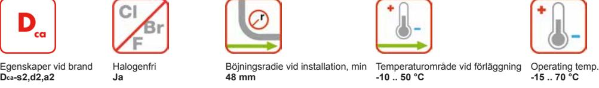

**Artikelnr:** 17112640 **E-nr:** 4802812 **EAN 13:** 7330000081987

Lättskalad halogenfri kommunikationskabel för larm och säkerhet

# **BESKRIVNING**

### **Konstruktion**

Partvinnad kommunikationskabel, med undantag för 1x4x0,5 som är tvinnad till fyrskruv. Mantel och isolering av halogenfritt flamskyddat material. Kabeln som är mycket lättskalad både vad gäller isolering och mantel förläggs inomhus i fast förläggning och i rör. Används för privata kommunikationsnät tex porttelefoner, passagesystem, inbrottslarm. EQQXB Easy uppfyller brandkrav CPR klass Dcas2d2a2. Vid brand avger kabeln inga korrosiva gaser och har liten rökutveckling.

# **Kvalitetssystem**

Konstruktion, tillverkning och provning har skett enligt de krav som är fastlagda i ISO 9001.

# **Miljöledningssystem**

Verksamheten vid vår fabrik i Grimsås är certifierad enligt ISO 14001.

#### **PRESTANDADEKLARATION**

Egenskaper vid brand: Dcas2,d2,a2 enligt EN50575:2014+A1:2016

### **STANDARDER**

**Nationell** SS 424 16 08

# **EGENSKAPER**

| Konstruktionsegenskaper |                 |
|-------------------------|-----------------|
| Ledare, tvärsnittstyp   | Entrådig        |
| Ledare, material        | Annealed copper |
| Isolering, material     | HFFR            |
| Mantel, material        | HFFR            |
| Färg                    | Vit             |
| Skärm                   | Nej             |
| Halogenfri              | Ja              |
| Dimensionsegenskaper    |                 |
| Ledardiameter           | 0,5 mm          |
| Antal par               | 6               |
| Mantel, tjocklek        | 0,8 mm          |

Alla illustrationer, konstruktioner, specifikationer, ritningar och angivelser om vikt, storlek och dimensioner i Nexans tekniska eller kommersiella dokumentation är endast indikativa och kan inte förbinda Nexans eller anses vara representativa för Nexans. **Genererad 2020-04-01 www.nexans.se Sida 1 / 2**

Kontaktuppgifter

Försäljning Tele/Datakabel Telefon: +46 325 80 000 telecomcable-pc.se@nexans.com

Försäljning Tele/Datakabel Telefon: +46 325 80 000 telecomcable-pc.se@nexans.com

| Dimensionsegenskaper                |             |
|-------------------------------------|-------------|
| Ytterdiameter, nom                  | 6,0 mm      |
| Vikt                                | 5,0 kg/100m |
| Elektriska egenskaper               |             |
| Ledarresistans vid 20° C, max       | 97,5 Ohm/km |
| Resistansobalans, max               | 2 %         |
| Kapacitans ledare-ledare, max       | 80 nF/km    |
| Kapacitansobalans max               | 400 pF/500m |
| Isolationsresistans, min            | 500 MOhm.km |
| Spänning vid drift, max             | 100 V       |
| Transmissionsegenskaper             |             |
| Dämpning, max, vid 800 Hz, 20°C     | 1,7 dB/km   |
| Dämpning, max, vid 1 MHz, 20°C      | 25 dB/km    |
| Hanteringsinformation               |             |
| Böjningsradie vid installation, min | 48 mm       |
| Längd                               | 100 m       |
| Förpackning                         | Kartong     |
| Temperaturområde vid förläggning    | -10  50 °C  |
| Drifttemperatur, område             | -15  70 °C  |

# **LEVERANSINFORMATION**

EQQXB Easy levereras i längder om 100 eller 500 m. Förpackningen är märkt med tillverkare, kabeltyp och längd. Kabeländarna är förslutna.

Alla illustrationer, konstruktioner, specifikationer, ritningar och angivelser om vikt, storlek och dimensioner i Nexans tekniska eller kommersiella dokumentation är endast indikativa och kan inte förbinda Nexans eller anses vara representativa för Nexans. **Genererad 2020-04-01 www.nexans.se Sida 2 / 2**

