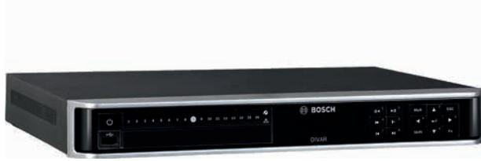
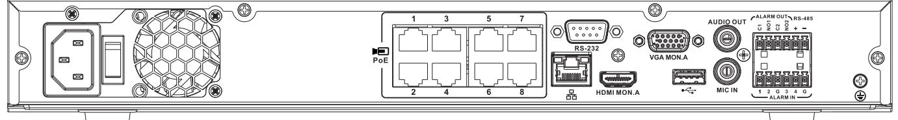
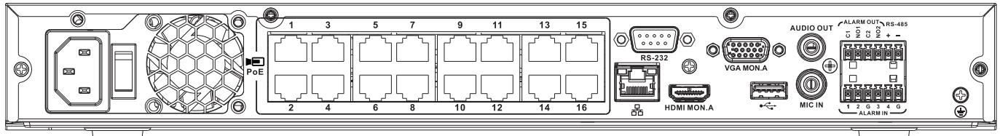

# DIVAR network 2000 recorder

www.boschsecurity.com

- u 16 IP channels with 256 Mbps incoming bandwidth
- u 8 MP (UHD) IP camera support for view and playback
- u Real time live display for 8 channels @1080p or 2 channels @4k
- u Compact, sturdy and stylish design

Connect this recorder to a maximum of 16 IP cameras that use the latest H265/H264 high-resolution video technology and state-of-the-art compression techniques.

These advanced technologies, coupled with efficient network data transmission, deliver the high security and reliability required for modern surveillance systems. Simultaneous remote or local monitoring, recording, archive and playback functions are guided by simple menu selections and operator commands. The recorders can be installed with a maximum of 2 internal HDDs for video storage. Another option is a single HDD for storage, plus a DVD burner for video export.

#### **Functions**

#### **Latest video compression technology**

The DIVAR supports H.264 and H.265 video compression technology. This technology dramatically reduces bandwidth and storage requirements while still delivering superb image and audio quality. Equipped with this newest video technology, DIVAR gives you the full benefits of the latest high-resolution cameras. The proof is in the pixels.

#### **Camera IP support**

The recorder supports native camera integration with Bosch IP cameras which provides easy installation, configuration and maintenance options. This allows plug-and-play connectivity as the installer can connect and configure the cameras to the recorder without having to open every camera individually on a web client. For further configuration 3rd party cameras are supported through the ONVIF Profile S protocol.

#### **Simultaneous record and view**

The DIVAR records multiple video and audio signals while simultaneously providing live multi-screen viewing and playback. Comprehensive search and playback functions provide quick recall and viewing of recorded video.

The DIVAR has a real-time display resolution of 1080p for 8 channels simultaneously, or 4K for 2 channels.

#### **PoE+ switch**

The recorders with a built-in PoE+ switch can supply power to a maximum of 16 connected cameras. Each camera automatically receives its IP address from the recorder for simple plug-and-play operation.

#### **Simple operation**

The DIVAR is very easy to install and use. Simply connect the cameras, apply power, and follow the simple Install Wizard steps for initial setup. The unit can then record automatically with no further intervention required.

#### **DDNS**

Bosch offers its customers free Dynamic Domain Name Services (DDNS) for access to network-connected devices via a "friendly" hostname without the need for costly static IP addresses. This makes it easier for uninterrupted access to important video from devices regardless of their location.

#### **Alarms**

All models have extensive alarm handling functions and telemetry control. Alarm functions include local inputs and relay outputs, plus motion detection in user-defined areas. If an alarm is detected, the DIVAR can:

• send an e-mail notification and/or FTP push

- sound a buzzer and/or display a warning
- activate local alarm output

#### **Local control**

The unit can be easily operated and programmed via the on-screen display menu system using:

- the supplied mouse
- the front panel control keys
- the supplied remote control
- push notification

#### **Inputs and outputs**

Video inputs, audio inputs/output, and alarm inputs/ outputs are located on the rear panel. Two video connectors (VGA/HDMI) provide simultaneous output for monitor A for live display (with zoom) and playback (display can be frozen and zoomed). The displays allow full-screen, multi-screen, and sequenced viewing.

#### **Dome control**

The DIVAR can control pan/tilt/zoom (PTZ) equipment using commands sent via IP connection. It also supports Focus, Iris and Aux commands for Bosch cameras.

#### **Panoramic cameras**

The DIVAR supports dewarping of Bosch panoramic cameras. The following modes are supported: pan/tilt/ zoom (PTZ), panoramic, corridor and quad. Dewarping in the camera can also be selected if the connected IP panoramic camera supports this.

#### **Network control**

Use the PC software or built-in web application via a network for live viewing, playback, and configuration.

#### **Watermark**

The DIVAR includes an authenticity check for both local and remote archives, ensuring recording integrity. An Archive Player is provided for playback of secure video files and to check if video is authentic.

#### **Smartphone App**

A DIVAR Viewer App from Bosch for iOS and Android devices is available for:

- live and playback viewing
- recorder configuration
- PTZ control

This means you can watch live video from cameras connected to the DVR from anywhere in the world. You can also control focus, pan, tilt and zoom on PTZenabled cameras.

Furthermore, the smartphone App supports remote push notifications. In this way you are automatically notified if an alarm occurs on the device and can take immediate action, even if you are not actively monitoring the system at that moment.

#### **Certifications and approvals**

#### **Standards**

| Alarm                   | EN 50130-5:2011, Alarm systems - Part 5: Environmental test methods, Class I, Fixed equipment                                                                                                                              |
|-------------------------|----------------------------------------------------------------------------------------------------------------------------------------------------------------------------------------------------------------------------------|
| Lightning protection | To ALL long input / output - and supply-wiring. Alarm inputs and relay output, Video inputs and Outputs, dome-control outputs, power-cable, Audio In/Out. ± 0.5, 1kV line to line, ± 0.5, 1 and 2kV line to earth |

#### **EMC + Safety - Europe**

| EU Directives             | 2014/35/EU (LVD), 2014/30/EU (EMC), 2011/65/EU (RoHS) |
|---------------------------|----------------------------------------------------------|
| EMC Emission              | EN 55032:2012/AC2013, class B                            |
| EMC Immunity              | EN 50130-4:2011/A1:2014                                  |
| EMC mains Harmonics    | EN 61000-3-2:2014                                        |
| EMC Mains fluctuations | EN 61000-3-3:2013                                        |
| LVD Safety                | CB scheme + IEC/EN/UL 62368-1:2014/AC:2015               |
| RoHS                      | EN 50581:2012                                            |

#### **EMC + Safety - USA and Canada**

| EMC USA                 | 47CFR part 15 (FCC), Class B       |
|-------------------------|------------------------------------|
| Safety USA (UL, cUL) | UL 62368-1, Edition 2, Dec 1, 2014 |
| Safety Canada           | CAN/CSA-C22.2 No. 62368-1          |
|                         |                                    |

#### **India**

| BIS (Bureau of | BIS registration for external Power adapter |
|----------------|---------------------------------------------|
| Indian         | (comes / packed with the main product)      |
| Standards)     |                                             |

| Australia                                     |                           | Region           |                                  | Regulatory compliance/quality marks |                  |
|-----------------------------------------------|---------------------------|------------------|----------------------------------|-------------------------------------|------------------|
| ACMA EMC                                      | RCM logo on product label |                  | Europe                           | CE                                  | ST-VS 2016-E-087 |
| Region Regulatory compliance/quality marks |                           | USA              | UL                               | FCC & UL                            |                  |
| Australia                                     | RCM                       | DOC SAL Variants |                                  | FCC                                 | ST-VS 2016-E-088 |
|                                               | RCM                       | DOC SAL          | Installation/configuration notes |                                     |                  |
|                                               |                           |                  |                                  |                                     |                  |

### *DIVAR network 2000 (no PoE) back panel*

| RJ45 video input for max. 16 IP cameras connected via external switch (optional with DHCP configuration) |
|----------------------------------------------------------------------------------------------------------------|
| RJ45 Ethernet connection (10/100/1000Base-T according to IEEE802.3)                                      |
| 1 D-SUB (Monitor output)                                                                                       |
| 1 HDMI (Monitor output)                                                                                        |
| 4 screw terminal inputs, cable diameter AWG26‑16 (0.4–1.29 mm)                                              |
| 2 screw terminal outputs, cable diameter AWG26‑16 (0.4–1.29 mm)                                             |
| 1 RCA (Audio output)                                                                                           |

|                                   | 1 RCA (Audio input)                                                                             |
|-----------------------------------|-------------------------------------------------------------------------------------------------|
|                                   | Screw terminal output                                                                           |
|                                   | DB9 male, 9-pin D-type (for service)                                                            |
|                                   | One USB (3.0) connector for mouse or USB memory device; one USB (2.0) also on front panel |
| Power input with On/Off switch | 12 VDC (5 A) AC input adapter: 100~240 VAC, 50-60 Hz, 1.5 A                               |
|                                   | Ground connection                                                                               |

*DIVAR network 2000 (8 PoE) back panel*

| PoE | Max. 8 RJ45 PoE ports (115 W; 25.5 W max. per port) connected with DHCP configuration (maximum 16 IP channels possible) |
|-----|-------------------------------------------------------------------------------------------------------------------------------|
|     | RJ45 Ethernet connection (10/100/1000Base-T according to IEEE802.3)                                                     |
|     | 1 D-SUB (Monitor output)                                                                                                      |
|     | 1 HDMI (Monitor output)                                                                                                       |
|     | 4 screw terminal inputs, cable diameter AWG26‑16 (0.4–1.29 mm)                                                             |
|     | 2 screw terminal outputs, cable diameter AWG26‑16 (0.4–1.29 mm)                                                            |

|                                   | 1 RCA (Audio output)                                                                            |
|-----------------------------------|-------------------------------------------------------------------------------------------------|
|                                   | 1 RCA (Audio input)                                                                             |
|                                   | Screw terminal output                                                                           |
|                                   | DB9 male, 9-pin D-type (for service)                                                            |
|                                   | One USB (3.0) connector for mouse or USB memory device; One USB (2.0) also on front panel |
| Power input with On/Off switch | 100~240 VAC, 50-60 Hz, 3.5 A, 190 W                                                             |
|                                   | Ground connection                                                                               |

#### *DIVAR network 2000 (16 PoE) back panel*

| PoE                               | Max. 16 PoE ports (115 W; 25.5 W max. per port) connected with DHCP configuration (max. 16 IP cameras) |
|-----------------------------------|--------------------------------------------------------------------------------------------------------------|
|                                   | RJ45 Ethernet connection (10/100/1000Base-T according to IEEE802.3)                                    |
|                                   | 1 D-SUB (Monitor output)                                                                                     |
|                                   | 1 HDMI (Monitor output)                                                                                      |
|                                   | 4 screw terminal inputs, cable diameter AWG26‑16 (0.4–1.29 mm)                                            |
|                                   | 2 screw terminal outputs, cable diameter AWG26‑16 (0.4–1.29 mm)                                           |
|                                   | 1 RCA (Audio output)                                                                                         |
|                                   | 1 RCA (Audio input)                                                                                          |
|                                   | Screw terminal output                                                                                        |
|                                   | DB9 male, 9-pin D-type (for service)                                                                         |
|                                   | One USB (3.0) connector for mouse or USB memory device; one USB (2.0) also on front panel              |
| Power input with On/Off switch | 100~240 VAC, 50-60 Hz, 3.5 A, 190 W                                                                          |
|                                   | Ground connection                                                                                            |

#### **Technical specifications**

| Power                                               |                              |
|-----------------------------------------------------|------------------------------|
| External power adapter AC input (without PoE) | 100-240 VAC; 50-60 Hz; 1.5 A |
| AC input (with PoE)                                 | 100-240 VAC; 50-60 Hz; 3.5 A |
| RTC battery on main PCB                          | Lithium CR2032, 3 VDC        |
| Power adapter DC output (without PoE)            | 12 VDC; 5 A                  |
| DVR Power input (without PoE)                    | 12 VDC                       |

| Maximum main power consumption (no HDD)              | 8.7 W without PoE 15.2 W with PoE                                                                                     |  |
|------------------------------------------------------------|--------------------------------------------------------------------------------------------------------------------------|--|
| Maximum power consumption of PoE+ switch             | 115 W                                                                                                                    |  |
| Maximum power consumption (per PoE+ port)            | 25.5 W                                                                                                                   |  |
| Mechanical                                                 |                                                                                                                          |  |
| Dimensions (WxDxH)                                         | 375 x 323 x 53 mm (14.8 x 12.7 x 2.1 in)                                                                                 |  |
| Weight with PoE switch (excluding HDD(s) and DVD)    | 4.2 kg (9.3 lb) approx.                                                                                                  |  |
| Weight without PoE switch (excluding HDD(s) and DVD) | 3.8 kg (8.4 lb) approx.                                                                                                  |  |
| Environmental                                              |                                                                                                                          |  |
| Operating temperature (incl. HDD(s) and DVD)         | +0°C to +40°C (+32°F to +104°F)                                                                                          |  |
| Storage temperature                                        | -40°C to +70°C (-40°F to +158°F)                                                                                         |  |
| Operating humidity                                         | <93% non-condensing                                                                                                      |  |
| Storage humidity                                           | <95% non-condensing                                                                                                      |  |
| Video storage                                              |                                                                                                                          |  |
| Internal storage options                                | Max. 2 SATA HDD or 1 SATA HDD + 1 DVD (R/RW) Max. capacity per HDD: 6 TB Max. supported speed per HDD: 6 Gb/s   |  |
| Alarms and detections                                      |                                                                                                                          |  |
| Motion detection set by camera                          | Essential or Intelligent Video Analytics (IVA), Motion +                                                              |  |
| Alarm activations                                          | Video loss, motion detection, input alarm, system alarm                                                               |  |
| Events triggered by alarm                               | Recording, PTZ movement, alarm out, email, buzzer, screen message, Mon A and B activated, mobile push notification |  |

| Inputs                  | 4 inputs configurable NO/NC, max. input voltage 12 VDC +/-10%                                                                       |
|-------------------------|----------------------------------------------------------------------------------------------------------------------------------------|
| Outputs                 | 2 relay outputs                                                                                                                        |
| Relay contact           | Max. rated, 30 VDC, 2 A continuous or 125 VAC, 1 A (activated)                                                                      |
| Exporting               |                                                                                                                                        |
| DVD (optional)          | Built-in DVD+R/RW writer                                                                                                               |
| USB                     | Flash memory or external HDD (FAT32)                                                                                                   |
| Network                 | Web Client software or Video Client                                                                                                    |
| Playback                |                                                                                                                                        |
| Multi-channel           | Simultaneous 1/4/9/16 channels                                                                                                         |
| Mode                    | Forward, reverse, slow play, fast play, frame by-frame                                                                              |
| Search                  | Time, channel, type, smart                                                                                                             |
| Network                 | Video Client, Web client, App                                                                                                          |
| Restrict                | Restrict video by user rights for viewing                                                                                              |
| Protection              | Protect video against overwriting                                                                                                      |
| Retention time          | Automatically delete recordings after 1 to 365 days                                                                                 |
|                         |                                                                                                                                        |
| Recording               |                                                                                                                                        |
| Decoding compression | H.265/H.264/MJPEG                                                                                                                      |
| Speed                   | Max. 60 IPS per channel, configurable                                                                                                  |
| Bit rate                | 16 kbps to 24 Mbps per channel                                                                                                         |
| Record interval         | 1~120 min (default: 60 min), Pre-record: 1~30 sec, Post-record: 10~300 sec                                                          |
| Mode                    | Manual, Scheduled (regular, motion detection, alarm), Stop                                                                          |
| Resolution              | 8MP, 6MP, 5MP, 3MP, 1.3MP, 1080p, 720p                                                                                                 |
| Network control         |                                                                                                                                        |
| Ethernet                | RJ45 port (10/100/1000 Mbps)                                                                                                           |
| PC software             | Video Client, Web client                                                                                                               |
| APPs                    | iPhone, Android                                                                                                                        |
| User access             | Maximum 128 users. Bosch advises a maximum of 4 simultaneous connections. More connections can cause performance limitations. |

| Video performance                    |                                                                     |
|--------------------------------------|---------------------------------------------------------------------|
| Maximum IP camera channels        | 16                                                                  |
| Maximum incoming bandwidth        | 256 Mbps                                                            |
| Maximum recording bandwidth       | 192 Mbps                                                            |
| Maximum transmission bandwidth | 128 Mbps                                                            |
| Display                              |                                                                     |
| Resolution                           | 3840×2160, 1920×1080, 1280×1024, 1280×720, 1024×768              |
| OSD                                  | Camera title, Time, Video loss, Motion detection, Recording, PTZ |
| Audio                                |                                                                     |
| MIC Input                            | 1 channel (via RCA) 200 to 3000 mV, 10 kOhm                      |
| Output                               | 1 channel (via RCA) 200 to 3000 mV, 5 kOhm                          |
| Direction                            | Bidirectional (audio input and output connected via device)      |

#### **Ordering information**

#### **DDN-2516-200N00 Recorder 16ch, no HDD**

High-resolution recorder for network surveillance systems. Recorder 16ch w/o HDD

Order number **DDN-2516-200N00**

#### **EWE-DIP2BS-IW 12mths wrty ext DIVAR 2000 w/out HDD**

12 months warranty extension Order number **EWE-DIP2BS-IW**

#### **DDN-2516-200N08 Recorder 16ch, 8PoE, no HDD**

High-resolution recorder for network surveillance systems. Recorder 16ch w/o HDD 8PoE Order number **DDN-2516-200N08**

#### **EWE-DIP2BS-IW 12mths wrty ext DIVAR 2000 w/out HDD**

12 months warranty extension Order number **EWE-DIP2BS-IW**

#### **DDN-2516-200N16 Recorder 16ch, 16PoE, no HDD**

High-resolution recorder for network surveillance systems. Recorder 16ch w/o HDD 16PoE

Order number **DDN-2516-200N16**

#### **EWE-DIP2BS-IW 12mths wrty ext DIVAR 2000 w/out HDD**

12 months warranty extension Order number **EWE-DIP2BS-IW**

#### **DDN-2516-212N00 Recorder 16ch 1x2TB**

High-resolution recorder for network surveillance systems. Recorder 16ch 1x2TB Order number **DDN-2516-212N00**

#### **DDN-2516-112D00 Recorder 16ch 1x2TB DVD**

High-resolution recorder for network surveillance systems.

Recorder 16ch 1x2TB DVD Order number **DDN-2516-112D00**

**DDN-2516-212N08 Recorder 16ch 1x2TB 8PoE** Recorder 16ch 1x2TB 8PoE High-resolution recorder for network surveillance systems. Order number **DDN-2516-212N08**

**DDN-2516-112D08 Recorder 16ch 1x2TB 8PoE DVD** High-resolution recorder for network surveillance systems. Recorder 16ch 1x2TB 8PoE DVD Order number **DDN-2516-112D08**

#### **DDN-2516-212N16 Recorder 16ch 1x2TB 16PoE**

High-resolution recorder for network surveillance systems. Recorder 16ch 1x2TB 16PoE

## Order number **DDN-2516-212N16**

**DDN-2516-112D16 Recorder 16ch 1x2TB 16PoE DVD** High-resolution recorder for network surveillance systems. Recorder 16ch 1x2TB 16PoE DVD Order number **DDN-2516-112D16**

#### **Accessories**

**DVR-XS200-A HDD expansion 2TB** Storage expansion kit. 2 TB Order number **DVR-XS200-A**

#### **DVR-XS300-A HDD expansion 3TB**

Storage expansion kit. 3 TB Order number **DVR-XS300-A**

#### **DVR-XS400-A HDD expansion 4TB**

Storage expansion kit. 4 TB Order number **DVR-XS400-A**

#### **DVR-XS600-A HDD expansion 6TB** Storage expansion kit. 6 TB

Order number **DVR-XS600-A**

**DVR-XS-DVD-B DVD writer expansion B** DVD writer Expansion kit B Order number **DVR-XS-DVD-B**

#### **Represented by:**

**Europe, Middle East, Africa: Germany: North America: Asia-Pacific:** Bosch Security Systems B.V. P.O. Box 80002 5600 JB Eindhoven, The Netherlands Phone: + 31 40 2577 284 emea.securitysystems@bosch.com emea.boschsecurity.com

Bosch Sicherheitssysteme GmbH Robert-Bosch-Ring 5 85630 Grasbrunn Germany www.boschsecurity.com

Bosch Security Systems, LLC 130 Perinton Parkway Fairport, New York, 14450, USA Phone: +1 800 289 0096 Fax: +1 585 223 9180 onlinehelp@us.bosch.com www.boschsecurity.us

Robert Bosch (SEA) Pte Ltd, Security Systems 11 Bishan Street 21 Singapore 573943 Phone: +65 6571 2808 Fax: +65 6571 2699 apr.securitysystems@bosch.com www.boschsecurity.asia

© Bosch Security Systems 2020 | Data subject to change without notice 22796921611 | en, V14, 10. Jul 2020