# **AUTODOME IP starlight 7000i**

NDP‑7512‑Z30 │ NDP‑7512‑Z30K

**en** Installation Manual

# **Table of contents**

| 1    | Safety EN                                                       | 5  |
|------|-----------------------------------------------------------------|----|
| 1.1  | About this Manual                                               | 5  |
| 1.2  | Legal Information                                               | 5  |
| 1.3  | Safety Precautions                                              | 5  |
| 1.4  | Important Safety Instructions                                   | 6  |
| 1.5  | Important Notices                                               | 9  |
| 1.6  | Connection in Applications                                      | 12 |
| 1.7  | Customer Support and Service                                    | 13 |
| 2    | Unpacking                                                       | 14 |
| 2.1  | Parts List                                                      | 14 |
| 2.2  | Tools Required                                                  | 15 |
| 3    | Product description                                             | 17 |
| 4    | Pre-installation Checklist                                      | 19 |
| 4.1  | Stabilization                                                   | 20 |
| 4.2  | Configuring and Implementing Intelligent Tracking               | 20 |
| 5    | Preparing the bubble                                            | 22 |
| 6    | (Optional) Installing an SD Card                                | 23 |
| 7    | Replacing the trim ring and bubble                              | 24 |
| 8    | Mount Power Supply Box (Wall, Mast (Pole), and Corner Mounts)   | 25 |
| 9    | Installing the Pendant Arm Wall, Corner, and Mast (Pole) Mounts | 27 |
| 9.1  | Description                                                     | 27 |
| 9.2  | Route Wires and Attach Connectors                               | 27 |
| 9.3  | Route Power through Intermediate Power Supply Box               | 31 |
| 9.4  | Attach Pendant Arm to Power Supply Box                          | 33 |
| 9.5  | Make Connections in the Power Supply Box                        | 35 |
| 9.6  | Installing the VGA-PEND-WPLATE                                  | 36 |
| 9.7  | Attach Pendant to Arm and Tighten                               | 39 |
| 10   | Installing the Roof Parapet and Pipe Mounts                     | 41 |
| 10.1 | Description                                                     | 41 |
| 10.2 | Route Wires and Attach Connectors                               | 41 |
| 10.3 | Attach Cover Door to Power Supply Box                           | 46 |
| 10.4 | Installing the VG4-A-9543 Pipe Mount                            | 47 |
| 10.5 | Wire the Pipe Interface Board                                   | 48 |
| 10.6 | Attach Pendant to Pipe and Tighten                              | 52 |
| 10.7 | Make Connections in the Power Supply Box                        | 53 |
| 11   | Finalizing installation                                         | 54 |
| 12   | Replacing a Pendant Bubble                                      | 55 |
| 13   | Connection                                                      | 56 |
| 13.1 | Connecting the AUTODOME camera to the PC                        | 56 |
| 13.2 | Power Cable and Wire Distances Guides                           | 56 |
| 13.3 | Ethernet Connections                                            | 57 |
| 13.4 | Fiber Optic Ethernet Media Converter (Optional)                 | 58 |
| 13.5 | Alarms and Relay Connections                                    | 59 |
| 13.6 | Audio Connections (Optional)                                    | 62 |
| 14   | Troubleshooting                                                 | 64 |
| 14.1 | Rebooting the unit                                              | 64 |
| 14.2 | Physical reset button                                           | 65 |
| 14.3 | Customer Service and Support                                    | 67 |

en | Table of contents AUTODOME IP starlight 7000i

**Maintenance 68**

# **1 Safety EN**

## **1.1 About this Manual**

This manual has been compiled with great care and the information it contains has been thoroughly verified. The text was complete and correct at the time of printing. Because of the ongoing development of products, the content of the manual may change without notice. Bosch Security Systems accepts no liability for damage resulting directly or indirectly from faults, incompleteness, or discrepancies between the manual and the product described.

# **1.2 Legal Information**

#### **Copyright**

This manual is the intellectual property of Bosch Security Systems, and is protected by copyright. All rights reserved.

#### **Trademarks**

All hardware and software product names used in this document are likely to be registered trademarks and must be treated accordingly.

Indicates a hazardous situation which, if not avoided, will result in death or serious injury.

## **1.3 Safety Precautions**

**Danger!**

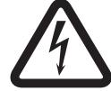

**Warning!**

Indicates a hazardous situation which, if not avoided, could result in death or serious injury.

**!**

#### **Caution!**

Indicates a hazardous situation which, if not avoided, could result in minor or moderate injury.

|  | - |
|--|---|
|  |   |

#### **Notice!**

Indicates a situation which, if not avoided, could result in damage to the equipment or environment, or data loss.

## **1.4 Important Safety Instructions**

Read, follow, and retain for future reference all of the following safety instructions. Heed all warnings on the unit and in the operating instructions before operating the unit.

- 1. **Cleaning** Unplug the unit from the outlet before cleaning. Follow any instructions provided with the unit. Generally, using a dry cloth for cleaning is sufficient, but a moist fluff-free cloth or leather shammy may also be used. Do not use liquid cleaners or aerosol cleaners.
- 2. **Heat Sources** Do not install the unit near any heat sources such as radiators, heaters, stoves, or other equipment (including amplifiers) that produce heat.
- 3. **Ventilation -** Any openings in the unit enclosure are provided for ventilation to prevent overheating and ensure reliable operation. Do not block or cover these openings. Do not place the unit in an enclosure unless proper ventilation is provided, or the manufacturer's instructions have been adhered to.
- 4. **Object and liquid entry** Never push objects of any kind into this unit through openings as they may touch dangerous voltage points or short-out parts that could result in a fire or electrical shock. Never spill liquid of any kind on the unit. Do not place objects filled with liquids, such as vases or cups, on the unit.
- 5. **Lightning** For added protection during a lightning storm, or when leaving this unit unattended and unused for long periods, unplug the unit from the wall outlet and disconnect the cable system. This will prevent damage to the unit from lightning and power line surges.
- 6. **Controls adjustment -** Adjust only those controls specified in the operating instructions. Improper adjustment of other controls may cause damage to the unit. Use of controls or adjustments, or performance of procedures other than those specified, may result in hazardous radiation exposure.
- 7. **Overloading** Do not overload outlets and extension cords. This can cause fire or electrical shock.
- 8. **Power cord and plug protection** Protect the plug and power cord from foot traffic, being pinched by items placed upon or against them at electrical outlets, and its exit from the unit. For units intended to operate with 230 VAC, 50 Hz, the input and output power cord must comply with the latest versions of *IEC Publication 227* or *IEC Publication 245*.
- 9. **Power disconnect** Units have power supplied to the unit whenever the power cord is inserted into the power source, or when High Power-over-Ethernet (High PoE) power is provided over the Ethernet CAT 5E/6 cable. The unit is operational only when the ON/OFF switch is in the ON position. The power cord is the main power disconnect device for switching off the voltage for all units. When High PoE or PoE+ (820.3at) is used to power the unit, the power is provided over the Ethernet cable, which is then the main power disconnect device for switching off the voltage for all units.
- 10. **Power sources** Operate the unit only from the type of power source indicated on the label. Before proceeding, be sure to disconnect the power from the cable to be installed into the unit.

For battery powered units, refer to the operating instructions. For external power supplied units, use only the recommended or approved power supplies.

For limited power source units, this power source must comply with *EN60950*. Substitutions may damage the unit or cause fire or shock.

For 24 VAC units, voltage applied to the unit's power input should not exceed ±10%, or 28 VAC. User-supplied wiring must comply with local electrical codes (Class 2 power levels). Do not ground the supply at the terminals or at the unit's power supply terminals. If unsure of the type of power supply to use, contact your dealer or local power company.

- 11. **Servicing -** Do not attempt to service this unit yourself. Opening or removing covers may expose you to dangerous voltage or other hazards. Refer all servicing to qualified service personnel.
- 12. **Damage requiring service -** Unplug the unit from the main AC power source and refer servicing to qualified service personnel when any damage to the equipment has occurred, such as: the power supply cord or plug is damaged; exposure to moisture, water, and/or inclement weather (rain, snow, etc.); liquid has been spilled in or on the equipment; an object has fallen into the unit; unit has been dropped or the unit cabinet is damaged; unit exhibits a distinct change in performance; unit does not operate normally when the user correctly follows the operating instructions.
- 13. **Replacement parts** Be sure the service technician uses replacement parts specified by the manufacturer, or that have the same characteristics as the original parts. Unauthorized substitutions may cause fire, electrical shock, or other hazards.
- 14. **Safety check -** Safety checks should be performed upon completion of service or repairs to the unit to ensure proper operating condition.
- 15. **Installation** Install in accordance with the manufacturer's instructions and in accordance with applicable local codes.
- 16. **Attachments, changes or modifications** Only use attachments/accessories specified by the manufacturer. Any change or modification of the equipment, not expressly approved by Bosch, could void the warranty or, in the case of an authorization agreement, authority to operate the equipment.

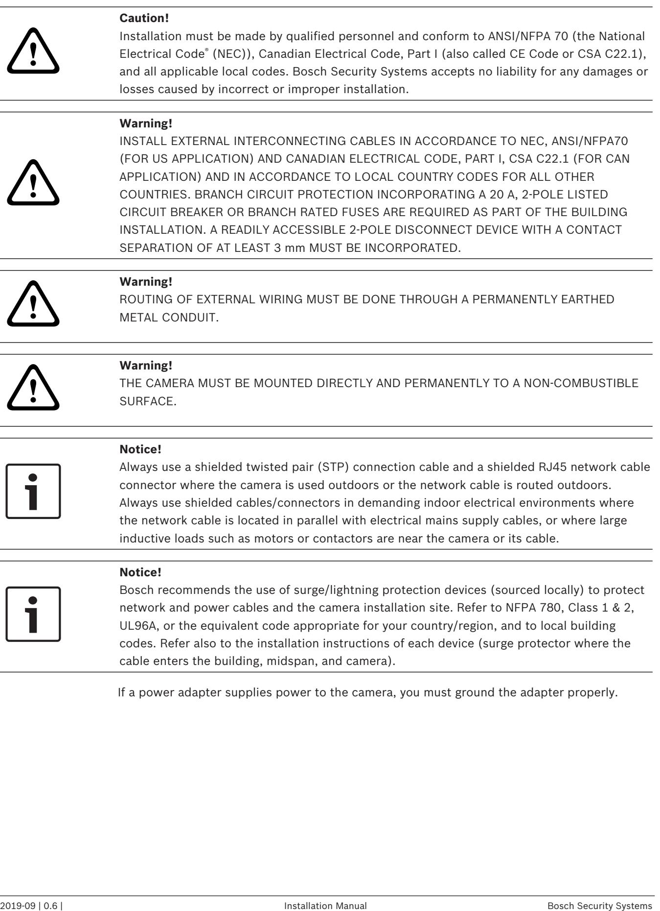

## **1.5 Important Notices**

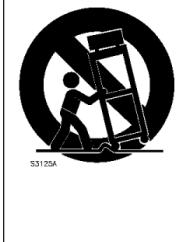

**Accessories** - Do not place this unit on an unstable stand, tripod, bracket, or mount. The unit may fall, causing serious injury and/or serious damage to the unit. Use only with mounting solutions specified by the manufacturer. When a cart is used, use caution and care when moving the cart/unit combination to avoid injury from tip-over. Quick stops, excessive force, or uneven surfaces may cause the cart/unit combination to overturn. Mount the unit per the installation instructions.

**Adjustment of controls** - Adjust only those controls specified in the operating instructions. Improper adjustment of other controls may cause damage to the unit.

**Camera signal -** Protect the cable with a primary protector if the camera signal is beyond 140 feet, in accordance with *NEC800 (CEC Section 60)*.

**Environmental statement** - Bosch has a strong commitment towards the environment. This device has been designed to respect the environment as much as possible.

**Electrostatic-sensitive device -** Use proper ESD safety precautions when handling the camera to avoid electrostatic discharge.

**Fuse rating -** For security protection of the device, the branch circuit protection must be secured with a maximum fuse rating of 16A. This must be in accordance with *NEC800 (CEC Section 60)*.

#### **Grounding:**

- Connect outdoor equipment to the unit's inputs only after this unit has had its ground terminal connected properly to a ground source.

- Disconnect the unit's input connectors from outdoor equipment before disconnecting the grounding terminal.

- Follow proper safety precautions such as grounding for any outdoor device connected to this unit.

U.S.A. models only - *Section 810* of the *National Electrical Code, ANSI/NFPA No.70*, provides information regarding proper grounding of the mount and supporting structure, size of grounding conductors, location of discharge unit, connection to grounding electrodes, and requirements for the grounding electrode.

**Outdoor signals -** The installation for outdoor signals, especially regarding clearance from power and lightning conductors and transient protection, must be in accordance with *NEC725* and *NEC800 (CEC Rule 16-224* and *CEC Section 60)*.

Refer to the "Best Practices for Outdoor Installation" section of the manual for more information on outdoor installations.

**Permanently connected equipment -** Incorporate a readily accessible disconnect device in the building installation wiring.

**Power lines -** Do not locate the camera near overhead power lines, power circuits, or electrical lights, nor where it may contact such power lines, circuits, or lights.

**Damage requiring service** – Unplug the devices from the main AC power source and refer servicing to qualified service personnel whenever any damage to the device has occurred, such as:

- the power supply cable is damaged;

- an object has fallen on the device;

- the device has been dropped, or its enclosure has been damaged;

- the device does not operate normally when the user follows the operating instructions correctly.

**Servicing -** Do not attempt to service this device yourself. Refer all servicing to qualified service personnel.

This device has no user-serviceable parts.

### **Notice!**

This is a **class A** product. In a domestic environment this product may cause radio interference, in which case the user may be required to take adequate measures.

| Income of the consideration of the control of the control of the control of the large of the later of the later of the later of the later of the large of the large of the lar |
|--------------------------------------------------------------------------------------------------------------------------------------------------------------------------------|
|                                                                                                                                                                                |

#### **Notice!**

Ce produit est un appareil de **Classe A**. Son utilisation dans une zone résidentielle risque de provoquer des interférences. Le cas échéant, l'utilisateur devra prendre les mesures nécessaires pour y remédier.

#### **FCC & ICES Information**

#### *(U.S.A. and Canadian Models Only)*

This device complies with part 15 of the FCC Rules. Operation is subject to the following conditions:

- this device may not cause harmful interference, and
- this device must accept any interference received, including interference that may cause undesired operation.

NOTE: This equipment has been tested and found to comply with the limits for a **Class A** digital device, pursuant to Part 15 of the FCC Rules and ICES-003 of Industry Canada. These limits are designed to provide reasonable protection against harmful interference when the equipment is operated in a **commercial environment**. This equipment generates, uses, and radiates radio frequency energy and, if not installed and used in accordance with the instruction manual, may cause harmful interference to radio communications. Operation of this equipment in a residential area is likely to cause harmful interference, in which case the user will be required to correct the interference at his expense.

Intentional or unintentional modifications, not expressly approved by the party responsible for compliance, shall not be made. Any such modifications could void the user's authority to operate the equipment. If necessary, the user should consult the dealer or an experienced radio/television technician for corrective action.

# **1.6 Connection in Applications**

**24 VAC power source:** This unit is intended to operate with a limited power source. The unit is intended to operate at 24 VAC (if High PoE is not available). User supplied wiring must be in compliance with electrical codes (Class 2 power levels).

**High Power-over-Ethernet (High PoE):** This unit can by powered via High PoE. To power the unit this way, use only approved High PoE devices - those offered or recommended by Bosch. High PoE can be connected at the same time as a 24 VAC power supply. If auxiliary power (24 VAC to camera and to heater) and High PoE are applied simultaneously, the camera will selects auxiliary input (24 VAC) as the primary power source.

For pendant models used in outdoor applications that require heaters, a High PoE Midspan (60 W) by Bosch is required to power both the camera and its internal heaters.

For in-ceiling or indoor pendant applications that don't require heater power, standard PoE+ (IEEE 802.3at) midspans or switches can be used to power the camera.

# **1.7 Customer Support and Service**

If this unit needs service, contact the nearest Bosch Security Systems Service Center for authorization to return and shipping instructions.

#### **USA**

Telephone: 800-366-2283 Fax: 800-366-1329 Email: cctv.repair@us.bosch.com

## **Customer Service**

Telephone: 888-289-0096

Fax: 585-223-9180

Email: security.sales@us.bosch.com

#### **Technical Support**

Telephone: 800-326-1450

Fax: 717-735-6560 Email: technical.support@us.bosch.com

#### **Canada**

Telephone: 514-738-2434 Fax: 514-738-8480

#### **Europe, Middle East, Africa, and Asia Pacific Region**s

Please contact your local distributor or Bosch sales office. Use this link: *https://www.boschsecurity.com/corporate/where-to-buy/index.html*

#### **More Information**

For more information, please contact the nearest Bosch Security Systems location or visit [www.boschsecurity.com.](http://www.boschsecurity.com)

# **2 Unpacking**

- This equipment should be unpacked and handled with care. Check the exterior of the packaging for visible damage. If an item appears to have been damaged in shipment, notify the shipper immediately.
- Verify that all the parts listed in the Parts List below are included. If any items are missing, notify your Bosch Security Systems Sales or Customer Service Representative.
- Do not use this product if any component appears to be damaged. Please contact Bosch Security Systems in the event of damaged goods.
- The original packing carton (if undamaged) is the safest container in which to transport the unit and must be used if returning the unit for service. Save it for possible future use.

## **2.1 Parts List**

| Quantity | Component                                  |
|----------|--------------------------------------------|
| 1        | AUTODOME IP starlight 7000i pendant camera |
| 1        | Desiccant silica gel bag                   |
| 1        | ESD zip bag                                |
| 1        | Safety and Unpacking Guide                 |
| 4        | MAC address labels                         |

# **2.2 Tools Required**

| Quantity | Item                                             | For Mount Type                                                                                                                                                | Supplied by Bosch?                     |
|----------|--------------------------------------------------|---------------------------------------------------------------------------------------------------------------------------------------------------------------|-------------------------------------------|
| 1        | Allen wrench, 5 mm                               | Pendant Arm to: – Wall Mount – Corner Mount – Mast (pole) Mount – Roof parapet Mount – Pipe Mount                               | Yes                                       |
| 1        | Screwdriver, straight blade, 2.5 mm (0.1 in.) | – Pendant Arm to: – Wall Mount – Corner Mount – Mast (pole) Mount – Roof parapet Mount – Pipe Mount – In-ceiling Mount | No                                        |
| 1        | Screwdriver, straight blade, 3.1 mm (1/8 in.) | – Pendant Arm to: – Wall Mount – Corner Mount – Mast (pole) Mount – Roof parapet Mount – Pipe Mount – In-ceiling Mount | No                                        |
| 1        | Screwdriver, No. 2 Phillips                   | – Pendant Arm to: – Wall Mount – Corner Mount – Mast (pole) Mount – Roof parapet Mount – Pipe Mount – In-ceiling Mount | No                                        |
| 1        | Socket wrench                                    | Pendant Arm to: – Wall Mount – Corner Mount – Mast (pole) Mount – Roof parapet Mount – Pipe Mount                               | No                                        |
| 1        | Socket, 9/16-in.                                 | Pendant Arm to: – Wall Mount – Corner Mount – Mast (pole) Mount – Roof parapet Mount – Pipe Mount                               | No                                        |
| 1        | Banding tool (Bosch P/N TC9311PM3T)        | Mast (pole) mount                                                                                                                                             | Yes, but sold separately from mount |

| 1 | Right angle NPS conduit connector, 3/4 in. (20- mm) | Mast (pole) mount with VGA-PEND-WPLATE                                            | No |
|---|-----------------------------------------------------------|--------------------------------------------------------------------------------------|----|
| 1 | Screwdriver, medium straight blade                     | – Roof parapet Mount – Pipe Mount                                           | No |
| 1 | Screwdriver, No. 1 Phillips                            | – Roof parapet Mount – Pipe Mount                                           | No |
| 1 | Pipe wrench                                               | – Roof parapet Mount – Pipe Mount                                           | No |
| 1 | Barrel connector                                          | – Roof parapet Mount – Pipe Mount Only if installing a fiber optic model | No |

The following table lists additional products, sold separately by Bosch or other manufacturers, necessary to install AUTODOME cameras.

| Quantity | Product                                         | Part Number     | Size                                    |
|----------|-------------------------------------------------|-----------------|-----------------------------------------|
| 1        | SD card                                         | (user-supplied) |                                         |
| ---      | Water tight metal conduit                       | (user-supplied) | 20 mm (0.75 in.)                        |
| --       | UL-listed liquid tight strain reliefs           | (user-supplied) |                                         |
| --       | Weatherproof sealant                            | (user-supplied) |                                         |
| 4        | Studs, stainless steel, corrosion resistant, | (user-supplied) | 6.4 mm (0.25 in.) to 8 mm (5/16 in.) |

# **3 Product description**

The AUTODOME IP starlight 7000i camera incorporates the latest in Video Analytics, starlight technology, and video streaming. With starlight imaging technology for excellent low-light sensitivity and the most robust Intelligent Video Analytics on the market, the camera delivers unmatched picture quality. Even under the most challenging light conditions, the 30x PTZ dome camera delivers high-definition (HD) 1080p video. Easy to install, the camera is available in either a field-proven, outdoor pendant housing or an indoor, in-ceiling housing. The camera has been designed for quick and easy installation, a key feature from Bosch IP video security products.

All housings feature recessed screws and latches for increased tamper resistance. In an enclosed installation area, still air can cause the operating temperature of the camera to go above the maximum. If you install a camera in an enclosed area, make sure that the operating temperature of the camera does not go above the maximum temperature. The maximum operating temperature is:

- +40 °C (+104 °F) for in-ceiling models
- +55 °C (+131 °F) for pendant models

Make sure that air circulates around the camera to supply cooling.

The following table lists the optional parts, sold separately, that you may need for attaching a Pendant to the Arm Wall, Corner, or Mast mount packages.

| Mounting Options                                                                   | Part Numbers             |  |  |  |
|------------------------------------------------------------------------------------|--------------------------|--|--|--|
| Pendant Arm (Only)                                                                 | VGA-PEND-ARM             |  |  |  |
| Pendant Arm with Mounting Plate (24 V VG5 models only, no power supply box)     | VGA-PEND-WPLATE          |  |  |  |
| Pendant Arm with one of the following Power Supply Boxes:                          |                          |  |  |  |
| – Power Box without transformer (24 VAC)                                        | VG4-A-PA0                |  |  |  |
| – Power Box with 120 VAC transformer or with 230 VAC transformer             | VG4-A-PA1 VG4-A-PA2   |  |  |  |
| Power Supply Box and cover with 120 VAC transformer or with 230 VAC transformer | VG4-A-PSU1 VG4-A-PSU2 |  |  |  |
| Trim Skirt for Power Supply Box (optional) VG4-A-TSKIRT                         |                          |  |  |  |
| Bosch High PoE 60W midspan NPD-6001A                                            |                          |  |  |  |
| Corner Mount Kit                                                                   |                          |  |  |  |
| – Corner Mount Plate                                                            | VG4-A-9542               |  |  |  |
| Mast (Pole) Mount Kit                                                              |                          |  |  |  |
| – Mast Mount Plate                                                              | VG4-A-9541               |  |  |  |
| – Fiber Optic Ethernet Media Converter Kit VG4-SFPSCKT                       |                          |  |  |  |

The following table lists the mandatory parts, sold separately, that you will need for attaching a Pendant to the Roof Parapet and Pipe mount packages:

| Mounting Options                                                                        | Part Numbers             |
|-----------------------------------------------------------------------------------------|--------------------------|
| Parapet (Roof) Mount with one of the following Power Supply Boxes:                      | VGA-ROOF-MOUNT           |
| – Power Supply Box and cover with 120 VAC transformer or with 230 VAC transformer | VG4-A-PSU1 VG4-A-PSU2 |
| Pipe Mount with one of the following Power Supply Boxes:                                | VG4-A-9543               |
| – Power Supply Box and cover with 120 VAC transformer or with 230 VAC transformer | VG4-A-PSU1 VG4-A-PSU2 |

The following table lists the optional parts, sold separately, that you may need for attaching a Pendant to the Roof Parapet and Pipe mount packages:

| Mounting Options                                    | Part Numbers |
|-----------------------------------------------------|--------------|
| Optional Flat Roof Mount Adapter for VGA-ROOF-MOUNT | LTC 9230/01  |

# **4 Pre-installation Checklist**

- 1. Determine the location and distance for the power supply box based on its voltage and current consumption.
You may choose to route the main power supply through an intermediate power supply box (VG4-PSU1 or VG4-PSU2) before connecting the power to the pendant arm power supply box (VG4-PA0).

#### **Caution!**

Select a rigid mounting location to prevent excessive vibration to the camera.

- 2. Use only UL-listed liquid tight strain reliefs for conduits to the Power Supply Box to ensure that water cannot enter the box. You must use water tight conduits and fittings to meet NEMA 4 standards.
- 3. Purchase the appropriate mounting hardware to use, depending on the location of the camera, either wall mount, corner mount, or mast (pole) mount. If your application contains a Power Supply Box, refer to *Mount Power Supply Box (Wall, Mast (Pole), and Corner Mounts), page 25*.

If you are using the Mounting Plate with a 24 V AUTODOME camera, refer to *Installing the VGA-PEND-WPLATE, page 36*.

For units intended to be installed outdoors: All wiring (power and I/O cabling) connecting to the unit must be routed separately inside different permanently earthed metal conduits (not supplied).

**!**

### **Warning!**

To minimize the potential for corrosion on the housing, use only Bosch hardware and mounts. See number 5 (Installation in a corrosive environment) in the section Recommended Use of Your Camera for more information.

- 4. Install all external wiring including power, control, video coax, alarms I/O, relay I/O, and fiber optic cabling. Refer to the *Connection, page 56* chapter for required cable types and allowed lengths.
### **Warning!**

Install external interconnecting cables in accordance to NEC, ANSI/NFPA70 (for US application) and Canadian Electrical Code, Part I, CSA C22.1 (for CAN application) and in accordance to local country codes for all other countries.

Branch circuit protection incorporating a 20 A, 2-pole Listed Circuit Breaker or Branch Rated Fuses are required as part of the building installation. A readily accessible 2-pole disconnect device with a contact separation of at least 3 mm must be incorporated. 24 VAC Class 2 power supply only.

- 5. If you plan to use the Intelligent Tracking feature, refer to *Configuring and Implementing Intelligent Tracking, page 20* before mounting the camera.
# **4.1 Stabilization**

Surveillance cameras are susceptible to vibrations caused by wind or vibrations emanating from the medium to which the camera is attached. Cameras attached to a pole, roof, or to a bridge are especially vulnerable. Bosch offers the following recommendations to stabilize an AUTODOME camera and to decrease the affects of vibration on transmitted images, privacy masks, and Intelligent Tracking.

#### **Pole and Mast Mounts**

- Use a pendant arm with the Pole Mount Adapter (VG4-A-9541).
	- Do not attach a parapet mount to a pole or mast.
- Use a pole designed specifically for CCTV cameras:
	- Do not use a tapered pole.
	- Do not use a pole that has signs or other equipment attached.
- Consult EPA rating / Wind load data to select an appropriate pole.

#### **Roof Mounts**

- Mount the camera in the most stable location on the roof.
- Avoid locations affected by vibrations such as those caused by a rooftop air conditioner.
- Use guy wires to stabilize the AUTODOME against strong winds.
- Use the LTC 9230/01 Flat Roof Mount Adapter where appropriate. This adapter is made specifically for AUTODOME roof applications.

#### **Extreme Mount Applications**

Unique camera mounting applications that are impacted by extreme high winds, heavy traffic, or other conditions may require additional measures to stabilize the camera. Contact a manufacturer that specializes in passive vibration suppression using either damping or isolation.

# **4.2 Configuring and Implementing Intelligent Tracking**

#### **Configuring Intelligent Tracking**

The camera utilizes the built-in Intelligent Video Analytics (IVA) to continuously follow an individual or object even if it passes behind a Privacy Mask or a stationary object. The camera uses objects detected by IVA in a stationary preset position to activate the Intelligent Tracking feature.

The Intelligent Tracking feature allows continuous on-screen following of an individual or an object. This feature operates by recognizing an object in motion and zooms in to approximately 50% (default Tracker zoom threshold) of the field of view for an average target height of six feet. This feature controls the pan/tilt/zoom actions of the camera to keep the selected object in the scene.

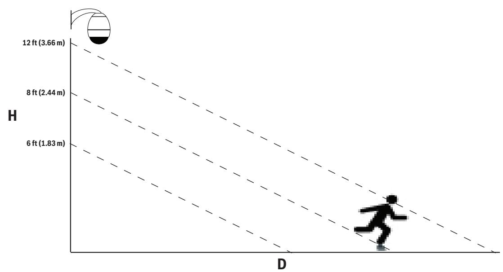

#### **Guidelines for Implementing Intelligent Tracking**

Factors such as the viewing angle and unwanted motion (from trees, for example) may interfere with Intelligent Tracking operation. Use the following recommendations to ensure smooth Intelligent Tracking operation:

#### – **Mount/Mounting Surface Stability**

- Mount the camera in the most stable position. Avoid locations affected by vibrations, such as those caused by a roof-top air conditioner. These vibrations may cause complications when the camera zooms-in on a target.
- Use the pendant arm mount, if possible. This mount option provides the most stability for the camera.
- Use guy wires to protect against strong winds if using the parapet mount.

#### – **Field of View**

- Select a location and viewing angle that allows the flow of people to move across the camera's field of view.
- Avoid motion that moves directly towards the camera.
- Avoid locations that attract large numbers of people, such as retail stores or intersections. Intelligent Tracking is optimized for scenes with very few moving objects.
- **Unwanted Motion**
	- Avoid neon lights, flashing lights, night time lights, and reflected light (from a window or mirror, for example). The flickering of these lights can affect the Intelligent Tracking operation.
	- Avoid motion from moving leaves/branches that present a persistent fixed motion.

# **5 Preparing the bubble**

#### **Notice!**

To avoid excessive moisture saturation inside the housing, limit the amount of time that the bubble is disconnected from the housing. Bosch recommends that the bubble be removed from the housing for no more than five (5) minutes.

#### **Remove the bubble from a pendant housing**

- 1. Using both hands, apply a firm counterclockwise (looking up at the dome) rotational force on the pendant bubble assembly to set the bubble latch.
- 2. Insert a small (2 mm) straight blade screw driver into the release opening in the bubble trim-ring to release the lock, and then remove the screwdriver.

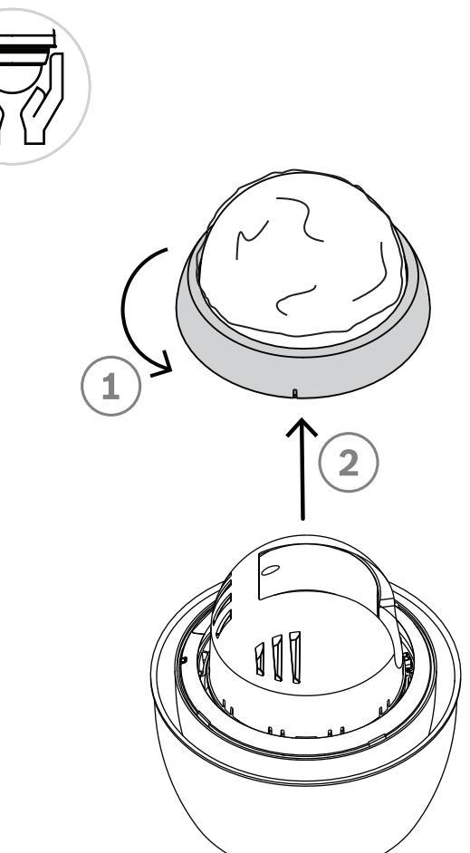

#### **Figure 5.1: Remove the bubble**

- 4 Firmly rotate the bubble counterclockwise approximately 20 degrees until the bubble assembly releases from the pendant housing.
# **6 (Optional) Installing an SD Card**

The camera can accept a customer-supplied **SDHC** or **SDXC** memory card (hereafter referred to as "SD card") for local storage. (The camera will not accept MicroSD cards.) Using an **SD** card is optional.

**Note:** Disconnect power to the camera while adding or removing an **SD** card.

- 1. Follow the steps in one of these sections (depending on the type of camera mount): Remove bubble from in-ceiling housing or Remove bubble from pendant housing.
- 2. Locate the SD card slot (highlighted in the figure below).

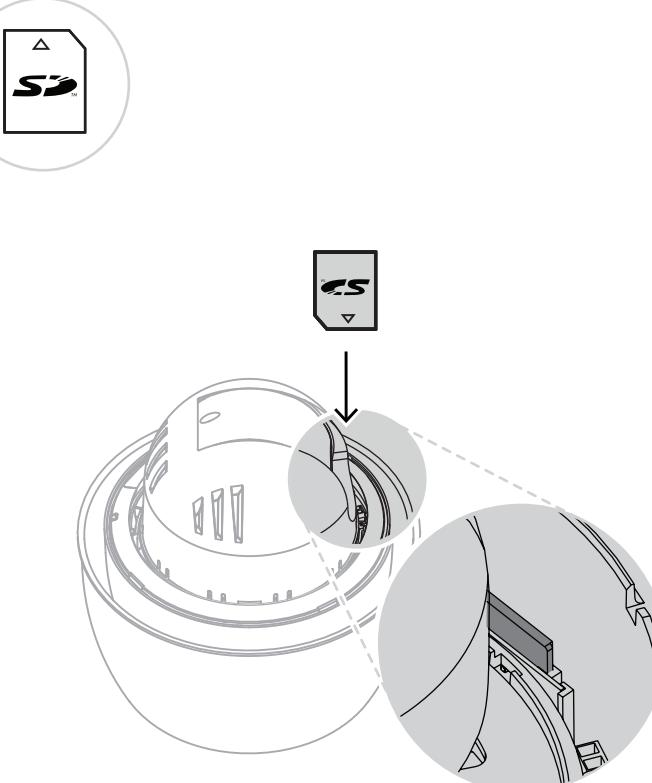

- 3. Orient the card so that the side with the golden contacts faces away from the dome and towards the housing. The contacts should be at the bottom as you hold the SD card.
- 4. Slide the SD card into the slot. Press down the end of the SD cards until you hear a click and the card locks into place.
- 5. Follow the steps in one of these sections (depending on the type of camera mount): Replace the bubble in an in-ceiling housing or Replace the bubble in a pendant housing.

# **7 Replacing the trim ring and bubble**

#### **Replace the bubble in a pendant housing**

- 1. Insert the bubble and trim ring assembly into the pendant housing.
- 2. Rotate the assembly clockwise until it locks. The latch mechanism makes a click when it locks.

# **8 Mount Power Supply Box (Wall, Mast (Pole), and Corner Mounts)**

Before mounting the Power Supply Box, decide if you should wire the box through the holes in the bottom or back of the box. If wiring the box through the back, move the two (2) seal plugs to the bottom through the holes before mounting.

#### **Notice!**

Use 3/4-inch (20-mm) NPS fittings for the holes on the bottom and back of the box. Use 1/2 inch (15-mm) NPS fittings for the side holes.

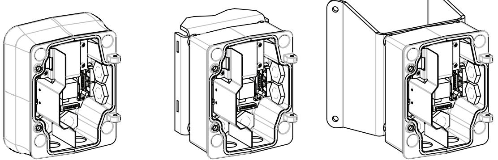

**Figure 8.1: Power Supply Wall, Mast (Pole), and Corner Mounts**

- 1. Use the wall mount template supplied in the packaging box to locate the four (4) mounting holes for the Power Supply Box.
- 2. Drill four (4) holes for the mounting anchors. If installing outdoors, apply a weatherproof sealant around each hole at the mounting surface.

### **Warning!**

A stud diameter of 6.4 mm (1/4 inch) to 8 mm (5/16 inch) able to withstand a 120 kg (265 lb) pull-out force is recommended. The mounting material must be able to withstand this pull out force. For example, 19-mm (3/4-inch) minimum for plywood.

- 3. Place the Power Supply Box into the optional Trim Skirt.
- 4. Secure the Power Supply Box to the mounting surface.
	- For a Wall installation: Use four (4) corrosion-resistant, stainless steel studs (not supplied). Then proceed to Step 5 below.

For a Corner installation: Secure the Corner Plate to the wall corner using four (4) studs (not included). Then proceed to Step 5 below.

 For a Mast or a pole installation: The metal straps included with the Mast mount accommodate a pole with a diameter of 100–380 mm (4–15 in.). You must use a banding tool (sold separately) for a mast or pole installation. Follow the instructions provided with the banding tool to securely mount the Mast Plate to the pole. Contact your Bosch Sales Representative to order Banding Tool P/N TC9311PM3T.

- 5. Secure the Power Supply Box to the Corner Plate or Mast Plate using the four (4) 3/8 x 1-3/4-inch bolts and split lock washers (supplied).
- 6. Attach 3/4-inch (20-mm) NPS watertight, earth-grounded conduit pipe fittings (not supplied) to the bottom or back holes of the Power Supply Box through which you will run the power, video, and control data wires.

#### **Warning!**

2019-09 | 0.6 | Installation Manual Bosch Security Systems **!** For units intended to be installed outdoors: All wiring (power and I/O cabling) connecting to the unit must be routed separately inside different permanently earthed metal conduits (not supplied).

# **9 Installing the Pendant Arm Wall, Corner, and Mast (Pole) Mounts**

# **9.1 Description**

This chapter details how to install an AUTODOME to a Wall, Corner, or Mast (pole) mount. Any differences to the installation between these two mounting systems are noted.

## **9.2 Route Wires and Attach Connectors**

#### **Notice!**

If you plan to route the power through an intermediate power supply box, refer to *Route Power through Intermediate Power Supply Box, page 31*.

Power wires must be routed to the left (front) side of the Power Supply Box through a separate electrically earth-grounded conduit. All video, control, and alarm wires must be routed through a second electrically earth-grounded conduit to the right side of the box.

#### **Warning!**

External interconnecting cables are to be installed in accordance to NEC, ANSI/NFPA70 (for US application) and Canadian Electrical Code, Part I, CSA C22.1 (for CAN application) and in accordance to local country codes for all other countries.

Branch circuit protection incorporating a 20 A, 2-pole Listed Circuit Breaker or Branch Rated Fuses are required as part of the building installation. A readily accessible 2-pole disconnect device with a contact separation of at least 3 mm (0.12 in.) must be incorporated.

#### **Making the Connections**

#### **Notice!**

Refer to the *Connection, page 56* chapter for wire specifications and distances.

- 1. Route all video, control, and alarm wires through the earth-grounded conduit fitting on the right side of the power box.
- 2. Route the high voltage 115/230 VAC lines through the earth-grounded conduit fitting on the left side of the box. The Power Supply Box with a transformer comes with a barrier that separates the high voltage side on the left, from the low voltage 24 VAC side on the right.
- 3. Cut and trim all wires with sufficient slack to reach their connector terminals in the box, but not so long as to be pinched by or to obstruct closing the Pendant Arm. Refer to the image above for the connector locations.
- 4. Attach the supplied 3-pin Power Plug to the incoming power wires. Refer to connector P101 for wire connections.
- 5. If audio input and/or audio output is required, attach the supplied 6-pin SERIAL COMMUNICATIONS to P106 in the Power Supply Box. Refer to connector P106 in the Power Supply Box Connections section below.
- 6. Attach an RJ45 plug to the incoming Ethernet cable.

#### **Connecting Alarm Inputs and Outputs**

- 4 To connect alarm inputs and outputs, attach the supplied 6-pin Alarms In and the 4-pin Alarms Out connector plugs with flying lead wires to the appropriate incoming alarm wires. Alarm Out 4 is a relay.
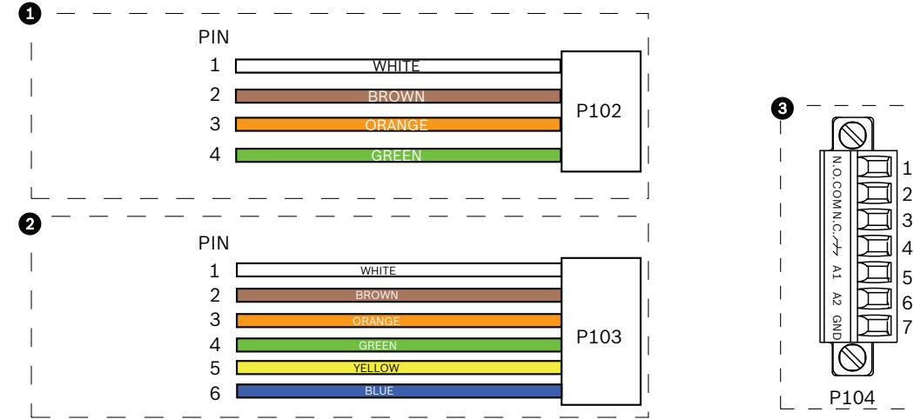

**Figure 9.1: Alarm and relay connectors**

| 1                                                                   | 4-pin Alarm Connector (P102) | 2   | 6-pin Alarm In Connector (P103) | 3   | 7-pin Relay Connector (P104) |
|---------------------------------------------------------------------|---------------------------------|-----|------------------------------------|-----|------------------------------|
| Pin                                                                 | Description                     | Pin | Description                        | Pin | Description                  |
| 1                                                                   | Alarm Out 1                     | 1   | Alarm in 3                         | 1   | Alarm Out 4 Normally Open    |
| 2                                                                   | Alarm Out 2                     | 2   | Alarm in 4                         | 2   | Alarm Out 4 COM              |
| 3                                                                   | Alarm Out 3                     | 3   | Alarm in 5                         | 3   | Alarm Out 4 Normally Closed  |
| 4                                                                   | Alarm Ground                    | 4   | Alarm in 6                         | 4   | Earth Ground                 |
|                                                                     |                                 | 5   | Alarm in 7                         | 5   | Analog Alarm 1               |
|                                                                     |                                 | 6   | Alarm Ground                       | 6   | Analog Alarm 2               |
|                                                                     |                                 |     |                                    | 7   | Ground                       |
| For in-ceiling mount only: Low Voltage TTL (3.3V) can also be used. |                                 |     |                                    |     |                              |

4 If you are connecting supervised alarms and relays, attach the supplied 7-pin Relay Connector to the appropriate incoming wires. Refer to *Make Connections in the Power Supply Box, page 35* for additional information.

#### **Power Supply Box Connections**

The following figure is a detailed illustration of the Pendant Arm Power Supply Box, which includes the fuse specifications.

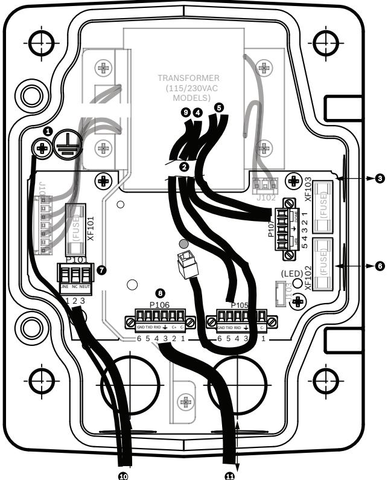

**Figure 9.2: Pendant arm power supply box**

| 1 | Ground Screw                        | 7  | P101 Connector; Power In (120 VAC / 220 VAC)                                      |
|---|-------------------------------------|----|--------------------------------------------------------------------------------------|
| 2 | From Harness (Nexus cable bundle)   | 8  | P106 Connector; Control In/Out for external audio input and output                |
| 3 | In/Out; 1/2 in. (15 mm) NPS Fitting | 9  | P105 Connector; Audio to camera                                                      |
| 4 | Ethernet connector                  | 10 | Power In; 3/4 in. (20 mm) NPS Fitting                                                |
| 5 | P107 Connector; 24 VAC to camera    | 11 | Audio Input/Output; 3/4 in. (20 mm) NPS Fitting (labeled "SERIAL COMMUNICATIONS") |
| 6 | In/Out; 1/2 in. (15 mm) NPS Fitting |    |                                                                                      |

#### **Warning!**

In earlier Bosch AUTODOME cameras, cable 8 in the ARM mount is labeled "Control In/Out" and was used for external RxD/TxD and Biphase communications. In the AUTODOME 7000 Series cameras: If you are mounting an AUTODOME 7000 Series camera to an ARM mount that was wired for an earlier model of Bosch AUTODOME, you must either re-wire cable 8 to be audio input and output, or disconnected it from the power supply.

Cables/wires that are routed through number 2 in the illustration above come from the Nexus cable bundle that is in the pendant Arm.

| Fuse Specifications |             |              |              |  |  |  |
|---------------------|-------------|--------------|--------------|--|--|--|
| Volts               | XF101 Mains | XF102 Camera | XF103 Heater |  |  |  |
| 24 V                | T 5.0 A     | T 2.0 A      | T 3.15 A     |  |  |  |
| 115 V               | T 1.6 A     | T 2.0 A      | T 3.15 A     |  |  |  |
| 230 V               | T 0.8A      | T 2.0 A      | T 3.15 A     |  |  |  |

#### **Warning!**

Fuse replacement by qualified service personnel only. Replace with same type fuse.

| Fuse Specifications |             |              |              |  |  |  |
|---------------------|-------------|--------------|--------------|--|--|--|
| Volts               | XF101 Mains | XF102 Camera | XF103 Heater |  |  |  |
| 24 V                | T 5.0 A     | T 2.0 A      | T 3.15 A     |  |  |  |
| 115 V               | T 1.6 A     | T 2.0 A      | T 3.15 A     |  |  |  |
| 230 V               | T 0.8A      | T 2.0 A      | T 3.15 A     |  |  |  |

The following table lists the Power Supply Box connectors:

| No.  | Connector                         | Pin 1                                                 | Pin 2                | Pin 3                            | Pin 4               | Pin 5                                                 | Pin 6                     |  |  |
|------|-----------------------------------|-------------------------------------------------------|----------------------|----------------------------------|---------------------|-------------------------------------------------------|---------------------------|--|--|
|      | Ground                            |                                                       | Grounding Screw      |                                  |                     |                                                       |                           |  |  |
| P101 | 115/230 VAC or 24 VAC Power In | Line                                                  | NC                   | Neutral                          |                     |                                                       |                           |  |  |
| P106 | SERIAL COMMUNICATIONS          | CODE- (Audio IN-, Audio in signal ground) | CODE+ (Audio IN+) | Earth GND (Ground) (Audio) | RXD (Audio OUT+) | TXD (Audio OUT-; Audio out signal ground) | Signal GND (Ground) |  |  |
| P107 | 24 VAC Power (Arm Harness)     | Camera 24 VAC                                      | Camera 24 VAC     | Earth Ground                  | Heater (24 VAC)  | Heater (24 VAC)                                    |                           |  |  |

**Table 9.1: Power Supply Box Connections**

#### **Notice!**

Pins for P106 1, 2, 4, and 5 are used for audio input and output for AUTODOME 7000 Series cameras; however, their labels are still those of previous versions of analog AUTODOME cameras.

#### **Warning!**

For units intended to be installed outdoors: All wiring (power and I/O cabling) connecting to the unit must be routed separately inside different permanently earthed metal conduits (not supplied).

# **9.3 Route Power through Intermediate Power Supply Box**

You may route the main power supply through a VG4-PSU1 (120 V transformer) or through a VG4-PSU2 (230 V transformer) Power Supply Box before connecting the power to a VG4-PA0 (24 V, no transformer) Power Supply Box. The main issue with this configuration is that the 5 pin power out connector from the VG4-PSU1 or VG4-PSU2 does not match to the 3-pin power input of the VG4-PA0 power supply. The illustration below depicts:

- A VG4-PSU1/VG4-PSU2 Power Supply Box.
- The main power supply connected to the P101 connector and to the grounding screw.
- The 24 VAC power out wire connected to the P107 heater power connectors.

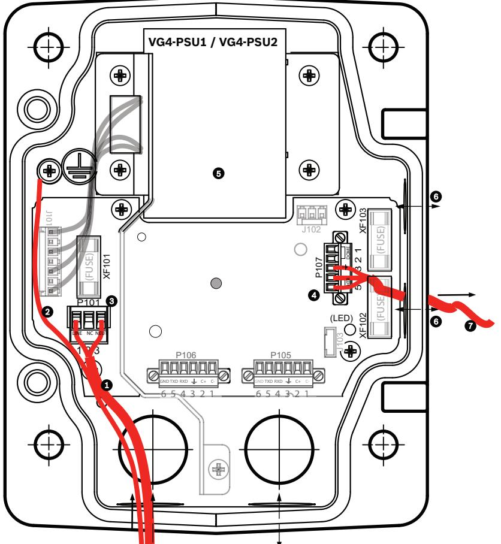

**Figure 9.3: VG4-PSU1/VG4-PSU2**

| 1 | 120/230 VAC Power In | 5 | Transformer                                 |
|---|----------------------|---|---------------------------------------------|
| 2 | Ground Wire          | 6 | In/Out Conduit (1/2 in. [15 mm] NPS Fitting |
| 3 | P101 Connector       | 7 | 24 VAC Power Out to VG4-PA0                 |
| 4 | P107 Connector       |   |                                             |

To properly wire the incoming high voltage and the outgoing low voltage lines, refer to this table:

| No. | Connector | Pin 1           | Pin 2 | Pin 3 | Pin 4 | Pin 5 | Pin 6 |
|-----|-----------|-----------------|-------|-------|-------|-------|-------|
|     | Ground    | Grounding Screw |       |       |       |       |       |

| No.  | Connector            | Pin 1 | Pin 2 | Pin 3        | Pin 4              | Pin 5              | Pin 6 |
|------|----------------------|-------|-------|--------------|--------------------|--------------------|-------|
| P101 | 120/230 VAC Power In | Line  | NC    | Neutral      |                    |                    |       |
| P107 | 24 VAC Power Out     |       |       | Earth Ground | Heater (24 VAC) | Heater (24 VAC) |       |

**Table 9.2: VG4-PSU1/VG4-PSU2 Power Supply Box Connections**

- 1. Route the high voltage 120/230 VAC lines through the earth-grounded conduit fitting on the left side of the box. The Power Supply Box with a transformer comes with a barrier that separates the high voltage side on the left, from the low voltage 24 VAC side on the right.
- 2. Cut and trim the high voltage 120/230 VAC power and ground wires with sufficient slack to reach their connector terminal in the box, but not so long as to be pinched by or to obstruct closing the cover door.
- 3. Attach the supplied 3-pin power plug to the incoming high voltage power wires in the box. Refer to connector P101 in the table above and to the image below for an illustration of these connections:

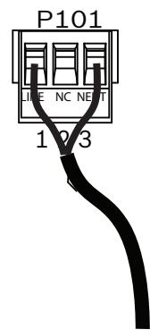

#### **Figure 9.4: Incoming 115/230 VAC power supply**

- 4. Attach the ground wire to the grounding screw.
- 5. Connect three wires to the P107 Power Out connector to route the 24 VAC power supply to the VG4-PA0 Power Supply Box.

Connect the first wire to pin 5 (HN: Heater Neutral) connector.

Connect the second wire to pin 4 (HL: Heater Line) connector.

Connect the third wire to pin 3 (Earth Ground) connector.

Refer to connector P107 in the table above and to the image below for an illustration of these connections:

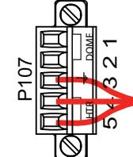

**Figure 9.5: Outgoing 24 VAC power supply**

#### **Warning!**

Ensure that you connect the outgoing power supply wires to the P107 heater connectors (HN and HL). The heater power (XF103) fuse can handle a higher amperage (3.15 A) than the camera power (XF102) fuse (2.0 A).

- 6. Route the 24 VAC outgoing power supply wires into the VG4-PA0 power supply box through the conduit fitting on the left side of the box.
- 7. Cut and trim the 24 VAC power and ground wires with sufficient slack to reach their connector terminal in the box, but not so long as to be pinched by or to obstruct closing the cover door.
- 8. Attach the supplied 3-pin power plug to the incoming 24 VAC power wires in the box, as illustrated below.

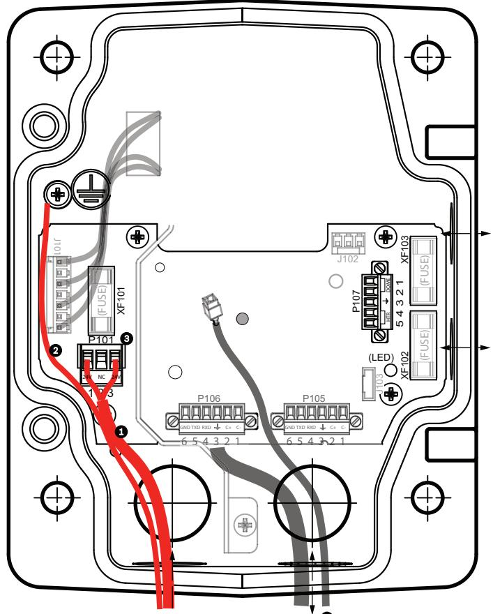

**Figure 9.6: VG4-PA0 Power Supply Box**

| 1 | Incoming 24 VAC Power Supply Wires (from VG4-PSU1/VG4-PSU2 power supply box) |
|---|------------------------------------------------------------------------------|
| 2 | Ground Wire                                                                  |
| 3 | P101 Connector                                                               |
| 4 | Control Data and Video In/Out Wires (analog models only)                     |

9. Follow the instructions in *Attach Pendant Arm to Power Supply Box, page 33* to continue the installation.

## **9.4 Attach Pendant Arm to Power Supply Box**

The bottom hinge pin of the Pendant Arm is provided with a Hinge Pin Stop to hold the hinge open while attaching the arm to the Power Supply Box.

- 1. Compress the bottom hinge pin by pushing the pin lever downward and rotating it behind the Hinge Pin Stop.
#### **34** en | Installing the Pendant Arm Wall, Corner, and Mast (Pole) Mounts AUTODOME IP starlight 7000i

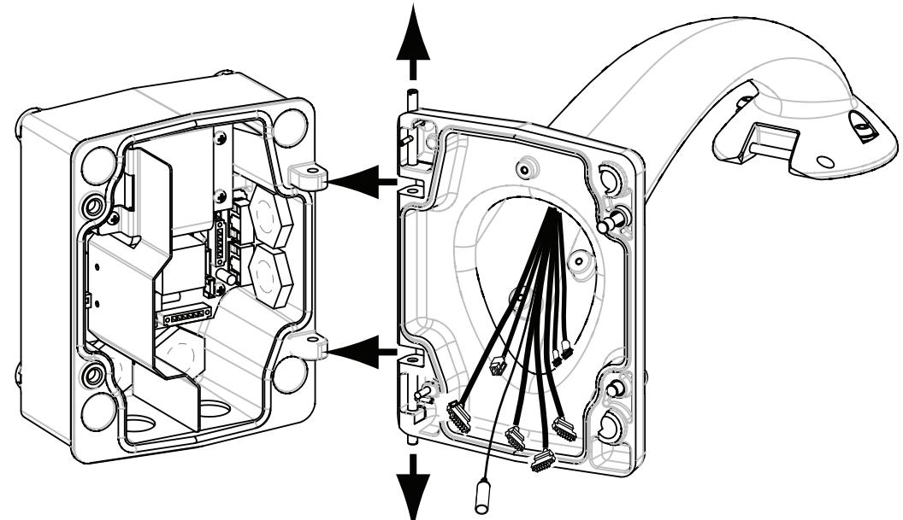

#### **Figure 9.7: Pendant Arm to Power Box Hinge Alignment**

- 2. Open the top hinge by pushing its pin lever up and holding it.

|  | - |
|--|---|

#### **Notice!**

Both Hinge Pins must be fully compressed to open (unlock) the hinges of the Pendant Arm and before proceeding to the next step.

- 3. While continuing to hold the top hinge pin open and align the top and bottom hinges of the Pendant Arm to their mating points on the Power Supply Box. See the illustration above.
- 4. Once you have aligned the hinges, release the top hinge pin to engage its mating hinge on the power box. Then release the bottom hinge pin from the Hinge Pin Stop to lock the Pendant Arm to the Power Supply Box.

#### **Warning!**

Serious injury or death can occur if the hinge pins of the Pendant Arm are not fully engaged (locked) to the Power Supply Box. Exercise caution before releasing the Pendant Arm.

**9.5 Make Connections in the Power Supply Box**

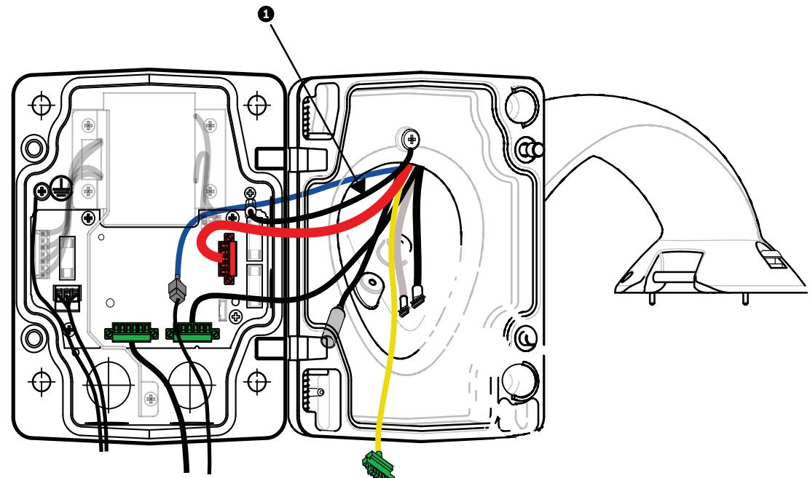

#### **Figure 9.8: Pendant Arm connections to Power Supply Box**

- 1. Attach the earth ground wire (item 1 in the illustration above) to the grounding screw on the left side of the power box.
- 2. Connect the 6-pin Control In/Out Plug, installed previously, to its mating connector P106 in the power box.
- 3. Connect the 6-pin Control to Dome Plug from the Pendant Connector Harness to its mating connector P105 in the power box.
- 4. Connect the 5-pin, 24 VAC to Dome Plug from the Pendant Connector Harness to its corresponding color mating connector P107 on the right side of the box.
- 5. To connect alarm inputs and relay outputs, connect the 4-pin Alarms Out, the 6-pin Alarms In, and the 7-pin Relay connectors from the Pendant Connector Harness to their mating connectors, installed previously, to the incoming alarm wires.
- 6. Connect the 3-pin Power In Plug, installed previously, to its mating connector P101 on the left side of the box.
- 7. Connect the incoming RJ45 video connector, installed previously, to its mating connector from the Pendant Connector Harness.
- 8. Attach the grounding strap of the Pendant Arm to the Power Supply Box.
- 9. After making the harness connections to the Power Supply Box, rotate the Pendant Arm to close and seal the Power Supply Box and tighten the two (2) captive screws to 10‑12 N-m (90-105 in.-lbs).
- 10. Refer to *Attach Pendant to Arm and Tighten, page 39* to continue the installation procedure.

#### **Notice!**

After all wiring is complete, close the cover door and tighten the two (2) captive screws on the cover door to 10-12 N-m (90-105 in.-lbs) to ensure the Power Supply Box is watertight.

## **9.6 Installing the VGA-PEND-WPLATE**

This section provides instructions to install a wall, corner, or mast mount with the VGA-PEND-WPLATE Mounting Plate instead of a Power Supply Box.

#### **Caution!**

You must route the main power supply through a 120/230 VAC transformer (VG4-PSU1 or VG4-PSU2 power supply box) before connecting the power to a 24 VAC AUTODOME camera.

### **Warning!**

A stud diameter of 6.4 mm (1/4 inch) to 8 mm (5/16 inch) able to withstand a 120 kg (265 lb) pull-out force is recommended. The mounting material must be able to withstand this pull out force. For example, 19-mm (3/4-inch) minimum for plywood.

#### 1. **For a Corner installation:**

Secure the Corner Plate to the wall corner using four (4) studs (not included). Secure the Mounting Plate to the Corner Plate using the four (4) 3/8 x 1-3/4-inch bolts and split lock washers (supplied).

#### 2. **For a Mast or pole installation**:

The metal straps included with the Mast mount accommodate a pole with a diameter of 100–380 mm (4–15 in.). You must use a banding tool (sold separately) for a mast or pole installation. In addition, you must obtain a 3/4 in. (20-mm) right angle conduit connector through which you route the wires that connect to the pendent arm.

 Follow the instructions provided with the banding tool to securely mount the Mast Plate to the pole. Contact your Bosch Sales Representative to order Banding Tool P/N TC9311PM3T.

Secure the Mounting Plate to the Mast Plate using the four (4) 3/8 x 1-3/4-inch bolts and split lock washers (supplied).

Remove one of the rubber gaskets from the Mounting Plate.

Once the Mounting Plate (item 1, below) is attached to the Mast Plate (item 2), connect the right angle conduit (item 3) to the Mounting Plate through the empty conduit hole as shown below:

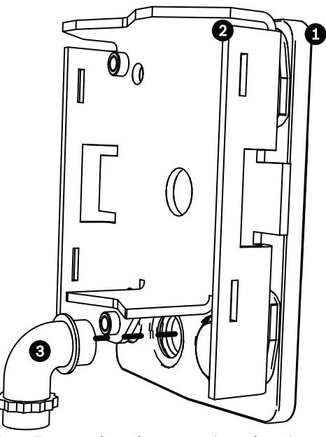

- 3. Ensure that the mounting plate is secure.
#### **Attach the Pendant Arm to the Mounting Plate**

The bottom hinge pin of the Pendant Arm is provided with a Hinge Pin Stop to hold the hinge open while attaching the arm to the Mounting Plate.

- 1. Compress the bottom hinge pin by pushing the pin lever downward and rotating it behind the Hinge Pin Stop.
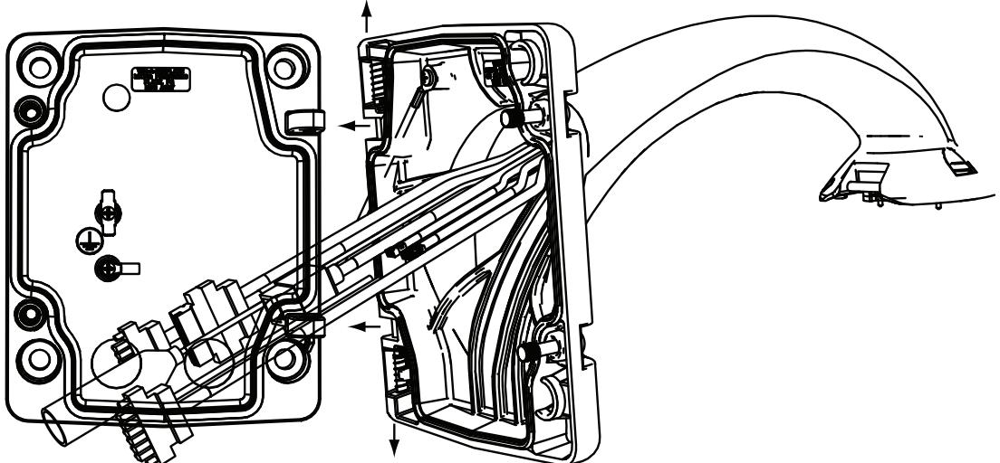

**Figure 9.9: Connect Pendant Arm to Mounting Plate**

- 2. Open the top hinge by pushing its pin lever up and holding it. **Note**: Both Hinge Pins must be fully compressed to open (unlock) the hinges of the Pendant Arm and before proceeding to the next step.
- 3. While continuing to hold the top hinge pin open, align the top and bottom hinges of the Pendant Arm to their mating points on the Mounting Plate.
- 4. Once you have the hinges aligned, release the top hinge pin to engage its mating hinge on the Mounting Plate. Then release the bottom hinge pin from the Hinge Pin Stop to lock the Pendant Arm to the Mounting Plate.

#### **Route and Connect Wires to a Power Supply Box**

The illustration below depicts the power and control cables connected to the Pendant Arm:

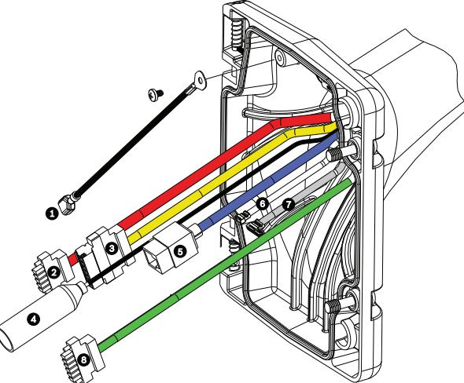

**Figure 9.10: Pendant Arm Cables**

|   | Cable                   |   | Cable                     |
|---|-------------------------|---|---------------------------|
| 1 | Grounding Strap (black) | 5 | UTP Video/Ethernet (blue) |

| 2 | 24 VAC Power (red)                                                         | 6 | Alarm Outputs (white)                                                                    |
|---|----------------------------------------------------------------------------|---|------------------------------------------------------------------------------------------|
| 3 | Relay Contacts (yellow)                                                    | 7 | Alarm Inputs (gray)                                                                      |
| 4 | Coax Video (black) (Not applicable for AUTODOME 7000 Series cameras) | 8 | Serial Communications (green) Used for Audio Input/Output in AUTODOME 7000 Series. |

#### **Notice!**

Refer to the *Connection, page 56* chapter for wire specifications and distances.

- 1. Route all incoming wires through one of the earth-grounded conduits at the bottom of the Mounting Plate. For a mast mount, route all wires through the right-angle conduit.
- 2. Attach the water-tight plug to the other conduit.
- 3. Attach the grounding spade terminal (item 1, below) to one of the spade terminals inside the Mounting Plate.

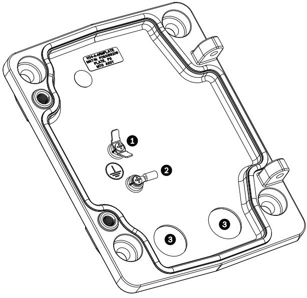

**Figure 9.11: Mounting Plate - Inside Detail**

| Ref. | Description                               |
|------|-------------------------------------------|
| 1    | Grounding lug with two spade terminals    |
| 2    | Earth ground lug with crimp ring terminal |
| 3    | Wire input conduit holes                  |

- 4. Connect the incoming 24 VAC power wires to the 5-pin, 24 VAC Power In mating connector (supplied with the Mounting Plate kit) for the camera and for the Heater.
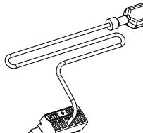

- 5. Attach the grounding spade from the 5-pin mating connector to the other spade terminal inside the mounting plate.
- 6. Attach the 5-pin Power In mating connector to the 24 VAC Power cable (cable 2) connected to the pendant.
- 7. Remove the mating connector from the Relay Contacts cable (cable 3).
- 8. Connect the incoming relay contact wires to the mating connector. Then, reattach the mating connector to the Relay Contacts cable.
- 9. Attach an RJ45 plug to the incoming UTP cable.
- 10. Connect the incoming RJ45 video connector, installed previously, to the UTP Video/ Ethernet cable (cable 5).
- 11. Connect the outgoing alarm wires to the flying leads coming from the 4-pin Alarm Outputs cable (cable 6).
- 12. Connect the incoming alarms wires to the flying leads coming from the 6-pin Alarm Inputs cable (cable 7).
- 13. Connect the incoming serial communication wires to the 6-pin mating connector supplied with the VGA-PEND-WPLATE kit. Refer to the Power Supply Box Connections table above for details.
- 14. Attach the 6-pin serial communication mating connector to the Serial Communications cable (cable 8).
- 15. Connect the Earth ground wire, if available, to the crimp ring terminal inside the Mounting Plate.

**Note**: The Earth ground is not provided with the VGA-PEND-WPLATE kit; it is a ground connection made at the installed location.

- 16. After making the harness connections to the Mounting Plate, rotate the Pendant Arm to close and tighten the two (2) captive screws to 10‑12 N-m (90-105 in.-lbs).
#### **Notice!**

After all wiring is complete, close the cover door and tighten the two (2) captive screws on the cover door to 10-12 N-m (90-105 in.-lbs).

## **9.7 Attach Pendant to Arm and Tighten**

#### **Notice!**

Before attaching the AUTODOME Pendant, visually inspect the dome and arm connectors for any blocked pin holes or bent pins.

- 1. Tilt the bottom of the dome toward the pendant arm base and place the mounting hook, located on top of the dome housing, over the recessed hinge pin of the arm.
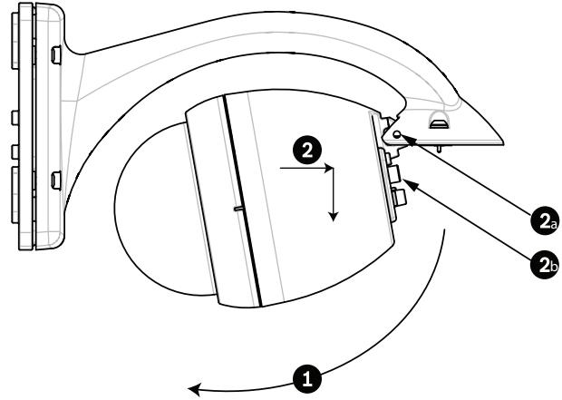

#### **Figure 9.12: Attach Pendant to Arm**

| 1  | Tilt up.                                                                               |
|----|----------------------------------------------------------------------------------------|
| 2  | Hook and drop.                                                                         |
| 2a | Recessed Hinge Pin                                                                     |
| 2b | Dome Connector                                                                         |
| 3  | Rotate down to engage dome connector.                                                  |
| 4  | Tighten the two (2) mounting screws to a minimum torque of 10-12 N-m (90-105 in.-lbs). |

- 2. Drop the dome housing down slightly to engage the dome housing hook on the Pendant Arm hinge pin, allowing the dome to rotate around the pin.
- 3. Rotate the dome housing down to a vertical position and gently push upward to engage the connector on top of the dome housing.

#### **Caution!**

If you feel any resistance when rotating the dome housing or when engaging the connector, stop immediately and start over.

- 4. Hold the Pendant housing in position while tightening the two (2) 5-mm Allen head mounting screws on top of the housing to **10-12 N-m (90-105 in.-lbs)**.

#### **Caution!**

You must tighten the two mounting screws to a minimum torque of 10-12 N-m (90‑105 in.-lbs) to ensure a proper seal between the arm and the housing.

# **10 Installing the Roof Parapet and Pipe Mounts**

# **10.1 Description**

This chapter details how to install an AUTODOME camera to a Roof Parapet or to a Pipe mount. Any differences to the installation between these two mounting systems are noted. The VGA-ROOF-MOUNT is a stationary mount intended for rooftop parapet vertical walls. It is made of light weight aluminum with a corrosion-resistant finish and is used for all Bosch AUTODOME cameras up to a rated load of 29 kg (64 lb). This mount can be fitted to the inside or outside of parapet walls and can swivel for ease of positioning and for servicing the camera. Note that customers must purchase separately the VG4-A-9543 Pipe Mount to use on the end of the VGA-ROOF-MOUNT.

The end of the Pipe Mount that is meant to terminate into an enclosure is intended to be fieldinstalled and shall be marked or provided with instructions that identify the equipment necessary to maintain the environmental integrity of the enclosure. In order to maintain the integrity of a Type 4X environment, the connected equipment must have a Type 4X environmental rating. In order to maintain the integrity of a Type 4 environment, the connected equipment must have a Type 4, Type 4X, Type 6, or Type 6P environmental rating.

# **10.2 Route Wires and Attach Connectors**

Power wires must be routed to the left (front) side of the Power Supply Box through a separate electrically earth-grounded conduit. All video, control, and alarm wires must be routed through a second electrically earth-grounded conduit to the right side of the box.

### **Warning!**

External interconnecting cables are to be installed in accordance to NEC, ANSI/NFPA70 (for US application) and Canadian Electrical Code, Part I, CSA C22.1 (for CAN application) and in accordance to local country codes for all other countries.

Branch circuit protection incorporating a 20 A, 2-pole Listed Circuit Breaker or Branch Rated Fuses are required as part of the building installation. A readily accessible 2-pole disconnect device with a contact separation of at least 3 mm (0.12 in.) must be incorporated.

There are two possible methods to route the video, control, and alarm wires: Method One is to route the video, control, and alarm wires through the conduit fitting on the right (front) side of the Power Supply Box and out to the AUTODOME Interface Board.

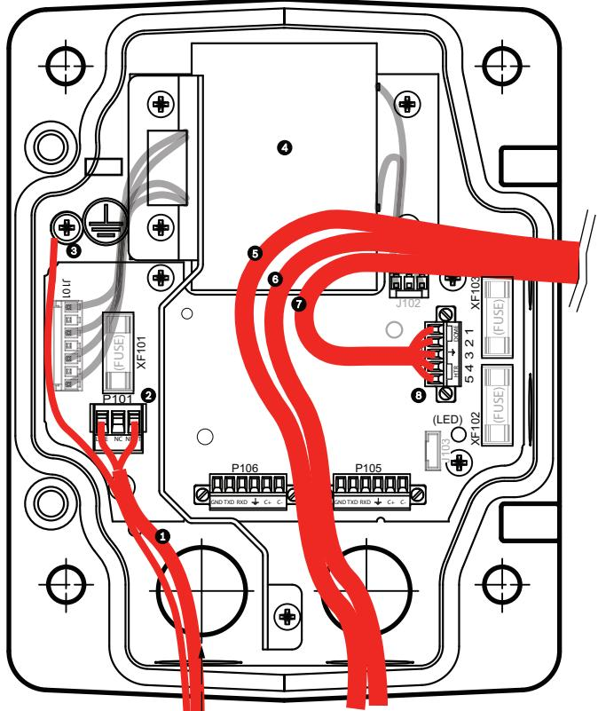

#### **Figure 10.1: VG4-A-PSU1 or VG4-A-PSU2 Power Supply Box**

| 1 | 120 VAC/230 VAC Power In | 6  | Control Wire Used for Audio input and output in AUTODOME 7000 Series.                           |
|---|--------------------------|----|-------------------------------------------------------------------------------------------------------|
| 2 | P101 Connector           | 7  | 24 VAC Power Out                                                                                      |
| 3 | Ground Connection        | 8  | P107 Connector                                                                                        |
| 4 | Transformer              | 9  | Earth-grounded conduit with power input and earth-ground connection                                |
| 5 | Ethernet Wire            | 10 | Earth-grounded conduit with Ethernet video/control, audio input and output to "head-end" system |
|   |                          | 11 | Earth-grounded conduit to camera                                                                      |

#### **Wiring the Power Supply Box**

#### **Notice!**

Refer to the *Connection, page 56* chapter for wire specifications and distances.

- 4 Route the high voltage 115/230 VAC lines through the earth-grounded conduit fitting on the left side of the box.
**Notice!**

The Power Supply Box with transformer comes with a barrier that separates the high voltage side on the left from the low voltage 24 VAC side on the right.

- 1. Cut and trim the high voltage 115/230 VAC power and ground wires with sufficient slack to reach their connector terminal in the box, but not so long as to be pinched by or to obstruct closing the Cover Door.
- 2. Attach the supplied 3-pin Power Plug to the incoming high voltage power wires in the box. Refer to connector P101 in the Power Supply Box Connections section below.
- 3. Route the Ethernet cable out to where the camera will be mounted.
- 4. Route the low power 24 VAC wires from the right side of the Power Supply Box out to where the camera will be mounted. Attach the supplied 5-pin 24 VAC Dome plug to the wire ends inside the box. Refer to connector P107 in the Power Supply Box Connections section below.

#### **Wiring the Fiber Optic Model**

If installing a Fiber Optic model, follow these steps:

#### **Notice!**

Refer to the *Connection, page 56* chapter for fiber optic specifications. For instructions on installing a fiber optic module into a power supply box, see the *VG4 Fiber Optic Media Converter Installation Guide* that ships with the module.

- 1. Bring the fiber optic cable (item 3 in the figure below) into the right side of the power supply box.
- 2. Connect the fiber optic cable to the port for the SFP module (item 2 in the figure below).
- 3. Connect the RJ45 plug of the cable to the RJ45 socket (item 1 in the figure below) on the fiber optic module in the power supply box.
- 4. Route the control wires from the Power Supply to the Pipe Interface Board. Then attach the supplied six (6) pin control data connector to the wires in the Power Supply Box. Refer to *Wire the Pipe Interface Board, page 48*.

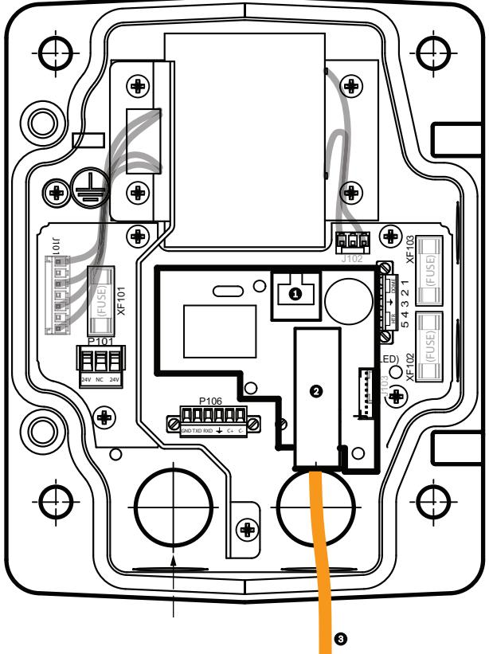

**Figure 10.2: Fiber Optic Ethernet Module installed**

| 1 | RJ45 Ethernet socket                  |
|---|---------------------------------------|
| 2 | Port for SFP module (sold separately) |
| 3 | Fiber Optic cable (user-supplied)     |

#### **Power Supply Box Connections**

The following figure is a detailed illustration of the Roof or Pipe Mount Power Supply Box, which includes the fuse specifications.

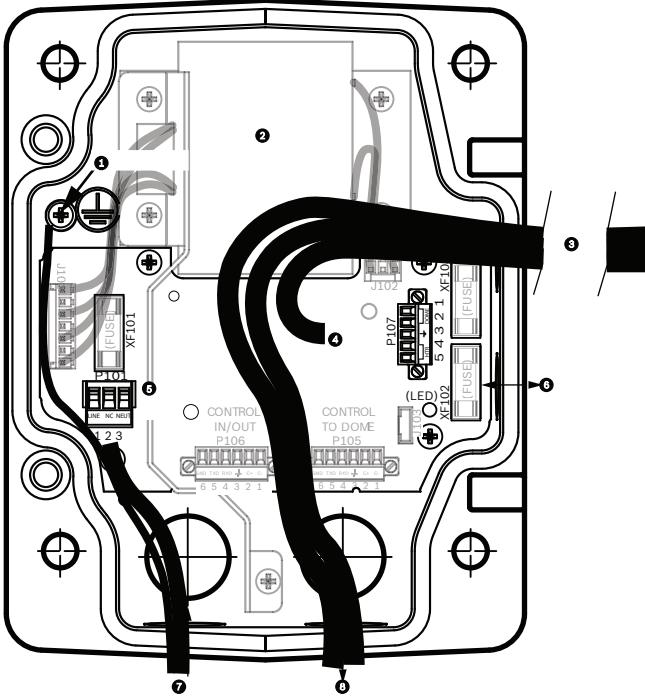

**Figure 10.3: Power Supply Box Connections**

| 1 | Ground Screw                    | 5 | Power In                                                      |
|---|---------------------------------|---|---------------------------------------------------------------|
| 2 | Transformer (115/230 VAC Modes) | 6 | In/Out; 1/2 in. (15 mm) NPS Fitting                           |
| 3 | In/Out to camera                | 7 | Power In; 3/4 in. (20 mm) NPS Fitting                         |
| 4 | 24 VAC to Dome Interface Board  | 8 | Control Data and Video In/Out; 3/4 in. (20 mm) NPS Fitting |

#### **Warning!**

Fuse replacement by qualified service personnel only. Replace with same type fuse.

| Fuse Specifications  |         |              |              |  |  |  |
|----------------------|---------|--------------|--------------|--|--|--|
| Volts XF101 Mains |         | XF102 Camera | XF103 Heater |  |  |  |
| 24 V                 | T 5.0 A | T 2.0 A      | T 3.15 A     |  |  |  |
| 115 V                | T 1.6 A | T 2.0 A      | T 3.15 A     |  |  |  |
| 230 V                | T 0.8A  | T 2.0 A      | T 3.15 A     |  |  |  |

The following table lists the Power Supply Box connectors:

| No. | Connector | Pin 1 | Pin 2           | Pin 3 | Pin 4 | Pin 5 | Pin 6 |  |
|-----|-----------|-------|-----------------|-------|-------|-------|-------|--|
|     | Ground    |       | Grounding Screw |       |       |       |       |  |

| No.  | Connector                         | Pin 1          | Pin 2          | Pin 3        | Pin 4              | Pin 5              | Pin 6 |
|------|-----------------------------------|----------------|----------------|--------------|--------------------|--------------------|-------|
| P101 | 115/230 VAC or 24 VAC Power In | Line           | NC             | Neutral      |                    |                    |       |
| P107 | 24 VAC Power to Dome Plug      | Dome 24 VAC | Dome 24 VAC | Earth Ground | Heater (24 VAC) | Heater (24 VAC) |       |

## **10.3 Attach Cover Door to Power Supply Box**

- 1. Compress the bottom hinge pin by pushing the pin lever down and then rotate it behind the Hinge Pin Stop. The power box Cover Door provides a Hinge Pin Stop to hold the bottom hinge open while attaching the door.
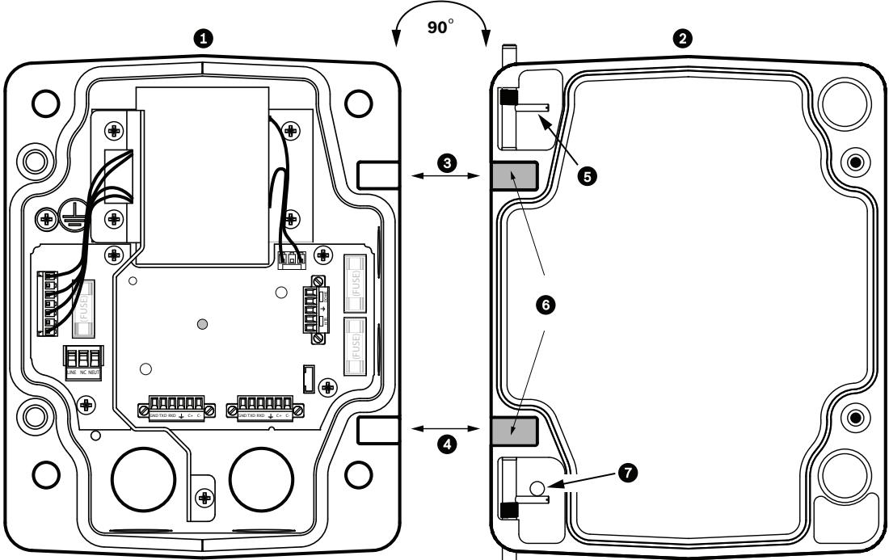

#### **Figure 10.4: Align Cover Door Hinge to Power Box**

| 1 | Power Supply Box   | 5 | Hold Hinge Pin Open |
|---|--------------------|---|---------------------|
| 2 | Cover Door         | 6 | Open Position       |
| 3 | Align Top Hinge    | 7 | Hinge Pin Stop      |
| 4 | Align Bottom Hinge |   |                     |

- 2. Open the top hinge by pushing its pin lever outward and holding it open. **Note:** Both Hinge Pins must be fully compressed to open (unlock) the female hinges of the Cover Door before proceeding to the next step.
- 3. While holding the top hinge pin open, position the Cover Door to the Power Supply Box and align its hinges.
- 4. When the hinges are aligned, release the top hinge pin to engage its mating hinge on the power box. Then release the bottom hinge pin from the Hinge Pin Stop to complete attaching the Cover Door to the Power Supply Box.

#### **Notice!**

After all wiring is complete, close the cover door and tighten the two (2) captive screws on the cover door to 10-12 N-m (90-105 in.-lbs) to ensure the Power Supply Box is watertight.

# **10.4 Installing the VG4-A-9543 Pipe Mount**

This section details the installation steps for the VG4-A-9543 Pipe Mount. If you are installing the Roof Parapet mount, refer to Installing the VG4-ROOF-MOUNT for instructions.

#### **Notice!**

Customer must supply 1-1/2 inch (NPS) pipe threaded on both ends with a minimum length of 5 inches (12.7 cm).

You must use Teflon tape for thread-sealing compound. All screws shall be tightened securely.

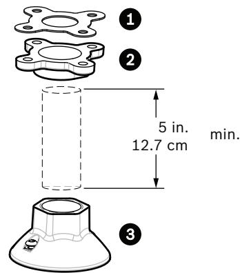

**Figure 10.5: Pipe Mount**

| 1 | Gasket |
|---|--------|
| 2 | Flange |
| 3 | Cap    |

- 1. Before installing the Top-Mounting Flange, ensure there is an adequate opening in the ceiling or mounting structure for the wires to pass through.
- 2. Secure the pipe Flange with supplied gasket to the ceiling or other supporting structure using four (4) 10-mm (3/8-inch) diameter fasteners.

#### **Notice!**

Each fastener must have a minimum pullout strength of 275 kg (600 lbs). The mounting material must be able to withstand this pull-out force. For example, 19-mm (3/4-inch) minimum for plywood.

- 3. Attach pipe (not supplied) to the Top-mounting Flange.

### **Warning!**

You must thread the pipe onto the Top-mounting Flange until it is tight. Failure to do so can result in damage, serious injury or death.

- 4. Route the power, video, control, and alarm wires through the Top-Mounting Flange and down the pipe.
- 5. Wrap at least five layers of Teflon tape around the threads.

- 6. Apply the supplied thread sealant to the threads on the Pipe. Make sure all surfaces are clean and dry. Apply a bead of sealant completely around the leading threads of the male fitting.
Force the adhesive into the threads to thoroughly fill all voids.

- 7. Thread the Pipe Cap onto the down pipe and tighten securely to prevent leaks.
#### **Warning!**

You must thread the Dome Cap onto the pipe until it is tight. Failure to do so can result in damage or serious injury or death.

## **10.5 Wire the Pipe Interface Board**

This section provides instructions for connecting wires and cables to the Pipe Interface Board, as illustrated below. Refer to the *Connection, page 56* chapter for cable and wiring recommendations and specifications.

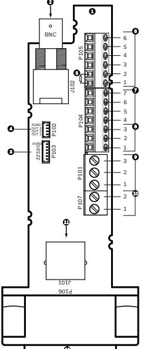

**Figure 10.6: Pipe Interface Board Connections**

| Ref. | Description                                                                                                                   | Connector Wire | Gauge        | Pin | Description                                                                      |
|------|-------------------------------------------------------------------------------------------------------------------------------|----------------|--------------|-----|----------------------------------------------------------------------------------|
| 1    | Pipe Interface Module                                                                                                      |                |              |     |                                                                                  |
| 2    | Video Coax In                                                                                                                 | J102           |              |     |                                                                                  |
| 3    | 6-pin Connector Alarms In (3-7)                                                                                            | P103           |              |     |                                                                                  |
| 4    | 4-pin Connector Alarms Out (1-3)                                                                                           | P102           |              |     |                                                                                  |
| 5    | 100 Ω Resistor Note: When using the audio input in an AUTODOME 7000 Series camera, remove this resistor. | P105           |              |     |                                                                                  |
| 6    | Data In/Out                                                                                                                   | P105           | AWG 26-16 | 1   | Biphase (C-) For AUTODOME 7000 Series: AUDIO IN – (Audio in signal ground) |
|      |                                                                                                                               |                |              | 2   | Biphase (C+) For AUTODOME 7000 Series: AUDIO IN +                          |
|      |                                                                                                                               |                |              | 3   | Earth Ground                                                                     |
|      |                                                                                                                               |                |              | 4   | RxD + For AUTODOME 7000 Series: AUDIO OUT +                                |
|      |                                                                                                                               |                |              | 5   | TxD – For AUTODOME 7000 Series: AUDIO OUT – (Audio out signal ground)      |
|      |                                                                                                                               |                |              | 6   | Signal Ground                                                                    |
| 7    | Alarms In (EOLR                                                                                                               | P104           | AWG          | 7   | Ground                                                                           |
|      | Supervised, 1-2)                                                                                                              |                | 26-16        | 6   | Alarm 2                                                                          |
|      |                                                                                                                               |                |              | 5   | Alarm 1                                                                          |
|      |                                                                                                                               |                |              | 4   | Earth Ground                                                                     |
| 8    | Relay Output                                                                                                                  | P104           | AWG          | 3   | Normally Closed                                                                  |
|      |                                                                                                                               |                | 26-16        | 2   | Common                                                                           |
|      |                                                                                                                               |                |              | 1   | Normally Open                                                                    |
| 9    | Dome Power                                                                                                                    | P101           | AWG 18-14 | 3   | Dome 24 VAC                                                                      |
|      |                                                                                                                               |                |              | 2   | Earth Ground                                                                     |

| Ref. | Description   | Connector Wire | Gauge        | Pin | Description   |
|------|---------------|----------------|--------------|-----|---------------|
|      |               |                |              | 1   | Dome 24 VAC   |
| 10   | Heater Power  | P107           | AWG 18-14 | 2   | Heater 24 VAC |
|      |               |                |              | 1   | Heater 24 VAC |
| 11   | RJ45 Ethernet | J101           |              |     |               |
| 12   | To camera     |                |              |     |               |

The Pipe Interface Board contains all of the connectors for control, data, image, and power wires. Follow the procedures below to make the proper connections.

#### **Warning!**

Use a 24 VAC Class 2 power supply only.

- 1. Attach an RJ45 connector plug to the Ethernet cable and connect the plug to its mating connector J101 on the Pipe Interface Board.
- 2. Attach the control data in/out wires to their respective terminals on the P105 connector on the Pipe Interface Board.
- 3. Connect the 24 VAC power wires to the P101 connector on the Pipe Interface Board. If this model has a heater, connect the 24 VAC heater power wires to connector P107.

#### **Caution!**

To protect the camera from damage due to cold temperatures, ensure that you connect the 24 VAC heater power wires to the P101 connector.

#### **Connecting Alarm Inputs and Outputs**

- 4 To connect alarm inputs and outputs, attach the supplied 6-pin Alarms In and the 4-pin Alarms Out connector plugs with flying lead wires to the appropriate incoming alarm wires. Alarm Out 4 is a relay.
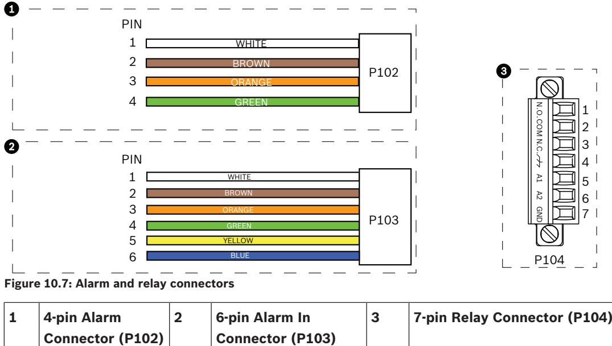

| Pin                                                                 | Description | Pin | Description  | Pin | Description                 |
|---------------------------------------------------------------------|-------------|-----|--------------|-----|-----------------------------|
| 1                                                                   | Alarm Out 1 | 1   | Alarm in 3   | 1   | Alarm Out 4 Normally Open   |
| 2                                                                   | Alarm Out 2 | 2   | Alarm in 4   | 2   | Alarm Out 4 COM             |
| 3                                                                   | Alarm Out 3 | 3   | Alarm in 5   | 3   | Alarm Out 4 Normally Closed |
| 4 Alarm Ground 4 Alarm in 6                                |             | 4   | Earth Ground |     |                             |
|                                                                     |             | 5   | Alarm in 7   | 5   | Analog Alarm 1              |
|                                                                     |             | 6   | Alarm Ground | 6   | Analog Alarm 2              |
|                                                                     |             |     |              | 7   | Ground                      |
| For in-ceiling mount only: Low Voltage TTL (3.3V) can also be used. |             |     |              |     |                             |

- 4 Connect the plugs to their mating connectors P103 and P102 on the Pipe Interface Board.
- 1. To connect supervised alarms and relays, attach the appropriate wires to their terminals on the P104 connector on the Pipe Interface Board (see above).
- 2. Insert the Pipe Interface Board into the down pipe and fasten the three (3) retaining screws to secure the board to the Dome Cap.

#### **Caution!**

Be careful not to strip the threads when tightening the Pipe Interface Board retaining screws.

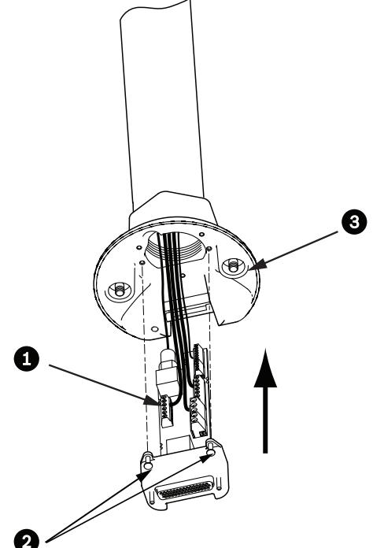

**Figure 10.8: Pipe Interface Board to Dome Cap Assembly**

| 1 | Interface Board             |
|---|-----------------------------|
| 2 | Retaining Screws (3)        |
| 3 | Pendant Mounting Screws (2) |

# **10.6 Attach Pendant to Pipe and Tighten**

- 1. Before attaching the Pendant, visually inspect the Pendant dome and the Interface Board connectors for any blocked pin holes and bent pins.
- 2. Tilt the Pendant enough to place its mounting hook on top of the its housing, over the recessed hinge pin of the Dome Cap.

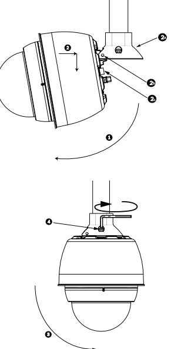

#### **Figure 10.9: Pendant to Roof / Pipe Mount Attachment**

| Tilt Dome                                                                             |
|---------------------------------------------------------------------------------------|
| Hook and drop                                                                         |
| Dome Cap                                                                              |
| Recessed Hinge Pin                                                                    |
| Dome Connector                                                                        |
| Rotate down to engage dome connector                                                  |
| Tighten the two (2) mounting screws to a minimum torque of 10-12 N-m (90-105 in.-lbs) |
|                                                                                       |

- 3. Drop the Pendant down slightly to engage the dome hook and hinge pin of the Dome Cap, allowing the dome to rotate around the hinge pin.
- 4. Rotate the dome housing down to a vertical position and gently push upward to engage the connector on top of the dome housing.

#### **Caution!**

If you feel any resistance when rotating the dome housing or when engaging the connector, stop immediately and start over.

- 5. Hold the housing firmly in position and alternately tighten the two (2) 5-mm Allen head mounting screws from above to a torque value of 10-12 N-m (90-105 in.-lbs).

#### **Caution!**

You must tighten the two mounting screws to a minimum torque of 10-12 N-m (90‑105 in.-lbs) to ensure a proper seal between the arm and the housing.

- 6. Rotate the arm to swing the camera out from the roof and into position, if installing a Parapet Roof Mount.
- Bosch Security Systems Installation Manual 2019-09 | 0.6 | **!** 7. Tighten the three (3) 10-mm (3/8-inch) stainless steel hex bolts on the bracket to lock the Parapet Arm in position.

#### **Caution!**

Do not over tighten the bolts. The maximum torque is 34 N-m (25 ft-lb).

**!**

## **10.7 Make Connections in the Power Supply Box**

- 1. Attach the earth ground wire to the grounding screw on the left side of the box.
- 2. Connect the 24 VAC to Dome plug, installed previously, to its mating connector P107 on the right side of the box.
- 3. Connect the 115/230 VAC, 3-pin Power-in plug, installed previously, to its mating connector P101 on the left side of the box.

# **11 Finalizing installation**

#### **Remove the plastic on the bubble**

After you complete all other installation steps, remove the plastic material that is protection for the bubble.

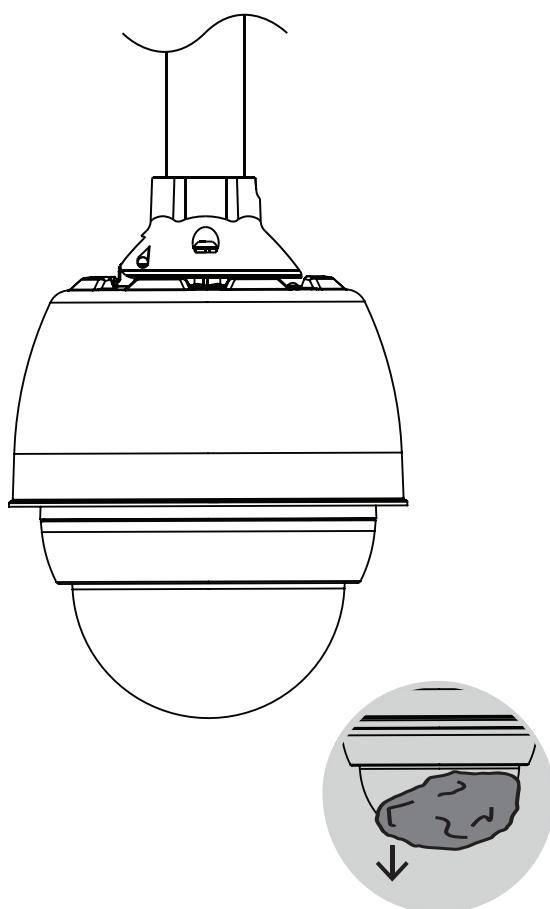

# **12 Replacing a Pendant Bubble**

1. Using both hands, apply a firm counterclockwise (looking up at the dome) rotational force on the pendant bubble assembly to set the bubble latch.

2. Insert a small (2 mm) straight blade screw driver into the release opening in the bubble trim ring to release the lock, and then remove the screwdriver.

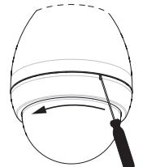

#### **Figure 12.1: Pendant Bubble Release Opening**

3. Firmly rotate the bubble counterclockwise approximately 20 degrees until the bubble assembly releases from the pendant housing.

4. Locate the four tabs (item 1, below) inside the trim ring that attach the trim ring to the bubble.

5. Gently push each tab out and down (away from the bubble) to disengage the tabs.

- 6. Remove the bubble from the trim ring.
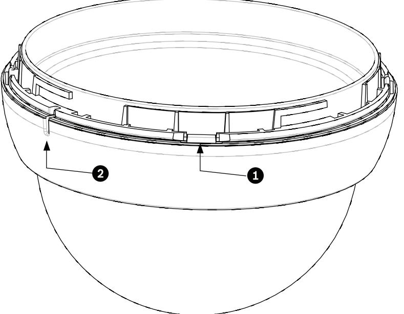

7. Insert the replacement bubble inside the trim ring and align the release tab (item 2, above) on the trim ring with the release slot on the bubble.

8. Clean the bubble according to the instructions in the section "Maintenance."

9. Insert the replacement bubble and trim ring assembly into the pendant housing, and rotate it clockwise until it locks. The latch mechanism makes a click when locks.

# **13 Connection**

# **13.1 Connecting the AUTODOME camera to the PC**

- 1. Install the camera according to the instructions in the appropriate Installation section of this manual.
- 2. Connect an Ethernet cable from camera's RJ45 connector to a dedicated network switch to bypass the Local Area Network (LAN).
- 3. Connect the dedicated network switch to the RJ45 connector on the PC (see option A below).

#### **Notice!**

The camera can also be connected directly to a PC using an Ethernet crossover cable with RJ45 connectors (see option B below).

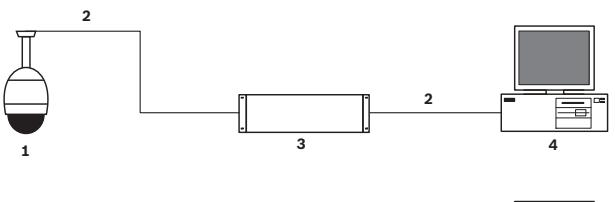

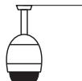

**1**

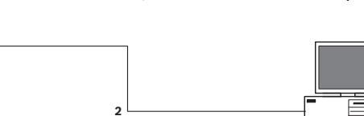

#### **Figure 13.1: AUTODOME 7000 Series System Configuration**

| 1 | AUTODOME 7000 Series |
|---|----------------------|
| 2 | IP Connection        |
| 3 | Network Switch       |
| 4 | Computer             |

**4**

#### **Notice!**

You can also use the Bosch Video Client software application to configure the network settings for an AUTODOME 7000 Series camera. Go to *www.boschsecurity.com* to download the Configuration Manager software and Operating Manual.

# **13.2 Power Cable and Wire Distances Guides**

#### **Power**

| 115/230 VAC |                             |
|-------------|-----------------------------|
| Copper Wire | To comply with local codes. |

### **Caution!**

Compliance with EN50130-4 Alarm Standard – CCTV for Security Applications To meet the requirements of the EN50130-4 Alarm Standard, an ancillary uninterruptable power (UPS) supply is necessary. The UPS must have a **Transfer Time** between 2–6 ms and a **Backup Runtime** of greater than 5 seconds for the power level as specified on the product datasheet.

| 24 V to AUTODOME            |            |                    |                    |                    |
|-----------------------------|------------|--------------------|--------------------|--------------------|
|                             | VA / Watts | 14 AWG (2.5 mm) | 16 AWG (1.5 mm) | 18 AWG (1.0 mm) |
| HD models with IVA, Outdoor | 60 / 55    | 58 m (190 ft)      | 36 m (119 ft)      | 23 m (75 ft)       |

#### **Maximum Wire Distances from Power Supply to AUTODOME**

#### **Maximum Wire Distances from Power Supply to AUTODOME 7000 HD**

| 24 V to AUTODOME 7000       |            |                    |                    |                    |
|-----------------------------|------------|--------------------|--------------------|--------------------|
|                             | VA / Watts | 14 AWG (2.5 mm) | 16 AWG (1.5 mm) | 18 AWG (1.0 mm) |
| HD models with IVA, Indoor  | 35 / 19    | 99 m (325 ft)      | 62 m (205 ft)      | 39 m (129 ft)      |
| HD models with IVA, Outdoor | 60 / 55    | 58 m (190 ft)      | 36 m (119 ft)      | 23 m (75 ft)       |

## **13.3 Ethernet Connections**

The camera connects to a 10 Base-T/100 Base-TX network either directly or via a hub. Video, optional audio input, optional audio output, and control are transmitted over a standard TCP/ IP network using the built-in Web server. In addition, power can be supplied over the Ethernet cable using the Bosch High PoE 60W midspan (sold separately). Power can also be supplied over the Ethernet cable to in-ceiling models and indoor/outdoor pendant models used in indoor applications (where the heater is not powered) using PoE+ PSEs (midspan switches) compliant with the IEEE 802.3at, class 4 standard.

The camera can be connected simultaneously to a 24 VAC power supply and to a High PoE 60 W midspan. The camera uses power from the 24 VAC power supply. If this power supply fails, the camera seamlessly switches power input to the High PoE 60 W midspan. The camera switches back to the 24 VAC power supply once power is restored.

Refer to Using the IP Interface, for instructions on configuring an IP environment.

#### **Warning!**

**BOSCH High PoE or PoE+ (802.3at)**: Use only approved High PoE or PoE+ (802.3at) devices. For outdoor pendant applications that require heater power use only the Bosch High PoE midspan (sold separately) to power the camera and the heaters. For in-ceiling or indoor pendant applications that don't require heater power, standard PoE+ (802.3at) midspans or switches can be used to power the camera.

When powering the camera via PoE or a midspan device, additional surge protection is required.

If auxiliary power (24VAC camera and 24VAC heater) and High PoE are applied simultaneously, the camera selects the auxiliary 24VAC input and draws minimal power from the High PoE midspan.

#### **Caution!**

Ethernet CAT 5E/CAT 6 cables must be routed through earth-grounded conduit for indoor or outdoor applications. For outdoor applications, the conduit should be capable of withstanding the outdoor environment.

#### **Notice!**

The heater in an outdoor AUTODOME unit cannot be powered via the Power-over-Ethernet + (IEEE 802.3at, class 4) standard, unless the heater is connected to a High PoE Midspan 60W, Single port (sold separately). See the Installation Manual of the Midspan for details.

| Cable Type                                                                                             | CAT-5E or CAT 6 Ethernet                                 |
|--------------------------------------------------------------------------------------------------------|----------------------------------------------------------|
| Maximum Distance                                                                                       | 100 m (328 ft)                                           |
| Bandwidth                                                                                              | 10 Base-T/100 Base-TX                                    |
| High PoE (required for pendants in outdoor applications that use heaters)                           | Use the Bosch High PoE 60W midspan (sold separately). |
| PoE+ (only for indoor models or indoor applications for pendant model where heater is not required) | IEEE 802.3at, class 4 standard                           |
| Terminal Connector                                                                                     | RJ45, Female                                             |

#### **Notice!**

Consult the National Electrical Code (NEC) for cable bundling requirements and limitations.

# **13.4 Fiber Optic Ethernet Media Converter (Optional)**

The fiber optic media converter is designed to transmit 10/100 Mbps Ethernet signals over fiber optic cable using 10/100 Mbps Small Form-factor Pluggable (SFP) modules. The SFP modules are available as multi-mode fiber (MMF) or single-mode fiber (SMF) models with a single SC connector or dual-fiber with an LC connector. Refer to the *VG4-SFPSCKT Fiber Optic Media Converter Installation Guide*.

| Ethernet Media Converter |                                                                                                                                               |  |
|--------------------------|-----------------------------------------------------------------------------------------------------------------------------------------------|--|
| Data Interface           | Ethernet                                                                                                                                      |  |
| Data Rate                | 10/100 Mbps IEEE 802.3 Compliant Full Duplex or Half Duplex Electrical Port Full Duplex Optical Port                                 |  |
| Fiber Type, MMF          | 50/125 µm MMF. For 50/125 µm fiber, subtract 4 dB from the specified optical budget value. Must meet or exceed fiber standard ITU-T G.651. |  |
| Fiber Type, SMF          | 8–10/125 µm SMF. Must meet or exceed fiber standard ITU-T G.652.                                                                              |  |
| Maximum Distance         | 20 km (12.4 miles)                                                                                                                            |  |
| Requirement              | Media converter receiver (CNFE2MC/IN) at controller end of system                                                                             |  |
| Terminal Connection      | Duplex LC or Single SC                                                                                                                        |  |

# **13.5 Alarms and Relay Connections**

#### **Alarm Inputs**

The camera provides seven alarm inputs. Each input can be activated by dry contact devices such as pressure pads, passive infra-red detectors, door contacts, and similar devices. The table below summarizes the size and distance wires.

| Wire Size |       | Maximum Distance |        |
|-----------|-------|------------------|--------|
| AWG       | mm    | feet             | meters |
| 22        | 0.644 | 500              | 152.4  |
| 18        | 1.024 | 800              | 243.8  |

**Tab. 13.3:** Alarm wire guide

You wire alarms either Normally Open (N.O.) or Normally Closed (N.C.), and must program the alarm inputs N.O. (the default) or N.C. through the page **Configuration**. The camera incorporates two types of alarms: Non-supervised and Supervised. In addition to transmitting an alarm condition, a supervised alarm also transmits a tamper condition.

Depending on how the alarm is configured, a short or a break in the alarm's circuit can trigger the tamper signal.

#### **Configuring Supervised Alarms (inputs 1 and 2)**

To configure Alarm 1 or 2 (pin 5 or 6) for supervision, you must install a 2.2 K end-of-line resistor in the circuit. Then, you program the alarms, through **Configuration**, to either Normally Open (N.O.) or Normally Closed (N.C.).

#### **Notice!**

Only Alarms 1 and 2 (pins 5 or 6) can be configured for supervision. Once a supervised alarm is programmed, it does not need to be enabled to indicate a tamper condition.

#### **Configuring a Normally Open Supervised Alarm**

- 1. Install a 2.2 K end-of-line resistor in the alarm circuit.
- 2. Connect the alarm wires to input 1 or 2 (pin 5 or 6) and to the ground (pin 7) at the camera.

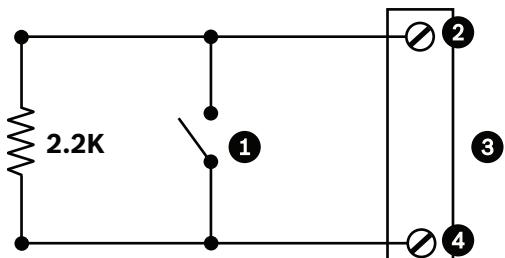

**Figure 13.2: N.O.S. - Normally Open Supervised Connections**

| 1 | Dry Contact                    | 3 | Dome Connector |
|---|--------------------------------|---|----------------|
| 2 | Alarm 1 or 2 only (Pin 5 or 6) | 4 | Ground (Pin 7) |

- 3. From **Configuration**, select **Interfaces** > **Alarm Inputs**, select the number of the **Alarm input** and finally, select N.O. See the table below for contact and condition details.

| AUTODOME Programmed N.O.S. |                 |  |
|----------------------------|-----------------|--|
| Contact                    | Alarm Condition |  |
| Open                       | Normal          |  |
| Closed                     | Alarm           |  |
| Cut or break               | Tamper          |  |

#### **Configuring a Normally Closed Supervised Alarm**

- 1. Install a 2.2 K end-of-line resistor in the alarm circuit.
- 2. Connect the alarm wires to input 1 or 2 (pin 5 or 6) and to the ground (pin 7) at the camera.

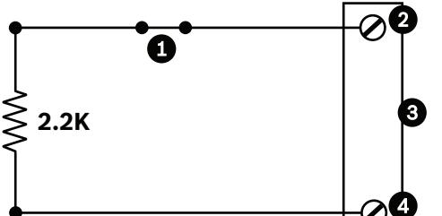

**Figure 13.3: N.C.S. - Normally Closed Supervised Connections**

| 1 | Dry Contact                    | 3 | Dome Connector |
|---|--------------------------------|---|----------------|
| 2 | Alarm 1 or 2 only (Pin 5 or 6) | 4 | Ground (Pin 7) |

- 3. From **Configuration**, select **Interfaces** > **Alarm Inputs**, select the number of the **Alarm input** and finally, select N.C. See the table below for contact and condition details.

| AUTODOME Programmed N.C.S. |                 |  |
|----------------------------|-----------------|--|
| Contact                    | Alarm Condition |  |
| Open                       | Alarm           |  |
| Closed                     | Normal          |  |
| Short                      | Tamper          |  |

#### **Configuring Non-supervised Alarms (inputs 3 through 7)**

You can configure alarms 3 through 7 as non-supervised Normally Open (N.O.) or Normally Closed (N.C.) alarms.

#### **Configuring a Normally Open Non-supervised Alarm**

- 1. Connect the alarm to the appropriate input (3 through 7) and ground at the camera.

**Figure 13.4: N.O. - Normally Open Non-supervised Connections**

| 1 | Dry Contact | 3 | Dome Connector |
|---|-------------|---|----------------|
|   |             |   |                |

| 2 | Alarm Inputs 3 to 7 | 4 | Ground |
|---|---------------------|---|--------|
|   |                     |   |        |

- 2. From **Configuration**, select **Interfaces** > **Alarm Inputs**, select the number of the **Alarm input** and finally, select N.O. See the table below for contact and condition details.

| AUTODOME Programmed N.O. |                  |  |
|--------------------------|------------------|--|
| Circuit                  | Alarm Indication |  |
| Open                     | Normal           |  |
| Closed                   | Alarm            |  |

#### **Configuring a Normally Closed Non-supervised Alarm**

- 1. Connect the alarm to the appropriate input (3 through 7) and ground at the camera.
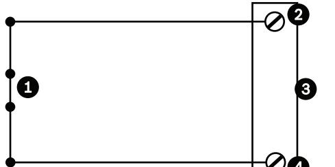

**Figure 13.5: N.C. Normally Closed Non-supervised Connections**

| 1 | Dry Contact         | 3 | Dome Connector |
|---|---------------------|---|----------------|
| 2 | Alarm Inputs 3 to 7 | 4 | Ground         |

- 2. From **Configuration**, select **Interfaces** > **Alarm Inputs**, select the number of the **Alarm input** and finally, select N.C. See the table below for contact and condition details.

| AUTODOME Programmed N.C. |                  |  |
|--------------------------|------------------|--|
| Circuit                  | Alarm Indication |  |
| Open                     | Alarm            |  |
| Closed                   | Normal           |  |

#### **Alarm Outputs**

The camera incorporates two (2) types of alarm outputs: one dry contact relay and three (3) open collector outputs or transistor outputs.

#### **Configuring a Dry Contact Relay**

The dry contact relay acts like an on/off switch. It has a maximum voltage rating of 2 A @ 30 DC.

- 1. Connect the appropriate stripped wire to the camera's COM connector.
- 2. Connect the appropriate stripped wire to the N.O. or N.C. connector, depending on your requirement.

#### **Configuring an Open Collector Output**

Outputs 1, 2, and 3 are open collector types. These outputs must be connected to a positive voltage between 5 and 32 V to complete the circuit, with a maximum voltage rating of 32 VDC @ 150 ma.

- 1. Connect the appropriate stripped wire to the open connector (1, 2, or 3) of the transistor.
- 2. Connect the appropriate stripped wire to the ground (GND) connector.

# **13.6 Audio Connections (Optional)**

The camera is capable of receiving line level input signals and transmitting them over a network. It is also capable of receiving audio from the same network and sending it as audio output from the camera. The audio input signal is transmitted in sync with the video signals. As a result, for example, a door intercom system can be connected at the camera location.

#### **Notice!**

The line ports of the intercom should be used for transmitting audio signals on the intercom systems.

The audio line input is not suitable for direct microphone signal connection.

The audio line output is not suitable for direct speaker connection unless using a powered/ amplified speaker with line level input.

#### **Audio Line Input Specifications**

The following Line Input specifications should be complied with in all cases.

| Max. Input Voltage                                                               | 1 Vrms                          |  |
|----------------------------------------------------------------------------------|---------------------------------|--|
| Impedance                                                                        | 9 K Ω (typical)                 |  |
| Shield                                                                           | Bare copper braid: 95% coverage |  |
| Internal gain level adjustment is available in case the signal level is too low. |                                 |  |

#### **Audio Line Output Specifications**

The following Line Output specifications should be complied with in all cases.

| Typical Output Voltage                                                        | 1 Vrms                          |  |
|----------------------------------------------------------------------------------|---------------------------------|--|
| Impedance                                                                        | 1.5 K Ω (typical)               |  |
| Shield                                                                           | Bare copper braid: 95% coverage |  |
| Internal gain level adjustment is available in case the signal level is too low. |                                 |  |

#### **Wire Specifications**

| Wire Type           | Shielded Coax (recommended)                                                           |
|---------------------|---------------------------------------------------------------------------------------|
| Distance            | Typically 10 m (33 ft), but depends on the signal level                               |
| Gage                | Typically 22 AWG to connector (P105/P106), but depends on the style of connector used |
| Shield              | Bare copper braid: 95% coverage                                                       |
| Center conductor | Stranded bare copper                                                                  |

Note that long distances are more susceptible to introducing noise into the signal.

#### **Audio Line Level Input Connections**

- 1. Remove the 100 Ohm termination resistor from the C+ to C- terminals.
- 2. Connect the audio line level source to the Audio_In+ (C+) input terminal.
- 3. Connect the audio signal ground to the Audio_In- (C-) input terminal.

#### **Audio Line Level Output Connections**

- 1. Connect the audio line level input of the audio output device (for example, an amplified speaker or a PC line level input) to the Audio_Out+ (RXD) output terminal.
- 2. Connect the audio line level output signal ground to the Audio_Out- (TXD) output terminal.

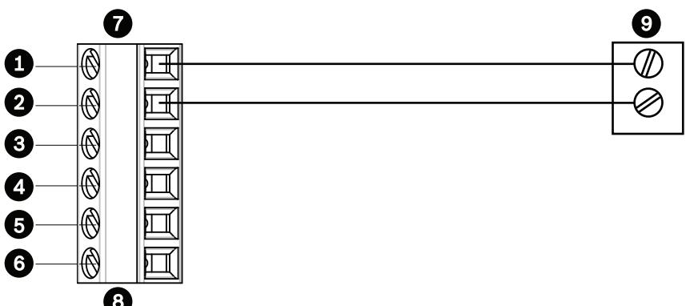

**Figure 13.6: Connections for audio over an Ethernet network**

| 1 | Audio_In- (C-)   | 7 | AUTODOME Data In/Out |
|---|------------------|---|----------------------|
| 2 | Audio_In+ (C+)   |   | P105/P106 Connector  |
| 3 | Earth Ground     | 9 | Audio Out            |
| 4 | Audio_Out+ (RXD) |   |                      |
| 5 | Audio_Out– (TXD) |   |                      |
| 6 | Signal Ground    |   |                      |

#### **Notice!**

Separate the audio cables from the AC power lines to avoid noise.

To configure audio on the camera, refer to Basic Mode: Audio or Audio.

# **14 Troubleshooting**

# **14.1 Rebooting the unit**

#### **Reboot the unit**

After a Factory Default or firmware update, reboot the unit if:

- You cannot connect to the unit in the Web browser.
OR

- Configuration Manager or BVMS or similar software identifies the unit as "Videojet Generic".
- 4 Reboot the unit using one of the following methods:
- In the web browser, type the IP address and then */reset* (without any punctuation). Press the **Enter** key.

OR

- In Configuration Manager, right-click the IP address and click **Restart**.
- 4 Wait two minutes for the process to complete.

If you cannot control the unit after the firmware upgrade, then cycle the power to the unit. If a power reset does not solve the problem, or if Configuration or video management software identifies the unit as "Videojet Generic," then contact your Bosch Service Center for an RMA for the unit.

# **14.2 Physical reset button**

Each camera has a hardware reset button. You may need to press the reset button to reset the camera to factory defaults if you encounter the following circumstances:

- You can power up the camera but cannot log on to the camera using the web browser.
- The camera doesn't start up, or fails to power up via PoE.
- The camera cannot search an IP address.
- The camera's firmware crashed.
- You forgot the password to access the camera.
- The image becomes frozen.
- You cannot update the firmware.
- The camera disconnects from the network at random and needs a reboot.
- The camera no longer finds pre-positions (preset positions).
- You cannot configure the camera using the web browser.
- The camera has no video out.

**Notice!**

A factory default deletes all camera settings including passwords, network settings, and image settings.

Complete the following sequence of steps only if you have no other option to restore operation to the camera.

#### **Steps to complete a hardware reset for all camera models**

- 1. Apply power to the camera.
- 2. Find the IP address of the camera.
- 3. Log on to the camera using the web browser. (**Note**: You can use Configuration Manager to identify the IP address.)
- 4. Find the hardware reset button on the camera. (Refer to the figure below to find the reset button for your camera model.)
- 5. Push and hold the reset button for more than 8 seconds. The red LED indicator on the PCBA board will come on to show that the hardware reset started.

**Note**: You can also use a conductive wire to short the terminal block.

- 1. Let the camera complete a self-check. When the self-check completes, the red LED will go off.
- 2. Find the IP address again.
- 3. Access the camera using the web browser.
- 4. Set the initial **service**-level password for the camera.

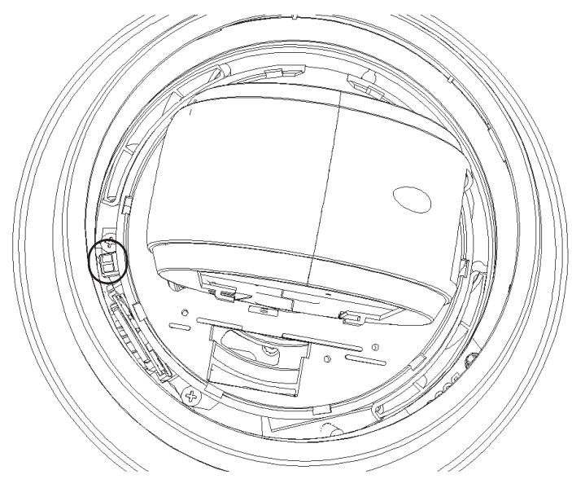

# **14.3 Customer Service and Support**

If this unit needs service, contact the nearest Bosch Security Systems Service Center for authorization to return and shipping instructions.

#### **USA**

Telephone: 800-366-2283 Fax: 800-366-1329 Email: cctv.repair@us.bosch.com

#### **Customer Service**

Telephone: 888-289-0096 Fax: 585-223-9180 Email: security.sales@us.bosch.com

#### **Technical Support**

Telephone: 800-326-1450 Fax: 717-735-6560

Email: technical.support@us.bosch.com

#### **Canada**

Telephone: 514-738-2434 Fax: 514-738-8480

#### **Europe, Middle East, Africa, and Asia Pacific Region**s

Please contact your local distributor or Bosch sales office. Use this link: *https://www.boschsecurity.com/corporate/where-to-buy/index.html*

# **15 Maintenance**

All bubbles require special care when handling and cleaning to avoid scratches.

#### **Notice!**

To avoid excessive moisture saturation inside the housing, limit the amount of time that the bubble is disconnected from the housing. Bosch recommends that the bubble be removed from the housing for no more than five (5) minutes.

#### **Bubble Handling**

The bubble may be packaged with a protective plastic sheet. It is recommended that the bubble remain stored this way until it is ready to install. Limit handling the bubble, as any scratches can quickly affect visibility.

#### **Bubble Cleaning**

If cleaning the bubble is required, use the following procedures and comply with all the warnings listed below.

#### **Cleaning the Bubble Interior**

The extremely soft interior surface should not be cleaned by rubbing or dusting with a cloth. Use clean dry compressed air, preferably from a spray can, to remove any dust from the interior surface.

#### **Warning!**

Do not use alcohol-based solutions to clean the polycarbonate bubble. This will cause the polycarbonate to cloud and over time cause stress aging, which makes the bubble brittle.

#### **Cleaning the Bubble Exterior**

The exterior of the polycarbonate bubble is hard coated for extra protection. If cleaning becomes necessary, only use cleaning solutions and cloths suitable for cleaning safety glass lenses. Dry the bubble thoroughly with a dry nonabrasive cloth to prevent water spots. Never scrub the bubble with any abrasive material or cleaners.

Bosch recommends cleaning the exterior of the bubble with NOVUS "No. 1" Plastic Clean & Shine (or equivalent), according to manufacturer's instructions. Refer to [www.novuspolish.com](http://www.novispolish.com) to order or to find a local distributor.

#### **Cautions**

- Do Not clean bubbles in the hot sun or on very hot days.
- Do Not use abrasive or highly alkaline cleaners on the bubble.
- Do Not scrape the bubble with razor blades or other sharp instruments.
- Do Not use Benzene, Gasoline, Acetone, or Carbon Tetrachloride on the bubble.

#### **Bosch Sicherheitssysteme GmbH**

Robert-Bosch-Ring 5 85630 Grasbrunn Germany **www.boschsecurity.com** © Bosch Sicherheitssysteme GmbH, 2020

#### **Bosch Security Systems, Inc**

1706 Hempstead Road Lancaster, PA, 17601 USA