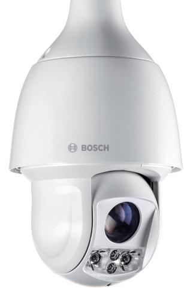
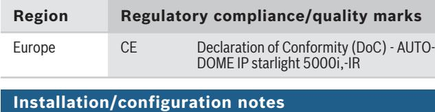
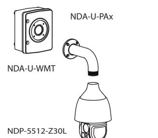
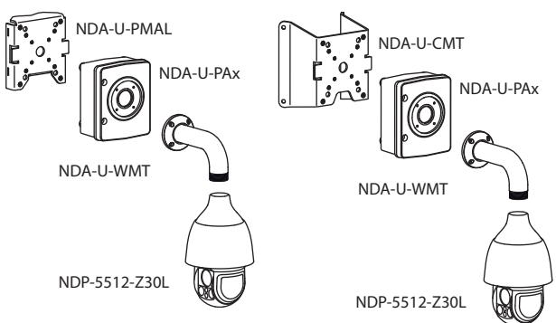
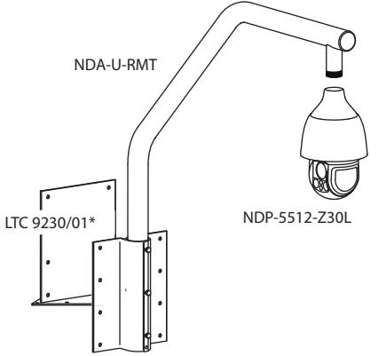
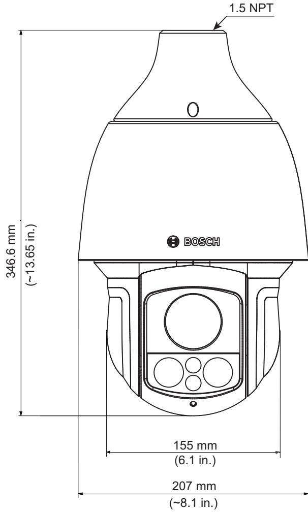

# AUTODOME IP starlight 5000i IR

www.boschsecurity.com

Keep your security in focus with the many features of the AUTODOME IP starlight 5000i IR camera. The camera is carefully tuned to deliver detailed, 1080p60 HD images during the day as well as full details in lowlight or no-light conditions. The integrated, intelligent IR illuminator automatically adjusts the IR intensity according to zoom factor and field of view to ensure that the scene is illuminated uniformly.

#### **Functions**

# **See in the dark**

The camera's smart, variable IR illumination technology from Bosch produces outstanding video on a per-zone basis in low-light scenes. This configuration ensures that each scene receives the appropriate illumination intensity and avoids focus instability from mixed lighting conditions.

# **Low-light performance**

The latest sensor technology, combined with sophisticated noise suppression and a High dynamic range of 120 dB, results in an exceptional sensitivity in color. The camera continues to provide excellent color performance even with a minimum of ambient light.

- u Starlight camera technology with excellent low-light performance
- u High-performance HD outdoor PTZ dome camera with integrated IR illumination for scenes with low or no ambient lighting
- u Variable illumination ensures that IR light is uniformly distributed in the field to minimize dark spots or over-illuminated scenes
- u Long distance illumination >180 m (590 ft)

#### **Pre-programmed user modes**

The camera has several pre-configured scene modes with the best settings for various applications. With one click, users can optimize image settings to match the camera's lighting conditions. Users can also configure individual image settings.

- Standard: For indoor fluorescent lighting.
- Sodium-lighting: For scenarios where the video is captured under sunlight in the day or under sodium vapor lamp at night.
- Vibrant: For enhanced contrast, sharpness, and saturation
- Number Plate scene mode: For the best image to be used by ANPR software.

# **H.265 high-efficiency video encoding**

The camera is designed on the most efficient and powerful H.264 and H.265/HEVC encoding platform. The camera is capable of delivering high-quality and high-resolution video with very low network load. With a doubling of encoding efficiency, H.265 is the new compression standard of choice for IP video surveillance systems.

#### **Intelligent streaming**

Smart encoding capabilities, together with Intelligent Dynamic Noise Reduction technology and analytics, make the bandwidth consumption drop to extremely

low levels. Only relevant information in the scene, such as motion or objects found with the analytics, are encoded.

#### **Support for H.264 and H.265 with Encoder Regions**

Set a region in the field of view and define a specific encoder profile to it. This setting reduces the bitrate of the stream further than intelligent streaming alone.

### **Recording and storage management**

Recording management can be controlled by the Bosch Video Recording Manager application, or the camera can use local storage and iSCSI targets directly without any recording software. A memory card with a maximum of 32 GB (microSDHC) / 2 TB (microSDXC) can be used for recording "at the edge" or for Automatic Network

Replenishment (ANR) technology to improve the overall recording reliability.

Pre-alarm recording in RAM reduces bandwidth consumption on the network and extends the effective life of the memory card.

#### **Stratocast™ service from Genetec**

The camera provides Stratocast service, which records video in the cloud, eliminating the need to install servers on-site.

#### **Essential Video Analytics on the edge**

The camera includes the latest release of Essential Video Analytics application from Bosch for use on Pre-positions.

The Essential Video Analytics application provides reliable video analytics for small and medium business, large retail stores, commercial buildings, and warehouses.

Advanced tasks like multiple line crossing, loitering, idle / removed object detection, crowd density estimation, occupancy and people counting are available for live alarming and forensic search. Object filters based on size, speed, direction, aspect ratio, and color can be defined.

A simplified calibration mode reduces installation time significantly, because you only need to enter the installation height once for each camera, independent of pre-positions.

After the camera is calibrated, the analytics engine can automatically classify objects as upright person, car, bike, or truck.

#### **Sophisticated alarm responses**

The camera supports advanced alarm control that uses sophisticated rules-based logic to determine how to manage alarms. In its most basic form, a "rule" could define which input(s) should activate which output(s). In a more complex form, inputs and outputs can be combined with pre-defined or user-specified commands to perform advanced camera functions.

#### **Superior privacy masking**

The camera allows for a total of 32 individual privacy masks, with up to eight masks displayed in the same scene. Each mask can be programmed with eight corners. Each mask changes size and shape smoothly and quickly, ensuring that the covered object cannot be seen.

With the AUTO Privacy Mask, the color of the Privacy Mask will adapt to the color of the surroundings.

#### **DORI coverage**

DORI (Detect, Observe, Recognize, Identify) is a standard system (EN-62676-4) for defining the ability of a camera to distinguish persons or objects within a covered area. The maximum distance at which a camera/lens combination can meet these criteria is shown below:

|           | DORI       | Distance |           |
|-----------|------------|----------|-----------|
|           | definition | WIDE 1X  | TELE 30X  |
| Detect    | 25 px/m    | 65 m     | 1833 m    |
|           | (8 px/ft)  | (213 ft) | (6014 ft) |
| Observe   | 63 px/m    | 26 m     | 727 m     |
|           | (19 px/ft) | (85 ft)  | (2385 ft) |
| Recognize | 125 px/m   | 13 m     | 367 m     |
|           | (38 px/ft) | (43 ft)  | (1204 ft) |
| Identify  | 250 px/m   | 7 m      | 183 m     |
|           | (76 px/ft) | (23 ft)  | (600 ft)  |

#### **Data security**

Special measures are necessary to ensure the highest level of security for device access and data transport. On initial setup, the camera is only accessible over secure channels. You must set a service-level password in order to access camera functions. Web browser and viewing client access can be protected using HTTPS or other secure protocols that support state-of-the-art TLS 1.2 protocol with updated cipher suites including AES encryption with 256 bit keys. No software can be installed in the camera, and only authenticated firmware can be uploaded. A threelevel password protection with security recommendations allows users to customize device access. Network and device access can be protected using 802.1x network authentication with EAP/TLS protocol. Superior protection from malicious attacks is guaranteed by the Embedded Login Firewall, on-board Trusted Platform Module (TPM) and Public Key Infrastructure (PKI) support.

The advanced certificate handling offers:

- Self-signed unique certificates automatically created when required
- Client and server certificates for authentication
- Client certificates for proof of authenticity
- Certificates with encrypted private keys

#### **Software sealing**

If the end user requests, the camera's configurator can enable software protection, called software sealing, that prevents users from adjusting camera settings. This function also protects the camera from unauthorized access.

#### **System integration and ONVIF conformance**

The camera conforms to the ONVIF Profile S, ONVIF Profile G, and ONVIF Profile T specifications. For H. 265 configuration, the camera supports Media Service 2, which is part of ONVIF Profile T. Compliance with these standards guarantees interoperability between network video products regardless of manufacturer. Third-party integrators can easily access the internal feature set of the camera for integration into large projects. Visit the Bosch Integration Partner Program (IPP) website (ipp.boschsecurity.com) for more information.

#### **PTZ drive and mechanism**

The camera supports 256 pre-positions and two styles of Guard Tours: Pre-position and Record/Playback. The Pre-position tour has capability for up to 256 prepositions with a configurable dwell time between prepositions and can be customized as to the order and the frequency that each Pre-position is visited. The camera also provides support for two (2) recorded tours, which have a total duration of 15 minutes of movements. These are recorded macros of an operator's movements, including pan, tilt, and zoom activities, and can be played back in a continuous manner.

Pan and tilt preset repeatability are accurate to within ±0.1 degrees to ensure that the correct scene is captured every time. The camera delivers maximum pan speed of 240 degrees per second and maximum tilt speed of 160° degrees per second. The camera is capable of manual speeds (pan and tilt) of 0.1 to 120 degrees per second. The camera provides a pan range of up to 360 degrees continuous rotation.

#### **Snap to zoom**

Drawing a box in the image will trigger the camera to zoom to the correct position.

#### **Ease of installation and servicing**

The camera has been designed for quick and easy installation, a key feature from Bosch IP video security products.

Bosch designed the camera with the knowledge that field cables and mounts are installed before the camera is mounted. The installation concept allows a single person to connect the cables directly to the camera without re-routing cables. The camera is easily secured to the mount with a single screw. The camera is rated to provide IP66 protection and offer an operating temperature range down to -40 °C (-40 °F). The housing comes fully assembled with a sunshield and ready for wall or pipe applications with the proper mounting hardware (sold separately).

#### **Project Assistant**

Project Assistant by Bosch is the market's most easyto-use app for initial installation and basic configuration of IP cameras. Off-site and without connection to the camera, basic configurations can already be covered and shared with colleagues. Onsite, these pre-configurations can simply be pushed onto the camera, making the installation procedure easier and less time consuming. Already configured cameras can be integrated as well. The app allows easy viewing and adjustment of the camera's field of view. The app automatically generates a comprehensive report of the commissioned cameras.

### **Certifications and approvals**

HD standards

- Complies with the SMPTE 274M-2008 Standard in:
	- Resolution: 1920x1080
	- Scan: Progressive
	- Color representation: complies with ITU-R BT.709 – Aspect ratio: 16:9
	- Frame rate: 25 and 30 frames/s
- Complies with the 296M-2001 Standard in:
	- Resolution: 1280x720
	- Scan: Progressive
	- Color representation: complies with ITU-R BT.709
	- Aspect ratio: 16:9
	- Frame rate: 25 and 30 frames/s

| Marking                    | Applicable Standard                                                                                                                                                                                                                                                                                                                                                                                   |
|----------------------------|-------------------------------------------------------------------------------------------------------------------------------------------------------------------------------------------------------------------------------------------------------------------------------------------------------------------------------------------------------------------------------------------------------|
| cULus                      | • UL60950-1/-22 (ed 2) (Includes CSA 22.2 No. 60950-1/-22)                                                                                                                                                                                                                                                                                                                                      |
| FCC Part 15 (USA)          | • 47CFR Part 15 • ICES-003 (Canada)                                                                                                                                                                                                                                                                                                                                                          |
| CE (Europe)                | Electromagnetic Compatibility (EMC) Directive • EN55032:2012/AC:2013 • EN 50130-4:2011/A1:2014 • EN 61000-3-2:2014 • EN 61000-3-3:2013 Product Safety: Low Voltage Directive (IECEE CB scheme certificate and report are required) • EN 60950-1:2006+A11:2009+A1:2010 +A12:2011+A2:2013 (with national differences) • IEC 60950-1/-22 (ed 1) |
| Other labels / markings | • RCM, EAC, WEEE, China RoHS, BIS                                                                                                                                                                                                                                                                                                                                                                  |

For a full list of all related certifications/standards, please refer to the Product Tests Report, available on the online catalog, on the Documents tab of the product page for your device. If the document is unavailable on the product page, please contact your sales representative.

*Wall mount with surveillance cabinet (IP66)*

# *Pole mount (IP66); Corner mount (IP66)*

*Roof mount (IP66) * optional for flat roof mount* For more options, see [Quick Selection Guide: Modular](http://resource.boschsecurity.com/documents/Mount_and_accessory__Quick_Selection_Guide_enUS_34662909707.pdf) [camera mounts & accessories.](http://resource.boschsecurity.com/documents/Mount_and_accessory__Quick_Selection_Guide_enUS_34662909707.pdf)

# **Technical specifications**

| Imager                        | 1/2.8" progressive scan CMOS |
|-------------------------------|------------------------------|
| Effective Picture Elements | 1945 x 1097 (2.13 MP)        |

| Lens                                | 30x zoom 4.5 mm - 135 mm (F1.6 - F4.4) |
|-------------------------------------|-------------------------------------------|
| Optical Zoom Field of View (FOV) | 2.4° - 60.9°                              |
| Focus                               | Automatic with manual override            |
| Iris                                | Automatic with iris priority feature      |
| Digital Zoom                        | 16x                                       |

# **Video performance - Sensitivity**

(3100K, reflectivity 89%, 1/30, F1.6, 30 IRE)

| Color | 0.0186 lux |
|-------|------------|
| Mono  | 0.004 lux  |

# **Additional Camera Settings**

| Gain control                              |                            | AGC, Variable 6 dB to 71 dB                                                 |  |
|-------------------------------------------|----------------------------|-----------------------------------------------------------------------------|--|
| Electronic Shutter Speed (AES)         |                            | 0.64 sec to 1/66666 sec                                                     |  |
| Signal-to-Noise Ratio (SNR)            |                            | >55 dB                                                                      |  |
| Day/Night switch                          |                            | Automatic IR cut filter                                                     |  |
| Backlight compensation (BLC)           |                            | On / Off / Intelligent Auto Exposure (IAE)                                  |  |
| White balance                             |                            | Basic auto, Standard auto, Sodium lamp auto, Dominant color auto, Manual |  |
| Day/Night (mode)                          |                            | Monochrome, Color, Auto                                                     |  |
| Defog mode feature                        |                            | Improves visibility when viewing foggy or other low-contrast scenes.     |  |
| Dynamic range                             |                            |                                                                             |  |
| High dynamic range                        |                            | 120 dB WDR                                                                  |  |
| Measured according to IEC 62676 Part 5 |                            | 107 dB WDR                                                                  |  |
| Number of LEDs                            | 4                          |                                                                             |  |
| Wavelength                                |                            | 850 nm                                                                      |  |
| Distance                                  | 180 m (590 ft) (Detection) |                                                                             |  |
| Beam angle                                |                            | Wide beam: 36° Narrow beam: 6.3°                                         |  |
| Video content analysis                    |                            |                                                                             |  |
| Analysis type                             |                            | Essential Video Analytics                                                   |  |
| Configurations                            |                            | Silent VCA / Profile1 - 16                                                  |  |
|                                           |                            |                                                                             |  |

| Video content analysis      |                                                                                                                                                                                                                                                                                                 |  |
|-----------------------------|-------------------------------------------------------------------------------------------------------------------------------------------------------------------------------------------------------------------------------------------------------------------------------------------------|--|
| Alarm rules (combinable) | Any object Object in field Crossing line Entering field Leaving field Loitering Following route Idle object Removed object Counter Occupancy Crowd detection Condition change Similarity search Tampering                                             |  |
| Object filters              | Duration Size Aspect ratio v/h Speed Direction Color Object classes (Upright persons, Bikes, Cars, Trucks)                                                                                                                                                                 |  |
| Calibration                 | Automatic self-calibrating when height is set                                                                                                                                                                                                                                                   |  |
| Mechanical                  |                                                                                                                                                                                                                                                                                                 |  |
| Pan/Tilt Modes              | Normal: 0.1°/s - 120°/s Turbo: Pan: 0.1°/s - 240°/s; Tilt: 0.1°/s - 120°/s                                                                                                                                                                                                                |  |
| Preset Speed                | Pan: 240°/s Tilt: 160°/s                                                                                                                                                                                                                                                                     |  |
| Pan Range                   | 360° continuous                                                                                                                                                                                                                                                                                 |  |
| Tilt Angle                  | -90° to 3° (Auto-flip 186°)                                                                                                                                                                                                                                                                     |  |
| Pre-position Accuracy    | ± 0.1° typ.                                                                                                                                                                                                                                                                                     |  |
| Pre-positions               | 256                                                                                                                                                                                                                                                                                             |  |
| Tours                       | Two (2) types of tours: • Recorded tours: two (2), maximum total duration 15 minutes (depending on the amount of commands sent during recording) • Pre-position tour: one (1), consisting of up to 256 scenes consecutively, and one (1), customized up to 64 scenes |  |
| Electrical                  |                                                                                                                                                                                                                                                                                                 |  |
| Input voltage               | 24 VAC and PoE+                                                                                                                                                                                                                                                                                 |  |
| Power consumption           | 20 W (IR off) / 25 W (IR on)                                                                                                                                                                                                                                                                    |  |

#### **Network**

| Video compression      |                                                                                                                                                                                                                                                                                                                                                                           | H.265 H.264 M-JPEG                                                                                                                              |      |  |  |
|------------------------|---------------------------------------------------------------------------------------------------------------------------------------------------------------------------------------------------------------------------------------------------------------------------------------------------------------------------------------------------------------------------|-------------------------------------------------------------------------------------------------------------------------------------------------------|------|--|--|
| Streaming              |                                                                                                                                                                                                                                                                                                                                                                           | Four (4) streams: Two (2) configurable streams in H.264 or H.265 One (1) I-frames-only stream based on first stream One (1) M-JPEG Stream |      |  |  |
| Frame rate             |                                                                                                                                                                                                                                                                                                                                                                           | 60fps at all resolutions                                                                                                                              |      |  |  |
| IP delay (typical)     |                                                                                                                                                                                                                                                                                                                                                                           | 60 fps: 200 ms                                                                                                                                        |      |  |  |
| Resolution (H x V)     |                                                                                                                                                                                                                                                                                                                                                                           |                                                                                                                                                       |      |  |  |
| 1080p Full HD (16:9)   |                                                                                                                                                                                                                                                                                                                                                                           | 1920 x 1080                                                                                                                                           |      |  |  |
| 720p HD (16:9)         |                                                                                                                                                                                                                                                                                                                                                                           | 1280 x 720                                                                                                                                            |      |  |  |
| 1.3MP (5:4)            |                                                                                                                                                                                                                                                                                                                                                                           | 1280 x 1024 cropped                                                                                                                                   |      |  |  |
| D1 4:3 (cropped) (4:3) |                                                                                                                                                                                                                                                                                                                                                                           | 704 x 576                                                                                                                                             |      |  |  |
| 640x480 (4:3)          |                                                                                                                                                                                                                                                                                                                                                                           | 640x480 cropped                                                                                                                                       |      |  |  |
| 432p SD                |                                                                                                                                                                                                                                                                                                                                                                           | 768 x 432                                                                                                                                             |      |  |  |
| 288p SD                |                                                                                                                                                                                                                                                                                                                                                                           | 512 x 288                                                                                                                                             |      |  |  |
| Bitrate                |                                                                                                                                                                                                                                                                                                                                                                           | The average typical optimized bitrate in kbits/ second for various frame rates is shown in the following table:                                 |      |  |  |
| Video compression      |                                                                                                                                                                                                                                                                                                                                                                           | H.265                                                                                                                                                 |      |  |  |
| IPS                    |                                                                                                                                                                                                                                                                                                                                                                           | 1080p 720p                                                                                                                                         |      |  |  |
| 60                     |                                                                                                                                                                                                                                                                                                                                                                           | 1649                                                                                                                                                  | 1249 |  |  |
| 30                     |                                                                                                                                                                                                                                                                                                                                                                           | 1413                                                                                                                                                  | 1096 |  |  |
| 15                     |                                                                                                                                                                                                                                                                                                                                                                           | 1157                                                                                                                                                  | 902  |  |  |
| 10                     |                                                                                                                                                                                                                                                                                                                                                                           | 1075                                                                                                                                                  | 841  |  |  |
| 5                      |                                                                                                                                                                                                                                                                                                                                                                           | 746                                                                                                                                                   | 597  |  |  |
| 2                      |                                                                                                                                                                                                                                                                                                                                                                           | 407                                                                                                                                                   | 343  |  |  |
| Ethernet               |                                                                                                                                                                                                                                                                                                                                                                           | 10/100BASE-T                                                                                                                                          |      |  |  |
| Encryption             |                                                                                                                                                                                                                                                                                                                                                                           | TLS 1.0, SSL, DES, 3DES, AES                                                                                                                          |      |  |  |
| Protocols              | IPv4, IPv6, UDP, TCP, HTTP, HTTPS, RTP/RTCP, IGMP V2/V3, ICMP, ICMPv6, RTSP, FTP, ARP, DHCP, APIPA (Auto-IP, link local address), NTP (SNTP), SNMP (V1, V3, MIB-II), 802.1x, DNS, DNSv6, DDNS (DynDNS.org, selfHOST.de, no ip.com), SMTP, iSCSI, UPnP (SSDP), DiffServ (QoS), LLDP, SOAP, Dropbox™, CHAP, digest authentication , Stratocast Genetec |                                                                                                                                                       |      |  |  |
| Interoperability       | ONVIF Profile S, ONVIF Profile G, ONVIF Profile T, GB/T 28181                                                                                                                                                                                                                                                                                                          |                                                                                                                                                       |      |  |  |

| Audio                                                 |                                                                                                                                                                           |  |  |
|-------------------------------------------------------|---------------------------------------------------------------------------------------------------------------------------------------------------------------------------|--|--|
| Compression                                           | G.711, 8kHz sampling rate L16, 16kHz sampling rate AAC, 16kHz sampling rate                                                                                         |  |  |
| Interface                                             | 1/1 Channel In/Out                                                                                                                                                        |  |  |
| Miscellaneous                                         |                                                                                                                                                                           |  |  |
| Sector/Titling                                        | 16 independent sectors with 20 characters per title                                                                                                                    |  |  |
| Privacy Masks                                         | 32 individually configurable privacy masks                                                                                                                                |  |  |
| Privacy Masks pattern                                 | Black, White , Gray, Auto (average background color)                                                                                                                   |  |  |
| Supported Languages                                   | English, German, Spanish, French, Italian, Dutch, Polish, Portuguese, Russian, Japanese, Chinese (simplified)                                                       |  |  |
| Local Storage                                         |                                                                                                                                                                           |  |  |
| Memory card slot                                      | Support a memory card with a maximum of 32 GB (microSDHC) / 2 TB (microSDXC) (user supplied). (An SD card of Class 6 or higher is recommended for HD recording.) |  |  |
| User Connections                                      |                                                                                                                                                                           |  |  |
| Power                                                 | RJ45 10/100 Base-T PoE+ (IEEE 802.3at, class 4 standard) 21-30 VAC, 50/60 Hz                                                                                        |  |  |
| Alarm Inputs                                          | 2                                                                                                                                                                         |  |  |
| Alarm Outputs                                         | 1 relay output 5 VDC, 150 mA max.                                                                                                                                         |  |  |
| Audio                                                 | 1x mono line in, 1x mono line out                                                                                                                                         |  |  |
| • Signal line in                                   | 94 kOhm typical, 1 Vrms max.                                                                                                                                              |  |  |
| • Signal line out                                  | 1 kOhm typical, 1 Vrms max.                                                                                                                                               |  |  |
| Environmental                                         |                                                                                                                                                                           |  |  |
| Ingress Protection Rating/ Standard                | IP66                                                                                                                                                                      |  |  |
| Operating temperature (Input voltage 24 VAC) | -40 °C to +60 °C (-40 °F to +140 °F)                                                                                                                                      |  |  |
| Operating temperature (Input voltage PoE+)      | -40 ºC to +55 ºC (-40 ºF to +122 ºF)                                                                                                                                      |  |  |
| Humidity                                              | Up to 90% RH (non-condensing)                                                                                                                                             |  |  |

Storage temperature -40 °C to +60 °C (-40 °F to +140 °F)

# **Construction**

| Dimensions (DIA x H)     | 207 mm x 346.6 mm (8.15 in x 13.65 in)             |
|--------------------------|-------------------------------------------------------|
| Weight                   | 4.6 kg (10.14 lb)                                     |
| Construction material | Housing: Aluminum Sunshield: Outdoor Grade Plastic |
| Standard color           | White (RAL 9003)                                      |

# **Dimensional Drawings**

#### **Ordering information**

#### **NDP-5512-Z30L PTZ 2MP HDR 30x IP66 pendant IR**

IP PTZ dome camera; integrated IR illumination up to 180 m (590 ft); 1080p60; 30x optical; 4x4 digital zoom; 120 dB HDR; starlight imaging; IAE; EVA; PoE; Intelligent Streaming; Dual power options. Order number **NDP-5512-Z30L**

#### **EWE-AD5HD-IW 12mths wrty ext AUTODOME IP 5000 HD**

12 months warranty extension without moving parts, wear parts are excluded Order number **EWE-AD5HD-IW**

#### **Accessories**

**UPA-2450-50 PSU, 220VAC 50Hz, 24VAC 50VA out** Indoor power supply for camera. 220 VAC, 50 Hz in; 24 VAC, 50 VA out

Order number **UPA-2450-50**

#### **UPA-2450-60 PSU, 120VAC 60Hz, 24VAC 50VA out**

Indoor power supply for camera. 120 VAC, 60 Hz In; 24 VAC, 50 VA Out

Order number **UPA-2450-60**

### **NPD-6001B High PoE midspan**

High PoE Midspan, 60 W, single port, AC in Order number **NPD-6001B**

#### **NDA-U-PA0 Surveillance cabinet 24VAC**

Surveillance cabinet, 24 VAC input, 24 VAC output, IP66

Order number **NDA-U-PA0**

#### **NDA-U-PA1 Surveillance cabinet 120VAC**

Surveillance cabinet, 100 - 120 VAC 50/60 Hz input, 24 VAC output, IP66

Order number **NDA-U-PA1**

# **NDA-U-PA2 Surveillance cabinet 230VAC**

Surveillance cabinet, 230 VAC input, 24 VAC output, IP66

Order number **NDA-U-PA2**

# **NDA-U-CMT Corner mount adapter**

Universal corner mount, white Order number **NDA-U-CMT**

# **NDA-U-PMAL Pole mount adapter large** Universal pole mount adapter, white; large

Order number **NDA-U-PMAL**

# **NDA-U-PMAS Pole mount adapter small**

Pole mount adapter small Universal pole mount adapter, white; small. Order number **NDA-U-PMAS**

# **NDA-U-PMT Pendant pipe mount, 12" (31cm)**

Universal pipe mount for dome cameras, 31 cm, white Order number **NDA-U-PMT**

**NDA-U-PMTE Pendant pipe extension, 20" (50cm)** Extension for universal pipe mount, 50 cm, white Order number **NDA-U-PMTE**

**NDA-U-PSMB Pendant wall/ceiling mount SMB** Surface mount box (SMB) for wall mount or pipe mount. Order number **NDA-U-PSMB**

## **NDA-U-WMP Wall mount plate**

Back plate for universal wall mount, corner mount and pole mount, white, IP66 Order number **NDA-U-WMP**

# **NDA-U-WMT Pendant wall mount**

Universal wall mount for dome cameras, white Order number **NDA-U-WMT**

# **NDA-U-RMT Pendant parapet mount**

Universal roof mount for dome cameras, white Order number **NDA-U-RMT**

**LTC 9230/01 Roof mount adapter**

Flat Roof Mount Adapter for mounting a unit in an upright position on a flat surface. Order number **LTC 9230/01**

# **VG4-SFPSCKT ETHERNET TO SFP INTERFACE KIT**

Ethernet media converter video transmitter/data receiver fiber optic kit for AUTODOME cameras and for MIC-IP-PSU for MIC analog cameras. Order number **VG4-SFPSCKT**

# **SFP-2 Fiber module, multimode, 1310nm, 2LC**

SFP Fiber Optic Module, 2 km (1.2 miles), 2 LC connectors. Multi-mode 1310 mm Order number **SFP-2**

# **SFP-3 Fiber module, single-mode, 1310nm, 2LC**

SFP Fiber Optic Module, 20 km (12.4 miles), 2 LC connectors. Single-mode 1310 nm Order number **SFP-3**

# **SFP-25 Fiber module, 1310/1550nm, 1SC**

SFP Fiber Optic Module, 2 km (1.2 miles), 1 SC connector Multi-mode 1310/1550 nm Order number **SFP-25**

# **SFP-26 Fiber module, 1550/1310nm, 1SC**

SFP Fiber Optic Module, 2 km (1.2 miles), 1 SC connector Multi-mode 1550/1310 nm Order number **SFP-26**

#### **Services**

### **EWE-AD5HD-IW 12mths wrty ext AUTODOME IP 5000 HD**

12 months warranty extension without moving parts, wear parts are excluded

Order number **EWE-AD5HD-IW**

**Represented by:**

**Europe, Middle East, Africa: Germany: North America: Asia-Pacific:** Bosch Security Systems B.V. P.O. Box 80002 5600 JB Eindhoven, The Netherlands Phone: + 31 40 2577 284 emea.securitysystems@bosch.com emea.boschsecurity.com

Bosch Sicherheitssysteme GmbH Robert-Bosch-Ring 5 85630 Grasbrunn Germany www.boschsecurity.com

Bosch Security Systems, Inc. 130 Perinton Parkway Fairport, New York, 14450, USA Phone: +1 800 289 0096 Fax: +1 585 223 9180 onlinehelp@us.bosch.com www.boschsecurity.us

Robert Bosch (SEA) Pte Ltd, Security Systems 11 Bishan Street 21 Singapore 573943 Phone: +65 6571 2808 Fax: +65 6571 2699 apr.securitysystems@bosch.com www.boschsecurity.asia

© Bosch Security Systems 2020 | Data subject to change without notice 43022556811 | en, V10, 19. Feb 2020