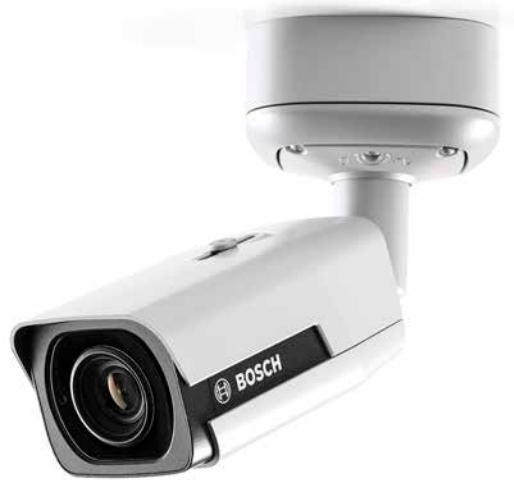
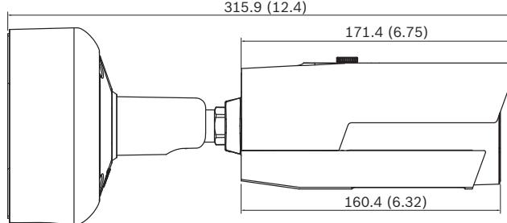
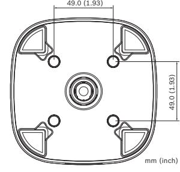

# NBE-6502-AL Bullet 2MP HDR 2.8-12mm auto IP67 IK10

www.boschsecurity.com

The 1080p infrared bullet from Bosch is a professional surveillance camera that provides high quality HD images for demanding security and surveillance network requirements.

This robust bullet camera is a true day/night camera offering excellent performance day or night. The builtin infrared LEDs provides quality night time monitoring with 60 m (196 ft) viewing distance in darkness.

#### **System overview**

#### **Outdoor bullet camera with Automatic Varifocal lens**

The robust aluminum housing provides high installation flexibility. The camera resists both water and dust ingress in tough environments and is rated to IP67 standards. The 2.8 to 12 mm AVF (Automatic Varifocal) lens allows you to choose the coverage area remotely.

The automatic zoom/focus lens wizard makes it easy for an installer to accurately zoom and focus the camera for both day and night operation. The wizard is activated from the PC or from the on-board camera push button making it easy to choose the workflow that suits best.

- u Starlight camera technology with excellent low-light performance
- u Easy to install with auto zoom/focus lens, wizard and pre-configured modes
- u Fully configurable H.265 multi-streaming
- u Built-in Essential Video Analytics to trigger relevant alerts and quickly retrieve data
- u High Dynamic Range mode (134 dB) to see details in bright and dark areas simultaneously

The AVF (Automatic Varifocal) feature means that the zoom can be changed without opening the camera. The automatic motorized zoom/focus adjustment with 1:1 pixel mapping ensures the camera is always accurately focused.

#### **Functions**

#### **Essential Video Analytics**

The built-in video analysis reinforces the Intelligenceat-the-Edge concept and now delivers even more powerful features. Essential Video Analytics is ideal for use in controlled environments with limited detection ranges.

The system reliably detects, tracks, and analyzes objects, and alerts you when predefined alarms are triggered. A smart set of alarm rules makes complex tasks easy and reduces false alarms to a minimum. Metadata is attached to your video to add sense and structure. This enables you to quickly retrieve the relevant images from hours of stored video. Metadata can also be used to deliver irrefutable forensic evidence or to optimize business processes based on people counting or crowd density information.

Calibration is quick and easy – just enter the height of the camera. The internal gyro/accelerometer sensor provides the rest of the information to precisely calibrate the video analytics.

#### **High Dynamic Range**

The high dynamic range mode is based on a multipleexposure process that captures more details in the highlights and in the shadows even in the same scene. The result is that you can easily distinguish objects and features, for example, faces with bright backlight. The actual dynamic range of the camera is measured using Opto-Electronic Conversion Function (OECF) analysis according to IEC 62676 Part 5. This method is used to provide a standard result which can be used to compare different cameras.

#### **Content Based Imaging Technology**

Content Based Imaging Technology (CBIT) is used to radically improve image quality in all lighting conditions and to identify areas for enhanced processing. The camera examines the scene using Essential Video Analytics and provides feedback to retune the image processing. This provides better detail in the areas that matter and better all-round performance. Intelligent Auto Exposure technology, for example, allows you to view moving objects in bright and dark areas of a scene.

#### **Intelligent streaming reduces bandwidth and storage requirements**

The low-noise image and the efficient H.265 compression technology provide clear images while reducing bandwidth and storage by up to 80% compared to standard H.264 cameras. With this new generation of cameras an extra level of intelligence is added with Intelligent Streaming. The camera provides the most usable image possible by cleverly optimizing the detail-to-bandwidth ratio. The smart encoder continuously scans the complete scene as well as regions of the scene and dynamically adjust compression based on relevant information like movement. Together with Intelligent Dynamic Noise Reduction, which actively analyzes the contents of a scene and reduces noise artifacts accordingly, bitrates are reduced by up to 80%. Because noise is reduced at the source during image capture, the lower bitrate does not compromise image quality. This results in substantially lower storage costs and network strain and still retain a high image quality and smooth motion.

#### **Bitrate optimized profile**

The average typical optimized bitrate in kbits/s for various frame rates when in H.265 mode is shown in the table:

| fps | 1080p | 720p |
|-----|-------|------|
| 60  | 712   | 525  |
| 30  | 600   | 450  |

| 12 | 438 | 329 |
|----|-----|-----|
| 5  | 284 | 213 |
| 2  | 122 | 92  |

#### **Multiple streams**

The innovative multi-streaming feature delivers various H.264 or H.265 streams together with an M‑JPEG stream. These streams facilitate bandwidth-efficient viewing and recording as well as integration with thirdparty video management systems.

The camera can run multiple independent streams that allows to set a different resolution and frame rate on the first and second stream. The user can also choose to use a copy of the first stream.

The third stream uses the I-frames of the first stream for recording; the fourth stream shows a JPEG image at a maximum of 10 Mbit/s.

#### **Regions of interest and E-PTZ**

Regions of Interest (ROI) can be user defined. The remote E-PTZ (Electronic Pan, Tilt and Zoom) controls allow you to select specific areas of the parent image. These regions produce separate streams for remote viewing and recording. These streams, together with the main stream, allow the operator to separately monitor the most interesting part of a scene while still retaining situational awareness.

#### **Two-way audio and audio alarm**

Two-way audio allows the operator to communicate with visitors or intruders via an external audio line input and output. Audio detection can be used to generate an alarm if needed.

#### **Tamper and motion detection**

A wide range of configuration options is available for alarms signaling camera tampering. A built-in algorithm for detecting movement in the video can also be used for alarm signaling.

#### **Storage management**

Recording management can be controlled by the Bosch Video Recording Manager (Video Recording Manager) or the camera can use iSCSI targets directly without any recording software.

#### **Edge recording**

The MicroSD card slot supports up to 2 TB of storage capacity. A microSD card can be used for local alarm recording. Pre-alarm recording in RAM reduces recording bandwidth on the network, or — if microSD card recording is used — extends the effective life of the storage medium.

#### **Cloud-based services**

The camera supports time-based or alarm-based JPEG posting to four different accounts. These accounts can address FTP servers or cloud-based storage facilities (for example, Dropbox). Video clips or JPEG images can also be exported to these accounts.

Alarms can be set up to trigger an e-mail or SMS notification so you are always aware of abnormal events.

#### **Easy installation**

Power for the camera can be supplied via a Powerover-Ethernet compliant network cable connection. With this configuration, only a single cable connection is required to view, power, and control the camera. Using PoE makes installation easier and more costeffective, as cameras do not require a local power source.

The camera can also be supplied with power from 24 VAC or +12 VDC SELV class 2 power supplies. For trouble-free network cabling, the camera supports Auto-MDIX which allows the use of straight or crossover cables.

#### **True day/night switching**

The camera incorporates mechanical filter technology for vivid daytime color and exceptional night-time imaging while maintaining sharp focus under all lighting conditions.

#### **Hybrid mode**

An analog video output enables the camera to operate in hybrid mode. This mode provides simultaneous high resolution HD video streaming and an analog video output via a BNC connector. The hybrid functionality offers an easy migration path from legacy CCTV to a modern IP-based system.

#### **DORI coverage**

DORI (Detect, Observe, Recognize, Identify) is a standard system (EN-62676-4) for defining the ability of a camera to distinguish persons or objects within a covered area. The maximum distance at which a camera/lens combination can meet these criteria is shown below:

|  | 2MP Camera with 2.8 mm - 12 mm lens |  |  |  |  |  |  |
|--|-------------------------------------|--|--|--|--|--|--|
|--|-------------------------------------|--|--|--|--|--|--|

| DORI      | DORI definition | Distance 2.8 mm / 12 mm | Horizontal width |
|-----------|--------------------|-------------------------------|---------------------|
| Detect    | 25 px/m            | 33 m / 130 m                  | 79 m                |
|           | 8 px/ft            | 105 ft / 427 ft               | 249 ft              |
| Observe   | 63 px/m            | 13 m / 51 m                   | 31 m                |
|           | 19 px/ft           | 43 ft / 167 ft                | 102 ft              |
| Recognize | 125 px/m           | 6 m / 26 m                    | 14 m                |
|           | 38 px/ft           | 20 ft / 85 ft                 | 46 ft               |
| Identify  | 250 px/m           | 3 m / 13 m                    | 7 m                 |
|           | 76 px/ft           | 9 ft / 43 ft                  | 23 ft               |

#### **Data security**

Special measures have been put in place to ensure the highest level of security for device access and data transport. The three-level password protection with security recommendations allows users to customize

device access. Web browser access can be protected using HTTPS and firmware updates can also be protected with authenticated secure uploads. The on-board Trusted Platform Module (TPM) and Public Key Infrastructure (PKI) support, guarantee superior protection from malicious attacks. The 802.1x network authentication with EAP/TLS, supports TLS 1.2 with updated cipher suites including AES 256 encryption.

The advanced certificate handling offers:

- Self-signed unique certificates automatically created when required
- Client and server certificates for authentication
- Client certificates for proof of authenticity
- Certificates with encrypted private keys

#### **Complete viewing software**

There are many ways to access the camera's features: using a web browser, with the Bosch Video Management System, with the free-of-charge Bosch Video Client or Video Security Client, with the video security mobile app, or via third-party software.

#### **Video security app**

The Bosch video security mobile app has been developed to enable Anywhere access to HD surveillance images allowing you to view live images from any location. The app is designed to give you complete control of all your cameras, from panning and tilting to zoom and focus functions. It's like taking your control room with you.

This app, together with the integrated Bosch Dynamic Transcoding on the DIVAR IP recorders, will allow you to fully utilize our dynamic transcoding features so you can play back images even over low-bandwidth connections.

#### **System integration**

The camera conforms to the ONVIF Profile S and Profile G specifications. This guarantees interoperability between network video products regardless of manufacturer.

Third-party integrators can easily access the internal feature set of the camera for integration into large projects. Visit the Bosch Integration Partner Program (IPP) website (ipp.boschsecurity.com) for more information.

#### **Certifications and approvals**

#### **HD standards**

Complies with the SMPTE 274M-2008 Standard in:

- Resolution: 1920x1080
- Scan: Progressive
- Color representation: complies with ITU-R BT.709
- Aspect ratio: 16:9
- Frame rate: 25 and 30 frames/s

Complies with the SMPTE 296M-2001 Standard in: • Resolution: 1280x720

- Scan: Progressive
- Color representation: complies with ITU-R BT.709
- Aspect ratio: 16:9
- Frame rate: 25 and 30 frames/s

#### **4** | NBE-6502-AL Bullet 2MP HDR 2.8-12mm auto IP67 IK10

| Standards                 | IEC 62471 (IR version)                        |  |
|---------------------------|-----------------------------------------------|--|
|                           | EN 60950-1                                    |  |
|                           | cUL 60950-1                                   |  |
|                           | EN 60950-22                                   |  |
|                           | cUL 60950-22                                  |  |
|                           | CAN/CSA-C22.2 NO. 60950-1-07                  |  |
|                           | EN 50130-4                                    |  |
|                           | EN 50130-5, Class IV (outdoor in general)     |  |
|                           | FCC Part15 Subpart B, Class B                 |  |
|                           | EN 55032                                      |  |
|                           | EN 61000-3-2                                  |  |
|                           | EN 61000-3-3                                  |  |
|                           | EN 55024                                      |  |
|                           | AS/NZS CISPR 32                               |  |
|                           | ICES-003 Class B                              |  |
|                           | VCCI J55022 V2/V3                             |  |
|                           | EN 50121-4                                    |  |
| ONVIF compliance       | EN 50132-5-2; IEC 62676-2-3                   |  |
| Product certifications | CE, FCC, UL, cUL, C-tick, CB, VCCI, EAC       |  |
| Ingress protection     | IP67                                          |  |
| Impact protection         | IK10, including the front glass of the camera |  |
| Region                    | Regulatory compliance/quality marks           |  |
| Europe                    | CE DINION IP 4/5/6000i                     |  |
| USA                       | UL DINION IP 4/5/6000i                     |  |

#### **Installation/configuration notes**

#### **Parts included**

| Quan tity | Component                |
|--------------|--------------------------|
| 1            | Camera                   |
| 1            | Quick installation guide |
| 1            | Safety instructions      |
| 1            | Camera screw kit         |

#### **Technical specifications**

| Power             |                                                                           |
|-------------------|---------------------------------------------------------------------------|
| Input voltage     | Power-over-Ethernet (48 VDC nominal); or 24 VAC ±10% / +12 VDC ±10% |
| PoE IEEE standard | IEEE 802.3af (802.3at Type 1) Power level: Class 3                     |
| Power consumption | 950 mA (12 VDC) 750 mA (24 VAC) 260 mA (PoE)                        |
| Sensor            |                                                                           |
| Sensor type       | 1/2.8‑inch CMOS                                                           |

Active pixels 1937 (H) x 1097 (V); approximately 2.12MP

## **Video performance - Sensitivity**

Sensitivity - (3200K, reflectivity 89%, F1.4, 30IRE)

| Color                                     | 0.0225 lux |  |
|-------------------------------------------|------------|--|
| Mono                                      | 0.0051 lux |  |
| With IR                                   | 0.0 lx     |  |
|                                           |            |  |
| Video performance - Dynamic range         |            |  |
|                                           |            |  |
| High Dynamic Range                        | 146 dB WDR |  |
| Measured according to IEC 62676 Part 5 | 107 dB WDR |  |

#### **5** | NBE-6502-AL Bullet 2MP HDR 2.8-12mm auto IP67 IK10

| Video streaming                        |                                                                                                                           |  |
|----------------------------------------|---------------------------------------------------------------------------------------------------------------------------|--|
| Video compression                      | H.265; H.264; M- JPEG                                                                                                     |  |
| Streaming                              | Multiple configurable streams in H.264 and M JPEG, configurable frame rate and bandwidth. Regions of Interest (ROI) |  |
| Camera processing latency           | <67 ms (max. average at 1080p60)                                                                                          |  |
| GOP structure                          | IP, IBP, IBBP                                                                                                             |  |
| Encoding interval                      | 1 to 50 [60] ips                                                                                                          |  |
| Video resolution (H x V)               |                                                                                                                           |  |
| 1080p HD                               | 1920 x 1080                                                                                                               |  |
| Upright mode 1080p                     | 1080 x 1920                                                                                                               |  |
| 1.3 MP (5:4) (cropped)              | 1280 x 1024                                                                                                               |  |
| Upright mode 1.3 MP (5:4) (cropped) | 1024 x 1280                                                                                                               |  |
| 720p HD                                | 1280 x 720                                                                                                                |  |
| Upright mode 720p                      | 720 x 1280                                                                                                                |  |
| D1 4:3 (cropped)                       | 704 x 480                                                                                                                 |  |
| 432p SD                                | 768 x 432                                                                                                                 |  |
| 288p SD                                | 512 x 288                                                                                                                 |  |
| 144p SD                                | 256 x 144                                                                                                                 |  |
| Camera installation                    |                                                                                                                           |  |
| Base frame rate                        | 25/30/50/60 fps                                                                                                           |  |
| Mirror image                           | On / Off                                                                                                                  |  |
| Rotate                                 | 0° / 90° / 180° / 270°                                                                                                    |  |
| Camera LED                             | Enable/disable                                                                                                            |  |
| Positioning                            | Coordinate / Mounting                                                                                                     |  |
| Lens wizard                            | Autofocus, Zoom                                                                                                           |  |
| Video functions - color                |                                                                                                                           |  |
| Adjustable picture settings         | Contrast, Saturation, Brightness                                                                                          |  |
| White Balance                          | 2500 to 10000K, 4 automatic modes (Basic, Standard, Sodium lamp, Dominant color), Manual mode and Hold mode         |  |
| Video functions - ALC                  |                                                                                                                           |  |

| Day/Night | Auto (adjustable), Color, Monochrome                                                      |
|-----------|-------------------------------------------------------------------------------------------|
| Shutter   | Automatic Electronic Shutter (AES); Fixed shutter (1/25[30] to 1/15000) selectable; |

| Video functions - ALC          |                                                                                                                                                                                                                                   |  |
|--------------------------------|-----------------------------------------------------------------------------------------------------------------------------------------------------------------------------------------------------------------------------------|--|
|                                | Default shutter                                                                                                                                                                                                                   |  |
| IR intensity                   | Adjustable                                                                                                                                                                                                                        |  |
| Video functions - enhance      |                                                                                                                                                                                                                                   |  |
| Sharpness                      | Sharpness enhancement level selectable                                                                                                                                                                                            |  |
| Backlight compensation      | On / off / Intelligent Auto Exposure (IAE)                                                                                                                                                                                        |  |
| Contrast enhancement        | On/off                                                                                                                                                                                                                            |  |
| Signal-to-noise ratio (SNR) | >55 dB                                                                                                                                                                                                                            |  |
| Noise reduction                | Intelligent Dynamic Noise Reduction with separate temporal and spatial adjustments                                                                                                                                             |  |
| Intelligent defog              | Intelligent Defog automatically adjusts parameters for best picture in foggy or misty scenes (switchable)                                                                                                                   |  |
| Video content analysis         |                                                                                                                                                                                                                                   |  |
| Analysis type                  | Essential Video Analytics                                                                                                                                                                                                         |  |
| Features                       | Rule based alarms and tracking Line crossing Enter /leave field Follow route Loitering Idle / removed object People counting Crowd density estimation 3D tracking Audio detection (if microphone used) |  |
| Calibration / Geolocation   | Automatic based on gyro / accelerometer data and camera height                                                                                                                                                                 |  |
| Tamper detection               | Maskable                                                                                                                                                                                                                          |  |
| Additional functions           |                                                                                                                                                                                                                                   |  |
| Scene modes                    | 10 default modes with scheduler: Indoor, Outdoor, Traffic, Night Optimized, Intelligent AE, Vibrant, Low bitrate, Sports & Gaming, Retail, License Plate Recognition (LPR)                                            |  |
| Privacy Masking                | Eight independent areas, fully programmable                                                                                                                                                                                       |  |
| Video authentication           | Off / Watermark / MD5 / SHA-1 / SHA-256                                                                                                                                                                                           |  |
| Display stamping               | Name; Logo; Time; Alarm message                                                                                                                                                                                                   |  |
| Pixel counter                  | Selectable area                                                                                                                                                                                                                   |  |

#### **6** | NBE-6502-AL Bullet 2MP HDR 2.8-12mm auto IP67 IK10

| Local storage               |                                                                                                                                               |
|-----------------------------|-----------------------------------------------------------------------------------------------------------------------------------------------|
| Internal RAM                | 60 s pre-alarm recording                                                                                                                      |
| Memory card slot            | Supports up to 32 GB microSDHC / 2 TB microSDXC card. (A memory card of Class 6 or higher is recommended for HD recording)              |
| Recording                   | Continuous recording, ring recording. alarm/ events/schedule recording                                                                     |
| Night vision                |                                                                                                                                               |
| Distance                    | 60 m (196 ft)                                                                                                                                 |
| LED                         | 4 LED high efficiency array, 850 nm                                                                                                           |
| Lens                        |                                                                                                                                               |
| Lens type                   | Automatic Varifocal 2.8 to 12 mm, DC Iris F1.4 – 360                                                                                       |
| Lens mount                  | Board mounted                                                                                                                                 |
| Horizontal field of view | 33° - 100°                                                                                                                                    |
| Vertical field of view      | 19° - 52°                                                                                                                                     |
| Input/output connections    |                                                                                                                                               |
| Analog video output         | CVBS, 1 Vpp, BNC connector, 75 Ohm, approx. 500 TVL Selectable standard                                                                 |
| Alarm input                 | Short or DC 5V activation                                                                                                                     |
| Alarm out                   | Input rating Maximum 0.5 A, 30 VAC / 40 VDC                                                                                                   |
| Audio input                 | Wires; 10 kOhm typ. 0.707 Vrms                                                                                                                |
| Audio output                | Wires; 16 Ohm typ. 0.707 Vrms                                                                                                                 |
| Network connector           | RJ45                                                                                                                                          |
| Audio streaming             |                                                                                                                                               |
| Standard                    | G.711, 8 kHz sampling rate L16, 16 kHz sampling rate AAC-LC, 48 kbps at 16 kHz sampling rate AAC-LC, 80 kbps at 16 kHz sampling rate |
| Signal-to-Noise Ratio       | >50 dB                                                                                                                                        |
| Audio Streaming             | Full-duplex / half duplex                                                                                                                     |
| Software                    |                                                                                                                                               |
| Unit discovery              | IP Helper                                                                                                                                     |
| Unit configuration          | Via web browser or Configuration Manager                                                                                                      |
| Firmware update             | Remotely programmable                                                                                                                         |
| Software viewing            | Web browser; Video Security Client; Video Security App; Bosch Video Management System; Bosch Video Client;                        |

| Software                                 |                                                                                                                                                                                                                                                                                                                                                       |
|------------------------------------------|-------------------------------------------------------------------------------------------------------------------------------------------------------------------------------------------------------------------------------------------------------------------------------------------------------------------------------------------------------|
|                                          | or third party software                                                                                                                                                                                                                                                                                                                               |
| Latest firmware and software          | http://downloadstore.boschsecurity.com/                                                                                                                                                                                                                                                                                                               |
| Network                                  |                                                                                                                                                                                                                                                                                                                                                       |
| Protocols                                | IPv4, IPv6, UDP, TCP, HTTP, HTTPS, RTP/ RTCP, IGMP V2/V3, ICMP, ICMPv6, RTSP, FTP, ARP, DHCP, APIPA (Auto-IP, link local address), NTP (SNTP), SNMP (V1, V3, MIB-II), 802.1x, DNS, DNSv6, DDNS (DynDNS.org, selfHOST.de, no-ip.com), SMTP, iSCSI, UPnP (SSDP), DiffServ (QoS), LLDP, SOAP, Dropbox™, CHAP, digest authentication |
| Encryption                               | TLS1.0/1.2, AES128, AES256                                                                                                                                                                                                                                                                                                                            |
| Ethernet                                 | 10/100 Base-T, auto-sensing, half/full duplex                                                                                                                                                                                                                                                                                                         |
| Connectivity                             | Auto-MDIX                                                                                                                                                                                                                                                                                                                                             |
| Interoperability                         | ONVIF Profile S; ONVIF Profile G; GB/T 28181                                                                                                                                                                                                                                                                                                       |
| Mechanical                               |                                                                                                                                                                                                                                                                                                                                                       |
| 3-axis adjustment (pan/tilt/rotation) | 360º / 90º / 360º                                                                                                                                                                                                                                                                                                                                     |
| Dimensions (H x W x D)                | 271 x 90 x 90 mm (10.7 x 3.5 x 3.5 in) without SMB                                                                                                                                                                                                                                                                                                 |
| Weight of the camera without SMB      | 1.3 kg (2.9 lb)                                                                                                                                                                                                                                                                                                                                       |
| Weight of the SMB                        | 0.67 kg (1.48 lb)                                                                                                                                                                                                                                                                                                                                     |
| Color                                    | RAL 9006                                                                                                                                                                                                                                                                                                                                              |
| Environmental                            |                                                                                                                                                                                                                                                                                                                                                       |
| Operating temperature                 | -40 ºC to +60 ºC (-40 ºF to +140 ºF) for continuous operation; -34 ºC to +74 ºC (-30 ºF to +165 ºF) according to NEMA TS 2-2003 (R2008), para 2.1.5.1 using fig. 2.1 test profile                                                                                                                                                         |
| Storage temperature                      | -40 ºC to +70 ºC (-40 ºF to +158 ºF)                                                                                                                                                                                                                                                                                                                  |
| Operating humidity                       | 5% to 100% relative humidity (condensing) 5% to 93% relative humidity (non condensing)                                                                                                                                                                                                                                                             |
| Storage humidity                         | 0% to 93% relative humidity (non condensing)                                                                                                                                                                                                                                                                                                          |
|                                          |                                                                                                                                                                                                                                                                                                                                                       |

#### **Ordering information**

#### **NBE-6502-AL Bullet 2MP HDR 2.8-12mm auto IP67 IK10**

Robust IP bullet camera with infrared illumination for outdoor HD surveillance with H.265 and Essential Video Analytics. Order number **NBE-6502-AL**

#### **Accessories**

#### **LTC 9213/01 Pole mount adapter for LTC9210,9212,9215**

Flexible pole mount adapter for camera mounts (use together with the appropriate wall mount bracket). Max. 9 kg (20 lb); 3 to 15 inch diameter pole; stainless steel straps

Order number **LTC 9213/01**

#### **NPD-5001-POE Power over ethernet , 15.4W, 1-port**

Power-over-Ethernet midspan injector for use with PoE enabled cameras; 15.4 W, 1-port Weight: 200 g (0.44 lb) Order number **NPD-5001-POE**

### **NPD-5004-POE Power over ethernet, 15.4W, 4-port** Power-over-Ethernet midspan injectors for use with PoE enabled cameras; 15.4 W, 4-ports

Weight: 620 g (1.4 lb) Order number **NPD-5004-POE**

**VDA-CMT-PTZDOME Corner mount adapter** Corner (270°) mount adapter for use with the appropriate wall mount Order number **VDA-CMT-PTZDOME**

#### **Services**

**EWE-DIPIR-IW 12mths wrty ext DINION IP IR** 12 months warranty extension Order number **EWE-DIPIR-IW**

#### **Represented by:**

**Europe, Middle East, Africa: Germany: North America: Asia-Pacific:** Bosch Security Systems B.V. P.O. Box 80002 5600 JB Eindhoven, The Netherlands Phone: + 31 40 2577 284 emea.securitysystems@bosch.com emea.boschsecurity.com

Bosch Sicherheitssysteme GmbH Robert-Bosch-Ring 5 85630 Grasbrunn Germany www.boschsecurity.com

Bosch Security Systems, Inc. 130 Perinton Parkway Fairport, New York, 14450, USA Phone: +1 800 289 0096 Fax: +1 585 223 9180 onlinehelp@us.bosch.com www.boschsecurity.us

Robert Bosch (SEA) Pte Ltd, Security Systems 11 Bishan Street 21 Singapore 573943 Phone: +65 6571 2808 Fax: +65 6571 2699 apr.securitysystems@bosch.com www.boschsecurity.asia

© Bosch Security Systems 2019 | Data subject to change without notice 24013588875 | en, V14, 31. Jul 2019