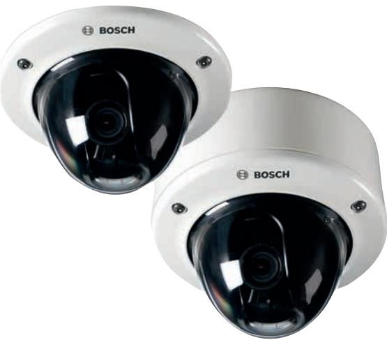
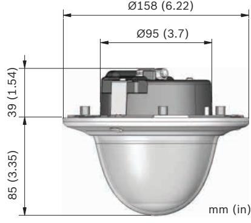
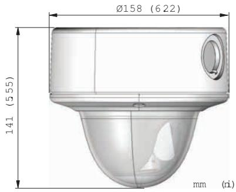

# FLEXIDOME IP starlight 7000 VR

www.boschsecurity.com

This camera provides clear images 24/7 – even at night or under low-light conditions.

The exceptional starlight sensitivity enables this camera to work with a minimum of ambient light. The extended dynamic mode provides detailed images in scenes with challenging lighting.

The camera is available in 1080p or 720p resolution versions and provides up to 60 images per second. The aesthetic vandal-resistant housing makes the camera suitable for indoor or outdoor installation.

#### **Functions**

#### **Exceptional low-light performance**

The latest sensor technology combined with the sophisticated noise suppression results in an exceptional sensitivity in color. The low-light performance is so good that the camera continues to provide excellent color performance even with a minimum of ambient light.

#### **Fast performance**

The 60 images-per-second mode provides for optimum performance in fast action scenes and is particularly suitable for casino and banking applications.

- u Excellent low-light performance
- u Built-in Intelligent Video Analytics to trigger relevant alerts and quickly retrieve data
- u Intelligent Dynamic Noise Reduction reduces bandwidth and storage requirements by up to 50%
- u Extended Dynamic Range mode to see details in bright and dark areas simultaneously
- u Easy to install with auto zoom/focus SR lens, wizard and pre-configured modes

#### **High Dynamic Range**

The camera has High Dynamic Range. This is based on a multiple-exposure process that captures more details in the highlights and in the shadows even in the same scene. The result is that you can easily distinguish objects and features, for example, faces with bright backlight.

The actual dynamic range of the camera is measured using Opto-Electronic Conversion Function (OECF) analysis according to IEC 62676 Part 5. This method is used to provide a standard result which can be used to compare different cameras.

#### **Content Based Imaging Technology**

Content Based Imaging Technology (CBIT) is used to radically improve image quality in all lighting conditions and to identify areas for enhanced processing. The camera examines the scene using Intelligent Video Analytics and provides feedback to retune the image processing. This provides better detail in the areas that matter and better all-round performance. With IVA, the Intelligent Auto Exposure technology, for example, allows you to view moving objects in bright and dark areas of a scene.

#### **Intelligent Video Analytics**

The built-in video analytics is both robust and intelligent. The Intelligence-at-the-Edge concept now delivers even more powerful features:

- Simple calibration
- False alarm reduction
- Extended range identification
- Crowd and queue management
- Density and flow counting

The mission critical video analytics reliably detects, tracks, and analyzes objects, and alerts you when predefined alarms are triggered. A smart set of alarm rules, together with object filters and tracking modes, makes complex tasks easy.

The system is also extremely robust and is able to reduce false alarms, for example from foliage or shaking objects, even in harsh weather conditions. Metadata is attached to your video to add sense and structure. This enables you to quickly retrieve the relevant images from hours of stored video. Metadata can also be used to deliver irrefutable forensic evidence or to optimize business processes based on people counting or crowd density information. Calibration is quick and easy – just enter the height of the camera. The internal gyro/accelerometer sensor provides the rest of the information to precisely calibrate the video analytics.

#### **Intelligent Dynamic Noise Reduction reduces bandwidth and storage requirements**

The camera uses Intelligent Dynamic Noise Reduction which actively analyzes the contents of a scene and reduces noise artifacts accordingly. The low-noise image and the efficient H.264 compression technology provide clear images while reducing bandwidth and storage by up to 50% compared to other H.264 cameras. This results in reduced-bandwidth streams that still retain a high image quality and smooth motion. The camera provides the most usable image possible by cleverly optimizing the detail-to-bandwidth ratio.

#### **Area-based encoding**

Area-based encoding is another feature which reduces bandwidth. Compression parameters for up to eight user-definable regions can be set. This allows uninteresting regions to be highly compressed, leaving more bandwidth for important parts of the scene.

#### **Bitrate optimized profile**

The average typical optimized bandwidth in kbits/s for various image rates is shown in the table.

| IPS | 1080p | 720p | 480p |
|-----|-------|------|------|
| 60  | 1900  | 1400 | 722  |
| 30  | 1600  | 1200 | 600  |
| 15  | 1274  | 955  | 478  |
| 12  | 1169  | 877  | 438  |

| IPS | 1080p | 720p | 480p |
|-----|-------|------|------|
| 5   | 757   | 568  | 284  |
| 2   | 326   | 245  | 122  |

#### **Multiple streams**

The innovative multi-streaming feature delivers various H.264 streams together with an M‑JPEG stream. These streams facilitate bandwidth-efficient viewing and recording as well as integration with third-party video management systems.

The camera can run multiple independent streams that allows to set a different resolution and frame rate on the first and second stream. The user can also choose to use a copy of the first stream.

The third stream uses the I-frames of the first stream for recording; the fourth stream shows a JPEG image at a maximum of 10 Mbit/s.

#### **Regions of interest and E-PTZ**

Regions of Interest (ROI) can be user defined. The remote E-PTZ (Electronic Pan, Tilt and Zoom) controls allow you to select specific areas of the parent image. These regions produce separate streams for remote viewing and recording. These streams, together with the main stream, allow the operator to separately monitor the most interesting part of a scene while still retaining situational awareness.

Intelligent Tracking can follow objects within the defined regions of interest. Intelligent Tracking can autonomously detect and track moving objects or the user can click on an object which the tracker will then follow.

#### **Storage management**

Recording management can be controlled by the Bosch Video Recording Manager (Video Recording Manager) or the camera can use iSCSI targets directly without any recording software.

#### **Edge recording**

Insert a memory card into the card slot to store up to 2 TB of local alarm recording. Pre-alarm recording in RAM reduces recording bandwidth on the network, and extends the effective life of the memory card.

#### **Cloud-based services**

The camera supports time-based or alarm-based JPEG posting to four different accounts. These accounts can address FTP servers or cloud-based storage facilities (for example, Dropbox). Video clips or JPEG images can also be exported to these accounts. Alarms can be set up to trigger an e-mail or SMS notification so you are always aware of abnormal events.

#### **Easy installation**

Power for the camera can be supplied via a Powerover-Ethernet compliant network cable connection. With this configuration, only a single cable connection is required to view, power, and control the camera.

Using PoE makes installation easier and more costeffective, as cameras do not require a local power source.

The camera can also be supplied with power from +12 VDC power supplies.

To increase system reliability, the camera can be simultaneously connected to both PoE and +12 VDC supplies. If one power source fails, the other source takes over without a reboot so providing power redundancy.

The automatic zoom/focus lens wizard makes it easy for an installer to accurately zoom and focus the camera for both day and night operation. The wizard is activated from the PC or from the on-board camera push button making it easy to choose the workflow that suits best.

The AVF (Automatic Varifocal) feature means that the zoom can be changed without opening the camera. The automatic motorized zoom/focus adjustment with 1:1 pixel mapping ensures the camera is always accurately focused.

#### **Automatic image rotation**

The integrated gyro/accelerometer sensor automatically corrects the image orientation in steps of 90° if the camera is mounted at right angles or upside down. The sensor image can also be rotated manually through steps of 90°.

To efficiently capture details in long hallways without loss of resolution, mount the camera at right angles. The image is displayed upright at full resolution on your monitor.

#### **Scene modes**

The camera has a very intuitive user interface that allows fast and easy configuration. Nine configurable modes are provided with the best settings for a variety of applications. Different scene modes can be selected for day or night situations.

#### **Hybrid operation**

A surge-protected analog video output allows full hybrid operation. This means that high resolution IP video streaming and an analog video output are available simultaneously. The hybrid functionality offers an easy migration path from legacy CCTV to a modern IP-based system.

#### **Aesthetic vandal resistant design**

The compact aesthetic design is suitable for installations where housing size and appearance are important. The cast-aluminum housing, polycarbonate window, and hardened inner liner can withstand the equivalent of 55 kg (120 lbs) of force (IK10). The camera is also protected against water and dust. Using the proprietary pan/tilt/rotation mechanism, installers can select the exact field of view. Mounting options are numerous, including surface, wall, corner, and suspended-ceiling mounting.

#### **True day/night switching**

The camera is a true day/night camera with a mechanical filter for vivid daytime color and exceptional night-time imaging while maintaining sharp focus under all lighting conditions. The filter can be switched remotely, or automatically via a light level sensor or contact input.

#### **Data security**

Special measures have been put in place to ensure the highest level of security for device access and data transport. The three-level password protection with security recommendations allows users to customize device access. Web browser access can be protected using HTTPS and firmware updates can also be protected with authenticated secure uploads. The on-board Trusted Platform Module (TPM) and Public Key Infrastructure (PKI) support, guarantee superior protection from malicious attacks. The 802.1x network authentication with EAP/TLS, supports TLS 1.2 with updated cipher suites including AES 256 encryption.

The advanced certificate handling offers:

- Self-signed unique certificates automatically created when required
- Client and server certificates for authentication
- Client certificates for proof of authenticity
- Certificates with encrypted private keys

#### **Complete viewing software**

There are many ways to access the camera's features: using a web browser, with the Bosch Video Management System, with the free-of-charge Bosch Video Client or Video Security Client, with the video security mobile app, or via third-party software.

#### **Video security app**

The Bosch video security mobile app has been developed to enable Anywhere access to HD surveillance images allowing you to view live images from any location. The app is designed to give you complete control of all your cameras, from panning and tilting to zoom and focus functions. It's like taking your control room with you.

This app, together with the separately available Bosch transcoder, will allow you to fully utilize our dynamic transcoding features so you can play back images even over low-bandwidth connections.

#### **System integration**

The camera conforms to the ONVIF Profile S specifications. Compliance with these standards guarantees interoperability between network video products regardless of manufacturer.

Third-party integrators can easily access the internal feature set of the camera for integration into large projects. Visit the Bosch Integration Partner Program (IPP) website (ipp.boschsecurity.com) for more information.

| Standards            | Type                                                                                                                                                                                                                      |
|----------------------|---------------------------------------------------------------------------------------------------------------------------------------------------------------------------------------------------------------------------|
| Emission             | EN 55032:2012 /AC2013 class B EN 50121-4:2006 /AC:2008 FCC: 47CFR15, class B (2015-10-1)                                                                                                                            |
| Immunity             | EN 50130-4:2011 /A12014 (PoE, +12VDC)* EN 50121-4:2006 /AC:2008                                                                                                                                                        |
| Environmental        | EN 50130-5:2011 Class IV                                                                                                                                                                                                  |
| Safety               | EN 62368-1:2014/AC:2015 EN 60950-1:2006 /A11:2009 /A1:2010 / A12:2011 /A2:2013 UL 62368-1, Ed. 2, Dec 1st, 2014 UL 60950-1, Ed. 2, October 14, 2014 CAN/CSA-C22.2 No. 62368-1 CAN/CSA-C22.2 No. 60950-1 |
| HD                   | SMPTE 296M-2001 (Resolution: 1280x720) SMPTE 274M-2008 (Resolution: 1920x1080)                                                                                                                                      |
| Color representation | ITU-R BT.709-6                                                                                                                                                                                                            |
| ONVIF conformance    | EN 50132-5-2:2011/AC:2012 EN 62676-2-3:2014                                                                                                                                                                            |
| Image quality        | UL 2802                                                                                                                                                                                                                   |

**Certifications and approvals**

#### * Chapters 7 and 8 (mains voltage supply requirement) are not applicable to the camera. However, if the system in which this camera is used needs to comply with this standard,

then any power supplies used must comply with this standard.

| Marks  |    | CE, cULus, WEEE, RCM, EAC and China RoHS |
|--------|----|------------------------------------------|
| Region |    | Regulatory compliance/quality marks      |
| Europe | CE |                                          |
| USA    | UL |                                          |

#### **Installation/configuration notes**

#### **Dimensions flush mounting**

#### **Dimensions surface mounting**

#### **Technical specifications**

| Power                    |                                                                             |  |
|--------------------------|-----------------------------------------------------------------------------|--|
| Input voltage            | Power-over-Ethernet (48 VDC nominal) and/ or +12 VDC ±10% (auxiliary) |  |
| PoE IEEE standard        | 802.3af (802.3at Type 1) Power level: Class 3                            |  |
| Power Consumption        | 7.2 W max.                                                                  |  |
| Current draw (PoE)       | 200 mA max.                                                                 |  |
| Current draw (12 VDC) | 600 mA max.                                                                 |  |
| Sensor (1080p version)   |                                                                             |  |
| Sensor type              | 1/2.8‑inch CMOS                                                             |  |
| Effective pixels         | 1920 (H) x 1080 (V); 2MP (approx.)                                          |  |
| Sensor (720p version)    |                                                                             |  |
| Sensor type              | 1/2.8‑inch CMOS                                                             |  |

#### **Starlight sensitivity**

(3100K, reflectivity 89%, 1/25, F1.2, 30IRE)

Effective pixels 1280 (H) x 720 (V)

| Color                                          | 0.0075 lx  |
|------------------------------------------------|------------|
| Mono                                           | 0.0011 lx  |
| Dynamic range – HDR mode                       |            |
| High Dynamic Range (10-bit, 3x exposure) | 120 dB WDR |
| Measured according to IEC 62676 Part 5      | 110 dB WDR |
|                                                |            |

#### **5** | FLEXIDOME IP starlight 7000 VR

| Video streaming                |                                                                                                                           |  |
|--------------------------------|---------------------------------------------------------------------------------------------------------------------------|--|
| Video compression              | H.264 (MP); M- JPEG                                                                                                       |  |
| Streaming                      | Multiple configurable streams in H.264 and M JPEG, configurable frame rate and bandwidth. Regions of Interest (ROI) |  |
| Camera processing latency   | <67 ms (max. average at 1080p60)                                                                                          |  |
| GOP structure                  | IP, IBP, IBBP                                                                                                             |  |
| Encoding interval              | 1 to 50 [60] ips                                                                                                          |  |
| Video resolution (H x V)       |                                                                                                                           |  |
| 1080p HD                       | 1920 x 1080 (1080p version only)                                                                                          |  |
| Upright mode 1080p             | 1080 x 1920 (1080p version only)                                                                                          |  |
| 1.3 MP (5:4)                   | 1280 x 1024 (1080p version only)                                                                                          |  |
| 720p HD                        | 1280 x 720                                                                                                                |  |
| Upright mode 720p              | 720 x 1280                                                                                                                |  |
| D1 4:3 (cropped)               | 704 x 480                                                                                                                 |  |
| 432p SD                        | 768 x 432                                                                                                                 |  |
| 288p SD                        | 512 x 288                                                                                                                 |  |
| Camera installation            |                                                                                                                           |  |
| Application variant            | Starlight mode (default) / HDR - extended dynamic mode                                                                 |  |
| Base frame rate                | 25/30/50/60 fps (PAL/NTSC for analog output)                                                                           |  |
| Mirror image                   | On / Off                                                                                                                  |  |
| Flip image                     | On / Off                                                                                                                  |  |
| Rotate                         | 0° / 90° / 180° / 270°                                                                                                    |  |
| Camera LED                     | Enable/disable                                                                                                            |  |
| Analog output                  | Off, 4:3 letterbox, 4:3 crop, 16:9                                                                                        |  |
| Positioning                    | Coordinates / Mounting height                                                                                             |  |
| Lens wizard                    | Autofocus, remote zoom                                                                                                    |  |
| Video functions - color        |                                                                                                                           |  |
| Adjustable picture settings | Contrast, Saturation, Brightness                                                                                          |  |
| White Balance                  | 2500 to 10000K, 4 automatic modes (Basic, Standard, Sodium lamp, Dominant color), Manual mode and Hold mode         |  |
| Video functions - ALC          |                                                                                                                           |  |
| ALC level                      | Adjustable                                                                                                                |  |

Saturation Adjustable from peak to average

| Shutter Automatic Electronic Shutter (AES); Fixed shutter (1/25[30] to 1/15000) selectable; Default shutter Day/Night Auto (adjustable switch points), Color, Monochrome Video functions - enhance Sharpness Sharpness enhancement level selectable Backlight On / off / Intelligent Auto Exposure (IAE) compensation Contrast On/off enhancement Signal-to-noise ratio >55 dB (SNR) Noise reduction Intelligent Dynamic Noise Reduction with separate temporal and spatial adjustments Intelligent defog Intelligent Defog automatically adjusts parameters for best picture in foggy or misty scenes (switchable) Video content analysis Analysis type Intelligent Video Analytics Configurations Silent VCA / Profile1/2 / Scheduled / Event triggered Alarm rules Any object (combinable) Object in field Line crossing Enter / leave field Loitering Follow route Idle / removed object Counting Occupancy Crowd density estimation Condition change Similarity search Flow / counter flow Audio detection (if microphone used) Object filters Duration Size Aspect ratio Speed Direction Color Object classes (4) Tracking modes Standard (2D) tracking 3D tracking 3D people tracking Ship tracking Museum mode | Video functions - ALC |  |  |
|------------------------------------------------------------------------------------------------------------------------------------------------------------------------------------------------------------------------------------------------------------------------------------------------------------------------------------------------------------------------------------------------------------------------------------------------------------------------------------------------------------------------------------------------------------------------------------------------------------------------------------------------------------------------------------------------------------------------------------------------------------------------------------------------------------------------------------------------------------------------------------------------------------------------------------------------------------------------------------------------------------------------------------------------------------------------------------------------------------------------------------------------------------------------------------------------------------------------------------------------------------------------------------------------------------------------------------------------------------------------------------------------------------------|-----------------------|--|--|
|                                                                                                                                                                                                                                                                                                                                                                                                                                                                                                                                                                                                                                                                                                                                                                                                                                                                                                                                                                                                                                                                                                                                                                                                                                                                                                                                                                                                                  |                       |  |  |
|                                                                                                                                                                                                                                                                                                                                                                                                                                                                                                                                                                                                                                                                                                                                                                                                                                                                                                                                                                                                                                                                                                                                                                                                                                                                                                                                                                                                                  |                       |  |  |
|                                                                                                                                                                                                                                                                                                                                                                                                                                                                                                                                                                                                                                                                                                                                                                                                                                                                                                                                                                                                                                                                                                                                                                                                                                                                                                                                                                                                                  |                       |  |  |
|                                                                                                                                                                                                                                                                                                                                                                                                                                                                                                                                                                                                                                                                                                                                                                                                                                                                                                                                                                                                                                                                                                                                                                                                                                                                                                                                                                                                                  |                       |  |  |
|                                                                                                                                                                                                                                                                                                                                                                                                                                                                                                                                                                                                                                                                                                                                                                                                                                                                                                                                                                                                                                                                                                                                                                                                                                                                                                                                                                                                                  |                       |  |  |
|                                                                                                                                                                                                                                                                                                                                                                                                                                                                                                                                                                                                                                                                                                                                                                                                                                                                                                                                                                                                                                                                                                                                                                                                                                                                                                                                                                                                                  |                       |  |  |
|                                                                                                                                                                                                                                                                                                                                                                                                                                                                                                                                                                                                                                                                                                                                                                                                                                                                                                                                                                                                                                                                                                                                                                                                                                                                                                                                                                                                                  |                       |  |  |
|                                                                                                                                                                                                                                                                                                                                                                                                                                                                                                                                                                                                                                                                                                                                                                                                                                                                                                                                                                                                                                                                                                                                                                                                                                                                                                                                                                                                                  |                       |  |  |
|                                                                                                                                                                                                                                                                                                                                                                                                                                                                                                                                                                                                                                                                                                                                                                                                                                                                                                                                                                                                                                                                                                                                                                                                                                                                                                                                                                                                                  |                       |  |  |
|                                                                                                                                                                                                                                                                                                                                                                                                                                                                                                                                                                                                                                                                                                                                                                                                                                                                                                                                                                                                                                                                                                                                                                                                                                                                                                                                                                                                                  |                       |  |  |
|                                                                                                                                                                                                                                                                                                                                                                                                                                                                                                                                                                                                                                                                                                                                                                                                                                                                                                                                                                                                                                                                                                                                                                                                                                                                                                                                                                                                                  |                       |  |  |
|                                                                                                                                                                                                                                                                                                                                                                                                                                                                                                                                                                                                                                                                                                                                                                                                                                                                                                                                                                                                                                                                                                                                                                                                                                                                                                                                                                                                                  |                       |  |  |
|                                                                                                                                                                                                                                                                                                                                                                                                                                                                                                                                                                                                                                                                                                                                                                                                                                                                                                                                                                                                                                                                                                                                                                                                                                                                                                                                                                                                                  |                       |  |  |
|                                                                                                                                                                                                                                                                                                                                                                                                                                                                                                                                                                                                                                                                                                                                                                                                                                                                                                                                                                                                                                                                                                                                                                                                                                                                                                                                                                                                                  |                       |  |  |
|                                                                                                                                                                                                                                                                                                                                                                                                                                                                                                                                                                                                                                                                                                                                                                                                                                                                                                                                                                                                                                                                                                                                                                                                                                                                                                                                                                                                                  |                       |  |  |

| Video content analysis                 |                                                                                                                                                   |  |
|----------------------------------------|---------------------------------------------------------------------------------------------------------------------------------------------------|--|
| Calibration / Geolocation           | Automatic based on gyro / accelerometer data and camera height                                                                                 |  |
| Tamper detection                       | Maskable                                                                                                                                          |  |
| Additional functions                   |                                                                                                                                                   |  |
| Scene modes                            | 9 default modes with scheduler: Indoor, Outdoor, Traffic, Night Optimized, Intelligent AE, Vibrant, Low bitrate, Sports & Gaming, Retail |  |
| Privacy Masking                        | Eight independent areas, fully programmable                                                                                                       |  |
| Video authentication                   | Off / Watermark / MD5 / SHA-1 / SHA-256                                                                                                           |  |
| Display stamping                       | Name; Logo; Time; Alarm message                                                                                                                   |  |
| Pixel counter                          | Selectable area                                                                                                                                   |  |
| Camera rotation                        | Automatic detection with manual override (90°)                                                                                                 |  |
| Local storage                          |                                                                                                                                                   |  |
| Internal RAM                           | 60 s pre-alarm recording                                                                                                                          |  |
| Memory card slot                       | Supports up to 32 GB microSDHC / 2 TB microSDXC card. (A memory card of Class 6 or higher is recommended for HD recording)                  |  |
| Recording                              | Continuous recording, ring recording. alarm/ events/schedule recording                                                                         |  |
| Input/output                           |                                                                                                                                                   |  |
|                                        |                                                                                                                                                   |  |
| Analog Video out                       | CVBS (PAL/NTSC), 1 Vpp, BNC, 75 Ohm (surge protected)                                                                                          |  |
| Audio signal line in                   | 10 kOhm typical;, 1 Vrms max                                                                                                                      |  |
| Audio signal line out                  | 1 Vrms; 1.5 kOhm typical                                                                                                                          |  |
| Alarm input (x2) activation voltage | +5 VDC to +40 VDC (+3.3 VDC with DC-coupled 22 kOhm pull-up resistor)                                                                       |  |
| Alarm output voltage                   | 30 VAC or +40 VDC Maximum 0.5 A continuous, 10VA                                                                                               |  |
| Ethernet                               | RJ45                                                                                                                                              |  |
| Audio streaming                        |                                                                                                                                                   |  |
| Standard                               | G.711, 8 kHz sampling rate L16, 16 kHz sampling rate AAC-LC, 48 kbps at 16 kHz sampling rate AAC-LC, 80 kbps at 16 kHz sampling rate     |  |
| Signal-to-Noise Ratio                  | >50 dB                                                                                                                                            |  |

| Software                             |                                                                                                                                                                                                                                                                                                                                                       |
|--------------------------------------|-------------------------------------------------------------------------------------------------------------------------------------------------------------------------------------------------------------------------------------------------------------------------------------------------------------------------------------------------------|
| Unit discovery                       | IP Helper                                                                                                                                                                                                                                                                                                                                             |
| Unit configuration                   | Via web browser or Configuration Manager                                                                                                                                                                                                                                                                                                              |
| Firmware update                      | Remotely programmable                                                                                                                                                                                                                                                                                                                                 |
| Software viewing                     | Web browser; Video Security Client; Video Security App; Bosch Video Management System; Bosch Video Client; or third party software                                                                                                                                                                                                     |
| Latest firmware and software      | http://downloadstore.boschsecurity.com/                                                                                                                                                                                                                                                                                                               |
| Network                              |                                                                                                                                                                                                                                                                                                                                                       |
| Protocols                            | IPv4, IPv6, UDP, TCP, HTTP, HTTPS, RTP/ RTCP, IGMP V2/V3, ICMP, ICMPv6, RTSP, FTP, ARP, DHCP, APIPA (Auto-IP, link local address), NTP (SNTP), SNMP (V1, V3, MIB-II), 802.1x, DNS, DNSv6, DDNS (DynDNS.org, selfHOST.de, no-ip.com), SMTP, iSCSI, UPnP (SSDP), DiffServ (QoS), LLDP, SOAP, Dropbox™, CHAP, digest authentication |
| Encryption                           | TLS 1.2, SSL, DES, 3DES                                                                                                                                                                                                                                                                                                                               |
| Ethernet                             | 10/100 Base-T, auto-sensing, half/full duplex                                                                                                                                                                                                                                                                                                         |
| Connectivity                         | Auto-MDIX                                                                                                                                                                                                                                                                                                                                             |
| Interoperability                     | ONVIF Profile S; GB/T 28181                                                                                                                                                                                                                                                                                                                        |
| Optical                              |                                                                                                                                                                                                                                                                                                                                                       |
| Lens                                 | 3 to 9 mm Automatic Varifocal (AVF) SR lens (IR corrected) - or – 10 to 23 mm Automatic Varifocal (AVF) SR lens (IR corrected)                                                                                                                                                                                                            |
| Lens mount                           | Board mounted                                                                                                                                                                                                                                                                                                                                         |
| Adjustment                           | Motorized zoom/focus                                                                                                                                                                                                                                                                                                                                  |
| Iris control                         | Automatic iris control                                                                                                                                                                                                                                                                                                                                |
| Viewing angle (3 to 9 mm, F1.2)   | Wide: 117º x 59º (H x V) Tele: 37º x 21º (H x V )                                                                                                                                                                                                                                                                                                  |
| Viewing angle (10 to 23 mm, F1.6) | Wide: 32º x 18º (H x V) Tele: 14.4º x 8.1º (H x V )                                                                                                                                                                                                                                                                                                |
| Mechanical                           |                                                                                                                                                                                                                                                                                                                                                       |
| Dimensions (D x H)                   | 158 x 124 mm (6.22 x 4.89 in)                                                                                                                                                                                                                                                                                                                         |
| Weight                               | 0.85 kg (1.87 lb) 1.28 kg (2.82 lb) with SMB                                                                                                                                                                                                                                                                                                       |
| Mounting                             | Flush mount or surface mount                                                                                                                                                                                                                                                                                                                          |
|                                      |                                                                                                                                                                                                                                                                                                                                                       |

|  | Mechanical |
|--|------------|
|  |            |

| Color                     | White (RAL9010) trim ring with black inner liner                                                                                                                                           |
|---------------------------|-----------------------------------------------------------------------------------------------------------------------------------------------------------------------------------------------|
| Adjustment range          | 360º pan, 90º tilt, ±90º twist                                                                                                                                                                |
| Dome bubble               | Polycarbonate, clear with UV blocking anti scratch coating                                                                                                                                 |
| Trim ring                 | Aluminum                                                                                                                                                                                      |
| Environmental             |                                                                                                                                                                                               |
| Operating temperature  | -30 ºC to +50 ºC (-22 ºF to +122 ºF) for continuous operation; -34 ºC to +74 ºC (-30 ºF to +165 ºF) according to NEMA TS 2-2003 (R2008), para 2.1.5.1 using fig. 2.1 test profile |
| Cold start temperature | -20 ºC (-4 ºF)                                                                                                                                                                                |
| Storage temperature       | -50 ºC to +70 ºC (-58 ºF to +158 ºF)                                                                                                                                                          |
| Operating humidity        | 5% to 93% relative humidity (non condensing) 5% to 100% relative humidity (condensing)                                                                                                  |
| Storage humidity          | Up to 98% relative humidity                                                                                                                                                                   |
| Impact protection         | IK10                                                                                                                                                                                          |
| Water/dust protection  | IP 66 and NEMA Type 4X (with appropriate installation standards)                                                                                                                           |

#### **Ordering information**

#### **NIN-73013-A3A Dome 1MP HDR 3-9mm auto IP66**

High-performance IP dome camera for IVA-optimized, mission critical, HD surveillance in low light and with hybrid IP/analog operation.

720p 3 to 9 mm SR lens Order number **NIN-73013-A3A**

#### **NIN-73013-A3AS Dome 1MP HDR 3-9mm auto IP66 surface**

High-performance IP dome camera for IVA-optimized, mission critical, HD surveillance in low light and with hybrid IP/analog operation. 720p

3 to 9 mm SR lens Surface mount box Order number **NIN-73013-A3AS**

#### **NIN-73013-A10A Dome 1MP HDR 10-23mm auto IP66**

High-performance IP dome camera for IVA-optimized, mission critical, HD surveillance in low light and with hybrid IP/analog operation. 720p 10 to 23 mm SR lens

Order number **NIN-73013-A10A**

#### **NIN-73013-A10AS Dome 1MP HDR 10-23mm auto IP66 surface**

High-performance IP dome camera for IVA-optimized, mission critical, HD surveillance in low light and with hybrid IP/analog operation. 720p 10 to 23 mm SR lens Surface mount box

Order number **NIN-73013-A10AS**

#### **NIN-73023-A3A Dome 2MP HDR 3-9mm auto IP66**

High-performance IP dome camera for IVA-optimized, mission critical, HD surveillance in low light and with hybrid IP/analog operation. 1080p 3 to 9 mm SR lens Order number **NIN-73023-A3A**

#### **NIN-73023-A3AS Dome 2MP HDR 3-9mm auto IP66 surface**

High-performance IP dome camera for IVA-optimized, mission critical, HD surveillance in low light and with hybrid IP/analog operation. 1080p 3 to 9 mm SR lens Surface mount box Order number **NIN-73023-A3AS**

### **NIN-73023-A10A Dome 2MP HDR 10-23mm auto IP66**

High-performance IP dome camera for IVA-optimized, mission critical, HD surveillance in low light and with hybrid IP/analog operation. 1080p 10 to 23 mm SR lens Order number **NIN-73023-A10A**

#### **NIN-73023-A10AS Dome 2MP HDR 10-23mm auto IP66 surface**

High-performance IP dome camera for IVA-optimized, mission critical, HD surveillance in low light and with hybrid IP/analog operation. 1080p 10 to 23 mm SR lens Surface mount box Order number **NIN-73023-A10AS**

#### **Accessories**

#### **VDA-WMT-DOME Dome Wall Mount**

Sturdy wall mount bracket for dome cameras (Ø158) Order number **VDA-WMT-DOME**

**VDA-CMT-PTZDOME Corner mount adapter**

Corner (270°) mount adapter for use with the appropriate wall mount Order number **VDA-CMT-PTZDOME**

#### **VDA-CMT-DOME Corner mount for AUTODOME camera, 158mm**

Sturdy bracket for mounting dome cameras in a 90° corner.

Order number **VDA-CMT-DOME**

#### **LTC 9213/01 Pole mount adapter for LTC9210,9212,9215**

Flexible pole mount adapter for camera mounts (use together with the appropriate wall mount bracket). Max. 9 kg (20 lb); 3 to 15 inch diameter pole; stainless steel straps

Order number **LTC 9213/01**

#### **VDA-PLEN-DOME In-ceiling housing for plenum, FLEXI-DOME**

In-ceiling housing for plenums kit for several series of Bosch dome cameras

Order number **VDA-PLEN-DOME**

#### **VGA-IC-SP Suspended ceiling support kit,7"**

Suspended ceiling support kit for dome cameras. Aperture Ø177 mm (Ø7 in). Maximum supported weight 11.3 kg (25 lb). Order number **VGA-IC-SP**

#### **VDA-455CBL Clear dome bubble for FLEXIDOME series** Clear replacement bubble for FLEXIDOME cameras. Order number **VDA-455CBL**

## **VDA-455TBL Bubble, tinted, for FLEXIDOME**

Tinted replacement bubble for dome camera. Order number **VDA-455TBL**

**NPD-5001-POE Power over ethernet , 15.4W, 1-port**

Power-over-Ethernet midspan injector for use with PoE enabled cameras; 15.4 W, 1-port Weight: 200 g (0.44 lb) Order number **NPD-5001-POE**

#### **NPD-5004-POE Power over ethernet, 15.4W, 4-port**

Power-over-Ethernet midspan injectors for use with PoE enabled cameras; 15.4 W, 4-ports Weight: 620 g (1.4 lb) Order number **NPD-5004-POE**

**UPA-1220-60 Power supply, 120VAC 60Hz,12VDC 1A out** Power supply for camera. 100-240 VAC, 50/60 Hz In; 12 VDC, 1 A Out; regulated. Input connector: 2-prong, North American standard (non-polarized). Order number **UPA-1220-60**

**S1460 Service monitor cable, 2.5mm jack to BNC** 2.5 mm jack to BNC video connector cable. 1 m Order number **S1460**

**VDA-455SMB-IP Surface mount box for dome camera** Surface Mount Box for dome cameras; IP version Order number **VDA-455SMB-IP**

#### **VDA-PMT-DOME Pipe mount bracket for FLEXIDOME, 158mm**

Sturdy pipe mount bracket for dome cameras (Ø158 mm)

Order number **VDA-PMT-DOME**

**NIN-DMY Dummy camera, FLEXIDOME VR family** FLEXIDOME VR family dummy camera Order number **NIN-DMY**

**Represented by:**

**Europe, Middle East, Africa: Germany: North America: Asia-Pacific:** Bosch Security Systems B.V. P.O. Box 80002 5600 JB Eindhoven, The Netherlands Phone: + 31 40 2577 284 emea.securitysystems@bosch.com emea.boschsecurity.com

Bosch Sicherheitssysteme GmbH Robert-Bosch-Ring 5 85630 Grasbrunn Germany www.boschsecurity.com

Bosch Security Systems, Inc. 130 Perinton Parkway Fairport, New York, 14450, USA Phone: +1 800 289 0096

Fax: +1 585 223 9180 onlinehelp@us.bosch.com www.boschsecurity.us

Robert Bosch (SEA) Pte Ltd, Security Systems 11 Bishan Street 21 Singapore 573943 Phone: +65 6571 2808 Fax: +65 6571 2699 apr.securitysystems@bosch.com www.boschsecurity.asia

© Bosch Security Systems 2019 | Data subject to change without notice 20826946443 | en, V15, 08. Feb 2019