#### **Applicable Models**

This manual is applicable to DS-3E05XXHP series Gigabit unmanaged PoE switch. **Symbol Conventions**

The symbols that may be found in this document are defined as follows.

| Symbol | Description                                                                                                                                                           |  |
|--------|-----------------------------------------------------------------------------------------------------------------------------------------------------------------------|--|
|        | Provides additional information to emphasize or supplement important points of the main text.                                                                      |  |
|        | Indicates a potentially hazardous situation, which if not avoided, could result in equipment damage, data loss, performance degradation, or unexpected results. |  |
|        | Indicates a hazard with a high level of risk, which if not avoided, will result in death or serious injury.                                                        |  |

- During the installation and utilization of the device, please strictly conform to electrical safety rules in different nations and regions. •
- Use the attached power adaptor only and not to change the adaptor randomly. Please refer to specification table for specific requirements of power adaptor. •
- Never attempt to disassemble the device yourself. (We shall not assume any responsibility for problems caused by unauthorized repair or maintenance.) •

 Quick Start Guide The device must be installed in machine room only, and only maintenance staff or qualified person should access to the device. •

Gigabit Unmanaged PoE Switch

- Do not touch the upper cover area of the device that may be overheated. Power must be shut down during cable connection, device installation and • •
- dismantlement. You shall acknowledge that the use of the device with Internet access might be under network security risks, please strengthen protection for your personal information and data security. If you find the device might be under network security risks, please contact with us. •
- Proper configuration of all passports and other security settings is the responsibility of the installer, and you shall keep user name and passports properly. •
- Please keep all original packing materials properly. If the product does not work properly, pack the switch in its original packing materials for shipping. We shall not assume any responsibility for damages caused by improper packing materials during shipping. •
- Ensure that your devices powered via the PoE port have their shells protected and fire-proofed, because the switches are not compliant with the Limited Power Source (LPS) standard. •
- 1 This is a class A product and may cause radio interference in which case the user may be required to take adequate measures. •

## Rear Panel

DS-3E0505HP

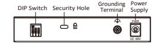

DS-3E0510HP

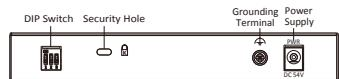

DS-3E0520/28HP

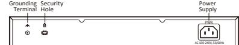

### Grounding Terminal

The grounding terminal is used to connect to the ground cable to protect the switch from lightning.

### Power Supply

Use the attached power cord to connect the switch to socket.

## Security Hole

Use the steel cable lock (optional) to lock the switch.

All figures in this guide are used for illustration purpose only. The actual product may differ.

# Packing List

| Model Item     | DS-3E0505/10HP | DS-3E0520/28HP |
|-------------------|----------------|----------------|
| Switch            | × 1            | × 1            |
| Power adapter     | × 1            | —              |
| Power cord        | × 1            | × 1            |
| L-shaped bracket  | —              | × 1            |
| Screw             | —              | × 4            |
| Quick Start Guide | × 1            | × 1            |

# Interfaces

Front Panel

DS-3E0505HP

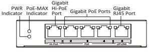

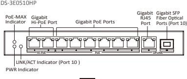

2

# Device Connection

Connect your devices according to your actual networking requirements. (Take the DS-3E0510HP series switch as an example.)

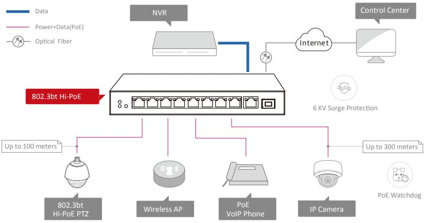

### DS-3E0520HP

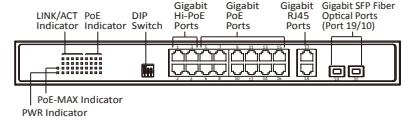

The front panel of DS-3E0528HP switch is similar to that of DS-3E0520HP, with differences on 20 gigabit PoE ports, 28 LINK/ACT, 24 PoE indicators and fiber optical ports are port 27 & 28.

## Gigabit Hi-PoE Port

Used for other Hi-PoE PTZ cameras connection, and the max. power is 90 W.

### Gigabit PoE Port

Used for other PoE devices connection via network cables.

### Gigabit RJ45 Port

Used for devices connection via network cables. Gigabit SFP Fiber Optical Port

Used for other devices connection via optical fiber when plugged into with an optical module.

#### DIP Switch

Three modes are supported:

- Extend: The last 2 PoE ports of DS-3E0505/10HP and the last 4 of
- DS-3E0520/28HP support network transmission of up to 300 metres. • Isolation: Data transmission of each port is Isolated from each other

to Improve network security.

- PoE Watchdog: Auto-detect and restart cameras that do not respond.

# Device Installation DS-3E0520/28HP

## Prerequisites:

- Make sure the rack or desktop be stable and firm enough. •
- The room must be well-ventilated. Keep at least 10 cm distance between all sides for cooling. •
- Keep at least 1.5 cm vertical distance between each switch while installing it on a rack. •

## DS-3E0505/10HP

DS-3E0505/10P series switches support desktop and wall-mounted installation. Follow the figure below for wall-mounted installation.

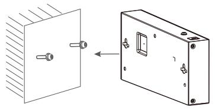

# Power-On Checking

Before powering your switch, make sure that:

- The operating power supply is compliant with rated input standard. •
- Port cables and grounding cables are correctly connected. •
- If there is outdoor cabling, connect a lightning rod and lightening arrester to the cable. •

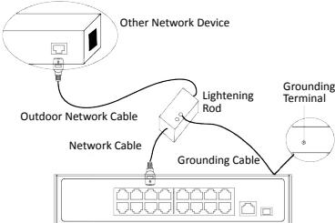

Please use the attached power cord in package to power up the switch.

11

DS-3E1518/26P series switches only support rack installation. Follow the steps below for rack installation.

- 1. Check the grounding and stability of the rack.
2. Use the attached screws to fix the two L-shaped brackets to the sides of the switch.

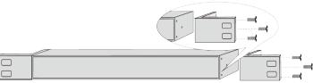

3. Place your switch on the rack, fix it to the rack with self-prepared screws, and ensure the stable installation of your switch to the rack.

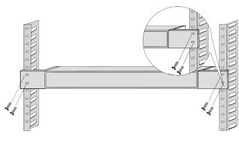

See the following table and check whether your devices are correctly connected. After proper connection, you can use your switch without doing any settings.

| Indicator Status |                    | Description                                                                                                                                                   |  |
|------------------|--------------------|---------------------------------------------------------------------------------------------------------------------------------------------------------------|--|
| PWR              | Solid              | The switch is powered on normally.                                                                                                                            |  |
|                  | Unlit              | No power supply connected or power supply is abnormal.                                                                                                     |  |
| Link/Act         | Solid              | The port is connected.                                                                                                                                        |  |
|                  | Blinking           | The port is transmitting data.                                                                                                                                |  |
|                  | Unlit              | The port is disconnected or connection is abnormal.                                                                                                        |  |
| PoE              | Solid              | The switch provides power supply to PD normally.                                                                                                           |  |
|                  | Unlit              | The switch is disconnected to PD, or provides power supply to PD abnormally.                                                                               |  |
| PoE-MAX          | Solid /Blinking | The output power of the switch is about to reach or already reaches the upper limit. The power supply may be abnormal if more devices are connected. |  |
|                  | Unlit              | The switch provides power supply to PD normally.                                                                                                           |  |

The switch supports auto MDI/MDIX of ports, you can use straight-through cable or crossover cable to connect the switch and opposite Ethernet devices.

12

# Grounding

## Purpose:

Grounding is used to quickly release overvoltage and overcurrent induced by lightening for switch, and to protect personal safety. Select the appropriate grounding method according to your needs.

## With Grounding Bar:

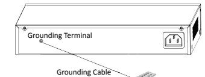

Grounding Bar

Without Grounding Bar:

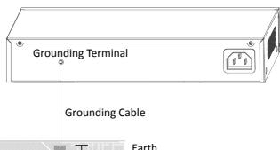

# Quick Start Guide

COPYRIGHT ©2019 Hangzhou Hikvision Digital Technology Co., Ltd. ALL RIGHTS RESERVED.

Any and all information, including, among others, wordings, pictures, graphs are the properties of Hangzhou Hikvision Digital Technology Co., Ltd. or its subsidiaries (hereinafter referred to be "Hikvision"). This user manual (hereinafter referred to be "the Manual") cannot be reproduced, changed, translated, or distributed, partially or wholly, by any means, without the prior written permission of Hikvision. Unless otherwise stipulated, Hikvision does not make any warranties, guarantees or representations, express or implied, regarding to the Manual.

### About this Manual

The Manual includes instructions for using and managing the product. Pictures, charts, images and all other information hereinafter are for description and explanation only. The information contained in the Manual is subject to change, without notice, due to firmware updates or other reasons. Please find the latest version in the company website

(http://overseas.hikvision.com/en/). Please use this user manual under the guidance of professionals.

### Trademarks Acknowledgement

 and other Hikvision's trademarks and logos are the properties of Hikvision in various jurisdictions. Other trademarks and logos mentioned below are the properties of their respective owners.

## Legal Disclaimer

TO THE MAXIMUM EXTENT PERMITTED BY APPLICABLE LAW, THE PRODUCT DESCRIBED, WITH ITS HARDWARE, SOFTWARE AND FIRMWARE, IS PROVIDED "AS IS", WITH ALL FAULTS AND ERRORS, AND HIKVISION MAKES NO WARRANTIES, EXPRESS OR IMPLIED, INCLUDING WITHOUT LIMITATION, MERCHANTABILITY, SATISFACTORY QUALITY, FITNESS FOR A PARTICULAR PURPOSE, AND NON-INFRINGEMENT OF THIRD PARTY. IN NO EVENT WILL HIKVISION, ITS DIRECTORS, OFFICERS, EMPLOYEES, OR AGENTS BE LIABLE TO YOU FOR ANY SPECIAL, CONSEQUENTIAL, INCIDENTAL, OR INDIRECT DAMAGES, INCLUDING, AMONG OTHERS, DAMAGES FOR LOSS OF BUSINESS PROFITS, BUSINESS INTERRUPTION, OR LOSS OF DATA OR DOCUMENTATION, IN CONNECTION WITH THE USE OF THIS PRODUCT, EVEN IF HIKVISION HAS BEEN ADVISED OF THE POSSIBILITY OF SUCH DAMAGES.

REGARDING TO THE PRODUCT WITH INTERNET ACCESS, THE USE OF PRODUCT SHALL BE WHOLLY AT YOUR OWN RISKS. HIKVISION SHALL NOT TAKE ANY RESPONSIBILITES FOR ABNORMAL OPERATION, PRIVACY LEAKAGE OR OTHER DAMAGES RESULTING FROM CYBER ATTACK, HACKER ATTACK, VIRUS INSPECTION, OR OTHER INTERNET SECURITY RISKS; HOWEVER, HIKVISION WILL PROVIDE TIMELY TECHNICAL SUPPORT IF REQUIRED.

SURVEILLANCE LAWS VARY BY JURISDICTION. PLEASE CHECK ALL RELEVANT LAWS IN YOUR JURISDICTION BEFORE USING THIS PRODUCT IN ORDER TO ENSURE THAT YOUR USE CONFORMS THE APPLICABLE LAW. HIKVISION SHALL NOT BE LIABLE IN THE EVENT THAT THIS PRODUCT IS USED WITH ILLEGITIMATE PURPOSES.

IN THE EVENT OF ANY CONFLICTS BETWEEN THIS MANUAL AND THE APPLICABLE LAW, THE LATER PREVAILS.

# Port Connection

### PoE Port Connection:

Connect the switch to the PoE ports of an opposite end device, including network camera, IP camera, NVR, switch, etc.

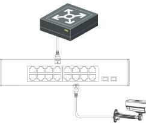

Fiber Optical Port Connection:

Do not bend fiber optic (curvature radius ≥ 10 cm) overly. Do not look directly at fiber optic connector for laser is harmful to eyes. • •

- Connect the two paired SFP optical module with an optical fiber. 1.
- Hold SFP optical module from one side, and smoothly plug it into the switch along with the SFP port slot until optical module and the switch are closely attached. 2.
- After powering on your switch, check the status of Link/Act indicator. If the indicator is lit, the link is connected. If the indicator is unlit, the link is disconnected. Check the line, and make sure opposite devices have been started. 3.

#### Regulatory Information FCC Information

Please take attention that changes or modification not expressly approved by the party responsible for compliance could void the user's authority to operate the equipment.

FCC compliance: This equipment has been tested and found to comply with the limits for a Class A digital device, pursuant to part 15 of the FCC Rules. These limits are designed to provide reasonable protection against harmful interference when the equipment is operated in a commercial environment. This equipment generates, uses, and can radiate radio frequency energy and, if not installed and used in accordance with the instruction manual, may cause harmful interference to radio communications. Operation of this equipment in a residential area is likely to cause harmful interference in which case the user will be required to correct the interference at his own expense.

### FCC Conditions

This device complies with part 15 of the FCC Rules. Operation is subject to the following two conditions:

1. This device may not cause harmful interference.

2. This device must accept any interference received, including interference that may cause undesired operation.

#### EU Conformity Statement

This product and - if applicable - the supplied accessories too are marked with "CE" and comply therefore with the applicable harmonized European standards listed under the EMC Directive 2014/30/EU, the LVD Directive 2014/35/EU, the RoHS Directive 2011/65/EU.

2012/19/EU (WEEE directive): Products marked with this symbol cannot be disposed of as unsorted municipal waste in the European Union. For proper

recycling, return this product to your local supplier upon the purchase of equivalent new equipment, or dispose of it at designated collection points. For more information see: www.recyclethis.info

2006/66/EC (battery directive): This product contains a battery that cannot be disposed of as unsorted municipal waste in the European Union. See the product documentation for specific battery information. The battery is marked with this

symbol, which may include lettering to indicate cadmium (Cd), lead (Pb), or mercury (Hg). For proper recycling, return the battery to your supplier or to a designated

collection point. For more information see: www.recyclethis.info Industry Canada ICES-003 Compliance

This device meets the CAN ICES-3 (A)/NMB-3(A) standards requirements.

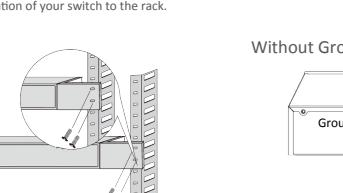

