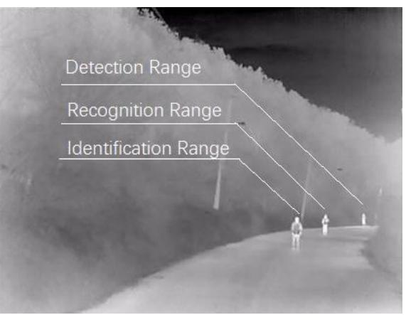
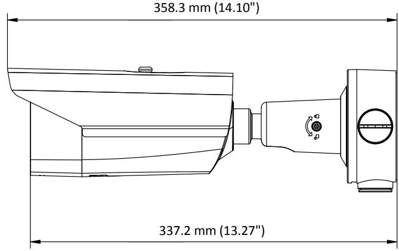
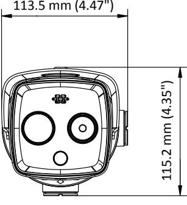
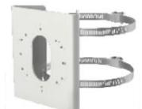
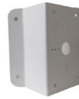

**DS-2TD2617-10/PA Thermal & Optical Bi-spectrum Network Bullet Camera**

Hikvision DS-2TD2617-10/PA Thermal & Optical Bi-spectrum Network Bullet Camera, equipped with built-in GPU which supports intelligent behavior analysis algorithm, can realize high-precision VCA detection and real-time alarm. It is applied to perimeter protection and fire prevention purposes in commercial facilities such as residential, retail, villa, parking lot, museum, data centers and so on. The pre-alarm system helps you discover unexpected events immediately and protects your property.

#### **Key Feature**

- Behavior analysis function, based on deep learning algorithm: line crossing, intrusion, region entrance & exit
- Temperature exception alarm
- Fire detection algorithm
- 160 × 120 (the resolution of output image is 320 × 240) resolution 17 μm, VOx UFPA, NETD ≤ 40 mK (25 °C, F# = 1.1)
- Image processing technology: Liner, histogram, and self-adaptive thermal AGC mode, DDE, 3D DNR

# **Specification**

| Thermal Module               |                                                                                                                  |  |  |  |  |
|------------------------------|------------------------------------------------------------------------------------------------------------------|--|--|--|--|
| Image Sensor                 | Vanadium Oxide Uncooled Focal Plane Arrays                                                                       |  |  |  |  |
| Resolution                   | 160 × 120 (the resolution of output image is 320 × 240)                                                          |  |  |  |  |
| Pixel Interval               | 17 μm                                                                                                            |  |  |  |  |
| Response Waveband            | 8 μm to 14 μm                                                                                                    |  |  |  |  |
| NETD (Noise Equivalent       |                                                                                                                  |  |  |  |  |
| Temperature Difference)      | ≤ 40 mk (25 °C,F# = 1.1)                                                                                         |  |  |  |  |
| Focal Length                 | 9.7 mm                                                                                                           |  |  |  |  |
| IFOV                         | 2.74 mrad                                                                                                        |  |  |  |  |
| Field of View                | 15.96° × 12° (H × V)                                                                                             |  |  |  |  |
| Min. Focusing Distance       | 1.2 m                                                                                                            |  |  |  |  |
| Aperture                     | F 1.1                                                                                                            |  |  |  |  |
| Digital Zoom                 | ×2, ×4, ×8                                                                                                       |  |  |  |  |
| Optical Module               |                                                                                                                  |  |  |  |  |
| Image Sensor                 | 1/2.7" Progressive Scan CMOS                                                                                     |  |  |  |  |
| Resolution                   | 2688 × 1520                                                                                                      |  |  |  |  |
| Min. Illumination            | Color: 0.0089 Lux @(F1.6, AGC ON), B/W: 0.0018 Lux @(F1.6, AGC ON)                                               |  |  |  |  |
| Shutter Speed                | 1 s to 1/100,000 s                                                                                               |  |  |  |  |
| Focal Length                 | 8 mm                                                                                                             |  |  |  |  |
| Field of View                | 39.42° × 22.14° (H × V)                                                                                          |  |  |  |  |
| Aperture                     | F1.7                                                                                                             |  |  |  |  |
| WDR                          | 120 dB                                                                                                           |  |  |  |  |
| Image Effect                 |                                                                                                                  |  |  |  |  |
| Picture in Picture           | Display partial image of thermal channel on the full screen of optical channel                                   |  |  |  |  |
| Bi-spectrum Image Fusion     | Display the details of optical channel on thermal channel                                                        |  |  |  |  |
| Target Coloration            | Yes. Supported in white hot and black hot mode.                                                                  |  |  |  |  |
| Smart Function               |                                                                                                                  |  |  |  |  |
| VCA (Video Content Analysis) | 4 VCA rule types (line crossing, intrusion, region entrance, and region exiting), up to 8 VCA rules in total. |  |  |  |  |
| Temperature Measurement      | 3 temperature measurement rule types, 21 rules in total (10 points, 10 areas, and 1 line).                    |  |  |  |  |
| Temperature Range            | -20 °C to + 150 °C (-4 °F to + 302°F)                                                                            |  |  |  |  |
| Temperature Accuracy         | ± 8 °C (± 14.4 °F)                                                                                               |  |  |  |  |
| Fire Detection               | Dynamic fire detection, up to 10 fire points detectable.                                                         |  |  |  |  |
| Illuminator                  |                                                                                                                  |  |  |  |  |
| IR Distance                  | Up to 40 m                                                                                                       |  |  |  |  |
| IR Intensity and Angle       | Automatically adjusted                                                                                           |  |  |  |  |
|                              |                                                                                                                  |  |  |  |  |

| Audible and Visual Alarm |                                                                                                                                                                                                                      |  |  |  |  |
|--------------------------|----------------------------------------------------------------------------------------------------------------------------------------------------------------------------------------------------------------------|--|--|--|--|
| White Light Range        | Up to 40 m                                                                                                                                                                                                           |  |  |  |  |
| Visual Alarm             | Yes. White light used as the visual alarm, flashing frequency adjustable                                                                                                                                             |  |  |  |  |
| Audio alarm              | Yes. 6 audio alarms are supported to cover all kinds of alarm.                                                                                                                                                       |  |  |  |  |
| Video & Audio            |                                                                                                                                                                                                                      |  |  |  |  |
| Main Stream              | Optical channel 50 HZ: 25 fps (2688 × 1520, 1920 × 1080, 1280 × 720) 60 Hz: 30 fps (2688 × 1520, 1920 × 1080, 1280 × 720) Thermal channel 25fps (1280 × 720, 704 × 576, 640 × 480, 352 × 288, 320 × 240) |  |  |  |  |
| Sub-stream               | Optical channel 50 HZ: 25 fps (704 × 576, 352 × 288, 176 × 144) 60 Hz: 30 fps (704 × 480, 352 × 240, 176 × 120) Thermal channel 25fps (704 × 576, 352 × 288, 320 × 240)                                  |  |  |  |  |
| Video Compression        | Main Stream: H.265/H.264 Sub-Stream: H.265/H.264/MJPEG                                                                                                                                                            |  |  |  |  |
| Audio Compression        | G.711u/G.711a/G.722.1/MP2L2/G.726/PCM                                                                                                                                                                                |  |  |  |  |
| Network                  |                                                                                                                                                                                                                      |  |  |  |  |
| Protocols                | IPv4/IPv6, HTTP, HTTPS, 802.1x, Qos, FTP, SMTP, UPnP, SNMP, DNS, DDNS, NTP, RTSP, RTCP, RTP, TCP, UDP, IGMP, ICMP, DHCP, PPPoE                                                                                    |  |  |  |  |
| Network Storage          | MicroSD/SDHC/SDXC card (up to 256 G) local storage, and NAS (NFS, SMB/CIFS), auto network replenishment (ANR)                                                                                                     |  |  |  |  |
| API                      | Open-ended API, supporting ISAPI, HIKVISION SDK, and third-party management platform, open network video interface                                                                                                |  |  |  |  |
| Simultaneous Live View   | Up to 20 channels                                                                                                                                                                                                    |  |  |  |  |
| User/Host Level          | Up to 32 users, 3 levels: Administrator, Operator, User                                                                                                                                                              |  |  |  |  |
| Security                 | User authentication (ID and PW), MAC address binding, HTTPS encryption, IEEE 802.1x(EAP-MD5, EAP-TLS), access control, IP address filtering                                                                       |  |  |  |  |
| Client                   | iVMS-4200, Hik-Connect                                                                                                                                                                                               |  |  |  |  |
| Web Browser              | IE 11, Chrome 41-44, Firefox 30-51                                                                                                                                                                                   |  |  |  |  |
| Interface                |                                                                                                                                                                                                                      |  |  |  |  |
| Alarm Input              | 2-ch inputs (0-5 VDC)                                                                                                                                                                                                |  |  |  |  |
| Alarm Output             | 2-ch relay outputs, alarm response actions configurable                                                                                                                                                              |  |  |  |  |
| Alarm Action             | SD recording/relay output/smart capture/FTP upload/email linkage/audio alarm/white light alarm                                                                                                                    |  |  |  |  |
| Audio Input              | 1, 3.5 mm Mic in/Line in interface Line input: 2 to 2.4 V [p-p], output impedance: 1 KΩ ± 10%                                                                                                                     |  |  |  |  |
| Audio Output             | Linear level, impedance: 600 Ω                                                                                                                                                                                       |  |  |  |  |
| Communication Interface  | 1, RJ45 10 M/100 M self-adaptive Ethernet interface 1, RS-485 interface                                                                                                                                           |  |  |  |  |

| General                      |                                                                                          |
|------------------------------|------------------------------------------------------------------------------------------|
| Menu language                | 32 languages                                                                             |
|                              | English, Russian, Estonian, Bulgarian, Hungarian, Greek, German, Italian, Czech, Slovak, |
|                              | French, Polish, Dutch, Portuguese, Spanish, Romanian, Danish, Swedish, Norwegian,        |
|                              | Finnish, Croatian, Slovenian, Serbian, Turkish, Korean, Traditional Chinese, Thai,       |
|                              | Vietnamese, Japanese, Latvian, Lithuanian, Portuguese (Brazil)                           |
| Power                        | 12 VDC ± 20%, two-core terminal block                                                    |
|                              | PoE (802.3af, class 3)                                                                   |
| Power Consumption            | 12 VDC ± 20%: 0.65 A, max. 7.5 W                                                         |
|                              | PoE (802.3af, class 3): 42.5 V to 57 V, 0.14 A to 0.22 A, max. 8 W                       |
|                              | Temperature: -40 °C to 65 °C (-40 °F to 149 °F)                                          |
| Working Temperature/Humidity | Humidity: 95% or less                                                                    |
| Protection Level             | IP66 Standard                                                                            |
|                              | TVS 6000V lightning protection, surge protection, voltage transient protection           |
| Dimensions                   | 358.3 mm × 113.5 mm × 115.2 mm (14.10" × 4.47" × 4.53")                                  |
| Weight                       | Approx. 1.76 kg (3.88 lb)                                                                |

# **DRI Range Table**

- * *The table is only for reference and the performance may vary according to different environment.*
** The optimal human detection, recognition, and identification distances are calculated according to Johnson*'*s Criteria.*

Detection Range: In order to distinguish an object from the background, the object must be covered by 1.5 or more pixels.

Recognition Range: In order to classify the object (animal, human, vehicle, etc.), the object must be covered by 6 or more pixels.

Identification Range: In order to identify the object and describe it in details, the object must be covered by 12 or more pixels.

| Detection Range  | Detection Range | Recognition      | Recognition    | Identification   | Identification |
|------------------|-----------------|------------------|----------------|------------------|----------------|
| (Vehicles: 1.4 × | (Humans: 1.8 ×  | Range (Vehicles: | Range (Humans: | Range (Vehicles: | Range (Humans: |
| 4.0 m)           | 0.5 m)          | 1.4 × 4.0 m)     | 1.8 × 0.5 m)   | 1.4 × 4.0 m)     | 1.8 × 0.5 m)   |
| 875 m            | 285 m           | 219 m            | 71 m           | 109 m            | 36 m           |

#### **Smart Function Table**

* *The table is only for reference and the performance may vary according to different environment.*

| VCA Range (Vehicles: 1.4 × 4.0 m) | VCA Range (Humans: 1.8 × 0.5 m) | Temperature Measurement (Object: 2 × 2 m) | Temperature Measurement (Object: 1 × 1 m) | Fire Detection (Object: 2 × 2 m) | Fire Detection (Object: 1 × 1 m) |
|-----------------------------------------|---------------------------------------|-------------------------------------------------|-------------------------------------------------|-------------------------------------|-------------------------------------|
| 133 m                                   | 48 m                                  | 235 m                                           | 118 m                                           | 588 m                               | 294 m                               |

## **Available Model**

DS-2TD2617-10/PA

## **Dimension**

## **Accessory**

DS-1275ZJ-S-SUS DS-1276ZJ-SUS Vertical Pole Mount Corner Mount

