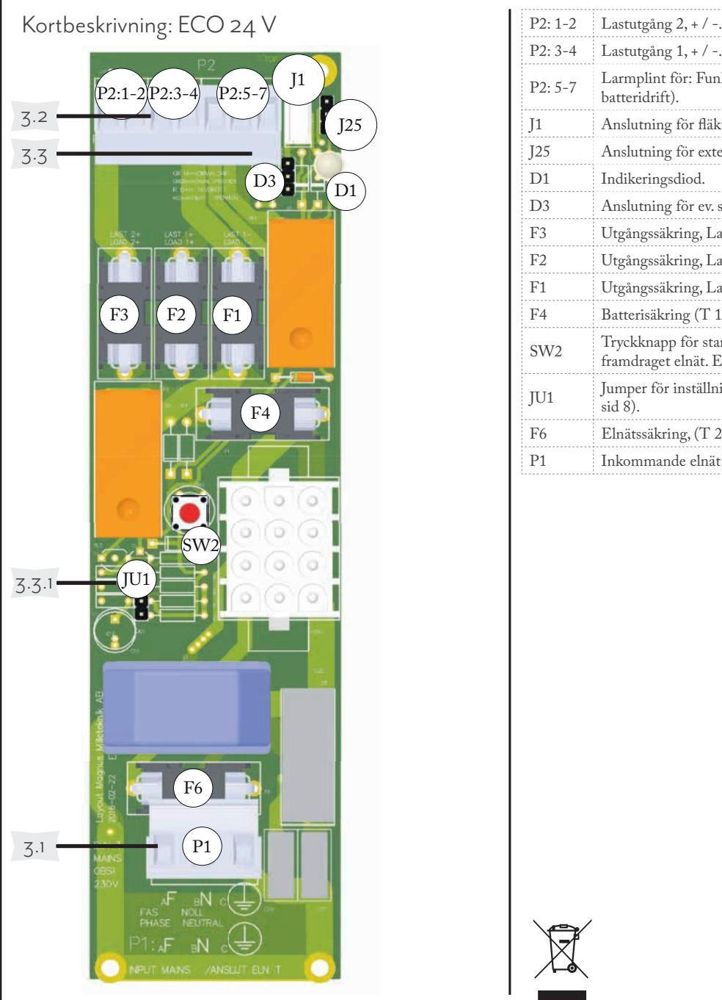

| ECO en serie är enkla och driftsäkera batteribackuper från Milleteknik. 1. Montering av XM-skåp 100 mm fritt utrymme skall ovan och under varje enhet. 340 mm + - 16 0 m + m - etc.                                                                                                                                                                                                                                                                                                                                                                                                 | 3 Anslutningar på huvudkort Vänd bladet för kortbeskrivning 3.1 Anslutning elnät Elnät (kablage): Anslut elnätskablage genom kabelge nomföringen på skåpets undersida. P1, Elnät: Använd medföljande plint för att montera elnätskablar. F=Fas. N=Nolla. PE= Skyddsjord. Anslut plint på P1 på kretskortet. 3.2 Anslutning last P2: 1-2, Last 2: Lastutgång 2, + / -, 1 polig, avsäkrad. P2: 3-4 - Last 1: Lastutgång 1, + / -, 2 polig, dubbelt avsäkrad. 3.3 Anslutning larm P2: 5-7 Larm. Larm för funktionsfel eller larm vid låg batterispänning i batteridrift. |                                                                                                                                                | 4 Driftsättning Slå till inkommande nätspänning. Systemet fungerar normalt då D1 lyser med fast grönt sken. 4.1 Systemtest: Slå till inkommande nätspänning. Lysdiod, D1, lyser grönt, normaldrift. Bryt nätspänning för att kontrollera att enheten funge rar i batteridrift och larmar. Lysdiod, D1, lyser rött. Slå till inkommande nätspänning.Lysdiod, D1, lyser grönt, normaldrift. Återställ systemet genom att lossa batterikablage samt nätspänning och anslut åter efter 5 sekunder. Underhåll Systemet med undantag för batterier är underhållsfritt vid installation i inomhusmiljö. Batteribyte • Bryt, om möjligt, nätspänning vid batteribyte. • Avlägsna säkring mellan batterierna. (Avlägsna even |
|----------------------------------------------------------------------------------------------------------------------------------------------------------------------------------------------------------------------------------------------------------------------------------------------------------------------------------------------------------------------------------------------------------------------------------------------------------------------------------------------------------------------------------------------------------------------------------------------------------------------------|--------------------------------------------------------------------------------------------------------------------------------------------------------------------------------------------------------------------------------------------------------------------------------------------------------------------------------------------------------------------------------------------------------------------------------------------------------------------------------------------------------------------------------------------------------------------------------------------------------------------------|------------------------------------------------------------------------------------------------------------------------------------------------|------------------------------------------------------------------------------------------------------------------------------------------------------------------------------------------------------------------------------------------------------------------------------------------------------------------------------------------------------------------------------------------------------------------------------------------------------------------------------------------------------------------------------------------------------------------------------------------------------------------------------------------------------------------------------------------------------------------------------------------------------------------------------|
| • Endast personer med behörighet bör installera och underhålla enheten. • Nätspänning bör vara bortkopplad när batterier kopplas in. 2. Inkoppling av batterier Batterikablage är monterat på kretskortet vid leverans. Anslutning till batterier behöver göras: • Placera batterierna i skåpet med batteripolerna utåt, mot skåpluckan. • Anslut batterikablaget från kretskortet. • Sätt fast batterisäkringen mellan batterierna. Vid montering av batterier i extern hylla/box, se separat installationsanvisning. • Bryt, om möjligt, nätspänning vid batteribyte. | 3.3.1 Larmnivåer Bygel JU1 styr larmnivå, (bygel medföljer och är EJ fabriksmonterad). Är JU1 ej monterad ges larm, när spänningen sjunker under 26,7 V, (24 V), dvs direkt vid batteridrift. Är bygel på JU1 monterad ges larm vid 24,5 V, (24 V). Larm ges när ca 50% av batteriet är urladdat. På larmplint, P2: 5-7 erhålls potentialfri reläväxling för funktionslarm vid låg ut spänning/batteridrift Larm = kontakt NO+CO (MAX 8 A, 50 V AC). 3.3 Andra anslutningar J1: Anslutning för fläkt.                                                                       | Larmnivåer Larm vid: JU1: Bygel ej 25,5 V monterad JU1:Bygel 24 V monternad Enheten levereras utan bygel på JU1. | tuellt batterisäkring på kretskort). • Notera hur batterikablar är monterade innan de avlägsnas. • Sätt in och spänn fast de nya batterierna. • Anslut batterikablarna på samma sätt som tidigare. • Sätt tillbaka säkring på kretskort, säkring/ar mellan batterierna. • Slå till nätspänning. Eventuellt kan indikeringsdio den lysa rött under ett par timmar, tills batterier är laddade. • Testa systemet genom att kortvarigt koppla bort nätspänning, (= lasten drivs vidare av batterierna), och därefter slå till nätspänningen igen.                                                                                                                                                                         |

## POWER SUPPLIES - MADE IN SWEDEN ECO 24V 3A XM, ECO 24V 5A XM, ECO 24V 10A XM

| P2: 3-4 | Lastutgång 1, + / -.                                                                                   |  |  |
|---------|--------------------------------------------------------------------------------------------------------|--|--|
| P2: 5-7 | Larmplint för: Funktionsfel / låg batterispänning (i batteridrift).                                 |  |  |
| J1      | Anslutning för fläkt.                                                                                  |  |  |
| J25     | Anslutning för extern indikeringsdiod.                                                                 |  |  |
| D1      | Indikeringsdiod.                                                                                       |  |  |
| D3      | Anslutning för ev. summerlarm.                                                                         |  |  |
| F3      | Utgångssäkring, Last 2 +, (P2:1) (Maxström).                                                           |  |  |
| F2      | Utgångssäkring, Last 1 -, (P2:4) (Maxström).                                                           |  |  |
| F1      | Utgångssäkring, Last 1 +, (P2:3) (Maxström).                                                           |  |  |
| F4      | Batterisäkring (T 16 A).                                                                               |  |  |
| SW2     | Tryckknapp för start av system i batteridrift, utan framdraget elnät. Enbart för funktionskontroll. |  |  |
| JU1     | Jumper för inställning av larmnivå på P2: 5-7, (se sid 8).                                          |  |  |
| F6      | Elnätssäkring, (T 2,5 A).                                                                              |  |  |
| P1      | Inkommande elnät Fas/Nolla/PE, skyddsjord.                                                             |  |  |

Produktdokument

| Tekniska data                          | ECO 24V 3A XM ECO 24V 5A XM ECO 24V 10A XM                                                                                                           |  |  |
|----------------------------------------|------------------------------------------------------------------------------------------------------------------------------------------------------------|--|--|
| Rekommenderad omgiv ning:           | Miljöklass 1, inomhus , 20 % ~ 90 % relativ fuktighet                                                                                                   |  |  |
| Omgivningstemperatur:                  | +5 °C till +40 °C (För bästa batterilivslängd +15 °C till +25 °C)                                                                                       |  |  |
| Kapslingsklass:                        | IP 20 vid väggmontering.                                                                                                                                   |  |  |
| Rekommenderad monte ring:           | Vägg eller 19" rack                                                                                                                                        |  |  |
| Höjdenheter                            | 5 HE                                                                                                                                                       |  |  |
| Dimensioner                            | Höjd: 209 mm Bredd: 429 mm Djup: 196 mm                                                                                                              |  |  |
| Huvudkort                              | ECO 24V                                                                                                                                                    |  |  |
| Antal avsäkrade utgångar:              | 2 st                                                                                                                                                       |  |  |
| Säkring/Säkringar på utgång:        | ECO 24 V 3A XM: 3 st. F3A ECO 24 V 5A XM: 3 st. F5A ECO 24 V 10A XM: 3 st. F10A                                                                      |  |  |
| Batterisäkring                         | T16A                                                                                                                                                       |  |  |
| Elnätssäkring                          | T2,5A Keramisk                                                                                                                                             |  |  |
| Djupurladdningsskydd vid:              | När batteripolspänning är under 21,1 V                                                                                                                     |  |  |
| djupurladdning                         | Skydd mot: Överlast, överspänning, övertemperatur, kortslutning och                                                                                        |  |  |
|                                        | Larmfunktioner: Funktionsfel (nätavbrott eller trasigt nätaggregat) eller låg batterispänning i batteridrift, 26,7 V (eller 24,5 V vid bygling av JU2). |  |  |
| Larm via:                              | Indikeringsdiod på kort och via växlande relä                                                                                                              |  |  |
| Nätaggregat                            | ECO 24 V 3A XM: 3 RS-150-24MTX ECO 24 V 5A XM: 3 RS-150-24MTX ECO 24 V 10A XM: RSP-320-24                                                            |  |  |
|                                        | Övrig information                                                                                                                                          |  |  |
| Miljödata hos SundaHus:                | Nej                                                                                                                                                        |  |  |
| Garantitid, om inte annat avtalats: | 2 år                                                                                                                                                       |  |  |
| 1).                                    | CE-märkt, uppfyller: EN50081-1, EN55011(B), EN50082-2, EN55022(B), EN61000-3-2,-3, EN61000-4,-2,-3,-4,-5,-6,-11, Level 3, (LVD EN60950-                 |  |  |
| Tillverkningsland:                     | Sverige                                                                                                                                                    |  |  |
| Tillverkare                            | Milleteknik AB Ögärdesvägen 8 B 433 30 Partille                                                                                                      |  |  |
| Kontakt                                | 031-340 02 30 www.milleteknik.se                                                                                                                        |  |  |

350-167 V1.1 200408

