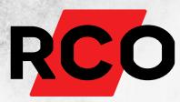
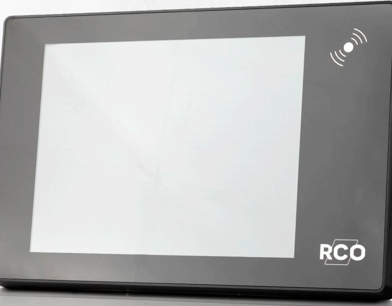
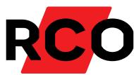
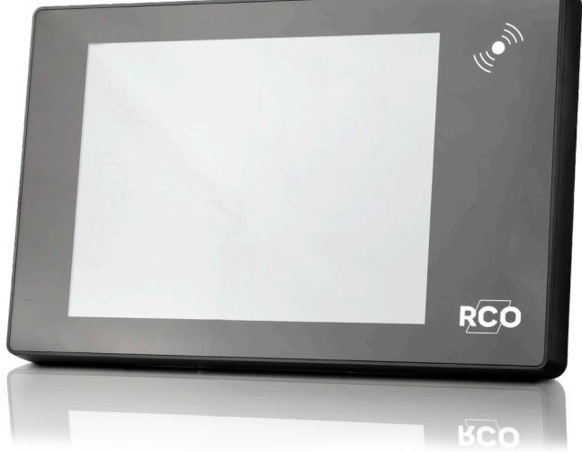

# **MapR Touch**

### **Larmpanelen som gör det enkelt att komma först och gå sist**

#### **Med MapR Touch som larmpanel får du total överblick och kontroll över din anläggning.**

Larmpanelen öppnar många möjligheter till ökad säkerhet. Nyttja en larmpanel för hela anläggningen eller en vid varje larmområde. Panelen ger total överblick över larmanläggningen och från MapR Touch kan du övervaka samt styra såväl inbrottslarm som driftslarm, dörrmiljöer och brandvarning. Det är väldigt enkelt att konfigurera systemet från R-CARD M5, larmpanelen ansluts via Lokalbuss till undercentralen UC-50 och ingår som en enhet i R-CARD M5 MEGA. Manöverpanelen presenterar OR-ritningar i skärmen och på ritningen visas samt hanteras de larmpunkter och dörrmiljöer som är

konfigurerade i MEGA-larmsystemet.

#### **Var kan den användas?**

Den lämpar sig utmärkt för platser där du vill ha en tydlig och grafisk manöverpanel som skapar total överblick och kontroll över larmanläggningen. MapR Touch är anpassad för såväl mindre som större företag och förvaltningar som vill ha en enkel men trygg övervakning och styrning av anläggningen. Larmpanelen placeras inomhus och hjälper till för att grafiskt visa om det finns öppna larmpunkter i lokalen eller om övriga larmområden är aktiverade. På skärmen kan du styra till och frånslag av larm och vid problem får du information i klartext om vilka åtgärder som ska göras. Vill du kan du till och med styra dina dörrar

direkt i panelen, vilket gör att du på ett enkelt sätt kan öppna, låsa eller tidsbestämma öppettider för specifika dörrmiljöer.

#### **Säker och smidig**

På många arbetsplatser kan hanteringen av larmet upplevas som ett problem. Den anställde vill helst slippa komma först till arbetsplatsen eller gå sist för dagen för att undvika att behöva handskas med larmet, detta av rädsla för att något ska gå fel. Med vår grafiska larmpanel blir hanteringen enkel och minskar osäkerheten för användaren.

## **MapR Touch**

#### **FÖRDELAR**

- **Smart touchpanel**
- **Larmklass 4 SSF 1014**
- **Stöd för Desfire EV2**

#### **KONTAKT OCH FÖRSÄLJNING**

Försäljning, installation och service av våra produkter sker via ett brett nät av återförsäljare (lås-, larm-, tele- och elinstallatörer).

#### **TEKNISKA DATA**

**Artikelnummer/E-Nummer:** MapR Touch PROX: 20140262/5871324

MapR Touch MIF: 20140267/5871325

**Utförande:** Svart slagtålig PC/ABS-plast och härdat glas, väggfäste i plåt

**Display:** 15" TFT

**Färg:** Svart **Anslutningar:** Lokalbuss, IP

**Kommunikationsgränssnitt:** IP, Lokalbuss RS-485

**Temperaturområde:** 5-40 °C

**Anslutningar:**  Ethernet 10/100, USB 2.0 OTG, RS485 (lokalbuss)

**Matningsspänning:** 18VDC till 30VDC SELV

**Strömförbrukning (max):**  850mA / 18V

**Produktens vikt:**  3.8 kg

**Produkten mått (BxHxD):**  462 × 301 × 38 mm

**Vikt förpackning:**  4.1 kg

**Lästeknik:**  Modell Prox (art: 20140267): EM4102/4200

Modell MIF (art: 20140267): Desfire EV2, Mifare Classic

**Systemkrav R-CARD M5:**  Version 5.48.0

**Systemkrav UC50:** Version 3.01

**SBSC Certifierad:** Larmklass 4 SSF 1014 Certnr: 8-561

**Miljöklass:** Klass1 ACE Typ A