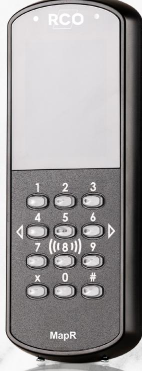
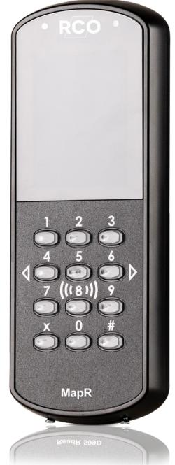

# **MapR 509**

# **Smart manöverpanel för smidig larmhantering**

# **Vår smidiga manöverpanel med enkel styrning och hantering av larmområden med frånslag, återställning och kvittering.**

Välj vilken säkerhetsnivå som gäller för hantering av larmet. Använd antingen tag eller kod eller både tag och kod tillsammans för högsta säkerhetsnivå. Det går självklart att styra behörighetsnivå och vilka tider behörigheten ska gälla för olika personer. Med grafiska symboler hanteras larmstyrningen på ett smidigt och säkert sätt. MapR 509 fungerar också som kortläsare med samma funktioner som vår populära läsare ReadR 509.

MapR 509 MIF har stöd för lästeknikerna Mifare Classic och Mifare Desfire EV2. Anslutning sker via Lokalbuss. MapR 509 MIF i R-CARD MEGA är certifierad enligt SSF 1014 larmklass 4.

#### **Var kan den användas?**

Den lämpar sig utmärkt för platser där du vill ha en smidig och enkel manöverpanel men inte har utrymme för en större modell till exempel MapR Touch. Då MapR 509 fungerar även som kortläsare är den ett bra alternativ för de platser du vill ha möjlighet att både styra ditt larm och samtidigt få passage genom en dörr. Det skulle kunna vara i en kontorsbyggnad där du på varje våningsplan vill ha möjlighet att aktivera/avaktivera ditt larm och få passera in genom en dörr. Du kan

självklart nyttja den för att skapa en kostnadseffektiv lösning med två i en lösning i nära anslutning till din första larmpunkt.

#### **Säker och smidig**

Vi har tagit fram en smidig manöverpanel för att du ska få en säker men samtidigt kostnadseffektiv produkt. Vi är övertygade att du kommer få stor nytta av MapR 509 som en del i er smarta och säkra vardag.

**MapR 509**

# **FÖRDELAR**

**•Manöverpanel och kortläsare i ett**

- **Vår smidigaste manöverpanel**
- **SSF 1014 larmklass 4**

## **KONTAKT OCH FÖRSÄLJNING**

Försäljning, installation och service av våra produkter sker via ett brett nät av återförsäljare (lås-, larm-, tele- och elinstallatörer).

## **TEKNISKA DATA**

**Artikelnummer/E-Nummer:** MapR 509 KS MIF RCO Artnr: 20140270 E nr: 5871326

MapR 509 KS PROX/MIF RCO Artnr: 20140276 E nr: 5871328

**Utförande:** Slagtålig PC/ABS-plast och härdat glas.

**Display:** 2,8-tumsdisplay i färg med QVGA-upplösning

**Färg:** Svart

**Kommunikationsgränssnitt:** Lokalbuss RS-485

**Temperaturområde:** -30 till 60 °C

**Matningsspänning:** 12-30 V DC SELV

**Strömförbrukning (max):**  Max 65 mA @ 24 V DC

**Produktens vikt:**  0,2 kg

**Produkten mått (BxHxD):**  71,3x186,4x21,4 mm

**Kapslingsklassning:** IP 43

**IK-klassning:** IK 08

**Sändarfekvens:**  13,56 MHz

**Lästeknik:**  Modell MIF: Desfire EV2, Mifare Classic

Modell PROX/MIF: Desfire EV2, Mifare Classic och EM4102/4200

**Läsavstånd:** Ca 3 cm beroende på transponder

**Inläsning som stöds:** Desfire RCO App, serienummer och sektorläsning

**Systemkrav R-CARD M5:**  Version 5.48.0

**Systemkrav UC50:** Version 3.01

**SBSC Certifierad:** Larmklass 4 SSF 1014 Certnr: 8-561