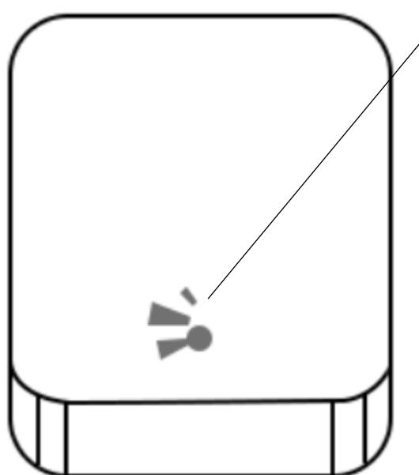
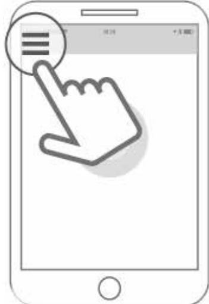
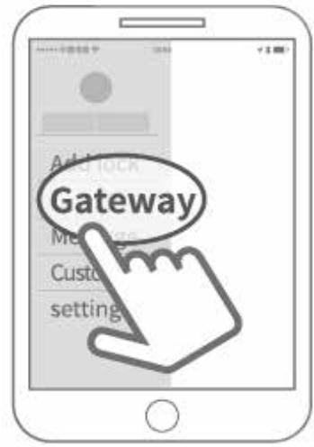
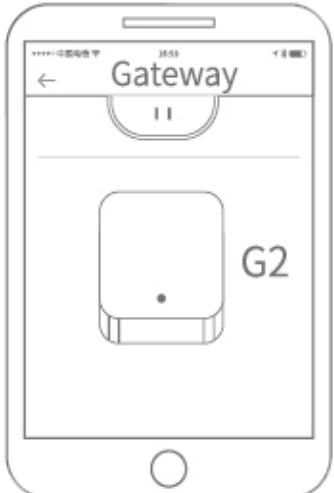
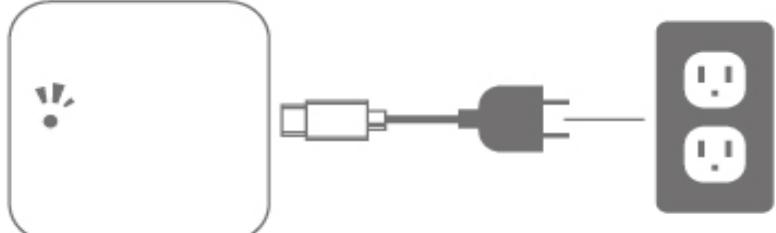
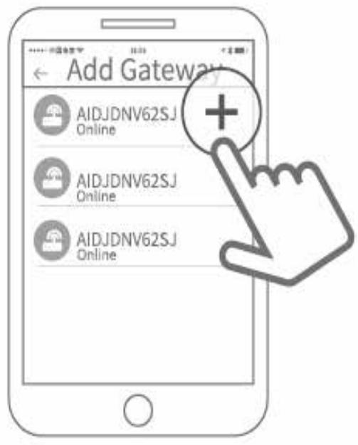
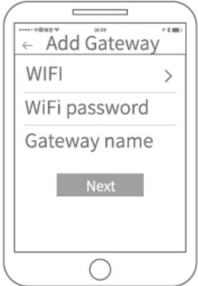
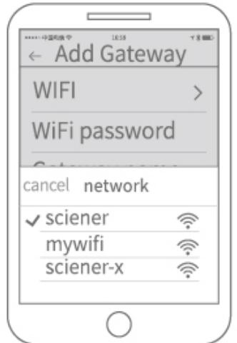

# **G2 Gateway användarmanual**

### **1. Specifikationer**

| Modell          | G2             |  |
|-----------------|----------------|--|
| Dimensioner     | 70mm*70mm*26mm |  |
| Nätverk         | WiFi 2.4G      |  |
| IEEE standard   | 802.11b/g/n    |  |
| Power interface | Type-C USB     |  |
| Power input     | DC 5V/500mA    |  |

## 2. **Ljusstatus**



När gateway är påslagen:

Ljus blinkar omväxlande blått/rött: Stand-byläge, klar för ihopparning

Blått ljus : Normalläge Rött ljus: Nätverksfel

### **3. Para ihop gateway med APP**

3.1 Starta APPEN

| ***** Digitile ***** | 16:59   | イ【■】 |
|----------------------|---------|------|
|                      |         |      |
|                      |         |      |
|                      |         |      |
|                      |         |      |
|                      | PP<br>A |      |
|                      |         |      |
|                      |         |      |
|                      |         |      |
|                      |         |      |
|                      |         |      |
|                      |         |      |
|                      |         |      |
|                      |         |      |

3.2 Tryck " "



#### 3.3 Välj "Gateway"



#### 3.4 Välj "G2"



#### 3.5 Plugga in din gateway till el, när ljuset blinkar omväxlande blått/rött



```
3.6 Tryck "+"
```


#### 3.7 Lägg till Gateway



#### 3.8 Välj nätverk och fyll i lösenord



3.9 Tillagd och klar för drift


### **4. Garanti**

4.1 Vid fel på produkten kan:

- 1) Utbyte ske inom 7 dagar från inköpsdatum.
- 2) Fri reparation utföras inom 1 år från inköpsdatum.

4.2 Garantin täcker inte fel uppkomna genom felaktig eller ovarsam använding.

Kvitto på inköp måste kunna uppvisas vid garantianspråk.