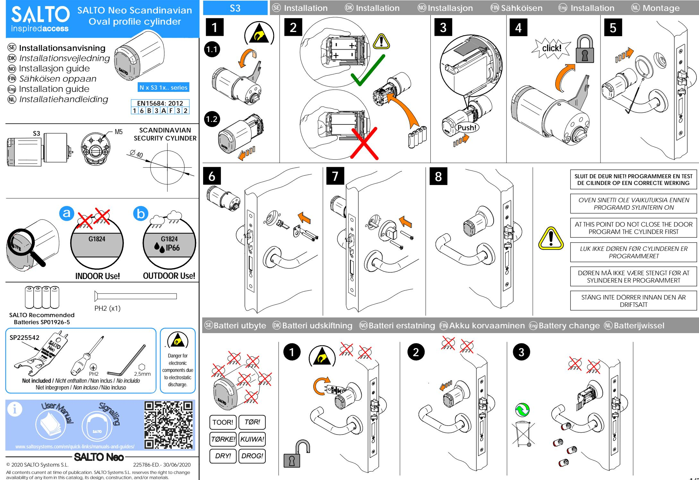
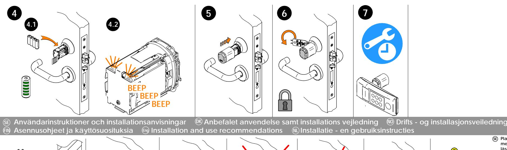
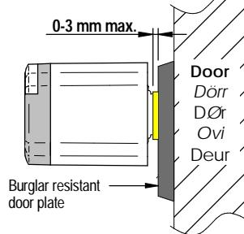
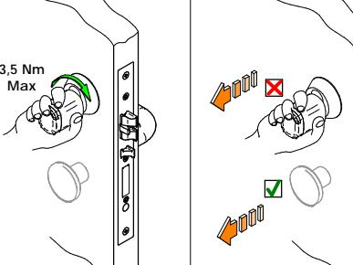
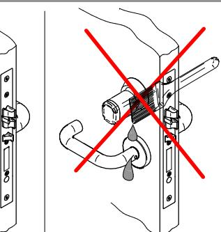
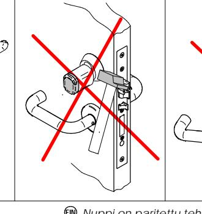
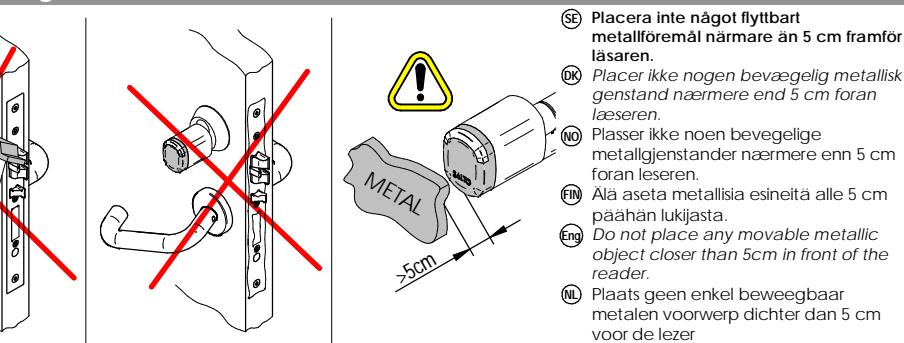

**DK**

**NO**

**SE**

**Paired!**

**Knoppen är unikt kopplad till cylindern och fungerar inte om du byter in en annan SALTO-cylindern.**

Vriderhodet er unikt paret med sylinderen, som derfor ikke fungerer med andre SALTO-sylinderen.

*Læser hovedet er unik parret med cylinderen, og vil IKKE virke ved udskiftning til en anden SALTO cylinderen.*

*Nuppi on paritettu tehtaalta sylinteriin, eikä lukko toimi mikäli se vaihdetaan toiseen SALTO-sylinteriin.***FIN**

The knob is uniquely paired to the cylinder, and will not work if you switch it in a different SALTO cylinder.**Eng**

*De knop is is uniek gekoppeld aan de cilinder en zal niet werken als u de knop op een andere SALTO cilinder plaatst.* **NL**