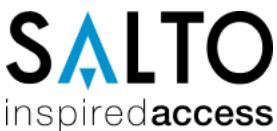
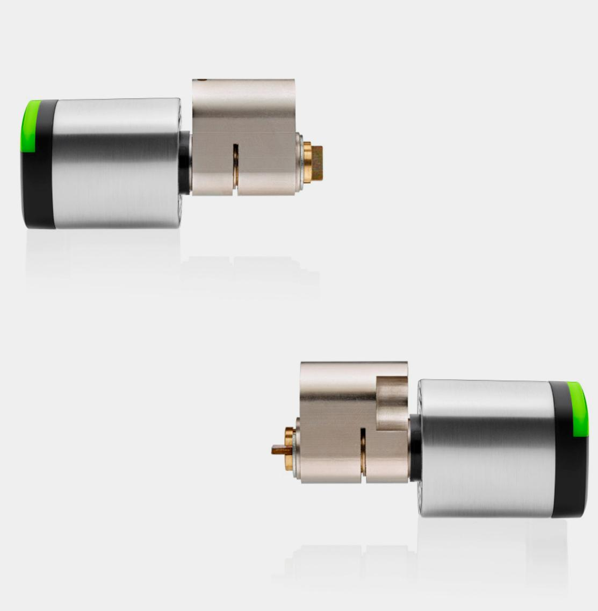
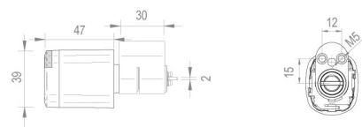
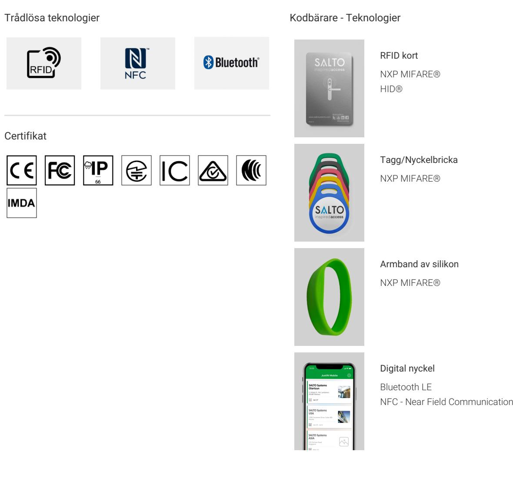

ELEKTRONISKA CYLINDRAR

# SALTO Neo - Scandinavian Oval Cylinder

SALTO Neo - Scandinavian Oval Cylinder | Tech. Specs [saltosystems.com](https://saltosystems.com)

The SALTO Neo Scandinavian external cylinder is specially designed to fit most doors that are equipped with a Scandinavian profile cylinder mortise lock. It can be a double reader in combination with the NxS2 (entrance & exit).

Copyright @ 2022 SALTO Systems S.L. All rights reserved

Elektroniska cylindrar

#### Funktioner

- SALTO SVN och BLUEnet trådlöst nätverk kompatibel.
- All kommunikation mellan kodbäraren och den elektroniska läsaren är krypterad och säker.
- Batterierna kan bytas ut utan att cylindern behöver monteras av.
- Optisk signalering genom ljusring. Dubbel färg grön / röd för att indikera behörighet. Akustisk signal valfri.
- Utrustad med antiborrskydd.
- Torxskruv som tillval för att dra åt vredet och konvertera cylindern till en fast vredcylinder.
- Lämplig för medel,- till höga säkerhetsapplikationer.
- Nödöppning via bärbar programmeringsenhet (PPD).

#### Ytbehandling

Teknisk ritning

### Tekniska egenskaper

- Passar i standard Skandinaviska dörrar.
- Standard tillbehör för skandinaviska cylindrar, säkerhetsring för cylindrar finns tillgängligt
- Can be used with most ASSA ABLOY®, ASSA / RUKO and TRIOVING lock cases.
- Olika längd på skruv och cylinder finns tillgängliga (gäller främst euro cylinder)
- För inomhus eller utomhusbruk (olika varianter)

## Färg på läsare

#### Teknikplattformar

SALTO Space

Molntjänst Digital nyckel Smart Tagg

SVN-data-on-card

SVN-Flex

BLUEnet Wireless

JustIN Mobile - Digital nyckel

#### varning:

Kontakta den lokala auktoriserade SALTO återförsäljaren eller ett SALTO kontor för en fullständig beskrivning av produktsortimentet, verifiering av den valda produktens tillgänglighet och tekniska genomförbarhet och ett kommersiellt erbjudande.

SALTO Systems förbehåller sig rätten att modifiera produkten och dess komponenter.

Teknisk information och bilder som visas på SALTO Systems produktsida är endast i informationssyfte och utformade för att informera om de viktigaste produktegenskaperna, alternativen och tekniska specifikationer. Därför ska alla bilder, illustrationer, former, funktioner, specifikationer, storlekar, data, beskrivningar och färger som visas på SALTO Systems sida endast betraktas som ungefärliga indikationer som inte är bindande.

